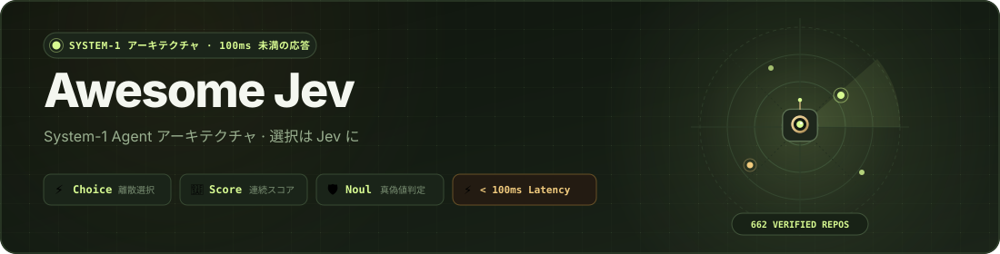

<div align="center">

<a href="https://logicrw.github.io/awesome-jev-projects/ja/"></a>

# Awesome Jev — System-1 Agent アーキテクチャ

<p align="center">
  <a href="https://awesome.re"></a>
  <a href="https://logicrw.github.io/awesome-jev-projects/ja/"></a>
  <a href="#カテゴリ"></a>
  <a href="LICENSE"></a>
  <a href="https://github.com/logicrw/awesome-jev-projects/issues/new?template=project.yml"></a>
</p>

<p align="center">
  <a href="README.md">English</a> &nbsp;•&nbsp; <a href="README.zh-CN.md">简体中文</a> &nbsp;•&nbsp; <b>日本語</b> &nbsp;•&nbsp; <a href="README.ko.md">한국어</a>
</p>

<p align="center">
  <a href="https://logicrw.github.io/awesome-jev-projects/ja/">🌐 <b>検索・絞り込み ↗</b></a> &nbsp;｜&nbsp; <a href="#agent-skill-の導入">🤖 <b>Agent Skill の導入</b></a> &nbsp;｜&nbsp; <a href="#カテゴリ">📂 <b>カテゴリ</b></a> &nbsp;｜&nbsp; <a href="https://github.com/logicrw/awesome-jev-projects/issues/new?template=project.yml">🚀 <b>プロジェクトを投稿 (Issue 経由)</b></a>
</p>

> [!TIP]
> **プロジェクトの投稿について**: Jev プロジェクトの推薦・投稿を歓迎します。本ディレクトリの収録・更新は **[GitHub Issue 専門テンプレート](https://github.com/logicrw/awesome-jev-projects/issues/new?template=project.yml)** 経由でのみ受け付けており、Pull Request は受け付けておりません。

</div>

## 💡 **なぜ Jev と System-1 意思決定アーキテクチャなのか？**

Agent を構築する際、すべての分岐判断を巨大な推論モデル（System 2）に委ねると、数秒の遅延と高いコスト、文脈ドリフトが発生します。

**TypeSafe Jev（System 1）** は、離散選択、スコアリング、真偽値判定に特化した軽量モデルです：
- ⚡ **100ms 未満の高速応答**：50–100ms で判断を完了し、Agent の高速ループを維持します。
- 🎯 **ネイティブな型安全出力**：`Choice`、`Score`、`Noul` を直接返し、壊れやすい正規表現パースが不要です。
- 🛡️ **誇大広告を排除**：17 の実用分野にわたる 662+ 件の検証済みオープンソースコードのみを厳選掲載しています。

### 📊 アーキテクチャ比較：System 1 (Jev) vs System 2 (巨大推論モデル)

| 評価軸 | System 2（LLM / 巨大推論モデル） | TypeSafe Jev（System 1 レーダー） |
| :--- | :--- | :--- |
| **応答速度** | 1,500ms – 5,000ms+（数秒の遅延） | **50ms – 100ms（ミリ秒単位の即時判断）** |
| **出力形式** | 自由文 / 壊れやすい正規表現パース | **ネイティブな型安全 `Choice`, `Score`, `Noul`** |
| **トークン費用** | 高コスト ($1.00 – $15.00 / 1M tokens) | **超軽量（通常の呼び出しのわずかな一部）** |
| **文脈ドリフト** | ハルシネーションや指示見落としのリスク | **確定的な状態遷移、形式エラーなし** |
| **エンジニアリング役割** | 高度な計画立案、長文作成、発散的思考 | **ツール選定、アクション分岐、ガードレール** |

### 🎮 主なインタラクティブ機能

- 🎰 **物理カードディスペンサー**：Jev の判断箇所をランダムに発見。ドロー数のカウントと**10連ごとの花火演出（💥 BOOM!）**に対応。
- ⚡ **固定検索バーとフローティング絞り込み**：スクロール中も追従するツールバーから、いつでもカテゴリやタグで即座に絞り込み可能。
- 🔍 **100% コミット固定のソース検証**：全プロジェクトが公開ソースコードの具体的な判断行と直接リンクしています。

> **[検索・絞り込み ↗](https://logicrw.github.io/awesome-jev-projects/ja/)** · **662 件の厳選プロジェクト**

コミュニティによって運営される Jev プロジェクトカタログです。公開ソースコードと明確な設計を持つオープンソースプロジェクトを整理し、開発者のアーキテクチャ選定を支援します。

すべての項目で公開ソースと具体的な判断箇所を確認しており、技術選定の参考として活用できます。互換実装は基盤モデルを明記しています。

利用条件は各プロジェクトのライセンスに従います。独自または未記載のライセンスは個別に表示しています。

## スポンサー · 有料掲載

最初のパートナーを募集中です。現在、有料スポンサーはいません。

[プランとお問い合わせ](https://github.com/logicrw/awesome-jev-projects/blob/main/SPONSORING.md) · [Sponsors](https://github.com/logicrw/awesome-jev-projects/blob/main/SPONSORS.md)

スポンサー契約は掲載審査、説明、通常の表示順を変えません。

## Agent Skill の導入

スキルを導入すると、ターミナルや Agent からカテゴリ別にプロジェクトを検索し、固定バージョンの実装を確認できます。

```bash
npx skills add logicrw/awesome-jev-projects
npx skills add https://logicrw.github.io/awesome-jev-projects/
```

[Agent Skill](https://logicrw.github.io/awesome-jev-projects/skill.md) · [llms.txt](https://logicrw.github.io/awesome-jev-projects/llms.txt) · [llms-full.txt](https://logicrw.github.io/awesome-jev-projects/llms-full.txt)

## カテゴリ

- [ブラウザ・デスクトップ (46)](https://logicrw.github.io/awesome-jev-projects/ja/categories/browser-os-action/)
- [CLI・パイプライン (62)](https://logicrw.github.io/awesome-jev-projects/ja/categories/cli-pipelines/)
- [分類・カタログ (2)](https://logicrw.github.io/awesome-jev-projects/ja/categories/classification-taxonomy/)
- [コード・グラフ探索 (14)](https://logicrw.github.io/awesome-jev-projects/ja/categories/codebase-graph-pathfinding/)
- [Context GC・メモリ (38)](https://logicrw.github.io/awesome-jev-projects/ja/categories/context-gc-filter/)
- [音楽・UI 制作 (20)](https://logicrw.github.io/awesome-jev-projects/ja/categories/creative-tools/)
- [データ・検索 (42)](https://logicrw.github.io/awesome-jev-projects/ja/categories/data-search/)
- [判断ツール (25)](https://logicrw.github.io/awesome-jev-projects/ja/categories/decision-tools/)
- [分野別ツール (60)](https://logicrw.github.io/awesome-jev-projects/ja/categories/domain-vertical-tools/)
- [評価・可観測性 (29)](https://logicrw.github.io/awesome-jev-projects/ja/categories/evaluation-observability/)
- [ゲーム・リアルタイム判断 (50)](https://logicrw.github.io/awesome-jev-projects/ja/categories/high-frequency-simulation/)
- [MCP・連携 (41)](https://logicrw.github.io/awesome-jev-projects/ja/categories/mcp-integrations/)
- [モデルルーティング (52)](https://logicrw.github.io/awesome-jev-projects/ja/categories/routing-cost-optimization/)
- [SDK・判断フレームワーク (115)](https://logicrw.github.io/awesome-jev-projects/ja/categories/sdk-decision-frameworks/)
- [SDK・互換連携 (6)](https://logicrw.github.io/awesome-jev-projects/ja/categories/sdk-integrations/)
- [安全対策・コンテンツ審査 (56)](https://logicrw.github.io/awesome-jev-projects/ja/categories/security-guardrails/)
- [音声・会話 (4)](https://logicrw.github.io/awesome-jev-projects/ja/categories/voice-conversation/)

## ブラウザ・デスクトップ

- [**cua**](https://github.com/trycua/cua) — Cua の試験的な jev-use 例が Driver の観察・実行と Jev の候補選択を組み合わせる。
  - **Jev が判断する箇所**: DOM または対応する視覚領域の説明を読み、提示済みの操作 ID を返す。
  - **このプロジェクトの用途**: Python と TypeScript のループと、オフライン・実 API の別々の検証経路を備える。
  - [詳細と固定バージョンのソース](https://logicrw.github.io/awesome-jev-projects/ja/projects/trycua/cua/) · ライセンス: MIT

- [**jev-ultrafast**](https://github.com/browser-use/jev-ultrafast) — Jev が操作とページ要素を選び、入力が必要なときだけテキストモデルを呼ぶブラウザー Agent。
  - **Jev が判断する箇所**: 現在の DOM から操作と対応する要素を一度に選び、入力文は別モデルが生成する。
  - **このプロジェクトの用途**: 画面上の選択、文章生成、実行を分け、各ステップを確認できる。
  - [詳細と固定バージョンのソース](https://logicrw.github.io/awesome-jev-projects/ja/projects/jev-ultrafast/) · ライセンス: MIT

- [**jev-desktop**](https://github.com/lahfir/agent-desktop) — agent-desktop のアクセシビリティ情報から操作対象を選ぶ、追加の Jev skill。
  - **Jev が判断する箇所**: Jev が対象・操作・存在確率・リスクを判定し、ローカル方針が実行を決める。
  - **このプロジェクトの用途**: 主 Agent に画面ツリー全体を渡さず、選んだ操作を確認できる。
  - [詳細と固定バージョンのソース](https://logicrw.github.io/awesome-jev-projects/ja/projects/jev-desktop/) · ライセンス: Apache-2.0

- [**typesafe-computer-use**](https://github.com/awlevin/typesafe-computer-use) — OCR と画面状態から候補を作り、Jev が macOS の操作を選ぶ。文章入力時は別モデルを使う。
  - **Jev が判断する箇所**: 抽出した要素と操作候補から次の一手を選び、実行器がデスクトップを操作する。
  - **このプロジェクトの用途**: 画面の読み取り、操作選択、文章生成を分ける。
  - [詳細と固定バージョンのソース](https://logicrw.github.io/awesome-jev-projects/ja/projects/awlevin/typesafe-computer-use/) · ライセンス: MIT

- [**Jev-cu**](https://github.com/Sac-Y/Jev-cu) — 画面の文字候補を Jev に送り、観察と実行をデスクトップツールが担う Codex ループ。
  - **Jev が判断する箇所**: 対象と操作を選び、完了やリスクを判断し、ローカル規則が実行・確認を決める。
  - **このプロジェクトの用途**: 文字候補を入力にし、既定では dry-run から始める。
  - [詳細と固定バージョンのソース](https://logicrw.github.io/awesome-jev-projects/ja/projects/sac-y/jev-cu/) · ライセンス: MIT

- [**omg.dev**](https://github.com/BennyKok/omg.dev) — omg.dev のモバイルテスト用スクリプトが、アクセシビリティツリーから次の操作を Jev に選ばせる。
  - **Jev が判断する箇所**: 対象や完了、行き詰まりを判断し、テスト実行器が画面を操作する。
  - **このプロジェクトの用途**: 現在の画面状態に基づく選択をモバイルテストへ加える。
  - [詳細と固定バージョンのソース](https://logicrw.github.io/awesome-jev-projects/ja/projects/bennykok/omg.dev/) · ライセンス: MIT

- [**jev-browser-use**](https://github.com/wy-coliney/jev-browser-use) — Codex のブラウザー作業で、Jev が移動、クリック、スクロールを選び、文字入力と最終確認は Codex が行う Skill。
  - **Jev が判断する箇所**: ページ状態と実行候補を Jev に送り、既存のブラウザー接続で操作する。
  - **このプロジェクトの用途**: 繰り返す画面選択を独立させ、既存の接続を再利用する。
  - [詳細と固定バージョンのソース](https://logicrw.github.io/awesome-jev-projects/ja/projects/wy-coliney/jev-browser-use/) · ライセンス: MIT

- [**mobile-jev**](https://github.com/droidrun/mobile-jev) — Mobilerun 経由で Android を操作し、ウェブ画面と CLI で Jev の判断を確認できる。
  - **Jev が判断する箇所**: 画面状態からアプリ、要素、次の操作を選び、Mobilerun が実行する。
  - **このプロジェクトの用途**: 操作履歴とリクエスト時間を記録する。
  - [詳細と固定バージョンのソース](https://logicrw.github.io/awesome-jev-projects/ja/projects/droidrun/mobile-jev/) · ライセンス: MIT

- [**jev-voice-browser**](https://github.com/moritzkremb/jev-voice-browser) — 音声の逐次書き起こしを Jev に送り、Playwright ブラウザを操作する。
  - **Jev が判断する箇所**: 意図、要素、URL、原文範囲を選び、命令の完結性や注意を要する操作を判断する。
  - **このプロジェクトの用途**: 音声操作中の確率、動作、リクエスト時間を表示する。
  - [詳細と固定バージョンのソース](https://logicrw.github.io/awesome-jev-projects/ja/projects/moritzkremb/jev-voice-browser/) · ライセンス: MIT

- [**jev-browser**](https://github.com/jkudish/jev-browser) — タスクと URL を受け取りブラウザを操作し、最終ページ、画像、操作履歴を返す。
  - **Jev が判断する箇所**: DOM の操作候補と完了・停滞を判断する。入力文は別のモデルが補える。
  - **このプロジェクトの用途**: 提案した操作、実行結果、停止理由を記録する。
  - [詳細と固定バージョンのソース](https://logicrw.github.io/awesome-jev-projects/ja/projects/jkudish/jev-browser/) · ライセンス: MIT

- [**jev-use**](https://github.com/savka777/jev-use) — Voice and typed computer use for macOS. You say what you want. Jev picks the next on-screen action. macOS performs it. No screenshots: the app reads the screen through the Accessibility tree.
  - **Jev が判断する箇所**: Jev returns a structured decision for the local program; consult the source for the exact decision policy.
  - **このプロジェクトの用途**: Adds structured choices or scores to the workflow; performance and cost benefits have not been independently verified.
  - [詳細と固定バージョンのソース](https://logicrw.github.io/awesome-jev-projects/ja/projects/savka777/jev-use/) · ライセンス: MIT

- [**jev-voice**](https://github.com/kevinbadi/jev-voice) — Talk to your Mac. Local whisper.cpp + one Jev (TypeSafe) call per command + macOS automation.
  - **Jev が判断する箇所**: Jev returns a structured decision for the local program; consult the source for the exact decision policy.
  - **このプロジェクトの用途**: Adds structured choices or scores to the workflow; performance and cost benefits have not been independently verified.
  - [詳細と固定バージョンのソース](https://logicrw.github.io/awesome-jev-projects/ja/projects/kevinbadi/jev-voice/) · ライセンス: MIT

- [**jev-browser**](https://github.com/Ying-Kai-Liao/jev-browser) — 呼び出し側が目標と入力文を渡し、Jev が操作を選ぶブラウザライブラリ、CLI、MCP サーバー。
  - **Jev が判断する箇所**: 要素、操作、値を選び、完了、エラー、取り消せない操作を評価する。
  - **このプロジェクトの用途**: 操作ループを計画から分け、状態と履歴を返す。
  - [詳細と固定バージョンのソース](https://logicrw.github.io/awesome-jev-projects/ja/projects/ying-kai-liao/jev-browser/) · ライセンス: MIT

- [**typesafe-adblock**](https://github.com/realZachi/typesafe-adblock) — 候補 DOM が広告かを Jev に尋ね、強調表示や削除を行う実験的 Chrome 拡張。
  - **Jev が判断する箇所**: 要素の文字、ラベル、リンク情報を Noul で評価し、閾値を適用する。
  - **このプロジェクトの用途**: 意味的な判断とページ要素の操作を結び付ける例。
  - [詳細と固定バージョンのソース](https://logicrw.github.io/awesome-jev-projects/ja/projects/realzachi/typesafe-adblock/) · ライセンス: MIT

- [**JevBrowserExt**](https://github.com/chy4pro/JevBrowserExt) — jev-ultrafast を Manifest V3 Chrome 拡張にしたもの。Jev が今のタブで操作と DOM 要素を選び、文字入力が必要なときだけ小型の対話モデルを呼ぶ。
  - **Jev が判断する箇所**: 1 リクエストで CLICK、TYPE\_TEXT、SELECT、SCROLL\_DOWN、SCROLL\_UP、PRESS\_ENTER、WAIT、DONE、BLOCKED と対応要素を選ぶ。PRESS\_ENTER は独立したキー操作。目標達成と動作停滞は別の是非問で確認する。
  - **このプロジェクトの用途**: ユーザー自身のタブで動き、スクリーンショットは撮らない。操作、対象要素、入力文を分けて確認できる。
  - [詳細と固定バージョンのソース](https://logicrw.github.io/awesome-jev-projects/ja/projects/chy4pro/jevbrowserext/) · ライセンス: MIT

- [**jev-macos-loop**](https://github.com/jcpsimmons/jev-macos-loop) — ローカル OCR とアクセシビリティ情報を使い、Jev が操作を選ぶ macOS 自動化ループ。
  - **Jev が判断する箇所**: 観測した候補から対象を選び、座標処理と入力実行は Mac が担う。
  - **このプロジェクトの用途**: Finder の操作を含め、候補と実行確認を追跡できる。
  - [詳細と固定バージョンのソース](https://logicrw.github.io/awesome-jev-projects/ja/projects/jcpsimmons/jev-macos-loop/) · ライセンス: AGPL-3.0

- [**jevfill**](https://github.com/imohitmayank/jevfill) — Open \`test/sample-form.html\` in the browser, configure the extension, and click \*\*Autofill page\*\*.
  - **Jev が判断する箇所**: Jev returns a structured decision for the local program; consult the source for the exact decision policy.
  - **このプロジェクトの用途**: Adds structured choices or scores to the workflow; performance and cost benefits have not been independently verified.
  - [詳細と固定バージョンのソース](https://logicrw.github.io/awesome-jev-projects/ja/projects/imohitmayank/jevfill/) · ライセンス: MIT

- [**jev-ego**](https://github.com/romaluev/jev-ego) — ego lite の操作要素を番号付き一覧にし、Jev が次の動作を選ぶブラウザー Agent。
  - **Jev が判断する箇所**: 一度の要求で操作と対象を選び、自由文が必要なら別の補助モデルを使う。
  - **このプロジェクトの用途**: 観測・提案・実行に対応するが、アップロードやダイアログは別のツールを使う。
  - [詳細と固定バージョンのソース](https://logicrw.github.io/awesome-jev-projects/ja/projects/romaluev/jev-ego/) · ライセンス: 記載なし

- [**jev-agent-browser**](https://github.com/forvela/jev-agent-browser) — Fast, bounded browser agents powered by Jev and agent-browser — typed actions, research, classification, and safe orchestration.
  - **Jev が判断する箇所**: Jev returns a structured decision for the local program; consult the source for the exact decision policy.
  - **このプロジェクトの用途**: Adds structured choices or scores to the workflow; performance and cost benefits have not been independently verified.
  - [詳細と固定バージョンのソース](https://logicrw.github.io/awesome-jev-projects/ja/projects/forvela/jev-agent-browser/) · ライセンス: MIT

- [**aside-jev**](https://github.com/himomohi/aside-jev) — Aside ブラウザー Agent に Jev 判断を加える MCP サーバーと skill。
  - **Jev が判断する箇所**: Agent が候補を用意し、Jev が ID を選択。Aside で実行した後に結果を確認する。
  - **このプロジェクトの用途**: 選択をアプリ側の動作表に限定し、実行結果は別途検証する。
  - [詳細と固定バージョンのソース](https://logicrw.github.io/awesome-jev-projects/ja/projects/himomohi/aside-jev/) · ライセンス: MIT

- [**AskJev**](https://github.com/ranjan2829/AskJev) — MCP で Agent とブラウザーを接続し、Jev がページ操作を選ぶ。支払いや削除などには確認を挟む。
  - **Jev が判断する箇所**: 現在のページ要素から操作を選び、リスクと取り消し可能性を評価する。
  - **このプロジェクトの用途**: 自動操作とユーザー確認を同じ手順にまとめる。
  - [詳細と固定バージョンのソース](https://logicrw.github.io/awesome-jev-projects/ja/projects/ranjan2829/askjev/) · ライセンス: MIT

- [**jev-browser**](https://github.com/tontoko/jev-browser) — Playwright と Jev を共通の CLI・MCP・TypeScript SDK から利用するブラウザー自動化ツール。
  - **Jev が判断する箇所**: ページ観測から Jev が操作・フォーム対応・抽出内容を判断し、Playwright が実行する。
  - **このプロジェクトの用途**: 永続セッションと画面回読に対応。画面確認だけでは DB 永続化の証明にならない。
  - [詳細と固定バージョンのソース](https://logicrw.github.io/awesome-jev-projects/ja/projects/tontoko/jev-browser/) · ライセンス: Apache-2.0

- [**jev-clerk**](https://github.com/stas4000/jev-clerk) — macOS で仕入先請求を会計ソフトへ入力する。Jev が閉じた操作表からクリック先を選び、深いモデルは台本だけ直す。
  - **Jev が判断する箇所**: 既定 jev-latest で /v1/systemone に POST し、各ステップで閉じた操作 Choice を聞く。
  - **このプロジェクトの用途**: 画面操作は Jev の閉じた選択に従う。作者のデモ数値は未再測。GitHub SPDX は空で、LICENSE は MIT。
  - [詳細と固定バージョンのソース](https://logicrw.github.io/awesome-jev-projects/ja/projects/stas4000/jev-clerk/) · ライセンス: 記載なし

- [**jev-yt-time-saver**](https://github.com/jaibhasin/jev-yt-time-saver) — This project integrates Jev to provide structured decisions for its workflow. See the repository for implementation details.
  - **Jev が判断する箇所**: Jev returns a structured decision for the local program; consult the source for the exact decision policy.
  - **このプロジェクトの用途**: Adds structured choices or scores to the workflow; performance and cost benefits have not been independently verified.
  - [詳細と固定バージョンのソース](https://logicrw.github.io/awesome-jev-projects/ja/projects/jaibhasin/jev-yt-time-saver/) · ライセンス: 記載なし

- [**computer-use-jev**](https://github.com/paulsmith/computer-use-jev) — macOS のアクセシビリティツリーから Jev が対象と操作を選ぶ Go 製のコントローラー。
  - **Jev が判断する箇所**: ウィンドウ状態から操作、対象、文字入力の要否、完了状態を選ぶ。
  - **このプロジェクトの用途**: 画面スナップショットに基づく候補と選択過程を確認できる。
  - [詳細と固定バージョンのソース](https://logicrw.github.io/awesome-jev-projects/ja/projects/paulsmith/computer-use-jev/) · ライセンス: MIT

- [**ego-jev**](https://github.com/jiangkoumo/ego-jev) — Drive the ego lite browser with Jev (TypeSafe System One): one indexed element table in, one operation + target out, single process. ~2x faster than a per-step LLM loop in our measurements.
  - **Jev が判断する箇所**: Jev returns a structured decision for the local program; consult the source for the exact decision policy.
  - **このプロジェクトの用途**: Adds structured choices or scores to the workflow; performance and cost benefits have not been independently verified.
  - [詳細と固定バージョンのソース](https://logicrw.github.io/awesome-jev-projects/ja/projects/jiangkoumo/ego-jev/) · ライセンス: MIT

- [**jev-browser**](https://github.com/Mrlyk/jev-browser) — Browser automation CLI for AI agents, powered by the Jev model's millisecond decisions and near-zero inference costs
  - **Jev が判断する箇所**: Jev returns a structured decision for the local program; consult the source for the exact decision policy.
  - **このプロジェクトの用途**: Adds structured choices or scores to the workflow; performance and cost benefits have not been independently verified.
  - [詳細と固定バージョンのソース](https://logicrw.github.io/awesome-jev-projects/ja/projects/mrlyk/jev-browser/) · ライセンス: Apache-2.0

- [**jev-mobile**](https://github.com/Friedjof/jev-mobile) — \`jev-mobile\` accepts a high-level task, persists it in SQLite, and lets one durable worker execute \*\*observe → normalize → decide → mutate → verify\*\* against a USB-connected Android device. Jev receives concise semantics and technically valid actions; it never generates coordinates, MCP calls, or arbitrary code.
  - **Jev が判断する箇所**: Jev returns a structured decision for the local program; consult the source for the exact decision policy.
  - **このプロジェクトの用途**: Adds structured choices or scores to the workflow; performance and cost benefits have not been independently verified.
  - [詳細と固定バージョンのソース](https://logicrw.github.io/awesome-jev-projects/ja/projects/friedjof/jev-mobile/) · ライセンス: MIT

- [**jev-shield**](https://github.com/vmendes90/jev-shield) — 情報フィードの要素が広告かを Jev で判断する Chrome 拡張。
  - **Jev が判断する箇所**: 候補 DOM をまとめて TypeSafe に送り、Noul の確率と閾値で折りたたみを決める。
  - **このプロジェクトの用途**: ローカルの広告ルールに意味に基づく判断を追加する。
  - [詳細と固定バージョンのソース](https://logicrw.github.io/awesome-jev-projects/ja/projects/vmendes90/jev-shield/) · ライセンス: MIT

- [**browser-use-with-jev**](https://github.com/garry-schuette/browser-use-with-jev) — \*\*Keep Browser Use's execution engine. Move bounded decisions to Jev.\*\*
  - **Jev が判断する箇所**: Jev returns a structured decision for the local program; consult the source for the exact decision policy.
  - **このプロジェクトの用途**: Adds structured choices or scores to the workflow; performance and cost benefits have not been independently verified.
  - [詳細と固定バージョンのソース](https://logicrw.github.io/awesome-jev-projects/ja/projects/garry-schuette/browser-use-with-jev/) · ライセンス: MIT

- [**jev-browser-local**](https://github.com/rorshopping/jev-browser-local) — Run jev-browser on a fully local JEV-style decision engine (no cloud API). Warm-browser fork, VRAM guard, measured benchmarks, run traces.
  - **Jev が判断する箇所**: Jev returns a structured decision for the local program; consult the source for the exact decision policy.
  - **このプロジェクトの用途**: Adds structured choices or scores to the workflow; performance and cost benefits have not been independently verified.
  - [詳細と固定バージョンのソース](https://logicrw.github.io/awesome-jev-projects/ja/projects/rorshopping/jev-browser-local/) · ライセンス: 記載なし

- [**jev-ra**](https://github.com/brnyxx/jev-ra) — Browser use for coding agents, 3-5x faster than browser-use. MCP server + CLI; TypeSafe Jev decides every step in ~300 ms.
  - **Jev が判断する箇所**: Jev returns a structured decision for the local program; consult the source for the exact decision policy.
  - **このプロジェクトの用途**: Adds structured choices or scores to the workflow; performance and cost benefits have not been independently verified.
  - [詳細と固定バージョンのソース](https://logicrw.github.io/awesome-jev-projects/ja/projects/brnyxx/jev-ra/) · ライセンス: MIT

- [**CUA-JEV**](https://github.com/ZJU-REAL/CUA-JEV) — The \[experimental open-task paths\](docs/OPEN\_TASKS.md) separate model planning from Jev's typed action selection. They discover browser DOM elements or Windows UI Automation controls dynamically and offer grounded structured-tool / physical-GUI alternatives without a site- or app-specific click sequence. A twelve-action browser-to-VS-Code research case now runs end to end with a model and Jev, but \*\*arbitrary-task generalization is not claimed\*\*.
  - **Jev が判断する箇所**: Jev returns a structured decision for the local program; consult the source for the exact decision policy.
  - **このプロジェクトの用途**: Adds structured choices or scores to the workflow; performance and cost benefits have not been independently verified.
  - [詳細と固定バージョンのソース](https://logicrw.github.io/awesome-jev-projects/ja/projects/zju-real/cua-jev/) · ライセンス: 記載なし

- [**ego-jev**](https://github.com/ZHUBoer/ego-jev) — Complete browser tasks with Ego Lite and actively call Jev for semantic target selection, filtering, ranking, classification and text evidence judgments.
  - **Jev が判断する箇所**: Jev returns a structured decision for the local program; consult the source for the exact decision policy.
  - **このプロジェクトの用途**: Adds structured choices or scores to the workflow; performance and cost benefits have not been independently verified.
  - [詳細と固定バージョンのソース](https://logicrw.github.io/awesome-jev-projects/ja/projects/zhuboer/ego-jev/) · ライセンス: MIT

- [**jev-browser-pilot**](https://github.com/aidil2105/jev-browser-pilot) — A bounded decision layer for browser and desktop automation: a decision-only model picks one next step; the code owns perception, content, actuation and verification.
  - **Jev が判断する箇所**: Jev returns a structured decision for the local program; consult the source for the exact decision policy.
  - **このプロジェクトの用途**: Adds structured choices or scores to the workflow; performance and cost benefits have not been independently verified.
  - [詳細と固定バージョンのソース](https://logicrw.github.io/awesome-jev-projects/ja/projects/aidil2105/jev-browser-pilot/) · ライセンス: MIT

- [**jev-browser-qa**](https://github.com/jonymusky/jev-browser-qa) — Browser QA where Playwright drives and films, and TypeSafe Jev judges. JSON-flow CLI for agents, run dashboard, agent skill.
  - **Jev が判断する箇所**: Jev returns a structured decision for the local program; consult the source for the exact decision policy.
  - **このプロジェクトの用途**: Adds structured choices or scores to the workflow; performance and cost benefits have not been independently verified.
  - [詳細と固定バージョンのソース](https://logicrw.github.io/awesome-jev-projects/ja/projects/jonymusky/jev-browser-qa/) · ライセンス: MIT

- [**jev-browser-skill**](https://github.com/zurfyx/jev-browser-skill) — Let Jev, TypeSafe's ~100ms decision model, drive your browser. A plug-and-play skill for Claude Code and Codex.
  - **Jev が判断する箇所**: Jev returns a structured decision for the local program; consult the source for the exact decision policy.
  - **このプロジェクトの用途**: Adds structured choices or scores to the workflow; performance and cost benefits have not been independently verified.
  - [詳細と固定バージョンのソース](https://logicrw.github.io/awesome-jev-projects/ja/projects/zurfyx/jev-browser-skill/) · ライセンス: MIT

- [**jev-browser-skill**](https://github.com/ChenYCL/jev-browser-skill) — Browser use & computer use for coding agents, powered by TypeSafe Jev: calibrated judgments from a System One model, control loop in code. ego lite / Chrome / Safari · CLI + MCP
  - **Jev が判断する箇所**: Jev returns a structured decision for the local program; consult the source for the exact decision policy.
  - **このプロジェクトの用途**: Adds structured choices or scores to the workflow; performance and cost benefits have not been independently verified.
  - [詳細と固定バージョンのソース](https://logicrw.github.io/awesome-jev-projects/ja/projects/chenycl/jev-browser-skill/) · ライセンス: MIT

- [**jev-mobile**](https://github.com/xinwang-nwpu/jev-mobile) — One TypeSafe Jev decision per step over the A11Y tree, executed via ADB. No screenshots and ultra fast!
  - **Jev が判断する箇所**: Jev returns a structured decision for the local program; consult the source for the exact decision policy.
  - **このプロジェクトの用途**: Adds structured choices or scores to the workflow; performance and cost benefits have not been independently verified.
  - [詳細と固定バージョンのソース](https://logicrw.github.io/awesome-jev-projects/ja/projects/xinwang-nwpu/jev-mobile/) · ライセンス: MIT

- [**ego-jev**](https://github.com/phd-peter/ego-jev) — Ego Lite のスナップショットと操作を、回数制限のある Jev 判断ループにつなぐ。
  - **Jev が判断する箇所**: 現在のスナップショットの要素と対応操作から選び、必要な入力文は別モデルで補う。
  - **このプロジェクトの用途**: 現在の参照で操作し、各段階の状態を記録する。
  - [詳細と固定バージョンのソース](https://logicrw.github.io/awesome-jev-projects/ja/projects/phd-peter/ego-jev/) · ライセンス: MIT

- [**jev-demo**](https://github.com/PenglongHuang/jev-demo) — A zero-dependency local web demo for TypeSafe's \*\*Jev (System One)\*\* decision model: send a state plus typed questions, get choices, scores and calibrated probabilities back.
  - **Jev が判断する箇所**: Jev returns a structured decision for the local program; consult the source for the exact decision policy.
  - **このプロジェクトの用途**: Adds structured choices or scores to the workflow; performance and cost benefits have not been independently verified.
  - [詳細と固定バージョンのソース](https://logicrw.github.io/awesome-jev-projects/ja/projects/penglonghuang/jev-demo/) · ライセンス: MIT

- [**jev-tweet-radar**](https://github.com/DDnim/jev-tweet-radar) — X タイムラインの各投稿を 1 回の Jev Noul で採点し、交流価値と任意タグの確率を出す Chrome 拡張。
  - **Jev が判断する箇所**: 1 回の System One で「交流する価値」と spam / buzz / AI などの Noul を聞く。
  - **このプロジェクトの用途**: タイムライン選別を生成文ではなく確認できる確率にする。投稿本文は TypeSafe に送られる。
  - [詳細と固定バージョンのソース](https://logicrw.github.io/awesome-jev-projects/ja/projects/ddnim/jev-tweet-radar/) · ライセンス: MIT

- [**jevaluate**](https://github.com/ElshinQ/jevaluate) — Jevaluate: evaluate before you trust. Field notes, runnable scripts and an agent skill for TypeSafe Jev: gated evals, a browser loop, a product walk with DeepSeek vision, a UI text judge and a first-click tree test. Co-authored with Claude Fable 5.1.
  - **Jev が判断する箇所**: Jev returns a structured decision for the local program; consult the source for the exact decision policy.
  - **このプロジェクトの用途**: Adds structured choices or scores to the workflow; performance and cost benefits have not been independently verified.
  - [詳細と固定バージョンのソース](https://logicrw.github.io/awesome-jev-projects/ja/projects/elshinq/jevaluate/) · ライセンス: MIT

- [**JevFilterForX**](https://github.com/grayrepo-byte/jev_filter_for_x) — X の投稿を Jev で採点し、ラベルを表示して、フィルターに合う投稿を再展開可能な形で折りたたむブラウザー拡張。API キー未設定時はローカルの模擬採点が既定で使われる。
  - **Jev が判断する箇所**: Jev の Choice で投稿を分類し、Score で情報量・実行可能性・独自性を採点、Noul でラベルを付ける。ローカルの閾値とノイズ規則で折りたたみを決める。
  - **このプロジェクトの用途**: X のタイムラインに採点、ラベル、調整可能な閾値を加え、投稿と添付メディアを折りたたんだ後も再表示・再非表示にできる。
  - [詳細と固定バージョンのソース](https://logicrw.github.io/awesome-jev-projects/ja/projects/grayrepo-byte/jev_filter_for_x/) · ライセンス: 記載なし

- [**jevis**](https://github.com/jaewgwon/jevis) — Flutter の integration\_test 用。許可した UI 操作を登録し、Jev が次の操作と目標達成を選ぶ。
  - **Jev が判断する箇所**: 既定 jev-latest で /v1/systemone に POST。目標は Noul、次の操作は登録済み Choice。
  - **このプロジェクトの用途**: 自然言語テストを、自由なタップではなく閉じた操作表からの選択にする。
  - [詳細と固定バージョンのソース](https://logicrw.github.io/awesome-jev-projects/ja/projects/jaewgwon/jevis/) · ライセンス: Apache-2.0

- [**cline-plugin-jev-browser**](https://github.com/abeatrix/cline-plugin-jev-browser) — 独立した Playwright ブラウザーと Vercel AI Gateway 経由の Jev 判断を使う Cline プラグイン。
  - **Jev が判断する箇所**: DOM 対象表から Jev が操作を選び、必要な入力文は別のテキストモデルが作る。
  - **このプロジェクトの用途**: 前後のスクリーンショットを保存し、重要操作は制御を返す。完了は結果確認が必要。
  - [詳細と固定バージョンのソース](https://logicrw.github.io/awesome-jev-projects/ja/projects/abeatrix/cline-plugin-jev-browser/) · ライセンス: 記載なし


## CLI・パイプライン

- [**foreman**](https://github.com/thruwire/foreman) — 作業者の diff・ログ・テストを読み、Jev の Noul で停滞・逸脱・検証を判断し、Python 方針で介入する監督ループ。
  - **Jev が判断する箇所**: 既定 jev-latest の AsyncTypeSafeClient.system\_one が監督用 Noul を送る。
  - **このプロジェクトの用途**: 監督は作業者のコードを書かない。掲載済み Shifty-Eye-Games/foreman-jev とは別リポジトリ。
  - [詳細と固定バージョンのソース](https://logicrw.github.io/awesome-jev-projects/ja/projects/thruwire/foreman/) · ライセンス: MIT

- [**orchestkit**](https://github.com/yonatangross/orchestkit) — OrchestKit は任意で Jev にコーディングセッションを分類させ、閾値を満たすと表示色に使う。
  - **Jev が判断する箇所**: 最初のタスクとブランチ状態から作業種別を選び、ローカルルールが採用か代替処理を決める。
  - **このプロジェクトの用途**: 作業種別でセッションを区別し、shadow 比較モードも使える。
  - [詳細と固定バージョンのソース](https://logicrw.github.io/awesome-jev-projects/ja/projects/yonatangross/orchestkit/) · ライセンス: MIT

- [**jev-align**](https://github.com/sutro-sh/jev-align) — 1. Evaluates the configured dataset and measures uncertainty. 2. Selects ambiguous rows plus a random audit sample for you to label. 3. Uses your accumulated labels and optional rationales to run GEPA. 4. Shows the score, certainty change, and proposed definition diff. 5. Lets you accept, reject, rewind, or resume later.
  - **Jev が判断する箇所**: Jev returns a structured decision for the local program; consult the source for the exact decision policy.
  - **このプロジェクトの用途**: Adds structured choices or scores to the workflow; performance and cost benefits have not been independently verified.
  - [詳細と固定バージョンのソース](https://logicrw.github.io/awesome-jev-projects/ja/projects/sutro-sh/jev-align/) · ライセンス: Apache-2.0

- [**JevRev**](https://github.com/Alex314618-create/JevRev) — Your LLM can imagine, write, test, and revise. It should not have to make every cheap routing decision by itself.
  - **Jev が判断する箇所**: Jev returns a structured decision for the local program; consult the source for the exact decision policy.
  - **このプロジェクトの用途**: Adds structured choices or scores to the workflow; performance and cost benefits have not been independently verified.
  - [詳細と固定バージョンのソース](https://logicrw.github.io/awesome-jev-projects/ja/projects/alex314618-create/jevrev/) · ライセンス: MIT

- [**jev-shell-history**](https://github.com/mrnugget/jev-shell-history) — Jev を利用して Zsh の履歴候補を文脈に合わせてランク付けし、Fish スタイルのインライン補完を表示する CLI ツールです。
  - **Jev が判断する箇所**: 現在の入力とローカル履歴を Jev に送信し、最も適切なコマンド候補を評価してインライン表示します（自動実行はしません）。
  - **このプロジェクトの用途**: 文字列前方一致にとどまらず、文脈に即した適切なコマンドを優先提示してシェル操作を高速化します。
  - [詳細と固定バージョンのソース](https://logicrw.github.io/awesome-jev-projects/ja/projects/mrnugget/jev-shell-history/) · ライセンス: 記載なし

- [**jev-lint**](https://github.com/mizchi/jev-lint) — lint text in code by jev scorerer
  - **Jev が判断する箇所**: Jev returns a structured decision for the local program; consult the source for the exact decision policy.
  - **このプロジェクトの用途**: Adds structured choices or scores to the workflow; performance and cost benefits have not been independently verified.
  - [詳細と固定バージョンのソース](https://logicrw.github.io/awesome-jev-projects/ja/projects/mizchi/jev-lint/) · ライセンス: MIT

- [**jgrep**](https://github.com/keltokhy/jgrep) — Filters text, structured records, functions, and diff hunks against plain-English descriptions using Jev Noul judgments.
  - **Jev が判断する箇所**: Jev judges whether each input unit matches the user description; local code applies the probability threshold and returns matching source material.
  - **このプロジェクトの用途**: Adds structured choices or scores to the workflow; performance and cost benefits have not been independently verified.
  - [詳細と固定バージョンのソース](https://logicrw.github.io/awesome-jev-projects/ja/projects/keltokhy/jgrep/) · ライセンス: MIT

- [**SemDecide**](https://github.com/sharziki/semdecide) — テキストや JSONL を判定・分類・採点・フィルタリングする Python CLI。
  - **Jev が判断する箇所**: Jev の回答確率とローカル閾値から結果と終了コードを決める。
  - **このプロジェクトの用途**: Bash や CI に型付き判断と明確な失敗状態を組み込める。
  - [詳細と固定バージョンのソース](https://logicrw.github.io/awesome-jev-projects/ja/projects/semdecide/) · ライセンス: MIT

- [**jev-skill-suggester**](https://github.com/win4r/jev-skill-suggester) — A Python CLI and Codex Skill that recommends a suitable installed skill for the current task using TypeSafe Jev Choice and Noul checks without executing candidate skills.
  - **Jev が判断する箇所**: Jev returns a structured decision for the local program; consult the source for the exact decision policy.
  - **このプロジェクトの用途**: Adds structured choices or scores to the workflow; performance and cost benefits have not been independently verified.
  - [詳細と固定バージョンのソース](https://logicrw.github.io/awesome-jev-projects/ja/projects/win4r/jev-skill-suggester/) · ライセンス: MIT

- [**jev-calibrate**](https://github.com/smkrv/jev-calibrate) — Jev is the typed-decision model from TypeSafe: it takes a \`state\` and a set of questions (\`noul\`, \`choice\`, \`score\`) and returns probabilities instead of text. How well a question works depends on its wording, on your data and on the threshold you cut at, and none of the three can be read off a single good-looking answer.
  - **Jev が判断する箇所**: Jev returns a structured decision for the local program; consult the source for the exact decision policy.
  - **このプロジェクトの用途**: Adds structured choices or scores to the workflow; performance and cost benefits have not been independently verified.
  - [詳細と固定バージョンのソース](https://logicrw.github.io/awesome-jev-projects/ja/projects/smkrv/jev-calibrate/) · ライセンス: MIT

- [**jgrep**](https://github.com/kyu1204/jgrep) — grep for what code does, not what it's called. Semantic code search powered by TypeSafe Jev.
  - **Jev が判断する箇所**: Measured (2026-09-19, jev-1.13.0): a 896-chunk TypeScript \`src/\` tree in 1.8 s for $0.010 (240k input tokens); repeat query 0 s from cache.
  - **このプロジェクトの用途**: Adds structured choices or scores to the workflow; performance and cost benefits have not been independently verified.
  - [詳細と固定バージョンのソース](https://logicrw.github.io/awesome-jev-projects/ja/projects/kyu1204/jgrep/) · ライセンス: MIT

- [**jev-axi**](https://github.com/shiftynick/jev-axi) — Jev の pick、rate、check、rank、triage、guard を使う CLI。Agent のツール実行前 hook にも対応する。
  - **Jev が判断する箇所**: 状態と選択肢を質問に変換し、結果やローカルポリシー用のリスクスコアを返す。
  - **このプロジェクトの用途**: スクリプトと Agent で同じ判断コマンドを使える。
  - [詳細と固定バージョンのソース](https://logicrw.github.io/awesome-jev-projects/ja/projects/shiftynick/jev-axi/) · ライセンス: MIT

- [**jev-cli**](https://github.com/Nasrallah-AL/jev-cli) — 検証・分類・評価の質問を文章入力やスクリプトへ接続する jevctl CLI。
  - **Jev が判断する箇所**: 入力と固定候補を Jev に送り、ローカル閾値で判断と確率を返す。
  - **このプロジェクトの用途**: パイプライン・CI 用の結果と、リクエスト確認・dry-run を提供する。
  - [詳細と固定バージョンのソース](https://logicrw.github.io/awesome-jev-projects/ja/projects/nasrallah-al/jev-cli/) · ライセンス: MIT

- [**slop-grader**](https://github.com/lukstei/slop-grader) — Rule-based CLI and agent skill that evaluates text and markdown files against custom rulesets for AI slop, grammar, and technical doc quality using Jev scores and line-by-line violation flags, then guides an AI agent to auto-fix violations.
  - **Jev が判断する箇所**: Jev returns a structured decision for the local program; consult the source for the exact decision policy.
  - **このプロジェクトの用途**: Adds structured choices or scores to the workflow; performance and cost benefits have not been independently verified.
  - [詳細と固定バージョンのソース](https://logicrw.github.io/awesome-jev-projects/ja/projects/lukstei/slop-grader/) · ライセンス: MIT

- [**jev-code**](https://github.com/rhighs/jev-code) — Jev が AST の要素を選んで Python や Bash を組み立てる実験的 CLI。単独の判断コマンドも備える。
  - **Jev が判断する箇所**: 限られた構文や操作から選択し、ローカルコードがプログラム生成やツール呼び出しを行う。
  - **このプロジェクトの用途**: コードの選択とコマンドの判断を履歴で確認できる。
  - [詳細と固定バージョンのソース](https://logicrw.github.io/awesome-jev-projects/ja/projects/rhighs/jev-code/) · ライセンス: 記載なし

- [**jev-superpowers**](https://github.com/AkashPriyadarshii/jev-superpowers) — コーディングエージェント向けの体系的開発フレームワークであり、依存関係検証、完了判定ゲート、デバッグ分岐に Jev を活用します。
  - **Jev が判断する箇所**: ワークフローのチェックポイントで Jev を呼び出し、変更の妥当性やテスト充足度を判定してエージェントの進行を制御します。
  - **このプロジェクトの用途**: 高速な離散判断によりエージェントの逸脱を防ぎ、未知の依存関係の混入やタスクの誤認完了を抑止します。
  - [詳細と固定バージョンのソース](https://logicrw.github.io/awesome-jev-projects/ja/projects/akashpriyadarshii/jev-superpowers/) · ライセンス: MIT

- [**jev-yaba-wechat**](https://github.com/wuxie888/jev-yaba-wechat) — This project integrates Jev to provide structured decisions for its workflow. See the repository for implementation details.
  - **Jev が判断する箇所**: Jev returns a structured decision for the local program; consult the source for the exact decision policy.
  - **このプロジェクトの用途**: Adds structured choices or scores to the workflow; performance and cost benefits have not been independently verified.
  - [詳細と固定バージョンのソース](https://logicrw.github.io/awesome-jev-projects/ja/projects/wuxie888/jev-yaba-wechat/) · ライセンス: MIT

- [**jsort**](https://github.com/keltokhy/jsort) — Ranks text along a plain-English criterion using pairwise Jev Noul comparisons and a locally fitted Bradley-Terry scale.
  - **Jev が判断する箇所**: Jev judges whether text A ranks higher than text B on the supplied criterion; local code schedules comparisons and fits a Bradley-Terry scale with standard errors.
  - **このプロジェクトの用途**: Adds structured choices or scores to the workflow; performance and cost benefits have not been independently verified.
  - [詳細と固定バージョンのソース](https://logicrw.github.io/awesome-jev-projects/ja/projects/keltokhy/jsort/) · ライセンス: MIT

- [**jev-test-filter**](https://github.com/mizchi/jev-test-filter) — Score every test against a git diff with Jev, and emit the filter arguments vitest, node:test, Playwright, cargo test and go test already understand
  - **Jev が判断する箇所**: Jev returns a structured decision for the local program; consult the source for the exact decision policy.
  - **このプロジェクトの用途**: Adds structured choices or scores to the workflow; performance and cost benefits have not been independently verified.
  - [詳細と固定バージョンのソース](https://logicrw.github.io/awesome-jev-projects/ja/projects/mizchi/jev-test-filter/) · ライセンス: MIT

- [**jevyoumean**](https://github.com/syumai/jevyoumean) — Unlike an edit-distance \`Did you mean?\`, \`jym\` matches on \*intent\*: it hands Jev the candidate subcommand names plus their help descriptions. \`remove → rm\`, \`list → ps\`, \`undo → restore\` are close in meaning but far in spelling — that is the gap this experiment targets.
  - **Jev が判断する箇所**: Jev returns a structured decision for the local program; consult the source for the exact decision policy.
  - **このプロジェクトの用途**: Adds structured choices or scores to the workflow; performance and cost benefits have not been independently verified.
  - [詳細と固定バージョンのソース](https://logicrw.github.io/awesome-jev-projects/ja/projects/syumai/jevyoumean/) · ライセンス: MIT

- [**jev-cli**](https://github.com/tumf/jev-cli) — テキストや JSON を Jev で判断する CLI と stdio MCP サーバー。
  - **Jev が判断する箇所**: noul・choice・score を問い、JSON または主値を出力する。
  - **このプロジェクトの用途**: ファイルと stdin に対応し、Shell スクリプトや MCP クライアントに接続できる。
  - [詳細と固定バージョンのソース](https://logicrw.github.io/awesome-jev-projects/ja/projects/tumf/jev-cli/) · ライセンス: MIT

- [**rift**](https://github.com/exYze/rift) — Rust 製コーディング端末 Rift にある、任意の TypeSafe 判断クライアント。
  - **Jev が判断する箇所**: 状態と型付き質問を System One に送り、端末処理用に回答を解析する。
  - **このプロジェクトの用途**: 生成型のコーディングモデルとは別に判断インターフェースを追加する。
  - [詳細と固定バージョンのソース](https://logicrw.github.io/awesome-jev-projects/ja/projects/exyze/rift/) · ライセンス: MIT

- [**ego-jev**](https://github.com/ZephyrDeng/ego-jev) — Jev (TypeSafe System One) inner loop for ego-browser — one ~0.4s typed decision per DOM step instead of an LLM turn. Agent skill for ego lite.
  - **Jev が判断する箇所**: Jev returns a structured decision for the local program; consult the source for the exact decision policy.
  - **このプロジェクトの用途**: Adds structured choices or scores to the workflow; performance and cost benefits have not been independently verified.
  - [詳細と固定バージョンのソース](https://logicrw.github.io/awesome-jev-projects/ja/projects/zephyrdeng/ego-jev/) · ライセンス: MIT

- [**typesafe-jev-incident-router**](https://github.com/kyle-chalmers/typesafe-jev-incident-router) — Confidence-gated incident routing with TypeSafe Jev
  - **Jev が判断する箇所**: Jev returns a structured decision for the local program; consult the source for the exact decision policy.
  - **このプロジェクトの用途**: Adds structured choices or scores to the workflow; performance and cost benefits have not been independently verified.
  - [詳細と固定バージョンのソース](https://logicrw.github.io/awesome-jev-projects/ja/projects/kyle-chalmers/typesafe-jev-incident-router/) · ライセンス: 記載なし

- [**jev-oas-sentinel**](https://github.com/ShuhanSun/jev-oas-sentinel) — JEV never writes a review or changes a specification. It returns typed decisions and probabilities; deterministic Python code decides whether to pass, request review, or block.
  - **Jev が判断する箇所**: Jev returns a structured decision for the local program; consult the source for the exact decision policy.
  - **このプロジェクトの用途**: Adds structured choices or scores to the workflow; performance and cost benefits have not been independently verified.
  - [詳細と固定バージョンのソース](https://logicrw.github.io/awesome-jev-projects/ja/projects/shuhansun/jev-oas-sentinel/) · ライセンス: Apache-2.0

- [**jevopt**](https://github.com/Ramneet-Singh/jevopt) — Making intelligent compiler optimisation decisions with Jev
  - **Jev が判断する箇所**: Jev returns a structured decision for the local program; consult the source for the exact decision policy.
  - **このプロジェクトの用途**: Adds structured choices or scores to the workflow; performance and cost benefits have not been independently verified.
  - [詳細と固定バージョンのソース](https://logicrw.github.io/awesome-jev-projects/ja/projects/ramneet-singh/jevopt/) · ライセンス: GPL-3.0

- [**jev-assist**](https://github.com/glud123/jev-assist) — Don't burn your expensive main model on grep-and-guess grunt work — let jev rank the whole repo, and save the main model for reading the right files and writing the right code.
  - **Jev が判断する箇所**: Jev returns a structured decision for the local program; consult the source for the exact decision policy.
  - **このプロジェクトの用途**: Adds structured choices or scores to the workflow; performance and cost benefits have not been independently verified.
  - [詳細と固定バージョンのソース](https://logicrw.github.io/awesome-jev-projects/ja/projects/glud123/jev-assist/) · ライセンス: MIT

- [**jev-cli**](https://github.com/jtsang4/jev-cli) — 文章や JSON を入力し、Jev に分類・Yes/No・評価を質問する CLI。
  - **Jev が判断する箇所**: 一つの入力に型付き質問を適用し、選択結果と確率を JSON で返す。
  - **このプロジェクトの用途**: 標準入力を受け取り、TypeSafe 直結と Vercel gateway に対応する。
  - [詳細と固定バージョンのソース](https://logicrw.github.io/awesome-jev-projects/ja/projects/jtsang4/jev-cli/) · ライセンス: MIT

- [**jev-cli**](https://github.com/joshLong145/jev-cli) — A CLI wrapper written in python for Jev
  - **Jev が判断する箇所**: Jev returns a structured decision for the local program; consult the source for the exact decision policy.
  - **このプロジェクトの用途**: Adds structured choices or scores to the workflow; performance and cost benefits have not been independently verified.
  - [詳細と固定バージョンのソース](https://logicrw.github.io/awesome-jev-projects/ja/projects/joshlong145/jev-cli/) · ライセンス: 記載なし

- [**jev-triage**](https://github.com/boldbug1/jev-triage) — Message triage CLI in Go, built on the Jev decision model from TypeSafe AI. Categorizes messages, scores urgency, and flags low-confidence ones for human review.
  - **Jev が判断する箇所**: Jev returns a structured decision for the local program; consult the source for the exact decision policy.
  - **このプロジェクトの用途**: Adds structured choices or scores to the workflow; performance and cost benefits have not been independently verified.
  - [詳細と固定バージョンのソース](https://logicrw.github.io/awesome-jev-projects/ja/projects/boldbug1/jev-triage/) · ライセンス: MIT

- [**jevmetrics**](https://github.com/ishantanu/jevmetrics) — Use it to assess unfamiliar instrumentation, review candidates for reduced retention, and selectively filter metrics before they reach a primary backend. Inference runs asynchronously, and cached assessments let subsequent batches use the same decision without another API call.
  - **Jev が判断する箇所**: Jev returns a structured decision for the local program; consult the source for the exact decision policy.
  - **このプロジェクトの用途**: Adds structured choices or scores to the workflow; performance and cost benefits have not been independently verified.
  - [詳細と固定バージョンのソース](https://logicrw.github.io/awesome-jev-projects/ja/projects/ishantanu/jevmetrics/) · ライセンス: Apache-2.0

- [**jevsearch**](https://github.com/kylemclaren/jevsearch) — Site search that understands the question. Ranked by TypeSafe's Jev model.
  - **Jev が判断する箇所**: Jev returns a structured decision for the local program; consult the source for the exact decision policy.
  - **このプロジェクトの用途**: Adds structured choices or scores to the workflow; performance and cost benefits have not been independently verified.
  - [詳細と固定バージョンのソース](https://logicrw.github.io/awesome-jev-projects/ja/projects/kylemclaren/jevsearch/) · ライセンス: MIT

- [**prompt2jev**](https://github.com/sumleo/prompt2jev) — Agent skill and CLI that turn natural language, an LLM prompt, or the code that runs one into a TypeSafe Jev decision: typed state, Choice/Score/Noul questions, and a runnable script
  - **Jev が判断する箇所**: Jev returns a structured decision for the local program; consult the source for the exact decision policy.
  - **このプロジェクトの用途**: Adds structured choices or scores to the workflow; performance and cost benefits have not been independently verified.
  - [詳細と固定バージョンのソース](https://logicrw.github.io/awesome-jev-projects/ja/projects/sumleo/prompt2jev/) · ライセンス: MIT

- [**typesafe-jev-calibrate-for-code-review**](https://github.com/Selmar/typesafe-jev-calibrate-for-code-review) — About calibrating Jev for code reviews
  - **Jev が判断する箇所**: Jev returns a structured decision for the local program; consult the source for the exact decision policy.
  - **このプロジェクトの用途**: Adds structured choices or scores to the workflow; performance and cost benefits have not been independently verified.
  - [詳細と固定バージョンのソース](https://logicrw.github.io/awesome-jev-projects/ja/projects/selmar/typesafe-jev-calibrate-for-code-review/) · ライセンス: 記載なし

- [**Jev\_steer\_or\_queue**](https://github.com/Larkspur-Wang/Jev_steer_or_queue) — Let TypeSafe Jev decide whether a message you send mid-turn should steer, queue, or interrupt your coding agent. Claude Code plugin; Codex CLI in testing.
  - **Jev が判断する箇所**: Jev returns a structured decision for the local program; consult the source for the exact decision policy.
  - **このプロジェクトの用途**: Adds structured choices or scores to the workflow; performance and cost benefits have not been independently verified.
  - [詳細と固定バージョンのソース](https://logicrw.github.io/awesome-jev-projects/ja/projects/larkspur-wang/jev_steer_or_queue/) · ライセンス: MIT

- [**jev-blindspot**](https://github.com/jsk4581/jev-blindspot) — A side panel for Claude Code and Codex CLI that shows the blind spots of each prompt you submit: what the request would have needed to consider and shows no sign of. Jev decides, in one call per prompt, whether the prompt is worth a second look; only then does the agent's own headless mode read the project and return the items. Nothing blocks the prompt, nothing is added to the session.
  - **Jev が判断する箇所**: Jev returns a structured decision for the local program; consult the source for the exact decision policy.
  - **このプロジェクトの用途**: Adds structured choices or scores to the workflow; performance and cost benefits have not been independently verified.
  - [詳細と固定バージョンのソース](https://logicrw.github.io/awesome-jev-projects/ja/projects/jsk4581/jev-blindspot/) · ライセンス: MIT

- [**jev-linkedin-slop-filter**](https://github.com/Arpit-Khandelwal/jev-linkedin-slop-filter) — Judges every LinkedIn post as it scrolls into view and slams a rubber stamp on it — \*\*BAIT\*\*, \*\*CORP\*\*, or \*\*BRAG\*\* — with the confidence score printed on the stamp. The post stays readable underneath.
  - **Jev が判断する箇所**: Jev returns a structured decision for the local program; consult the source for the exact decision policy.
  - **このプロジェクトの用途**: Adds structured choices or scores to the workflow; performance and cost benefits have not been independently verified.
  - [詳細と固定バージョンのソース](https://logicrw.github.io/awesome-jev-projects/ja/projects/arpit-khandelwal/jev-linkedin-slop-filter/) · ライセンス: MIT

- [**jev-mode**](https://github.com/ddfeyes/jev-mode) — I kept watching coding agents burn context on decisions that aren't hard - triage 400 tickets, tag 600 files, route to one of six teams. jev-mode moves those verdicts to a typed-judgment model. I A/B'd it: 78% fewer tokens, 16x less work-attributable input, accuracy 96.1% vs 93.7%. Python, no deps, MIT.
  - **Jev が判断する箇所**: Jev returns a structured decision for the local program; consult the source for the exact decision policy.
  - **このプロジェクトの用途**: Adds structured choices or scores to the workflow; performance and cost benefits have not been independently verified.
  - [詳細と固定バージョンのソース](https://logicrw.github.io/awesome-jev-projects/ja/projects/ddfeyes/jev-mode/) · ライセンス: MIT

- [**pytest-jev**](https://github.com/allebee/pytest-jev) — Extra state goes in \`context\`, such as a policy or the documents a RAG app retrieved. A claim can name it in backticks:
  - **Jev が判断する箇所**: Jev returns a structured decision for the local program; consult the source for the exact decision policy.
  - **このプロジェクトの用途**: Adds structured choices or scores to the workflow; performance and cost benefits have not been independently verified.
  - [詳細と固定バージョンのソース](https://logicrw.github.io/awesome-jev-projects/ja/projects/allebee/pytest-jev/) · ライセンス: MIT

- [**TypeSafe AI Playground**](https://github.com/markjaquith/typesafe-ai-playground) — 医療情報の検査、コメント確認、語調分析、業種・職業分類を試せる Rust CLI。
  - **Jev が判断する箇所**: 入力文を Jev に送り、個別の Noul 確率、スコア、分類結果を受け取る。
  - **このプロジェクトの用途**: 構造化された判断を端末で確認できる。
  - [詳細と固定バージョンのソース](https://logicrw.github.io/awesome-jev-projects/ja/projects/typesafe-ai-playground/) · ライセンス: MIT

- [**VideoAdGuard-Jev**](https://github.com/xianggelila177/VideoAdGuard-Jev) — This project integrates Jev to provide structured decisions for its workflow. See the repository for implementation details.
  - **Jev が判断する箇所**: Jev returns a structured decision for the local program; consult the source for the exact decision policy.
  - **このプロジェクトの用途**: Adds structured choices or scores to the workflow; performance and cost benefits have not been independently verified.
  - [詳細と固定バージョンのソース](https://logicrw.github.io/awesome-jev-projects/ja/projects/xianggelila177/videoadguard-jev/) · ライセンス: GPL-2.0

- [**ask-jev**](https://github.com/logicrw/ask-jev) — Ultra-fast, fail-open advisory decisions and verbatim extractive reading view for AI coding agents and CLI pipelines
  - **Jev が判断する箇所**: Jev returns a structured decision for the local program; consult the source for the exact decision policy.
  - **このプロジェクトの用途**: Adds structured choices or scores to the workflow; performance and cost benefits have not been independently verified.
  - [詳細と固定バージョンのソース](https://logicrw.github.io/awesome-jev-projects/ja/projects/logicrw/ask-jev/) · ライセンス: GPL-3.0

- [**codex-jev-preflight**](https://github.com/wellkilo/codex-jev-preflight) — Fail-open Codex UserPromptSubmit hook that injects TypeSafe Jev pre-task routing metadata.
  - **Jev が判断する箇所**: Jev returns a structured decision for the local program; consult the source for the exact decision policy.
  - **このプロジェクトの用途**: Adds structured choices or scores to the workflow; performance and cost benefits have not been independently verified.
  - [詳細と固定バージョンのソース](https://logicrw.github.io/awesome-jev-projects/ja/projects/wellkilo/codex-jev-preflight/) · ライセンス: MIT

- [**jev-browser-skill**](https://github.com/wanghai673/jev-browser-skill) — This Codex Skill lets Codex drive Chrome through Jev to complete multi-step browser tasks from a goal description with preset inputs.
  - **Jev が判断する箇所**: Jev returns a structured decision for the local program; consult the source for the exact decision policy.
  - **このプロジェクトの用途**: Adds structured choices or scores to the workflow; performance and cost benefits have not been independently verified.
  - [詳細と固定バージョンのソース](https://logicrw.github.io/awesome-jev-projects/ja/projects/wanghai673/jev-browser-skill/) · ライセンス: MIT

- [**jev-console**](https://github.com/wenchenxi/jev-console) — Jev does not generate text. You send it a \*\*state\*\* plus a set of \*\*typed questions\*\*, and it answers each one with a typed value and a calibrated probability:
  - **Jev が判断する箇所**: Jev returns a structured decision for the local program; consult the source for the exact decision policy.
  - **このプロジェクトの用途**: Adds structured choices or scores to the workflow; performance and cost benefits have not been independently verified.
  - [詳細と固定バージョンのソース](https://logicrw.github.io/awesome-jev-projects/ja/projects/wenchenxi/jev-console/) · ライセンス: MIT

- [**jev-frontier-100**](https://github.com/softpudding/jev-frontier-100) — \*\*Jev scores 77.0%; Qwen3.5 2B with a 2,048-token thinking budget scores 82.0%; Qwen3.5 4B with the same budget scores 96.7%.\*\* This small benchmark makes Jev's observed reasoning limits tangible through nine local-model settings.
  - **Jev が判断する箇所**: Jev returns a structured decision for the local program; consult the source for the exact decision policy.
  - **このプロジェクトの用途**: Adds structured choices or scores to the workflow; performance and cost benefits have not been independently verified.
  - [詳細と固定バージョンのソース](https://logicrw.github.io/awesome-jev-projects/ja/projects/softpudding/jev-frontier-100/) · ライセンス: MIT

- [**jev-model-router**](https://github.com/gualican/jev-model-router) — Routes prompts to the right Claude tier (Haiku/Sonnet/Opus) using TypeSafe's Jev model
  - **Jev が判断する箇所**: Jev returns a structured decision for the local program; consult the source for the exact decision policy.
  - **このプロジェクトの用途**: Adds structured choices or scores to the workflow; performance and cost benefits have not been independently verified.
  - [詳細と固定バージョンのソース](https://logicrw.github.io/awesome-jev-projects/ja/projects/gualican/jev-model-router/) · ライセンス: MIT

- [**jev-router**](https://github.com/AABBAASS1/jev-router) — Route any task to the right AI agent in under 1 second using Jev (TypeSafe System One). Supports Claude, ChatGPT, Cursor, and Antigravity with auto-launch on macOS, Windows, and Linux.
  - **Jev が判断する箇所**: Jev returns a structured decision for the local program; consult the source for the exact decision policy.
  - **このプロジェクトの用途**: Adds structured choices or scores to the workflow; performance and cost benefits have not been independently verified.
  - [詳細と固定バージョンのソース](https://logicrw.github.io/awesome-jev-projects/ja/projects/aabbaass1/jev-router/) · ライセンス: 記載なし

- [**jev-skills**](https://github.com/WanLanglin/jev-skills) — Claude Code & Codex skills powered by Jev, TypeSafe's System One model. 256 calibrated judgements for $0.0005 in 0.72s — 360x cheaper than Claude Opus 5. Includes the first published Jev calibration curve, measured on 4,995 real agent decisions.
  - **Jev が判断する箇所**: Jev returns a structured decision for the local program; consult the source for the exact decision policy.
  - **このプロジェクトの用途**: Adds structured choices or scores to the workflow; performance and cost benefits have not been independently verified.
  - [詳細と固定バージョンのソース](https://logicrw.github.io/awesome-jev-projects/ja/projects/wanlanglin/jev-skills/) · ライセンス: 記載なし

- [**jev-tmmluplus-eval**](https://github.com/lianghsun/jev-tmmluplus-eval) — Jev is not a chat model. You hand it a \`state\` plus a map of typed questions, and it returns one typed answer each — with calibrated probabilities and \*\*no generated text\*\*.
  - **Jev が判断する箇所**: Jev returns a structured decision for the local program; consult the source for the exact decision policy.
  - **このプロジェクトの用途**: Adds structured choices or scores to the workflow; performance and cost benefits have not been independently verified.
  - [詳細と固定バージョンのソース](https://logicrw.github.io/awesome-jev-projects/ja/projects/lianghsun/jev-tmmluplus-eval/) · ライセンス: MIT

- [**jev-toto**](https://github.com/maxlibin/jev-toto) — Counting and comparison happen in Rust, because Jev is documented as unreliable at arithmetic. Jev receives per-number facts plus plain-English labels and answers two questions per number in one request: a yes/no probability for "drawn in the next draw" and a five-level cold-to-hot score with confidence. Module layout and commands are in \`CLAUDE.md\`.
  - **Jev が判断する箇所**: Jev returns a structured decision for the local program; consult the source for the exact decision policy.
  - **このプロジェクトの用途**: Adds structured choices or scores to the workflow; performance and cost benefits have not been independently verified.
  - [詳細と固定バージョンのソース](https://logicrw.github.io/awesome-jev-projects/ja/projects/maxlibin/jev-toto/) · ライセンス: MIT

- [**jev-zork**](https://github.com/Resadan-dev/jev-zork) — Jev (TypeSafe System One) plays Zork I: one Choice per move over Jericho's valid actions, with its confidence on display. French dashboard.
  - **Jev が判断する箇所**: Jev returns a structured decision for the local program; consult the source for the exact decision policy.
  - **このプロジェクトの用途**: Adds structured choices or scores to the workflow; performance and cost benefits have not been independently verified.
  - [詳細と固定バージョンのソース](https://logicrw.github.io/awesome-jev-projects/ja/projects/resadan-dev/jev-zork/) · ライセンス: MIT

- [**jevcheck**](https://github.com/sathariels/jevcheck) — Probabilities and model versions move. A raw \`0.94\` is not a release decision. jevcheck records a \*\*production contract\*\* (baseline model + fixtures + expected answers) and evals a candidate against that fixture.
  - **Jev が判断する箇所**: Jev returns a structured decision for the local program; consult the source for the exact decision policy.
  - **このプロジェクトの用途**: Adds structured choices or scores to the workflow; performance and cost benefits have not been independently verified.
  - [詳細と固定バージョンのソース](https://logicrw.github.io/awesome-jev-projects/ja/projects/sathariels/jevcheck/) · ライセンス: MIT

- [**jevcode**](https://github.com/miounet11/jevcode) — This repository provides an Astro-based multilingual documentation site explaining Jev's Choice, Score, and Noul decision primitives with architecture patterns and usage examples.
  - **Jev が判断する箇所**: Jev returns a structured decision for the local program; consult the source for the exact decision policy.
  - **このプロジェクトの用途**: Adds structured choices or scores to the workflow; performance and cost benefits have not been independently verified.
  - [詳細と固定バージョンのソース](https://logicrw.github.io/awesome-jev-projects/ja/projects/miounet11/jevcode/) · ライセンス: 記載なし

- [**jevgrep**](https://github.com/allebee/jevgrep) — On the bundled sample (\`examples/sample.log\`, 200 lines):
  - **Jev が判断する箇所**: Jev returns a structured decision for the local program; consult the source for the exact decision policy.
  - **このプロジェクトの用途**: Adds structured choices or scores to the workflow; performance and cost benefits have not been independently verified.
  - [詳細と固定バージョンのソース](https://logicrw.github.io/awesome-jev-projects/ja/projects/allebee/jevgrep/) · ライセンス: MIT

- [**jevscript**](https://github.com/amberwhitehead/jevscript) — 意味判断を言語の原語にする初期実験。現状の実装は Jev 要求のバッチ化検証スクリプト。
  - **Jev が判断する箇所**: 個別・一括質問の回答、使用量、遅延を比較し、言語エンジン本体は設計段階。
  - **このプロジェクトの用途**: バッチ化の研究用で、完成したコンパイラーやインタープリターではない。
  - [詳細と固定バージョンのソース](https://logicrw.github.io/awesome-jev-projects/ja/projects/amberwhitehead/jevscript/) · ライセンス: 記載なし

- [**paper-radar-jev**](https://github.com/LYchoon/paper-radar-jev) — An automated research paper radar that fetches the latest papers from arXiv, evaluates their relevance to a configurable research profile using TypeSafe AI, and ranks them by relevance score. Designed for personalized, daily literature discovery across different research domains.
  - **Jev が判断する箇所**: Jev returns a structured decision for the local program; consult the source for the exact decision policy.
  - **このプロジェクトの用途**: Adds structured choices or scores to the workflow; performance and cost benefits have not been independently verified.
  - [詳細と固定バージョンのソース](https://logicrw.github.io/awesome-jev-projects/ja/projects/lychoon/paper-radar-jev/) · ライセンス: MIT

- [**pr-sieve**](https://github.com/Thestral12/pr-sieve) — \`.jev.yml\` の規則を Jev の質問にし、数値で fail / comment / pass を決める GitHub Action。
  - **Jev が判断する箇所**: 規則は最大 12 問（src/types.ts の MAX\_JEV\_QUESTIONS）。AKIA と秘密鍵装甲は src/redact.ts が当て、src/pipeline.ts が Jev を呼ばず失敗する。
  - **このプロジェクトの用途**: レビュー文もパッチも自動承認もしない。方針は base 側の設定から読む。
  - [詳細と固定バージョンのソース](https://logicrw.github.io/awesome-jev-projects/ja/projects/thestral12/pr-sieve/) · ライセンス: MIT

- [**typesafe-jev-plugin**](https://github.com/arnab621/typesafe-jev-plugin) — Jev from Typesafe.ai is a "System One" AI model that returns \*\*typed, calibrated judgments\*\* instead of generating text. You define what to classify (a Choice), score (a Score), or verify (a Noul), and Jev returns a structured answer with a probability distribution — fast, cheap, and directly consumable by code.
  - **Jev が判断する箇所**: Jev returns a structured decision for the local program; consult the source for the exact decision policy.
  - **このプロジェクトの用途**: Adds structured choices or scores to the workflow; performance and cost benefits have not been independently verified.
  - [詳細と固定バージョンのソース](https://logicrw.github.io/awesome-jev-projects/ja/projects/arnab621/typesafe-jev-plugin/) · ライセンス: 記載なし

- [**typesafe-jev-tools**](https://github.com/wotai-dev/typesafe-jev-tools) — A Claude Code hook that asks whether the decision you are writing needs a model at all. Includes a measured 149-row comparison of TypeSafe Jev against Claude Haiku 4.5.
  - **Jev が判断する箇所**: Jev returns a structured decision for the local program; consult the source for the exact decision policy.
  - **このプロジェクトの用途**: Adds structured choices or scores to the workflow; performance and cost benefits have not been independently verified.
  - [詳細と固定バージョンのソース](https://logicrw.github.io/awesome-jev-projects/ja/projects/wotai-dev/typesafe-jev-tools/) · ライセンス: MIT

- [**jev-planner**](https://github.com/rxova/jev-planner) — With \*\*N\*\* agents, \`--mode ultra\` makes \*\*2N + 1\*\* agent calls: drafts, reviews, and final synthesis, plus \*\*N\*\* if Jev requests another review. The default \`balanced\` makes as few as \*\*N + 1\*\* and never more than \`ultra\`; \`fast\` makes \*\*N\*\*, or \*\*N + 1\*\* when it merges. Each Jev evaluation is a separate TypeSafe call.
  - **Jev が判断する箇所**: Jev returns a structured decision for the local program; consult the source for the exact decision policy.
  - **このプロジェクトの用途**: Adds structured choices or scores to the workflow; performance and cost benefits have not been independently verified.
  - [詳細と固定バージョンのソース](https://logicrw.github.io/awesome-jev-projects/ja/projects/rxova/jev-planner/) · ライセンス: MIT

- [**slopcheck-jev**](https://github.com/harshpuri84/slopcheck-jev) — A prose linter that catches AI writing tells. Regex settles the 18 a pattern can settle. Jev takes the 15 that need reading, as 15 Nouls in one call, 604 ms median. It ships as a Claude Code \`Stop\` hook that scores Claude's own output after every turn and warns rather than blocks.
  - **Jev が判断する箇所**: \*\*Deleting a feature made it more accurate.\*\* The first build made a second Jev call to pin each tell to a sentence. Removing it took precision from 0.80 to 0.95 and latency from 1,365 ms to 575 ms. Jev returns typed answers rather than text, so a quote has to come from a second round of typed questions about lines, and that round was where every defect lived. The README documents the two intermediate designs that were worse.
  - **このプロジェクトの用途**: Adds structured choices or scores to the workflow; performance and cost benefits have not been independently verified.
  - [詳細と固定バージョンのソース](https://logicrw.github.io/awesome-jev-projects/ja/projects/harshpuri84/slopcheck-jev/) · ライセンス: MIT


## 分類・カタログ

- [**typesafe-jev-workflow**](https://github.com/GiesN/typesafe-jev-workflow) — 模擬メールを請求書関連と一般に分類する、非同期 LangGraph の例。
  - **Jev が判断する箇所**: Jev が invoice または general を返し、graph が処理分岐を選ぶ。
  - **このプロジェクトの用途**: モデル分類とローカル workflow の振り分けを分離する。
  - [詳細と固定バージョンのソース](https://logicrw.github.io/awesome-jev-projects/ja/projects/giesn/typesafe-jev-workflow/) · ライセンス: 記載なし

- [**jev-tree**](https://github.com/reachjalil/jev-tree) — 候補が多すぎる目録を階層化し、Jev に枝を順番に選ばせるセレクター。
  - **Jev が判断する箇所**: 各階層で一つの枝を選び、最終候補まで進む。
  - **このプロジェクトの用途**: 大きな目録の末尾を黙って切り捨てず、選択経路を返す。
  - [詳細と固定バージョンのソース](https://logicrw.github.io/awesome-jev-projects/ja/projects/reachjalil/jev-tree/) · ライセンス: MIT


## コード・グラフ探索

- [**celesto**](https://github.com/CelestoAI/celesto) — Celesto の PR レビュー例がサンドボックスで検査を準備し、通常モデルと Jev の指摘評価を比較する。
  - **Jev が判断する箇所**: 問題が今回の変更によるものか、根拠があるか、修正対象かを判断する。
  - **このプロジェクトの用途**: 実行記録とレビュー判断を同じ画面で確認できる。
  - [詳細と固定バージョンのソース](https://logicrw.github.io/awesome-jev-projects/ja/projects/celestoai/celesto/) · ライセンス: Apache-2.0

- [**Jev Review**](https://github.com/devagrawal09/jev-review) — Git diff またはコード全体を段階的に確認し、ローカル画面にレビューの手掛かりを表示する。
  - **Jev が判断する箇所**: リスク、ファイル、根拠箇所、原因、重大度を判断し、規則に従ってレビュー経路を選ぶ。
  - **このプロジェクトの用途**: 手掛かりを具体的なコードと結び付け、人が確認しやすくする。
  - [詳細と固定バージョンのソース](https://logicrw.github.io/awesome-jev-projects/ja/projects/jev-review/) · ライセンス: MIT

- [**neo4jev**](https://github.com/jexp/neo4jev) — Neo4j のグラフを一段ずつたどり、次に進む関係を Jev に選ばせる。
  - **Jev が判断する箇所**: Choice で隣接関係を評価し Noul で到達を判定、ローカルの beam search が候補経路を残す。
  - **このプロジェクトの用途**: 自然言語の目標を確認可能なグラフ経路に結び付ける。
  - [詳細と固定バージョンのソース](https://logicrw.github.io/awesome-jev-projects/ja/projects/neo4jev/) · ライセンス: MIT

- [**jev-code**](https://github.com/devagrawal09/jev-code) — コードの位置特定、変更意図の確認、テスト失敗やレビュー指摘の整理を支援する。
  - **Jev が判断する箇所**: 固定ワークフローを選び、範囲を限定した diff、コード、ログを評価する。
  - **このプロジェクトの用途**: 確認すべき手掛かりと未確認の範囲を返す。
  - [詳細と固定バージョンのソース](https://logicrw.github.io/awesome-jev-projects/ja/projects/devagrawal09/jev-code/) · ライセンス: MIT

- [**Blink**](https://github.com/ellipsis-dev/blink) — 自然言語の質問から複数の walker でディレクトリ木を探索し、ファイルを探す。
  - **Jev が判断する箇所**: Jev が名前の関連確率を評価し、コードが walker を配分する。
  - **このプロジェクトの用途**: ベクトル索引なしで探索し、各パスに到達した walker の比率を示す。
  - [詳細と固定バージョンのソース](https://logicrw.github.io/awesome-jev-projects/ja/projects/blink/) · ライセンス: 記載なし

- [**jevgrep**](https://github.com/nassim-arifette/jevgrep) — Jev-powered semantic code search for coding agents — find behavior across repositories via CLI or MCP, with exact source excerpts and line numbers.
  - **Jev が判断する箇所**: Jev returns a structured decision for the local program; consult the source for the exact decision policy.
  - **このプロジェクトの用途**: Adds structured choices or scores to the workflow; performance and cost benefits have not been independently verified.
  - [詳細と固定バージョンのソース](https://logicrw.github.io/awesome-jev-projects/ja/projects/nassim-arifette/jevgrep/) · ライセンス: MIT

- [**commit-miner**](https://github.com/devanshbatham/commit-miner) — Git のメッセージと diff を Jev で分類し、バグ修正、安全性修正、CWE、変更種別を整理する。
  - **Jev が判断する箇所**: 固定カテゴリを質問し、フィルターや HTML/CSV レポート用に保存する。
  - **このプロジェクトの用途**: 大量の履歴を追加確認しやすい分類記録にする。
  - [詳細と固定バージョンのソース](https://logicrw.github.io/awesome-jev-projects/ja/projects/devanshbatham/commit-miner/) · ライセンス: 記載なし

- [**jev**](https://github.com/BorisLeMeec/jev) — ファイル検索、コード全体への限定質問、大きな読み取りを Jev で扱う Go 製 Claude Code プラグイン。
  - **Jev が判断する箇所**: ファイル全体を Agent に渡す前に、質問との関連性を選別・確認する。
  - **このプロジェクトの用途**: 確認対象を絞るためのファイル位置と判断を返す。
  - [詳細と固定バージョンのソース](https://logicrw.github.io/awesome-jev-projects/ja/projects/borislemeec/jev/) · ライセンス: MIT

- [**claude-jev**](https://github.com/buchmark/claude-jev) — Claude Code の指摘、原因仮説、設計案、検索結果に Jev の確認を追加する。
  - **Jev が判断する箇所**: 候補の問題や選択肢を定義済みの質問で評価し、ローカル規則で処理する。
  - **このプロジェクトの用途**: 追加判断と確率を残し、判断の違いを確認できる。
  - [詳細と固定バージョンのソース](https://logicrw.github.io/awesome-jev-projects/ja/projects/buchmark/claude-jev/) · ライセンス: MIT

- [**leanest**](https://github.com/baronunread/leanest) — diff とテストソースを使い、既存テストランナーの前に Jev 選別を加える。
  - **Jev が判断する箇所**: 関連性を Jev が判断し、不確実・API 障害・テスト自身の変更時はローカル方針で実行する。
  - **このプロジェクトの用途**: shadow モードで比較できるが、選別後のテストだけで漏れがないとは保証しない。
  - [詳細と固定バージョンのソース](https://logicrw.github.io/awesome-jev-projects/ja/projects/baronunread/leanest/) · ライセンス: MIT

- [**PiJ**](https://github.com/tonyzdev/PiJ) — 主モデルが推論・編集・ツール実行を担い、Jev が補助判断する Pi ベースのターミナル Agent。
  - **Jev が判断する箇所**: skill 提案・実在するソース候補の再順位付け・失敗分類を行い、自動再試行や権限承認はしない。
  - **このプロジェクトの用途**: パス・行番号・ソース・エラーを保持。作者の限定実験は一般的効果の保証ではない。
  - [詳細と固定バージョンのソース](https://logicrw.github.io/awesome-jev-projects/ja/projects/tonyzdev/pij/) · ライセンス: MIT

- [**jev-graphrag**](https://github.com/neo4j-field/jev-graphrag) — Small demos + use-case backlog: TypeSafe AI's Jev as a calibrated decision layer for GraphRAG pipelines on Neo4j.
  - **Jev が判断する箇所**: Jev returns a structured decision for the local program; consult the source for the exact decision policy.
  - **このプロジェクトの用途**: Adds structured choices or scores to the workflow; performance and cost benefits have not been independently verified.
  - [詳細と固定バージョンのソース](https://logicrw.github.io/awesome-jev-projects/ja/projects/neo4j-field/jev-graphrag/) · ライセンス: 記載なし

- [**jev-review-action**](https://github.com/fatwang2/jev-review-action) — ディレクトリ投稿の確認や PR 分類を行い、定型コメントを更新する GitHub Action。
  - **Jev が判断する箇所**: 固定版の根拠や PR 差分について方針の質問に答え、コードが分類規則を適用する。
  - **このプロジェクトの用途**: 質問、しきい値、コメント形式を確認可能な設定に置く。
  - [詳細と固定バージョンのソース](https://logicrw.github.io/awesome-jev-projects/ja/projects/fatwang2/jev-review-action/) · ライセンス: MIT

- [**jevex**](https://github.com/jimmyhealer/jevex) — One MCP tool that returns the files a coding agent should read.
  - **Jev が判断する箇所**: Jev returns a structured decision for the local program; consult the source for the exact decision policy.
  - **このプロジェクトの用途**: Adds structured choices or scores to the workflow; performance and cost benefits have not been independently verified.
  - [詳細と固定バージョンのソース](https://logicrw.github.io/awesome-jev-projects/ja/projects/jimmyhealer/jevex/) · ライセンス: MIT


## Context GC・メモリ

- [**fast-jev-compaction**](https://github.com/tamaratran/fast-jev-compaction) — Claude Code の古いツール呼び出しと結果を削減し、残す内容は原文のまま保持する。
  - **Jev が判断する箇所**: 呼び出しと結果全体の必要性を別々に判断し、コードが保持・短縮・削除する。
  - **このプロジェクトの用途**: パス、コマンド、エラーを新しい要約に書き換えずに扱える。
  - [詳細と固定バージョンのソース](https://logicrw.github.io/awesome-jev-projects/ja/projects/tamaratran/fast-jev-compaction/) · ライセンス: MIT

- [**jev-pruner**](https://github.com/tamaratran/jev-pruner) — Bash 実行後、主モデルへ渡す前に一部の出力を絞る Claude Code プラグイン。
  - **Jev が判断する箇所**: 長さと内容を確認してから Jev が保持する塊を選び、原文は別途保存する。
  - **このプロジェクトの用途**: 短い出力・エラー・認識された構造化データやソースは変更せず通す。
  - [詳細と固定バージョンのソース](https://logicrw.github.io/awesome-jev-projects/ja/projects/tamaratran/jev-pruner/) · ライセンス: MIT

- [**bluenoise**](https://github.com/rokcso/bluenoise) — X/Twitter の投稿や返信をローカルルールで整理し、未一致の返信だけ任意で Jev に確認させる拡張。
  - **Jev が判断する箇所**: 実験的 AI を有効にすると、ルールに該当しない返信を評価し、閾値で非表示を決める。
  - **このプロジェクトの用途**: 可逆なローカルルールを先に適用し、必要に応じてモデル判断を追加する。
  - [詳細と固定バージョンのソース](https://logicrw.github.io/awesome-jev-projects/ja/projects/rokcso/bluenoise/) · ライセンス: MIT

- [**Winnow**](https://github.com/GhalebDweikat/winnow) — Claude Code の不要なツール出力を隠し、原文を後から呼び戻せるフィルター。
  - **Jev が判断する箇所**: Jev が出力の関連性を判定し、ローカルの閾値で必要・不確かな部分を残す。
  - **このプロジェクトの用途**: 表示する情報を絞りつつ、隠した原文を取得できる。
  - [詳細と固定バージョンのソース](https://logicrw.github.io/awesome-jev-projects/ja/projects/winnow/) · ライセンス: MIT

- [**Jev-Mem**](https://github.com/libingzheren/Jev-Mem) — \*\*Better memory for long-running AI agents—with fast decisions and focused reasoning.\*\*
  - **Jev が判断する箇所**: Jev returns a structured decision for the local program; consult the source for the exact decision policy.
  - **このプロジェクトの用途**: Adds structured choices or scores to the workflow; performance and cost benefits have not been independently verified.
  - [詳細と固定バージョンのソース](https://logicrw.github.io/awesome-jev-projects/ja/projects/libingzheren/jev-mem/) · ライセンス: MIT

- [**jev-recall**](https://github.com/samdotmak/jev-recall) — Retrieve by relevance, not resemblance: filter an AI assistant's memories with TypeSafe's Jev
  - **Jev が判断する箇所**: Jev returns a structured decision for the local program; consult the source for the exact decision policy.
  - **このプロジェクトの用途**: Adds structured choices or scores to the workflow; performance and cost benefits have not been independently verified.
  - [詳細と固定バージョンのソース](https://logicrw.github.io/awesome-jev-projects/ja/projects/samdotmak/jev-recall/) · ライセンス: MIT

- [**jev-use**](https://github.com/shitianfang/jev-use) — Claude Code / Codex / pi plugin that hands agent steps needing no text output to Jev (TypeSafe's judgment model) — measured p50 ~230 ms and ~$0.02 per 1,000 judgments, with typed escalation back to the LLM
  - **Jev が判断する箇所**: Jev returns a structured decision for the local program; consult the source for the exact decision policy.
  - **このプロジェクトの用途**: Adds structured choices or scores to the workflow; performance and cost benefits have not been independently verified.
  - [詳細と固定バージョンのソース](https://logicrw.github.io/awesome-jev-projects/ja/projects/shitianfang/jev-use/) · ライセンス: MIT

- [**yoshi**](https://github.com/compozy/yoshi) — Claude Code や Codex 向けのコンテキスト削減プロキシであり、Jev を使って履歴の必要性を評価しツールプロトコルを維持したまま剪定します。
  - **Jev が判断する箇所**: プロキシ層でリクエストをインターセプトし、Jev が不要と判断した試行錯誤ログを除去してから上位モデルへ転送します。
  - **このプロジェクトの用途**: 入力トークン数と初期応答時間を削減しつつ、既存クライアントのツール呼び出しプロトコルとの完全な互換性を保ちます。
  - [詳細と固定バージョンのソース](https://logicrw.github.io/awesome-jev-projects/ja/projects/compozy/yoshi/) · ライセンス: MIT

- [**azdaja**](https://github.com/kubet/azdaja) — Bare, open-source RLM layer for existing coding agents
  - **Jev が判断する箇所**: Jev receives selected source material and explicit questions. It can rank passages, classify records, assess whether evidence supports a claim and judge whether records match for semantic joins. Its returned probabilities let the RLM compare results and decide what to inspect, combine or explore next.
  - **このプロジェクトの用途**: Adds structured choices or scores to the workflow; performance and cost benefits have not been independently verified.
  - [詳細と固定バージョンのソース](https://logicrw.github.io/awesome-jev-projects/ja/projects/kubet/azdaja/) · ライセンス: MIT

- [**elons-job**](https://github.com/bugkiwi/elons-job) — Local-first Chrome extension that uses Jev to filter sexual and solicitation content in X replies with reversible hidden placeholders.
  - **Jev が判断する箇所**: Scores X reply text with Jev Noul questions for sexual content, solicitation, and spam, then combines probabilities with local thresholds and structural signals.
  - **このプロジェクトの用途**: Combines local rules, caching, concurrency and cost controls, and fail-open handling; it requires no X API and keeps hidden comments recoverable.
  - [詳細と固定バージョンのソース](https://logicrw.github.io/awesome-jev-projects/ja/projects/bugkiwi/elons-job/) · ライセンス: MIT

- [**jev-chat-for-twitch**](https://github.com/ethanplusai/jev-chat-for-twitch) — Filter any live Twitch chat with Jev: a bring-your-own-key Chrome extension
  - **Jev が判断する箇所**: Jev returns a structured decision for the local program; consult the source for the exact decision policy.
  - **このプロジェクトの用途**: Adds structured choices or scores to the workflow; performance and cost benefits have not been independently verified.
  - [詳細と固定バージョンのソース](https://logicrw.github.io/awesome-jev-projects/ja/projects/ethanplusai/jev-chat-for-twitch/) · ライセンス: MIT

- [**jevlogs**](https://github.com/reachjalil/jevlogs) — OpenTelemetry ログに Jev の診断価値、優先度、振り分け判断を付ける。
  - **Jev が判断する箇所**: 各ログを評価し、追加のモデル解析に回す価値があるか判断する。
  - **このプロジェクトの用途**: 既存の保存経路を維持しながら判断を追記できる。
  - [詳細と固定バージョンのソース](https://logicrw.github.io/awesome-jev-projects/ja/projects/reachjalil/jevlogs/) · ライセンス: MIT

- [**pi-fast-jev-compaction**](https://github.com/joelhooks/pi-fast-jev-compaction) — 古いツール履歴を原文のまま整理し、必要なら Pi 標準の要約へ渡す拡張。
  - **Jev が判断する箇所**: モデルに送る履歴で、呼び出しと結果を残す必要があるか判断する。
  - **このプロジェクトの用途**: 元のセッションファイルを保持し、削減の判断を記録する。
  - [詳細と固定バージョンのソース](https://logicrw.github.io/awesome-jev-projects/ja/projects/joelhooks/pi-fast-jev-compaction/) · ライセンス: MIT

- [**omp-jev-compaction**](https://github.com/jerryfane/omp-jev-compaction) — Oh My Pi のツール履歴を整理し、判断を再利用して先頭部分の書き換えを抑える拡張。
  - **Jev が判断する箇所**: Jev が呼び出しと結果の必要性を判断し、選択した内容を復元用の注記付きで短縮する。
  - **このプロジェクトの用途**: 削減判断を記憶して後のリクエストに適用する。
  - [詳細と固定バージョンのソース](https://logicrw.github.io/awesome-jev-projects/ja/projects/jerryfane/omp-jev-compaction/) · ライセンス: MIT

- [**pi-jev-context**](https://github.com/Nyarlathoteppppp/pi-jev-context) — Model performance first. Token savings second. A Pi extension with freshness-aware read dedupe, Jev log filtering, and searchable verbatim recall. Keeps existing message history intact.
  - **Jev が判断する箇所**: Jev returns a structured decision for the local program; consult the source for the exact decision policy.
  - **このプロジェクトの用途**: Adds structured choices or scores to the workflow; performance and cost benefits have not been independently verified.
  - [詳細と固定バージョンのソース](https://logicrw.github.io/awesome-jev-projects/ja/projects/nyarlathoteppppp/pi-jev-context/) · ライセンス: MIT

- [**deepseek-harness-jev-pre-compaction**](https://github.com/wjw66/deepseek-harness-jev-pre-compaction) — A pre-compaction advisor for DeepSeek Harness. Runs before the standard \`compaction-basic\` backend, using TypeSafe JEV to safely prune low-value tool results from model context. Original session events stay in the append-only log; only the model-visible view is replaced with compact markers or archive pointers to reduce context bloat.
  - **Jev が判断する箇所**: Jev returns a structured decision for the local program; consult the source for the exact decision policy.
  - **このプロジェクトの用途**: Adds structured choices or scores to the workflow; performance and cost benefits have not been independently verified.
  - [詳細と固定バージョンのソース](https://logicrw.github.io/awesome-jev-projects/ja/projects/wjw66/deepseek-harness-jev-pre-compaction/) · ライセンス: MIT

- [**fast-dev-compaction**](https://github.com/leonaaardob/fast-dev-compaction) — セッションフック内で Jev を活用し、必要な履歴情報を保持しながら不要なログを間引く Codex 向けコンテキスト圧縮プラグインです。
  - **Jev が判断する箇所**: コンテキスト長の上限に近づいた際、Jev が各履歴やツール出力の重要度を判定し、重要な情報のみを残して圧縮します。
  - **このプロジェクトの用途**: 単純な切り捨てや過度な要約による情報の欠落を防ぎ、長時間のコーディングセッションでも文脈を維持できます。
  - [詳細と固定バージョンのソース](https://logicrw.github.io/awesome-jev-projects/ja/projects/leonaaardob/fast-dev-compaction/) · ライセンス: MIT

- [**jev-compaction**](https://github.com/Waxmell114514/jev-compaction) — A context compactor that can only score, never write — so an agent's memory can't hold a fact the transcript never contained. Working demo, runs offline.
  - **Jev が判断する箇所**: Jev returns a structured decision for the local program; consult the source for the exact decision policy.
  - **このプロジェクトの用途**: Adds structured choices or scores to the workflow; performance and cost benefits have not been independently verified.
  - [詳細と固定バージョンのソース](https://logicrw.github.io/awesome-jev-projects/ja/projects/waxmell114514/jev-compaction/) · ライセンス: MIT

- [**jev-skill-gate**](https://github.com/ShivamPansuriya/jev-skill-gate) — 現在のプロジェクトに対する Claude Code スキルの関連度を付け、初期表示する説明を絞る。
  - **Jev が判断する箇所**: 技術構成、ディレクトリ、README に照らして関連性を判定し、説明の表示を調整する。
  - **このプロジェクトの用途**: 必要な説明を残し、ほかのスキルも手動で呼び出せる。
  - [詳細と固定バージョンのソース](https://logicrw.github.io/awesome-jev-projects/ja/projects/shivampansuriya/jev-skill-gate/) · ライセンス: MIT

- [**alphaoptimizer**](https://github.com/alpha-tales/alphaoptimizer) — AlphaOptimizer is an open-source tool from AlphaTales that helps Codex work with large command and tool outputs. Instead of sending a huge log or search result straight into the context window, AlphaOptimizer keeps the useful parts visible, keeps the original output available for a limited time, and uses Jev to help rank what matters when an API key is configured.
  - **Jev が判断する箇所**: Jev returns a structured decision for the local program; consult the source for the exact decision policy.
  - **このプロジェクトの用途**: Adds structured choices or scores to the workflow; performance and cost benefits have not been independently verified.
  - [詳細と固定バージョンのソース](https://logicrw.github.io/awesome-jev-projects/ja/projects/alpha-tales/alphaoptimizer/) · ライセンス: MIT

- [**codex-jev-compaction**](https://github.com/Wang-auspicious/codex-jev-compaction) — Jev で過去のツール記録を選別し、採用した原文を残す Codex 向け引き継ぎ支援。
  - **Jev が判断する箇所**: 対象となる読み取り専用記録の関連性を判断し、必須内容を保護して引き継ぎ資料を作る。
  - **このプロジェクトの用途**: 出典、選別理由、原文の順序を残す。
  - [詳細と固定バージョンのソース](https://logicrw.github.io/awesome-jev-projects/ja/projects/wang-auspicious/codex-jev-compaction/) · ライセンス: MIT

- [**fast-compaction-dsh**](https://github.com/kolawong/fast-compaction-dsh) — Verdict-based context compaction for DeepSeek Harness — replaces lossy LLM summaries with fast keep/truncate/drop decisions from jev-latest; everything kept stays verbatim. Port of tamaratran/fast-jev-compaction.
  - **Jev が判断する箇所**: Jev returns a structured decision for the local program; consult the source for the exact decision policy.
  - **このプロジェクトの用途**: Adds structured choices or scores to the workflow; performance and cost benefits have not been independently verified.
  - [詳細と固定バージョンのソース](https://logicrw.github.io/awesome-jev-projects/ja/projects/kolawong/fast-compaction-dsh/) · ライセンス: 記載なし

- [**pi-jev-compaction**](https://github.com/nourhelmi/pi-jev-compaction) — Automatic Jev context clearing for Pi. Keep the conversation, prune stale tool output, retrieve originals without rerunning commands.
  - **Jev が判断する箇所**: Jev returns a structured decision for the local program; consult the source for the exact decision policy.
  - **このプロジェクトの用途**: Adds structured choices or scores to the workflow; performance and cost benefits have not been independently verified.
  - [詳細と固定バージョンのソース](https://logicrw.github.io/awesome-jev-projects/ja/projects/nourhelmi/pi-jev-compaction/) · ライセンス: MIT

- [**jev-skill-selection**](https://github.com/redreamality/jev-skill-selection) — Pre-message hook: use TypeSafe Jev to keep/drop skills and shrink agent context
  - **Jev が判断する箇所**: Jev returns a structured decision for the local program; consult the source for the exact decision policy.
  - **このプロジェクトの用途**: Adds structured choices or scores to the workflow; performance and cost benefits have not been independently verified.
  - [詳細と固定バージョンのソース](https://logicrw.github.io/awesome-jev-projects/ja/projects/redreamality/jev-skill-selection/) · ライセンス: MIT

- [**jev-skills**](https://github.com/eran-broder/jev-skills) — Skills without the context tax. Claude Code and Codex plugin: TypeSafe's Jev decides on every turn which skills the model sees. Always-on context cost: 0 tokens.
  - **Jev が判断する箇所**: Jev returns a structured decision for the local program; consult the source for the exact decision policy.
  - **このプロジェクトの用途**: Adds structured choices or scores to the workflow; performance and cost benefits have not been independently verified.
  - [詳細と固定バージョンのソース](https://logicrw.github.io/awesome-jev-projects/ja/projects/eran-broder/jev-skills/) · ライセンス: MIT

- [**pi-fast-jev-compaction**](https://github.com/KamilPostrozny/pi-fast-jev-compaction) — Fast JEV compaction extension for pi
  - **Jev が判断する箇所**: Jev returns a structured decision for the local program; consult the source for the exact decision policy.
  - **このプロジェクトの用途**: Adds structured choices or scores to the workflow; performance and cost benefits have not been independently verified.
  - [詳細と固定バージョンのソース](https://logicrw.github.io/awesome-jev-projects/ja/projects/kamilpostrozny/pi-fast-jev-compaction/) · ライセンス: MIT

- [**pi-jev-context**](https://github.com/kevinpita/pi-jev-context) — 古いメッセージの有用性を Jev で判断する Pi の可逆コンテキストフィルター。
  - **Jev が判断する箇所**: 履歴断片を評価し、低評価部分を今後の要求から隠すが会話原本は保持する。
  - **このプロジェクトの用途**: 無効化で全コンテキストへ戻せる。有効時は一部履歴を TypeSafe へ送る。
  - [詳細と固定バージョンのソース](https://logicrw.github.io/awesome-jev-projects/ja/projects/kevinpita/pi-jev-context/) · ライセンス: MIT

- [**your-signal**](https://github.com/MithrilMan/your-signal) — 自分のキーで Jev に X の投稿を好み別に採点させ、表示を調整する Chrome 拡張。
  - **Jev が判断する箇所**: 関連性、内容、実用性、宣伝傾向を評価し、ローカルの重みと閾値で表示を決める。
  - **このプロジェクトの用途**: 個人のフィード設定を調整でき、表示変更を元に戻せる。
  - [詳細と固定バージョンのソース](https://logicrw.github.io/awesome-jev-projects/ja/projects/mithrilman/your-signal/) · ライセンス: MIT

- [**dsh-jev**](https://github.com/Excalibur9527/dsh-jev) — This DeepSeek Harness plugin sends each round's latest user message to the systemone (Jev) API for emotion and intent classification and injects the result as plugin-sourced runtime context, with API Key and all parameters configured in the GUI settings page.
  - **Jev が判断する箇所**: Jev returns a structured decision for the local program; consult the source for the exact decision policy.
  - **このプロジェクトの用途**: Adds structured choices or scores to the workflow; performance and cost benefits have not been independently verified.
  - [詳細と固定バージョンのソース](https://logicrw.github.io/awesome-jev-projects/ja/projects/excalibur9527/dsh-jev/) · ライセンス: MIT

- [**jev-carryforward**](https://github.com/Dharundp6/jev-carryforward) — What your last session knew, scored against what this one is doing. MCP server: a per-project ledger written as things happen, recalled per task with TypeSafe's Jev evaluation model via Vercel AI Gateway.
  - **Jev が判断する箇所**: Jev returns a structured decision for the local program; consult the source for the exact decision policy.
  - **このプロジェクトの用途**: Adds structured choices or scores to the workflow; performance and cost benefits have not been independently verified.
  - [詳細と固定バージョンのソース](https://logicrw.github.io/awesome-jev-projects/ja/projects/dharundp6/jev-carryforward/) · ライセンス: MIT

- [**jev-context**](https://github.com/zbush/jev-context) — ripgrep の候補を Jev で絞り、関連するコードを返す Codex 検索プラグイン。
  - **Jev が判断する箇所**: 質問との関連性を判断し、No と Unknown の候補を除く。
  - **このプロジェクトの用途**: 前後の内容を記録し、指定 tokenizer で返却量を比較できる。
  - [詳細と固定バージョンのソース](https://logicrw.github.io/awesome-jev-projects/ja/projects/zbush/jev-context/) · ライセンス: MIT

- [**jev-toolspace**](https://github.com/xuan7zhang/jev-toolspace) — Jev answers yes/no (\`noul\`) questions about a shared state and returns an independent probability for each one. One API call scores every tool in a menu with one question per tool, and a tool's score does not compete with the others.
  - **Jev が判断する箇所**: Jev returns a structured decision for the local program; consult the source for the exact decision policy.
  - **このプロジェクトの用途**: Adds structured choices or scores to the workflow; performance and cost benefits have not been independently verified.
  - [詳細と固定バージョンのソース](https://logicrw.github.io/awesome-jev-projects/ja/projects/xuan7zhang/jev-toolspace/) · ライセンス: 記載なし

- [**openclaw-jev-compaction**](https://github.com/SqaaSSL/openclaw-jev-compaction) — Verbatim context compaction for OpenClaw: a context engine powered by TypeSafe's Jev. Drops stale tool calls and results, never summarizes.
  - **Jev が判断する箇所**: Jev returns a structured decision for the local program; consult the source for the exact decision policy.
  - **このプロジェクトの用途**: Adds structured choices or scores to the workflow; performance and cost benefits have not been independently verified.
  - [詳細と固定バージョンのソース](https://logicrw.github.io/awesome-jev-projects/ja/projects/sqaassl/openclaw-jev-compaction/) · ライセンス: MIT

- [**pi-jev-compaction**](https://github.com/Wang-auspicious/pi-jev-compaction) — 生成要約ではなく、選んだツール記録の原文を残す Pi 向け Context GC。
  - **Jev が判断する箇所**: 読み取り専用ツールの呼び出しと返答を一組で判定し、不要な組をコードで除く。
  - **このプロジェクトの用途**: 原文の証拠と Pi の最近のメッセージ境界を残す。
  - [詳細と固定バージョンのソース](https://logicrw.github.io/awesome-jev-projects/ja/projects/wang-auspicious/pi-jev-compaction/) · ライセンス: MIT

- [**pi-observational-memory-jev**](https://github.com/willfish/pi-observational-memory-jev) — Jev decides what to keep. Compaction never rewrites the transcript.
  - **Jev が判断する箇所**: Jev returns a structured decision for the local program; consult the source for the exact decision policy.
  - **このプロジェクトの用途**: Adds structured choices or scores to the workflow; performance and cost benefits have not been independently verified.
  - [詳細と固定バージョンのソース](https://logicrw.github.io/awesome-jev-projects/ja/projects/willfish/pi-observational-memory-jev/) · ライセンス: MIT

- [**fast-jev-compaction-pi**](https://github.com/joslynSmall/fast-jev-compaction-pi) — This Pi extension asks Jev whether each completed tool call and its full result should be kept, then locally retains, truncates, or drops verbatim tool evidence in the compaction summary.
  - **Jev が判断する箇所**: Jev returns a structured decision for the local program; consult the source for the exact decision policy.
  - **このプロジェクトの用途**: Adds structured choices or scores to the workflow; performance and cost benefits have not been independently verified.
  - [詳細と固定バージョンのソース](https://logicrw.github.io/awesome-jev-projects/ja/projects/joslynsmall/fast-jev-compaction-pi/) · ライセンス: MIT

- [**jev.tg**](https://github.com/Wing9897/jev.tg) — Local Telegram filter stores channel messages locally and sends them in batches to Jev or a local model to keep only messages matching natural-language conditions.
  - **Jev が判断する箇所**: Jev returns a structured decision for the local program; consult the source for the exact decision policy.
  - **このプロジェクトの用途**: Adds structured choices or scores to the workflow; performance and cost benefits have not been independently verified.
  - [詳細と固定バージョンのソース](https://logicrw.github.io/awesome-jev-projects/ja/projects/wing9897/jev.tg/) · ライセンス: 記載なし

- [**pi-jev-compact**](https://github.com/ilkerulusoy/pi-jev-compact) — 既定では古いツール履歴を、任意で助手の文章も整理する Pi 拡張。
  - **Jev が判断する箇所**: 候補を残す必要性を Jev が判断し、残る文章は原文のまま返す。
  - **このプロジェクトの用途**: 削減範囲を設定でき、判断の記録を確認できる。
  - [詳細と固定バージョンのソース](https://logicrw.github.io/awesome-jev-projects/ja/projects/ilkerulusoy/pi-jev-compact/) · ライセンス: 記載なし


## 音楽・UI 制作

- [**json-render**](https://github.com/vercel-labs/json-render) — json-render のサイト内で、定義済みコンポーネントと属性を Jev が選ぶ UI 組み立て実験。
  - **Jev が判断する箇所**: Vercel AI Gateway で構成を評価し、composeSpec が UI 仕様にまとめる。
  - **このプロジェクトの用途**: Token ごとの JSON 生成とは別の、確認可能な構成経路を提供する。
  - [詳細と固定バージョンのソース](https://logicrw.github.io/awesome-jev-projects/ja/projects/vercel-labs/json-render/) · ライセンス: Apache-2.0

- [**youtube-sponsor-detection**](https://github.com/trungdq88/youtube-sponsor-detection) — YouTube 動画の字幕や音声を Jev で解析し、スポンサー広告セグメントを検出して自動スキップするブラウザー拡張機能です。
  - **Jev が判断する箇所**: 動画の字幕や音声テキストを Jev に送信して宣伝パートかどうかを判定し、プレイヤー側で再生タイムラインをスキップします。
  - **このプロジェクトの用途**: コミュニティによる手動登録を待たずに、新規動画でもリアルタイムに口頭広告を識別して快適に視聴できます。
  - [詳細と固定バージョンのソース](https://logicrw.github.io/awesome-jev-projects/ja/projects/trungdq88/youtube-sponsor-detection/) · ライセンス: 記載なし

- [**jevmeter**](https://github.com/ChetasLua/jevmeter) — 字幕の各文を Jev が指定基準で採点し、メーターを重ねた動画を出力する。
  - **Jev が判断する箇所**: 書き起こした文を質問と尺度で採点し、動画のタイムライン上で表示する。
  - **このプロジェクトの用途**: 文のスコアを対応する映像と照合できる。
  - [詳細と固定バージョンのソース](https://logicrw.github.io/awesome-jev-projects/ja/projects/chetaslua/jevmeter/) · ライセンス: MIT

- [**jev-paint**](https://github.com/achimala/jev-paint) — Requires Python 3.9+ and a modern browser with module workers and OffscreenCanvas (current Chrome, Edge, Firefox, or Safari). No packages, build step, or Node installation needed.
  - **Jev が判断する箇所**: Jev returns a structured decision for the local program; consult the source for the exact decision policy.
  - **このプロジェクトの用途**: Adds structured choices or scores to the workflow; performance and cost benefits have not been independently verified.
  - [詳細と固定バージョンのソース](https://logicrw.github.io/awesome-jev-projects/ja/projects/achimala/jev-paint/) · ライセンス: MIT

- [**vibecheck**](https://github.com/RafalWilinski/vibecheck) — X への投稿前に、明瞭さ、語調、不快さなどを Jev で採点するカードを表示する。
  - **Jev が判断する箇所**: 下書きと返信・引用の文脈を送り、複数の評価と投稿の提案を受け取る。
  - **このプロジェクトの用途**: 送信前に文章を複数の観点から見直せる。
  - [詳細と固定バージョンのソース](https://logicrw.github.io/awesome-jev-projects/ja/projects/rafalwilinski/vibecheck/) · ライセンス: 記載なし

- [**refgarden**](https://github.com/AlbionaHoti/refgarden) — The Met・NASA・Cosmos の参考素材を集め、ローカル Explore で Jev を使うギャラリー。
  - **Jev が判断する箇所**: Jev は画像の画素ではなくタイトルと説明から検索句や注目素材を選ぶ。
  - **このプロジェクトの用途**: 出典リンクを保持。公開検索デモは Jev を呼ばず、画像クラスタリングの証拠ではない。
  - [詳細と固定バージョンのソース](https://logicrw.github.io/awesome-jev-projects/ja/projects/albionahoti/refgarden/) · ライセンス: MIT

- [**snifftest**](https://github.com/DanRWilloughby/snifftest) — ローカル規則と任意の Jev 判断で文章を点検する Markdown・テキスト用 linter。
  - **Jev が判断する箇所**: 冗長な結び、常套句、過度な留保などの文体規則を段落ごとに評価する。
  - **このプロジェクトの用途**: ファイル、行、規則を示し、修正は書き手に任せる。
  - [詳細と固定バージョンのソース](https://logicrw.github.io/awesome-jev-projects/ja/projects/danrwilloughby/snifftest/) · ライセンス: MIT

- [**jevthoven**](https://github.com/cocktailpeanut/jevthoven) — 音楽の説明から Jev が楽器、和声、小節パターンを選び、編集可能なマルチトラック MIDI を作る。
  - **Jev が判断する箇所**: 曲構成、楽器、和音、リズムを候補から選び、コードが音符に変換する。
  - **このプロジェクトの用途**: 編集可能なトラックと判断記録を残し、再生と MIDI 書き出しに対応する。
  - [詳細と固定バージョンのソース](https://logicrw.github.io/awesome-jev-projects/ja/projects/cocktailpeanut/jevthoven/) · ライセンス: MIT

- [**ui-generator-instinct-jev**](https://github.com/joevidev/ui-generator-instinct-jev) — UI の説明を既存の shadcn/ui コンポーネント・項目・スタイルの選択へ変換する。
  - **Jev が判断する箇所**: 要求を選択・採点問題に分け、回答を有限のコンポーネント一覧に対応させる。
  - **このプロジェクトの用途**: 判断による UI 構成のデモで、Jev 自体はコードや文言を生成しない。
  - [詳細と固定バージョンのソース](https://logicrw.github.io/awesome-jev-projects/ja/projects/joevidev/ui-generator-instinct-jev/) · ライセンス: 記載なし

- [**jev-in-blender-experiment**](https://github.com/kolibril13/jev-in-blender-experiment) — Blender exposes ~2,500 operators; a TypeSafe \`Choice\` question holds at most 255 options, so the search is hierarchical (two requests per search):
  - **Jev が判断する箇所**: Jev returns a structured decision for the local program; consult the source for the exact decision policy.
  - **このプロジェクトの用途**: Adds structured choices or scores to the workflow; performance and cost benefits have not been independently verified.
  - [詳細と固定バージョンのソース](https://logicrw.github.io/awesome-jev-projects/ja/projects/kolibril13/jev-in-blender-experiment/) · ライセンス: MIT

- [**ComfyUI-Jev**](https://github.com/hndrr/ComfyUI-Jev) — Custom nodes for using Jev's text interpretation and judgments in ComfyUI. Use natural-language instructions to select candidates, evaluate conditions, score text, or extract numbers, then pass the results to other nodes. Jev judgments use the TypeSafe API by default.
  - **Jev が判断する箇所**: Jev returns a structured decision for the local program; consult the source for the exact decision policy.
  - **このプロジェクトの用途**: Adds structured choices or scores to the workflow; performance and cost benefits have not been independently verified.
  - [詳細と固定バージョンのソース](https://logicrw.github.io/awesome-jev-projects/ja/projects/hndrr/comfyui-jev/) · ライセンス: MIT

- [**slidepilot**](https://github.com/harshil1712/slidepilot) — Cloudflare Agents と Jev を組み合わせた Slidev 向け音声認識自動スライド送りコントローラーです。
  - **Jev が判断する箇所**: リアルタイムの音声書き起こしテキストを Jev で解析し、スライドの要点が十分に説明されたかを判定してページを進めます。
  - **このプロジェクトの用途**: クリッカーを持たずにプレゼンを進行でき、意味論的な説明完了判定と手動オーバーライドを両立します。
  - [詳細と固定バージョンのソース](https://logicrw.github.io/awesome-jev-projects/ja/projects/harshil1712/slidepilot/) · ライセンス: MIT

- [**bes-kelime-jev**](https://github.com/mahmut-gundogdu/bes-kelime-jev) — Jev bir sohbet modeli değil, \*\*evaluation\*\* modeli. Serbest metin üretmez; tipli sorulara \`choice\` / \`score\` / \`boolean\` cevapları döner. Bu, "sadece şu 5 kelimeden birini söyle" kısıtını \*prompt'la rica etmek\* yerine \*\*tip sistemiyle garanti altına almayı\*\* mümkün kılıyor: model 5 kelimenin dışına çıkamaz, çünkü API'nin döndürebileceği değerler bunlar.
  - **Jev が判断する箇所**: Jev returns a structured decision for the local program; consult the source for the exact decision policy.
  - **このプロジェクトの用途**: Adds structured choices or scores to the workflow; performance and cost benefits have not been independently verified.
  - [詳細と固定バージョンのソース](https://logicrw.github.io/awesome-jev-projects/ja/projects/mahmut-gundogdu/bes-kelime-jev/) · ライセンス: MIT

- [**emoji-jev**](https://github.com/colinmcdermott/emoji-jev) — The app sends typed text to Jev to get parallel emoji Choice, emotion Choice, Score, and Boolean results displayed as an emoji keyboard.
  - **Jev が判断する箇所**: Jev returns a structured decision for the local program; consult the source for the exact decision policy.
  - **このプロジェクトの用途**: Adds structured choices or scores to the workflow; performance and cost benefits have not been independently verified.
  - [詳細と固定バージョンのソース](https://logicrw.github.io/awesome-jev-projects/ja/projects/colinmcdermott/emoji-jev/) · ライセンス: 記載なし

- [**jev-cookbook**](https://github.com/paramjeetn/jev-cookbook) — The complete cookbook for Jev by TypeSafe AI — 120+ use cases, 10 runnable examples, 4 composition patterns, and first-principles theory for the world's first System One AI model.
  - **Jev が判断する箇所**: Jev returns a structured decision for the local program; consult the source for the exact decision policy.
  - **このプロジェクトの用途**: Adds structured choices or scores to the workflow; performance and cost benefits have not been independently verified.
  - [詳細と固定バージョンのソース](https://logicrw.github.io/awesome-jev-projects/ja/projects/paramjeetn/jev-cookbook/) · ライセンス: MIT

- [**jev-got**](https://github.com/phureewat29/jev-got) — 別の言語モデルが物語を書き、Jev が場面を分類する Game of Thrones の文章ゲーム。
  - **Jev が判断する箇所**: 場所・物語の展開・気分・危険・物語内かどうかを判定する。
  - **このプロジェクトの用途**: 明示的な場面状態で背景・音楽・次のターンを制御する。
  - [詳細と固定バージョンのソース](https://logicrw.github.io/awesome-jev-projects/ja/projects/phureewat29/got-jev/) · ライセンス: 記載なし

- [**let-jev-speak**](https://github.com/suidouble/let-jev-speak) — TypeSafe's \`/v1/systemone\` endpoint classifies text — it returns a \`choice\`, a \`score\`, or a probability. It does not generate prose. This library makes it generate prose anyway: every word of the answer is a separate \`choice\` question over a vocabulary, and the loop feeds its own output back in as the prefix.
  - **Jev が判断する箇所**: Jev returns a structured decision for the local program; consult the source for the exact decision policy.
  - **このプロジェクトの用途**: Adds structured choices or scores to the workflow; performance and cost benefits have not been independently verified.
  - [詳細と固定バージョンのソース](https://logicrw.github.io/awesome-jev-projects/ja/projects/suidouble/let-jev-speak/) · ライセンス: MIT

- [**jev-music-theory-1**](https://github.com/adammichaelwood/jev-music-theory-1) — 和声練習と楽理問題で Jev を試し、和音選択によるピアノ演奏も行う。
  - **Jev が判断する箇所**: 声部、音高、長さ、和音を選び、コードが採点または再生する。
  - **このプロジェクトの用途**: 楽理のテストと音で確かめる実験を一つにまとめる。
  - [詳細と固定バージョンのソース](https://logicrw.github.io/awesome-jev-projects/ja/projects/adammichaelwood/jev-music-theory-1/) · ライセンス: 記載なし

- [**jev-paste**](https://github.com/Anson-gzy/jev-paste) — Contextual, inline clipboard decomposition for macOS — Tab-to-paste with full history and time-decay ranking. Powered by TypeSafe JEF.
  - **Jev が判断する箇所**: Jev returns a structured decision for the local program; consult the source for the exact decision policy.
  - **このプロジェクトの用途**: Adds structured choices or scores to the workflow; performance and cost benefits have not been independently verified.
  - [詳細と固定バージョンのソース](https://logicrw.github.io/awesome-jev-projects/ja/projects/anson-gzy/jev-paste/) · ライセンス: MIT

- [**jevspeak**](https://github.com/MM-sheng/jevspeak) — Jev can't generate text. So I made it talk anyway. A conversational interface built from probabilistic decisions and a deterministic language compiler — no generative LLM.
  - **Jev が判断する箇所**: Jev returns a structured decision for the local program; consult the source for the exact decision policy.
  - **このプロジェクトの用途**: Adds structured choices or scores to the workflow; performance and cost benefits have not been independently verified.
  - [詳細と固定バージョンのソース](https://logicrw.github.io/awesome-jev-projects/ja/projects/mm-sheng/jevspeak/) · ライセンス: MIT


## データ・検索

- [**deep-searcher**](https://github.com/zilliztech/deep-searcher) — Open Source Deep Research alternative with Jev search-stopping evaluation.
  - **Jev が判断する箇所**: Jev returns a structured decision for the local program; consult the source for the exact decision policy.
  - **このプロジェクトの用途**: Adds structured choices or scores to the workflow; performance and cost benefits have not been independently verified.
  - [詳細と固定バージョンのソース](https://logicrw.github.io/awesome-jev-projects/ja/projects/zilliztech/deep-searcher/) · ライセンス: Apache-2.0

- [**GPTCache**](https://github.com/zilliztech/GPTCache) — Semantic cache with a Jev evaluator that uses Noul judgments to check whether a cached response can serve an incoming request.
  - **Jev が判断する箇所**: Jev returns a structured decision for the local program; consult the source for the exact decision policy.
  - **このプロジェクトの用途**: Adds structured choices or scores to the workflow; performance and cost benefits have not been independently verified.
  - [詳細と固定バージョンのソース](https://logicrw.github.io/awesome-jev-projects/ja/projects/zilliztech/gptcache/) · ライセンス: MIT

- [**memsearch**](https://github.com/zilliztech/memsearch) — A persistent, unified memory layer for all your AI agents (e.g. Claude Code, Codex, DSH), backed by Markdown and Milvus.
  - **Jev が判断する箇所**: Jev returns a structured decision for the local program; consult the source for the exact decision policy.
  - **このプロジェクトの用途**: Adds structured choices or scores to the workflow; performance and cost benefits have not been independently verified.
  - [詳細と固定バージョンのソース](https://logicrw.github.io/awesome-jev-projects/ja/projects/zilliztech/memsearch/) · ライセンス: MIT

- [**bootcamp**](https://github.com/milvus-io/bootcamp) — Runnable search tutorials using Gemini embeddings, Milvus retrieval, and Jev judgments for reranking, filtering, and routing.
  - **Jev が判断する箇所**: Jev returns a structured decision for the local program; consult the source for the exact decision policy.
  - **このプロジェクトの用途**: Adds structured choices or scores to the workflow; performance and cost benefits have not been independently verified.
  - [詳細と固定バージョンのソース](https://logicrw.github.io/awesome-jev-projects/ja/projects/milvus-io/bootcamp/) · ライセンス: Apache-2.0

- [**kody**](https://github.com/kentcdodds/kody) — 任意の二段検索。ハイブリッド候補を広げたあと、Workers AI の typesafe/jev Score で並べ替える。
  - **Jev が判断する箇所**: 候補ごとに Score を送り、低分を落として並べ替える。モデル ID は typesafe/jev。
  - **このプロジェクトの用途**: 既存の MCP 検索に Jev 再順位付けを足す。ライセンスは Fair Source FSL-1.1-ALv2 で OSI オープンソースではない。
  - [詳細と固定バージョンのソース](https://logicrw.github.io/awesome-jev-projects/ja/projects/kentcdodds/kody/) · ライセンス: 記載なし

- [**jev-search**](https://github.com/superagents-lab/jev-search) — Jev が検索元と期間を選び、取得したウェブリンクを並べ替える検索ツール。
  - **Jev が判断する箇所**: 検索意図、検索元、期間と、各結果の関連度を判断する。
  - **このプロジェクトの用途**: リンク、抜粋、変更可能な条件、検索元の失敗を表示する。
  - [詳細と固定バージョンのソース](https://logicrw.github.io/awesome-jev-projects/ja/projects/superagents-lab/jev-search/) · ライセンス: MIT

- [**pg-jev**](https://github.com/realZachi/pg-jev) — PostgreSQL の行を自然言語で絞り込み、分類、順位付けする。
  - **Jev が判断する箇所**: 行の内容を Jev に送り、一致判定、分類、スコアを SQL 条件や並べ替えに使う。
  - **このプロジェクトの用途**: 既存の SQL に意味的な条件を加え、キャッシュ結果を再利用できる。
  - [詳細と固定バージョンのソース](https://logicrw.github.io/awesome-jev-projects/ja/projects/realzachi/pg-jev/) · ライセンス: 記載なし

- [**vector-graph-rag**](https://github.com/zilliztech/vector-graph-rag) — Graph RAG with pure vector search, achieving SOTA performance in multi-hop reasoning scenarios.
  - **Jev が判断する箇所**: Jev returns a structured decision for the local program; consult the source for the exact decision policy.
  - **このプロジェクトの用途**: Adds structured choices or scores to the workflow; performance and cost benefits have not been independently verified.
  - [詳細と固定バージョンのソース](https://logicrw.github.io/awesome-jev-projects/ja/projects/zilliztech/vector-graph-rag/) · ライセンス: MIT

- [**jev-semgrep**](https://github.com/uehaj/jev-semgrep) — 各行が意味に合うかを Jev で採点する grep。AND/OR/NOT と言語をまたいだ検索ができる。
  - **Jev が判断する箇所**: 約 30 行をまとめ、行ごとに jev-latest へ Score または Noul を送り、意味に合うか聞く。
  - **このプロジェクトの用途**: 実行時依存のない意味 grep。クエリ文字列は TypeSafe に送られる。
  - [詳細と固定バージョンのソース](https://logicrw.github.io/awesome-jev-projects/ja/projects/uehaj/jev-semgrep/) · ライセンス: 記載なし

- [**pg\_typesafe**](https://github.com/giuliosmall/pg_typesafe) — SQL から Jev の分類、二択、採点を呼び出す pre-alpha の PostgreSQL C 拡張。
  - **Jev が判断する箇所**: SQL 入力を System One リクエストに変え、データベース関数で回答を返す。
  - **このプロジェクトの用途**: 既存の問い合わせに型付きの意味判断を加える。
  - [詳細と固定バージョンのソース](https://logicrw.github.io/awesome-jev-projects/ja/projects/giuliosmall/pg_typesafe/) · ライセンス: MIT

- [**jev-dataops**](https://github.com/RenaGao/jev-dataops) — An open-source JEV-powered workbench for streaming data selection, quality evaluation, automatic LoRA training and held-out model evaluation.
  - **Jev が判断する箇所**: Jev returns a structured decision for the local program; consult the source for the exact decision policy.
  - **このプロジェクトの用途**: Adds structured choices or scores to the workflow; performance and cost benefits have not been independently verified.
  - [詳細と固定バージョンのソース](https://logicrw.github.io/awesome-jev-projects/ja/projects/renagao/jev-dataops/) · ライセンス: MIT

- [**jev-curate**](https://github.com/AkashPriyadarshii/jev-curate) — Jev の採点でテキストレコードを採用・除外する Rust のデータセット選別実験。
  - **Jev が判断する箇所**: ローカル前処理後に TypeSafe を呼び、確率とスコアの閾値を適用する。
  - **このプロジェクトの用途**: ローカル前処理とスコア閾値を備え、レコード単位の選別パイプラインを研究できる。
  - [詳細と固定バージョンのソース](https://logicrw.github.io/awesome-jev-projects/ja/projects/akashpriyadarshii/jev-curate/) · ライセンス: MIT

- [**polar\_llama**](https://github.com/pnthn-ai/polar_llama) — Polars 上の並列推論ライブラリ。チャットモデルは各社の補完 API を使い、Jev は行ごとに Noul、Choice、Score、または文書全体に型付き契約を当てる。
  - **Jev が判断する箇所**: 行ごとに 1 つの state。複数の typed questions を 1 リクエストで返し、Noul / Choice / Score を信頼度付きの普通の列にする。
  - **このプロジェクトの用途**: 閉集合の判断を既存の Polars バッチ列に載せ、チャット補完をもう一度走らせなくてよい。
  - [詳細と固定バージョンのソース](https://logicrw.github.io/awesome-jev-projects/ja/projects/pnthn-ai/polar_llama/) · ライセンス: MIT

- [**duckdb-jev**](https://github.com/colliber/duckdb-jev) — SQL から Jev を呼び、ENUM、数値、STRUCT などで答えを返す DuckDB 拡張。
  - **Jev が判断する箇所**: 行のテキストを Choice、Score、Noul で評価し、定義に合う SQL 型へ変換する。
  - **このプロジェクトの用途**: 表や Parquet の問い合わせ中に構造化判断を使える。
  - [詳細と固定バージョンのソース](https://logicrw.github.io/awesome-jev-projects/ja/projects/colliber/duckdb-jev/) · ライセンス: MIT

- [**jevframe**](https://github.com/ktaletsk/jevframe) — Semantic AI for pandas and Polars: classify text, analyze sentiment, and score DataFrame rows with natural-language questions and full probabilities using TypeSafe Jev.
  - **Jev が判断する箇所**: Jev returns a structured decision for the local program; consult the source for the exact decision policy.
  - **このプロジェクトの用途**: Adds structured choices or scores to the workflow; performance and cost benefits have not been independently verified.
  - [詳細と固定バージョンのソース](https://logicrw.github.io/awesome-jev-projects/ja/projects/ktaletsk/jevframe/) · ライセンス: MIT

- [**jevql**](https://github.com/kylemclaren/jevql) — データベース拡張を入れずに、通常の PostgreSQL へ Jev による絞り込み、分類、順位付けを加える。
  - **Jev が判断する箇所**: CLI やサービス層が jev\_\* 呼び出しを解析し、行テキストの判断結果で問い合わせを処理する。
  - **このプロジェクトの用途**: CLI、HTTP、MCP、SDK で同じ意味検索 SQL を使える。
  - [詳細と固定バージョンのソース](https://logicrw.github.io/awesome-jev-projects/ja/projects/kylemclaren/jevql/) · ライセンス: MIT

- [**reranker**](https://github.com/hev/reranker) — クエリと最大約 30 件の候補を 1 つの Jev state に入れ、文書ごとに Noul「関連するか」を問い、フィルタまたはリランクに使う。
  - **Jev が判断する箇所**: 文書ごとに 1 つの Noul 関連度。長いリストは分割して並行リクエストし、しきい値で落とすか点数で並べる。
  - **このプロジェクトの用途**: 確率をしきい値または並び替えキーとして使い、生成型リランカーを足さなくてよい。
  - [詳細と固定バージョンのソース](https://logicrw.github.io/awesome-jev-projects/ja/projects/hev/reranker/) · ライセンス: Apache-2.0

- [**every**](https://github.com/sufianetaouil/every) — Ask a yes/no question of every function in a codebase. Ranked answers in seconds, for cents. Grep whose pattern is a question, powered by TypeSafe Jev.
  - **Jev が判断する箇所**: Converts natural language questions into boolean/probability queries across functions, ranking matches locally by confidence.
  - **このプロジェクトの用途**: Enables natural language function discovery across codebases at low cost, similar to an intelligent grep.
  - [詳細と固定バージョンのソース](https://logicrw.github.io/awesome-jev-projects/ja/projects/sufianetaouil/every/) · ライセンス: MIT

- [**jev-bigquery-cloudrun**](https://github.com/jeffonelson/jev-bigquery-cloudrun) — Classify support tickets in BigQuery with Jev and Cloud Run
  - **Jev が判断する箇所**: Jev returns a structured decision for the local program; consult the source for the exact decision policy.
  - **このプロジェクトの用途**: Adds structured choices or scores to the workflow; performance and cost benefits have not been independently verified.
  - [詳細と固定バージョンのソース](https://logicrw.github.io/awesome-jev-projects/ja/projects/jeffonelson/jev-bigquery-cloudrun/) · ライセンス: 記載なし

- [**jev-search**](https://github.com/larguesa/jev-search) — Experimental semantic line search with TypeSafe Jev via OpenRouter. Python CLI with no runtime dependencies.
  - **Jev が判断する箇所**: Jev returns a structured decision for the local program; consult the source for the exact decision policy.
  - **このプロジェクトの用途**: Adds structured choices or scores to the workflow; performance and cost benefits have not been independently verified.
  - [詳細と固定バージョンのソース](https://logicrw.github.io/awesome-jev-projects/ja/projects/larguesa/jev-search/) · ライセンス: MIT

- [**jev-search-rerank-eval**](https://github.com/zhuyansen/jev-search-rerank-eval) — 9,831 件のペアと 164 件の日英クエリを用いて、Jev リランクと単語検索、ベクトル検索、ハイブリッド検索を比較検証する評価システムです。
  - **Jev が判断する箇所**: 評価パイプライン内で Jev 判定器を呼び出し、複数段階の関連度スコアを算出して順位指標や判定者の循環バイアスを測定します。
  - **このプロジェクトの用途**: 多言語カタログ検索において、離散判断リランカーがベクトル検索に対してどの程度優位性を持つかを実証的に明らかにします。
  - [詳細と固定バージョンのソース](https://logicrw.github.io/awesome-jev-projects/ja/projects/zhuyansen/jev-search-rerank-eval/) · ライセンス: MIT

- [**JevFind**](https://github.com/Peu77/JevFind) — Fast semantic code search powered by Jev. Find the relevant files, line ranges, and snippets
  - **Jev が判断する箇所**: Jev returns a structured decision for the local program; consult the source for the exact decision policy.
  - **このプロジェクトの用途**: Adds structured choices or scores to the workflow; performance and cost benefits have not been independently verified.
  - [詳細と固定バージョンのソース](https://logicrw.github.io/awesome-jev-projects/ja/projects/peu77/jevfind/) · ライセンス: MIT

- [**jevsql**](https://github.com/EugeneBoondock/jevsql) — SQLite に Jev の意味判断を加え、絞り込み、順位付け、照合と根拠追跡を行う。
  - **Jev が判断する箇所**: 行データと質問を Jev に送り、回答を SQL で扱える結果へ変換する。
  - **このプロジェクトの用途**: 一括処理、キャッシュ、予算管理、判断履歴を備える。
  - [詳細と固定バージョンのソース](https://logicrw.github.io/awesome-jev-projects/ja/projects/eugeneboondock/jevsql/) · ライセンス: MIT

- [**jev-in-codex**](https://github.com/teempai/jev-in-codex) — Jev-powered tool and skill selection, context search, and output triage for Codex via MCP
  - **Jev が判断する箇所**: Jev returns a structured decision for the local program; consult the source for the exact decision policy.
  - **このプロジェクトの用途**: Adds structured choices or scores to the workflow; performance and cost benefits have not been independently verified.
  - [詳細と固定バージョンのソース](https://logicrw.github.io/awesome-jev-projects/ja/projects/teempai/jev-in-codex/) · ライセンス: MIT

- [**jev-papers**](https://github.com/stas4000/jev-papers) — 1,000 arXiv AI papers classified with one Jev decision each, checked against an LLM judge. Open rebuild, MIT.
  - **Jev が判断する箇所**: Jev returns a structured decision for the local program; consult the source for the exact decision policy.
  - **このプロジェクトの用途**: Adds structured choices or scores to the workflow; performance and cost benefits have not been independently verified.
  - [詳細と固定バージョンのソース](https://logicrw.github.io/awesome-jev-projects/ja/projects/stas4000/jev-papers/) · ライセンス: MIT

- [**jev-reranker**](https://github.com/shinpr/jev-reranker) — Rerank, filter, and compress JSON search results with TypeSafe AI's Jev.
  - **Jev が判断する箇所**: Jev returns a structured decision for the local program; consult the source for the exact decision policy.
  - **このプロジェクトの用途**: Adds structured choices or scores to the workflow; performance and cost benefits have not been independently verified.
  - [詳細と固定バージョンのソース](https://logicrw.github.io/awesome-jev-projects/ja/projects/shinpr/jev-reranker/) · ライセンス: MIT

- [**jeveryword**](https://github.com/jkrup/jeveryword) — Jev answers multiple-choice questions and does not generate text, so on its own it cannot return a name, an email address or a quote. jeveryword numbers the words of your text, offers those numbers as the answer options, and converts the numbers Jev picks back into the original substring with its character offsets.
  - **Jev が判断する箇所**: Jev returns a structured decision for the local program; consult the source for the exact decision policy.
  - **このプロジェクトの用途**: Adds structured choices or scores to the workflow; performance and cost benefits have not been independently verified.
  - [詳細と固定バージョンのソース](https://logicrw.github.io/awesome-jev-projects/ja/projects/jkrup/jeveryword/) · ライセンス: MIT

- [**jevsql**](https://github.com/sarathi-aiml/jevsql) — Text-to-SQL where the model never writes SQL — typed, calibrated decisions (TypeSafe Jev) + code-assembled queries
  - **Jev が判断する箇所**: Jev returns a structured decision for the local program; consult the source for the exact decision policy.
  - **このプロジェクトの用途**: Adds structured choices or scores to the workflow; performance and cost benefits have not been independently verified.
  - [詳細と固定バージョンのソース](https://logicrw.github.io/awesome-jev-projects/ja/projects/sarathi-aiml/jevsql/) · ライセンス: 記載なし

- [**jlink**](https://github.com/keltokhy/jlink) — The string baselines are best-match Jaro-Winkler and best-match TF-IDF cosine; the table shows the better of the two. Exact matching after normalization scores 0.26, 0.41, 0.00, 0.00 and 0.22.
  - **Jev が判断する箇所**: Jev judges whether two candidate records refer to the same entity under a user-supplied match definition; local code generates candidates and resolves accepted matches.
  - **このプロジェクトの用途**: Adds structured choices or scores to the workflow; performance and cost benefits have not been independently verified.
  - [詳細と固定バージョンのソース](https://logicrw.github.io/awesome-jev-projects/ja/projects/keltokhy/jlink/) · ライセンス: MIT

- [**llama-index-jev**](https://github.com/WiktorB2004/llama-index-jev) — LlamaIndex 向けに、検索文章の採点と問い合わせ先の選択を行う Jev 部品を提供する。
  - **Jev が判断する箇所**: Score で文章の関連性を評価し、Choice で検索エンジンやツールを選ぶ。
  - **このプロジェクトの用途**: 既存の検索フローに Jev の判断を組み込める。
  - [詳細と固定バージョンのソース](https://logicrw.github.io/awesome-jev-projects/ja/projects/wiktorb2004/llama-index-jev/) · ライセンス: MIT

- [**duckdb-jev**](https://github.com/prasanthj/duckdb-jev) — High-throughput, robust native DuckDB extension for batched and streaming TypeSafe/Jev classification, scoring, and semantic predicates from SQL.
  - **Jev が判断する箇所**: Jev returns a structured decision for the local program; consult the source for the exact decision policy.
  - **このプロジェクトの用途**: Adds structured choices or scores to the workflow; performance and cost benefits have not been independently verified.
  - [詳細と固定バージョンのソース](https://logicrw.github.io/awesome-jev-projects/ja/projects/prasanthj/duckdb-jev/) · ライセンス: Apache-2.0

- [**jselect**](https://github.com/keltokhy/jselect) — Selects source-linked evidence within a token budget using Jev Noul relevance judgments and local diversity-aware selection.
  - **Jev が判断する箇所**: Jev judges whether each passage is useful evidence for the supplied task; local code selects verbatim passages and citations within the token budget.
  - **このプロジェクトの用途**: Adds structured choices or scores to the workflow; performance and cost benefits have not been independently verified.
  - [詳細と固定バージョンのソース](https://logicrw.github.io/awesome-jev-projects/ja/projects/keltokhy/jselect/) · ライセンス: MIT

- [**jev-311-heatmap**](https://github.com/CompleteTech-LLC-AI-Research/jev-311-heatmap) — The live run excluded 205 reports with missing or invalid coordinates, completed \*\*634 API calls without retries\*\*, and reported \*\*539,979 input tokens\*\*. Repeated descriptions share one evaluation.
  - **Jev が判断する箇所**: Jev returns a structured decision for the local program; consult the source for the exact decision policy.
  - **このプロジェクトの用途**: Adds structured choices or scores to the workflow; performance and cost benefits have not been independently verified.
  - [詳細と固定バージョンのソース](https://logicrw.github.io/awesome-jev-projects/ja/projects/completetech-llc-ai-research/jev-311-heatmap/) · ライセンス: 記載なし

- [**jev-information-extraction**](https://github.com/abhishekmamdapure/jev-information-extraction) — Ask questions about a PDF. Use Jev to rank the source text that answers them. Inspect each match, its probability, and its location on the original page.
  - **Jev が判断する箇所**: Jev returns a structured decision for the local program; consult the source for the exact decision policy.
  - **このプロジェクトの用途**: Adds structured choices or scores to the workflow; performance and cost benefits have not been independently verified.
  - [詳細と固定バージョンのソース](https://logicrw.github.io/awesome-jev-projects/ja/projects/abhishekmamdapure/jev-information-extraction/) · ライセンス: 記載なし

- [**jev-scout**](https://github.com/AkashPriyadarshii/jev-scout) — 検索で得たリポジトリーと Rust crate の候補を、Jev が依頼に合わせて評価・選択する。
  - **Jev が判断する箇所**: 候補情報と依頼を比べ、適合度や保守の兆候を評価する。
  - **このプロジェクトの用途**: 提案を取得済み候補と出典リンクに結び付ける。
  - [詳細と固定バージョンのソース](https://logicrw.github.io/awesome-jev-projects/ja/projects/akashpriyadarshii/jev-scout/) · ライセンス: MIT

- [**DataJev**](https://github.com/zzz1YAO/DataJev) — ⚡ DataJev LLM → Analyze Jev → Continue / Switch / Verify / Stop System-1 control for System-2 data agents
  - **Jev が判断する箇所**: Jev returns a structured decision for the local program; consult the source for the exact decision policy.
  - **このプロジェクトの用途**: Adds structured choices or scores to the workflow; performance and cost benefits have not been independently verified.
  - [詳細と固定バージョンのソース](https://logicrw.github.io/awesome-jev-projects/ja/projects/zzz1yao/datajev/) · ライセンス: MIT

- [**hfjev**](https://github.com/hemanth/hfjev) — Classify Hugging Face datasets across typed semantic dimensions with TypeSafe Jev System One. Auto-adapts evaluation rubrics to dataset domains (reviews, news, LLM tuning, support) and classifies rows in a single parallel System One call with calibrated probabilities.
  - **Jev が判断する箇所**: hfjev classifies dataset rows in parallel across typed Choice, Score, and Noul dimensions against TypeSafe System One.
  - **このプロジェクトの用途**: Adds structured choices or scores to the workflow; performance and cost benefits have not been independently verified.
  - [詳細と固定バージョンのソース](https://logicrw.github.io/awesome-jev-projects/ja/projects/hemanth/hfjev/) · ライセンス: MIT

- [**jevpdf**](https://github.com/kylemclaren/jevpdf) — \`server/index.ts\` is a small Bun server that serves \`dist/\` and the \`/api/jev\` proxy, which uses the same forwarding code as dev (\`server/jev-upstream.ts\`). Because the live proxy spends real credits, it only accepts same-origin POSTs from the app, pins the model, caps request size, and rate-limits each IP.
  - **Jev が判断する箇所**: Jev returns a structured decision for the local program; consult the source for the exact decision policy.
  - **このプロジェクトの用途**: Adds structured choices or scores to the workflow; performance and cost benefits have not been independently verified.
  - [詳細と固定バージョンのソース](https://logicrw.github.io/awesome-jev-projects/ja/projects/kylemclaren/jevpdf/) · ライセンス: MIT

- [**jevsome-projects**](https://github.com/ozers/jevsome-projects) — 接続の根拠を保存し、任意で Jev に分類させるプロジェクト一覧と探索パイプライン。
  - **Jev が判断する箇所**: キー設定時は状態と分類候補を Jev に送り、未設定時はローカルルールを使う。
  - **このプロジェクトの用途**: プロジェクト一覧と具体的なコード上の根拠をまとめる。
  - [詳細と固定バージョンのソース](https://logicrw.github.io/awesome-jev-projects/ja/projects/ozers/jevsome-projects/) · ライセンス: MIT

- [**jev-bfs**](https://github.com/komikat/jev-bfs) — Wikipedia link race pathfinder guided by Jev: assesses outbound links to navigate between two articles in real time.
  - **Jev が判断する箇所**: Applies Jev semantic heuristic scoring and pruning to outbound links at each BFS exploration step.
  - **このプロジェクトの用途**: Combines classic graph traversal with probabilistic judgments to prune the Wikipedia multi-hop search space.
  - [詳細と固定バージョンのソース](https://logicrw.github.io/awesome-jev-projects/ja/projects/komikat/jev-bfs/) · ライセンス: MIT

- [**jev-research-pipeline**](https://github.com/shimo4228/jev-research-pipeline) — \*\*Code owns the loop, Jev judges, Qwen writes: a daily research monitor for standing questions.\*\*
  - **Jev が判断する箇所**: For each (fetched source, open research question) pair, Jev answers Noul gates (on topic, method transferable, evidence compatible) and then Score dimensions through Pydantic AI's native \`typesafe:\` model; deterministic code applies the thresholds and routes each pair to keep / review / drop.
  - **このプロジェクトの用途**: Adds structured choices or scores to the workflow; performance and cost benefits have not been independently verified.
  - [詳細と固定バージョンのソース](https://logicrw.github.io/awesome-jev-projects/ja/projects/shimo4228/jev-research-pipeline/) · ライセンス: MIT

- [**jev-retrieval**](https://github.com/romeromarcelo/jev-retrieval) — Grep-shaped Rust CLI for coding agents that finds files matching a plain-language concept: a local BM25 pass recalls candidates, Jev verifies each file window-by-window with Noul gates, and one listwise Choice per lane reranks the kept files into \`path:line score\` output with calibrated probabilities. (Author-submitted: I am the maintainer.)
  - **Jev が判断する箇所**: Jev returns a structured decision for the local program; consult the source for the exact decision policy.
  - **このプロジェクトの用途**: Adds structured choices or scores to the workflow; performance and cost benefits have not been independently verified.
  - [詳細と固定バージョンのソース](https://logicrw.github.io/awesome-jev-projects/ja/projects/romeromarcelo/jev-retrieval/) · ライセンス: Apache-2.0


## 判断ツール

- [**killmyidea**](https://github.com/monteduro/killmyidea) — Jev の複数スコアから KILL・FIX・SHIP を付ける起業アイデア評価デモ。
  - **Jev が判断する箇所**: 採点・分類・明瞭さを Jev に問い、ローカルの重みとゲートで最終ラベルを計算する。
  - **このプロジェクトの用途**: 評価手順の例であり、市場検証・成功予測・投資助言ではない。
  - [詳細と固定バージョンのソース](https://logicrw.github.io/awesome-jev-projects/ja/projects/monteduro/killmyidea/) · ライセンス: 記載なし

- [**jevify**](https://github.com/altryne/jevify) — Jev に適した判断箇所を探し、質問と比較実験を設計する Agent Skill。
  - **Jev が判断する箇所**: 用途に応じた質問を作り、付属スクリプトで API を使うケースを実行できる。
  - **このプロジェクトの用途**: 導入案、質問設計、評価方法を結び付ける。
  - [詳細と固定バージョンのソース](https://logicrw.github.io/awesome-jev-projects/ja/projects/altryne/jevify/) · ライセンス: MIT

- [**hermes-jev**](https://github.com/keeltrace/hermes-jev) — 関連性・完了・復旧・任意の許可判断を補助する、Hermes Agent 用の非同期 Jev 連携。
  - **Jev が判断する箇所**: Jev が限定した質問を背景で評価し、推論と実行は Hermes が担う。
  - **このプロジェクトの用途**: 判断元を記録し、通常処理を妨げない設定を選べる。
  - [詳細と固定バージョンのソース](https://logicrw.github.io/awesome-jev-projects/ja/projects/keeltrace/hermes-jev/) · ライセンス: MIT

- [**jev-belay**](https://github.com/valentynkit/jev-belay) — Claude Code の Stop フック。まずローカルで今ターンにファイル変更があったか、通過した検査があるかを見、そのときだけ Jev に終了文が未確認の完了宣言かを問う。
  - **Jev が判断する箇所**: 4 問。終了文が完了を主張するか、検査通過を主張するか、このタスクに検査が意味を持つか、および complete / partial / blocked / other。
  - **このプロジェクトの用途**: 通過した検査があればリクエストを出さない。エラー時は通して、フックがセッションを止めない。
  - [詳細と固定バージョンのソース](https://logicrw.github.io/awesome-jev-projects/ja/projects/valentynkit/jev-belay/) · ライセンス: MIT

- [**wechat-jev-assistant**](https://github.com/yushen100/wechat-jev-assistant) — This project integrates Jev to provide structured decisions for its workflow. See the repository for implementation details.
  - **Jev が判断する箇所**: Jev returns a structured decision for the local program; consult the source for the exact decision policy.
  - **このプロジェクトの用途**: Adds structured choices or scores to the workflow; performance and cost benefits have not been independently verified.
  - [詳細と固定バージョンのソース](https://logicrw.github.io/awesome-jev-projects/ja/projects/yushen100/wechat-jev-assistant/) · ライセンス: 記載なし

- [**jev-commit**](https://github.com/valentynkit/jev-commit) — commit-msg フック。1 回の Jev リクエストで staged diff と照合し 5 つの Noul を付け、既定では警告のみ。既定の停止は追加行に対するローカル正規表現ベルトの高信頼ヒット。secret\_shaped Noul は --strict のときだけ止める。
  - **Jev が判断する箇所**: 1 リクエストで 5 つの Noul。メッセージが照合可能か、hunk と一致するか、デバッグ残骸があるか、未言及の変更があるか、追加行が認証情報らしいか。既定の停止は正規表現ベルト。secret\_shaped は --strict のときだけ。
  - **このプロジェクトの用途**: コミットメッセージの照合をしきい値付き確率にし、モデルの評論文を読まなくてよい。API 失敗時もコミットは通す。
  - [詳細と固定バージョンのソース](https://logicrw.github.io/awesome-jev-projects/ja/projects/valentynkit/jev-commit/) · ライセンス: MIT

- [**claude-jev**](https://github.com/0x7067/claude-jev) — Claude Code plugin: Jev for rule checks, verbatim compaction, and prompt routing
  - **Jev が判断する箇所**: Jev returns a structured decision for the local program; consult the source for the exact decision policy.
  - **このプロジェクトの用途**: Adds structured choices or scores to the workflow; performance and cost benefits have not been independently verified.
  - [詳細と固定バージョンのソース](https://logicrw.github.io/awesome-jev-projects/ja/projects/0x7067/claude-jev/) · ライセンス: MIT

- [**jev-chat-windows-deepseek-jev**](https://github.com/Aimark-dai/jev-chat-windows-deepseek-jev) — This project integrates Jev to provide structured decisions for its workflow. See the repository for implementation details.
  - **Jev が判断する箇所**: Jev returns a structured decision for the local program; consult the source for the exact decision policy.
  - **このプロジェクトの用途**: Adds structured choices or scores to the workflow; performance and cost benefits have not been independently verified.
  - [詳細と固定バージョンのソース](https://logicrw.github.io/awesome-jev-projects/ja/projects/aimark-dai/jev-chat-windows-deepseek-jev/) · ライセンス: 記載なし

- [**jev-plays-pokemon-red**](https://github.com/valentynkit/jev-plays-pokemon-red) — PyBoy 上の Pokemon Red。経路と算術はコードが持ち、ゲームが本当に分岐するときだけ Jev が既に合法な動作から 1 つ選ぶ。
  - **Jev が判断する箇所**: 合法動作の上で Choice。戦闘ターンは今ターンで倒れるか、逃げるべきかの Noul も問う。認識できない答えはコードの既定に従う。
  - **このプロジェクトの用途**: モデルは閉集合の選択だけし、局全体は計画しない。失敗してもスクリプトより緩くならない。
  - [詳細と固定バージョンのソース](https://logicrw.github.io/awesome-jev-projects/ja/projects/valentynkit/jev-plays-pokemon-red/) · ライセンス: MIT

- [**jev.nvim**](https://github.com/valentynkit/jev.nvim) — Neovim プラグイン。自然言語で今の buffer に問い、Treesitter が関数単位に切り、Jev が各関数に確率を付ける。命中はすべて確率順で quickfix に入る。
  - **Jev が判断する箇所**: 同じ質問を各関数のソースに当てて確率を返す。収まらなければリクエストを分割する。命中はすべて quickfix に入り、しきい値以上だけ virtual text の印が付く。
  - **このプロジェクトの用途**: 正規表現ではなく質問で、SQL を文字列連結するといった言語横断の形を探し、既存の quickfix 編集に載せる。
  - [詳細と固定バージョンのソース](https://logicrw.github.io/awesome-jev-projects/ja/projects/valentynkit/jev.nvim/) · ライセンス: MIT

- [**jev-bot**](https://github.com/nssmd/jev-bot) — Self-hosted Jev decision workbench and Feishu bot: automatic choices, probabilities, and experimental word/character writing.
  - **Jev が判断する箇所**: Jev returns a structured decision for the local program; consult the source for the exact decision policy.
  - **このプロジェクトの用途**: Adds structured choices or scores to the workflow; performance and cost benefits have not been independently verified.
  - [詳細と固定バージョンのソース](https://logicrw.github.io/awesome-jev-projects/ja/projects/nssmd/jev-bot/) · ライセンス: MIT

- [**Jev-in-the-Loop**](https://github.com/Tongyun1/Jev-in-the-Loop) — Researching how Jev can accelerate tasks that rely on LLM decision-making.
  - **Jev が判断する箇所**: Jev returns a structured decision for the local program; consult the source for the exact decision policy.
  - **このプロジェクトの用途**: Adds structured choices or scores to the workflow; performance and cost benefits have not been independently verified.
  - [詳細と固定バージョンのソース](https://logicrw.github.io/awesome-jev-projects/ja/projects/tongyun1/jev-in-the-loop/) · ライセンス: MIT

- [**jev-skip**](https://github.com/valentynkit/jev-skip) — Chrome 拡張。字幕だけを読み、区間を Jev に分類させる（区間数や Token 予算を超えたらリクエストを分割）。シークバーに五類を描き、しきい値以上の sponsor、self\_promo、intro、outro、recap を自動で飛ばす。
  - **Jev が判断する箇所**: 字幕区間ごとに Choice。content、sponsor、intro、outro、self\_promo、recap、other。描画して飛ばすのは PAINTED の五類（sponsor、self\_promo、intro、outro、recap）でしきい値以上のもの。content と other は飛ばさない。
  - **このプロジェクトの用途**: SponsorBlock の人手打点を待たない。字幕がなければ判断もスキップもしない。
  - [詳細と固定バージョンのソース](https://logicrw.github.io/awesome-jev-projects/ja/projects/valentynkit/jev-skip/) · ライセンス: MIT

- [**jev-laya-benchmark**](https://github.com/harrymunro/jev-laya-benchmark) — Speed and accuracy benchmark: TypeSafe's Jev API vs the local Laya MLX typed-decision model on synthetic tasks
  - **Jev が判断する箇所**: Jev returns a structured decision for the local program; consult the source for the exact decision policy.
  - **このプロジェクトの用途**: Adds structured choices or scores to the workflow; performance and cost benefits have not been independently verified.
  - [詳細と固定バージョンのソース](https://logicrw.github.io/awesome-jev-projects/ja/projects/harrymunro/jev-laya-benchmark/) · ライセンス: MIT

- [**jev-predict-skill**](https://github.com/DanielKillenberger/jev-predict-skill) — 規則と証拠から別の skill の閉じた選択肢での結論を予測する Agent 用レシピ。
  - **Jev が判断する箇所**: Jev が閉集合判断の可否を評価し、対象 skill の結論候補から選ぶ。
  - **このプロジェクトの用途**: API 呼び出しと応答検査の例を含むが、対象 skill 自体は実行しない。
  - [詳細と固定バージョンのソース](https://logicrw.github.io/awesome-jev-projects/ja/projects/danielkillenberger/jev-predict-skill/) · ライセンス: 記載なし

- [**jev-chat-windows-laya**](https://github.com/ZJemYoung/jev-chat-windows-laya) — This project integrates Jev to provide structured decisions for its workflow. See the repository for implementation details.
  - **Jev が判断する箇所**: Jev returns a structured decision for the local program; consult the source for the exact decision policy.
  - **このプロジェクトの用途**: Adds structured choices or scores to the workflow; performance and cost benefits have not been independently verified.
  - [詳細と固定バージョンのソース](https://logicrw.github.io/awesome-jev-projects/ja/projects/zjemyoung/jev-chat-windows-laya/) · ライセンス: MIT

- [**jev-codex-router-skill**](https://github.com/455-dIAO/jev-codex-router-skill) — Portable Codex Skill for Jev model and reasoning-effort routing, with safe installation and Chinese usage guides
  - **Jev が判断する箇所**: Jev returns a structured decision for the local program; consult the source for the exact decision policy.
  - **このプロジェクトの用途**: Adds structured choices or scores to the workflow; performance and cost benefits have not been independently verified.
  - [詳細と固定バージョンのソース](https://logicrw.github.io/awesome-jev-projects/ja/projects/455-diao/jev-codex-router-skill/) · ライセンス: 記載なし

- [**jev-slop-guard**](https://github.com/davertor/jev-slop-guard) — Jev Slop Guard — a Chrome extension that scores and stamps AI slop on your X and LinkedIn feeds as you scroll
  - **Jev が判断する箇所**: Jev returns a structured decision for the local program; consult the source for the exact decision policy.
  - **このプロジェクトの用途**: Adds structured choices or scores to the workflow; performance and cost benefits have not been independently verified.
  - [詳細と固定バージョンのソース](https://logicrw.github.io/awesome-jev-projects/ja/projects/davertor/jev-slop-guard/) · ライセンス: MIT

- [**jev-playground**](https://github.com/Little-Planet-Labs/jev-playground) — 状態や選択・採点の質問を入力し、Jev の回答と確率分布を見る Web 実験画面。
  - **Jev が判断する箇所**: 複数の Noul、Choice、Score を一つのリクエストにまとめる。
  - **このプロジェクトの用途**: アプリのコードを書く前に質問と選択肢を試せる。
  - [詳細と固定バージョンのソース](https://logicrw.github.io/awesome-jev-projects/ja/projects/little-planet-labs/jev-playground/) · ライセンス: 記載なし

- [**jev-skill-router**](https://github.com/shimo4228/jev-skill-router) — Claude Code plugin: asks TypeSafe Jev which installed skill fits each prompt and logs the answer (shadow-first). A working reference for the skill-suggestion cookbook on Claude Code — the README records why it is unlikely to help a strong model as a router.
  - **Jev が判断する箇所**: Jev returns a structured decision for the local program; consult the source for the exact decision policy.
  - **このプロジェクトの用途**: Adds structured choices or scores to the workflow; performance and cost benefits have not been independently verified.
  - [詳細と固定バージョンのソース](https://logicrw.github.io/awesome-jev-projects/ja/projects/shimo4228/jev-skill-router/) · ライセンス: MIT

- [**jev-triage**](https://github.com/ccai40359-wq/jev-triage) — Millisecond-class test-failure triage for coding agents: RETRY / FIX\_CODE / FIX\_ENV, powered by TypeSafe Jev.
  - **Jev が判断する箇所**: Jev returns a structured decision for the local program; consult the source for the exact decision policy.
  - **このプロジェクトの用途**: Adds structured choices or scores to the workflow; performance and cost benefits have not been independently verified.
  - [詳細と固定バージョンのソース](https://logicrw.github.io/awesome-jev-projects/ja/projects/ccai40359-wq/jev-triage/) · ライセンス: MIT

- [**Jevatar**](https://github.com/AppChainAI/Jevatar) — This project integrates Jev to provide structured decisions for its workflow. See the repository for implementation details.
  - **Jev が判断する箇所**: Jev returns a structured decision for the local program; consult the source for the exact decision policy.
  - **このプロジェクトの用途**: Adds structured choices or scores to the workflow; performance and cost benefits have not been independently verified.
  - [詳細と固定バージョンのソース](https://logicrw.github.io/awesome-jev-projects/ja/projects/appchainai/jevatar/) · ライセンス: MIT

- [**jevchat**](https://github.com/kt3k/jevchat) — 定義済みまたは独自の選択肢から回答する、チャット形式の Jev デモ。
  - **Jev が判断する箇所**: 回答スタイルを Choice に変換し、質問の断片からチャットタイトルも選ぶ。
  - **このプロジェクトの用途**: チャット画面で選択肢と確率を確認し、独自の回答集合を試せる。
  - [詳細と固定バージョンのソース](https://logicrw.github.io/awesome-jev-projects/ja/projects/kt3k/jevchat/) · ライセンス: 記載なし

- [**typesafe-jev-ruby**](https://github.com/dtheofr/typesafe-jev-ruby) — Ruby client for Jev, TypeSafe's System One model: typed questions, probabilistic answers. Zero runtime dependencies.
  - **Jev が判断する箇所**: Jev returns a structured decision for the local program; consult the source for the exact decision policy.
  - **このプロジェクトの用途**: Adds structured choices or scores to the workflow; performance and cost benefits have not been independently verified.
  - [詳細と固定バージョンのソース](https://logicrw.github.io/awesome-jev-projects/ja/projects/dtheofr/typesafe-jev-ruby/) · ライセンス: MIT

- [**turing-jail**](https://github.com/bugkiwi/turing-jail) — Interactive three-level AI interrogation game powered by TypeSafe Jev; write responses and pass plea, logic, and paradox verdicts to earn release.
  - **Jev が判断する箇所**: For each level, Jev evaluates release probability plus plea, logic, and paradox signals, then selects a persuasion tactic and scores persuasiveness.
  - **このプロジェクトの用途**: Turns structured Jev judgments into playable feedback, pass thresholds, and leaderboard results that show how arguments affect release probability.
  - [詳細と固定バージョンのソース](https://logicrw.github.io/awesome-jev-projects/ja/projects/bugkiwi/turing-jail/) · ライセンス: 記載なし


## 分野別ツール

- [**ai-hedge-fund**](https://github.com/virattt/ai-hedge-fund) — 基金判断の流れに任意の Jev アダプターを持つ、教育用途の AI ヘッジファンド試作。
  - **Jev が判断する箇所**: 戦略上の質問を System One に送り、回答をプロジェクト共通の形式に変換する。
  - **このプロジェクトの用途**: 同じ研究フローで Jev やほかのモデルを選べる。
  - [詳細と固定バージョンのソース](https://logicrw.github.io/awesome-jev-projects/ja/projects/virattt/ai-hedge-fund/) · ライセンス: MIT

- [**jev-trader**](https://github.com/jarrodwatts/jev-trader) — Monad の Kuru MON-USDC 板で、Jev のブロック単位判断を選択できるマーケットメイク実験。
  - **Jev が判断する箇所**: Jev モードでは板から売買方向を選び、コードが模擬約定または設定済み指値注文を扱う。
  - **このプロジェクトの用途**: 既定は mock モデル。秘密鍵なしでは dry run で、模擬結果は収益性を証明しない。
  - [詳細と固定バージョンのソース](https://logicrw.github.io/awesome-jev-projects/ja/projects/jarrodwatts/jev-trader/) · ライセンス: MIT

- [**jev-chat-windows**](https://github.com/jev-chat/jev-chat-windows) — A Windows companion reply assistant that captures WeChat Windows 4.x windows with local offline OCR, uses Jev to judge intent and generate three candidate replies, and fills the chosen text into the WeChat input box without auto-sending.
  - **Jev が判断する箇所**: Jev returns a structured decision for the local program; consult the source for the exact decision policy.
  - **このプロジェクトの用途**: Adds structured choices or scores to the workflow; performance and cost benefits have not been independently verified.
  - [詳細と固定バージョンのソース](https://logicrw.github.io/awesome-jev-projects/ja/projects/jev-chat/jev-chat-windows/) · ライセンス: 記載なし

- [**tax-doc-classifier**](https://github.com/kyotofin/tax-doc-classifier) — 事前定義した IRS の書式とページ種別を Jev が選ぶ税務書類分類器。
  - **Jev が判断する箇所**: PDF ページのテキストを抽出し、書式、ページ種別、確信度を取得する。
  - **このプロジェクトの用途**: 固定の書式一覧と各ページの分類を後続の処理につなぐ。
  - [詳細と固定バージョンのソース](https://logicrw.github.io/awesome-jev-projects/ja/projects/kyotofin/tax-doc-classifier/) · ライセンス: Apache-2.0

- [**jev-trade**](https://github.com/aowang-ai/jev-trade) — Jev が売買方向と開始、決済、待機を選ぶ Hyperliquid 取引ボットの実験。
  - **Jev が判断する箇所**: 各資産の口座が相場を Jev に送り、実行コードが注文や取り消しを行う。
  - **このプロジェクトの用途**: モデルの判断、注文実行、画面の状態を分けて記録する。
  - [詳細と固定バージョンのソース](https://logicrw.github.io/awesome-jev-projects/ja/projects/aowang-ai/jev-trade/) · ライセンス: 記載なし

- [**332\_lab-jev-chat**](https://github.com/Liyucheng1997/332_lab-jev-chat) — The Windows app reads visible WeChat chat text via UI Automation or local OCR, uses Jev for structured intent judgment, and optionally uses DeepSeek to generate three copyable reply suggestions.
  - **Jev が判断する箇所**: Jev returns a structured decision for the local program; consult the source for the exact decision policy.
  - **このプロジェクトの用途**: Adds structured choices or scores to the workflow; performance and cost benefits have not been independently verified.
  - [詳細と固定バージョンのソース](https://logicrw.github.io/awesome-jev-projects/ja/projects/liyucheng1997/332_lab-jev-chat/) · ライセンス: MIT

- [**jev-eval-agent**](https://github.com/vinilana/jev-eval-agent) — 100 種類のモックツールを備えたエージェント環境において、通常の LLM によるツール選択と Jev ルーティングの性能を比較評価する検証基盤です。
  - **Jev が判断する箇所**: Jev を用いて大量のツール候補から 2 段階の離散選択と関連性判定を行い、候補ツールを高速に絞り込みます。
  - **このプロジェクトの用途**: ツール数の増加に伴うプロンプト肥大化やツールの誤認呼び出しを抑制し、エージェントの推論効率を向上させます。
  - [詳細と固定バージョンのソース](https://logicrw.github.io/awesome-jev-projects/ja/projects/vinilana/jev-eval-agent/) · ライセンス: 記載なし

- [**Prism**](https://github.com/irfndi/prism-liquidity-agent) — Solana 流動性プールを監視し、Jev のシャドー判断をルール判断と比較する Agent。
  - **Jev が判断する箇所**: 入池分布・有害フロー・保有・ストレス信号を評価し、校正用ログに残す。
  - **このプロジェクトの用途**: 確定的な取引ルールに比較可能な補助信号を加える。収益は保証しない。
  - [詳細と固定バージョンのソース](https://logicrw.github.io/awesome-jev-projects/ja/projects/prism-liquidity-agent/) · ライセンス: MIT

- [**Working-Memory-Jev**](https://github.com/AustinAWay/Working-Memory-Jev) — Edit \`.env\` locally and replace the placeholder with your own key. Keep this file private; Git ignores it. Do not paste the key into frontend code, a browser field, an issue, or a command that will be saved in shell history.
  - **Jev が判断する箇所**: Jev returns a structured decision for the local program; consult the source for the exact decision policy.
  - **このプロジェクトの用途**: Adds structured choices or scores to the workflow; performance and cost benefits have not been independently verified.
  - [詳細と固定バージョンのソース](https://logicrw.github.io/awesome-jev-projects/ja/projects/austinaway/working-memory-jev/) · ライセンス: 記載なし

- [**jev-seo**](https://github.com/AgriciDaniel/jev-seo) — \*\*PDF: how the audit was made, the scorecard and the priorities\*\*
  - **Jev が判断する箇所**: Jev returns a structured decision for the local program; consult the source for the exact decision policy.
  - **このプロジェクトの用途**: Adds structured choices or scores to the workflow; performance and cost benefits have not been independently verified.
  - [詳細と固定バージョンのソース](https://logicrw.github.io/awesome-jev-projects/ja/projects/agricidaniel/jev-seo/) · ライセンス: MIT

- [**HA-Jev**](https://github.com/AboveColin/HA-Jev) — 洗濯物の取り忘れなどを Jev が判断し、Home Assistant のセンサーとして扱う。
  - **Jev が判断する箇所**: 選択したエンティティの状態から確率、選択肢、スコアを返し、設定した閾値で自動化につなぐ。
  - **このプロジェクトの用途**: 自然言語の条件を既存のセンサーや通知、シーンに組み込める。
  - [詳細と固定バージョンのソース](https://logicrw.github.io/awesome-jev-projects/ja/projects/abovecolin/ha-jev/) · ライセンス: MIT

- [**jev-social**](https://github.com/socai-io/jev-social) — Jev-powered Instagram, TikTok, and LinkedIn research: typed routing, real browser evidence, streamed post cards, video capture, and cited socai reports.
  - **Jev が判断する箇所**: Jev returns a structured decision for the local program; consult the source for the exact decision policy.
  - **このプロジェクトの用途**: Adds structured choices or scores to the workflow; performance and cost benefits have not been independently verified.
  - [詳細と固定バージョンのソース](https://logicrw.github.io/awesome-jev-projects/ja/projects/socai-io/jev-social/) · ライセンス: MIT

- [**jev-seo**](https://github.com/AkashPriyadarshii/jev-seo) — ページ検査、DuckDuckGo 検索、任意の Jev 評価を組み合わせる実験的な Rust SEO/GEO CLI と MCP。
  - **Jev が判断する箇所**: 検索意図、直接的回答、内容不足を分類し、独自尺度で引用されやすさを推定する。
  - **このプロジェクトの用途**: ローカル検査、検索結果、モデル判断をレポートにまとめる。
  - [詳細と固定バージョンのソース](https://logicrw.github.io/awesome-jev-projects/ja/projects/akashpriyadarshii/jev-seo/) · ライセンス: MIT

- [**clash-jev**](https://github.com/bytelabs-oss/clash-jev) — A Clash Royale bot with no trained policy: Jev (TypeSafe System One) makes every decision from the live game state
  - **Jev が判断する箇所**: Jev returns a structured decision for the local program; consult the source for the exact decision policy.
  - **このプロジェクトの用途**: Adds structured choices or scores to the workflow; performance and cost benefits have not been independently verified.
  - [詳細と固定バージョンのソース](https://logicrw.github.io/awesome-jev-projects/ja/projects/bytelabs-oss/clash-jev/) · ライセンス: MIT

- [**jev-reviewer**](https://github.com/choxos/jev-reviewer) — 論文と補足資料から原文の証拠を選び、人が確認して抽出表へ出力するレビュー支援ツール。
  - **Jev が判断する箇所**: Jev が候補行 ID を選び、コードが原文とファイル・位置をコピーする。
  - **このプロジェクトの用途**: 引用・出典位置・人による確認状況を対応付ける。
  - [詳細と固定バージョンのソース](https://logicrw.github.io/awesome-jev-projects/ja/projects/choxos/jev-reviewer/) · ライセンス: MIT

- [**JevScout**](https://github.com/hqman/JevScout) — Chrome で企業の採用ページを巡り、Jev で AI・ソフトウェア開発職を選別して結果を保存する、コーディング Agent 向けの求人検索デモ Skill。
  - **Jev が判断する箇所**: Jev の Choice でページ種別を判定し、Noul で採用リンク、職種の関連性、絞り込み操作、候補者との適合度を評価。ローカルの閾値で移動、詳細表示、保存を決める。
  - **このプロジェクトの用途**: 採用ページへの移動、職種の選別、詳細の照合を一つの CLI フローにつなぎ、JSON と Markdown のレポートをローカルに出力する。
  - [詳細と固定バージョンのソース](https://logicrw.github.io/awesome-jev-projects/ja/projects/hqman/jevscout/) · ライセンス: 記載なし

- [**Jev-Trades**](https://github.com/zadescoxp/Jev-Trades) — 暗号資産の市場データと Jev による模擬取引を表示するダッシュボード。実注文 API は接続しない。
  - **Jev が判断する箇所**: Jev が確定済みの分足と指標を判定し、Python が制限に従って模擬口座を更新する。
  - **このプロジェクトの用途**: 市場入力・モデル判断・模擬ポジションをまとめて確認できる。
  - [詳細と固定バージョンのソース](https://logicrw.github.io/awesome-jev-projects/ja/projects/zadescoxp/jev-trades/) · ライセンス: Apache-2.0

- [**jev-linkmap**](https://github.com/stas4000/jev-linkmap) — Site: www.bles-software.com, 566 pages, 8,460 link decisions (15 candidate targets per page). Run on 19 Sep 2026. Every number below is from the run files in \`out/\` and \`runs/\`.
  - **Jev が判断する箇所**: Jev returns a structured decision for the local program; consult the source for the exact decision policy.
  - **このプロジェクトの用途**: Adds structured choices or scores to the workflow; performance and cost benefits have not been independently verified.
  - [詳細と固定バージョンのソース](https://logicrw.github.io/awesome-jev-projects/ja/projects/stas4000/jev-linkmap/) · ライセンス: 記載なし

- [**typesafe-ai-playground**](https://github.com/TypeSafeAI/typesafe-playground) — TypeSafe AI および Jev 向けのコミュニティプレイグラウンドであり、110 種類の実践的な分類や実験シナリオを Web 上で試すことができます。
  - **Jev が判断する箇所**: Next.js API ルート経由で Jev に状態と質問を送信し、離散確率分布や応答速度、確信度をリアルタイム表示します。
  - **このプロジェクトの用途**: 直感的な Web インターフェースを通じて、プロンプト条件のチューニングや判断精度の事前検証が容易になります。
  - [詳細と固定バージョンのソース](https://logicrw.github.io/awesome-jev-projects/ja/projects/bunsdev/typesafe-ai-playground/) · ライセンス: MIT

- [**jevernetes**](https://github.com/sunil-sadasivan/jevernetes) — Live Kubernetes log analysis, contextual investigation, and agent handoff powered by Jev.
  - **Jev が判断する箇所**: Jev returns a structured decision for the local program; consult the source for the exact decision policy.
  - **このプロジェクトの用途**: Adds structured choices or scores to the workflow; performance and cost benefits have not been independently verified.
  - [詳細と固定バージョンのソース](https://logicrw.github.io/awesome-jev-projects/ja/projects/sunil-sadasivan/jevernetes/) · ライセンス: Apache-2.0

- [**jev\_project\_context**](https://github.com/poiuyjie/jev_project_context) — Evidence-first long-term experiment memory skill for AI coding agents, with optional Jev decision-model layers
  - **Jev が判断する箇所**: Jev returns a structured decision for the local program; consult the source for the exact decision policy.
  - **このプロジェクトの用途**: Adds structured choices or scores to the workflow; performance and cost benefits have not been independently verified.
  - [詳細と固定バージョンのソース](https://logicrw.github.io/awesome-jev-projects/ja/projects/poiuyjie/jev_project_context/) · ライセンス: MIT

- [**jevmory**](https://github.com/romiluz13/jevmory) — Coding-agent memory where every fact is a verbatim quote graded by TypeSafe Jev's calibrated confidence. Local-first, SQLite receipts, zero dependencies.
  - **Jev が判断する箇所**: Jev returns a structured decision for the local program; consult the source for the exact decision policy.
  - **このプロジェクトの用途**: Adds structured choices or scores to the workflow; performance and cost benefits have not been independently verified.
  - [詳細と固定バージョンのソース](https://logicrw.github.io/awesome-jev-projects/ja/projects/romiluz13/jevmory/) · ライセンス: MIT

- [**jevtest**](https://github.com/joshhu/jevtest) — It provides a web and CLI demo that sends user text to Jev through OpenRouter for Choice, Score, and Noul probability judgments and compares the results side-by-side with a general LLM.
  - **Jev が判断する箇所**: Jev returns a structured decision for the local program; consult the source for the exact decision policy.
  - **このプロジェクトの用途**: Adds structured choices or scores to the workflow; performance and cost benefits have not been independently verified.
  - [詳細と固定バージョンのソース](https://logicrw.github.io/awesome-jev-projects/ja/projects/joshhu/jevtest/) · ライセンス: 記載なし

- [**ask-jev**](https://github.com/kuhung/ask-jev) — Ask Jev is a Neo-Brutalism style web app where users enter everyday dilemmas and receive direct decisions from Jev.
  - **Jev が判断する箇所**: Jev returns a structured decision for the local program; consult the source for the exact decision policy.
  - **このプロジェクトの用途**: Adds structured choices or scores to the workflow; performance and cost benefits have not been independently verified.
  - [詳細と固定バージョンのソース](https://logicrw.github.io/awesome-jev-projects/ja/projects/kuhung/ask-jev/) · ライセンス: 記載なし

- [**jev-2048**](https://github.com/ARCJ137442/jev-2048) — This project integrates Jev to provide structured decisions for its workflow. See the repository for implementation details.
  - **Jev が判断する箇所**: Jev returns a structured decision for the local program; consult the source for the exact decision policy.
  - **このプロジェクトの用途**: Adds structured choices or scores to the workflow; performance and cost benefits have not been independently verified.
  - [詳細と固定バージョンのソース](https://logicrw.github.io/awesome-jev-projects/ja/projects/arcj137442/jev-2048/) · ライセンス: MIT

- [**JEV-Paper-Radar**](https://github.com/Eliot5566/JEV-Paper-Radar) — In GitHub Actions the links point at your own repo automatically (\`GITHUB\_REPOSITORY\`), so a fork needs no configuration. Locally, set \`output.feedback\_repo = "owner/name"\` or run \`paper-radar harvest --repo owner/name\`.
  - **Jev が判断する箇所**: Jev returns a structured decision for the local program; consult the source for the exact decision policy.
  - **このプロジェクトの用途**: Adds structured choices or scores to the workflow; performance and cost benefits have not been independently verified.
  - [詳細と固定バージョンのソース](https://logicrw.github.io/awesome-jev-projects/ja/projects/eliot5566/jev-paper-radar/) · ライセンス: MIT

- [**jev-usecases**](https://github.com/kenhuangus/jev-usecases) — Production TypeSafe Jev (System One) use-case harnesses with confidence-gated decision logic
  - **Jev が判断する箇所**: Jev returns a structured decision for the local program; consult the source for the exact decision policy.
  - **このプロジェクトの用途**: Adds structured choices or scores to the workflow; performance and cost benefits have not been independently verified.
  - [詳細と固定バージョンのソース](https://logicrw.github.io/awesome-jev-projects/ja/projects/kenhuangus/jev-usecases/) · ライセンス: MIT

- [**jevchess**](https://github.com/choxos/jevchess) — Jev, TypeSafe's System One model, plays chess against any OpenRouter LLM, Stockfish and you. One-page web app with live moves, Jev's move probabilities, saved games and win rates.
  - **Jev が判断する箇所**: Jev returns a structured decision for the local program; consult the source for the exact decision policy.
  - **このプロジェクトの用途**: Adds structured choices or scores to the workflow; performance and cost benefits have not been independently verified.
  - [詳細と固定バージョンのソース](https://logicrw.github.io/awesome-jev-projects/ja/projects/choxos/jevchess/) · ライセンス: MIT

- [**Jev\_Ontology**](https://github.com/dagfinndybvig/Jev_Ontology) — We built a working MVP that pairs an LLM-authored ontology with Jev's calibrated classification, tested it against the live Jev API on 78 unique tickets across 5 sessions (86 classifications -- Session 4 re-runs Session 2's eight tickets), closed the feedback loop, and ran a 3-iteration convergence experiment. Total cost: $0.0085.
  - **Jev が判断する箇所**: Jev returns a structured decision for the local program; consult the source for the exact decision policy.
  - **このプロジェクトの用途**: Adds structured choices or scores to the workflow; performance and cost benefits have not been independently verified.
  - [詳細と固定バージョンのソース](https://logicrw.github.io/awesome-jev-projects/ja/projects/dagfinndybvig/jev_ontology/) · ライセンス: 記載なし

- [**jev-trip**](https://github.com/liaoyuhua/jev-trip) — Jev Trip is an explainable day-trip planner. The LLM plans ahead; Jev chooses and checks. Deterministic code handles route facts, time calculations, validation, and versioning.
  - **Jev が判断する箇所**: Jev returns a structured decision for the local program; consult the source for the exact decision policy.
  - **このプロジェクトの用途**: Adds structured choices or scores to the workflow; performance and cost benefits have not been independently verified.
  - [詳細と固定バージョンのソース](https://logicrw.github.io/awesome-jev-projects/ja/projects/liaoyuhua/jev-trip/) · ライセンス: MIT

- [**work-with-jev**](https://github.com/Adkid-Zephyr/work-with-jev) — Work with Jev is a local-first message classifier that uses Jev to sort work messages into urgent, to-do, worth-reading, and skippable groups with cross-chat to-do management and Feishu and WeCom adapters.
  - **Jev が判断する箇所**: Jev returns a structured decision for the local program; consult the source for the exact decision policy.
  - **このプロジェクトの用途**: Adds structured choices or scores to the workflow; performance and cost benefits have not been independently verified.
  - [詳細と固定バージョンのソース](https://logicrw.github.io/awesome-jev-projects/ja/projects/adkid-zephyr/work-with-jev/) · ライセンス: MIT

- [**dbt\_jev**](https://github.com/smithclay/dbt_jev) — Score a candidate pair after ordinary SQL has generated it:
  - **Jev が判断する箇所**: Jev returns a structured decision for the local program; consult the source for the exact decision policy.
  - **このプロジェクトの用途**: Adds structured choices or scores to the workflow; performance and cost benefits have not been independently verified.
  - [詳細と固定バージョンのソース](https://logicrw.github.io/awesome-jev-projects/ja/projects/smithclay/dbt_jev/) · ライセンス: MIT

- [**jev-for-engineers**](https://github.com/Foadsf/jev-for-engineers) — タスク振り分け・ログ確認・部品選択を試す、機械・電気工学向けの八つの Jev 実験。
  - **Jev が判断する箇所**: Jev が工学的な文章や候補を分類し、計算と最終処理は Python が担う。
  - **このプロジェクトの用途**: 合成例で工学ワークフローへの判断の組み込み方を確認できる。
  - [詳細と固定バージョンのソース](https://logicrw.github.io/awesome-jev-projects/ja/projects/foadsf/jev-for-engineers/) · ライセンス: MIT

- [**jev-storyboard-lab**](https://github.com/jimmyliao/jev-storyboard-lab) — (\`agent\_framework.foundry.FoundryChatClient\` is a different client this repo doesn't use — its \`credential\` parameter only accepts Azure AD token credentials, not an API key. If you only have a key-based Azure OpenAI resource, \`OpenAIChatClient\` is the path that actually works.)
  - **Jev が判断する箇所**: Jev returns a structured decision for the local program; consult the source for the exact decision policy.
  - **このプロジェクトの用途**: Adds structured choices or scores to the workflow; performance and cost benefits have not been independently verified.
  - [詳細と固定バージョンのソース](https://logicrw.github.io/awesome-jev-projects/ja/projects/jimmyliao/jev-storyboard-lab/) · ライセンス: MIT

- [**jev-trading**](https://github.com/EthanAlgoX/jev-trading) — \*\*Jev Trading is a stock decision service that runs on your computer.\*\* Use the web workbench or call it from your own software over HTTP. It sends market data, indicators, fundamentals, and news collected by AIStock to a model, then returns a structured decision with a record of the evidence.
  - **Jev が判断する箇所**: Jev returns a structured decision for the local program; consult the source for the exact decision policy.
  - **このプロジェクトの用途**: Adds structured choices or scores to the workflow; performance and cost benefits have not been independently verified.
  - [詳細と固定バージョンのソース](https://logicrw.github.io/awesome-jev-projects/ja/projects/ethanalgox/jev-trading/) · ライセンス: 記載なし

- [**JevEmon**](https://github.com/daniel4x/JevEmon) — Verified milestones so far: Jev can leave the Player's House, cross Pallet Town, deliver itself through Route 1 (fighting and winning any wild encounters along the way), and reach Viridian City. Further legs of the journey (Oak's Parcel, the first Gym) aren't built yet — the walk currently ends the run once it reaches Viridian City.
  - **Jev が判断する箇所**: Jev returns a structured decision for the local program; consult the source for the exact decision policy.
  - **このプロジェクトの用途**: Adds structured choices or scores to the workflow; performance and cost benefits have not been independently verified.
  - [詳細と固定バージョンのソース](https://logicrw.github.io/awesome-jev-projects/ja/projects/daniel4x/jevemon/) · ライセンス: GPL-3.0

- [**jevscan**](https://github.com/jevbook/jevscan) — 市場特徴に基づくリスク判断を、ライブラリー・CLI・MCP で提供する EVM Token ツール。
  - **Jev が判断する箇所**: 既定はローカル規則で、TypeSafe key を設定すると Jev 判断を使う。
  - **このプロジェクトの用途**: 特徴量・判断元・スコアを並べて確認できる。
  - [詳細と固定バージョンのソース](https://logicrw.github.io/awesome-jev-projects/ja/projects/jevbook/jevscan/) · ライセンス: MIT

- [**JevSeek**](https://github.com/morcoan/JevSeek) — ローカルコーディングデスクトップ環境およびエージェントであり、Jev によるツールルーティングと DeepSeek によるコード引数生成を分離協調させます。
  - **Jev が判断する箇所**: 実行状態と意図に基づき Jev が次のツールアクションを瞬時に選定し、詳細な引数生成のみを DeepSeek に委ねます。
  - **このプロジェクトの用途**: 低遅延な離散ルーティングと高性能な生成モデルを組み合わせ、プロンプト消費とターン遅延を削減します。
  - [詳細と固定バージョンのソース](https://logicrw.github.io/awesome-jev-projects/ja/projects/morcoan/jevseek/) · ライセンス: MIT

- [**jevsume**](https://github.com/unownone/jevsume) — 履歴書の文章・構成を確認し、特定の求人との適合も調べるアプリ。
  - **Jev が判断する箇所**: 抽出した履歴書を Jev が質問ごとに評価し、Worker が結果をまとめる。
  - **このプロジェクトの用途**: 入力と判断を記録し、個々のレビューを後で確認できる。
  - [詳細と固定バージョンのソース](https://logicrw.github.io/awesome-jev-projects/ja/projects/unownone/jevsume/) · ライセンス: 記載なし

- [**sqlite3-jev**](https://github.com/mattn/sqlite3-jev) — SQLite C extension enabling TypeSafe Jev judgments as native SQL functions for semantic scoring and choices.
  - **Jev が判断する箇所**: Registers custom functions like jev\_choice and jev\_score directly inside the SQLite query pipeline.
  - **このプロジェクトの用途**: Enables row-level semantic classification directly inside relational SQL queries without glue code.
  - [詳細と固定バージョンのソース](https://logicrw.github.io/awesome-jev-projects/ja/projects/mattn/sqlite3-jev/) · ライセンス: MIT

- [**cairn-jev-lab**](https://github.com/Cairn-ink/cairn-jev-lab) — Use it to test a memory policy before letting it decide what an agent keeps. The lab includes editable cases, a reusable JavaScript entry point, and reports that retain both successful judgments and mistakes. Node.js 22+, no runtime dependencies.
  - **Jev が判断する箇所**: Jev returns a structured decision for the local program; consult the source for the exact decision policy.
  - **このプロジェクトの用途**: Adds structured choices or scores to the workflow; performance and cost benefits have not been independently verified.
  - [詳細と固定バージョンのソース](https://logicrw.github.io/awesome-jev-projects/ja/projects/cairn-ink/cairn-jev-lab/) · ライセンス: MIT

- [**heyreach-jev-bot**](https://github.com/matthew004-web/heyreach-jev-bot) — Signal-based LinkedIn outbound scoring for HeyReach, running on Jev (TypeSafe System One).
  - **Jev が判断する箇所**: Jev returns a structured decision for the local program; consult the source for the exact decision policy.
  - **このプロジェクトの用途**: Adds structured choices or scores to the workflow; performance and cost benefits have not been independently verified.
  - [詳細と固定バージョンのソース](https://logicrw.github.io/awesome-jev-projects/ja/projects/matthew004-web/heyreach-jev-bot/) · ライセンス: 記載なし

- [**jev-A-share-trader**](https://github.com/Eric-Zhou-0302/jev-A-share-trader) — A Jev-powered technical analysis workspace for China A-shares, supporting AKShare/Tushare, market scans, and Buy/Hold/Sell assessments with time horizons and traceable evidence.
  - **Jev が判断する箇所**: Jev returns a structured decision for the local program; consult the source for the exact decision policy.
  - **このプロジェクトの用途**: Adds structured choices or scores to the workflow; performance and cost benefits have not been independently verified.
  - [詳細と固定バージョンのソース](https://logicrw.github.io/awesome-jev-projects/ja/projects/eric-zhou-0302/jev-a-share-trader/) · ライセンス: MIT

- [**jev-connector**](https://github.com/juanlentino/jev-connector) — WordPress connector for the TypeSafe System One API (Jev): typed questions, confidence-scored answers, core Connectors API key management
  - **Jev が判断する箇所**: Jev returns a structured decision for the local program; consult the source for the exact decision policy.
  - **このプロジェクトの用途**: Adds structured choices or scores to the workflow; performance and cost benefits have not been independently verified.
  - [詳細と固定バージョンのソース](https://logicrw.github.io/awesome-jev-projects/ja/projects/juanlentino/jev-connector/) · ライセンス: GPL-2.0

- [**jev-geo-audit**](https://github.com/stas4000/jev-geo-audit) — 300 public pages audited for AI citability with Jev decisions, checked against an LLM judge: agreement, cost and latency, measured
  - **Jev が判断する箇所**: Jev returns a structured decision for the local program; consult the source for the exact decision policy.
  - **このプロジェクトの用途**: Adds structured choices or scores to the workflow; performance and cost benefits have not been independently verified.
  - [詳細と固定バージョンのソース](https://logicrw.github.io/awesome-jev-projects/ja/projects/stas4000/jev-geo-audit/) · ライセンス: MIT

- [**robo-harness**](https://github.com/grmkris/robo-harness) — SO-101 robot-arm workbench combining Bun/Effect and Python drivers, using Jev for joint action constraints.
  - **Jev が判断する箇所**: Assesses spatial coordinates and sensor states, using Jev to select safe step actions within bounded budgets.
  - **このプロジェクトの用途**: Extends TypeSafe Jev low-latency discrete judgments to physical-world robotic arm motion control.
  - [詳細と固定バージョンのソース](https://logicrw.github.io/awesome-jev-projects/ja/projects/grmkris/robo-harness/) · ライセンス: 記載なし

- [**tempo-jev-demo**](https://github.com/mychaelangelo/tempo-jev-demo) — I created Tempo with OpenAI's Codex, using Astra and GPT-5.6 Sol, with my direction and guidance. Codex also came up with the name Tempo. I haven't personally reviewed all of the code. This is an experimental demo so don't use it for anything serious. It may contain bugs, unexpected behaviour, and issues I'm not aware of. More details on how to get started below. Have fun!
  - **Jev が判断する箇所**: Jev returns a structured decision for the local program; consult the source for the exact decision policy.
  - **このプロジェクトの用途**: Adds structured choices or scores to the workflow; performance and cost benefits have not been independently verified.
  - [詳細と固定バージョンのソース](https://logicrw.github.io/awesome-jev-projects/ja/projects/mychaelangelo/tempo-jev-demo/) · ライセンス: MIT

- [**jev-drive**](https://github.com/Alpha-Harper-Franklin/jev-drive) — Jev + autonomous driving: structured decisions, multimodal baselines, recovery research, and measured API diagnostics.
  - **Jev が判断する箇所**: Jev returns a structured decision for the local program; consult the source for the exact decision policy.
  - **このプロジェクトの用途**: Adds structured choices or scores to the workflow; performance and cost benefits have not been independently verified.
  - [詳細と固定バージョンのソース](https://logicrw.github.io/awesome-jev-projects/ja/projects/alpha-harper-franklin/jev-drive/) · ライセンス: MIT

- [**jev-issue-radar**](https://github.com/Patrick-SCH03/jev-issue-radar) — Jev Issue Radar is a read-only dashboard for GitHub duplicate-issue triage. It retrieves likely candidates, asks Jev whether each pair is duplicate, related, distinct, or insufficiently documented, and shows selected passages from both original reports for a maintainer to review.
  - **Jev が判断する箇所**: The app never closes issues, posts comments, or changes labels. Retrieval is currently lexical and bounded to a recent-item scan; this limitation is explicit in the UI and README.
  - **このプロジェクトの用途**: Adds structured choices or scores to the workflow; performance and cost benefits have not been independently verified.
  - [詳細と固定バージョンのソース](https://logicrw.github.io/awesome-jev-projects/ja/projects/patrick-sch03/jev-issue-radar/) · ライセンス: MIT

- [**jev-prompt-optimization**](https://github.com/j341nono/jev-prompt-optimization) — automatically optimizing the instructions and decision criteria of TypeSafe Jev Choice from labeled data
  - **Jev が判断する箇所**: Jev returns a structured decision for the local program; consult the source for the exact decision policy.
  - **このプロジェクトの用途**: Adds structured choices or scores to the workflow; performance and cost benefits have not been independently verified.
  - [詳細と固定バージョンのソース](https://logicrw.github.io/awesome-jev-projects/ja/projects/j341nono/jev-prompt-optimization/) · ライセンス: MIT

- [**jev-test**](https://github.com/clduab11/jev-test) — Pre-registered benchmark: can a 2B local model (Gemma 4 E2B) answer web questions without making things up when a decision model (TypeSafe Jev) makes every call? SearXNG for search, MemPalace for verbatim memory, seven arms including open local judges. Spec and thresholds fixed before any run.
  - **Jev が判断する箇所**: Jev returns a structured decision for the local program; consult the source for the exact decision policy.
  - **このプロジェクトの用途**: Adds structured choices or scores to the workflow; performance and cost benefits have not been independently verified.
  - [詳細と固定バージョンのソース](https://logicrw.github.io/awesome-jev-projects/ja/projects/clduab11/jev-test/) · ライセンス: MIT

- [**jev-trade**](https://github.com/Waxmell114514/jev-trade) — BTC・ETH の特徴量を Jev に渡し、遅延と売買コストを含めて模擬取引するループ。
  - **Jev が判断する箇所**: Jev が方向とリスクを判定し、模擬ポジションはローカル方針が決める。
  - **このプロジェクトの用途**: 判断・遅延・コストを同じ実験記録で比較できる。
  - [詳細と固定バージョンのソース](https://logicrw.github.io/awesome-jev-projects/ja/projects/waxmell114514/jev-trade/) · ライセンス: 記載なし

- [**jev-wrapped**](https://github.com/gaborishka/jev-wrapped) — The browser asks for up to four pages at a time (the plan says how many), which makes up to 24 Jev requests in flight, and shows every answer as it arrives. If a page comes back throttled, it goes to the end of the line and the run drops to three pages at a time, then two. There is no shared queue: every visitor's run is paced by their own browser, and the only shared ceilings are the daily ones below.
  - **Jev が判断する箇所**: Jev returns a structured decision for the local program; consult the source for the exact decision policy.
  - **このプロジェクトの用途**: Adds structured choices or scores to the workflow; performance and cost benefits have not been independently verified.
  - [詳細と固定バージョンのソース](https://logicrw.github.io/awesome-jev-projects/ja/projects/gaborishka/jev-wrapped/) · ライセンス: MIT

- [**jev-writer**](https://github.com/Kaos599/jev-writer) — Unlike generative writing assistants that flatter drafts, jev-writer enforces strict statistical safeguards: an observational power gate, date-confound controls, and Benjamini-Hochberg false-discovery corrections. It reports what it finds in plain English and refuses to state findings when sample sizes cannot support them.
  - **Jev が判断する箇所**: Jev returns a structured decision for the local program; consult the source for the exact decision policy.
  - **このプロジェクトの用途**: Adds structured choices or scores to the workflow; performance and cost benefits have not been independently verified.
  - [詳細と固定バージョンのソース](https://logicrw.github.io/awesome-jev-projects/ja/projects/kaos599/jev-writer/) · ライセンス: MIT

- [**JevTools**](https://github.com/RileyCarney/JevTools) — A toolkit, knowledge base, web cockpit, and reference implementation for building AI applications with \*\*Jev (TypeSafe System One)\*\* via \*\*OpenRouter Alpha Decisions\*\* and \*\*TypeSafe Direct API\*\*.
  - **Jev が判断する箇所**: Jev returns a structured decision for the local program; consult the source for the exact decision policy.
  - **このプロジェクトの用途**: Adds structured choices or scores to the workflow; performance and cost benefits have not been independently verified.
  - [詳細と固定バージョンのソース](https://logicrw.github.io/awesome-jev-projects/ja/projects/rileycarney/jevtools/) · ライセンス: GPL-3.0

- [**kojev**](https://github.com/ItisNoMatter/kojev) — Kotlin Multiplatform client for Jev that returns your own enum/sealed types instead of string keys.
  - **Jev が判断する箇所**: Jev returns a structured decision for the local program; consult the source for the exact decision policy.
  - **このプロジェクトの用途**: Adds structured choices or scores to the workflow; performance and cost benefits have not been independently verified.
  - [詳細と固定バージョンのソース](https://logicrw.github.io/awesome-jev-projects/ja/projects/itisnomatter/kojev/) · ライセンス: MIT

- [**leadgenrationaivoiceagent**](https://github.com/sumitrevolt/leadgenrationaivoiceagent) — マーケティング・音声基盤内の TypeSafe 実験モジュールが、Agent 役割の専門ラベルを選ぶ。
  - **Jev が判断する箇所**: 役割情報と限定候補を Choice に送り、コードが能力ラベルへ対応付ける。
  - **このプロジェクトの用途**: 業務アプリでの役割分類の接続例を示す。
  - [詳細と固定バージョンのソース](https://logicrw.github.io/awesome-jev-projects/ja/projects/sumitrevolt/leadgenrationaivoiceagent/) · ライセンス: MIT

- [**tc39-atlas**](https://github.com/hemanth/tc39-atlas) — Interactive semantic explorer and taxonomy for TC39 proposals. Applies TypeSafe AI System One (Jev) to classify ECMAScript proposals across adoption pathways, cognitive overhead, web-compatibility risk, and foundational intent archetypes.
  - **Jev が判断する箇所**: tc39-atlas enriches ECMAScript proposals using TypeSafe System One (Jev) across multi-dimensional rubrics (domain, complexity score, adoption choice, cognitive overhead score, web-compat risk score, and intent archetypes).
  - **このプロジェクトの用途**: Adds structured choices or scores to the workflow; performance and cost benefits have not been independently verified.
  - [詳細と固定バージョンのソース](https://logicrw.github.io/awesome-jev-projects/ja/projects/hemanth/tc39-atlas/) · ライセンス: 記載なし

- [**tictacjev**](https://github.com/darthblanc/tictacjev) — A tic-tac-toe app where one player is Jev, TypeSafe AI's System One Model with live confidence scores and probabilities.
  - **Jev が判断する箇所**: Jev returns a structured decision for the local program; consult the source for the exact decision policy.
  - **このプロジェクトの用途**: Adds structured choices or scores to the workflow; performance and cost benefits have not been independently verified.
  - [詳細と固定バージョンのソース](https://logicrw.github.io/awesome-jev-projects/ja/projects/darthblanc/tictacjev/) · ライセンス: 記載なし

- [**jev-calculator**](https://github.com/pc418/jev-calculator) — Vars live in \`wrangler.jsonc\`: \`JEV\_BASE\_URL\` / \`JEV\_MODEL\` (gateway), \`TYPESAFE\_BASE\_URL\` / \`TYPESAFE\_MODEL\` (direct fallback), \`TURNSTILE\_SITEKEY\`, \`TURNSTILE\_HOSTNAMES\`, \`JEV\_DISABLED\` (kill switch). Rate limits are Workers Rate Limiting bindings: \`API\_LIMIT\` per IP and \`FALLBACK\_LIMIT\` for the direct route as a whole.
  - **Jev が判断する箇所**: Do the calculation in a probalistic way. Select digit one at a time.
  - **このプロジェクトの用途**: Adds structured choices or scores to the workflow; performance and cost benefits have not been independently verified.
  - [詳細と固定バージョンのソース](https://logicrw.github.io/awesome-jev-projects/ja/projects/pc418/jev-calculator/) · ライセンス: MIT


## 評価・可観測性

- [**latitude-llm**](https://github.com/latitude-dev/latitude-llm) — Latitude の任意の Jev 事前分類器が、会話検査の判断と選択理由を記録する。
  - **Jev が判断する箇所**: 検査の必要性を判断し、しきい値と呼び出し制限を満たす場合に検査を追加する。
  - **このプロジェクトの用途**: モデル、しきい値、時間、選択理由を元の処理と対照できる。
  - [詳細と固定バージョンのソース](https://logicrw.github.io/awesome-jev-projects/ja/projects/latitude-dev/latitude-llm/) · ライセンス: MIT

- [**jev-review**](https://github.com/NiazMorshed2007/jev-review) — コーディング Agent に複数の品質スコアを返すローカル MCP レビューサーバー。
  - **Jev が判断する箇所**: Jev が正しさ・複雑度・テスト・セキュリティを採点し、改善項目を整理する。
  - **このプロジェクトの用途**: チェック間のスコア変化を比較でき、修正は主 Agent が担当する。
  - [詳細と固定バージョンのソース](https://logicrw.github.io/awesome-jev-projects/ja/projects/niazmorshed2007/jev-review/) · ライセンス: MIT

- [**taskuary**](https://github.com/ldbumble/taskuary) — Taskuary でタスク状態がユーザー定義条件を満たすか点検する任意の Jev モジュール。
  - **Jev が判断する箇所**: 条件を yes/no 確率質問へ変え、ローカル閾値の判定と確率を返す。
  - **このプロジェクトの用途**: タスク結果の確認用で、メッセージシステム全体を Jev が制御するわけではない。
  - [詳細と固定バージョンのソース](https://logicrw.github.io/awesome-jev-projects/ja/projects/ldbumble/taskuary/) · ライセンス: MIT

- [**supercov**](https://github.com/supercorp-ai/supercov) — Jev によるコード属性確認と、ローカルのカバレッジを組み合わせた Agent 向け CLI。
  - **Jev が判断する箇所**: ファイルの品質属性を Jev に問い、コードがスコアと順序をまとめる。
  - **このプロジェクトの用途**: スコアを名前付き属性に分け、内容ごとに結果を保存する。
  - [詳細と固定バージョンのソース](https://logicrw.github.io/awesome-jev-projects/ja/projects/supercorp-ai/supercov/) · ライセンス: MIT

- [**Canny**](https://github.com/qkal/Canny) — Claude Code / Codex CLI の実行台帳から、変更後に検証が通ったか確認する。
  - **Jev が判断する箇所**: Jev は完了声明や意味ルールの問題を補助判断し、停止ゲートは台帳とローカル規則で決める。
  - **このプロジェクトの用途**: 実行証拠とモデル意見を分け、Jev 単独で完了認定しない。
  - [詳細と固定バージョンのソース](https://logicrw.github.io/awesome-jev-projects/ja/projects/qkal/canny/) · ライセンス: MIT

- [**goodwatch-monorepo**](https://github.com/alp82/goodwatch-monorepo) — GoodWatch 内で、映像作品の特徴に対する Jev の質問設計とバッチ量を比較する実験。
  - **Jev が判断する箇所**: 定義した特徴の有無・強さを質問し、スコア・遅延・Token を記録する。
  - **このプロジェクトの用途**: 固定サンプルで評価尺度・入力条件・バッチ方式を比較できる。
  - [詳細と固定バージョンのソース](https://logicrw.github.io/awesome-jev-projects/ja/projects/alp82/goodwatch-monorepo/) · ライセンス: MIT

- [**typesafe-ai-benchmark**](https://github.com/iammrduncan/typesafe-ai-benchmark) — 共通のタスクで Jev とほかの構造化出力モデルを比べ、誤り、遅延、Token、推定費用を記録する。
  - **Jev が判断する箇所**: 同じタスクを Choice/Noul に変換し、回答を共通の結果形式にそろえる。
  - **このプロジェクトの用途**: 比較手順と結果からモデル間の違いを確認できる。
  - [詳細と固定バージョンのソース](https://logicrw.github.io/awesome-jev-projects/ja/projects/iammrduncan/typesafe-ai-benchmark/) · ライセンス: MIT

- [**jev-playground**](https://github.com/mizchi/jev-playground) — ゲーム・ブラウザー・コマンドリスク・小型言語を扱う MoonBit / TypeScript の Jev 実験集。
  - **Jev が判断する箇所**: 候補動作や型付き質問を Jev に送り、各プログラムが回答を実行・記録する。
  - **このプロジェクトの用途**: ソース、実験記録、一部のオフライン再生例で判断設計を比較できる。
  - [詳細と固定バージョンのソース](https://logicrw.github.io/awesome-jev-projects/ja/projects/mizchi/jev-playground/) · ライセンス: 記載なし

- [**jev-benchmarks**](https://github.com/AbdelStark/jev-benchmarks) — 文章分類・確率校正・選択的自動化を Jev と GLiNER で比較するベンチマーク。
  - **Jev が判断する箇所**: 同じラベル付き課題を実行し、確率・遅延・失敗を記録する。
  - **このプロジェクトの用途**: 課題ごとの精度と、閾値に使う確率の妥当性を調べられる。
  - [詳細と固定バージョンのソース](https://logicrw.github.io/awesome-jev-projects/ja/projects/abdelstark/jev-benchmarks/) · ライセンス: Apache-2.0

- [**typesafe-playground**](https://github.com/kavehmz/typesafe-playground) — 問い合わせ振り分けのプレビューと3D運転シミュレーションを行う Jev 実験集。
  - **Jev が判断する箇所**: 問い合わせを評価するか、構造化された模擬センサーから車線と速度を選ぶ。
  - **このプロジェクトの用途**: 入力、確率、続く動作を画面で比較できる。
  - [詳細と固定バージョンのソース](https://logicrw.github.io/awesome-jev-projects/ja/projects/kavehmz/typesafe-playground/) · ライセンス: 記載なし

- [**jevcal**](https://github.com/abhixhek/jevcal) — ラベル付きデータで Jev の確率・閾値・モデル更新の影響を調べるツール。
  - **Jev が判断する箇所**: 固定質問で精度・校正・処理範囲・追加処理率を測定する。
  - **このプロジェクトの用途**: 閾値選択とモデル変化の確認をレポートや CI に組み込める。
  - [詳細と固定バージョンのソース](https://logicrw.github.io/awesome-jev-projects/ja/projects/abhixhek/jevcal/) · ライセンス: MIT

- [**jev-pref**](https://github.com/doeixd/jev-pref) — AGENTS.md のプロジェクト方針をルールに整理し、hunk・ステージ済みファイル・PR を Jev で点検する。
  - **Jev が判断する箇所**: 変更証拠を設定ルールに照らして分類し、コードが結果へ変換する。
  - **このプロジェクトの用途**: 意味ルールの指摘を Agent に返すが、型検査・テスト・安全監査の代替ではない。
  - [詳細と固定バージョンのソース](https://logicrw.github.io/awesome-jev-projects/ja/projects/doeixd/jev-pref/) · ライセンス: MIT

- [**jev-rerank-bench**](https://github.com/anessbelbati/jev-rerank-bench) — 同じ検索候補で Jev、専用 reranker、チャットモデルの順位付けを比較する。
  - **Jev が判断する箇所**: Choice、Noul、段階評価で候補を並べ替え、検索指標を計算する。
  - **このプロジェクトの用途**: 生の応答、評価コード、データセット別結果を公開している。
  - [詳細と固定バージョンのソース](https://logicrw.github.io/awesome-jev-projects/ja/projects/anessbelbati/jev-rerank-bench/) · ライセンス: MIT

- [**jev-benchmark**](https://github.com/wondertwins/jev-benchmark) — チェスの手選びと、話し掛けられた NPC の識別で Jev を評価する。
  - **Jev が判断する箇所**: 合法な手を選ぶか、発話が各 NPC に向けられたか判断する。
  - **このプロジェクトの用途**: 正解ラベル、リクエストと応答、評価コードを公開している。
  - [詳細と固定バージョンのソース](https://logicrw.github.io/awesome-jev-projects/ja/projects/wondertwins/jev-benchmark/) · ライセンス: MIT

- [**jev-lm**](https://github.com/y0usaf/jev-lm) — Jev に単語を選ばせ、ローカルで作った続きの文章を検証する生成実験。
  - **Jev が判断する箇所**: Choice で次の単語を選び、Noul で続きの候補と終了条件を判定する。
  - **このプロジェクトの用途**: 決定モデルを文章生成に使う際の限界を調べられる。
  - [詳細と固定バージョンのソース](https://logicrw.github.io/awesome-jev-projects/ja/projects/y0usaf/jev-lm/) · ライセンス: MIT

- [**jev-chat**](https://github.com/adhyaay-karnwal/jev-chat) — Jev に単語や句を繰り返し選ばせ、コードで回答を組み立てる研究用デコーダー。
  - **Jev が判断する箇所**: 段階的な Choice デコードと、完成した候補回答の選択を比較する。
  - **このプロジェクトの用途**: 手法、実験履歴、失敗例を研究用に公開している。
  - [詳細と固定バージョンのソース](https://logicrw.github.io/awesome-jev-projects/ja/projects/adhyaay-karnwal/jev-chat/) · ライセンス: MIT

- [**jev-behavior-study**](https://github.com/RINNECODER/jev-behavior-study) — 質問表現・入力条件・ゲーム課題における成功と失敗を記録する Jev 1.13.0 の独立研究。
  - **Jev が判断する箇所**: 固定課題の条件を変え、選択・確率・要求と応答の原記録を残す。
  - **このプロジェクトの用途**: 簡単な課題の成功を一般化せず、個々の事例を確認できる。
  - [詳細と固定バージョンのソース](https://logicrw.github.io/awesome-jev-projects/ja/projects/rinnecoder/jev-behavior-study/) · ライセンス: MIT

- [**jev-exploration**](https://github.com/SamuelSacco/jev-exploration) — Jev の主張と限界を記録し、確率校正の実験や実行例を収めた研究リポジトリ。
  - **Jev が判断する箇所**: 定義した質問とラベル付き例を使い、誤り、校正、難易度の影響を分析する。
  - **このプロジェクトの用途**: 研究上の主張をコード、データ、根拠の台帳に結び付ける。
  - [詳細と固定バージョンのソース](https://logicrw.github.io/awesome-jev-projects/ja/projects/samuelsacco/jev-exploration/) · ライセンス: 記載なし

- [**jev-gomoku**](https://github.com/XieChengYuan/jev-gomoku) — 九つの 15×15 五目並べ盤で、二人の Jev に渡す情報の違いを比較する実験台。
  - **Jev が判断する箇所**: ローカル生成の着手候補から選び、盤面情報や戦術情報の条件を変える。
  - **このプロジェクトの用途**: 明示されたリプレイと自分のキーによる対局で、一手ごとの記録を確認できる。
  - [詳細と固定バージョンのソース](https://logicrw.github.io/awesome-jev-projects/ja/projects/xiechengyuan/jev-gomoku/) · ライセンス: 記載なし

- [**jev-agent-failure-benchmark**](https://github.com/TokenTrim/jev-agent-failure-benchmark) — 複数 Agent の失敗記録から責任 Agent・重要ステップ・エラー種別を予測する評価プロジェクト。
  - **Jev が判断する箇所**: 記録から候補集合を作り、Jev に三つの choice 質問を送る。
  - **このプロジェクトの用途**: 評価スクリプトと作者結果を公開。一部ベースラインの自由生成と候補選択では条件が異なる。
  - [詳細と固定バージョンのソース](https://logicrw.github.io/awesome-jev-projects/ja/projects/tokentrim/jev-agent-failure-benchmark/) · ライセンス: Apache-2.0

- [**jev-frontend-qa**](https://github.com/Nainish-Rai/jev-frontend-qa) — Jev がブラウザー操作を選び、DOM・HTTP・DB の証拠で仕様を確認するフロントエンド QA。
  - **Jev が判断する箇所**: 観測した操作と操作部品から選び、期待値と合格条件はテストコードが判定する。
  - **このプロジェクトの用途**: 探索の記録と仕様の受入確認を区別できる。
  - [詳細と固定バージョンのソース](https://logicrw.github.io/awesome-jev-projects/ja/projects/nainish-rai/jev-frontend-qa/) · ライセンス: 記載なし

- [**ask-jev**](https://github.com/omni-/ask-jev) — Codex で :jev を使い、記録済みの実行証拠を点検する Windows PowerShell ツール。
  - **Jev が判断する箇所**: 選択した記録を Jev に送り、結論と証拠の十分さを確率で判断する。
  - **このプロジェクトの用途**: 明示的に呼んだ時だけ記録を読み送信する。実テストの代替ではない。
  - [詳細と固定バージョンのソース](https://logicrw.github.io/awesome-jev-projects/ja/projects/omni-/ask-jev/) · ライセンス: MIT

- [**hermes-jev-north-star**](https://github.com/poponline63/hermes-jev-north-star) — 要件を保存し実行プロンプトを作り、完了証拠を点検する Hermes の目標確認 skill。
  - **Jev が判断する箇所**: 機械で確認できる要件はローカルで、残りの意味条件は Jev で評価する。
  - **このプロジェクトの用途**: 目標を検査条件に結び付けるが、実際の受入証拠をモデル意見で置き換えない。
  - [詳細と固定バージョンのソース](https://logicrw.github.io/awesome-jev-projects/ja/projects/poponline63/hermes-jev-north-star/) · ライセンス: MIT

- [**jev-eval**](https://github.com/4esv/jev-eval) — 正解付き分類課題で Jev と OpenRouter モデルの正確さ、較正、遅延、費用を比較する。
  - **Jev が判断する箇所**: 同じ課題の判断を集め、信頼区間と同一入力の安定性を計算する。
  - **このプロジェクトの用途**: 前処理、呼び出し、統計コードとモデル別結果を公開する。
  - [詳細と固定バージョンのソース](https://logicrw.github.io/awesome-jev-projects/ja/projects/4esv/jev-eval/) · ライセンス: 記載なし

- [**jev-flash-review**](https://github.com/TheBous/jev-flash-review) — Agent が渡す diff を明示ルールで評価する MCP コードレビューエンジン。
  - **Jev が判断する箇所**: Jev が diff を点検し、実在する hunk から証拠位置を選んで指摘を再確認する。
  - **このプロジェクトの用途**: diff と業務境界は呼び出し側が渡し、エンジン自身はリポジトリを走査しない。
  - [詳細と固定バージョンのソース](https://logicrw.github.io/awesome-jev-projects/ja/projects/thebous/jev-flash-review/) · ライセンス: 記載なし

- [**jev-synergy-screening**](https://github.com/PistachioAIHQ/jev-synergy-screening) — ADHD レビューの題名・抄録を Jev で選別し、Cohen Abstract Triage のラベルと比較する実験。
  - **Jev が判断する箇所**: 適格性を Choice と Noul で質問し、コードで採用・除外にまとめる。
  - **このプロジェクトの用途**: データ区分と質問設計ごとの指標から選別ミスを確認できる。
  - [詳細と固定バージョンのソース](https://logicrw.github.io/awesome-jev-projects/ja/projects/pistachioaihq/jev-synergy-screening/) · ライセンス: 記載なし

- [**foreman-jev**](https://github.com/Shifty-Eye-Games/foreman-jev) — プログラマー指定の受入コマンドを備えた、Codex worker 用の Jev 監督実験。
  - **Jev が判断する箇所**: Jev が進捗や完了を評価し、最終合格は決定的な受入チェックで確認する。
  - **このプロジェクトの用途**: モデルの評価と実行可能な完了確認を分離する。
  - [詳細と固定バージョンのソース](https://logicrw.github.io/awesome-jev-projects/ja/projects/shifty-eye-games/foreman-jev/) · ライセンス: MIT

- [**jev-calibration-audit**](https://github.com/jujumilk3/jev-calibration-audit) — 公開 API とデータで Jev の確率較正、選択肢表現の影響、韓国語判断を調べる。
  - **Jev が判断する箇所**: Noul と Choice の結果をラベルと比べ、誤差、正確さ、安定性を計算する。
  - **このプロジェクトの用途**: 呼び出しごとの記録と実験説明で結論の範囲を確認できる。
  - [詳細と固定バージョンのソース](https://logicrw.github.io/awesome-jev-projects/ja/projects/jujumilk3/jev-calibration-audit/) · ライセンス: MIT

- [**jev-demos**](https://github.com/Bud-ro/jev-demos) — 迷路で Jev の単一手選択と複数手の先読みを比較する実験。
  - **Jev が判断する箇所**: 方向候補から移動を選び、衝突、経路、到達を検査する。
  - **このプロジェクトの用途**: 実験条件と失敗を記録し、限界を調べられる。
  - [詳細と固定バージョンのソース](https://logicrw.github.io/awesome-jev-projects/ja/projects/bud-ro/jev-demos/) · ライセンス: 記載なし


## ゲーム・リアルタイム判断

- [**kev**](https://github.com/jaredpalmer/kev) — Qwen2.5-0.5B をベースに構築された軽量な Jev 風の判断ヘッドモデルであり、MacBook 上でローカル学習および推論が可能です。
  - **Jev が判断する箇所**: 0.5B モデルの上に並列決定ヘッドを配置し、トークン活性から型付き離散質問の確率を直接算出します。
  - **このプロジェクトの用途**: 完全なオフライン環境と省電力ハードウェアで動作し、独自データでの微調整やエッジ推論の基盤として役立ちます。
  - [詳細と固定バージョンのソース](https://logicrw.github.io/awesome-jev-projects/ja/projects/jaredpalmer/kev/) · ライセンス: Apache-2.0

- [**NanoJev**](https://github.com/TianyuCodings/NanoJev) — 並列決定出力、動的候補セット、エンドツーエンドの学習・評価パイプラインを備えた Jev のナノスケール再現プロジェクトです。
  - **Jev が判断する箇所**: 1 回のフォワードパスで複数の並列質問と動的選択肢を同時に評価し、環境内でのナビゲーション判断を記録します。
  - **このプロジェクトの用途**: 非生成型の離散判断モデルに関するデータセット作成から学習、ゲーム環境での評価までの全工程をオープンに提供します。
  - [詳細と固定バージョンのソース](https://logicrw.github.io/awesome-jev-projects/ja/projects/tianyucodings/nanojev/) · ライセンス: MIT

- [**typesafe-mario**](https://github.com/fhshaik/typesafe-mario) — スクリーンショットではなく NES の RAM と状態を Jev に渡す Mario 操作実験。
  - **Jev が判断する箇所**: 動き・敵・地形・直近の操作から、定義済みの合法操作を選ぶ。
  - **このプロジェクトの用途**: 画像入力なしで、モデルに渡した状態と操作を記録できる。
  - [詳細と固定バージョンのソース](https://logicrw.github.io/awesome-jev-projects/ja/projects/fhshaik/typesafe-mario/) · ライセンス: 記載なし

- [**jevpilot**](https://github.com/standardagents/jevpilot) — ローカルで作る経路と速度の候補から Jev が選ぶブラウザー運転シミュレーター。
  - **Jev が判断する箇所**: 道路と交通状況から行動を選び、幾何計算・衝突予測・制動はローカルで行う。
  - **このプロジェクトの用途**: シミュレーション中の候補経路と選択確率を確認できる。
  - [詳細と固定バージョンのソース](https://logicrw.github.io/awesome-jev-projects/ja/projects/standardagents/jevpilot/) · ライセンス: 記載なし

- [**jev-drone**](https://github.com/RomanSlack/jev-drone) — カメラのバッファから場面を抽出し、Jev が戦術を助言する MuJoCo ドローン実験。
  - **Jev が判断する箇所**: 距離区分、障害物の高さ、目標状態から機動、リスク、目標喪失を判断する。
  - **このプロジェクトの用途**: 戦術判断をローカルの誘導、反射制御、飛行制御と分ける。
  - [詳細と固定バージョンのソース](https://logicrw.github.io/awesome-jev-projects/ja/projects/RomanSlack/jev-drone/) · ライセンス: MIT

- [**laya-vs-jev**](https://github.com/virajbhartiya/laya-vs-jev) — Laya vs Jev: local MLX and hosted AI decisions playing T-Rex side by side, with live metrics and replay recording
  - **Jev が判断する箇所**: Jev returns a structured decision for the local program; consult the source for the exact decision policy.
  - **このプロジェクトの用途**: Adds structured choices or scores to the workflow; performance and cost benefits have not been independently verified.
  - [詳細と固定バージョンのソース](https://logicrw.github.io/awesome-jev-projects/ja/projects/virajbhartiya/laya-vs-jev/) · ライセンス: Apache-2.0

- [**jev-libero**](https://github.com/Dimweaker/jev-libero) — Two LIBERO tasks, one control engine. Each demo loads its own JSON task definition. Videos follow simulation time, with decision and physics-preview waiting omitted.
  - **Jev が判断する箇所**: Jev returns a structured decision for the local program; consult the source for the exact decision policy.
  - **このプロジェクトの用途**: Adds structured choices or scores to the workflow; performance and cost benefits have not been independently verified.
  - [詳細と固定バージョンのソース](https://logicrw.github.io/awesome-jev-projects/ja/projects/dimweaker/jev-libero/) · ライセンス: MIT

- [**litjev**](https://github.com/zhengxuyu/litjev) — オープンソースモデルを Jev 互換の決定層に変換するオープン再現実装であり、選択肢の logits から System One API を提供します。
  - **Jev が判断する箇所**: Choice、Score、Noul のスキーマを実装し、テキスト生成を行わずに候補トークンの log 確率から直接判定を計算します。
  - **このプロジェクトの用途**: 独自の GPU 環境で Jev 互換の離散判定サービスをセルフホストでき、閉域環境での運用を可能にします。
  - [詳細と固定バージョンのソース](https://logicrw.github.io/awesome-jev-projects/ja/projects/zhengxuyu/litjev/) · ライセンス: Apache-2.0

- [**RoboJEV**](https://github.com/lykycy123/RoboJEV) — RoboJEV is a small, inspectable robotics laboratory. JEV receives \*\*structured simulator state, not images\*\*, selects an immediate intent, then selects X/Y/Z directions and a gripper command. A Cartesian controller executes the action using real MuJoCo contacts. Each task has independent physical success checks; model answers cannot declare success.
  - **Jev が判断する箇所**: Jev returns a structured decision for the local program; consult the source for the exact decision policy.
  - **このプロジェクトの用途**: Adds structured choices or scores to the workflow; performance and cost benefits have not been independently verified.
  - [詳細と固定バージョンのソース](https://logicrw.github.io/awesome-jev-projects/ja/projects/lykycy123/robojev/) · ライセンス: Apache-2.0

- [**jevk5**](https://github.com/allebee/jevk5) — An open model that answers the same typed questions Jev answers — yes/no, choice, score — in one forward pass with zero generated tokens (~13 ms on an H100), plus a head-to-head harness that puts Jev and the open model on the identical board and question so the two can be compared directly. It serves TypeSafe's \`/v1/systemone\` wire format, so a Jev client can point at it unchanged.
  - **Jev が判断する箇所**: Disclosure, so the listing is accurate: this project is primarily an \*\*open alternative\*\* to Jev (it is ranked second of 76 on JevBench v1.4, behind Jev itself), not an application built on top of Jev. Its Jev integration is the comparison harness above and the shared wire format. If the directory is only for projects that consume Jev, please close this — no hard feelings.
  - **このプロジェクトの用途**: Adds structured choices or scores to the workflow; performance and cost benefits have not been independently verified.
  - [詳細と固定バージョンのソース](https://logicrw.github.io/awesome-jev-projects/ja/projects/allebee/jevk5/) · ライセンス: Apache-2.0

- [**OneVOneJev**](https://github.com/emrickgarrett/OneVOneJev) — 構造化された戦況を読み、Jev が移動、照準、射撃を選ぶブラウザー版 1v1 FPS。
  - **Jev が判断する箇所**: 各 tick で移動、視点、照準、射撃、ジャンプを判断し、API 障害時はヒューリスティックに切り替える。
  - **このプロジェクトの用途**: 対戦ゲームの中で構造化された判断を観察できる。
  - [詳細と固定バージョンのソース](https://logicrw.github.io/awesome-jev-projects/ja/projects/one-v-one-jev/) · ライセンス: 記載なし

- [**laya-vs-jev-arena**](https://github.com/PromptEngineer48/laya-vs-jev-arena) — Laya (open source, local) vs TypeSafe Jev (API): two AI models race in Snake and fight in a Mortal-Kombat-style arena. Every move is a real model decision.
  - **Jev が判断する箇所**: Jev returns a structured decision for the local program; consult the source for the exact decision policy.
  - **このプロジェクトの用途**: Adds structured choices or scores to the workflow; performance and cost benefits have not been independently verified.
  - [詳細と固定バージョンのソース](https://logicrw.github.io/awesome-jev-projects/ja/projects/promptengineer48/laya-vs-jev-arena/) · ライセンス: MIT

- [**tsai-sc**](https://github.com/phyous/tsai-sc) — 状態取得と推論中にゲームを停止し、StarCraft shareware の Strongarm を Jev で操作する。
  - **Jev が判断する箇所**: 構造化されたゲーム状態からコマンドを選び、マウスとキーボードで実行する。
  - **このプロジェクトの用途**: 作者による勝利録画と検証報告があるが、限定ミッションの実験でリアルタイム競技の基準ではない。
  - [詳細と固定バージョンのソース](https://logicrw.github.io/awesome-jev-projects/ja/projects/phyous/tsai-sc/) · ライセンス: MIT

- [**typesafe-snake**](https://github.com/sorrycc/typesafe-snake) — TypeSafe Jev が自動操作するスネークゲームであり、ティックごとに 1 回の離散判断を行い、移動可能判定はコード側で担保します。
  - **Jev が判断する箇所**: 蛇の座標や餌の位置、進行可能な方向を状態として渡し、Jev が最適な次の方向（上下左右）を選択します。
  - **このプロジェクトの用途**: 制約された環境における Jev の高速選択能力を実証し、不正な移動は確定ロジックで排除してゲームの成立を保証します。
  - [詳細と固定バージョンのソース](https://logicrw.github.io/awesome-jev-projects/ja/projects/sorrycc/typesafe-snake/) · ライセンス: 記載なし

- [**jev-reflex-autonomy-lab**](https://github.com/khordoo/jev-reflex-autonomy-lab) — Multi-drone autonomy lab demonstrating TypeSafe Jev reflex decisions with optional System 2 strategy guidance.
  - **Jev が判断する箇所**: Jev returns a structured decision for the local program; consult the source for the exact decision policy.
  - **このプロジェクトの用途**: Adds structured choices or scores to the workflow; performance and cost benefits have not been independently verified.
  - [詳細と固定バージョンのソース](https://logicrw.github.io/awesome-jev-projects/ja/projects/khordoo/jev-reflex-autonomy-lab/) · ライセンス: MIT

- [**live-jev**](https://github.com/vinilana/live-jev) — Jev が車線と速度を選ぶブラウザー上の俯瞰型運転シミュレーター。チャットモデルとの比較も可能。
  - **Jev が判断する箇所**: 車線・速度・危険度・歩行者優先を Jev が判断し、ローカルルールが動作へ変換する。
  - **このプロジェクトの用途**: 同じシードのコースで比較でき、緊急ブレーキには別のローカル処理がある。
  - [詳細と固定バージョンのソース](https://logicrw.github.io/awesome-jev-projects/ja/projects/vinilana/live-jev/) · ライセンス: 記載なし

- [**jev-askable-arm**](https://github.com/TarunTomar122/jev-askable-arm) — ManiSkill の模擬ロボットアームで、英語の目標に合わせて既定動作を Jev がつなぐ。
  - **Jev が判断する箇所**: 物体座標と把持状態から、約30の動作と対象を選ぶ。
  - **このプロジェクトの用途**: 動作選択と Python の低層制御を分ける。
  - [詳細と固定バージョンのソース](https://logicrw.github.io/awesome-jev-projects/ja/projects/taruntomar122/jev-askable-arm/) · ライセンス: MIT

- [**jev-doom-agent**](https://github.com/lukaske/jev-doom-agent) — 同じ初期状態から Jev が操作するプレイヤーを比較する、ブラウザー版 Doom 実験。
  - **Jev が判断する箇所**: 体力・弾薬・対象の構造化情報から操作を選び、ローカル制御器が実行する。
  - **このプロジェクトの用途**: モデル判断と、明示されたオフライン・代替方針を見分けられる。
  - [詳細と固定バージョンのソース](https://logicrw.github.io/awesome-jev-projects/ja/projects/lukaske/jev-doom-agent/) · ライセンス: 記載なし

- [**jev\_deep\_rl**](https://github.com/taodav/jev_deep_rl) — This project evaluates a fixed model. It records rewards and decisions without training or updating model weights. A seeded random policy provides a local baseline.
  - **Jev が判断する箇所**: Jev returns a structured decision for the local program; consult the source for the exact decision policy.
  - **このプロジェクトの用途**: Adds structured choices or scores to the workflow; performance and cost benefits have not been independently verified.
  - [詳細と固定バージョンのソース](https://logicrw.github.io/awesome-jev-projects/ja/projects/taodav/jev_deep_rl/) · ライセンス: 記載なし

- [**jevscape**](https://github.com/Skyvern-AI/jevscape) — rs-sdk の限定操作候補と Jev で RuneScape タスクを動かす RuneBench 拡張。
  - **Jev が判断する箇所**: 状態から目標動作、tick 内の介入、次の問い合わせ間隔を選ぶ。
  - **このプロジェクトの用途**: 動作分布画面、実行記録、burst/tick 制御を提供する。
  - [詳細と固定バージョンのソース](https://logicrw.github.io/awesome-jev-projects/ja/projects/skyvern-ai/jevscape/) · ライセンス: 記載なし

- [**heist-one**](https://github.com/AbdelStark/heist-one) — ブラウザー上で動作する潜入ゲームであり、確定的な物理エンジンと Jev によるガードの型付き状況判断を組み合わせています。
  - **Jev が判断する箇所**: ゲームループ内のトリガーに応じて Jev がガードの警戒レベルや行動方針を決定し、結果をレンダリング側に反映します。
  - **このプロジェクトの用途**: Jev をゲーム NPC の意思決定コアとして活用し、確定的なルールの中で自然かつ変化に富んだ敵の挙動を表現します。
  - [詳細と固定バージョンのソース](https://logicrw.github.io/awesome-jev-projects/ja/projects/abdelstark/heist-one/) · ライセンス: MIT

- [**JevBird**](https://github.com/leftspace89/JevBird) — コードで候補軌道をシミュレートし、Jev が選ぶ Python 版 Flappy Bird。
  - **Jev が判断する箇所**: 新しいパイプごとに経路を選び、ゲームが予定された羽ばたきを実行する。
  - **このプロジェクトの用途**: 候補軌道・確率・選択結果を画面で確認できる。
  - [詳細と固定バージョンのソース](https://logicrw.github.io/awesome-jev-projects/ja/projects/leftspace89/jevbird/) · ライセンス: MIT

- [**doom-jev**](https://github.com/AmoghCreator/doom-jev) — 構造化したゲーム状態から Jev が移動・標的・射撃を選ぶ ViZDoom Agent。
  - **Jev が判断する箇所**: Jev が戦術目標と動作を選び、細かな照準はローカルの幾何処理が担う。
  - **このプロジェクトの用途**: ゲームの更新とネットワーク推論を分離する。
  - [詳細と固定バージョンのソース](https://logicrw.github.io/awesome-jev-projects/ja/projects/amoghcreator/doom-jev/) · ライセンス: 記載なし

- [**jev\_vampire\_survivors**](https://github.com/oldmoldycake/jev_vampire_survivors) — TypeSafe's Jev model plays Vampire Survivors on Steam: BepInEx plugin + Python brain + live decision dashboard. Native Linux only.
  - **Jev が判断する箇所**: Jev returns a structured decision for the local program; consult the source for the exact decision policy.
  - **このプロジェクトの用途**: Adds structured choices or scores to the workflow; performance and cost benefits have not been independently verified.
  - [詳細と固定バージョンのソース](https://logicrw.github.io/awesome-jev-projects/ja/projects/oldmoldycake/jev_vampire_survivors/) · ライセンス: MIT

- [**jev-little-airways**](https://github.com/lbotinelly/jev-little-airways) — Jev が航路・譲り合い・緊急放送・着陸順を判断する島の空港シミュレーター。
  - **Jev が判断する箇所**: 機体と周辺交通の状態を質問にし、回答を模擬動作に反映する。
  - **このプロジェクトの用途**: 要求・回答・状態を確認でき、別途 mock 経路も備える。
  - [詳細と固定バージョンのソース](https://logicrw.github.io/awesome-jev-projects/ja/projects/lbotinelly/jev-little-airways/) · ライセンス: MIT

- [**jev-arena-nanojev**](https://github.com/liao96312/jev-arena-nanojev) — Jev Arena is a fully local grid tactical game arena where NanoJev, rule agents and search algorithms make per-step move, attack, shoot, heal, dash and environment-interaction decisions across multiple levels with a Chinese Pygame interface.
  - **Jev が判断する箇所**: Jev returns a structured decision for the local program; consult the source for the exact decision policy.
  - **このプロジェクトの用途**: Adds structured choices or scores to the workflow; performance and cost benefits have not been independently verified.
  - [詳細と固定バージョンのソース](https://logicrw.github.io/awesome-jev-projects/ja/projects/liao96312/jev-arena-nanojev/) · ライセンス: 記載なし

- [**jev-robotics-demo**](https://github.com/FazalAAli/jev-robotics-demo) — MuJoCo のアームが積み木をするデモ。プログラムが候補動作を出し、Jev が目標・把持/解放・完了を選ぶ。
  - **Jev が判断する箇所**: 候補目標、把持/解放、完了の Noul を Choice / Noul で選ぶ。
  - **このプロジェクトの用途**: 候補動作はローカル物理コピーで作り、選択だけ Jev に渡す。作者の所要時間は未再測。
  - [詳細と固定バージョンのソース](https://logicrw.github.io/awesome-jev-projects/ja/projects/fazalaali/jev-robotics-demo/) · ライセンス: MIT

- [**soupbase**](https://github.com/spoonnotfound/soupbase) — Soupbase is a bilingual Chinese-English Turtle Soup game where Jev judges player questions and reconstructions, and the app checks structured Choice results and confidence to decide clearance.
  - **Jev が判断する箇所**: Jev returns a structured decision for the local program; consult the source for the exact decision policy.
  - **このプロジェクトの用途**: Adds structured choices or scores to the workflow; performance and cost benefits have not been independently verified.
  - [詳細と固定バージョンのソース](https://logicrw.github.io/awesome-jev-projects/ja/projects/spoonnotfound/soupbase/) · ライセンス: MIT

- [**jev-flappy-bird**](https://github.com/hosseintoussi/jev-flappy-bird) — A live demo of TypeSafe's Jev model playing Flappy Bird, one flap-or-wait decision at a time.
  - **Jev が判断する箇所**: Jev returns a structured decision for the local program; consult the source for the exact decision policy.
  - **このプロジェクトの用途**: Adds structured choices or scores to the workflow; performance and cost benefits have not been independently verified.
  - [詳細と固定バージョンのソース](https://logicrw.github.io/awesome-jev-projects/ja/projects/hosseintoussi/jev-flappy-bird/) · ライセンス: MIT

- [**jev-gamepilot**](https://github.com/newuser7171/jev-gamepilot) — \*\*Jev-GamePilot\*\* is a universal autonomous AI gaming agent powered by \*\*Laya (local sub-30ms System One inference)\*\* and \*\*TypeSafe's Jev System One\*\* (\`Choice\`, \`Score\`, \`Noul\`). It captures real-time gameplay at 60+ FPS, fuses instant local reflexes with high-level strategic reasoning, and executes physical hardware inputs across Windows PC games and connected Android phones.
  - **Jev が判断する箇所**: Jev returns a structured decision for the local program; consult the source for the exact decision policy.
  - **このプロジェクトの用途**: Adds structured choices or scores to the workflow; performance and cost benefits have not been independently verified.
  - [詳細と固定バージョンのソース](https://logicrw.github.io/awesome-jev-projects/ja/projects/newuser7171/jev-gamepilot/) · ライセンス: 記載なし

- [**jevtown**](https://github.com/gaborishka/jevtown) — A check costs from half a cent (a text that dies in the first wave) to ten cents (one that reaches all 10,000), and takes from 3 seconds to a minute. The interface comes in Ukrainian and English, and so do the personas: a text is read by the crowd that speaks its language, 10,000 Ukrainians or 10,000 English speakers, so there is nothing to choose.
  - **Jev が判断する箇所**: Jev returns a structured decision for the local program; consult the source for the exact decision policy.
  - **このプロジェクトの用途**: Adds structured choices or scores to the workflow; performance and cost benefits have not been independently verified.
  - [詳細と固定バージョンのソース](https://logicrw.github.io/awesome-jev-projects/ja/projects/gaborishka/jevtown/) · ライセンス: MIT

- [**jev-broadcast-lab**](https://github.com/4anti/jev-broadcast-lab) — チェスを中心に、分類や照合も試せる Jev 実験ワークベンチ。
  - **Jev が判断する箇所**: ローカルで生成した合法手から選ぶ。Stockfish の評価は操作者に表示する。
  - **このプロジェクトの用途**: モデルの選択と別のチェス評価を並べて比較できる。
  - [詳細と固定バージョンのソース](https://logicrw.github.io/awesome-jev-projects/ja/projects/4anti/jev-broadcast-lab/) · ライセンス: 記載なし

- [**jev-chess**](https://github.com/hemanth/jev-chess) — Chess moves, evaluations, persona opponents, and game classification using TypeSafe AI System One models. Resolves natural language move intents into legal moves, evaluates positional sharpness and king risk in parallel, and powers historical persona opponents (Tal, Capablanca, Petrosian).
  - **Jev が判断する箇所**: jev-chess invokes Jev primitives via \`@typesafe-ai/sdk\` for natural-language move resolution, multi-dimensional position evaluations, and persona style scoring.
  - **このプロジェクトの用途**: Adds structured choices or scores to the workflow; performance and cost benefits have not been independently verified.
  - [詳細と固定バージョンのソース](https://logicrw.github.io/awesome-jev-projects/ja/projects/hemanth/jev-chess/) · ライセンス: 記載なし

- [**jev-flappy-bird**](https://github.com/jaibhasin/jev-flappy-bird) — Jev learns to play flappy-bird game with physics based context and without it
  - **Jev が判断する箇所**: Jev returns a structured decision for the local program; consult the source for the exact decision policy.
  - **このプロジェクトの用途**: Adds structured choices or scores to the workflow; performance and cost benefits have not been independently verified.
  - [詳細と固定バージョンのソース](https://logicrw.github.io/awesome-jev-projects/ja/projects/jaibhasin/jev-flappy-bird/) · ライセンス: 記載なし

- [**jev-gpt**](https://github.com/florian-hoenicke/jev-gpt) — 段々の Choice で Jev を単語分類器にし、語彙木から次の語を選ぶ。
  - **Jev が判断する箇所**: jev-latest で /v1/systemone に POST し、階層ごとに type:choice を 1 問出す。
  - **このプロジェクトの用途**: 長文を生成せず短い文を組み立てる例。LICENSE ファイルはない。
  - [詳細と固定バージョンのソース](https://logicrw.github.io/awesome-jev-projects/ja/projects/florian-hoenicke/jev-gpt/) · ライセンス: 記載なし

- [**jev-market-reflex**](https://github.com/zzsong1023/jev-market-reflex) — Fast typed AI decisions on live crypto markets using TypeSafe AI Jev.
  - **Jev が判断する箇所**: Jev returns a structured decision for the local program; consult the source for the exact decision policy.
  - **このプロジェクトの用途**: Adds structured choices or scores to the workflow; performance and cost benefits have not been independently verified.
  - [詳細と固定バージョンのソース](https://logicrw.github.io/awesome-jev-projects/ja/projects/zzsong1023/jev-market-reflex/) · ライセンス: MIT

- [**jev-play-ping-pong**](https://github.com/Icohen007/jev-play-ping-pong) — ブラウザの卓球ゲームで、Jev がサーブ方向、返球角度、強さを選ぶ。
  - **Jev が判断する箇所**: 構造化された状態を読み、Choice で打球を選んでからコードが入力を実行する。
  - **このプロジェクトの用途**: 動作、遅延、試合記録を残し、実行を確認できる。
  - [詳細と固定バージョンのソース](https://logicrw.github.io/awesome-jev-projects/ja/projects/icohen007/jev-play-ping-pong/) · ライセンス: MIT

- [**jev-rl**](https://github.com/Bring-AI/jev-rl) — JEV Reinforcement Learning: four classic games trained with JEV-powered rewards, reproducible experiments and checkpoint replays.
  - **Jev が判断する箇所**: Jev returns a structured decision for the local program; consult the source for the exact decision policy.
  - **このプロジェクトの用途**: Adds structured choices or scores to the workflow; performance and cost benefits have not been independently verified.
  - [詳細と固定バージョンのソース](https://logicrw.github.io/awesome-jev-projects/ja/projects/bring-ai/jev-rl/) · ライセンス: MIT

- [**jevarena**](https://github.com/raihankhan-rk/jevarena) — 二つのブラウザー画面で Jev Agent が Snake をプレイし、一手ごとの選択を表示する。
  - **Jev が判断する箇所**: 構造化した盤面状態から、許可された方向ボタンを選ぶ。
  - **このプロジェクトの用途**: 候補・操作確率・ゲーム進行を並べて確認できる。
  - [詳細と固定バージョンのソース](https://logicrw.github.io/awesome-jev-projects/ja/projects/raihankhan-rk/jevarena/) · ライセンス: MIT

- [**mk-jev-fly-brain**](https://github.com/lavallee/mk-jev-fly-brain) — mk.js 格闘ゲームで、ハエの接続図によるスパイク仮想回路、Jev、規則方式を比較する。
  - **Jev が判断する箇所**: Jev が試合状態を読み、他の制御器と同じ7動作から選ぶ。
  - **このプロジェクトの用途**: 対照条件、試合記録、実験説明で各部分の寄与を比較する。
  - [詳細と固定バージョンのソース](https://logicrw.github.io/awesome-jev-projects/ja/projects/lavallee/mk-jev-fly-brain/) · ライセンス: MIT

- [**tsai-civ2**](https://github.com/phyous/tsai-civ2) — An experimental harness where TypeSafe Jev plays classic Civilization II in a browser, computing live action probability distributions.
  - **Jev が判断する箇所**: Evaluates city builds, tech research, diplomatic postures, and unit moves per turn from game state.
  - **このプロジェクトの用途**: Demonstrates Jev real-time probability distributions applied to complex strategic planning and game loops.
  - [詳細と固定バージョンのソース](https://logicrw.github.io/awesome-jev-projects/ja/projects/phyous/tsai-civ2/) · ライセンス: 記載なし

- [**can-jev-bayes**](https://github.com/TomRichner/can-jev-bayes) — How well can Jev make sequential decisions under uncertainty, and how can Bayesian methods help it learn and act more effectively?
  - **Jev が判断する箇所**: Jev returns a structured decision for the local program; consult the source for the exact decision policy.
  - **このプロジェクトの用途**: Adds structured choices or scores to the workflow; performance and cost benefits have not been independently verified.
  - [詳細と固定バージョンのソース](https://logicrw.github.io/awesome-jev-projects/ja/projects/tomrichner/can-jev-bayes/) · ライセンス: Apache-2.0

- [**jev-clash-royale-test**](https://github.com/JanDalhuysen/jev-clash-royale-test) — Clash Royale 風サンドボックス。Jev が 1 回の要求で出す/待つ、カード、レーン、配置深さを決める。
  - **Jev が判断する箇所**: should\_play の Noul とカード・レーン・深さの Choice を 1 回の systemOne で聞く。
  - **このプロジェクトの用途**: 出す選択を確認できる確率にする。package.json は ISC だが LICENSE ファイルはない。
  - [詳細と固定バージョンのソース](https://logicrw.github.io/awesome-jev-projects/ja/projects/jandalhuysen/jev-clash-royale-test/) · ライセンス: 記載なし

- [**jev-factorio-agent**](https://github.com/CompleteDotTech/jev-factorio-agent) — Jev picks what, code owns how - a System One Factorio agent driven by TypeSafe's Jev on FLE
  - **Jev が判断する箇所**: Jev returns a structured decision for the local program; consult the source for the exact decision policy.
  - **このプロジェクトの用途**: Adds structured choices or scores to the workflow; performance and cost benefits have not been independently verified.
  - [詳細と固定バージョンのソース](https://logicrw.github.io/awesome-jev-projects/ja/projects/completedottech/jev-factorio-agent/) · ライセンス: MIT

- [**jev-practice-speed**](https://github.com/tubone24/jev-practice-speed) — A WebGL demo where you play the card game Speed against a CPU whose brain is TypeSafe AI's Jev. The whole point of the app is to measure and show Jev's decision speed and decision accuracy in real time.
  - **Jev が判断する箇所**: Jev returns a structured decision for the local program; consult the source for the exact decision policy.
  - **このプロジェクトの用途**: Adds structured choices or scores to the workflow; performance and cost benefits have not been independently verified.
  - [詳細と固定バージョンのソース](https://logicrw.github.io/awesome-jev-projects/ja/projects/tubone24/jev-practice-speed/) · ライセンス: 記載なし

- [**jev-synthetic-survey**](https://github.com/jjd-lab/jev-synthetic-survey) — New to synthetic survey respondents? \[Start here\](#new-to-this-start-here). For the raw runs, the scored reports and the code, see \[where to go\](#where-to-go).
  - **Jev が判断する箇所**: Jev returns a structured decision for the local program; consult the source for the exact decision policy.
  - **このプロジェクトの用途**: Adds structured choices or scores to the workflow; performance and cost benefits have not been independently verified.
  - [詳細と固定バージョンのソース](https://logicrw.github.io/awesome-jev-projects/ja/projects/jjd-lab/jev-synthetic-survey/) · ライセンス: MIT

- [**jev-table-tennis**](https://github.com/LiuHao-1443/jev-table-tennis) — Table tennis vs. TypeSafe's Jev (System One). Every paddle move on the right is a live model decision — no local prediction, just a lookup table and a servo.
  - **Jev が判断する箇所**: Jev returns a structured decision for the local program; consult the source for the exact decision policy.
  - **このプロジェクトの用途**: Adds structured choices or scores to the workflow; performance and cost benefits have not been independently verified.
  - [詳細と固定バージョンのソース](https://logicrw.github.io/awesome-jev-projects/ja/projects/liuhao-1443/jev-table-tennis/) · ライセンス: MIT

- [**snake-jev**](https://github.com/siroccomask/snake-jev) — Real-time Snake game driven by parallel Jev assessments, deciding optimal turns in a single API call per tick.
  - **Jev が判断する箇所**: Scans obstacles and food locations per tick, querying Jev in parallel for survival and approach probabilities.
  - **このプロジェクトの用途**: Demonstrates Jev high-frequency, deterministic low-latency performance in real-time game ticks.
  - [詳細と固定バージョンのソース](https://logicrw.github.io/awesome-jev-projects/ja/projects/siroccomask/snake-jev/) · ライセンス: MIT

- [**typesafe-jev-traffic-demo**](https://github.com/trycatchkamal/typesafe-jev-traffic-demo) — This is a \*\*simulation\*\*. It is not connected to, and cannot control, any real traffic signal — Hong Kong's Transport Department publishes no write API for that, only a read-only feed of sensor data. Everything downstream of that feed (the phase timing, the amber/all-red clearance, the safety limits) runs entirely in this process's own memory.
  - **Jev が判断する箇所**: Jev returns a structured decision for the local program; consult the source for the exact decision policy.
  - **このプロジェクトの用途**: Adds structured choices or scores to the workflow; performance and cost benefits have not been independently verified.
  - [詳細と固定バージョンのソース](https://logicrw.github.io/awesome-jev-projects/ja/projects/trycatchkamal/typesafe-jev-traffic-demo/) · ライセンス: 記載なし

- [**jev-experiments**](https://github.com/mittal-parth/jev-experiments) — Jev が Chrome の恐竜ゲームやローカル FPS を判断し、Python が操作する。
  - **Jev が判断する箇所**: 状態からジャンプ、しゃがみ、移動、照準、射撃を選び、ローカルルールを適用する。
  - **このプロジェクトの用途**: 検査画面で状態、回答、実行された操作を比較できる。
  - [詳細と固定バージョンのソース](https://logicrw.github.io/awesome-jev-projects/ja/projects/mittal-parth/jev-experiments/) · ライセンス: 記載なし


## MCP・連携

- [**vellum-assistant**](https://github.com/vellum-ai/vellum-assistant) — Vellum Assistant の任意の Jev provider が、会話状態と明示的な質問を TypeSafe に送る。
  - **Jev が判断する箇所**: 状態と質問を System One に送り、構造化された回答を Assistant に返す。
  - **このプロジェクトの用途**: 既存のアシスタントに選択、確率、採点を追加できる。
  - [詳細と固定バージョンのソース](https://logicrw.github.io/awesome-jev-projects/ja/projects/vellum-ai/vellum-assistant/) · ライセンス: MIT

- [**jev-mcp**](https://github.com/jkudish/jev-mcp) — 引用確認、内容検査、検索、並べ替え、分類、比較、抽出など、8つの MCP 判断ツールを提供する。
  - **Jev が判断する箇所**: 型付きの質問で、根拠の支持度、内容のリスク、候補の関連度を評価する。
  - **このプロジェクトの用途**: 判断と確率を返し、しきい値や制御の適用は呼び出し側に任せる。
  - [詳細と固定バージョンのソース](https://logicrw.github.io/awesome-jev-projects/ja/projects/jev-mcp/) · ライセンス: MIT

- [**typesafe-mcp**](https://github.com/itsmostafa/typesafe-mcp) — Claude Code、Claude Desktop、Codex、Pi から Jev に質問する MCP サーバー。
  - **Jev が判断する箇所**: 状態と Choice・Score・Noul の質問を送り、構造化された回答と確率を返す。
  - **このプロジェクトの用途**: 呼び出し側で回答を確認し、処理を分岐できる。
  - [詳細と固定バージョンのソース](https://logicrw.github.io/awesome-jev-projects/ja/projects/typesafe-mcp/) · ライセンス: MIT

- [**pi-jev**](https://github.com/TheoOliveira/pi-jev) — Pi Agent に必要なツールとスキルを探し、構造化評価や任意の履歴フィルターを提供する。
  - **Jev が判断する箇所**: 候補ツール、スキル、履歴とタスクの関連性を判定し、読み込みや保持に使う。
  - **このプロジェクトの用途**: 必要な能力を必要なときにワークフローへ加えられる。
  - [詳細と固定バージョンのソース](https://logicrw.github.io/awesome-jev-projects/ja/projects/theooliveira/pi-jev/) · ライセンス: MIT

- [**pi-typesafe**](https://github.com/DevMortimer/pi-typesafe) — 判断ツール・ターミナル実験コマンド・他拡張向け API を提供する Pi の Jev 拡張。
  - **Jev が判断する箇所**: 共通クライアントが質問を一括送信し、応答を検証して使用量と可用性を記録する。
  - **このプロジェクトの用途**: キーとクライアントを共通管理し、他拡張でも判断 API を再利用できる。
  - [詳細と固定バージョンのソース](https://logicrw.github.io/awesome-jev-projects/ja/projects/devmortimer/pi-typesafe/) · ライセンス: MIT

- [**Jevbridge**](https://github.com/gamesonrblx/Jevbridge) — ACP、MCP、CLI を通じ、Jev や他のモデルを共通の判断インターフェースにつなぐ。
  - **Jev が判断する箇所**: 状態と限定された質問を選択したバックエンドに送り、オフライン規則も利用できる。
  - **このプロジェクトの用途**: Agent が共通の入口で判断バックエンドを比較・交換できる。
  - [詳細と固定バージョンのソース](https://logicrw.github.io/awesome-jev-projects/ja/projects/gamesonrblx/jevbridge/) · ライセンス: MIT

- [**synkora-ai**](https://github.com/getsynkora/synkora-ai) — Synkora は分類、採点、真偽判断向けの任意の TypeSafe ツールを備える。
  - **Jev が判断する箇所**: 処理の状態と名前付き質問を Jev に送り、回答を Agent に返す。
  - **このプロジェクトの用途**: 既存のプラットフォーム処理から判断機能を使える。
  - [詳細と固定バージョンのソース](https://logicrw.github.io/awesome-jev-projects/ja/projects/getsynkora/synkora-ai/) · ライセンス: MIT

- [**plasmallm**](https://github.com/joshuaeroman/plasmallm) — KDE Plasma のアシスタント部品で構造化判断を表示する Jev Decisions アダプター。
  - **Jev が判断する箇所**: 現在のメッセージを質問に変換し、TypeSafe または互換 Decisions 端点から回答を得る。
  - **このプロジェクトの用途**: 既存のデスクトップ画面で判断モデルを試せる。
  - [詳細と固定バージョンのソース](https://logicrw.github.io/awesome-jev-projects/ja/projects/joshuaeroman/plasmallm/) · ライセンス: GPL-2.0

- [**jev-mcp**](https://github.com/blakestone-x/jev-mcp) — Jev の分類・採点・二択判断・候補照合を MCP ツールとして公開する。
  - **Jev が判断する箇所**: MCP サーバーが TypeSafe SDK を呼び、選択肢・確率・スコアを返す。
  - **このプロジェクトの用途**: MCP 対応クライアントで共通の判断インターフェースを使える。
  - [詳細と固定バージョンのソース](https://logicrw.github.io/awesome-jev-projects/ja/projects/blakestone-x/jev-mcp/) · ライセンス: MIT

- [**jevwire**](https://github.com/Brainwires/jevwire) — Agent 向けの Jev MCP ツール、組込みライブラリ、Claude Code hooks を提供する。
  - **Jev が判断する箇所**: 順位付け・確認・動作点検・次の一手を Jev に問い、コードが方針を適用する。
  - **このプロジェクトの用途**: MCP とホストコードで判断層を共用でき、hooks の動作は設定に依存する。
  - [詳細と固定バージョンのソース](https://logicrw.github.io/awesome-jev-projects/ja/projects/brainwires/jevwire/) · ライセンス: MIT

- [**jev-mcp**](https://github.com/rashedInt32/jev-mcp) — 分類、採点、真偽判断、一括質問を提供する Jev MCP サーバーと Claude Code プラグイン。
  - **Jev が判断する箇所**: Choice、Score、Noul で TypeSafe を呼び、構造化された回答を返す。
  - **このプロジェクトの用途**: MCP クライアントから型付き判断を使える。
  - [詳細と固定バージョンのソース](https://logicrw.github.io/awesome-jev-projects/ja/projects/rashedint32/jev-mcp/) · ライセンス: MIT

- [**jev-as-quant**](https://github.com/jiayylu/jev-as-quant) — Typed System-1 decisions (Laya/Jev) as the judgment layer of a quant research stack, with Claude as System 2. Requirements → design → code → experiments.
  - **Jev が判断する箇所**: Jev returns a structured decision for the local program; consult the source for the exact decision policy.
  - **このプロジェクトの用途**: Adds structured choices or scores to the workflow; performance and cost benefits have not been independently verified.
  - [詳細と固定バージョンのソース](https://logicrw.github.io/awesome-jev-projects/ja/projects/jiayylu/jev-as-quant/) · ライセンス: Apache-2.0

- [**jev-classifier**](https://github.com/felpsdev/jev-classifier) — コーディング Agent 向けのローカル Jev ツールルーター。MCP の提案インターフェースもある。
  - **Jev が判断する箇所**: 候補ツールから Jev が次を選び、アダプターにより記録または実際の選択へ反映する。
  - **このプロジェクトの用途**: 判断ログを保持。一部クライアントは観察のみ、または採用を自身で決める。
  - [詳細と固定バージョンのソース](https://logicrw.github.io/awesome-jev-projects/ja/projects/felpsdev/jev-classifier/) · ライセンス: MIT

- [**jev-codex-plugin**](https://github.com/integrate-your-mind/jev-codex-plugin) — Open-source Codex plugin for TypeSafe Jev decision consultation, failure diagnosis, and evidence-based completion review
  - **Jev が判断する箇所**: Jev returns a structured decision for the local program; consult the source for the exact decision policy.
  - **このプロジェクトの用途**: Adds structured choices or scores to the workflow; performance and cost benefits have not been independently verified.
  - [詳細と固定バージョンのソース](https://logicrw.github.io/awesome-jev-projects/ja/projects/integrate-your-mind/jev-codex-plugin/) · ライセンス: MIT

- [**jev-skill-router**](https://github.com/himomohi/jev-skill-router) — Keep skill catalogs outside the main LLM context. Jev selects relevant skills through one read-only MCP tool.
  - **Jev が判断する箇所**: Jev returns a structured decision for the local program; consult the source for the exact decision policy.
  - **このプロジェクトの用途**: Adds structured choices or scores to the workflow; performance and cost benefits have not been independently verified.
  - [詳細と固定バージョンのソース](https://logicrw.github.io/awesome-jev-projects/ja/projects/himomohi/jev-skill-router/) · ライセンス: MIT

- [**jev-mcp**](https://github.com/BYK/jev-mcp) — 単発質問、一括処理、質問やしきい値の比較を行う評価重視の Jev MCP サーバー。
  - **Jev が判断する箇所**: 型付き質問を実行し、正解付き標本で正確さや較正を測る。
  - **このプロジェクトの用途**: 標本結果を使って質問設計としきい値を確認できる。
  - [詳細と固定バージョンのソース](https://logicrw.github.io/awesome-jev-projects/ja/projects/byk/jev-mcp/) · ライセンス: MIT

- [**jev-mcp**](https://github.com/rajasekharponakala/jev-mcp) — MCP server wrapping TypeSafe's Jev System One models — typed noul/choice/score judgments for AI agents
  - **Jev が判断する箇所**: Jev returns a structured decision for the local program; consult the source for the exact decision policy.
  - **このプロジェクトの用途**: Adds structured choices or scores to the workflow; performance and cost benefits have not been independently verified.
  - [詳細と固定バージョンのソース](https://logicrw.github.io/awesome-jev-projects/ja/projects/rajasekharponakala/jev-mcp/) · ライセンス: AGPL-3.0

- [**jev-mcp**](https://github.com/Songokou1983/jev-mcp) — Local MCP server exposing TypeSafe Jev (System One decision model) as native Claude Code / Codex tools
  - **Jev が判断する箇所**: Jev returns a structured decision for the local program; consult the source for the exact decision policy.
  - **このプロジェクトの用途**: Adds structured choices or scores to the workflow; performance and cost benefits have not been independently verified.
  - [詳細と固定バージョンのソース](https://logicrw.github.io/awesome-jev-projects/ja/projects/songokou1983/jev-mcp/) · ライセンス: 記載なし

- [**jev-mcp-server**](https://github.com/wangkuangkuang/jev-mcp-server) — MCP server for Jev (TypeSafe System One): the three official question types — choice, score, noul — plus batch classify. Calibrated probabilities, ~0.5s, \<$0.001/call.
  - **Jev が判断する箇所**: Jev returns a structured decision for the local program; consult the source for the exact decision policy.
  - **このプロジェクトの用途**: Adds structured choices or scores to the workflow; performance and cost benefits have not been independently verified.
  - [詳細と固定バージョンのソース](https://logicrw.github.io/awesome-jev-projects/ja/projects/wangkuangkuang/jev-mcp-server/) · ライセンス: MIT

- [**jev-mcp-spring**](https://github.com/Ashfaqbs/jev-mcp-spring) — On success each tool returns its typed result directly. On failure the tool call fails at the MCP protocol level (\`isError: true\`) with a short, safe message — no response body or stack trace is ever echoed back.
  - **Jev が判断する箇所**: Jev returns a structured decision for the local program; consult the source for the exact decision policy.
  - **このプロジェクトの用途**: Adds structured choices or scores to the workflow; performance and cost benefits have not been independently verified.
  - [詳細と固定バージョンのソース](https://logicrw.github.io/awesome-jev-projects/ja/projects/ashfaqbs/jev-mcp-spring/) · ライセンス: Apache-2.0

- [**jev-rust-review**](https://github.com/kindintelligence/jev-rust-review) — Rust-aware code review for Claude Code and coding agents, powered by TypeSafe Jev
  - **Jev が判断する箇所**: Jev returns a structured decision for the local program; consult the source for the exact decision policy.
  - **このプロジェクトの用途**: Adds structured choices or scores to the workflow; performance and cost benefits have not been independently verified.
  - [詳細と固定バージョンのソース](https://logicrw.github.io/awesome-jev-projects/ja/projects/kindintelligence/jev-rust-review/) · ライセンス: MIT

- [**jev-workbench**](https://github.com/molis-ai/jev-workbench) — ローカル画面で Jev 判断関数を定義、試行、公開し、バックエンドや Agent から固定版を呼ぶ。
  - **Jev が判断する箇所**: 分類や根拠の確認を Noul、Choice、Score として定義し TypeSafe に送る。
  - **このプロジェクトの用途**: 複数の呼び出し元で同じ版の判断関数を再利用できる。
  - [詳細と固定バージョンのソース](https://logicrw.github.io/awesome-jev-projects/ja/projects/molis-ai/jev-workbench/) · ライセンス: MIT

- [**n8n-nodes-jev**](https://github.com/rahulthakore16/n8n-nodes-jev) — Jev by TypeSafe AI for n8n: typed decisions, probabilities, and confidence-aware workflows
  - **Jev が判断する箇所**: Jev returns a structured decision for the local program; consult the source for the exact decision policy.
  - **このプロジェクトの用途**: Adds structured choices or scores to the workflow; performance and cost benefits have not been independently verified.
  - [詳細と固定バージョンのソース](https://logicrw.github.io/awesome-jev-projects/ja/projects/rahulthakore16/n8n-nodes-jev/) · ライセンス: MIT

- [**n8n-nodes-typesafe-jev**](https://github.com/n3ndor/n8n-nodes-typesafe-jev) — TypeSafe Jev に型付き質問を送る n8n のコミュニティノード。
  - **Jev が判断する箇所**: 入力 item から状態と質問を作り、Jev の回答を追記または単独で出力する。
  - **このプロジェクトの用途**: フォーム・JSON で質問を設定でき、Agent ツールとしても利用できる。
  - [詳細と固定バージョンのソース](https://logicrw.github.io/awesome-jev-projects/ja/projects/n3ndor/n8n-nodes-typesafe-jev/) · ライセンス: MIT

- [**tenbin**](https://github.com/simota/tenbin) — 質問 lint・バッチ評価・校正で Jev 判断を設計する文書、MCP server、Skill。
  - **Jev が判断する箇所**: サンプルを Choice・Score・Noul で評価し、結果からローカル閾値を設計する。
  - **このプロジェクトの用途**: 質問設計・測定・実行時規則を対応付けられる。
  - [詳細と固定バージョンのソース](https://logicrw.github.io/awesome-jev-projects/ja/projects/simota/tenbin/) · ライセンス: MIT

- [**typesafe-jev-mcp**](https://github.com/anasbekheit/typesafe-jev-mcp) — This repository is an MCP server for TypeSafe Jev that provides a single evaluate tool taking state plus typed questions and returning noul, choice, or score answers with probabilities.
  - **Jev が判断する箇所**: Jev returns a structured decision for the local program; consult the source for the exact decision policy.
  - **このプロジェクトの用途**: Adds structured choices or scores to the workflow; performance and cost benefits have not been independently verified.
  - [詳細と固定バージョンのソース](https://logicrw.github.io/awesome-jev-projects/ja/projects/anasbekheit/typesafe-jev-mcp/) · ライセンス: MIT

- [**typesafe-jev-opencode**](https://github.com/moisesfilho/typesafe-jev-opencode) — Jev is not a conversational replacement for Gemini, Claude, or GPT. It evaluates application state against typed questions and returns structured answers and probabilities that an agent can use to route or gate work.
  - **Jev が判断する箇所**: Jev returns a structured decision for the local program; consult the source for the exact decision policy.
  - **このプロジェクトの用途**: Adds structured choices or scores to the workflow; performance and cost benefits have not been independently verified.
  - [詳細と固定バージョンのソース](https://logicrw.github.io/awesome-jev-projects/ja/projects/moisesfilho/typesafe-jev-opencode/) · ライセンス: MIT

- [**jev\_ampcode**](https://github.com/thesammykins/jev_ampcode) — 与えられた選択肢、根拠、優先事項を比較する Amp プラグイン。
  - **Jev が判断する箇所**: Jev Choice で限定された候補を比較し、確認用の確率を返す。
  - **このプロジェクトの用途**: 候補と判断材料を明示できる。
  - [詳細と固定バージョンのソース](https://logicrw.github.io/awesome-jev-projects/ja/projects/thesammykins/jev_ampcode/) · ライセンス: 記載なし

- [**jev-agent-kit**](https://github.com/walidboulanouar/jev-agent-kit) — jevkit: fast typed decisions for agents. CLI and MCP tools (route, triage, guard, grep, rank, compact, judge) on TypeSafe Jev. Zero dependencies.
  - **Jev が判断する箇所**: Jev returns a structured decision for the local program; consult the source for the exact decision policy.
  - **このプロジェクトの用途**: Adds structured choices or scores to the workflow; performance and cost benefits have not been independently verified.
  - [詳細と固定バージョンのソース](https://logicrw.github.io/awesome-jev-projects/ja/projects/walidboulanouar/jev-agent-kit/) · ライセンス: MIT

- [**jev-agent-toolkit**](https://github.com/reiswaffel78/jev-agent-toolkit) — Jev-first portable Agent Skill and optional MCP bridge for Claude Code, Codex, Cursor and compatible agents.
  - **Jev が判断する箇所**: Jev returns a structured decision for the local program; consult the source for the exact decision policy.
  - **このプロジェクトの用途**: Adds structured choices or scores to the workflow; performance and cost benefits have not been independently verified.
  - [詳細と固定バージョンのソース](https://logicrw.github.io/awesome-jev-projects/ja/projects/reiswaffel78/jev-agent-toolkit/) · ライセンス: MIT

- [**jev-eyes**](https://github.com/LeddoEngano/jev-eyes) — Also in the state: \`image\` (size, source), \`blocks\` (\`\[x, y, w, h\]\` boxes with OCR confidence) and, if installed, \`labels\`. \`see(img, compact=True)\` keeps only \`image\`, \`text\` and top label names when tokens matter more than positions.
  - **Jev が判断する箇所**: Jev returns a structured decision for the local program; consult the source for the exact decision policy.
  - **このプロジェクトの用途**: Adds structured choices or scores to the workflow; performance and cost benefits have not been independently verified.
  - [詳細と固定バージョンのソース](https://logicrw.github.io/awesome-jev-projects/ja/projects/leddoengano/jev-eyes/) · ライセンス: MIT

- [**jev-in-mcp**](https://github.com/chy4pro/jev-in-mcp) — MCP relay that adds use\_jev to every server: Jev picks the tool calls, the calling model writes the values Jev cannot choose, the relay executes. Built on jev-dev-kit.
  - **Jev が判断する箇所**: Jev returns a structured decision for the local program; consult the source for the exact decision policy.
  - **このプロジェクトの用途**: Adds structured choices or scores to the workflow; performance and cost benefits have not been independently verified.
  - [詳細と固定バージョンのソース](https://logicrw.github.io/awesome-jev-projects/ja/projects/chy4pro/jev-in-mcp/) · ライセンス: MIT

- [**jev-mcp**](https://github.com/CodeIA-Academy/jev-mcp) — MCP local que expone Jev (TypeSafe) como herramienta para Claude Code, Codex, Hermes y cualquier agente: ask\_jev y list\_jev\_models, sin dependencias
  - **Jev が判断する箇所**: Jev returns a structured decision for the local program; consult the source for the exact decision policy.
  - **このプロジェクトの用途**: Adds structured choices or scores to the workflow; performance and cost benefits have not been independently verified.
  - [詳細と固定バージョンのソース](https://logicrw.github.io/awesome-jev-projects/ja/projects/codeia-academy/jev-mcp/) · ライセンス: MIT

- [**jev-mcp**](https://github.com/ieee0824/jev-mcp) — A Rust MCP server for TypeSafe AI Jev structured decisions
  - **Jev が判断する箇所**: Jev returns a structured decision for the local program; consult the source for the exact decision policy.
  - **このプロジェクトの用途**: Adds structured choices or scores to the workflow; performance and cost benefits have not been independently verified.
  - [詳細と固定バージョンのソース](https://logicrw.github.io/awesome-jev-projects/ja/projects/ieee0824/jev-mcp/) · ライセンス: 記載なし

- [**jev-review-mcp**](https://github.com/jiawei686/jev-review-mcp) — Single-purpose MCP server (one tool, one job): a code-review gate powered by TypeSafe Jev (System One decision model).
  - **Jev が判断する箇所**: Jev returns a structured decision for the local program; consult the source for the exact decision policy.
  - **このプロジェクトの用途**: Adds structured choices or scores to the workflow; performance and cost benefits have not been independently verified.
  - [詳細と固定バージョンのソース](https://logicrw.github.io/awesome-jev-projects/ja/projects/jiawei686/jev-review-mcp/) · ライセンス: MIT

- [**jev-routing**](https://github.com/nekowasabi/jev-routing) — Go Jev harness for Claude Code, Codex, and Grok Build. No npx. Not an MCP server.
  - **Jev が判断する箇所**: Jev returns a structured decision for the local program; consult the source for the exact decision policy.
  - **このプロジェクトの用途**: Adds structured choices or scores to the workflow; performance and cost benefits have not been independently verified.
  - [詳細と固定バージョンのソース](https://logicrw.github.io/awesome-jev-projects/ja/projects/nekowasabi/jev-routing/) · ライセンス: MIT

- [**jev-screen-mcp**](https://github.com/jiawei686/jev-screen-mcp) — Single-purpose MCP server (one tool, one job): a content-moderation gate powered by TypeSafe Jev (System One decision model).
  - **Jev が判断する箇所**: Jev returns a structured decision for the local program; consult the source for the exact decision policy.
  - **このプロジェクトの用途**: Adds structured choices or scores to the workflow; performance and cost benefits have not been independently verified.
  - [詳細と固定バージョンのソース](https://logicrw.github.io/awesome-jev-projects/ja/projects/jiawei686/jev-screen-mcp/) · ライセンス: MIT

- [**jev-toolkit**](https://github.com/jbt95/jev-toolkit) — MCP-first toolkit for TypeSafe/Jev — the System One decision model. One stdio server (jev mcp) serves any MCP-capable harness, backed by one local event log and Prometheus impact metrics you can scrape into your own Grafana.
  - **Jev が判断する箇所**: Jev returns a structured decision for the local program; consult the source for the exact decision policy.
  - **このプロジェクトの用途**: Adds structured choices or scores to the workflow; performance and cost benefits have not been independently verified.
  - [詳細と固定バージョンのソース](https://logicrw.github.io/awesome-jev-projects/ja/projects/jbt95/jev-toolkit/) · ライセンス: MIT

- [**mcp-server-jev**](https://github.com/MattiooFR/mcp-server-jev) — Typed AI decisions for Codex, Claude and any MCP client, powered by TypeSafe Jev. Classify, score and evaluate with one generic tool.
  - **Jev が判断する箇所**: Jev returns a structured decision for the local program; consult the source for the exact decision policy.
  - **このプロジェクトの用途**: Adds structured choices or scores to the workflow; performance and cost benefits have not been independently verified.
  - [詳細と固定バージョンのソース](https://logicrw.github.io/awesome-jev-projects/ja/projects/mattioofr/mcp-server-jev/) · ライセンス: MIT

- [**openclaw-typesafe-ai**](https://github.com/Olli0103/openclaw-typesafe-ai) — 明示的に呼ぶ typesafe\_decide ツール一つを登録する独立した OpenClaw プラグイン。
  - **Jev が判断する箇所**: 呼び出し側の状態と質問を TypeSafe に送り、型付き Jev 判断を返す。
  - **このプロジェクトの用途**: チャット provider・自動 hooks・常駐処理はなく、スクレイピングや CAPTCHA 用ではない。
  - [詳細と固定バージョンのソース](https://logicrw.github.io/awesome-jev-projects/ja/projects/olli0103/openclaw-typesafe-ai/) · ライセンス: MIT

- [**openrouter-jev-mcp**](https://github.com/ctmx/openrouter-jev-mcp) — A Python decision gateway and Model Context Protocol (MCP) server exposing TypeSafe's Jev model through OpenRouter's decisions endpoint to Claude Code, Codex, and Cursor agents.
  - **Jev が判断する箇所**: The server exposes Jev Choice (\`jev\_classify\`), Score (\`jev\_score\`), and Noul (\`jev\_check\`) decisions over standard stdio MCP to AI coding agents, executing requests against OpenRouter's decisions endpoint:
  - **このプロジェクトの用途**: Adds structured choices or scores to the workflow; performance and cost benefits have not been independently verified.
  - [詳細と固定バージョンのソース](https://logicrw.github.io/awesome-jev-projects/ja/projects/ctmx/openrouter-jev-mcp/) · ライセンス: MIT


## モデルルーティング

- [**litellm**](https://github.com/BerriAI/litellm) — LiteLLM の複雑度ルーターで、Jev にリクエストの分類を任せられる。
  - **Jev が判断する箇所**: 設定済みの複雑度へ分類し、その結果からバックエンドを振り分ける。
  - **このプロジェクトの用途**: 振り分けの基になる複雑度判断を確認できる。
  - [詳細と固定バージョンのソース](https://logicrw.github.io/awesome-jev-projects/ja/projects/berriai/litellm/) · ライセンス: 記載なし

- [**oh-my-pi**](https://github.com/can1357/oh-my-pi) — Oh My Pi に含まれる任意の TypeSafe 判断プロバイダーを、Agent の限定的な判断で使える。
  - **Jev が判断する箇所**: Agent の状態と型付き質問を Jev に送り、回答を解析する。
  - **このプロジェクトの用途**: 既存の Agent 処理に交換可能な判断プロバイダーを加えられる。
  - [詳細と固定バージョンのソース](https://logicrw.github.io/awesome-jev-projects/ja/projects/can1357/oh-my-pi/) · ライセンス: MIT

- [**jev-model-router**](https://github.com/davila7/claude-code-templates) — Jev で Claude Code の子 Agent のモデル・思考レベルを提案するコミュニティ製 mod。
  - **Jev が判断する箇所**: タスク段階・推論要件・本番リスクを評価し、ローカル方針で設定へ変換する。
  - **このプロジェクトの用途**: 振り分け規則と各選択の理由を確認・設定できる。
  - [詳細と固定バージョンのソース](https://logicrw.github.io/awesome-jev-projects/ja/projects/davila7/claude-code-templates/) · ライセンス: MIT

- [**openchamber**](https://github.com/openchamber/openchamber) — Jev でメッセージを分類し、設定済みモデルと思考レベルを選ぶ OpenChamber の任意ルーター。
  - **Jev が判断する箇所**: Jev がタスク分類を選び、ローカルの対応表でモデル設定を決める。
  - **このプロジェクトの用途**: 分類とモデルの割り当てを明示できる。
  - [詳細と固定バージョンのソース](https://logicrw.github.io/awesome-jev-projects/ja/projects/openchamber/openchamber/) · ライセンス: MIT

- [**firstmate**](https://github.com/kunchenguid/firstmate) — Firstmate は任意で Jev を使い、タスク概要と派工ルールを照合して Agent 設定を選ぶ。
  - **Jev が判断する箇所**: 概要と候補ルールを送り、確信度とローカル条件から実行設定を決める。
  - **このプロジェクトの用途**: 意味的な照合と最終的な派工ポリシーを分ける。
  - [詳細と固定バージョンのソース](https://logicrw.github.io/awesome-jev-projects/ja/projects/kunchenguid/firstmate/) · ライセンス: MIT

- [**atomic**](https://github.com/bastani-inc/atomic) — Atomic のコーディング Agent にある任意の Jev バックエンドで、振り分けなどの構造化選択を行う。
  - **Jev が判断する箇所**: 事前定義の質問を送り回答を呼び出し元で使い、コード生成は通常のモデルが担当する。
  - **このプロジェクトの用途**: 構造化判断とテキスト生成のインターフェースを分ける。
  - [詳細と固定バージョンのソース](https://logicrw.github.io/awesome-jev-projects/ja/projects/bastani-inc/atomic/) · ライセンス: 記載なし

- [**hermes-jev-skills**](https://github.com/kerpopule/hermes-jev-skills) — Jev-powered model routing, memory, compaction, skill selection, computer and browser use for Hermes agents (also Claude Code and Codex)
  - **Jev が判断する箇所**: Jev returns a structured decision for the local program; consult the source for the exact decision policy.
  - **このプロジェクトの用途**: Adds structured choices or scores to the workflow; performance and cost benefits have not been independently verified.
  - [詳細と固定バージョンのソース](https://logicrw.github.io/awesome-jev-projects/ja/projects/kerpopule/hermes-jev-skills/) · ライセンス: MIT

- [**vexjoy-agent**](https://github.com/notque/vexjoy-agent) — VexJoy の依頼を専門 Agent・skill・workflow に対応付ける任意の Jev 経路。
  - **Jev が判断する箇所**: 決定的な振り分け規則の後で、残りの候補と必要な構成要素を判定する。
  - **このプロジェクトの用途**: 固定規則とモデルによる候補選択を別の段階に分ける。
  - [詳細と固定バージョンのソース](https://logicrw.github.io/awesome-jev-projects/ja/projects/notque/vexjoy-agent/) · ライセンス: MIT

- [**jev-router**](https://github.com/gargpratyush/jev-router) — Claude Code / CLI のプロキシ。Jev がタスクの複雑さを採点し、アカウントで使えるモデルから 1 つ選び、ローカル方針が切り替えを決める。
  - **Jev が判断する箇所**: 3 つの Score でタスク・推論・ツールの複雑さを測り、使えるモデル上で Choice する。信頼が足りない、または Jev が失敗したら今のモデルを維持する。
  - **このプロジェクトの用途**: モデル選択を検査できる閉集合の判断にする。Jev が使えないときも今のセッションを止めない。
  - [詳細と固定バージョンのソース](https://logicrw.github.io/awesome-jev-projects/ja/projects/gargpratyush/jev-router/) · ライセンス: MIT

- [**WrongStack**](https://github.com/WrongStack/WrongStack) — WrongStack の専門 Agent を選ぶための、任意の Jev 分類器。
  - **Jev が判断する箇所**: 適格な専門 Agent とタスクを照合し、ローカル配分規則が結果を使う。
  - **このプロジェクトの用途**: 既存コーディング Agent に設定可能な専門家選択を追加できる。
  - [詳細と固定バージョンのソース](https://logicrw.github.io/awesome-jev-projects/ja/projects/wrongstack/wrongstack/) · ライセンス: MIT

- [**jev-codex-router**](https://github.com/0xNatoshi/jev-codex-router) — Codex の各ターンを Jev が分類し、ローカルルールでモデル、推論の深さ、速度を選ぶ。
  - **Jev が判断する箇所**: タスクの難易度と推論の必要量を分類し、ローカルポリシーが設定を決める。
  - **このプロジェクトの用途**: 振り分けルールと判断ログを手元で確認し調整できる。
  - [詳細と固定バージョンのソース](https://logicrw.github.io/awesome-jev-projects/ja/projects/jev-codex-router/) · ライセンス: MIT

- [**skillbox**](https://github.com/kitze/skillbox) — 任意の Jev 推薦機能を持つ、自前ホスト型の版管理付き Agent skill ライブラリー。
  - **Jev が判断する箇所**: クライアントが利用できる skill の中で、タスクとの関連性を評価する。
  - **このプロジェクトの用途**: アクセス範囲を保ったまま、関連 skill を探せる。
  - [詳細と固定バージョンのソース](https://logicrw.github.io/awesome-jev-projects/ja/projects/kitze/skillbox/) · ライセンス: MIT

- [**JevRouter**](https://github.com/BillionsBobby/JevRouter) — モデル、Subagent、Skill、MCP、CLI を共通の候補として振り分ける。
  - **Jev が判断する箇所**: Jev が Choice で選び、ルーターが可用性、権限、リスク、確認方針を別途検査する。
  - **このプロジェクトの用途**: モデルの選択と実行方針を分けて記録する。
  - [詳細と固定バージョンのソース](https://logicrw.github.io/awesome-jev-projects/ja/projects/billionsbobby/jevrouter/) · ライセンス: MIT

- [**grok-bot-jev**](https://github.com/Bodila51/grok-bot-jev) — Connect TypeSafe Jev to Grok Bot as a cheap decision layer - usage gates, skill template, examples
  - **Jev が判断する箇所**: Jev returns a structured decision for the local program; consult the source for the exact decision policy.
  - **このプロジェクトの用途**: Adds structured choices or scores to the workflow; performance and cost benefits have not been independently verified.
  - [詳細と固定バージョンのソース](https://logicrw.github.io/awesome-jev-projects/ja/projects/bodila51/grok-bot-jev/) · ライセンス: MIT

- [**hono-jev-router**](https://github.com/yusukebe/hono-jev-router) — 自然言語のルート説明を使う Hono の実験的 HTTP セマンティックルーター。
  - **Jev が判断する箇所**: Jev の一致確率から、閾値を超えた最初のルートをコードが選ぶ。
  - **このプロジェクトの用途**: 意味による振り分けの実験用で、認証・認可の境界としての利用は禁止されている。
  - [詳細と固定バージョンのソース](https://logicrw.github.io/awesome-jev-projects/ja/projects/yusukebe/hono-jev-router/) · ライセンス: MIT

- [**loki**](https://github.com/wundercorp/loki) — Loki の任意機能として Jev の判断ツールと、同一 gateway 内の会話モデル選択を追加する。
  - **Jev が判断する箇所**: 最初のタスクに必要な能力を評価し、選択したモデルを会話中は維持する。
  - **このプロジェクトの用途**: モデル選択を明示し、会話ごとの経路を保てる。
  - [詳細と固定バージョンのソース](https://logicrw.github.io/awesome-jev-projects/ja/projects/wundercorp/loki/) · ライセンス: MIT

- [**stuntd**](https://github.com/bladedevoff/stuntd) — Local proxy that learns your app's typed LLM decisions and answers them with a Laya head. Jev and OpenAI compatible.
  - **Jev が判断する箇所**: Jev returns a structured decision for the local program; consult the source for the exact decision policy.
  - **このプロジェクトの用途**: Adds structured choices or scores to the workflow; performance and cost benefits have not been independently verified.
  - [詳細と固定バージョンのソース](https://logicrw.github.io/awesome-jev-projects/ja/projects/bladedevoff/stuntd/) · ライセンス: Apache-2.0

- [**JevLoop**](https://github.com/zjunlp/JevLoop) — The agent loop where decisions don't cost a large language model call. Zero deps, runs offline, no API key needed.
  - **Jev が判断する箇所**: Jev returns a structured decision for the local program; consult the source for the exact decision policy.
  - **このプロジェクトの用途**: Adds structured choices or scores to the workflow; performance and cost benefits have not been independently verified.
  - [詳細と固定バージョンのソース](https://logicrw.github.io/awesome-jev-projects/ja/projects/zjunlp/jevloop/) · ライセンス: Apache-2.0

- [**sabi**](https://github.com/vizuh/sabi) — Adaptive inference scheduling for AI agents — per-round model, effort and provider routing for coding harnesses: a Command Code mod or a local OpenAI-compatible proxy.
  - **Jev が判断する箇所**: Jev returns a structured decision for the local program; consult the source for the exact decision policy.
  - **このプロジェクトの用途**: Adds structured choices or scores to the workflow; performance and cost benefits have not been independently verified.
  - [詳細と固定バージョンのソース](https://logicrw.github.io/awesome-jev-projects/ja/projects/vizuh/sabi/) · ライセンス: MIT

- [**muse-jev-playbook**](https://github.com/Bodila51/muse-jev-playbook) — Jev decision layer for Muse: a fast, cheap TypeSafe AI gate before expensive agent work — confidence policy, recipes, reference router, honest measurement.
  - **Jev が判断する箇所**: Jev returns a structured decision for the local program; consult the source for the exact decision policy.
  - **このプロジェクトの用途**: Adds structured choices or scores to the workflow; performance and cost benefits have not been independently verified.
  - [詳細と固定バージョンのソース](https://logicrw.github.io/awesome-jev-projects/ja/projects/bodila51/muse-jev-playbook/) · ライセンス: MIT

- [**pi-jev-router**](https://github.com/mejiasd3v/pi-jev-router) — Automatic model router for Pi coding assistant: integrates Jev via Vercel AI Gateway to dispatch tasks efficiently.
  - **Jev が判断する箇所**: Quickly estimates task complexity from code context and user query, routing between SLMs and frontier models.
  - **このプロジェクトの用途**: Brings out-of-the-box intelligent cost-saving routing directly into the Pi terminal workflow.
  - [詳細と固定バージョンのソース](https://logicrw.github.io/awesome-jev-projects/ja/projects/mejiasd3v/pi-jev-router/) · ライセンス: MIT

- [**typesafe-skill-router**](https://github.com/DECRUX9812/typesafe-skill-router) — モデル呼び出し前に関連 skill を一つ提案する、任意の Hermes Agent プラグイン。
  - **Jev が判断する箇所**: 依頼と skill 一覧を比較し、適切な候補がある場合だけ提案を挿入する。
  - **このプロジェクトの用途**: Agent が無視する余地を残した、対象を絞る skill ヒントになる。
  - [詳細と固定バージョンのソース](https://logicrw.github.io/awesome-jev-projects/ja/projects/decrux9812/typesafe-skill-router/) · ライセンス: MIT

- [**jev-router**](https://github.com/prismhq/jev-router) — An open-source LLM router built on LiteLLM and Jev: dynamically routes requests based on task complexity and context.
  - **Jev が判断する箇所**: Evaluates reasoning requirements of input prompts via single forward pass, delegating dispatch to LiteLLM.
  - **このプロジェクトの用途**: Achieves high-throughput prompt triage and cost optimization without brittle heuristic regexes.
  - [詳細と固定バージョンのソース](https://logicrw.github.io/awesome-jev-projects/ja/projects/prismhq/jev-router/) · ライセンス: MIT

- [**dejevu**](https://github.com/idovmamane/dejevu) — Jev? Déjà vu. Browser agents that run on instinct, no Jev needed. One look at the page, one call to any open model, one action. Faster than the Jev demo on Google Flights.
  - **Jev が判断する箇所**: Jev returns a structured decision for the local program; consult the source for the exact decision policy.
  - **このプロジェクトの用途**: Adds structured choices or scores to the workflow; performance and cost benefits have not been independently verified.
  - [詳細と固定バージョンのソース](https://logicrw.github.io/awesome-jev-projects/ja/projects/idovmamane/dejevu/) · ライセンス: MIT

- [**jev-router**](https://github.com/rajdhakad9826/jev-router) — Cost-aware LLM router that picks the cheapest model capable of handling a query, using TypeSafe's Jev for fast classification instead of an LLM call.
  - **Jev が判断する箇所**: Jev returns a structured decision for the local program; consult the source for the exact decision policy.
  - **このプロジェクトの用途**: Adds structured choices or scores to the workflow; performance and cost benefits have not been independently verified.
  - [詳細と固定バージョンのソース](https://logicrw.github.io/awesome-jev-projects/ja/projects/rajdhakad9826/jev-router/) · ライセンス: MIT

- [**laya-jev-lab**](https://github.com/yibie/laya-jev-lab) — Independent measurements of typed-decision models: Jev (TypeSafe API) vs Laya (open weights), and a local-first cascade that matches Jev's accuracy at 1.8x the speed
  - **Jev が判断する箇所**: Jev returns a structured decision for the local program; consult the source for the exact decision policy.
  - **このプロジェクトの用途**: Adds structured choices or scores to the workflow; performance and cost benefits have not been independently verified.
  - [詳細と固定バージョンのソース](https://logicrw.github.io/awesome-jev-projects/ja/projects/yibie/laya-jev-lab/) · ライセンス: MIT

- [**Jev-Auto-Router**](https://github.com/miniLV/Jev-Auto-Router) — Jev Auto Router (Jev Router): experimental per-call GPT model routing for Codex via TypeSafe Jev and a local Responses proxy, with independent task verification.
  - **Jev が判断する箇所**: Jev returns a structured decision for the local program; consult the source for the exact decision policy.
  - **このプロジェクトの用途**: Adds structured choices or scores to the workflow; performance and cost benefits have not been independently verified.
  - [詳細と固定バージョンのソース](https://logicrw.github.io/awesome-jev-projects/ja/projects/minilv/jev-auto-router/) · ライセンス: Apache-2.0

- [**switchboard**](https://github.com/ruban-24/switchboard) — Switchboard is a local Claude Code and Codex router. It assesses a new conversation's task with Jev, applies deterministic confidence rules to select the model and reasoning effort, and pins that route through follow-ups, tool calls, and resume to avoid unnecessary prompt-cache disruption.
  - **Jev が判断する箇所**: Jev classifies the task's capability tier, whether context is sufficient, and the lowest adequate reasoning effort for the candidate model. Application code applies confidence floors, maps the result to a model and effort, and persists that pair for later turns and tool continuations.
  - **このプロジェクトの用途**: Adds structured choices or scores to the workflow; performance and cost benefits have not been independently verified.
  - [詳細と固定バージョンのソース](https://logicrw.github.io/awesome-jev-projects/ja/projects/ruban-24/switchboard/) · ライセンス: Apache-2.0

- [**tool-prune**](https://github.com/hemanth/tool-prune) — Calibrated tool selection and schema pruning for AI agents. Dual-engine: zero-dependency offline TurboQuant or TypeSafe System One (Jev). Prunes candidate MCP tools and schemas down to the relevant set before calling LLMs to eliminate hallucinations and save tokens.
  - **Jev が判断する箇所**: Jev makes atomic decisions on tool selection (\`choice\`) and whether user intent requires open-ended creative generation (\`noul\`), with calibrated probability distributions.
  - **このプロジェクトの用途**: Adds structured choices or scores to the workflow; performance and cost benefits have not been independently verified.
  - [詳細と固定バージョンのソース](https://logicrw.github.io/awesome-jev-projects/ja/projects/hemanth/tool-prune/) · ライセンス: MIT

- [**opencode-jev-orchestrator**](https://github.com/aaronshaf/opencode-jev-orchestrator) — OpenCode のオーケストレータ。セッションは安い親モデルに留め、Jev がこのターンを難しいと判定したときだけツール経由で強い子 Agent を立てる。
  - **Jev が判断する箇所**: 3 つの Score でタスク・推論・ツールの複雑さを測り、Choice で fast / balanced / strong / long を選ぶ。ローカル方針が残留・エスカレーション・並列を決める。
  - **このプロジェクトの用途**: セッションは安い親モデルに留める。難しいと判定されたターンだけ、より強い子 Agent を別途立てる。
  - [詳細と固定バージョンのソース](https://logicrw.github.io/awesome-jev-projects/ja/projects/aaronshaf/opencode-jev-orchestrator/) · ライセンス: MIT

- [**jev-codex-model-and-effort-router**](https://github.com/gholtzap/jev-codex-model-and-effort-router) — Copy and paste this into your coding agent:
  - **Jev が判断する箇所**: Jev returns a structured decision for the local program; consult the source for the exact decision policy.
  - **このプロジェクトの用途**: Adds structured choices or scores to the workflow; performance and cost benefits have not been independently verified.
  - [詳細と固定バージョンのソース](https://logicrw.github.io/awesome-jev-projects/ja/projects/gholtzap/jev-codex-model-and-effort-router/) · ライセンス: 記載なし

- [**jev-codex-pilot**](https://github.com/Charlyhno-eng/jev-codex-pilot) — A Codex overlay incorporating JEV to make the best decisions regarding model selection and depth of reasoning. All while automating the process via an automated Kanban system.
  - **Jev が判断する箇所**: Jev returns a structured decision for the local program; consult the source for the exact decision policy.
  - **このプロジェクトの用途**: Adds structured choices or scores to the workflow; performance and cost benefits have not been independently verified.
  - [詳細と固定バージョンのソース](https://logicrw.github.io/awesome-jev-projects/ja/projects/charlyhno-eng/jev-codex-pilot/) · ライセンス: MIT

- [**jev-model-router**](https://github.com/satviksinha/jev-model-router) — Model router for Claude Code using Jev
  - **Jev が判断する箇所**: Jev returns a structured decision for the local program; consult the source for the exact decision policy.
  - **このプロジェクトの用途**: Adds structured choices or scores to the workflow; performance and cost benefits have not been independently verified.
  - [詳細と固定バージョンのソース](https://logicrw.github.io/awesome-jev-projects/ja/projects/satviksinha/jev-model-router/) · ライセンス: MIT

- [**jev-smart-router**](https://github.com/rmosleydb/jev-smart-router) — JEV Smart Router — a Databricks App that uses TypeSafe JEV to pick which model answers each message, then runs inference on the chosen Databricks Foundation Model API endpoint.
  - **Jev が判断する箇所**: Jev returns a structured decision for the local program; consult the source for the exact decision policy.
  - **このプロジェクトの用途**: Adds structured choices or scores to the workflow; performance and cost benefits have not been independently verified.
  - [詳細と固定バージョンのソース](https://logicrw.github.io/awesome-jev-projects/ja/projects/rmosleydb/jev-smart-router/) · ライセンス: MIT

- [**tiershift**](https://github.com/iamvatsalpatel/tiershift) — YAML ポリシーに基づいて Jev が約 180ms でリクエストを判定し、要件を満たす最も安価なモデル層へ振り分けるルーティング基盤です。
  - **Jev が判断する箇所**: 事前学習データ不要で、プレーンな YAML 基準を Jev に評価させてリクエストの複雑度に応じた振り分けを実行します。
  - **このプロジェクトの用途**: TypeScript と Python の双方に対応し、最小限の判定遅延で推論コストの最適化を実現します。
  - [詳細と固定バージョンのソース](https://logicrw.github.io/awesome-jev-projects/ja/projects/iamvatsalpatel/tiershift/) · ライセンス: MIT

- [**todo-jev**](https://github.com/maker-KK/todo-jev) — skill の条件と環境確認から、ルール・skill・大規模モデルを勧めるタスクルーティング実験。
  - **Jev が判断する箇所**: Jev が要求を分類して skill を照合し、利用不可時はヒューリスティックへ戻る。
  - **このプロジェクトの用途**: 分類と推薦は実装済みだが、実行ハンドラーは例示応答で実処理の接続が必要。
  - [詳細と固定バージョンのソース](https://logicrw.github.io/awesome-jev-projects/ja/projects/maker-kk/todo-jev/) · ライセンス: MIT

- [**chat2jev**](https://github.com/Chandler-Sun/chat2jev) — Convert OpenAI-compatible Chat Completions requests into TypeSafe System One (Jev) \*\*State / Questions\*\*, compare generated text with structured judgments, and publish reusable question sets as proxy routes.
  - **Jev が判断する箇所**: Jev returns a structured decision for the local program; consult the source for the exact decision policy.
  - **このプロジェクトの用途**: Adds structured choices or scores to the workflow; performance and cost benefits have not been independently verified.
  - [詳細と固定バージョンのソース](https://logicrw.github.io/awesome-jev-projects/ja/projects/chandler-sun/chat2jev/) · ライセンス: MIT

- [**Janus**](https://github.com/FirasSX914/Janus) — 自社データ上で Jev と通常の大規模言語モデルの適性を計測し、最適な振り分けルールを導出して実行するルーティングフレームワークです。
  - **Jev が判断する箇所**: TypeSafe プロバイダー経由で Jev の精度とレイテンシをベンチマーク測定し、経験的な自動ルーティングルールを生成します。
  - **このプロジェクトの用途**: 経験則ではなく実測データに基づいて Jev の導入箇所を特定し、タスク成功率を維持しながらシステム全体のコストを最小化します。
  - [詳細と固定バージョンのソース](https://logicrw.github.io/awesome-jev-projects/ja/projects/firassx914/janus/) · ライセンス: MIT

- [**jev-model-router**](https://github.com/lucianfialho/jev-model-router) — Cost-optimized OpenRouter model router using TypeSafe's Jev, with a live full-catalog scorer instead of a hardcoded model list
  - **Jev が判断する箇所**: Jev returns a structured decision for the local program; consult the source for the exact decision policy.
  - **このプロジェクトの用途**: Adds structured choices or scores to the workflow; performance and cost benefits have not been independently verified.
  - [詳細と固定バージョンのソース](https://logicrw.github.io/awesome-jev-projects/ja/projects/lucianfialho/jev-model-router/) · ライセンス: MIT

- [**jev-route**](https://github.com/mcftira/jev-route) — \*\*Run it. Log it. Distill it. Own it.\*\*
  - **Jev が判断する箇所**: Jev returns a structured decision for the local program; consult the source for the exact decision policy.
  - **このプロジェクトの用途**: Adds structured choices or scores to the workflow; performance and cost benefits have not been independently verified.
  - [詳細と固定バージョンのソース](https://logicrw.github.io/awesome-jev-projects/ja/projects/mcftira/jev-route/) · ライセンス: Apache-2.0

- [**jev-router-playground**](https://github.com/hugo-alves/jev-router-playground) — Jev が候補モデルを選び、利用者が各回答を比較するルーティング実験画面。
  - **Jev が判断する箇所**: タスクと候補説明からモデルを選び、確率と実行を記録する。
  - **このプロジェクトの用途**: 結果を出力し、自分の回答評価と選択を比較できる。
  - [詳細と固定バージョンのソース](https://logicrw.github.io/awesome-jev-projects/ja/projects/hugo-alves/jev-router-playground/) · ライセンス: MIT

- [**jev-routing-experiment**](https://github.com/TokenTrim/jev-routing-experiment) — Benchmarking TypeSafe's Jev decision model as a cost-efficient LLM router on RouterArena
  - **Jev が判断する箇所**: Jev returns a structured decision for the local program; consult the source for the exact decision policy.
  - **このプロジェクトの用途**: Adds structured choices or scores to the workflow; performance and cost benefits have not been independently verified.
  - [詳細と固定バージョンのソース](https://logicrw.github.io/awesome-jev-projects/ja/projects/tokentrim/jev-routing-experiment/) · ライセンス: Apache-2.0

- [**jevbus**](https://github.com/zkjoie/jevbus) — A streaming event bus whose routing, subscription and consumption are decided by a probabilistic judge. The reference judge is TypeSafe AI's Jev (System One) model: send it a payload and a set of typed questions, get back calibrated probabilities instead of prose.
  - **Jev が判断する箇所**: Jev returns a structured decision for the local program; consult the source for the exact decision policy.
  - **このプロジェクトの用途**: Adds structured choices or scores to the workflow; performance and cost benefits have not been independently verified.
  - [詳細と固定バージョンのソース](https://logicrw.github.io/awesome-jev-projects/ja/projects/zkjoie/jevbus/) · ライセンス: Apache-2.0

- [**openclaw-jev-plugin**](https://github.com/herval/openclaw-jev-plugin) — A silenced message never reaches the language model, so it costs one Jev call and no model tokens. Direct messages always get an answer unless you choose to gate them too.
  - **Jev が判断する箇所**: Jev returns a structured decision for the local program; consult the source for the exact decision policy.
  - **このプロジェクトの用途**: Adds structured choices or scores to the workflow; performance and cost benefits have not been independently verified.
  - [詳細と固定バージョンのソース](https://logicrw.github.io/awesome-jev-projects/ja/projects/herval/openclaw-jev-plugin/) · ライセンス: 記載なし

- [**Codex Jev Router**](https://github.com/suenot/codex-jev-router) — Jev が Codex のサブエージェントの短いタスク概要を判定し、ローカルの信頼度ルールでモデルと推論レベルを選び、判断できない場合は Sol に戻す。
  - **Jev が判断する箇所**: Choice でサブエージェントのレベルを選び、Noul で特に難しいタスクかを判定する。
  - **このプロジェクトの用途**: サブエージェント作成時に振り分け、しきい値とフォールバックをローカルコードに保つ。
  - [詳細と固定バージョンのソース](https://logicrw.github.io/awesome-jev-projects/ja/projects/codex-jev-router-suenot/) · ライセンス: MIT

- [**jev-agent-hooks**](https://github.com/onlyjq04/jev-agent-hooks) — TypeSafe Jev hooks for Claude Code, Codex and pi: per-turn skill suggestion and subagent model routing
  - **Jev が判断する箇所**: Jev returns a structured decision for the local program; consult the source for the exact decision policy.
  - **このプロジェクトの用途**: Adds structured choices or scores to the workflow; performance and cost benefits have not been independently verified.
  - [詳細と固定バージョンのソース](https://logicrw.github.io/awesome-jev-projects/ja/projects/onlyjq04/jev-agent-hooks/) · ライセンス: MIT

- [**jev-lab**](https://github.com/Pasblinn/jev-lab) — Open lab: Jev (TypeSafe System One) routing in front of Claude Code - measured bugs, patch, and a hard fallback with alerts
  - **Jev が判断する箇所**: Jev returns a structured decision for the local program; consult the source for the exact decision policy.
  - **このプロジェクトの用途**: Adds structured choices or scores to the workflow; performance and cost benefits have not been independently verified.
  - [詳細と固定バージョンのソース](https://logicrw.github.io/awesome-jev-projects/ja/projects/pasblinn/jev-lab/) · ライセンス: MIT

- [**jev-research**](https://github.com/sherajdev/jev-research) — Jev と Herdr の連携ガイドと、タスクを各 Agent に振り分ける試作ルーター。
  - **Jev が判断する箇所**: タスクとリポジトリ状態から実行先、リスク、派遣の準備状況を判断する。
  - **このプロジェクトの用途**: 複数 Agent への仕事の割り当てを学べる編集可能な例。
  - [詳細と固定バージョンのソース](https://logicrw.github.io/awesome-jev-projects/ja/projects/sherajdev/jev-research/) · ライセンス: MIT

- [**stuntdouble**](https://github.com/ReallyArtificial/stuntdouble) — Drop-in /v1/systemone proxy that shadows Jev with local decision models (Kev, Laya) and reports whether you can swap
  - **Jev が判断する箇所**: Jev returns a structured decision for the local program; consult the source for the exact decision policy.
  - **このプロジェクトの用途**: Adds structured choices or scores to the workflow; performance and cost benefits have not been independently verified.
  - [詳細と固定バージョンのソース](https://logicrw.github.io/awesome-jev-projects/ja/projects/reallyartificial/stuntdouble/) · ライセンス: MIT

- [**jev-decision-gateway**](https://github.com/kuldeepsinh19/jev-decision-gateway) — 続けるか、どのツールか、検証するかを Jev に聞き、方針が許すときだけ生成 LLM を呼ぶ。
  - **Jev が判断する箇所**: TypeSafeClient.systemOne が方針の質問に答え、アダプタが生成モデルを呼ぶかを決める。
  - **このプロジェクトの用途**: 高価な生成呼び出しを Jev の門の後ろに置く。作者の削減数は未再測。
  - [詳細と固定バージョンのソース](https://logicrw.github.io/awesome-jev-projects/ja/projects/kuldeepsinh19/jev-decision-gateway/) · ライセンス: MIT

- [**jev-demo**](https://github.com/minghanminghan/jev-demo) — Jev にルート判断をまとめて問い、分類結果に沿って処理するカスタマーサービスのデモ。
  - **Jev が判断する箇所**: 多段分類・人への引き継ぎ希望・不満度を評価し、低確信時にエスカレーションする。
  - **このプロジェクトの用途**: 分類と人への引き継ぎをまとめ、返信生成はアプリが担当する。
  - [詳細と固定バージョンのソース](https://logicrw.github.io/awesome-jev-projects/ja/projects/minghanminghan/jev-demo/) · ライセンス: 記載なし

- [**jev-gateway**](https://github.com/TexasOct/jev-gateway) — Session-aware OpenAI-compatible model-routing gateway powered by JEV
  - **Jev が判断する箇所**: Jev returns a structured decision for the local program; consult the source for the exact decision policy.
  - **このプロジェクトの用途**: Adds structured choices or scores to the workflow; performance and cost benefits have not been independently verified.
  - [詳細と固定バージョンのソース](https://logicrw.github.io/awesome-jev-projects/ja/projects/texasoct/jev-gateway/) · ライセンス: AGPL-3.0


## SDK・判断フレームワーク

- [**composio**](https://github.com/ComposioHQ/composio) — Composio の任意の TypeSafe provider が、ツールや限られた引数候補を Jev に判断させる。
  - **Jev が判断する箇所**: ツールや操作条件を構造化質問にし、回答をローカルの呼び出し処理に渡す。
  - **このプロジェクトの用途**: 既存のツールインターフェースに構造化判断を加えられる。
  - [詳細と固定バージョンのソース](https://logicrw.github.io/awesome-jev-projects/ja/projects/composiohq/composio/) · ライセンス: MIT

- [**ai**](https://github.com/vercel/ai) — AI SDK の TypeSafe provider から、共通の evaluate インターフェースで Jev を呼び出す。
  - **Jev が判断する箇所**: 選択、採点、二択の質問を System One リクエストに変換し、型付きの結果を解析する。
  - **このプロジェクトの用途**: AI SDK アプリ内で共通の評価インターフェースを使える。
  - [詳細と固定バージョンのソース](https://logicrw.github.io/awesome-jev-projects/ja/projects/vercel/ai/) · ライセンス: 記載なし

- [**eliza**](https://github.com/elizaOS/eliza) — Eliza のソースにある任意の TypeSafe HTTP アダプター。既定では Agent 実行系に未登録。
  - **Jev が判断する箇所**: 明示的な systemOne 呼び出しだけが状態と質問を送り、検証済みの型付き回答を返す。
  - **このプロジェクトの用途**: 再利用可能なサーバーモジュールであり、実運用での Jev 採用を示すものではない。
  - [詳細と固定バージョンのソース](https://logicrw.github.io/awesome-jev-projects/ja/projects/elizaos/eliza/) · ライセンス: MIT

- [**langchainjs**](https://github.com/langchain-ai/langchainjs) — 状態と定義済み質問を Jev に送る LangChain.js の任意の TypeSafeClassifier 統合。
  - **Jev が判断する箇所**: invoke から TypeSafe を呼び、choice・noul・score と確率を解析する。
  - **このプロジェクトの用途**: Jev をチャット生成器に見立てず、LangChain の処理に型付き判断を加える。
  - [詳細と固定バージョンのソース](https://logicrw.github.io/awesome-jev-projects/ja/projects/langchain-ai/langchainjs/) · ライセンス: MIT

- [**rig-typesafeai**](https://github.com/0xPlaygrounds/rig) — Rust 型で Jev の質問と回答を構成する、Rig 内の実験的な TypeSafe crate。
  - **Jev が判断する箇所**: 状態と質問を Jev に送り、Choice、Score、Noul の回答を解析する。
  - **このプロジェクトの用途**: 質問と回答でフィールド構成を再利用し、対応する回答を検証する。
  - [詳細と固定バージョンのソース](https://logicrw.github.io/awesome-jev-projects/ja/projects/0xplaygrounds/rig/) · ライセンス: MIT

- [**req\_llm**](https://github.com/agentjido/req_llm) — Elixir の ReqLLM evaluate インターフェースから Jev を呼ぶ TypeSafe provider。
  - **Jev が判断する箇所**: 状態と質問を送り、回答を正規化しつつ provider の生データも保持する。
  - **このプロジェクトの用途**: 判断評価をチャット生成から分離して扱える。
  - [詳細と固定バージョンのソース](https://logicrw.github.io/awesome-jev-projects/ja/projects/agentjido/req_llm/) · ライセンス: Apache-2.0

- [**simple-jev**](https://github.com/featherless-ai/simple-jev) — 独自の分類ヘッドを学習させることなく、オープン LLM を Jev 互換の分類エンドポイントに変換するアダプターです。
  - **Jev が判断する箇所**: モデルのボキャブラリ logits から候補トークンの対数確率を抽出し、標準的な Jev 決定レスポンスとして成形します。
  - **このプロジェクトの用途**: 既存の vLLM や Hugging Face 推論基盤を活用して、迅速にプライベートな Jev 決定プロトタイプを構築できます。
  - [詳細と固定バージョンのソース](https://logicrw.github.io/awesome-jev-projects/ja/projects/featherless-ai/simple-jev/) · ライセンス: Apache-2.0

- [**jev-skill**](https://github.com/wuyoscar/jev-skill) — This project is a collection of Jev use cases, workflows, and agent skills with a stdlib-only Python decision wrapper.
  - **Jev が判断する箇所**: Jev returns a structured decision for the local program; consult the source for the exact decision policy.
  - **このプロジェクトの用途**: Adds structured choices or scores to the workflow; performance and cost benefits have not been independently verified.
  - [詳細と固定バージョンのソース](https://logicrw.github.io/awesome-jev-projects/ja/projects/wuyoscar/jev-skill/) · ライセンス: MIT

- [**openjev**](https://github.com/razorback16/openjev) — Jev API と互換性を持ち、公開モデル DiffusionGemma で動く独立した System One サーバー。
  - **Jev が判断する箇所**: Jev 形式の状態と質問を受け取り、ローカルモデルで確率を出す。
  - **このプロジェクトの用途**: 既存の TypeSafe SDK から自己ホストの互換サービスを試せる。
  - [詳細と固定バージョンのソース](https://logicrw.github.io/awesome-jev-projects/ja/projects/razorback16/openjev/) · ライセンス: Apache-2.0

- [**instructor-php**](https://github.com/cognesy/instructor-php) — Instructor PHP の Polyglot モジュールにある TypeSafe Decision ドライバー。
  - **Jev が判断する箇所**: 状態と型付き質問を Jev 要求へ変換し、応答を PHP の判断オブジェクトへ写像する。
  - **このプロジェクトの用途**: 共通の Decision インターフェースから PHP アプリで Jev を利用できる。
  - [詳細と固定バージョンのソース](https://logicrw.github.io/awesome-jev-projects/ja/projects/cognesy/instructor-php/) · ライセンス: MIT

- [**pi-fabric**](https://github.com/monotykamary/pi-fabric) — Pi のプログラム可能な runtime に、観測・Jev 判断・制限付き実行のループを追加する。
  - **Jev が判断する箇所**: 記述した質問の回答を、予算制限付きのローカル実行ロジックへ渡す。
  - **このプロジェクトの用途**: 観測・判断・実行を再利用可能なプログラムとして定義できる。
  - [詳細と固定バージョンのソース](https://logicrw.github.io/awesome-jev-projects/ja/projects/monotykamary/pi-fabric/) · ライセンス: MIT

- [**openai-scala-client**](https://github.com/cequence-io/openai-scala-client) — 複数の AI provider に対応する Scala クライアント内の TypeSafe 専用モジュール。
  - **Jev が判断する箇所**: 共有状態と型付き質問を Jev に送り、構造化回答を解析する。
  - **このプロジェクトの用途**: Scala アプリで通信とエラー処理の仕組みを再利用できる。
  - [詳細と固定バージョンのソース](https://logicrw.github.io/awesome-jev-projects/ja/projects/cequence-io/openai-scala-client/) · ライセンス: MIT

- [**typesafe-sdk-js**](https://github.com/typesafe-ai/typesafe-sdk-js) — TypeSafe が公開する JavaScript / TypeScript SDK。Jev の要求と回答に型を提供する。
  - **Jev が判断する箇所**: systemOne が状態と名前付き質問を送り、質問から回答型を推論する。
  - **このプロジェクトの用途**: ESM・CommonJS・TypeScript 型宣言を含み、アプリへ組み込める。
  - [詳細と固定バージョンのソース](https://logicrw.github.io/awesome-jev-projects/ja/projects/typesafe-ai/typesafe-sdk-js/) · ライセンス: MIT

- [**typesafe-sdk-python**](https://github.com/typesafe-ai/typesafe-sdk-python) — TypeSafe 公式の Python SDK。Jev System One の同期・非同期クライアントと、質問・回答の型を提供する。
  - **Jev が判断する箇所**: system\_one が文脈と選択・採点・はい／いいえの質問を API に送り、質問名ごとに回答を読み取る。
  - **このプロジェクトの用途**: Python でリクエスト処理、型付き回答、接続管理を共用でき、with と async with に対応する。
  - [詳細と固定バージョンのソース](https://logicrw.github.io/awesome-jev-projects/ja/projects/typesafe-ai/typesafe-sdk-python/) · ライセンス: MIT

- [**runline**](https://github.com/Michaelliv/runline) — Runline の Agent JavaScript から呼べるアクションとして Jev 判断を公開する TypeSafe プラグイン。
  - **Jev が判断する箇所**: evaluate・choice・score・noul が質問を送り、回答と使用量を保持する。
  - **このプロジェクトの用途**: 他のプラグイン処理と組み合わせられるが、全 Shell コマンドの安全性を自動点検するものではない。
  - [詳細と固定バージョンのソース](https://logicrw.github.io/awesome-jev-projects/ja/projects/michaelliv/runline/) · ライセンス: 記載なし

- [**jev-dsh-decision**](https://github.com/Devin-AXIS/jev-dsh-decision) — Provides Jev structured decision support for Agent Harness to recommend tools, Skills and Agents and return judgments with probabilities, with a native DeepSeek Harness plugin and an iPolloWork entry serving OpenCode, DeepSeek Harness and Codex Harness.
  - **Jev が判断する箇所**: Jev returns a structured decision for the local program; consult the source for the exact decision policy.
  - **このプロジェクトの用途**: Adds structured choices or scores to the workflow; performance and cost benefits have not been independently verified.
  - [詳細と固定バージョンのソース](https://logicrw.github.io/awesome-jev-projects/ja/projects/devin-axis/jev-dsh-decision/) · ライセンス: 記載なし

- [**ai**](https://github.com/hackclub/ai) — Hack Club AI プロキシの認証・制限・使用量記録を使う Jev 転送エンドポイント。
  - **Jev が判断する箇所**: 許可された構造化要求を TypeSafe へ転送し、回答と使用量を扱う。
  - **このプロジェクトの用途**: 既存プロキシに判断 API を加えるもので、MCP サーバーではない。
  - [詳細と固定バージョンのソース](https://logicrw.github.io/awesome-jev-projects/ja/projects/hackclub/ai/) · ライセンス: 記載なし

- [**effect-agent**](https://github.com/danieljvdm/effect-agent) — 型付き質問集合と任意のモデル選択を扱う Effect Agent の TypeSafe provider。
  - **Jev が判断する箇所**: Jev の確率・選択・採点を、状態遷移やモデル選択に利用する。
  - **このプロジェクトの用途**: Effect の依存・エラー処理に統合し、再試行と期限はアプリが設定する。
  - [詳細と固定バージョンのソース](https://logicrw.github.io/awesome-jev-projects/ja/projects/danieljvdm/effect-agent/) · ライセンス: MIT

- [**jevbench**](https://github.com/fstandhartinger/jevbench) — JevBench v1 - a benchmark for Jev-class typed decision models: smart, cheap, fast, reliable, open.
  - **Jev が判断する箇所**: Jev returns a structured decision for the local program; consult the source for the exact decision policy.
  - **このプロジェクトの用途**: Adds structured choices or scores to the workflow; performance and cost benefits have not been independently verified.
  - [詳細と固定バージョンのソース](https://logicrw.github.io/awesome-jev-projects/ja/projects/fstandhartinger/jevbench/) · ライセンス: MIT

- [**advocaat**](https://github.com/pithings/advocaat) — 同じデータに複数の型付き質問を送る、小さな TypeScript 製 Jev クライアント。
  - **Jev が判断する箇所**: Yes/No・Choice・Score をまとめ、回答を型付き値へ変換する。
  - **このプロジェクトの用途**: 確率・選択・評価に共通インターフェースを使える。
  - [詳細と固定バージョンのソース](https://logicrw.github.io/awesome-jev-projects/ja/projects/pithings/advocaat/) · ライセンス: MIT

- [**ruby\_decision\_model**](https://github.com/obie/ruby_decision_model) — TypeSafe のネイティブ API または OpenRouter 経由で Jev を呼ぶ Ruby クライアント。
  - **Jev が判断する箇所**: 共通 Client から状態と質問を送り、選択・確率・スコア・使用量を解析する。
  - **このプロジェクトの用途**: Ruby 標準ライブラリだけで動き、同じインターフェースで provider を選べる。
  - [詳細と固定バージョンのソース](https://logicrw.github.io/awesome-jev-projects/ja/projects/obie/ruby_decision_model/) · ライセンス: MIT

- [**jeview**](https://github.com/andududu/jeview) — An unofficial local visualizer for Jev (TypeSafe): a live view of every call your code makes. Not affiliated with TypeSafe AI.
  - **Jev が判断する箇所**: Jev returns a structured decision for the local program; consult the source for the exact decision policy.
  - **このプロジェクトの用途**: Adds structured choices or scores to the workflow; performance and cost benefits have not been independently verified.
  - [詳細と固定バージョンのソース](https://logicrw.github.io/awesome-jev-projects/ja/projects/andududu/jeview/) · ライセンス: MIT

- [**ask-jev-skill**](https://github.com/shantanugoel/ask-jev-skill) — A skill for Hermes and other agents to query TypeSafe Jev for bounded option judgments and confidence escalations.
  - **Jev が判断する箇所**: Evaluates candidate intents for agent workflows; escalates uncertain choices to human review or higher-tier models.
  - **このプロジェクトの用途**: Equips autonomous agents with deterministic narrow judgments, mitigating infinite-loop hallucinations.
  - [詳細と固定バージョンのソース](https://logicrw.github.io/awesome-jev-projects/ja/projects/shantanugoel/ask-jev-skill/) · ライセンス: MIT

- [**solar-mini4-jev**](https://github.com/hunkim/solar-mini4-jev) — A drop-in wrapper that exposes Upstage \*\*Solar Mini4\*\* through the TypeSafe Jev System One API shape.
  - **Jev が判断する箇所**: Jev returns a structured decision for the local program; consult the source for the exact decision policy.
  - **このプロジェクトの用途**: Adds structured choices or scores to the workflow; performance and cost benefits have not been independently verified.
  - [詳細と固定バージョンのソース](https://logicrw.github.io/awesome-jev-projects/ja/projects/hunkim/solar-mini4-jev/) · ライセンス: 記載なし

- [**jev**](https://github.com/dannote/jev) — Jev を Elixir/OTP の非同期プロセスとして組み込み、GenServer のパターンマッチで応答を処理する。
  - **Jev が判断する箇所**: 状態と型付き質問を TypeSafe に送り、回答をメッセージで届ける。
  - **このプロジェクトの用途**: 既存のメッセージ処理や監視の仕組みに判断を組み込める。
  - [詳細と固定バージョンのソース](https://logicrw.github.io/awesome-jev-projects/ja/projects/dannote/jev/) · ライセンス: MIT

- [**jev-capability-atlas**](https://github.com/Zaious/jev-capability-atlas) — This repository collects real Jev API-call receipts, test suites, and bilingual guides to map which narrow-decision tasks suit Jev and how Agents should evaluate and report fit.
  - **Jev が判断する箇所**: Jev returns a structured decision for the local program; consult the source for the exact decision policy.
  - **このプロジェクトの用途**: Adds structured choices or scores to the workflow; performance and cost benefits have not been independently verified.
  - [詳細と固定バージョンのソース](https://logicrw.github.io/awesome-jev-projects/ja/projects/zaious/jev-capability-atlas/) · ライセンス: MIT

- [**minojev**](https://github.com/zeredy879/minojev) — Decisions, not tokens: minojev reads calibrated, typed probability distributions straight from hidden states in one forward pass — zero output tokens, fully reproducible on a laptop CPU.
  - **Jev が判断する箇所**: Jev returns a structured decision for the local program; consult the source for the exact decision policy.
  - **このプロジェクトの用途**: Adds structured choices or scores to the workflow; performance and cost benefits have not been independently verified.
  - [詳細と固定バージョンのソース](https://logicrw.github.io/awesome-jev-projects/ja/projects/zeredy879/minojev/) · ライセンス: MIT

- [**jevalyn**](https://github.com/Ray-Hughes/jevalyn) — The decision layer for your Rails app. A Rails-native wrapper around TypeSafe's Jev System One API: typed, calibrated decisions in your control flow.
  - **Jev が判断する箇所**: Jev returns a structured decision for the local program; consult the source for the exact decision policy.
  - **このプロジェクトの用途**: Adds structured choices or scores to the workflow; performance and cost benefits have not been independently verified.
  - [詳細と固定バージョンのソース](https://logicrw.github.io/awesome-jev-projects/ja/projects/ray-hughes/jevalyn/) · ライセンス: MIT

- [**jev-to-answer**](https://github.com/csskrtao/jev-to-answer) — This project integrates Jev to provide structured decisions for its workflow. See the repository for implementation details.
  - **Jev が判断する箇所**: Jev returns a structured decision for the local program; consult the source for the exact decision policy.
  - **このプロジェクトの用途**: Adds structured choices or scores to the workflow; performance and cost benefits have not been independently verified.
  - [詳細と固定バージョンのソース](https://logicrw.github.io/awesome-jev-projects/ja/projects/csskrtao/jev-to-answer/) · ライセンス: 記載なし

- [**swift-typesafe**](https://github.com/ainame/swift-typesafe) — 型付き質問・動的質問・応答解析に対応するコミュニティ Swift TypeSafe クライアント。
  - **Jev が判断する箇所**: systemOne で Jev に問い、Swift 型または動的マップで回答を扱う。
  - **このプロジェクトの用途**: 文書記載の環境に対応し、必要な Swift・OS 版は対象バージョンで確認する。
  - [詳細と固定バージョンのソース](https://logicrw.github.io/awesome-jev-projects/ja/projects/ainame/swift-typesafe/) · ライセンス: MIT

- [**discern**](https://github.com/doeixd/discern) — A semantic control-flow library for Effect: Jev's \`Choice\` / \`Noul\` / \`Score\` answers become typed branches. Thresholds are caller-supplied, and an answer below them takes an explicit \`Uncertain\` branch the compiler forces you to handle rather than being rounded up to the top label. Procedure routing filters candidates with deterministic predicates first and skips the model call entirely when one candidate survives.
  - **Jev が判断する箇所**: Jev returns a structured decision for the local program; consult the source for the exact decision policy.
  - **このプロジェクトの用途**: Adds structured choices or scores to the workflow; performance and cost benefits have not been independently verified.
  - [詳細と固定バージョンのソース](https://logicrw.github.io/awesome-jev-projects/ja/projects/doeixd/discern/) · ライセンス: MIT

- [**typesafe-ai**](https://github.com/Twister915/typesafe-ai) — 非同期 reqwest または同期 ureq と、観測可能な再試行を備えた Rust TypeSafe クライアント。
  - **Jev が判断する箇所**: 共有状態に複数の Jev 質問を送り、回答・確率・用量を解析する。
  - **このプロジェクトの用途**: 同期・非同期を選択し、エラー情報を確認できる。
  - [詳細と固定バージョンのソース](https://logicrw.github.io/awesome-jev-projects/ja/projects/twister915/typesafe-ai/) · ライセンス: Apache-2.0

- [**super-jev**](https://github.com/Kevthetech143/super-jev) — 証拠、Jev の判断、許可された操作、結果の記録をつなぐ TypeScript の実行フレームワーク。
  - **Jev が判断する箇所**: 型付き質問と回答を検証し、領域ルールが権限や引数を確認して登録ツールを選ぶ。
  - **このプロジェクトの用途**: 判断、ツール呼び出し、結果の履歴を手元に残す。
  - [詳細と固定バージョンのソース](https://logicrw.github.io/awesome-jev-projects/ja/projects/kevthetech143/super-jev/) · ライセンス: MIT

- [**swift-jev**](https://github.com/d-date/swift-jev) — A Swift client for TypeSafe AI's Jev — typed judgements, not text
  - **Jev が判断する箇所**: Jev returns a structured decision for the local program; consult the source for the exact decision policy.
  - **このプロジェクトの用途**: Adds structured choices or scores to the workflow; performance and cost benefits have not been independently verified.
  - [詳細と固定バージョンのソース](https://logicrw.github.io/awesome-jev-projects/ja/projects/d-date/swift-jev/) · ライセンス: MIT

- [**typesafe-sdk-go**](https://github.com/Tangerg/typesafe-sdk-go) — Go の型で質問を定義し、Jev の選択、点数、確率を読む TypeSafe SDK。
  - **Jev が判断する箇所**: リクエストを検証して System One を呼び、型付き回答に変換する。
  - **このプロジェクトの用途**: 認証、リクエスト、エラー処理を Go クライアントで再利用できる。
  - [詳細と固定バージョンのソース](https://logicrw.github.io/awesome-jev-projects/ja/projects/tangerg/typesafe-sdk-go/) · ライセンス: MIT

- [**go-jev**](https://github.com/mattn/go-jev) — Go SDK and CLI for TypeSafe Jev: typed decisions (yes/no, choice, score) from a model
  - **Jev が判断する箇所**: Jev returns a structured decision for the local program; consult the source for the exact decision policy.
  - **このプロジェクトの用途**: Adds structured choices or scores to the workflow; performance and cost benefits have not been independently verified.
  - [詳細と固定バージョンのソース](https://logicrw.github.io/awesome-jev-projects/ja/projects/mattn/go-jev/) · ライセンス: MIT

- [**SpecPi**](https://github.com/TannerMidd/SpecPi) — 能力提案とワークフロー点検用の任意の Jev 顧問を含む Pi の設定・拡張セット。
  - **Jev が判断する箇所**: 候補機能・出力・状態を Jev が評価し、機能別設定で提案を適用・記録する。
  - **このプロジェクトの用途**: 顧問の失敗時は元の処理へ戻り、性能や費用の改善を保証しない。
  - [詳細と固定バージョンのソース](https://logicrw.github.io/awesome-jev-projects/ja/projects/tannermidd/specpi/) · ライセンス: MIT

- [**typesafeai-dotnet-sdk**](https://github.com/saibimajdi/typesafeai-dotnet-sdk) — TypeSafe AI および Jev 向けの .NET 向けコミュニティ SDK であり、Choice、Score、Noul などの型付き判断を非同期で評価します。
  - **Jev が判断する箇所**: TypeSafeClient 内で System One API エンドポイントをラップし、並列質問評価と型付きレスポンスのパースを行います。
  - **このプロジェクトの用途**: 依存性注入や指数バックオフ再試行を備えた、.NET 向けネイティブな Jev 統合クライアントを提供します。
  - [詳細と固定バージョンのソース](https://logicrw.github.io/awesome-jev-projects/ja/projects/saibimajdi/typesafeai-dotnet-sdk/) · ライセンス: MIT

- [**zod-jev**](https://github.com/jomatsu/zod-jev) — 説明との一致や個人情報の有無など、意味に基づくルールを Zod の検証に加える。
  - **Jev が判断する箇所**: 同じ解析の条件を Jev Noul にまとめ、確率を検証結果に変換する。
  - **このプロジェクトの用途**: Zod のエラー形式で、問題のあるフィールドを示せる。
  - [詳細と固定バージョンのソース](https://logicrw.github.io/awesome-jev-projects/ja/projects/jomatsu/zod-jev/) · ライセンス: MIT

- [**jev\_jsonschema**](https://github.com/Kiln-AI/jev_jsonschema) — \`probabilities\` is keyed by your schema's values, not Jev's internal labels, so a score of \`1\`–\`5\` reads as \`"1"\`–\`"5"\` and not \`"0"\`–\`"4"\`. Noul questions carry no confidence of their own, so \`confidence\` is \`None\` for booleans and numbers.
  - **Jev が判断する箇所**: Jev returns a structured decision for the local program; consult the source for the exact decision policy.
  - **このプロジェクトの用途**: Adds structured choices or scores to the workflow; performance and cost benefits have not been independently verified.
  - [詳細と固定バージョンのソース](https://logicrw.github.io/awesome-jev-projects/ja/projects/kiln-ai/jev_jsonschema/) · ライセンス: MIT

- [**jev-dsl**](https://github.com/inanna-malick/jev-dsl) — ラベル付き Jev 質問を記述し、要求生成と回答解析を行う初期 Haskell DSL。
  - **Jev が判断する箇所**: 型推論とラベル付き処理器で、Choice の答えを定義済み分岐へ接続する。
  - **このプロジェクトの用途**: 質問・戻り値の型・分岐処理を一つの定義で確認できる。
  - [詳細と固定バージョンのソース](https://logicrw.github.io/awesome-jev-projects/ja/projects/inanna-malick/jev-dsl/) · ライセンス: MIT

- [**jev-rs**](https://github.com/yijunyu/jev-rs) — System One judgments (noul/choice/score) from any LLM in one prefill — a Rust, Jev-compatible /v1/systemone engine
  - **Jev が判断する箇所**: Jev returns a structured decision for the local program; consult the source for the exact decision policy.
  - **このプロジェクトの用途**: Adds structured choices or scores to the workflow; performance and cost benefits have not been independently verified.
  - [詳細と固定バージョンのソース](https://logicrw.github.io/awesome-jev-projects/ja/projects/yijunyu/jev-rs/) · ライセンス: Apache-2.0

- [**jevgo**](https://github.com/devbackend/jevgo) — Unofficial Go client for the TypeSafe AI System One API (Jev) — typed questions in, calibrated answers out.
  - **Jev が判断する箇所**: Jev returns a structured decision for the local program; consult the source for the exact decision policy.
  - **このプロジェクトの用途**: Adds structured choices or scores to the workflow; performance and cost benefits have not been independently verified.
  - [詳細と固定バージョンのソース](https://logicrw.github.io/awesome-jev-projects/ja/projects/devbackend/jevgo/) · ライセンス: MIT

- [**daf-jev**](https://github.com/docxology/daf-jev) — Jev の呼び出し・バッチ評価・校正・MCP 接続をまとめた Python ツールキット。
  - **Jev が判断する箇所**: Noul・Choice・Score の質問を作り、返された確率をローカル関数で組み合わせる。
  - **このプロジェクトの用途**: 呼び出し・失敗記録・評価の仕組みを実験間で再利用できる。
  - [詳細と固定バージョンのソース](https://logicrw.github.io/awesome-jev-projects/ja/projects/docxology/daf-jev/) · ライセンス: MIT

- [**jev-dspy-lab**](https://github.com/jmanhype/jev-dspy-lab) — Reproducible calibration and selective-risk benchmarks for Jev/TypeSafe decisions in DSPy workflows
  - **Jev が判断する箇所**: Jev returns a structured decision for the local program; consult the source for the exact decision policy.
  - **このプロジェクトの用途**: Adds structured choices or scores to the workflow; performance and cost benefits have not been independently verified.
  - [詳細と固定バージョンのソース](https://logicrw.github.io/awesome-jev-projects/ja/projects/jmanhype/jev-dspy-lab/) · ライセンス: MIT

- [**jev-ood-calibration**](https://github.com/scienthoon/jev-ood-calibration) — Independent calibration test of TypeSafe's Jev on a task it cannot have seen: 900 rule-generated support tickets (choice / score / boolean) plus 3 public benchmarks via Vercel AI Gateway. Raw responses, ECE with noise floor, temperature refit, per-type sign of miscalibration. Reproducible for ~$0.06.
  - **Jev が判断する箇所**: Jev returns a structured decision for the local program; consult the source for the exact decision policy.
  - **このプロジェクトの用途**: Adds structured choices or scores to the workflow; performance and cost benefits have not been independently verified.
  - [詳細と固定バージョンのソース](https://logicrw.github.io/awesome-jev-projects/ja/projects/scienthoon/jev-ood-calibration/) · ライセンス: MIT

- [**JevOps**](https://github.com/endomorphosis/JevOps) — Jev is a \*\*gate\*\*, not a generator. This package does \*\*not\*\* write Lean. Lake (or another oracle) lives in the implementation that \*uses\* the kernel.
  - **Jev が判断する箇所**: Jev returns a structured decision for the local program; consult the source for the exact decision policy.
  - **このプロジェクトの用途**: Adds structured choices or scores to the workflow; performance and cost benefits have not been independently verified.
  - [詳細と固定バージョンのソース](https://logicrw.github.io/awesome-jev-projects/ja/projects/endomorphosis/jevops/) · ライセンス: AGPL-3.0

- [**typesafe-sdk**](https://github.com/joshmn/typesafe-sdk) — 既定で jev-latest を使う TypeSafe System One のコミュニティ Ruby クライアント。
  - **Jev が判断する箇所**: Choice・Score・Noul で質問を作り、解析した回答を型別に取得する。
  - **このプロジェクトの用途**: Ruby から選択・スコア・確率を直接読める。
  - [詳細と固定バージョンのソース](https://logicrw.github.io/awesome-jev-projects/ja/projects/joshmn/typesafe-sdk/) · ライセンス: MIT

- [**hermes-jev-plugin**](https://github.com/ajensenwaud/hermes-jev-plugin) — TypeSafe Jev (System One) decision tools for Hermes Agent: jev\_check / jev\_route / jev\_score / jev\_evaluate
  - **Jev が判断する箇所**: Jev returns a structured decision for the local program; consult the source for the exact decision policy.
  - **このプロジェクトの用途**: Adds structured choices or scores to the workflow; performance and cost benefits have not been independently verified.
  - [詳細と固定バージョンのソース](https://logicrw.github.io/awesome-jev-projects/ja/projects/ajensenwaud/hermes-jev-plugin/) · ライセンス: MIT

- [**jev-ai-sdk-form-router**](https://github.com/vercel-labs/jev-ai-sdk-form-router) — Route form submissions to the right people with Jev and AI SDK.
  - **Jev が判断する箇所**: Jev returns a structured decision for the local program; consult the source for the exact decision policy.
  - **このプロジェクトの用途**: Adds structured choices or scores to the workflow; performance and cost benefits have not been independently verified.
  - [詳細と固定バージョンのソース](https://logicrw.github.io/awesome-jev-projects/ja/projects/vercel-labs/jev-ai-sdk-form-router/) · ライセンス: MIT

- [**jev-go**](https://github.com/Stumble/jev-go) — TypeSafe 直結と Vercel AI Gateway に対応するコミュニティ製 Go SDK と CLI。
  - **Jev が判断する箇所**: 状態と質問を Jev に送り、Choice、Score、Noul の回答を解析する。
  - **このプロジェクトの用途**: リクエストと応答解析をまとめ、アプリに型付き判断を組み込める。
  - [詳細と固定バージョンのソース](https://logicrw.github.io/awesome-jev-projects/ja/projects/stumble/jev-go/) · ライセンス: MIT

- [**jevlang**](https://github.com/sumanmichael/jevlang) — The simplest way to write decision workflows in Python. Python with a smart if.
  - **Jev が判断する箇所**: Jev returns a structured decision for the local program; consult the source for the exact decision policy.
  - **このプロジェクトの用途**: Adds structured choices or scores to the workflow; performance and cost benefits have not been independently verified.
  - [詳細と固定バージョンのソース](https://logicrw.github.io/awesome-jev-projects/ja/projects/sumanmichael/jevlang/) · ライセンス: MIT

- [**jevriel**](https://github.com/thehan-co/jevriel) — \*\*Codex · Claude Code · Portable skill\*\* | \[Apache-2.0 code and docs\](LICENSE) | Early release
  - **Jev が判断する箇所**: Jev returns a structured decision for the local program; consult the source for the exact decision policy.
  - **このプロジェクトの用途**: Adds structured choices or scores to the workflow; performance and cost benefits have not been independently verified.
  - [詳細と固定バージョンのソース](https://logicrw.github.io/awesome-jev-projects/ja/projects/thehan-co/jevriel/) · ライセンス: Apache-2.0

- [**learn-jev-end-to-end**](https://github.com/harshithsunku/learn-jev-end-to-end) — \*\*Learn Jev end to end\*\* is a free, hands-on course. In 12 short notebooks you go from \*"what is Jev?"\* to building \*\*13 real AI tools\*\* with it: an email triage job, a scam-text detector, a code vulnerability hunter, an agent safety guard and more. You need \*\*one API key\*\*, and running the whole course costs \*\*less than $0.20\*\*.
  - **Jev が判断する箇所**: Jev returns a structured decision for the local program; consult the source for the exact decision policy.
  - **このプロジェクトの用途**: Adds structured choices or scores to the workflow; performance and cost benefits have not been independently verified.
  - [詳細と固定バージョンのソース](https://logicrw.github.io/awesome-jev-projects/ja/projects/harshithsunku/learn-jev-end-to-end/) · ライセンス: MIT

- [**open-bonsai-jev**](https://github.com/NicolaiLassen/open-bonsai-jev) — openjev's mechanism, Bonsai's weights: typed decisions read straight from one forward pass of a 1.75-bit 27B model. Credit to TheoLeeCJ (SemIf/OpenJev) and PrismML.
  - **Jev が判断する箇所**: Jev returns a structured decision for the local program; consult the source for the exact decision policy.
  - **このプロジェクトの用途**: Adds structured choices or scores to the workflow; performance and cost benefits have not been independently verified.
  - [詳細と固定バージョンのソース](https://logicrw.github.io/awesome-jev-projects/ja/projects/nicolailassen/open-bonsai-jev/) · ライセンス: MIT

- [**questions**](https://github.com/nitoba/questions) — Zod または素の質問で判断する TypeScript ライブラリ。既定は TypeSafe Jev で、Vercel や生成モデルにも差し替えられる。
  - **Jev が判断する箇所**: state と Choice / Score / Noul を \`/v1/systemone\` へ送る。既定モデルは jev-latest。
  - **このプロジェクトの用途**: 同じ質問定義のまま TypeSafe、Vercel、生成バックエンドを切り替えられる。
  - [詳細と固定バージョンのソース](https://logicrw.github.io/awesome-jev-projects/ja/projects/nitoba/questions/) · ライセンス: MIT

- [**typesafe\_sdk**](https://github.com/nshkrdotcom/typesafe_sdk) — Jev の型付き質問と確率的回答を Elixir アプリに組み込む TypeSafe SDK。
  - **Jev が判断する箇所**: 状態と Noul、Choice、Score のリクエストを作り、System One の応答を解析する。
  - **このプロジェクトの用途**: Elixir のデータ構造とクライアントを再利用できる。
  - [詳細と固定バージョンのソース](https://logicrw.github.io/awesome-jev-projects/ja/projects/nshkrdotcom/typesafe_sdk/) · ライセンス: MIT

- [**typesafe-ai-rs**](https://github.com/gilljon/typesafe-ai-rs) — 非同期・同期クライアント、再試行、応答メタデータを備える独立開発の Rust SDK。
  - **Jev が判断する箇所**: 状態と質問を Jev に送り、Choice、Score、Noul の回答を解析する。
  - **このプロジェクトの用途**: リクエストと応答解析をまとめ、アプリに型付き判断を組み込める。
  - [詳細と固定バージョンのソース](https://logicrw.github.io/awesome-jev-projects/ja/projects/gilljon/typesafe-ai-rs/) · ライセンス: MIT

- [**goodall**](https://github.com/bensyverson/goodall) — Go Agent ライブラリー内で、対話モデルとは別に Jev をツールや振り分け判断に使う追加パッケージ。
  - **Jev が判断する箇所**: 専用クライアントで質問し、ツール・ターン振り分け・メール分類例に使う。
  - **このプロジェクトの用途**: 型付き判断と生成モデルの Agent ループを分けて接続する。
  - [詳細と固定バージョンのソース](https://logicrw.github.io/awesome-jev-projects/ja/projects/bensyverson/goodall/) · ライセンス: MIT

- [**jev-android**](https://github.com/dougsong/jev-android) — A Kotlin Android SDK for UI automation powered by TypeSafe Jev, with an accessibility runtime and sample app.
  - **Jev が判断する箇所**: Jev returns a structured decision for the local program; consult the source for the exact decision policy.
  - **このプロジェクトの用途**: Adds structured choices or scores to the workflow; performance and cost benefits have not been independently verified.
  - [詳細と固定バージョンのソース](https://logicrw.github.io/awesome-jev-projects/ja/projects/dougsong/jev-android/) · ライセンス: MIT

- [**jev-go**](https://github.com/Gaurav-Gosain/jev-go) — 型付き質問・回答と一括処理補助を備える Go の TypeSafe System One クライアント。
  - **Jev が判断する箇所**: 状態と質問を Jev に送り、Choice、Score、Noul の回答を解析する。
  - **このプロジェクトの用途**: リクエストと応答解析をまとめ、アプリに型付き判断を組み込める。
  - [詳細と固定バージョンのソース](https://logicrw.github.io/awesome-jev-projects/ja/projects/gaurav-gosain/jev-go/) · ライセンス: MIT

- [**zio-typesafe-ai**](https://github.com/jamesward/zio-typesafe-ai) — Scala 3 / ZIO の Jev クライアント。NamedTuple で複数の Noul、Choice、Score を一度に送り、同じフィールド名で答えを返す。
  - **Jev が判断する箇所**: 状態と型付き質問を System One リクエストに組み立て、Probability、Choice 分布、Score をデコードする。
  - **このプロジェクトの用途**: ZIO 上でコンパイル時のフィールド名として Jev に接続し、手書き JSON や文字列キー参照を避ける。
  - [詳細と固定バージョンのソース](https://logicrw.github.io/awesome-jev-projects/ja/projects/jamesward/zio-typesafe-ai/) · ライセンス: Apache-2.0

- [**everything-about-jev**](https://github.com/qingshungLI/everything-about-jev) — tell you everything about jev,TypeSafe AI's System One model for typed decisions.
  - **Jev が判断する箇所**: Jev returns a structured decision for the local program; consult the source for the exact decision policy.
  - **このプロジェクトの用途**: Adds structured choices or scores to the workflow; performance and cost benefits have not been independently verified.
  - [詳細と固定バージョンのソース](https://logicrw.github.io/awesome-jev-projects/ja/projects/qingshungli/everything-about-jev/) · ライセンス: MIT

- [**jev**](https://github.com/virolea/jev) — Ruby client for the typesafe AI Jev model
  - **Jev が判断する箇所**: Jev returns a structured decision for the local program; consult the source for the exact decision policy.
  - **このプロジェクトの用途**: Adds structured choices or scores to the workflow; performance and cost benefits have not been independently verified.
  - [詳細と固定バージョンのソース](https://logicrw.github.io/awesome-jev-projects/ja/projects/virolea/jev/) · ライセンス: MIT

- [**Jev**](https://github.com/cobusgreyling/Jev) — Unofficial TypeSafe Jev showcase — System One decisions, not chat.
  - **Jev が判断する箇所**: Jev returns a structured decision for the local program; consult the source for the exact decision policy.
  - **このプロジェクトの用途**: Adds structured choices or scores to the workflow; performance and cost benefits have not been independently verified.
  - [詳細と固定バージョンのソース](https://logicrw.github.io/awesome-jev-projects/ja/projects/cobusgreyling/jev/) · ライセンス: MIT

- [**jev-builder**](https://github.com/collapseindex/jev-builder) — A browser form for building requests to TypeSafe's Jev: pick a template, fill in the blanks, copy the request. No JSON, no install, runs locally.
  - **Jev が判断する箇所**: Jev returns a structured decision for the local program; consult the source for the exact decision policy.
  - **このプロジェクトの用途**: Adds structured choices or scores to the workflow; performance and cost benefits have not been independently verified.
  - [詳細と固定バージョンのソース](https://logicrw.github.io/awesome-jev-projects/ja/projects/collapseindex/jev-builder/) · ライセンス: 記載なし

- [**jev-java**](https://github.com/gudcks0305/jev-java) — Unofficial Java SDK for TypeSafe Jev and Vercel AI Gateway, with Spring Boot and WebClient support
  - **Jev が判断する箇所**: Jev returns a structured decision for the local program; consult the source for the exact decision policy.
  - **このプロジェクトの用途**: Adds structured choices or scores to the workflow; performance and cost benefits have not been independently verified.
  - [詳細と固定バージョンのソース](https://logicrw.github.io/awesome-jev-projects/ja/projects/gudcks0305/jev-java/) · ライセンス: MIT

- [**jev-web-analyzer**](https://github.com/replynodes/jev-web-analyzer) — See what Jev thinks about your SaaS website — powered by ReplyNodes web context and Vercel AI Gateway.
  - **Jev が判断する箇所**: Jev returns a structured decision for the local program; consult the source for the exact decision policy.
  - **このプロジェクトの用途**: Adds structured choices or scores to the workflow; performance and cost benefits have not been independently verified.
  - [詳細と固定バージョンのソース](https://logicrw.github.io/awesome-jev-projects/ja/projects/replynodes/jev-web-analyzer/) · ライセンス: Apache-2.0

- [**jevex**](https://github.com/jvsteiner/jevex) — Jev がツール循環を指揮し、チャットモデルが引数・文章、MCP が実行を担う Agent 実験。
  - **Jev が判断する箇所**: 次の動作と具体的な呼び出しを Jev が判断し、結果を次の状態に戻す。
  - **このプロジェクトの用途**: 判断・生成・実行を分離し、作者による比較実験を含む。
  - [詳細と固定バージョンのソース](https://logicrw.github.io/awesome-jev-projects/ja/projects/jvsteiner/jevex/) · ライセンス: MIT

- [**jevrag**](https://github.com/ajanm007/jevrag) — Replaces hardcoded RAG thresholds with explicit calibrated decision points. Five primitives (retrieval stopping, chunk splitting, context selection, answer abstention, cache trust) behind one swappable state → Decision → confidence → action interface, each evaluated on real datasets with a calibration harness that reports honestly.
  - **Jev が判断する箇所**: jevrag/decision.py — the \`ask(state, questions) -\> DecisionResult\` method calls \`api.typesafe.ai/v1/systemone\` via the Jev backend. All five primitives in \`jevrag/primitives/\` route through this method.
  - **このプロジェクトの用途**: Adds structured choices or scores to the workflow; performance and cost benefits have not been independently verified.
  - [詳細と固定バージョンのソース](https://logicrw.github.io/awesome-jev-projects/ja/projects/ajanm007/jevrag/) · ライセンス: MIT

- [**limpet**](https://github.com/noplan-inc/limpet) — A Stop hook guardrail for coding agents: prevents premature completion by judging plain-language rules via Jev.
  - **Jev が判断する箇所**: Intercepts agent termination signals, using Jev to verify if context meets natural language acceptance criteria.
  - **このプロジェクトの用途**: Prevents coding agents from cutting corners or faking completion, boosting autonomous task completion rates.
  - [詳細と固定バージョンのソース](https://logicrw.github.io/awesome-jev-projects/ja/projects/noplan-inc/limpet/) · ライセンス: MIT

- [**pi-typesafe-jev**](https://github.com/legacybridge-tech/pi-typesafe-jev) — A Pi extension exposing TypeSafe judgments as five narrow tools, keeping threshold and action control in host code.
  - **Jev が判断する箇所**: Packages choice, score, and boolean judgments into five Pi tools for structured agent decisions.
  - **このプロジェクトの用途**: Strictly decouples semantic evaluation from execution, keeping automated scripts safely constrained.
  - [詳細と固定バージョンのソース](https://logicrw.github.io/awesome-jev-projects/ja/projects/legacybridge-tech/pi-typesafe-jev/) · ライセンス: 記載なし

- [**typesafe-sdk-java**](https://github.com/Premo-Cloud/typesafe-sdk-java) — Jev の設定に Spring Boot Starter も使える、コミュニティ製 Java TypeSafe クライアント。
  - **Jev が判断する箇所**: Java の状態と Noul、Choice、Score を送信し、型付きの結果を解析する。
  - **このプロジェクトの用途**: Java と Spring Boot でリクエスト、設定、エラー処理を共用できる。
  - [詳細と固定バージョンのソース](https://logicrw.github.io/awesome-jev-projects/ja/projects/premo-cloud/typesafe-sdk-java/) · ライセンス: MIT

- [**typesafe-sdk-rust**](https://github.com/codeitlikemiley/typesafe-sdk-rust) — 非同期と任意の同期呼び出し、型付き質問・回答を備えた TypeSafe 用 Rust クライアント。
  - **Jev が判断する箇所**: Jev 要求を作り、認証・通信・回答解析を処理する。
  - **このプロジェクトの用途**: Rust アプリで API モデルと通信ロジックを再利用できる。
  - [詳細と固定バージョンのソース](https://logicrw.github.io/awesome-jev-projects/ja/projects/codeitlikemiley/typesafe-sdk-rust/) · ライセンス: MIT

- [**ask-jev-ai**](https://github.com/waynesutton/ask-jev-ai) — Most AI demos generate text. Jev does not. It reads a sentence and returns typed answers with probabilities: a choice, a yes or no, a score. That makes it usable as a primitive inside ordinary code rather than a chatbot bolted onto a page.
  - **Jev が判断する箇所**: Jev returns a structured decision for the local program; consult the source for the exact decision policy.
  - **このプロジェクトの用途**: Adds structured choices or scores to the workflow; performance and cost benefits have not been independently verified.
  - [詳細と固定バージョンのソース](https://logicrw.github.io/awesome-jev-projects/ja/projects/waynesutton/ask-jev-ai/) · ライセンス: 記載なし

- [**jev-architecture-research**](https://github.com/g0runmezadam/jev-architecture-research) — Black-box reverse engineering research archive for the Jev decision model
  - **Jev が判断する箇所**: Jev returns a structured decision for the local program; consult the source for the exact decision policy.
  - **このプロジェクトの用途**: Adds structured choices or scores to the workflow; performance and cost benefits have not been independently verified.
  - [詳細と固定バージョンのソース](https://logicrw.github.io/awesome-jev-projects/ja/projects/g0runmezadam/jev-architecture-research/) · ライセンス: MIT

- [**jev-does-not-play-dice**](https://github.com/KantaHayashiAI/jev-does-not-play-dice) — Code, recorded outputs, and analysis scripts for probability-output experiments with Jev: fair random draws, Noul (Yes/No) questions, and forecast documents.
  - **Jev が判断する箇所**: The live evaluator calls hosted Jev through the Vercel AI SDK \`experimental\_evaluate\` path:
  - **このプロジェクトの用途**: Adds structured choices or scores to the workflow; performance and cost benefits have not been independently verified.
  - [詳細と固定バージョンのソース](https://logicrw.github.io/awesome-jev-projects/ja/projects/kantahayashiai/jev-does-not-play-dice/) · ライセンス: MIT

- [**jev-layer**](https://github.com/typakon4/jev-layer) — Portable System-1 decision layer for agent harnesses with host-owned routing, receipts, replay, and fail-open integrations.
  - **Jev が判断する箇所**: Jev returns a structured decision for the local program; consult the source for the exact decision policy.
  - **このプロジェクトの用途**: Adds structured choices or scores to the workflow; performance and cost benefits have not been independently verified.
  - [詳細と固定バージョンのソース](https://logicrw.github.io/awesome-jev-projects/ja/projects/typakon4/jev-layer/) · ライセンス: MIT

- [**jev-pilot**](https://github.com/h0j5bz0adh0-stack/jev-pilot) — Fast System-1 Decision, Arbitration & Safety Engine for Autonomous AI Agents (Powered by TypeSafe Jev)
  - **Jev が判断する箇所**: Jev returns a structured decision for the local program; consult the source for the exact decision policy.
  - **このプロジェクトの用途**: Adds structured choices or scores to the workflow; performance and cost benefits have not been independently verified.
  - [詳細と固定バージョンのソース](https://logicrw.github.io/awesome-jev-projects/ja/projects/h0j5bz0adh0-stack/jev-pilot/) · ライセンス: MIT

- [**jev-sdk-java**](https://github.com/luigivis/jev-sdk-java) — Type-safe Java 21 client for the TypeSafe AI Jev (System One) decision API
  - **Jev が判断する箇所**: Jev returns a structured decision for the local program; consult the source for the exact decision policy.
  - **このプロジェクトの用途**: Adds structured choices or scores to the workflow; performance and cost benefits have not been independently verified.
  - [詳細と固定バージョンのソース](https://logicrw.github.io/awesome-jev-projects/ja/projects/luigivis/jev-sdk-java/) · ライセンス: MIT

- [**jev-starter**](https://github.com/hamakyo/jev-starter) — TypeSafe SDK に、しきい値、代替経路、人による確認、評価のパターンを加える TypeScript ツール集。
  - **Jev が判断する箇所**: Jev の判断を受け、アプリの規則が自動処理、fallback、人の確認を選ぶ。
  - **このプロジェクトの用途**: モデル呼び出し、実行方針、評価を分けて構成できる。
  - [詳細と固定バージョンのソース](https://logicrw.github.io/awesome-jev-projects/ja/projects/hamakyo/jev-starter/) · ライセンス: MIT

- [**Jev4Mellea**](https://github.com/SoundBlaster/Jev4Mellea) — This is an unofficial, synchronous adapter. Jev evaluates text; it does not generate or repair it.
  - **Jev が判断する箇所**: Jev returns a structured decision for the local program; consult the source for the exact decision policy.
  - **このプロジェクトの用途**: Adds structured choices or scores to the workflow; performance and cost benefits have not been independently verified.
  - [詳細と固定バージョンのソース](https://logicrw.github.io/awesome-jev-projects/ja/projects/soundblaster/jev4mellea/) · ライセンス: Apache-2.0

- [**jevclient**](https://github.com/AboveColin/jevclient) — 複数の型付き質問を一度に送れる Jev の非同期 Python クライアント。
  - **Jev が判断する箇所**: aiohttp で TypeSafe を呼び、選択・スコア・確率をオブジェクトに変換する。
  - **このプロジェクトの用途**: 生成文の解析なしで既存の非同期アプリに組み込める。
  - [詳細と固定バージョンのソース](https://logicrw.github.io/awesome-jev-projects/ja/projects/abovecolin/jevclient/) · ライセンス: MIT

- [**jevgo**](https://github.com/fgn/jevgo) — 標準ライブラリのみのコアと、任意の Langfuse 追跡を備える Go クライアント。
  - **Jev が判断する箇所**: 状態と質問を Jev に送り、Choice、Score、Noul の回答を解析する。
  - **このプロジェクトの用途**: リクエストと応答解析をまとめ、アプリに型付き判断を組み込める。
  - [詳細と固定バージョンのソース](https://logicrw.github.io/awesome-jev-projects/ja/projects/fgn/jevgo/) · ライセンス: MIT

- [**typesafe-ai-jev-example**](https://github.com/ItBayMax/typesafe-ai-jev-example) — This repository provides six runnable Python demos and four notes covering TypeSafe Jev primitives and composition patterns, with offline mock mode and committed live samples from jev-1.13.0.
  - **Jev が判断する箇所**: Jev returns a structured decision for the local program; consult the source for the exact decision policy.
  - **このプロジェクトの用途**: Adds structured choices or scores to the workflow; performance and cost benefits have not been independently verified.
  - [詳細と固定バージョンのソース](https://logicrw.github.io/awesome-jev-projects/ja/projects/itbaymax/typesafe-ai-jev-example/) · ライセンス: MIT

- [**typesafe-ai-rails**](https://github.com/GenieRobot/typesafe-ai-rails) — Ruby on Rails 向けの TypeSafe AI / Jev 統合 gem であり、モデル層やサービス層に型付き分類と決定ポリシーパターンを導入します。
  - **Jev が判断する箇所**: ActiveRecord モデルから状態と判定基準を Jev System One エンドポイントへ送り、構造化された判断ログを記録します。
  - **このプロジェクトの用途**: 標準的な Railtie 設定とポリシーラッパーにより、Rails アプリケーションへの Jev 導入を簡素化します。
  - [詳細と固定バージョンのソース](https://logicrw.github.io/awesome-jev-projects/ja/projects/genierobot/typesafe-ai-rails/) · ライセンス: MIT

- [**typesafe-go**](https://github.com/2389-research/typesafe-go) — Go 標準ライブラリーだけで Jev の質問送信と構造化回答を扱う TypeSafe クライアント。
  - **Jev が判断する箇所**: 状態と Noul・Choice・Score を要求へ変換し、回答を検証・解析する。
  - **このプロジェクトの用途**: Go アプリで通信・型対応・エラー処理を再利用できる。
  - [詳細と固定バージョンのソース](https://logicrw.github.io/awesome-jev-projects/ja/projects/2389-research/typesafe-go/) · ライセンス: MIT

- [**typesafe-go**](https://github.com/zhirschtritt/typesafe-go) — System One 呼び出しとモデル一覧に対応する、外部依存のない非公式 Go クライアント。
  - **Jev が判断する箇所**: 状態と質問を Jev に送り、Choice、Score、Noul の回答を解析する。
  - **このプロジェクトの用途**: リクエストと応答解析をまとめ、アプリに型付き判断を組み込める。
  - [詳細と固定バージョンのソース](https://logicrw.github.io/awesome-jev-projects/ja/projects/zhirschtritt/typesafe-go/) · ライセンス: MIT

- [**typesafe-jev-examples**](https://github.com/rajivkuriakose/typesafe-jev-examples) — Worked examples for TypeSafe's Jev System One decision model, runnable today through OpenRouter
  - **Jev が判断する箇所**: Jev returns a structured decision for the local program; consult the source for the exact decision policy.
  - **このプロジェクトの用途**: Adds structured choices or scores to the workflow; performance and cost benefits have not been independently verified.
  - [詳細と固定バージョンのソース](https://logicrw.github.io/awesome-jev-projects/ja/projects/rajivkuriakose/typesafe-jev-examples/) · ライセンス: MIT

- [**claude-jev-mod**](https://github.com/chrishan17/claude-jev-mod) — Typed decisions in Claude Code: adds $.jev over TypeSafe's Jev, through OpenRouter, Vercel AI Gateway, Cloudflare Workers AI, LiteLLM or the TypeSafe API.
  - **Jev が判断する箇所**: Jev returns a structured decision for the local program; consult the source for the exact decision policy.
  - **このプロジェクトの用途**: Adds structured choices or scores to the workflow; performance and cost benefits have not been independently verified.
  - [詳細と固定バージョンのソース](https://logicrw.github.io/awesome-jev-projects/ja/projects/chrishan17/claude-jev-mod/) · ライセンス: MIT

- [**jev**](https://github.com/kataras/jev) — A Go client for the TypeSafe AI's System One API and its model, Jev.
  - **Jev が判断する箇所**: Jev returns a structured decision for the local program; consult the source for the exact decision policy.
  - **このプロジェクトの用途**: Adds structured choices or scores to the workflow; performance and cost benefits have not been independently verified.
  - [詳細と固定バージョンのソース](https://logicrw.github.io/awesome-jev-projects/ja/projects/kataras/jev/) · ライセンス: MIT

- [**jev\_dart**](https://github.com/Solido/jev_dart) — Jev Dart SDK to build cli, server and Flutter apps.
  - **Jev が判断する箇所**: Jev returns a structured decision for the local program; consult the source for the exact decision policy.
  - **このプロジェクトの用途**: Adds structured choices or scores to the workflow; performance and cost benefits have not been independently verified.
  - [詳細と固定バージョンのソース](https://logicrw.github.io/awesome-jev-projects/ja/projects/solido/jev_dart/) · ライセンス: MIT

- [**jev\_playground**](https://github.com/JYeswak/jev_playground) — Jev answers typed questions about a state with calibrated numbers. This repo is where we find out which of those numbers deserve to drive code, and where a regex or a constant does the job better.
  - **Jev が判断する箇所**: Jev returns a structured decision for the local program; consult the source for the exact decision policy.
  - **このプロジェクトの用途**: Adds structured choices or scores to the workflow; performance and cost benefits have not been independently verified.
  - [詳細と固定バージョンのソース](https://logicrw.github.io/awesome-jev-projects/ja/projects/jyeswak/jev_playground/) · ライセンス: MIT

- [**jev-by-example**](https://github.com/ReallyArtificial/jev-by-example) — Ten runnable Jev examples for agent decisions: memory conflicts, tool-result checks, recovery, context selection, and handoffs. JavaScript, zero dependencies.
  - **Jev が判断する箇所**: Jev returns a structured decision for the local program; consult the source for the exact decision policy.
  - **このプロジェクトの用途**: Adds structured choices or scores to the workflow; performance and cost benefits have not been independently verified.
  - [詳細と固定バージョンのソース](https://logicrw.github.io/awesome-jev-projects/ja/projects/reallyartificial/jev-by-example/) · ライセンス: MIT

- [**jev-go**](https://github.com/guillemus/jev-go) — Jev 呼び出しとモデル一覧取得に対応する小さな非公式 Go SDK。
  - **Jev が判断する箇所**: 状態と質問を Jev に送り、Choice、Score、Noul の回答を解析する。
  - **このプロジェクトの用途**: リクエストと応答解析をまとめ、アプリに型付き判断を組み込める。
  - [詳細と固定バージョンのソース](https://logicrw.github.io/awesome-jev-projects/ja/projects/guillemus/jev-go/) · ライセンス: 記載なし

- [**jev-go-sdk**](https://github.com/ajayk/jev-go-sdk) — Dependency-free Go client for TypeSafe AI's System One API and the Jev model
  - **Jev が判断する箇所**: Jev returns a structured decision for the local program; consult the source for the exact decision policy.
  - **このプロジェクトの用途**: Adds structured choices or scores to the workflow; performance and cost benefits have not been independently verified.
  - [詳細と固定バージョンのソース](https://logicrw.github.io/awesome-jev-projects/ja/projects/ajayk/jev-go-sdk/) · ライセンス: Apache-2.0

- [**jev-is-not-odd**](https://github.com/ItzSupra13/jev-is-not-odd) — A probabilistic, AI-powered utility to determine if a number is not odd (or not even) using TypeSafe's Jev model and the Vercel AI SDK.
  - **Jev が判断する箇所**: Jev returns a structured decision for the local program; consult the source for the exact decision policy.
  - **このプロジェクトの用途**: Adds structured choices or scores to the workflow; performance and cost benefits have not been independently verified.
  - [詳細と固定バージョンのソース](https://logicrw.github.io/awesome-jev-projects/ja/projects/itzsupra13/jev-is-not-odd/) · ライセンス: 記載なし

- [**jev-lab**](https://github.com/q93304989-bit/jev-lab) — This repository provides a single-page classifier demo that sends text with choice questions to Jev and displays the request JSON, probability distribution, confidence, latency, and token usage.
  - **Jev が判断する箇所**: Jev returns a structured decision for the local program; consult the source for the exact decision policy.
  - **このプロジェクトの用途**: Adds structured choices or scores to the workflow; performance and cost benefits have not been independently verified.
  - [詳細と固定バージョンのソース](https://logicrw.github.io/awesome-jev-projects/ja/projects/q93304989-bit/jev-lab/) · ライセンス: MIT

- [**jev-lab**](https://github.com/llt22/jev-lab) — Hands-on research lab for TypeSafe's Jev (System One model): reproducible benchmarks of Noul/Choice/Score primitives, confidence gating, fan-out latency, agent control — plus a living audit of the Jev ecosystem.
  - **Jev が判断する箇所**: Jev returns a structured decision for the local program; consult the source for the exact decision policy.
  - **このプロジェクトの用途**: Adds structured choices or scores to the workflow; performance and cost benefits have not been independently verified.
  - [詳細と固定バージョンのソース](https://logicrw.github.io/awesome-jev-projects/ja/projects/llt22/jev-lab/) · ライセンス: 記載なし

- [**jev-labs**](https://github.com/copyleftdev/jev-labs) — Never confidently wrong: a TLA+-verified consensus kernel around TypeSafe's Jev, run through 1,680 chaos-tested pharmacy decisions with zero wrong verdicts. Film, code, and every captured call.
  - **Jev が判断する箇所**: Jev returns a structured decision for the local program; consult the source for the exact decision policy.
  - **このプロジェクトの用途**: Adds structured choices or scores to the workflow; performance and cost benefits have not been independently verified.
  - [詳細と固定バージョンのソース](https://logicrw.github.io/awesome-jev-projects/ja/projects/copyleftdev/jev-labs/) · ライセンス: MIT

- [**jev-msw**](https://github.com/royalpinto007/jev-msw) — Mock Jev API decisions with MSW for deterministic tests without real API calls or credits.
  - **Jev が判断する箇所**: Jev returns a structured decision for the local program; consult the source for the exact decision policy.
  - **このプロジェクトの用途**: Adds structured choices or scores to the workflow; performance and cost benefits have not been independently verified.
  - [詳細と固定バージョンのソース](https://logicrw.github.io/awesome-jev-projects/ja/projects/royalpinto007/jev-msw/) · ライセンス: MIT

- [**jev-skills**](https://github.com/laguagu/jev-skills) — Practical agent skills and examples for building with Jev. API setup, routing, ranking, and evidence checks.
  - **Jev が判断する箇所**: Jev returns a structured decision for the local program; consult the source for the exact decision policy.
  - **このプロジェクトの用途**: Adds structured choices or scores to the workflow; performance and cost benefits have not been independently verified.
  - [詳細と固定バージョンのソース](https://logicrw.github.io/awesome-jev-projects/ja/projects/laguagu/jev-skills/) · ライセンス: MIT

- [**jev-tab-order**](https://github.com/proshunsuke/jev-tab-order) — \*\*Organize the entire window with a single Jev API request.\*\* Grouping and ordering decisions are evaluated together, regardless of the number of tabs.
  - **Jev が判断する箇所**: Jev returns a structured decision for the local program; consult the source for the exact decision policy.
  - **このプロジェクトの用途**: Adds structured choices or scores to the workflow; performance and cost benefits have not been independently verified.
  - [詳細と固定バージョンのソース](https://logicrw.github.io/awesome-jev-projects/ja/projects/proshunsuke/jev-tab-order/) · ライセンス: MIT

- [**jevcore**](https://github.com/litshing/jevcore) — A judgement primitive for TypeSafe \*\*System One / Jev\*\* — ask N things × K typed questions in bounded, cheap, fail-open requests — plus the \*\*JEV harness\*\*, the closed boundary in code that makes a Jev answer safe to consume. Standard library only.
  - **Jev が判断する箇所**: Jev returns a structured decision for the local program; consult the source for the exact decision policy.
  - **このプロジェクトの用途**: Adds structured choices or scores to the workflow; performance and cost benefits have not been independently verified.
  - [詳細と固定バージョンのソース](https://logicrw.github.io/awesome-jev-projects/ja/projects/litshing/jevcore/) · ライセンス: 記載なし

- [**jevinf**](https://github.com/zerodegress/jevinf) — An inference engine for decision models of the Jev kind: each candidate path runs as segmented forwards with prefix reuse, and the Jev wire contract is served on top. NanoJev is the backend wired up today.
  - **Jev が判断する箇所**: Jev returns a structured decision for the local program; consult the source for the exact decision policy.
  - **このプロジェクトの用途**: Adds structured choices or scores to the workflow; performance and cost benefits have not been independently verified.
  - [詳細と固定バージョンのソース](https://logicrw.github.io/awesome-jev-projects/ja/projects/zerodegress/jevinf/) · ライセンス: MIT

- [**jevish**](https://github.com/hemanth/jevish) — Every mode auto-curries when called with only the patterns:
  - **Jev が判断する箇所**: Jev returns a structured decision for the local program; consult the source for the exact decision policy.
  - **このプロジェクトの用途**: Adds structured choices or scores to the workflow; performance and cost benefits have not been independently verified.
  - [詳細と固定バージョンのソース](https://logicrw.github.io/awesome-jev-projects/ja/projects/hemanth/jevish/) · ライセンス: MIT

- [**jevpolicy**](https://github.com/Sanoy24/jevpolicy) — JevPolicy is an open-source TypeScript decision runtime that turns probabilistic judgments from Jev, accessed through Vercel AI Gateway, into versioned, deterministic, replayable, observable application decisions.
  - **Jev が判断する箇所**: Jev returns a structured decision for the local program; consult the source for the exact decision policy.
  - **このプロジェクトの用途**: Adds structured choices or scores to the workflow; performance and cost benefits have not been independently verified.
  - [詳細と固定バージョンのソース](https://logicrw.github.io/awesome-jev-projects/ja/projects/sanoy24/jevpolicy/) · ライセンス: Apache-2.0

- [**Jevs-Garage**](https://github.com/JGalego/Jevs-Garage) — System One turns unstructured or structured state into fast probabilistic judgments. Instead of asking for free-form prose, these demos ask \`Choice\`, \`Score\`, and \`Noul\` questions and receive typed values with uncertainty that application code can reason about.
  - **Jev が判断する箇所**: Jev returns a structured decision for the local program; consult the source for the exact decision policy.
  - **このプロジェクトの用途**: Adds structured choices or scores to the workflow; performance and cost benefits have not been independently verified.
  - [詳細と固定バージョンのソース](https://logicrw.github.io/awesome-jev-projects/ja/projects/jgalego/jevs-garage/) · ライセンス: 記載なし

- [**qualm**](https://github.com/qddegtya/qualm) — 不確実な結果を明示的な unsure 分岐で扱う TypeScript の Jev ラッパー。
  - **Jev が判断する箇所**: 確率と選択肢の型を保持し、不確実なら呼び出し側の代替処理へ渡す。
  - **このプロジェクトの用途**: 型で不確実性への対応を求めるが、モデルの正しさを保証しない。
  - [詳細と固定バージョンのソース](https://logicrw.github.io/awesome-jev-projects/ja/projects/qddegtya/qualm/) · ライセンス: MIT

- [**typesafe-go**](https://github.com/cole-gillespie/typesafe-go) — 型付き回答、再試行、context キャンセルを備える非公式 Go SDK。
  - **Jev が判断する箇所**: 状態と質問を Jev に送り、Choice、Score、Noul の回答を解析する。
  - **このプロジェクトの用途**: リクエストと応答解析をまとめ、アプリに型付き判断を組み込める。
  - [詳細と固定バージョンのソース](https://logicrw.github.io/awesome-jev-projects/ja/projects/cole-gillespie/typesafe-go/) · ライセンス: MIT

- [**typesafe-rs**](https://github.com/AbdelStark/typesafe-rs) — 非同期要求、任意の同期インターフェース、ローカル mock テストに対応するコミュニティ Rust クライアント。
  - **Jev が判断する箇所**: 状態と名前付き質問を TypeSafe に送り、choice・score・noul を解析する。
  - **このプロジェクトの用途**: クライアント設定・再試行・エラー型を備え、非同期・同期 Rust アプリに組み込める。
  - [詳細と固定バージョンのソース](https://logicrw.github.io/awesome-jev-projects/ja/projects/abdelstark/typesafe-rs/) · ライセンス: MIT

- [**typesafe-sdk-php**](https://github.com/Butochnikov/typesafe-sdk-php) — 同期呼び出しと Guzzle 非同期要求を備える PHP 8.2+ 向けコミュニティ TypeSafe SDK。
  - **Jev が判断する箇所**: 状態と質問を Jev に送り、Choice、Score、Noul の回答を解析する。
  - **このプロジェクトの用途**: リクエストと応答解析をまとめ、アプリに型付き判断を組み込める。
  - [詳細と固定バージョンのソース](https://logicrw.github.io/awesome-jev-projects/ja/projects/butochnikov/typesafe-sdk-php/) · ライセンス: MIT

- [**typesafe-sdk-swift**](https://github.com/marandaneto/typesafe-sdk-swift) — Swift Package Manager、Swift 並行処理、URLSession を使う実験的 TypeSafe SDK。
  - **Jev が判断する箇所**: 状態と型付き質問を System One に送り、async/await で回答を受け取る。
  - **このプロジェクトの用途**: Swift アプリで Jev のリクエストと応答処理を再利用できる。
  - [詳細と固定バージョンのソース](https://logicrw.github.io/awesome-jev-projects/ja/projects/marandaneto/typesafe-sdk-swift/) · ライセンス: MIT

- [**typesafe-ai-ruby**](https://github.com/hnegishi/typesafe-ai-ruby) — 第三者 runtime に依存しない Ruby クライアント。Choice / Score / Noul を TypeSafe System One へ送る。
  - **Jev が判断する箇所**: system\_one が /v1/systemone へ POST。既定は https://api.typesafe.ai と jev-latest。
  - **このプロジェクトの用途**: 生成 SDK を挟まず、Ruby から Jev に聞く標準ライブラリ経路を提供する。
  - [詳細と固定バージョンのソース](https://logicrw.github.io/awesome-jev-projects/ja/projects/hnegishi/typesafe-ai-ruby/) · ライセンス: MIT

- [**TypeSafeSDK**](https://github.com/DotNetVibeCoderz/Vibe_SDK) — 非公式 .NET クライアントが TypeSafe /v1/systemone に state と typed questions を POST する。親リポジトリには Jev と無関係な SDK も混ざる。
  - **Jev が判断する箇所**: TypeSafeClient.SystemOneAsync が {Endpoint}/v1/systemone へ POST。既定は https://api.typesafe.ai と jev-latest。
  - **このプロジェクトの用途**: .NET から Jev に聞く HTTP 経路。親ダンプ内の他 SDK は Jev 連携ではない。掲載済み saibimajdi/typesafeai-dotnet-sdk とは別。
  - [詳細と固定バージョンのソース](https://logicrw.github.io/awesome-jev-projects/ja/projects/dotnetvibecoderz/vibe_sdk/) · ライセンス: MIT


## SDK・互換連携

- [**langchain**](https://github.com/langchain-ai/langchain) — Python LangChain のワークフローに追加する、任意の Jev 分類連携。
  - **Jev が判断する箇所**: 二値・分類・段階評価の質問を送り、型付き回答と確率を返す。
  - **このプロジェクトの用途**: 既存 LangChain パイプラインへ分類処理を追加できる。
  - [詳細と固定バージョンのソース](https://logicrw.github.io/awesome-jev-projects/ja/projects/langchain-ai/langchain/) · ライセンス: MIT

- [**pydantic-ai**](https://github.com/pydantic/pydantic-ai) — Pydantic AI 向けの任意の TypeSafe provider と Jev モデル連携。
  - **Jev が判断する箇所**: 対応する構造化出力のフィールドを Jev の質問に変換し、回答を出力モデルへ戻す。
  - **このプロジェクトの用途**: 対応する分類出力で Pydantic AI の既存インターフェースを使える。
  - [詳細と固定バージョンのソース](https://logicrw.github.io/awesome-jev-projects/ja/projects/pydantic/pydantic-ai/) · ライセンス: MIT

- [**ax**](https://github.com/ax-llm/ax) — Ax は真偽値や有限分類のシグネチャと、Jev のネイティブ回答に対応する TypeSafe 接続を提供する。
  - **Jev が判断する箇所**: 対応シグネチャを質問へ変換するか、System One リクエストを直接送る。
  - **このプロジェクトの用途**: Ax の処理内でシグネチャと Jev の確率結果を利用できる。
  - [詳細と固定バージョンのソース](https://logicrw.github.io/awesome-jev-projects/ja/projects/ax-llm/ax/) · ライセンス: Apache-2.0

- [**ruby\_llm-typesafe**](https://github.com/kieranklaassen/ruby_llm-typesafe) — 構造化出力を通じて Jev の三種の判断を扱う、RubyLLM 2 用 TypeSafe provider。
  - **Jev が判断する箇所**: Schema で Noul・Choice・Score を作り、回答を RubyLLM アプリへ返す。
  - **このプロジェクトの用途**: 既存 RubyLLM プログラムで構造化判断のインターフェースを使える。
  - [詳細と固定バージョンのソース](https://logicrw.github.io/awesome-jev-projects/ja/projects/kieranklaassen/ruby_llm-typesafe/) · ライセンス: MIT

- [**laravel-typesafe-jev**](https://github.com/Butochnikov/laravel-typesafe-jev) — 設定・依存性注入・Facade・リクエスト記録用 fake を備えた Laravel 向け Jev アダプター。
  - **Jev が判断する箇所**: コミュニティ製 PHP SDK を包み、型付き判断・Promise・例外を扱う。
  - **このプロジェクトの用途**: Laravel のサービス・キュー・テストへ Jev を組み込める。
  - [詳細と固定バージョンのソース](https://logicrw.github.io/awesome-jev-projects/ja/projects/butochnikov/laravel-typesafe-jev/) · ライセンス: MIT

- [**jev-resilience**](https://github.com/Vicente-MD/jev-resilience) — HTTP 200 の本文に隠れたエラーを検出する Spring WebFlux 向け連携。
  - **Jev が判断する箇所**: Jev がエラーやメンテナンス通知を判定し、閾値に従って例外を発生させる。
  - **このプロジェクトの用途**: HTTP ステータスに現れない失敗を既存のエラー処理へ渡せる。
  - [詳細と固定バージョンのソース](https://logicrw.github.io/awesome-jev-projects/ja/projects/vicente-md/jev-resilience/) · ライセンス: 記載なし


## 安全対策・コンテンツ審査

- [**agentgateway**](https://github.com/agentgateway/agentgateway) — Agentgateway に含まれる Jev ガードレール例。webhook で要求と応答を点検する。
  - **Jev が判断する箇所**: 脱獄・有害内容・秘密漏えいを採点し、閾値や評価エラーで要求を拒否する。
  - **このプロジェクトの用途**: ゲートウェイ統合の例で、すべての攻撃の防止を保証しない。
  - [詳細と固定バージョンのソース](https://logicrw.github.io/awesome-jev-projects/ja/projects/agentgateway/agentgateway/) · ライセンス: Apache-2.0

- [**Agent**](https://github.com/AgentiLoop/Agent) — TypeSafeKit を備えたネイティブ macOS Agent 内の任意の Jev コマンドリスク顧問。
  - **Jev が判断する箇所**: ローカル Shell 検査後に破壊的リスクを評価し、設定閾値以上なら拒否する。
  - **このプロジェクトの用途**: API 障害では通常警告付きで通すため、完全なシステム保護ではない。
  - [詳細と固定バージョンのソース](https://logicrw.github.io/awesome-jev-projects/ja/projects/agentiloop/agent/) · ライセンス: 記載なし

- [**jev-experiments**](https://github.com/dabit3/jev-experiments) — ステージ済み diff を意味的に確認する Commit Sentry など、Jev 開発ツールの実験集。
  - **Jev が判断する箇所**: 秘密情報の露出や破壊的変更を評価し、ローカル規則が警告・停止する。
  - **このプロジェクトの用途**: コミット前にリスクラベルと該当 diff を確認できる。
  - [詳細と固定バージョンのソース](https://logicrw.github.io/awesome-jev-projects/ja/projects/dabit3/jev-experiments/) · ライセンス: 記載なし

- [**unclutter**](https://github.com/kitze/unclutter) — 広告、販促、購読ポップアップを Jev で判定し、再利用可能な非表示ルールを保存する拡張。
  - **Jev が判断する箇所**: 候補のページ要素を評価し、拡張がローカルの非表示ルールを適用する。
  - **このプロジェクトの用途**: ページ上の判断を再利用できるルールにする。
  - [詳細と固定バージョンのソース](https://logicrw.github.io/awesome-jev-projects/ja/projects/kitze/unclutter/) · ライセンス: MIT

- [**interlinked-cli**](https://github.com/QuentinCody/interlinked-cli) — Interlinked はローカルの Agent 検査に、任意の Jev 判断と根拠確認を加える。
  - **Jev が判断する箇所**: テスト名、文書の主張、対応する根拠などを評価する。
  - **このプロジェクトの用途**: モデルの助言を決定的な規則と分けて記録する。
  - [詳細と固定バージョンのソース](https://logicrw.github.io/awesome-jev-projects/ja/projects/quentincody/interlinked-cli/) · ライセンス: MIT

- [**pi-jev**](https://github.com/y0usaf/pi-jev) — Pi のツール実行前にリスクを通知し、実行後に秘密情報や失敗の種類を点検する拡張。
  - **Jev が判断する箇所**: Jev のリスク評価を設定に従って警告や確認要求に使う。
  - **このプロジェクトの用途**: 既定は shadow モードで、API エラー時は通過する。独立した安全境界ではない。
  - [詳細と固定バージョンのソース](https://logicrw.github.io/awesome-jev-projects/ja/projects/y0usaf/pi-jev/) · ライセンス: MIT

- [**pi-warden**](https://github.com/DevMortimer/pi-warden) — Pi Agent にプロジェクトルール、範囲外の操作、反復失敗、完了宣言のチェックを追加する。
  - **Jev が判断する箇所**: ルール違反、不可逆操作、タスクの逸脱を Jev が判断し Agent に返す。
  - **このプロジェクトの用途**: ルール上の問題と確認が必要な操作を現在の作業へ戻す。
  - [詳細と固定バージョンのソース](https://logicrw.github.io/awesome-jev-projects/ja/projects/devmortimer/pi-warden/) · ライセンス: MIT

- [**jevals**](https://github.com/openlayer-ai/jevals) — Agent evals and guardrails as Jev decisions: one request per trace, a fraction of a cent, fast enough for the agent loop. Runs locally with Kev or Laya.
  - **Jev が判断する箇所**: Jev returns a structured decision for the local program; consult the source for the exact decision policy.
  - **このプロジェクトの用途**: Adds structured choices or scores to the workflow; performance and cost benefits have not been independently verified.
  - [詳細と固定バージョンのソース](https://logicrw.github.io/awesome-jev-projects/ja/projects/openlayer-ai/jevals/) · ライセンス: MIT

- [**captaincore**](https://github.com/CaptainCore/captaincore) — WordPress 運用ツール CaptainCore の Jev コマンドで、構造化質問とマルウェア検出結果の優先順位付けを行う。
  - **Jev が判断する箇所**: 検出ルール、該当部分、ファイルの文脈から、真陽性の可能性と対応候補を評価する。
  - **このプロジェクトの用途**: ルールベースの検出を人が確認する順番に整理する。
  - [詳細と固定バージョンのソース](https://logicrw.github.io/awesome-jev-projects/ja/projects/captaincore/captaincore/) · ライセンス: MIT

- [**Jev-Moderation-Bot**](https://github.com/brainstormity/Jev-Moderation-Bot) — Jev でスパムや詐欺リンクを確認し、ローカル規則で警告・タイムアウトする Discord Bot。
  - **Jev が判断する箇所**: メッセージや直近履歴のリスクを評価し、Bot が削除・警告などを行う。
  - **このプロジェクトの用途**: 判断・対応ログ・手動修正を同じ流れで扱える。
  - [詳細と固定バージョンのソース](https://logicrw.github.io/awesome-jev-projects/ja/projects/brainstormity/jev-moderation-bot/) · ライセンス: MIT

- [**jev-guard**](https://github.com/leepokai/jev-guard) — コーディング Agent のツール呼び出しで、操作リスク・意図・指示注入の兆候を確認する。
  - **Jev が判断する箇所**: Jev が会話文脈で入出力を評価し、ローカル規則が許可・警告・遮断する。
  - **このプロジェクトの用途**: ホストごとの制約に合わせて、ツール前後に確認を追加できる。
  - [詳細と固定バージョンのソース](https://logicrw.github.io/awesome-jev-projects/ja/projects/leepokai/jev-guard/) · ライセンス: MIT

- [**is-malicious**](https://github.com/luantak/is-malicious) — 未知のコードを実行する前に、Jev を使用してソースファイルや CI スクリプトの不審な挙動を検知する CLI セキュリティスキャナーです。
  - **Jev が判断する箇所**: ファイル内容とセキュリティ判定基準を Jev に渡し、情報漏洩や難読化コード、認証情報の不正取得リスクを評価します。
  - **このプロジェクトの用途**: 重い静的解析ツールをセットアップすることなく、実行前の迅速なセキュリティリスク評価を提供します。
  - [詳細と固定バージョンのソース](https://logicrw.github.io/awesome-jev-projects/ja/projects/luantak/is-malicious/) · ライセンス: MIT

- [**jev-edge**](https://github.com/kiwi0719/jev-edge) — Typed-judgment admission control at the traffic edge: three-layer prompt-injection and abuse filter for nginx/OpenResty, powered by TypeSafe Jev. Fail-open, cached, hot-reloadable.
  - **Jev が判断する箇所**: Jev returns a structured decision for the local program; consult the source for the exact decision policy.
  - **このプロジェクトの用途**: Adds structured choices or scores to the workflow; performance and cost benefits have not been independently verified.
  - [詳細と固定バージョンのソース](https://logicrw.github.io/awesome-jev-projects/ja/projects/kiwi0719/jev-edge/) · ライセンス: Apache-2.0

- [**pi-jev-auto-mode**](https://github.com/jomatsu/pi-jev-auto-mode) — Pi のコマンドやファイル操作をルールで確認し、追加判断が必要な操作を Jev が評価する。
  - **Jev が判断する箇所**: 明示的な拒否と許可を先に処理し、bash、write、edit の権限とリスクを確認する。
  - **このプロジェクトの用途**: ルールと判断ログを見ながら操作の許可条件を調整できる。
  - [詳細と固定バージョンのソース](https://logicrw.github.io/awesome-jev-projects/ja/projects/jomatsu/pi-jev-auto-mode/) · ライセンス: MIT

- [**jevvy**](https://github.com/PanAchy/jevvy) — Jev-powered plugins for coding agents
  - **Jev が判断する箇所**: Jev returns a structured decision for the local program; consult the source for the exact decision policy.
  - **このプロジェクトの用途**: Adds structured choices or scores to the workflow; performance and cost benefits have not been independently verified.
  - [詳細と固定バージョンのソース](https://logicrw.github.io/awesome-jev-projects/ja/projects/panachy/jevvy/) · ライセンス: MIT

- [**hermes-jev-approvals**](https://github.com/anpicasso/hermes-jev-approvals) — Hermes の auxiliary.approval だけを置き換える実験的なコマンド承認プラグイン。
  - **Jev が判断する箇所**: Jev の APPROVE・DENY・ESCALATE をローカル閾値と方針で処理する。
  - **このプロジェクトの用途**: 承認への接続例。作者が概念実証と明記しており、本番の安全性を保証しない。
  - [詳細と固定バージョンのソース](https://logicrw.github.io/awesome-jev-projects/ja/projects/anpicasso/hermes-jev-approvals/) · ライセンス: MIT

- [**jev-security-scan**](https://github.com/win4r/jev-security-scan) — Reviews Agent Skills and MCP configurations and source code with local static checks and TypeSafe Jev before installation or execution, reporting file and line evidence, risk categories, model probabilities, and coverage gaps.
  - **Jev が判断する箇所**: Jev returns a structured decision for the local program; consult the source for the exact decision policy.
  - **このプロジェクトの用途**: Adds structured choices or scores to the workflow; performance and cost benefits have not been independently verified.
  - [詳細と固定バージョンのソース](https://logicrw.github.io/awesome-jev-projects/ja/projects/win4r/jev-security-scan/) · ライセンス: MIT

- [**JevPR**](https://github.com/HexyeDEV/JevPR) — PR Risk review, automated by Jev
  - **Jev が判断する箇所**: Jev returns a structured decision for the local program; consult the source for the exact decision policy.
  - **このプロジェクトの用途**: Adds structured choices or scores to the workflow; performance and cost benefits have not been independently verified.
  - [詳細と固定バージョンのソース](https://logicrw.github.io/awesome-jev-projects/ja/projects/hexyedev/jevpr/) · ライセンス: Apache-2.0

- [**pi-jev-sentinel**](https://github.com/harshwasan/pi-jev-sentinel) — Open-source Pi coding-agent extension that uses Jev to check tool calls before they run, scan files for prompt injection, flag risky replies, and keep secrets out of what it sends.
  - **Jev が判断する箇所**: Before each tool call, Jev receives the user's request (or pinned task), the proposed command, the agent's explanation, and recent conversation. It answers a Choice for intent (on task / off task / injected / needs more context) and a Score for risk (safe / needs approval / harmful). Local code turns these into run, ask the user, or warn. If Jev says more context would help, the extension adds it and asks again.
  - **このプロジェクトの用途**: Adds structured choices or scores to the workflow; performance and cost benefits have not been independently verified.
  - [詳細と固定バージョンのソース](https://logicrw.github.io/awesome-jev-projects/ja/projects/harshwasan/pi-jev-sentinel/) · ライセンス: MIT

- [**jev-auto-approve**](https://github.com/metalbear-co/jev-auto-approve) — Jev is a decision model: it answers a typed question with a calibrated probability rather than prose. This action asks it one yes/no question per thing worth being sure about — answered in parallel in a single call — and approves only when every one of them clears your threshold:
  - **Jev が判断する箇所**: Jev returns a structured decision for the local program; consult the source for the exact decision policy.
  - **このプロジェクトの用途**: Adds structured choices or scores to the workflow; performance and cost benefits have not been independently verified.
  - [詳細と固定バージョンのソース](https://logicrw.github.io/awesome-jev-projects/ja/projects/metalbear-co/jev-auto-approve/) · ライセンス: MIT

- [**jev-guard**](https://github.com/muratcakmak/jev-guard) — Probability-scored guardrails for Claude Code: deny rule-breaking edits and unasked-for deploys, route your docs into each prompt, and check the final answer against the turn's own evidence.
  - **Jev が判断する箇所**: Jev returns a structured decision for the local program; consult the source for the exact decision policy.
  - **このプロジェクトの用途**: Adds structured choices or scores to the workflow; performance and cost benefits have not been independently verified.
  - [詳細と固定バージョンのソース](https://logicrw.github.io/awesome-jev-projects/ja/projects/muratcakmak/jev-guard/) · ライセンス: MIT

- [**jev-block-android-ad**](https://github.com/ufec/jev-block-android-ad) — ローカルの認証コード規則を先に適用し、Jev で広告ノイズを判定する Android フィルター。
  - **Jev が判断する箇所**: ローカル条件を通った文章を分類し、許可・抑制はコードで決める。
  - **このプロジェクトの用途**: 認証コード処理と不確かな場合の許可方針を確認できる。
  - [詳細と固定バージョンのソース](https://logicrw.github.io/awesome-jev-projects/ja/projects/ufec/jev-block-android-ad/) · ライセンス: MIT

- [**dsh-jev**](https://github.com/zhangxaochen/dsh-jev) — Jev (System One decision model) plugin suite for DeepSeek Harness (dsh)
  - **Jev が判断する箇所**: Jev returns a structured decision for the local program; consult the source for the exact decision policy.
  - **このプロジェクトの用途**: Adds structured choices or scores to the workflow; performance and cost benefits have not been independently verified.
  - [詳細と固定バージョンのソース](https://logicrw.github.io/awesome-jev-projects/ja/projects/zhangxaochen/dsh-jev/) · ライセンス: MIT

- [**jev-phishing-bench**](https://github.com/anisselbd/jev-phishing-bench) — The signal result above was challenged on three points: no non-AI baseline, selection and evaluation on the same emails, and no equivalent decomposition for the LLM. Three controls were added (\`bench/heuristics.py\`, \`bench/protocol.py\`, \`run\_llm\_signals.py\`); nothing above was changed. Full tables in \`results/report.md\`, chart in \`results/controls.png\`.
  - **Jev が判断する箇所**: Jev returns a structured decision for the local program; consult the source for the exact decision policy.
  - **このプロジェクトの用途**: Adds structured choices or scores to the workflow; performance and cost benefits have not been independently verified.
  - [詳細と固定バージョンのソース](https://logicrw.github.io/awesome-jev-projects/ja/projects/anisselbd/jev-phishing-bench/) · ライセンス: 記載なし

- [**jev-tool-permissions**](https://github.com/NicolasMontone/jev-tool-permissions) — Vercel AI SDK にツール呼び出し承認とツール一覧の絞り込みを加える。
  - **Jev が判断する箇所**: 確定ルールを先に適用し、残りのリスクと関連性を Jev と閾値で処理する。
  - **このプロジェクトの用途**: 承認 API の失敗時は人の確認へ回すが、全リスク検知を保証しない。
  - [詳細と固定バージョンのソース](https://logicrw.github.io/awesome-jev-projects/ja/projects/nicolasmontone/jev-tool-permissions/) · ライセンス: 記載なし

- [**pi-jev-guard**](https://github.com/Reindeer-AI/pi-jev-guard) — Check Pi code edits against repository Markdown rules with TypeSafe Jev
  - **Jev が判断する箇所**: Jev returns a structured decision for the local program; consult the source for the exact decision policy.
  - **このプロジェクトの用途**: Adds structured choices or scores to the workflow; performance and cost benefits have not been independently verified.
  - [詳細と固定バージョンのソース](https://logicrw.github.io/awesome-jev-projects/ja/projects/reindeer-ai/pi-jev-guard/) · ライセンス: 記載なし

- [**agi-jev-containment**](https://github.com/carlosedm10/agi-jev-containment) — \*\*Open-source AI agent monitoring, malicious-agent detection, and escalate-only containment\*\* for sandboxed LLM agents. Local HackSpain 2026 stack (AngryRobot dashboard): FastAPI, React/Vite, Neo4j. Classifies a \*chain of actions\*, not a single tool call. A model never pulls the plug.
  - **Jev が判断する箇所**: Jev returns a structured decision for the local program; consult the source for the exact decision policy.
  - **このプロジェクトの用途**: Adds structured choices or scores to the workflow; performance and cost benefits have not been independently verified.
  - [詳細と固定バージョンのソース](https://logicrw.github.io/awesome-jev-projects/ja/projects/carlosedm10/agi-jev-containment/) · ライセンス: 記載なし

- [**jev-model-tokengate**](https://github.com/Thanh-Mathieu95/jev-model-tokengate) — An OpenAI-compatible proxy that sits between your LLM and your users. It evaluates each sliding window of tokens \*\*while the response is still streaming\*\* and cuts the stream \*\*before\*\* a violating token can reach the screen.
  - **Jev が判断する箇所**: Jev returns a structured decision for the local program; consult the source for the exact decision policy.
  - **このプロジェクトの用途**: Adds structured choices or scores to the workflow; performance and cost benefits have not been independently verified.
  - [詳細と固定バージョンのソース](https://logicrw.github.io/awesome-jev-projects/ja/projects/thanh-mathieu95/jev-model-tokengate/) · ライセンス: MIT

- [**safer-with-jev**](https://github.com/andrelandgraf/safer-with-jev) — Jev で本文を検査し、条件を満たせば HTTPS 宛先に転送するゲートウェイ。
  - **Jev が判断する箇所**: Jev が指示注入や不適切な内容を判定し、ローカル規則が転送・確認・遮断を決める。
  - **このプロジェクトの用途**: 既存 HTTP サービスの前に内容確認を追加できる。
  - [詳細と固定バージョンのソース](https://logicrw.github.io/awesome-jev-projects/ja/projects/typesafe-on-neon/) · ライセンス: 記載なし

- [**ego-jev-ultrafast**](https://github.com/shikaizhong-design/ego-jev-ultrafast) — Jev drives your Ego Lite browser: one typed-choice request per step. Single-file, zero-dependency port of browser-use/jev-ultrafast with multi-model benchmarks and extra guardrails. Unofficial.
  - **Jev が判断する箇所**: Jev returns a structured decision for the local program; consult the source for the exact decision policy.
  - **このプロジェクトの用途**: Adds structured choices or scores to the workflow; performance and cost benefits have not been independently verified.
  - [詳細と固定バージョンのソース](https://logicrw.github.io/awesome-jev-projects/ja/projects/shikaizhong-design/ego-jev-ultrafast/) · ライセンス: 記載なし

- [**jev-enforce**](https://github.com/erkamyaman/jev-enforce) — 📏 Claude Code plugin that makes Claude follow your CLAUDE.md: every reply and edit checked by TypeSafe Jev ✅
  - **Jev が判断する箇所**: Jev returns a structured decision for the local program; consult the source for the exact decision policy.
  - **このプロジェクトの用途**: Adds structured choices or scores to the workflow; performance and cost benefits have not been independently verified.
  - [詳細と固定バージョンのソース](https://logicrw.github.io/awesome-jev-projects/ja/projects/erkamyaman/jev-enforce/) · ライセンス: MIT

- [**jev-engineering**](https://github.com/codejunkie99/jev-engineering) — Jev Engineering: Typed Decision Systems for Reliable Agent Workflows. Paper, diagrams, and companion examples by Av1dlive.
  - **Jev が判断する箇所**: Jev returns a structured decision for the local program; consult the source for the exact decision policy.
  - **このプロジェクトの用途**: Adds structured choices or scores to the workflow; performance and cost benefits have not been independently verified.
  - [詳細と固定バージョンのソース](https://logicrw.github.io/awesome-jev-projects/ja/projects/codejunkie99/jev-engineering/) · ライセンス: 記載なし

- [**jev-guard**](https://github.com/ClemensSchartmueller/jev-guard) — High-speed, cross-agent safety gate plugin for \*\*Claude Code\*\*, \*\*Codex CLI\*\*, and \*\*Antigravity\*\*.
  - **Jev が判断する箇所**: Jev returns a structured decision for the local program; consult the source for the exact decision policy.
  - **このプロジェクトの用途**: Adds structured choices or scores to the workflow; performance and cost benefits have not been independently verified.
  - [詳細と固定バージョンのソース](https://logicrw.github.io/awesome-jev-projects/ja/projects/clemensschartmueller/jev-guard/) · ライセンス: MIT

- [**jev-judgment**](https://github.com/HyunjunJeon/jev-judgment) — コーディング Agent に権限、操作リスク、失敗原因の判断を追加する。
  - **Jev が判断する箇所**: 会話と実行結果から、ユーザー確認の必要性、権限範囲、再試行の可否を評価する。
  - **このプロジェクトの用途**: 立ち止まって確認すべき箇所を明示できる。
  - [詳細と固定バージョンのソース](https://logicrw.github.io/awesome-jev-projects/ja/projects/hyunjunjeon/jev-judgment/) · ライセンス: MIT

- [**oc-plugins**](https://github.com/OpeOginni/oc-plugins) — OpenCode プラグイン集の oc-auto-perms が、自然言語ルールに沿ってツール操作の意図を Jev で確認する。
  - **Jev が判断する箇所**: 操作案と権限ルールを送り、ローカルロジックが許可、拒否、確認を選ぶ。
  - **このプロジェクトの用途**: 権限ルールと各操作の判断を対応付ける。
  - [詳細と固定バージョンのソース](https://logicrw.github.io/awesome-jev-projects/ja/projects/OpeOginni/oc-plugins/) · ライセンス: 記載なし

- [**open-jev-approvals**](https://github.com/alexj11324/open-jev-approvals) — Binary approval gate for Codex and Claude Code — every intercepted tool call is reviewed by TypeSafe JEV and composed through a versioned local policy, with scoped authorization.
  - **Jev が判断する箇所**: Jev returns a structured decision for the local program; consult the source for the exact decision policy.
  - **このプロジェクトの用途**: Adds structured choices or scores to the workflow; performance and cost benefits have not been independently verified.
  - [詳細と固定バージョンのソース](https://logicrw.github.io/awesome-jev-projects/ja/projects/alexj11324/open-jev-approvals/) · ライセンス: MIT

- [**actiongate-jev**](https://github.com/omkarghugarkar007/actiongate-jev) — Open-source Jev tool-calling authorization gateway for AI agents: deterministic policy, exact-action single-use permits, MCP and HTTP enforcement.
  - **Jev が判断する箇所**: Jev returns a structured decision for the local program; consult the source for the exact decision policy.
  - **このプロジェクトの用途**: Adds structured choices or scores to the workflow; performance and cost benefits have not been independently verified.
  - [詳細と固定バージョンのソース](https://logicrw.github.io/awesome-jev-projects/ja/projects/omkarghugarkar007/actiongate-jev/) · ライセンス: Apache-2.0

- [**antivirus**](https://github.com/newuser7171/antivirus) — ファイルの静的特徴から state を作り、Jev に判定、0–4 の重大度、いくつかの是非指標を出させ、ローカル規則が隔離・通過・再確認を決める。
  - **Jev が判断する箇所**: Choice は clean / suspicious\_pua / malicious。Score は脅威 0–4。Noul は梱包難読化、遠隔ダウンロード、永続化、注入回避。
  - **このプロジェクトの用途**: ヒューリスティックな特徴をしきい値付きの構造化判断にし、アンチウイルスの評論文にはしない。本サイトは実行も防護効果の検証もしていない。
  - [詳細と固定バージョンのソース](https://logicrw.github.io/awesome-jev-projects/ja/projects/newuser7171/antivirus/) · ライセンス: 記載なし

- [**claude-jev-plugin**](https://github.com/dr-dimitru/claude-jev-plugin) — TypeSafe Jev semantic guardrails for Claude Code
  - **Jev が判断する箇所**: Jev returns a structured decision for the local program; consult the source for the exact decision policy.
  - **このプロジェクトの用途**: Adds structured choices or scores to the workflow; performance and cost benefits have not been independently verified.
  - [詳細と固定バージョンのソース](https://logicrw.github.io/awesome-jev-projects/ja/projects/dr-dimitru/claude-jev-plugin/) · ライセンス: BSD-3-Clause

- [**grok-jev-guard**](https://github.com/0xwhrari/grok-jev-guard) — \`grok-jev-guard\` sits immediately before a meaningful Grok Bot tool sequence. It receives a compact description of the pending operation and returns one explicit action:
  - **Jev が判断する箇所**: Jev returns a structured decision for the local program; consult the source for the exact decision policy.
  - **このプロジェクトの用途**: Adds structured choices or scores to the workflow; performance and cost benefits have not been independently verified.
  - [詳細と固定バージョンのソース](https://logicrw.github.io/awesome-jev-projects/ja/projects/0xwhrari/grok-jev-guard/) · ライセンス: MIT

- [**jev-cvss**](https://github.com/Red5d/jev-cvss) — 脆弱性の説明から Jev が CVSS 指標を選び、Python で v3.0・v3.1・v4.0 の値を計算する。
  - **Jev が判断する箇所**: 攻撃条件と影響を離散指標へ対応付け、数値はローカルの式で求める。
  - **このプロジェクトの用途**: 総合点だけでなく、選んだ指標とベクトルを確認できる。
  - [詳細と固定バージョンのソース](https://logicrw.github.io/awesome-jev-projects/ja/projects/red5d/jev-cvss/) · ライセンス: MIT

- [**jev-decisions**](https://github.com/bojansandhaus/jev-decisions) — Jev Decisions Plugin for Hermes (and other AI Agents): tool risk reviews, human approval recommendations, evidence checks, and a local decision journal.
  - **Jev が判断する箇所**: Jev returns a structured decision for the local program; consult the source for the exact decision policy.
  - **このプロジェクトの用途**: Adds structured choices or scores to the workflow; performance and cost benefits have not been independently verified.
  - [詳細と固定バージョンのソース](https://logicrw.github.io/awesome-jev-projects/ja/projects/bojansandhaus/jev-decisions/) · ライセンス: MIT

- [**jev-pii-checker**](https://github.com/coo-quack/jev-pii-checker) — テキストを TypeSafe Jev に送り、PII 種別の Noul と感度 Score を取り、正規表現と分かち書きで範囲を付ける CLI。
  - **Jev が判断する箇所**: テキスト塊ごとに 12 種類の PII Noul と none/low/high の感度 Score を同時に尋ねる。
  - **このプロジェクトの用途**: 判定は TypeSafe 側で行われ、ローカルは範囲抽出のみ。オフラインの機密スキャンではない。
  - [詳細と固定バージョンのソース](https://logicrw.github.io/awesome-jev-projects/ja/projects/coo-quack/jev-pii-checker/) · ライセンス: MIT

- [**jevshield**](https://github.com/lgy1027/jevshield) — Sub-100ms security gate for AI agent tool calls, powered by TypeSafe's Jev (System-1) decision model. Single-request Choice/Noul/Score evaluation, dual-factor blocking matrix, calibrated-confidence routing, fail-closed parsing, zero-config local fallback. LangChain-ready.
  - **Jev が判断する箇所**: Jev returns a structured decision for the local program; consult the source for the exact decision policy.
  - **このプロジェクトの用途**: Adds structured choices or scores to the workflow; performance and cost benefits have not been independently verified.
  - [詳細と固定バージョンのソース](https://logicrw.github.io/awesome-jev-projects/ja/projects/lgy1027/jevshield/) · ライセンス: Apache-2.0

- [**reflex**](https://github.com/kaustav1996/reflex) — A coding agent and personal assistant built on the Pi coding agent. Jev checks every tool call, turn and voice transcript, and code decides what happens next: allow, ask or block an action, which model tier to use, and whether a "done" was actually verified.
  - **Jev が判断する箇所**: Jev returns a structured decision for the local program; consult the source for the exact decision policy.
  - **このプロジェクトの用途**: Adds structured choices or scores to the workflow; performance and cost benefits have not been independently verified.
  - [詳細と固定バージョンのソース](https://logicrw.github.io/awesome-jev-projects/ja/projects/kaustav1996/reflex/) · ライセンス: MIT

- [**claude-jev-warden**](https://github.com/connectedGraph/claude-jev-warden) — Real-time quality gate and Art Director Warden for Claude Code powered by TypeSafe Jev 1.13 non-autoregressive decision model
  - **Jev が判断する箇所**: Jev returns a structured decision for the local program; consult the source for the exact decision policy.
  - **このプロジェクトの用途**: Adds structured choices or scores to the workflow; performance and cost benefits have not been independently verified.
  - [詳細と固定バージョンのソース](https://logicrw.github.io/awesome-jev-projects/ja/projects/connectedgraph/claude-jev-warden/) · ライセンス: MIT

- [**dsh-jev-verify**](https://github.com/xienda/dsh-jev-verify) — Jev (TypeSafe System One) decision tools + live verification benchmark for DeepSeek Harness: jev\_decision (choice/score/noul) and jev\_verify, honest by design.
  - **Jev が判断する箇所**: Jev returns a structured decision for the local program; consult the source for the exact decision policy.
  - **このプロジェクトの用途**: Adds structured choices or scores to the workflow; performance and cost benefits have not been independently verified.
  - [詳細と固定バージョンのソース](https://logicrw.github.io/awesome-jev-projects/ja/projects/xienda/dsh-jev-verify/) · ライセンス: MIT

- [**guardrail-chatbot-jev**](https://github.com/taman-spirit/guardrail-chatbot-jev) — It is a library, not a service. You call it, you get a verdict, and your code decides what to do. It runs in \*\*Python and TypeScript\*\*, both reading the same policy file, so the two sides of your stack cannot drift apart. Neither package has a third-party dependency.
  - **Jev が判断する箇所**: Jev returns a structured decision for the local program; consult the source for the exact decision policy.
  - **このプロジェクトの用途**: Adds structured choices or scores to the workflow; performance and cost benefits have not been independently verified.
  - [詳細と固定バージョンのソース](https://logicrw.github.io/awesome-jev-projects/ja/projects/taman-spirit/guardrail-chatbot-jev/) · ライセンス: 記載なし

- [**jev-chrome-extension**](https://github.com/gavansmyth-arch/jev-chrome-extension) — 1. Open any website. 2. Click the Jev icon. The side panel opens on \*\*Drive\*\*. 3. Type a goal, e.g. \*Search Wikipedia for "espresso" and open the article\*, and press \*\*Run\*\*.
  - **Jev が判断する箇所**: Jev returns a structured decision for the local program; consult the source for the exact decision policy.
  - **このプロジェクトの用途**: Adds structured choices or scores to the workflow; performance and cost benefits have not been independently verified.
  - [詳細と固定バージョンのソース](https://logicrw.github.io/awesome-jev-projects/ja/projects/gavansmyth-arch/jev-chrome-extension/) · ライセンス: 記載なし

- [**jev-kit**](https://github.com/jonathanavis96/jev-kit) — Everything you need to run TypeSafe's Jev with Claude Code: a tool-call guard, tier guard, file search, browser agent, review, belay, compaction and installers.
  - **Jev が判断する箇所**: Jev returns a structured decision for the local program; consult the source for the exact decision policy.
  - **このプロジェクトの用途**: Adds structured choices or scores to the workflow; performance and cost benefits have not been independently verified.
  - [詳細と固定バージョンのソース](https://logicrw.github.io/awesome-jev-projects/ja/projects/jonathanavis96/jev-kit/) · ライセンス: MIT

- [**jev-preflight**](https://github.com/muse0509/jev-preflight) — A bounded Jev risk check for Claude Code: eight risk axes, one request, one optional reinspection.
  - **Jev が判断する箇所**: Jev returns a structured decision for the local program; consult the source for the exact decision policy.
  - **このプロジェクトの用途**: Adds structured choices or scores to the workflow; performance and cost benefits have not been independently verified.
  - [詳細と固定バージョンのソース](https://logicrw.github.io/awesome-jev-projects/ja/projects/muse0509/jev-preflight/) · ライセンス: MIT

- [**jev-reasoning-navigator**](https://github.com/AndreuVM/jev-reasoning-navigator) — En lugar de depender de heurísticas matemáticas frágiles o distancias vectoriales locales de coseno, \`JEV-Reasoning-Navigator\` utiliza \*\*TypeSafe AI (\`typesafe-sdk\`)\*\* como motor único y autoritativo de decisión cognitiva:
  - **Jev が判断する箇所**: Jev returns a structured decision for the local program; consult the source for the exact decision policy.
  - **このプロジェクトの用途**: Adds structured choices or scores to the workflow; performance and cost benefits have not been independently verified.
  - [詳細と固定バージョンのソース](https://logicrw.github.io/awesome-jev-projects/ja/projects/andreuvm/jev-reasoning-navigator/) · ライセンス: 記載なし

- [**jev-secret-detection**](https://github.com/teyhouse/jev-secret-detection) — Benchmark and tool evaluating how well TypeSafe Jev identifies real secret credentials in file snippets.
  - **Jev が判断する箇所**: Submits code snippets to Jev to evaluate hardcoded credential risk, returning boolean and confidence scores.
  - **このプロジェクトの用途**: Evaluates the feasibility and precision of low-latency non-generative models in pre-commit security gates.
  - [詳細と固定バージョンのソース](https://logicrw.github.io/awesome-jev-projects/ja/projects/teyhouse/jev-secret-detection/) · ライセンス: 記載なし

- [**profanity-checker**](https://github.com/4rays/profanity-checker) — Deploy this Worker once, then call it from your other Workers.
  - **Jev が判断する箇所**: Jev returns a structured decision for the local program; consult the source for the exact decision policy.
  - **このプロジェクトの用途**: Adds structured choices or scores to the workflow; performance and cost benefits have not been independently verified.
  - [詳細と固定バージョンのソース](https://logicrw.github.io/awesome-jev-projects/ja/projects/4rays/profanity-checker/) · ライセンス: MIT

- [**traffic-guard**](https://github.com/hemanth/traffic-guard) — High-throughput traffic and attack defense gate for incoming HTTP traffic with zero required dependencies, wire-order header validation, and TypeSafe System One acceleration for bot mitigation, exploit detection, and risk scoring.
  - **Jev が判断する箇所**: traffic-guard progressively evaluates requests against TypeSafe System One using Noul (\`is\_bot\`, \`is\_attack\`, \`is\_spoofed\`), Choice (\`traffic\_type\`), and Score (\`risk\_level\`).
  - **このプロジェクトの用途**: Adds structured choices or scores to the workflow; performance and cost benefits have not been independently verified.
  - [詳細と固定バージョンのソース](https://logicrw.github.io/awesome-jev-projects/ja/projects/hemanth/traffic-guard/) · ライセンス: 記載なし

- [**pkg-gate**](https://github.com/hemanth/pkg-gate) — Pre-install security gate for npm lifecycle scripts using TypeSafe System One. Evaluates preinstall, install, and postinstall hooks across intent, threat severity, secret access, and remote execution to intercept supply-chain attacks before execution.
  - **Jev が判断する箇所**: pkg-gate uses \`@typesafe-ai/sdk\` to evaluate lifecycle scripts in parallel across intent (Choice), threat severity (Score), secret exfiltration (Noul), and remote execution (Noul).
  - **このプロジェクトの用途**: Adds structured choices or scores to the workflow; performance and cost benefits have not been independently verified.
  - [詳細と固定バージョンのソース](https://logicrw.github.io/awesome-jev-projects/ja/projects/hemanth/pkg-gate/) · ライセンス: MIT


## 音声・会話

- [**aiavatarkit**](https://github.com/uezo/aiavatarkit) — AIAvatarKit の任意の部品が、音声の書き起こしから発話終了を Jev に判断させる。
  - **Jev が判断する箇所**: 発話の完結性と、利用者が話し続けそうかを評価する。
  - **このプロジェクトの用途**: 無音時間による判定に意味上の情報を加える。
  - [詳細と固定バージョンのソース](https://logicrw.github.io/awesome-jev-projects/ja/projects/uezo/aiavatarkit/) · ライセンス: Apache-2.0

- [**OpenWhisper**](https://github.com/Knuckles92/OpenWhisper) — 文字起こしと会議記録のアプリ。Jev で話題変化・記録助手への指示・機密的な文章を任意に確認する。
  - **Jev が判断する箇所**: 転記した断片を判定し、会議チェックポイント・記録操作・遠隔文章処理前の確認を補助する。
  - **このプロジェクトの用途**: 確率判断とローカル閾値・切替・失敗時処理を分けて確認できる。
  - [詳細と固定バージョンのソース](https://logicrw.github.io/awesome-jev-projects/ja/projects/knuckles92/openwhisper/) · ライセンス: MIT

- [**jev-system-one**](https://github.com/haseeb-heaven/jev-system-one) — OpenAI が回答を書き、Jev が方針決定と草稿確認を行う端末の質問応答アプリ。
  - **Jev が判断する箇所**: LangGraph 内で回答形式、詳しさ、不確実性、草稿品質を判断する。
  - **このプロジェクトの用途**: 回答と構造化された判断レポートを並べて確認できる。
  - [詳細と固定バージョンのソース](https://logicrw.github.io/awesome-jev-projects/ja/projects/haseeb-heaven/jev-system-one/) · ライセンス: MIT

- [**ha-conversation-jev**](https://github.com/luxus/ha-conversation-jev) — 簡単な照明指示をデバイスサービスへ、それ以外を Grok へ渡す Home Assistant の会話拡張。
  - **Jev が判断する箇所**: Jev が発話と公開デバイスを分類し、コードが照明操作か会話かを選ぶ。
  - **このプロジェクトの用途**: 対応範囲は限定された照明操作で、全家電命令への対応ではない。
  - [詳細と固定バージョンのソース](https://logicrw.github.io/awesome-jev-projects/ja/projects/luxus/ha-conversation-jev/) · ライセンス: 記載なし

## ローカル開発

Node.js 22+

```bash
npm ci --ignore-scripts
npm run dev
npm test
npm run build
npm run build:readme
```

## 自動化とセキュリティの境界

サイトは静的データのみを配信し、認証情報を扱いません。Actions は短期 Token と最小権限で実行され、外部コードを直接実行することはありません。

## アクセス解析について

Cookie を使用しない軽量な Cloudflare Web Analytics を採用し、DNT/GPC を尊重した基本的な集計を行っています。

## プロジェクトを投稿

プロジェクトの推薦を歓迎します。リポジトリ URL、用途、Jev の実装箇所を添えてお送りください。

[プロジェクトを投稿](https://github.com/logicrw/awesome-jev-projects/issues/new?template=project.yml)

## 掲載基準とセキュリティ

- [掲載内容の確認記録](docs/catalog-review-2026-09-19.md)
- [Security](SECURITY.md)

公開の問題報告に Token、秘密鍵などの認証情報を貼り付けないでください。

MIT © [logicrw](https://github.com/logicrw) · [X @0xLogicrw](https://x.com/0xLogicrw) — directory code only; project licenses are separate.
