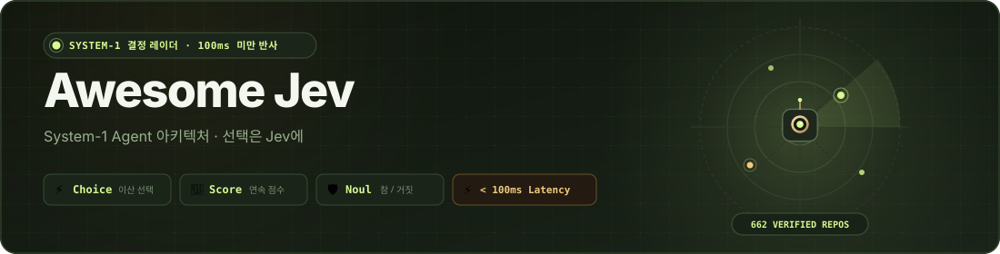

<div align="center">

<a href="https://logicrw.github.io/awesome-jev-projects/ko/"></a>

# Awesome Jev — System-1 Agent 아키텍처 레이더

<p align="center">
  <a href="https://awesome.re"></a>
  <a href="https://logicrw.github.io/awesome-jev-projects/ko/"></a>
  <a href="#분류"></a>
  <a href="LICENSE"></a>
  <a href="https://github.com/logicrw/awesome-jev-projects/issues/new?template=project.yml"></a>
</p>

<p align="center">
  <a href="README.md">English</a> &nbsp;•&nbsp; <a href="README.zh-CN.md">简体中文</a> &nbsp;•&nbsp; <a href="README.ja.md">日本語</a> &nbsp;•&nbsp; <b>한국어</b>
</p>

<p align="center">
  <a href="https://logicrw.github.io/awesome-jev-projects/ko/">🌐 <b>검색 및 필터 ↗</b></a> &nbsp;｜&nbsp; <a href="#agent-skill-설치">🤖 <b>Agent Skill 설치</b></a> &nbsp;｜&nbsp; <a href="#분류">📂 <b>분류</b></a> &nbsp;｜&nbsp; <a href="https://github.com/logicrw/awesome-jev-projects/issues/new?template=project.yml">🚀 <b>프로젝트 제출 (Issue 전용)</b></a>
</p>

> [!TIP]
> **프로젝트 제출 안내**: Jev 프로젝트 제출을 환영합니다! 본 저장소는 **[GitHub Issue 전용 템플릿](https://github.com/logicrw/awesome-jev-projects/issues/new?template=project.yml)**을 통해서만 등록을 진행하며, Pull Request는 받지 않습니다. 저장소 주소만 작성하여 제출해 주세요.

</div>

## 💡 **왜 Jev와 System-1 결정 아키텍처인가?**

에이전트를 구축할 때 모든 일상적인 분기 결정을 거대 추론 모델(System 2)에 맡기면 수 초의 지연 시간과 높은 비용, 문맥 왜곡이 발생합니다。

**TypeSafe Jev (System 1)**는 빠른 타입 안전 결정을 위해 제작된 경량 모델입니다:
- ⚡ **100ms 미만 초고속 응답**: 50–100ms 내에 결정을 내려 에이전트 루프의 민첩성을 유지합니다.
- 🎯 **네이티브 타입 출력**: `Choice`, `Score`, `Noul`을 지원하여 취약한 JSON 정규식 파싱이 필요 없습니다.
- 🛡️ **과대 광고 배제**: 17개 실제 엔지니어링 영역에 걸쳐 공개 소스 커밋이 검증된 662+개 프로젝트만을 엄선했습니다.

### 📊 아키텍처 비교: System 1 (Jev) vs System 2 (거대 추론 모델)

| 평가 항목 | System 2 (거대 추론 모델) | TypeSafe Jev (System 1 레이더) |
| :--- | :--- | :--- |
| **응답 지연 시간** | 1,500ms – 5,000ms+ (수 초 지연) | **50ms – 100ms (초고속 반사 신경)** |
| **출력 형식** | 자유 텍스트 / 취약한 JSON 정규식 파싱 | **네이티브 타입 `Choice`, `Score`, `Noul`** |
| **토큰 비용** | 높은 비용 ($1.00 – $15.00 / 1M tokens) | **극도로 가벼움 (매우 적은 비용)** |
| **문맥 왜곡** | 환각 및 지시사항 누락 위험 | **결정론적 상태 기계, 무결점 형식** |
| **주요 역할** | 거시적 계획, 긴 텍스트 생성 | **도구 라우팅, 액션 선택, 안전 게이트** |

### 🎮 주요 인터랙티브 기능

- 🎰 **피지컬 카드 디스펜서**: 실시간 연속 뽑기 카운트와 **10회 연속 축하 불꽃놀이 (💥 BOOM!)**로 Jev 결정 지점을 탐색합니다.
- ⚡ **고정 검색바 및 플로팅 필터**: 페이지를 스크롤하는 중에도 툴바에서 언제든지 태그와 카테고리를 즉시 필터링할 수 있습니다.
- 🔍 **100% 커밋 고정 소스 검증**: 수록된 모든 프로젝트는 공개 소스 코드의 구체적인 결정 지점과 직접 연결됩니다.

> **[검색 및 필터 ↗](https://logicrw.github.io/awesome-jev-projects/ko/)** · **662 개 엄선 프로젝트**

커뮤니티가 운영하는 Jev 프로젝트 디렉터리로, 공개 소스 코드와 명확한 결정 아키텍처를 갖춘 오픈소스 프로젝트를 선별하여 제공합니다.

모든 항목은 공개 소스와 구체적인 판단 지점을 확인하여 기술 검토에 바로 참고할 수 있도록 구성했습니다. 호환 구현은 기반 모델을 명시합니다.

각 프로젝트의 라이선스를 따르며, 맞춤 라이선스나 미명시 라이선스는 개별 표기되어 있습니다.

## 스폰서십 · 유료 게재

첫 파트너를 모집합니다. 현재 유료 스폰서는 없습니다.

[플랜 및 문의](https://github.com/logicrw/awesome-jev-projects/blob/main/SPONSORING.md) · [Sponsors](https://github.com/logicrw/awesome-jev-projects/blob/main/SPONSORS.md)

스폰서십은 수록 심사, 설명 또는 일반 정렬 순서를 바꾸지 않습니다.

## Agent Skill 설치

스킬을 설치하면 터미널이나 에이전트에서 분야별 프로젝트를 검색하고 고정 버전의 구현 근거를 바로 확인할 수 있습니다.

```bash
npx skills add logicrw/awesome-jev-projects
npx skills add https://logicrw.github.io/awesome-jev-projects/
```

[Agent Skill](https://logicrw.github.io/awesome-jev-projects/skill.md) · [llms.txt](https://logicrw.github.io/awesome-jev-projects/llms.txt) · [llms-full.txt](https://logicrw.github.io/awesome-jev-projects/llms-full.txt)

## 분류

- [브라우저 및 데스크톱 (46)](https://logicrw.github.io/awesome-jev-projects/ko/categories/browser-os-action/)
- [CLI 및 파이프라인 (62)](https://logicrw.github.io/awesome-jev-projects/ko/categories/cli-pipelines/)
- [분류 및 카탈로그 (2)](https://logicrw.github.io/awesome-jev-projects/ko/categories/classification-taxonomy/)
- [코드 및 그래프 탐색 (14)](https://logicrw.github.io/awesome-jev-projects/ko/categories/codebase-graph-pathfinding/)
- [Context GC 및 메모리 (38)](https://logicrw.github.io/awesome-jev-projects/ko/categories/context-gc-filter/)
- [음악 및 UI 제작 (20)](https://logicrw.github.io/awesome-jev-projects/ko/categories/creative-tools/)
- [데이터 및 검색 (42)](https://logicrw.github.io/awesome-jev-projects/ko/categories/data-search/)
- [판단 도구 (25)](https://logicrw.github.io/awesome-jev-projects/ko/categories/decision-tools/)
- [분야별 도구 (60)](https://logicrw.github.io/awesome-jev-projects/ko/categories/domain-vertical-tools/)
- [평가 및 관측성 (29)](https://logicrw.github.io/awesome-jev-projects/ko/categories/evaluation-observability/)
- [게임 및 실시간 판단 (50)](https://logicrw.github.io/awesome-jev-projects/ko/categories/high-frequency-simulation/)
- [MCP 및 연동 (41)](https://logicrw.github.io/awesome-jev-projects/ko/categories/mcp-integrations/)
- [모델 라우팅 (52)](https://logicrw.github.io/awesome-jev-projects/ko/categories/routing-cost-optimization/)
- [SDK 및 판단 프레임워크 (115)](https://logicrw.github.io/awesome-jev-projects/ko/categories/sdk-decision-frameworks/)
- [SDK 및 호환 연동 (6)](https://logicrw.github.io/awesome-jev-projects/ko/categories/sdk-integrations/)
- [보안 및 콘텐츠 검토 (56)](https://logicrw.github.io/awesome-jev-projects/ko/categories/security-guardrails/)
- [음성 및 대화 (4)](https://logicrw.github.io/awesome-jev-projects/ko/categories/voice-conversation/)

## 브라우저 및 데스크톱

- [**cua**](https://github.com/trycua/cua) — Cua의 미리보기 jev-use 예제가 Driver 관찰·실행과 Jev의 제한된 동작 선택을 연결한다.
  - **Jev가 판단하는 지점**: DOM 또는 지원되는 시각 영역 설명을 읽고 제시된 동작 ID를 반환한다.
  - **프로젝트의 용도**: Python·TypeScript 루프와 오프라인·실제 API 검증 경로를 제공한다.
  - [상세 설명 및 고정 버전 소스](https://logicrw.github.io/awesome-jev-projects/ko/projects/trycua/cua/) · 라이선스: MIT

- [**jev-ultrafast**](https://github.com/browser-use/jev-ultrafast) — Jev가 동작과 페이지 요소를 선택하고, 입력이 필요할 때만 텍스트 모델을 호출하는 브라우저 Agent.
  - **Jev가 판단하는 지점**: 현재 DOM에서 동작과 해당 요소를 한 번에 선택하며 입력 문장은 별도 모델이 생성한다.
  - **프로젝트의 용도**: 화면 선택, 텍스트 생성, 실행을 분리해 각 단계를 살펴볼 수 있다.
  - [상세 설명 및 고정 버전 소스](https://logicrw.github.io/awesome-jev-projects/ko/projects/jev-ultrafast/) · 라이선스: MIT

- [**jev-desktop**](https://github.com/lahfir/agent-desktop) — agent-desktop의 접근성 정보에서 조작 대상을 고르는 선택형 Jev skill.
  - **Jev가 판단하는 지점**: Jev가 대상·동작·존재 여부·위험을 판단하고 로컬 정책이 실행을 결정한다.
  - **프로젝트의 용도**: 주 Agent에 전체 UI 트리를 넘기지 않고 선택한 동작을 확인할 수 있다.
  - [상세 설명 및 고정 버전 소스](https://logicrw.github.io/awesome-jev-projects/ko/projects/jev-desktop/) · 라이선스: Apache-2.0

- [**typesafe-computer-use**](https://github.com/awlevin/typesafe-computer-use) — OCR과 화면 상태에서 후보를 만들고 Jev가 macOS 동작을 선택하며 문장 입력은 별도 모델을 사용한다.
  - **Jev가 판단하는 지점**: 추출한 요소와 동작 후보에서 다음 단계를 선택하면 실행기가 데스크톱을 조작한다.
  - **프로젝트의 용도**: 화면 읽기, 동작 선택, 텍스트 생성을 분리한다.
  - [상세 설명 및 고정 버전 소스](https://logicrw.github.io/awesome-jev-projects/ko/projects/awlevin/typesafe-computer-use/) · 라이선스: MIT

- [**Jev-cu**](https://github.com/Sac-Y/Jev-cu) — 화면 텍스트 후보를 Jev에 보내고 데스크톱 도구가 관찰·실행하는 Codex 루프다.
  - **Jev가 판단하는 지점**: 대상·동작·완료·위험을 판단하며 로컬 정책이 실행이나 확인을 결정한다.
  - **프로젝트의 용도**: 텍스트 후보를 사용하고 기본적으로 dry-run부터 시작한다.
  - [상세 설명 및 고정 버전 소스](https://logicrw.github.io/awesome-jev-projects/ko/projects/sac-y/jev-cu/) · 라이선스: MIT

- [**omg.dev**](https://github.com/BennyKok/omg.dev) — omg.dev의 모바일 테스트 스크립트가 접근성 트리에서 다음 동작을 Jev로 선택한다.
  - **Jev가 판단하는 지점**: 대상, 완료 여부, 진행 불가 상태를 판단하면 테스트 실행기가 화면을 조작한다.
  - **프로젝트의 용도**: 현재 화면 상태에 기반한 선택을 모바일 테스트에 추가한다.
  - [상세 설명 및 고정 버전 소스](https://logicrw.github.io/awesome-jev-projects/ko/projects/bennykok/omg.dev/) · 라이선스: MIT

- [**jev-browser-use**](https://github.com/wy-coliney/jev-browser-use) — Codex 브라우저 작업에서 Jev가 탐색, 클릭, 스크롤을 선택하고 입력과 최종 확인은 Codex가 맡는 Skill.
  - **Jev가 판단하는 지점**: 페이지 상태와 실행 후보를 Jev에 보내고 기존 브라우저 연결로 동작을 실행한다.
  - **프로젝트의 용도**: 반복되는 화면 선택을 분리하면서 기존 연결을 재사용한다.
  - [상세 설명 및 고정 버전 소스](https://logicrw.github.io/awesome-jev-projects/ko/projects/wy-coliney/jev-browser-use/) · 라이선스: MIT

- [**mobile-jev**](https://github.com/droidrun/mobile-jev) — Mobilerun으로 Android를 조작하며 웹 화면과 CLI에서 Jev 판단을 확인한다.
  - **Jev가 판단하는 지점**: 화면 상태에서 앱, 요소와 다음 동작을 고르면 Mobilerun이 실행한다.
  - **프로젝트의 용도**: 동작 기록과 요청 지연을 남긴다.
  - [상세 설명 및 고정 버전 소스](https://logicrw.github.io/awesome-jev-projects/ko/projects/droidrun/mobile-jev/) · 라이선스: MIT

- [**jev-voice-browser**](https://github.com/moritzkremb/jev-voice-browser) — 점진적인 음성 전사를 Jev에 보내 Playwright 브라우저를 조작한다.
  - **Jev가 판단하는 지점**: 의도, 요소, URL, 원문 구간을 고르고 명령 완결성과 민감한 동작을 판단한다.
  - **프로젝트의 용도**: 음성 조작 중 확률, 동작과 요청 시간을 표시한다.
  - [상세 설명 및 고정 버전 소스](https://logicrw.github.io/awesome-jev-projects/ko/projects/moritzkremb/jev-voice-browser/) · 라이선스: MIT

- [**jev-browser**](https://github.com/jkudish/jev-browser) — 작업과 URL을 받아 브라우저를 조작하고 최종 페이지, 스크린샷, 실행 기록을 반환한다.
  - **Jev가 판단하는 지점**: DOM 동작과 완료·정체 여부를 판단하며 입력할 문장은 별도 모델이 만들 수 있다.
  - **프로젝트의 용도**: 제안한 동작, 실행 결과와 중단 이유를 기록한다.
  - [상세 설명 및 고정 버전 소스](https://logicrw.github.io/awesome-jev-projects/ko/projects/jkudish/jev-browser/) · 라이선스: MIT

- [**jev-use**](https://github.com/savka777/jev-use) — Voice and typed computer use for macOS. You say what you want. Jev picks the next on-screen action. macOS performs it. No screenshots: the app reads the screen through the Accessibility tree.
  - **Jev가 판단하는 지점**: Jev returns a structured decision for the local program; consult the source for the exact decision policy.
  - **프로젝트의 용도**: Adds structured choices or scores to the workflow; performance and cost benefits have not been independently verified.
  - [상세 설명 및 고정 버전 소스](https://logicrw.github.io/awesome-jev-projects/ko/projects/savka777/jev-use/) · 라이선스: MIT

- [**jev-voice**](https://github.com/kevinbadi/jev-voice) — Talk to your Mac. Local whisper.cpp + one Jev (TypeSafe) call per command + macOS automation.
  - **Jev가 판단하는 지점**: Jev returns a structured decision for the local program; consult the source for the exact decision policy.
  - **프로젝트의 용도**: Adds structured choices or scores to the workflow; performance and cost benefits have not been independently verified.
  - [상세 설명 및 고정 버전 소스](https://logicrw.github.io/awesome-jev-projects/ko/projects/kevinbadi/jev-voice/) · 라이선스: MIT

- [**jev-browser**](https://github.com/Ying-Kai-Liao/jev-browser) — 호출 측이 목표와 입력 문장을 제공하고 Jev가 동작을 고르는 브라우저 라이브러리·CLI·MCP다.
  - **Jev가 판단하는 지점**: 요소, 동작과 값을 고르고 완료, 오류와 되돌릴 수 없는 단계를 평가한다.
  - **프로젝트의 용도**: 브라우저 동작 루프와 계획을 분리하며 상태와 기록을 반환한다.
  - [상세 설명 및 고정 버전 소스](https://logicrw.github.io/awesome-jev-projects/ko/projects/ying-kai-liao/jev-browser/) · 라이선스: MIT

- [**typesafe-adblock**](https://github.com/realZachi/typesafe-adblock) — 후보 DOM의 광고 여부를 Jev에 물어 강조하거나 제거하는 실험적 Chrome 확장.
  - **Jev가 판단하는 지점**: 요소 텍스트, 라벨, 링크 정보를 Noul로 평가하고 임계값을 적용한다.
  - **프로젝트의 용도**: 의미 기반 판단을 구체적인 페이지 요소와 연결하는 예제.
  - [상세 설명 및 고정 버전 소스](https://logicrw.github.io/awesome-jev-projects/ko/projects/realzachi/typesafe-adblock/) · 라이선스: MIT

- [**JevBrowserExt**](https://github.com/chy4pro/JevBrowserExt) — jev-ultrafast를 Manifest V3 Chrome 확장으로 옮긴 것. Jev가 현재 탭에서 동작과 DOM 요소를 고르고, 글자를 넣을 때만 작은 대화 모델을 부른다.
  - **Jev가 판단하는 지점**: 한 요청에서 CLICK, TYPE\_TEXT, SELECT, SCROLL\_DOWN, SCROLL\_UP, PRESS\_ENTER, WAIT, DONE, BLOCKED와 해당 요소를 고른다. PRESS\_ENTER는 별도의 키 컨트롤이다. 목표 달성과 동작 정체는 별도의 예/아니오로 확인한다.
  - **프로젝트의 용도**: 사용자 자신의 탭에서 돌고 스크린샷은 찍지 않는다. 동작, 대상 요소, 입력 문장을 나눠 볼 수 있다.
  - [상세 설명 및 고정 버전 소스](https://logicrw.github.io/awesome-jev-projects/ko/projects/chy4pro/jevbrowserext/) · 라이선스: MIT

- [**jev-macos-loop**](https://github.com/jcpsimmons/jev-macos-loop) — 로컬 OCR과 접근성 정보를 사용하고 Jev가 동작을 고르는 macOS 자동화 루프.
  - **Jev가 판단하는 지점**: 관측한 후보에서 대상을 고르며 좌표 처리와 입력 실행은 Mac이 맡는다.
  - **프로젝트의 용도**: Finder 작업을 포함해 후보와 실행 확인을 살펴볼 수 있다.
  - [상세 설명 및 고정 버전 소스](https://logicrw.github.io/awesome-jev-projects/ko/projects/jcpsimmons/jev-macos-loop/) · 라이선스: AGPL-3.0

- [**jevfill**](https://github.com/imohitmayank/jevfill) — Open \`test/sample-form.html\` in the browser, configure the extension, and click \*\*Autofill page\*\*.
  - **Jev가 판단하는 지점**: Jev returns a structured decision for the local program; consult the source for the exact decision policy.
  - **프로젝트의 용도**: Adds structured choices or scores to the workflow; performance and cost benefits have not been independently verified.
  - [상세 설명 및 고정 버전 소스](https://logicrw.github.io/awesome-jev-projects/ko/projects/imohitmayank/jevfill/) · 라이선스: MIT

- [**jev-ego**](https://github.com/romaluev/jev-ego) — ego lite의 조작 가능한 요소에 번호를 붙여 Jev가 다음 동작을 고르는 브라우저 Agent.
  - **Jev가 판단하는 지점**: 한 번의 요청으로 동작·대상을 고르고 자유 문장은 별도 보조 모델이 처리한다.
  - **프로젝트의 용도**: 관측·제안·실행을 제공하지만 업로드·대화상자는 다른 브라우저 도구가 필요하다.
  - [상세 설명 및 고정 버전 소스](https://logicrw.github.io/awesome-jev-projects/ko/projects/romaluev/jev-ego/) · 라이선스: 명시되지 않음

- [**jev-agent-browser**](https://github.com/forvela/jev-agent-browser) — Fast, bounded browser agents powered by Jev and agent-browser — typed actions, research, classification, and safe orchestration.
  - **Jev가 판단하는 지점**: Jev returns a structured decision for the local program; consult the source for the exact decision policy.
  - **프로젝트의 용도**: Adds structured choices or scores to the workflow; performance and cost benefits have not been independently verified.
  - [상세 설명 및 고정 버전 소스](https://logicrw.github.io/awesome-jev-projects/ko/projects/forvela/jev-agent-browser/) · 라이선스: MIT

- [**aside-jev**](https://github.com/himomohi/aside-jev) — Aside 브라우저 Agent에 Jev 판단을 더하는 MCP 서버와 skill.
  - **Jev가 판단하는 지점**: Agent가 후보를 제시하면 Jev가 ID를 고르고 Aside로 실행한 뒤 검증한다.
  - **프로젝트의 용도**: 선택을 앱이 제공한 동작 목록으로 제한하며 실행 결과는 별도로 확인한다.
  - [상세 설명 및 고정 버전 소스](https://logicrw.github.io/awesome-jev-projects/ko/projects/himomohi/aside-jev/) · 라이선스: MIT

- [**AskJev**](https://github.com/ranjan2829/AskJev) — MCP로 Agent와 브라우저를 연결하고 Jev가 페이지 동작을 선택하며 결제나 삭제 등에는 확인 단계를 둔다.
  - **Jev가 판단하는 지점**: 현재 페이지 요소에서 동작을 선택하고 위험과 되돌릴 수 있는 정도를 평가한다.
  - **프로젝트의 용도**: 자동 작업과 사용자 확인을 하나의 흐름으로 연결한다.
  - [상세 설명 및 고정 버전 소스](https://logicrw.github.io/awesome-jev-projects/ko/projects/ranjan2829/askjev/) · 라이선스: MIT

- [**jev-browser**](https://github.com/tontoko/jev-browser) — 공통 CLI·MCP·TypeScript SDK로 Playwright와 Jev를 사용하는 브라우저 자동화 도구.
  - **Jev가 판단하는 지점**: Jev가 페이지 관측으로 동작·양식 필드·추출 내용을 결정하고 Playwright가 실행한다.
  - **프로젝트의 용도**: 지속 세션과 화면 재확인을 지원하지만 화면 확인만으로 DB 저장을 증명하지는 않는다.
  - [상세 설명 및 고정 버전 소스](https://logicrw.github.io/awesome-jev-projects/ko/projects/tontoko/jev-browser/) · 라이선스: Apache-2.0

- [**jev-clerk**](https://github.com/stas4000/jev-clerk) — macOS에서 공급 인보이스를 회계 앱에 입력한다. Jev가 닫힌 동작 표에서 클릭을 고르고, 깊은 모델은 대본만 고친다.
  - **Jev가 판단하는 지점**: 기본 jev-latest로 /v1/systemone에 POST하고 단계마다 닫힌 동작 Choice를 묻는다.
  - **프로젝트의 용도**: 화면 동작은 Jev의 닫힌 선택을 따른다. 저자 데모 숫자는 재측정하지 않았다. GitHub SPDX는 비어 있고 LICENSE는 MIT다.
  - [상세 설명 및 고정 버전 소스](https://logicrw.github.io/awesome-jev-projects/ko/projects/stas4000/jev-clerk/) · 라이선스: 명시되지 않음

- [**jev-yt-time-saver**](https://github.com/jaibhasin/jev-yt-time-saver) — This project integrates Jev to provide structured decisions for its workflow. See the repository for implementation details.
  - **Jev가 판단하는 지점**: Jev returns a structured decision for the local program; consult the source for the exact decision policy.
  - **프로젝트의 용도**: Adds structured choices or scores to the workflow; performance and cost benefits have not been independently verified.
  - [상세 설명 및 고정 버전 소스](https://logicrw.github.io/awesome-jev-projects/ko/projects/jaibhasin/jev-yt-time-saver/) · 라이선스: 명시되지 않음

- [**computer-use-jev**](https://github.com/paulsmith/computer-use-jev) — macOS 접근성 트리에서 Jev가 대상과 동작을 선택하는 Go 컨트롤러.
  - **Jev가 판단하는 지점**: 창 상태로 동작, 대상, 텍스트 입력 필요 여부, 완료 상태를 선택한다.
  - **프로젝트의 용도**: 화면 스냅샷에 기반한 후보와 선택 과정을 확인할 수 있다.
  - [상세 설명 및 고정 버전 소스](https://logicrw.github.io/awesome-jev-projects/ko/projects/paulsmith/computer-use-jev/) · 라이선스: MIT

- [**ego-jev**](https://github.com/jiangkoumo/ego-jev) — Drive the ego lite browser with Jev (TypeSafe System One): one indexed element table in, one operation + target out, single process. ~2x faster than a per-step LLM loop in our measurements.
  - **Jev가 판단하는 지점**: Jev returns a structured decision for the local program; consult the source for the exact decision policy.
  - **프로젝트의 용도**: Adds structured choices or scores to the workflow; performance and cost benefits have not been independently verified.
  - [상세 설명 및 고정 버전 소스](https://logicrw.github.io/awesome-jev-projects/ko/projects/jiangkoumo/ego-jev/) · 라이선스: MIT

- [**jev-browser**](https://github.com/Mrlyk/jev-browser) — Browser automation CLI for AI agents, powered by the Jev model's millisecond decisions and near-zero inference costs
  - **Jev가 판단하는 지점**: Jev returns a structured decision for the local program; consult the source for the exact decision policy.
  - **프로젝트의 용도**: Adds structured choices or scores to the workflow; performance and cost benefits have not been independently verified.
  - [상세 설명 및 고정 버전 소스](https://logicrw.github.io/awesome-jev-projects/ko/projects/mrlyk/jev-browser/) · 라이선스: Apache-2.0

- [**jev-mobile**](https://github.com/Friedjof/jev-mobile) — \`jev-mobile\` accepts a high-level task, persists it in SQLite, and lets one durable worker execute \*\*observe → normalize → decide → mutate → verify\*\* against a USB-connected Android device. Jev receives concise semantics and technically valid actions; it never generates coordinates, MCP calls, or arbitrary code.
  - **Jev가 판단하는 지점**: Jev returns a structured decision for the local program; consult the source for the exact decision policy.
  - **프로젝트의 용도**: Adds structured choices or scores to the workflow; performance and cost benefits have not been independently verified.
  - [상세 설명 및 고정 버전 소스](https://logicrw.github.io/awesome-jev-projects/ko/projects/friedjof/jev-mobile/) · 라이선스: MIT

- [**jev-shield**](https://github.com/vmendes90/jev-shield) — 피드 요소의 광고 여부를 Jev로 판단하는 Chrome 확장.
  - **Jev가 판단하는 지점**: 후보 DOM을 묶어 TypeSafe에 보내고 Noul 확률과 임계값으로 접기 여부를 결정한다.
  - **프로젝트의 용도**: 로컬 광고 규칙에 텍스트 의미 기반 판단을 추가한다.
  - [상세 설명 및 고정 버전 소스](https://logicrw.github.io/awesome-jev-projects/ko/projects/vmendes90/jev-shield/) · 라이선스: MIT

- [**browser-use-with-jev**](https://github.com/garry-schuette/browser-use-with-jev) — \*\*Keep Browser Use's execution engine. Move bounded decisions to Jev.\*\*
  - **Jev가 판단하는 지점**: Jev returns a structured decision for the local program; consult the source for the exact decision policy.
  - **프로젝트의 용도**: Adds structured choices or scores to the workflow; performance and cost benefits have not been independently verified.
  - [상세 설명 및 고정 버전 소스](https://logicrw.github.io/awesome-jev-projects/ko/projects/garry-schuette/browser-use-with-jev/) · 라이선스: MIT

- [**jev-browser-local**](https://github.com/rorshopping/jev-browser-local) — Run jev-browser on a fully local JEV-style decision engine (no cloud API). Warm-browser fork, VRAM guard, measured benchmarks, run traces.
  - **Jev가 판단하는 지점**: Jev returns a structured decision for the local program; consult the source for the exact decision policy.
  - **프로젝트의 용도**: Adds structured choices or scores to the workflow; performance and cost benefits have not been independently verified.
  - [상세 설명 및 고정 버전 소스](https://logicrw.github.io/awesome-jev-projects/ko/projects/rorshopping/jev-browser-local/) · 라이선스: 명시되지 않음

- [**jev-ra**](https://github.com/brnyxx/jev-ra) — Browser use for coding agents, 3-5x faster than browser-use. MCP server + CLI; TypeSafe Jev decides every step in ~300 ms.
  - **Jev가 판단하는 지점**: Jev returns a structured decision for the local program; consult the source for the exact decision policy.
  - **프로젝트의 용도**: Adds structured choices or scores to the workflow; performance and cost benefits have not been independently verified.
  - [상세 설명 및 고정 버전 소스](https://logicrw.github.io/awesome-jev-projects/ko/projects/brnyxx/jev-ra/) · 라이선스: MIT

- [**CUA-JEV**](https://github.com/ZJU-REAL/CUA-JEV) — The \[experimental open-task paths\](docs/OPEN\_TASKS.md) separate model planning from Jev's typed action selection. They discover browser DOM elements or Windows UI Automation controls dynamically and offer grounded structured-tool / physical-GUI alternatives without a site- or app-specific click sequence. A twelve-action browser-to-VS-Code research case now runs end to end with a model and Jev, but \*\*arbitrary-task generalization is not claimed\*\*.
  - **Jev가 판단하는 지점**: Jev returns a structured decision for the local program; consult the source for the exact decision policy.
  - **프로젝트의 용도**: Adds structured choices or scores to the workflow; performance and cost benefits have not been independently verified.
  - [상세 설명 및 고정 버전 소스](https://logicrw.github.io/awesome-jev-projects/ko/projects/zju-real/cua-jev/) · 라이선스: 명시되지 않음

- [**ego-jev**](https://github.com/ZHUBoer/ego-jev) — Complete browser tasks with Ego Lite and actively call Jev for semantic target selection, filtering, ranking, classification and text evidence judgments.
  - **Jev가 판단하는 지점**: Jev returns a structured decision for the local program; consult the source for the exact decision policy.
  - **프로젝트의 용도**: Adds structured choices or scores to the workflow; performance and cost benefits have not been independently verified.
  - [상세 설명 및 고정 버전 소스](https://logicrw.github.io/awesome-jev-projects/ko/projects/zhuboer/ego-jev/) · 라이선스: MIT

- [**jev-browser-pilot**](https://github.com/aidil2105/jev-browser-pilot) — A bounded decision layer for browser and desktop automation: a decision-only model picks one next step; the code owns perception, content, actuation and verification.
  - **Jev가 판단하는 지점**: Jev returns a structured decision for the local program; consult the source for the exact decision policy.
  - **프로젝트의 용도**: Adds structured choices or scores to the workflow; performance and cost benefits have not been independently verified.
  - [상세 설명 및 고정 버전 소스](https://logicrw.github.io/awesome-jev-projects/ko/projects/aidil2105/jev-browser-pilot/) · 라이선스: MIT

- [**jev-browser-qa**](https://github.com/jonymusky/jev-browser-qa) — Browser QA where Playwright drives and films, and TypeSafe Jev judges. JSON-flow CLI for agents, run dashboard, agent skill.
  - **Jev가 판단하는 지점**: Jev returns a structured decision for the local program; consult the source for the exact decision policy.
  - **프로젝트의 용도**: Adds structured choices or scores to the workflow; performance and cost benefits have not been independently verified.
  - [상세 설명 및 고정 버전 소스](https://logicrw.github.io/awesome-jev-projects/ko/projects/jonymusky/jev-browser-qa/) · 라이선스: MIT

- [**jev-browser-skill**](https://github.com/zurfyx/jev-browser-skill) — Let Jev, TypeSafe's ~100ms decision model, drive your browser. A plug-and-play skill for Claude Code and Codex.
  - **Jev가 판단하는 지점**: Jev returns a structured decision for the local program; consult the source for the exact decision policy.
  - **프로젝트의 용도**: Adds structured choices or scores to the workflow; performance and cost benefits have not been independently verified.
  - [상세 설명 및 고정 버전 소스](https://logicrw.github.io/awesome-jev-projects/ko/projects/zurfyx/jev-browser-skill/) · 라이선스: MIT

- [**jev-browser-skill**](https://github.com/ChenYCL/jev-browser-skill) — Browser use & computer use for coding agents, powered by TypeSafe Jev: calibrated judgments from a System One model, control loop in code. ego lite / Chrome / Safari · CLI + MCP
  - **Jev가 판단하는 지점**: Jev returns a structured decision for the local program; consult the source for the exact decision policy.
  - **프로젝트의 용도**: Adds structured choices or scores to the workflow; performance and cost benefits have not been independently verified.
  - [상세 설명 및 고정 버전 소스](https://logicrw.github.io/awesome-jev-projects/ko/projects/chenycl/jev-browser-skill/) · 라이선스: MIT

- [**jev-mobile**](https://github.com/xinwang-nwpu/jev-mobile) — One TypeSafe Jev decision per step over the A11Y tree, executed via ADB. No screenshots and ultra fast!
  - **Jev가 판단하는 지점**: Jev returns a structured decision for the local program; consult the source for the exact decision policy.
  - **프로젝트의 용도**: Adds structured choices or scores to the workflow; performance and cost benefits have not been independently verified.
  - [상세 설명 및 고정 버전 소스](https://logicrw.github.io/awesome-jev-projects/ko/projects/xinwang-nwpu/jev-mobile/) · 라이선스: MIT

- [**ego-jev**](https://github.com/phd-peter/ego-jev) — Ego Lite 스냅샷과 브라우저 동작을 횟수가 제한된 Jev 판단 루프에 연결한다.
  - **Jev가 판단하는 지점**: 현재 스냅샷 후보와 지원 동작에서만 선택하며 입력 문장은 별도 모델이 제공할 수 있다.
  - **프로젝트의 용도**: 현재 스냅샷 참조로 실행하고 단계별 상태를 기록한다.
  - [상세 설명 및 고정 버전 소스](https://logicrw.github.io/awesome-jev-projects/ko/projects/phd-peter/ego-jev/) · 라이선스: MIT

- [**jev-demo**](https://github.com/PenglongHuang/jev-demo) — A zero-dependency local web demo for TypeSafe's \*\*Jev (System One)\*\* decision model: send a state plus typed questions, get choices, scores and calibrated probabilities back.
  - **Jev가 판단하는 지점**: Jev returns a structured decision for the local program; consult the source for the exact decision policy.
  - **프로젝트의 용도**: Adds structured choices or scores to the workflow; performance and cost benefits have not been independently verified.
  - [상세 설명 및 고정 버전 소스](https://logicrw.github.io/awesome-jev-projects/ko/projects/penglonghuang/jev-demo/) · 라이선스: MIT

- [**jev-tweet-radar**](https://github.com/DDnim/jev-tweet-radar) — X 타임라인의 각 게시물을 Jev Noul 한 번으로 채점해 상호작용 가치와 선택 태그 확률을 보여주는 Chrome 확장.
  - **Jev가 판단하는 지점**: System One 요청 한 번에 ‘상호작용할 가치’와 spam, buzz, AI 같은 Noul을 묻는다.
  - **프로젝트의 용도**: 타임라인 선별을 생성 댓글이 아니라 확인할 수 있는 확률로 만든다. 게시 본문은 TypeSafe로 전송된다.
  - [상세 설명 및 고정 버전 소스](https://logicrw.github.io/awesome-jev-projects/ko/projects/ddnim/jev-tweet-radar/) · 라이선스: MIT

- [**jevaluate**](https://github.com/ElshinQ/jevaluate) — Jevaluate: evaluate before you trust. Field notes, runnable scripts and an agent skill for TypeSafe Jev: gated evals, a browser loop, a product walk with DeepSeek vision, a UI text judge and a first-click tree test. Co-authored with Claude Fable 5.1.
  - **Jev가 판단하는 지점**: Jev returns a structured decision for the local program; consult the source for the exact decision policy.
  - **프로젝트의 용도**: Adds structured choices or scores to the workflow; performance and cost benefits have not been independently verified.
  - [상세 설명 및 고정 버전 소스](https://logicrw.github.io/awesome-jev-projects/ko/projects/elshinq/jevaluate/) · 라이선스: MIT

- [**JevFilterForX**](https://github.com/grayrepo-byte/jev_filter_for_x) — Jev로 X 게시물에 점수를 매기고 라벨을 표시하며 필터에 해당하는 게시물을 다시 펼칠 수 있게 접는 브라우저 확장. API 키가 없으면 기본적으로 로컬 모의 점수를 사용한다.
  - **Jev가 판단하는 지점**: Jev의 Choice로 게시물을 분류하고 Score로 정보량, 실행 가능성과 독창성을 평가하며 Noul로 라벨을 붙인다. 로컬 임계값과 노이즈 규칙으로 게시물 접기를 결정한다.
  - **프로젝트의 용도**: X 피드에 점수, 라벨, 조정 가능한 필터 임계값을 추가하고 게시물과 첨부 미디어를 접은 뒤 다시 펼치거나 숨길 수 있다.
  - [상세 설명 및 고정 버전 소스](https://logicrw.github.io/awesome-jev-projects/ko/projects/grayrepo-byte/jev_filter_for_x/) · 라이선스: 명시되지 않음

- [**jevis**](https://github.com/jaewgwon/jevis) — Flutter integration\_test 패키지. 허용 UI 동작을 등록하고 Jev가 다음 동작과 목표 달성을 고른다.
  - **Jev가 판단하는 지점**: 기본 jev-latest로 /v1/systemone에 POST. 목표는 Noul, 다음 동작은 등록된 Choice.
  - **프로젝트의 용도**: 자연어 테스트를 자유 탭이 아니라 닫힌 동작 표에서의 선택으로 만든다.
  - [상세 설명 및 고정 버전 소스](https://logicrw.github.io/awesome-jev-projects/ko/projects/jaewgwon/jevis/) · 라이선스: Apache-2.0

- [**cline-plugin-jev-browser**](https://github.com/abeatrix/cline-plugin-jev-browser) — 격리된 Playwright 브라우저와 Vercel AI Gateway의 Jev 판단을 사용하는 Cline 플러그인.
  - **Jev가 판단하는 지점**: Jev가 DOM 대상 표에서 동작을 선택하며 입력 문장은 별도 텍스트 모델이 만든다.
  - **프로젝트의 용도**: 전후 스크린샷을 저장하고 민감한 동작은 제어를 반환하며 완료 결과는 재확인이 필요하다.
  - [상세 설명 및 고정 버전 소스](https://logicrw.github.io/awesome-jev-projects/ko/projects/abeatrix/cline-plugin-jev-browser/) · 라이선스: 명시되지 않음


## CLI 및 파이프라인

- [**foreman**](https://github.com/thruwire/foreman) — 작업자의 diff, 로그, 테스트를 읽고 Jev Noul로 멈춤, 이탈, 검증을 판단한 뒤 Python 정책으로 개입하는 감독 루프.
  - **Jev가 판단하는 지점**: 기본 jev-latest의 AsyncTypeSafeClient.system\_one이 감독용 Noul을 보낸다.
  - **프로젝트의 용도**: 감독은 작업자 코드를 쓰지 않는다. 수록된 Shifty-Eye-Games/foreman-jev와는 다른 저장소다.
  - [상세 설명 및 고정 버전 소스](https://logicrw.github.io/awesome-jev-projects/ko/projects/thruwire/foreman/) · 라이선스: MIT

- [**orchestkit**](https://github.com/yonatangross/orchestkit) — OrchestKit은 선택적으로 Jev로 코딩 세션을 분류하고 임계값을 충족하면 표시 색상에 반영한다.
  - **Jev가 판단하는 지점**: 첫 작업 프롬프트와 브랜치 상태로 작업 유형을 선택하고 로컬 규칙이 채택이나 대체 처리를 결정한다.
  - **프로젝트의 용도**: 작업 유형으로 세션을 구별하고 shadow 비교 모드도 사용할 수 있다.
  - [상세 설명 및 고정 버전 소스](https://logicrw.github.io/awesome-jev-projects/ko/projects/yonatangross/orchestkit/) · 라이선스: MIT

- [**jev-align**](https://github.com/sutro-sh/jev-align) — 1. Evaluates the configured dataset and measures uncertainty. 2. Selects ambiguous rows plus a random audit sample for you to label. 3. Uses your accumulated labels and optional rationales to run GEPA. 4. Shows the score, certainty change, and proposed definition diff. 5. Lets you accept, reject, rewind, or resume later.
  - **Jev가 판단하는 지점**: Jev returns a structured decision for the local program; consult the source for the exact decision policy.
  - **프로젝트의 용도**: Adds structured choices or scores to the workflow; performance and cost benefits have not been independently verified.
  - [상세 설명 및 고정 버전 소스](https://logicrw.github.io/awesome-jev-projects/ko/projects/sutro-sh/jev-align/) · 라이선스: Apache-2.0

- [**JevRev**](https://github.com/Alex314618-create/JevRev) — Your LLM can imagine, write, test, and revise. It should not have to make every cheap routing decision by itself.
  - **Jev가 판단하는 지점**: Jev returns a structured decision for the local program; consult the source for the exact decision policy.
  - **프로젝트의 용도**: Adds structured choices or scores to the workflow; performance and cost benefits have not been independently verified.
  - [상세 설명 및 고정 버전 소스](https://logicrw.github.io/awesome-jev-projects/ko/projects/alex314618-create/jevrev/) · 라이선스: MIT

- [**jev-shell-history**](https://github.com/mrnugget/jev-shell-history) — Jev를 사용하여 Zsh 로컬 기록 명령어를 문맥에 맞게 순위 매겨 인라인 제안을 제공하는 터미널 도구입니다.
  - **Jev가 판단하는 지점**: 현재 입력 중인 명령어와 로컬 히스토리를 Jev로 평가하여 가장 타당한 완성 후보를 선정합니다 (자동 실행 안 됨).
  - **프로젝트의 용도**: 단순 접두사 매칭을 넘어 문맥에 부합하는 명령어를 우선 노출하여 터미널 작업 생산성을 높입니다.
  - [상세 설명 및 고정 버전 소스](https://logicrw.github.io/awesome-jev-projects/ko/projects/mrnugget/jev-shell-history/) · 라이선스: 명시되지 않음

- [**jev-lint**](https://github.com/mizchi/jev-lint) — lint text in code by jev scorerer
  - **Jev가 판단하는 지점**: Jev returns a structured decision for the local program; consult the source for the exact decision policy.
  - **프로젝트의 용도**: Adds structured choices or scores to the workflow; performance and cost benefits have not been independently verified.
  - [상세 설명 및 고정 버전 소스](https://logicrw.github.io/awesome-jev-projects/ko/projects/mizchi/jev-lint/) · 라이선스: MIT

- [**jgrep**](https://github.com/keltokhy/jgrep) — Filters text, structured records, functions, and diff hunks against plain-English descriptions using Jev Noul judgments.
  - **Jev가 판단하는 지점**: Jev judges whether each input unit matches the user description; local code applies the probability threshold and returns matching source material.
  - **프로젝트의 용도**: Adds structured choices or scores to the workflow; performance and cost benefits have not been independently verified.
  - [상세 설명 및 고정 버전 소스](https://logicrw.github.io/awesome-jev-projects/ko/projects/keltokhy/jgrep/) · 라이선스: MIT

- [**SemDecide**](https://github.com/sharziki/semdecide) — 텍스트나 JSONL을 판단·분류·채점·필터링하는 Python CLI.
  - **Jev가 판단하는 지점**: Jev 응답 확률과 로컬 임곗값으로 결과와 종료 코드를 결정한다.
  - **프로젝트의 용도**: Bash와 CI에 구조화된 판단과 명시적 실패 상태를 연결한다.
  - [상세 설명 및 고정 버전 소스](https://logicrw.github.io/awesome-jev-projects/ko/projects/semdecide/) · 라이선스: MIT

- [**jev-skill-suggester**](https://github.com/win4r/jev-skill-suggester) — A Python CLI and Codex Skill that recommends a suitable installed skill for the current task using TypeSafe Jev Choice and Noul checks without executing candidate skills.
  - **Jev가 판단하는 지점**: Jev returns a structured decision for the local program; consult the source for the exact decision policy.
  - **프로젝트의 용도**: Adds structured choices or scores to the workflow; performance and cost benefits have not been independently verified.
  - [상세 설명 및 고정 버전 소스](https://logicrw.github.io/awesome-jev-projects/ko/projects/win4r/jev-skill-suggester/) · 라이선스: MIT

- [**jev-calibrate**](https://github.com/smkrv/jev-calibrate) — Jev is the typed-decision model from TypeSafe: it takes a \`state\` and a set of questions (\`noul\`, \`choice\`, \`score\`) and returns probabilities instead of text. How well a question works depends on its wording, on your data and on the threshold you cut at, and none of the three can be read off a single good-looking answer.
  - **Jev가 판단하는 지점**: Jev returns a structured decision for the local program; consult the source for the exact decision policy.
  - **프로젝트의 용도**: Adds structured choices or scores to the workflow; performance and cost benefits have not been independently verified.
  - [상세 설명 및 고정 버전 소스](https://logicrw.github.io/awesome-jev-projects/ko/projects/smkrv/jev-calibrate/) · 라이선스: MIT

- [**jgrep**](https://github.com/kyu1204/jgrep) — grep for what code does, not what it's called. Semantic code search powered by TypeSafe Jev.
  - **Jev가 판단하는 지점**: Measured (2026-09-19, jev-1.13.0): a 896-chunk TypeScript \`src/\` tree in 1.8 s for $0.010 (240k input tokens); repeat query 0 s from cache.
  - **프로젝트의 용도**: Adds structured choices or scores to the workflow; performance and cost benefits have not been independently verified.
  - [상세 설명 및 고정 버전 소스](https://logicrw.github.io/awesome-jev-projects/ko/projects/kyu1204/jgrep/) · 라이선스: MIT

- [**jev-axi**](https://github.com/shiftynick/jev-axi) — Jev의 pick, rate, check, rank, triage, guard를 사용하는 CLI로 Agent 도구 실행 전 hook도 제공한다.
  - **Jev가 판단하는 지점**: 상태와 선택지를 질문으로 바꾸고 결과나 로컬 정책용 위험 점수를 반환한다.
  - **프로젝트의 용도**: 스크립트와 Agent 흐름에서 같은 판단 명령을 재사용한다.
  - [상세 설명 및 고정 버전 소스](https://logicrw.github.io/awesome-jev-projects/ko/projects/shiftynick/jev-axi/) · 라이선스: MIT

- [**jev-cli**](https://github.com/Nasrallah-AL/jev-cli) — 검증·분류·평가 질문을 텍스트 입력과 스크립트에 연결하는 jevctl CLI.
  - **Jev가 판단하는 지점**: 입력과 고정 후보를 Jev에 보내고 로컬 임계값으로 판단과 확률을 반환한다.
  - **프로젝트의 용도**: 파이프라인·CI용 결과와 요청 확인·dry-run을 제공한다.
  - [상세 설명 및 고정 버전 소스](https://logicrw.github.io/awesome-jev-projects/ko/projects/nasrallah-al/jev-cli/) · 라이선스: MIT

- [**slop-grader**](https://github.com/lukstei/slop-grader) — Rule-based CLI and agent skill that evaluates text and markdown files against custom rulesets for AI slop, grammar, and technical doc quality using Jev scores and line-by-line violation flags, then guides an AI agent to auto-fix violations.
  - **Jev가 판단하는 지점**: Jev returns a structured decision for the local program; consult the source for the exact decision policy.
  - **프로젝트의 용도**: Adds structured choices or scores to the workflow; performance and cost benefits have not been independently verified.
  - [상세 설명 및 고정 버전 소스](https://logicrw.github.io/awesome-jev-projects/ko/projects/lukstei/slop-grader/) · 라이선스: MIT

- [**jev-code**](https://github.com/rhighs/jev-code) — Jev가 AST 요소를 골라 Python이나 Bash를 구성하는 실험적 CLI로, 별도 판단 명령도 제공한다.
  - **Jev가 판단하는 지점**: 제한된 구문과 동작에서 선택하면 로컬 코드가 프로그램을 구성하거나 도구를 호출한다.
  - **프로젝트의 용도**: 코드 선택과 명령 판단 과정을 기록으로 확인할 수 있다.
  - [상세 설명 및 고정 버전 소스](https://logicrw.github.io/awesome-jev-projects/ko/projects/rhighs/jev-code/) · 라이선스: 명시되지 않음

- [**jev-superpowers**](https://github.com/AkashPriyadarshii/jev-superpowers) — 의존성 검증, 완료 게이트, 디버깅 분기 제어에 Jev를 결합한 코딩 에이전트용 체계적 개발 프레임워크입니다.
  - **Jev가 판단하는 지점**: 워크플로 검사 지점에서 Jev를 호출하여 변경 사항의 타당성과 테스트 충족도를 검증한 뒤 에이전트 진행을 제어합니다.
  - **프로젝트의 용도**: 신속한 이산 판단을 통해 에이전트의 경로 이탈을 막고 잘못된 패키지 설치 및 조기 완료 오류를 차단합니다.
  - [상세 설명 및 고정 버전 소스](https://logicrw.github.io/awesome-jev-projects/ko/projects/akashpriyadarshii/jev-superpowers/) · 라이선스: MIT

- [**jev-yaba-wechat**](https://github.com/wuxie888/jev-yaba-wechat) — This project integrates Jev to provide structured decisions for its workflow. See the repository for implementation details.
  - **Jev가 판단하는 지점**: Jev returns a structured decision for the local program; consult the source for the exact decision policy.
  - **프로젝트의 용도**: Adds structured choices or scores to the workflow; performance and cost benefits have not been independently verified.
  - [상세 설명 및 고정 버전 소스](https://logicrw.github.io/awesome-jev-projects/ko/projects/wuxie888/jev-yaba-wechat/) · 라이선스: MIT

- [**jsort**](https://github.com/keltokhy/jsort) — Ranks text along a plain-English criterion using pairwise Jev Noul comparisons and a locally fitted Bradley-Terry scale.
  - **Jev가 판단하는 지점**: Jev judges whether text A ranks higher than text B on the supplied criterion; local code schedules comparisons and fits a Bradley-Terry scale with standard errors.
  - **프로젝트의 용도**: Adds structured choices or scores to the workflow; performance and cost benefits have not been independently verified.
  - [상세 설명 및 고정 버전 소스](https://logicrw.github.io/awesome-jev-projects/ko/projects/keltokhy/jsort/) · 라이선스: MIT

- [**jev-test-filter**](https://github.com/mizchi/jev-test-filter) — Score every test against a git diff with Jev, and emit the filter arguments vitest, node:test, Playwright, cargo test and go test already understand
  - **Jev가 판단하는 지점**: Jev returns a structured decision for the local program; consult the source for the exact decision policy.
  - **프로젝트의 용도**: Adds structured choices or scores to the workflow; performance and cost benefits have not been independently verified.
  - [상세 설명 및 고정 버전 소스](https://logicrw.github.io/awesome-jev-projects/ko/projects/mizchi/jev-test-filter/) · 라이선스: MIT

- [**jevyoumean**](https://github.com/syumai/jevyoumean) — Unlike an edit-distance \`Did you mean?\`, \`jym\` matches on \*intent\*: it hands Jev the candidate subcommand names plus their help descriptions. \`remove → rm\`, \`list → ps\`, \`undo → restore\` are close in meaning but far in spelling — that is the gap this experiment targets.
  - **Jev가 판단하는 지점**: Jev returns a structured decision for the local program; consult the source for the exact decision policy.
  - **프로젝트의 용도**: Adds structured choices or scores to the workflow; performance and cost benefits have not been independently verified.
  - [상세 설명 및 고정 버전 소스](https://logicrw.github.io/awesome-jev-projects/ko/projects/syumai/jevyoumean/) · 라이선스: MIT

- [**jev-cli**](https://github.com/tumf/jev-cli) — 텍스트나 JSON을 Jev로 판단하는 CLI 및 stdio MCP 서버.
  - **Jev가 판단하는 지점**: noul·choice·score 질문을 보내 JSON이나 주요 값을 출력한다.
  - **프로젝트의 용도**: 파일과 stdin을 지원해 Shell 스크립트와 MCP 클라이언트에서 사용할 수 있다.
  - [상세 설명 및 고정 버전 소스](https://logicrw.github.io/awesome-jev-projects/ko/projects/tumf/jev-cli/) · 라이선스: MIT

- [**rift**](https://github.com/exYze/rift) — Rust 코딩 터미널 Rift에 포함된 선택적 TypeSafe 판단 클라이언트.
  - **Jev가 판단하는 지점**: 상태와 타입 질문을 System One에 보내고 터미널 흐름에서 사용할 답을 해석한다.
  - **프로젝트의 용도**: 생성형 코딩 모델과 별도로 판단 인터페이스를 추가한다.
  - [상세 설명 및 고정 버전 소스](https://logicrw.github.io/awesome-jev-projects/ko/projects/exyze/rift/) · 라이선스: MIT

- [**ego-jev**](https://github.com/ZephyrDeng/ego-jev) — Jev (TypeSafe System One) inner loop for ego-browser — one ~0.4s typed decision per DOM step instead of an LLM turn. Agent skill for ego lite.
  - **Jev가 판단하는 지점**: Jev returns a structured decision for the local program; consult the source for the exact decision policy.
  - **프로젝트의 용도**: Adds structured choices or scores to the workflow; performance and cost benefits have not been independently verified.
  - [상세 설명 및 고정 버전 소스](https://logicrw.github.io/awesome-jev-projects/ko/projects/zephyrdeng/ego-jev/) · 라이선스: MIT

- [**typesafe-jev-incident-router**](https://github.com/kyle-chalmers/typesafe-jev-incident-router) — Confidence-gated incident routing with TypeSafe Jev
  - **Jev가 판단하는 지점**: Jev returns a structured decision for the local program; consult the source for the exact decision policy.
  - **프로젝트의 용도**: Adds structured choices or scores to the workflow; performance and cost benefits have not been independently verified.
  - [상세 설명 및 고정 버전 소스](https://logicrw.github.io/awesome-jev-projects/ko/projects/kyle-chalmers/typesafe-jev-incident-router/) · 라이선스: 명시되지 않음

- [**jev-oas-sentinel**](https://github.com/ShuhanSun/jev-oas-sentinel) — JEV never writes a review or changes a specification. It returns typed decisions and probabilities; deterministic Python code decides whether to pass, request review, or block.
  - **Jev가 판단하는 지점**: Jev returns a structured decision for the local program; consult the source for the exact decision policy.
  - **프로젝트의 용도**: Adds structured choices or scores to the workflow; performance and cost benefits have not been independently verified.
  - [상세 설명 및 고정 버전 소스](https://logicrw.github.io/awesome-jev-projects/ko/projects/shuhansun/jev-oas-sentinel/) · 라이선스: Apache-2.0

- [**jevopt**](https://github.com/Ramneet-Singh/jevopt) — Making intelligent compiler optimisation decisions with Jev
  - **Jev가 판단하는 지점**: Jev returns a structured decision for the local program; consult the source for the exact decision policy.
  - **프로젝트의 용도**: Adds structured choices or scores to the workflow; performance and cost benefits have not been independently verified.
  - [상세 설명 및 고정 버전 소스](https://logicrw.github.io/awesome-jev-projects/ko/projects/ramneet-singh/jevopt/) · 라이선스: GPL-3.0

- [**jev-assist**](https://github.com/glud123/jev-assist) — Don't burn your expensive main model on grep-and-guess grunt work — let jev rank the whole repo, and save the main model for reading the right files and writing the right code.
  - **Jev가 판단하는 지점**: Jev returns a structured decision for the local program; consult the source for the exact decision policy.
  - **프로젝트의 용도**: Adds structured choices or scores to the workflow; performance and cost benefits have not been independently verified.
  - [상세 설명 및 고정 버전 소스](https://logicrw.github.io/awesome-jev-projects/ko/projects/glud123/jev-assist/) · 라이선스: MIT

- [**jev-cli**](https://github.com/jtsang4/jev-cli) — 텍스트나 JSON으로 Jev에 분류·예/아니요·평가 질문을 보내는 CLI.
  - **Jev가 판단하는 지점**: 하나의 입력에 타입이 지정된 질문을 적용해 선택 결과와 확률을 JSON으로 받는다.
  - **프로젝트의 용도**: 표준 입력을 지원하며 TypeSafe 직접 호출이나 Vercel gateway를 쓸 수 있다.
  - [상세 설명 및 고정 버전 소스](https://logicrw.github.io/awesome-jev-projects/ko/projects/jtsang4/jev-cli/) · 라이선스: MIT

- [**jev-cli**](https://github.com/joshLong145/jev-cli) — A CLI wrapper written in python for Jev
  - **Jev가 판단하는 지점**: Jev returns a structured decision for the local program; consult the source for the exact decision policy.
  - **프로젝트의 용도**: Adds structured choices or scores to the workflow; performance and cost benefits have not been independently verified.
  - [상세 설명 및 고정 버전 소스](https://logicrw.github.io/awesome-jev-projects/ko/projects/joshlong145/jev-cli/) · 라이선스: 명시되지 않음

- [**jev-triage**](https://github.com/boldbug1/jev-triage) — Message triage CLI in Go, built on the Jev decision model from TypeSafe AI. Categorizes messages, scores urgency, and flags low-confidence ones for human review.
  - **Jev가 판단하는 지점**: Jev returns a structured decision for the local program; consult the source for the exact decision policy.
  - **프로젝트의 용도**: Adds structured choices or scores to the workflow; performance and cost benefits have not been independently verified.
  - [상세 설명 및 고정 버전 소스](https://logicrw.github.io/awesome-jev-projects/ko/projects/boldbug1/jev-triage/) · 라이선스: MIT

- [**jevmetrics**](https://github.com/ishantanu/jevmetrics) — Use it to assess unfamiliar instrumentation, review candidates for reduced retention, and selectively filter metrics before they reach a primary backend. Inference runs asynchronously, and cached assessments let subsequent batches use the same decision without another API call.
  - **Jev가 판단하는 지점**: Jev returns a structured decision for the local program; consult the source for the exact decision policy.
  - **프로젝트의 용도**: Adds structured choices or scores to the workflow; performance and cost benefits have not been independently verified.
  - [상세 설명 및 고정 버전 소스](https://logicrw.github.io/awesome-jev-projects/ko/projects/ishantanu/jevmetrics/) · 라이선스: Apache-2.0

- [**jevsearch**](https://github.com/kylemclaren/jevsearch) — Site search that understands the question. Ranked by TypeSafe's Jev model.
  - **Jev가 판단하는 지점**: Jev returns a structured decision for the local program; consult the source for the exact decision policy.
  - **프로젝트의 용도**: Adds structured choices or scores to the workflow; performance and cost benefits have not been independently verified.
  - [상세 설명 및 고정 버전 소스](https://logicrw.github.io/awesome-jev-projects/ko/projects/kylemclaren/jevsearch/) · 라이선스: MIT

- [**prompt2jev**](https://github.com/sumleo/prompt2jev) — Agent skill and CLI that turn natural language, an LLM prompt, or the code that runs one into a TypeSafe Jev decision: typed state, Choice/Score/Noul questions, and a runnable script
  - **Jev가 판단하는 지점**: Jev returns a structured decision for the local program; consult the source for the exact decision policy.
  - **프로젝트의 용도**: Adds structured choices or scores to the workflow; performance and cost benefits have not been independently verified.
  - [상세 설명 및 고정 버전 소스](https://logicrw.github.io/awesome-jev-projects/ko/projects/sumleo/prompt2jev/) · 라이선스: MIT

- [**typesafe-jev-calibrate-for-code-review**](https://github.com/Selmar/typesafe-jev-calibrate-for-code-review) — About calibrating Jev for code reviews
  - **Jev가 판단하는 지점**: Jev returns a structured decision for the local program; consult the source for the exact decision policy.
  - **프로젝트의 용도**: Adds structured choices or scores to the workflow; performance and cost benefits have not been independently verified.
  - [상세 설명 및 고정 버전 소스](https://logicrw.github.io/awesome-jev-projects/ko/projects/selmar/typesafe-jev-calibrate-for-code-review/) · 라이선스: 명시되지 않음

- [**Jev\_steer\_or\_queue**](https://github.com/Larkspur-Wang/Jev_steer_or_queue) — Let TypeSafe Jev decide whether a message you send mid-turn should steer, queue, or interrupt your coding agent. Claude Code plugin; Codex CLI in testing.
  - **Jev가 판단하는 지점**: Jev returns a structured decision for the local program; consult the source for the exact decision policy.
  - **프로젝트의 용도**: Adds structured choices or scores to the workflow; performance and cost benefits have not been independently verified.
  - [상세 설명 및 고정 버전 소스](https://logicrw.github.io/awesome-jev-projects/ko/projects/larkspur-wang/jev_steer_or_queue/) · 라이선스: MIT

- [**jev-blindspot**](https://github.com/jsk4581/jev-blindspot) — A side panel for Claude Code and Codex CLI that shows the blind spots of each prompt you submit: what the request would have needed to consider and shows no sign of. Jev decides, in one call per prompt, whether the prompt is worth a second look; only then does the agent's own headless mode read the project and return the items. Nothing blocks the prompt, nothing is added to the session.
  - **Jev가 판단하는 지점**: Jev returns a structured decision for the local program; consult the source for the exact decision policy.
  - **프로젝트의 용도**: Adds structured choices or scores to the workflow; performance and cost benefits have not been independently verified.
  - [상세 설명 및 고정 버전 소스](https://logicrw.github.io/awesome-jev-projects/ko/projects/jsk4581/jev-blindspot/) · 라이선스: MIT

- [**jev-linkedin-slop-filter**](https://github.com/Arpit-Khandelwal/jev-linkedin-slop-filter) — Judges every LinkedIn post as it scrolls into view and slams a rubber stamp on it — \*\*BAIT\*\*, \*\*CORP\*\*, or \*\*BRAG\*\* — with the confidence score printed on the stamp. The post stays readable underneath.
  - **Jev가 판단하는 지점**: Jev returns a structured decision for the local program; consult the source for the exact decision policy.
  - **프로젝트의 용도**: Adds structured choices or scores to the workflow; performance and cost benefits have not been independently verified.
  - [상세 설명 및 고정 버전 소스](https://logicrw.github.io/awesome-jev-projects/ko/projects/arpit-khandelwal/jev-linkedin-slop-filter/) · 라이선스: MIT

- [**jev-mode**](https://github.com/ddfeyes/jev-mode) — I kept watching coding agents burn context on decisions that aren't hard - triage 400 tickets, tag 600 files, route to one of six teams. jev-mode moves those verdicts to a typed-judgment model. I A/B'd it: 78% fewer tokens, 16x less work-attributable input, accuracy 96.1% vs 93.7%. Python, no deps, MIT.
  - **Jev가 판단하는 지점**: Jev returns a structured decision for the local program; consult the source for the exact decision policy.
  - **프로젝트의 용도**: Adds structured choices or scores to the workflow; performance and cost benefits have not been independently verified.
  - [상세 설명 및 고정 버전 소스](https://logicrw.github.io/awesome-jev-projects/ko/projects/ddfeyes/jev-mode/) · 라이선스: MIT

- [**pytest-jev**](https://github.com/allebee/pytest-jev) — Extra state goes in \`context\`, such as a policy or the documents a RAG app retrieved. A claim can name it in backticks:
  - **Jev가 판단하는 지점**: Jev returns a structured decision for the local program; consult the source for the exact decision policy.
  - **프로젝트의 용도**: Adds structured choices or scores to the workflow; performance and cost benefits have not been independently verified.
  - [상세 설명 및 고정 버전 소스](https://logicrw.github.io/awesome-jev-projects/ko/projects/allebee/pytest-jev/) · 라이선스: MIT

- [**TypeSafe AI Playground**](https://github.com/markjaquith/typesafe-ai-playground) — 의료정보 검사, 주석 검토, 어조 분석, 업종·직업 분류를 실험하는 Rust CLI다.
  - **Jev가 판단하는 지점**: 텍스트를 Jev에 보내 개별 Noul 확률, 점수 또는 분류 결과를 받는다.
  - **프로젝트의 용도**: 터미널에서 구조화된 판단 결과를 확인할 수 있다.
  - [상세 설명 및 고정 버전 소스](https://logicrw.github.io/awesome-jev-projects/ko/projects/typesafe-ai-playground/) · 라이선스: MIT

- [**VideoAdGuard-Jev**](https://github.com/xianggelila177/VideoAdGuard-Jev) — This project integrates Jev to provide structured decisions for its workflow. See the repository for implementation details.
  - **Jev가 판단하는 지점**: Jev returns a structured decision for the local program; consult the source for the exact decision policy.
  - **프로젝트의 용도**: Adds structured choices or scores to the workflow; performance and cost benefits have not been independently verified.
  - [상세 설명 및 고정 버전 소스](https://logicrw.github.io/awesome-jev-projects/ko/projects/xianggelila177/videoadguard-jev/) · 라이선스: GPL-2.0

- [**ask-jev**](https://github.com/logicrw/ask-jev) — Ultra-fast, fail-open advisory decisions and verbatim extractive reading view for AI coding agents and CLI pipelines
  - **Jev가 판단하는 지점**: Jev returns a structured decision for the local program; consult the source for the exact decision policy.
  - **프로젝트의 용도**: Adds structured choices or scores to the workflow; performance and cost benefits have not been independently verified.
  - [상세 설명 및 고정 버전 소스](https://logicrw.github.io/awesome-jev-projects/ko/projects/logicrw/ask-jev/) · 라이선스: GPL-3.0

- [**codex-jev-preflight**](https://github.com/wellkilo/codex-jev-preflight) — Fail-open Codex UserPromptSubmit hook that injects TypeSafe Jev pre-task routing metadata.
  - **Jev가 판단하는 지점**: Jev returns a structured decision for the local program; consult the source for the exact decision policy.
  - **프로젝트의 용도**: Adds structured choices or scores to the workflow; performance and cost benefits have not been independently verified.
  - [상세 설명 및 고정 버전 소스](https://logicrw.github.io/awesome-jev-projects/ko/projects/wellkilo/codex-jev-preflight/) · 라이선스: MIT

- [**jev-browser-skill**](https://github.com/wanghai673/jev-browser-skill) — This Codex Skill lets Codex drive Chrome through Jev to complete multi-step browser tasks from a goal description with preset inputs.
  - **Jev가 판단하는 지점**: Jev returns a structured decision for the local program; consult the source for the exact decision policy.
  - **프로젝트의 용도**: Adds structured choices or scores to the workflow; performance and cost benefits have not been independently verified.
  - [상세 설명 및 고정 버전 소스](https://logicrw.github.io/awesome-jev-projects/ko/projects/wanghai673/jev-browser-skill/) · 라이선스: MIT

- [**jev-console**](https://github.com/wenchenxi/jev-console) — Jev does not generate text. You send it a \*\*state\*\* plus a set of \*\*typed questions\*\*, and it answers each one with a typed value and a calibrated probability:
  - **Jev가 판단하는 지점**: Jev returns a structured decision for the local program; consult the source for the exact decision policy.
  - **프로젝트의 용도**: Adds structured choices or scores to the workflow; performance and cost benefits have not been independently verified.
  - [상세 설명 및 고정 버전 소스](https://logicrw.github.io/awesome-jev-projects/ko/projects/wenchenxi/jev-console/) · 라이선스: MIT

- [**jev-frontier-100**](https://github.com/softpudding/jev-frontier-100) — \*\*Jev scores 77.0%; Qwen3.5 2B with a 2,048-token thinking budget scores 82.0%; Qwen3.5 4B with the same budget scores 96.7%.\*\* This small benchmark makes Jev's observed reasoning limits tangible through nine local-model settings.
  - **Jev가 판단하는 지점**: Jev returns a structured decision for the local program; consult the source for the exact decision policy.
  - **프로젝트의 용도**: Adds structured choices or scores to the workflow; performance and cost benefits have not been independently verified.
  - [상세 설명 및 고정 버전 소스](https://logicrw.github.io/awesome-jev-projects/ko/projects/softpudding/jev-frontier-100/) · 라이선스: MIT

- [**jev-model-router**](https://github.com/gualican/jev-model-router) — Routes prompts to the right Claude tier (Haiku/Sonnet/Opus) using TypeSafe's Jev model
  - **Jev가 판단하는 지점**: Jev returns a structured decision for the local program; consult the source for the exact decision policy.
  - **프로젝트의 용도**: Adds structured choices or scores to the workflow; performance and cost benefits have not been independently verified.
  - [상세 설명 및 고정 버전 소스](https://logicrw.github.io/awesome-jev-projects/ko/projects/gualican/jev-model-router/) · 라이선스: MIT

- [**jev-router**](https://github.com/AABBAASS1/jev-router) — Route any task to the right AI agent in under 1 second using Jev (TypeSafe System One). Supports Claude, ChatGPT, Cursor, and Antigravity with auto-launch on macOS, Windows, and Linux.
  - **Jev가 판단하는 지점**: Jev returns a structured decision for the local program; consult the source for the exact decision policy.
  - **프로젝트의 용도**: Adds structured choices or scores to the workflow; performance and cost benefits have not been independently verified.
  - [상세 설명 및 고정 버전 소스](https://logicrw.github.io/awesome-jev-projects/ko/projects/aabbaass1/jev-router/) · 라이선스: 명시되지 않음

- [**jev-skills**](https://github.com/WanLanglin/jev-skills) — Claude Code & Codex skills powered by Jev, TypeSafe's System One model. 256 calibrated judgements for $0.0005 in 0.72s — 360x cheaper than Claude Opus 5. Includes the first published Jev calibration curve, measured on 4,995 real agent decisions.
  - **Jev가 판단하는 지점**: Jev returns a structured decision for the local program; consult the source for the exact decision policy.
  - **프로젝트의 용도**: Adds structured choices or scores to the workflow; performance and cost benefits have not been independently verified.
  - [상세 설명 및 고정 버전 소스](https://logicrw.github.io/awesome-jev-projects/ko/projects/wanlanglin/jev-skills/) · 라이선스: 명시되지 않음

- [**jev-tmmluplus-eval**](https://github.com/lianghsun/jev-tmmluplus-eval) — Jev is not a chat model. You hand it a \`state\` plus a map of typed questions, and it returns one typed answer each — with calibrated probabilities and \*\*no generated text\*\*.
  - **Jev가 판단하는 지점**: Jev returns a structured decision for the local program; consult the source for the exact decision policy.
  - **프로젝트의 용도**: Adds structured choices or scores to the workflow; performance and cost benefits have not been independently verified.
  - [상세 설명 및 고정 버전 소스](https://logicrw.github.io/awesome-jev-projects/ko/projects/lianghsun/jev-tmmluplus-eval/) · 라이선스: MIT

- [**jev-toto**](https://github.com/maxlibin/jev-toto) — Counting and comparison happen in Rust, because Jev is documented as unreliable at arithmetic. Jev receives per-number facts plus plain-English labels and answers two questions per number in one request: a yes/no probability for "drawn in the next draw" and a five-level cold-to-hot score with confidence. Module layout and commands are in \`CLAUDE.md\`.
  - **Jev가 판단하는 지점**: Jev returns a structured decision for the local program; consult the source for the exact decision policy.
  - **프로젝트의 용도**: Adds structured choices or scores to the workflow; performance and cost benefits have not been independently verified.
  - [상세 설명 및 고정 버전 소스](https://logicrw.github.io/awesome-jev-projects/ko/projects/maxlibin/jev-toto/) · 라이선스: MIT

- [**jev-zork**](https://github.com/Resadan-dev/jev-zork) — Jev (TypeSafe System One) plays Zork I: one Choice per move over Jericho's valid actions, with its confidence on display. French dashboard.
  - **Jev가 판단하는 지점**: Jev returns a structured decision for the local program; consult the source for the exact decision policy.
  - **프로젝트의 용도**: Adds structured choices or scores to the workflow; performance and cost benefits have not been independently verified.
  - [상세 설명 및 고정 버전 소스](https://logicrw.github.io/awesome-jev-projects/ko/projects/resadan-dev/jev-zork/) · 라이선스: MIT

- [**jevcheck**](https://github.com/sathariels/jevcheck) — Probabilities and model versions move. A raw \`0.94\` is not a release decision. jevcheck records a \*\*production contract\*\* (baseline model + fixtures + expected answers) and evals a candidate against that fixture.
  - **Jev가 판단하는 지점**: Jev returns a structured decision for the local program; consult the source for the exact decision policy.
  - **프로젝트의 용도**: Adds structured choices or scores to the workflow; performance and cost benefits have not been independently verified.
  - [상세 설명 및 고정 버전 소스](https://logicrw.github.io/awesome-jev-projects/ko/projects/sathariels/jevcheck/) · 라이선스: MIT

- [**jevcode**](https://github.com/miounet11/jevcode) — This repository provides an Astro-based multilingual documentation site explaining Jev's Choice, Score, and Noul decision primitives with architecture patterns and usage examples.
  - **Jev가 판단하는 지점**: Jev returns a structured decision for the local program; consult the source for the exact decision policy.
  - **프로젝트의 용도**: Adds structured choices or scores to the workflow; performance and cost benefits have not been independently verified.
  - [상세 설명 및 고정 버전 소스](https://logicrw.github.io/awesome-jev-projects/ko/projects/miounet11/jevcode/) · 라이선스: 명시되지 않음

- [**jevgrep**](https://github.com/allebee/jevgrep) — On the bundled sample (\`examples/sample.log\`, 200 lines):
  - **Jev가 판단하는 지점**: Jev returns a structured decision for the local program; consult the source for the exact decision policy.
  - **프로젝트의 용도**: Adds structured choices or scores to the workflow; performance and cost benefits have not been independently verified.
  - [상세 설명 및 고정 버전 소스](https://logicrw.github.io/awesome-jev-projects/ko/projects/allebee/jevgrep/) · 라이선스: MIT

- [**jevscript**](https://github.com/amberwhitehead/jevscript) — 의미 판단을 언어 기본 요소로 삼는 초기 실험으로 현재 구현은 Jev 요청 배치 검증 스크립트다.
  - **Jev가 판단하는 지점**: 개별·묶음 질문의 응답·사용량·지연을 비교하며 전체 언어 엔진은 설계 목표다.
  - **프로젝트의 용도**: 배치 처리 연구용이며 완성된 컴파일러나 인터프리터는 아니다.
  - [상세 설명 및 고정 버전 소스](https://logicrw.github.io/awesome-jev-projects/ko/projects/amberwhitehead/jevscript/) · 라이선스: 명시되지 않음

- [**paper-radar-jev**](https://github.com/LYchoon/paper-radar-jev) — An automated research paper radar that fetches the latest papers from arXiv, evaluates their relevance to a configurable research profile using TypeSafe AI, and ranks them by relevance score. Designed for personalized, daily literature discovery across different research domains.
  - **Jev가 판단하는 지점**: Jev returns a structured decision for the local program; consult the source for the exact decision policy.
  - **프로젝트의 용도**: Adds structured choices or scores to the workflow; performance and cost benefits have not been independently verified.
  - [상세 설명 및 고정 버전 소스](https://logicrw.github.io/awesome-jev-projects/ko/projects/lychoon/paper-radar-jev/) · 라이선스: MIT

- [**pr-sieve**](https://github.com/Thestral12/pr-sieve) — \`.jev.yml\` 규칙을 Jev 질문으로 바꿔 숫자로 fail, comment, pass를 정하는 GitHub Action.
  - **Jev가 판단하는 지점**: 규칙은 최대 12개 질문(src/types.ts의 MAX\_JEV\_QUESTIONS). AKIA와 개인키 아머는 src/redact.ts가 잡고 src/pipeline.ts가 Jev를 부르지 않고 실패한다.
  - **프로젝트의 용도**: 리뷰 문장, 패치, 자동 승인은 하지 않는다. 정책은 base 설정에서 읽는다.
  - [상세 설명 및 고정 버전 소스](https://logicrw.github.io/awesome-jev-projects/ko/projects/thestral12/pr-sieve/) · 라이선스: MIT

- [**typesafe-jev-plugin**](https://github.com/arnab621/typesafe-jev-plugin) — Jev from Typesafe.ai is a "System One" AI model that returns \*\*typed, calibrated judgments\*\* instead of generating text. You define what to classify (a Choice), score (a Score), or verify (a Noul), and Jev returns a structured answer with a probability distribution — fast, cheap, and directly consumable by code.
  - **Jev가 판단하는 지점**: Jev returns a structured decision for the local program; consult the source for the exact decision policy.
  - **프로젝트의 용도**: Adds structured choices or scores to the workflow; performance and cost benefits have not been independently verified.
  - [상세 설명 및 고정 버전 소스](https://logicrw.github.io/awesome-jev-projects/ko/projects/arnab621/typesafe-jev-plugin/) · 라이선스: 명시되지 않음

- [**typesafe-jev-tools**](https://github.com/wotai-dev/typesafe-jev-tools) — A Claude Code hook that asks whether the decision you are writing needs a model at all. Includes a measured 149-row comparison of TypeSafe Jev against Claude Haiku 4.5.
  - **Jev가 판단하는 지점**: Jev returns a structured decision for the local program; consult the source for the exact decision policy.
  - **프로젝트의 용도**: Adds structured choices or scores to the workflow; performance and cost benefits have not been independently verified.
  - [상세 설명 및 고정 버전 소스](https://logicrw.github.io/awesome-jev-projects/ko/projects/wotai-dev/typesafe-jev-tools/) · 라이선스: MIT

- [**jev-planner**](https://github.com/rxova/jev-planner) — With \*\*N\*\* agents, \`--mode ultra\` makes \*\*2N + 1\*\* agent calls: drafts, reviews, and final synthesis, plus \*\*N\*\* if Jev requests another review. The default \`balanced\` makes as few as \*\*N + 1\*\* and never more than \`ultra\`; \`fast\` makes \*\*N\*\*, or \*\*N + 1\*\* when it merges. Each Jev evaluation is a separate TypeSafe call.
  - **Jev가 판단하는 지점**: Jev returns a structured decision for the local program; consult the source for the exact decision policy.
  - **프로젝트의 용도**: Adds structured choices or scores to the workflow; performance and cost benefits have not been independently verified.
  - [상세 설명 및 고정 버전 소스](https://logicrw.github.io/awesome-jev-projects/ko/projects/rxova/jev-planner/) · 라이선스: MIT

- [**slopcheck-jev**](https://github.com/harshpuri84/slopcheck-jev) — A prose linter that catches AI writing tells. Regex settles the 18 a pattern can settle. Jev takes the 15 that need reading, as 15 Nouls in one call, 604 ms median. It ships as a Claude Code \`Stop\` hook that scores Claude's own output after every turn and warns rather than blocks.
  - **Jev가 판단하는 지점**: \*\*Deleting a feature made it more accurate.\*\* The first build made a second Jev call to pin each tell to a sentence. Removing it took precision from 0.80 to 0.95 and latency from 1,365 ms to 575 ms. Jev returns typed answers rather than text, so a quote has to come from a second round of typed questions about lines, and that round was where every defect lived. The README documents the two intermediate designs that were worse.
  - **프로젝트의 용도**: Adds structured choices or scores to the workflow; performance and cost benefits have not been independently verified.
  - [상세 설명 및 고정 버전 소스](https://logicrw.github.io/awesome-jev-projects/ko/projects/harshpuri84/slopcheck-jev/) · 라이선스: MIT


## 분류 및 카탈로그

- [**typesafe-jev-workflow**](https://github.com/GiesN/typesafe-jev-workflow) — 모의 이메일을 청구서 관련과 일반으로 분류하는 비동기 LangGraph 예제.
  - **Jev가 판단하는 지점**: Jev가 invoice 또는 general을 반환하고 graph가 처리 분기를 고른다.
  - **프로젝트의 용도**: 모델 분류와 로컬 workflow 라우팅을 분리한다.
  - [상세 설명 및 고정 버전 소스](https://logicrw.github.io/awesome-jev-projects/ko/projects/giesn/typesafe-jev-workflow/) · 라이선스: 명시되지 않음

- [**jev-tree**](https://github.com/reachjalil/jev-tree) — 후보가 많은 목록을 계층화해 Jev가 가지를 순서대로 고르는 선택기.
  - **Jev가 판단하는 지점**: 각 단계에서 가지 하나를 선택하고 최종 후보까지 내려간다.
  - **프로젝트의 용도**: 큰 목록의 뒤쪽을 조용히 잘라내지 않고 선택 경로를 반환한다.
  - [상세 설명 및 고정 버전 소스](https://logicrw.github.io/awesome-jev-projects/ko/projects/reachjalil/jev-tree/) · 라이선스: MIT


## 코드 및 그래프 탐색

- [**celesto**](https://github.com/CelestoAI/celesto) — Celesto PR 검토 예제가 샌드박스 검사를 준비하고 일반 모델과 Jev의 후보 문제 판단을 비교한다.
  - **Jev가 판단하는 지점**: 문제가 이번 변경에서 생겼는지, 근거가 있는지, 수정할 가치가 있는지 판단한다.
  - **프로젝트의 용도**: 실행 기록과 검토 판단을 함께 보여 준다.
  - [상세 설명 및 고정 버전 소스](https://logicrw.github.io/awesome-jev-projects/ko/projects/celestoai/celesto/) · 라이선스: Apache-2.0

- [**Jev Review**](https://github.com/devagrawal09/jev-review) — Git diff 또는 전체 코드베이스를 단계적으로 검토하고 로컬 화면에 검토 단서를 표시한다.
  - **Jev가 판단하는 지점**: 위험, 파일, 근거 구간, 원인과 심각도를 판단한 뒤 규칙에 따라 검토 경로를 고른다.
  - **프로젝트의 용도**: 검토 단서를 실제 코드와 연결해 사람이 확인할 수 있게 한다.
  - [상세 설명 및 고정 버전 소스](https://logicrw.github.io/awesome-jev-projects/ko/projects/jev-review/) · 라이선스: MIT

- [**neo4jev**](https://github.com/jexp/neo4jev) — Neo4j 그래프를 한 단계씩 탐색하며 다음 관계를 Jev가 선택한다.
  - **Jev가 판단하는 지점**: Choice로 인접 관계를 평가하고 Noul로 목표 도달을 판단하며 로컬 beam search가 후보 경로를 유지한다.
  - **프로젝트의 용도**: 자연어 목표를 확인 가능한 그래프 경로와 연결한다.
  - [상세 설명 및 고정 버전 소스](https://logicrw.github.io/awesome-jev-projects/ko/projects/neo4jev/) · 라이선스: MIT

- [**jev-code**](https://github.com/devagrawal09/jev-code) — 코드 위치 탐색, 변경 의도 확인, 테스트 실패와 리뷰 의견 정리를 돕는다.
  - **Jev가 판단하는 지점**: 고정된 워크플로를 선택하고 제한된 diff, 코드, 로그를 평가한다.
  - **프로젝트의 용도**: 다음에 확인할 단서와 확인하지 않은 범위를 함께 반환한다.
  - [상세 설명 및 고정 버전 소스](https://logicrw.github.io/awesome-jev-projects/ko/projects/devagrawal09/jev-code/) · 라이선스: MIT

- [**Blink**](https://github.com/ellipsis-dev/blink) — 자연어 질문을 바탕으로 여러 walker가 디렉터리 트리를 탐색해 파일을 찾는다.
  - **Jev가 판단하는 지점**: Jev가 파일·폴더 이름의 관련 확률을 평가하면 코드가 walker를 배분한다.
  - **프로젝트의 용도**: 벡터 인덱스 없이 탐색하며 각 경로에 도달한 walker 비율을 보여 준다.
  - [상세 설명 및 고정 버전 소스](https://logicrw.github.io/awesome-jev-projects/ko/projects/blink/) · 라이선스: 명시되지 않음

- [**jevgrep**](https://github.com/nassim-arifette/jevgrep) — Jev-powered semantic code search for coding agents — find behavior across repositories via CLI or MCP, with exact source excerpts and line numbers.
  - **Jev가 판단하는 지점**: Jev returns a structured decision for the local program; consult the source for the exact decision policy.
  - **프로젝트의 용도**: Adds structured choices or scores to the workflow; performance and cost benefits have not been independently verified.
  - [상세 설명 및 고정 버전 소스](https://logicrw.github.io/awesome-jev-projects/ko/projects/nassim-arifette/jevgrep/) · 라이선스: MIT

- [**commit-miner**](https://github.com/devanshbatham/commit-miner) — Git 메시지와 diff를 Jev로 분류해 버그 수정, 보안 수정, CWE, 변경 유형을 정리한다.
  - **Jev가 판단하는 지점**: 고정 범주를 질문하고 필터나 HTML/CSV 보고서용으로 저장한다.
  - **프로젝트의 용도**: 많은 커밋 이력을 추가 검토하기 쉬운 분류 기록으로 만든다.
  - [상세 설명 및 고정 버전 소스](https://logicrw.github.io/awesome-jev-projects/ko/projects/devanshbatham/commit-miner/) · 라이선스: 명시되지 않음

- [**jev**](https://github.com/BorisLeMeec/jev) — 파일 검색, 코드 전반의 한정된 질문과 큰 파일 읽기를 Jev로 처리하는 Go Claude Code 플러그인이다.
  - **Jev가 판단하는 지점**: 파일 전체가 Agent 문맥에 들어가기 전에 질문 관련성을 선별·확인한다.
  - **프로젝트의 용도**: 집중 검토를 위한 파일 위치와 판단을 반환한다.
  - [상세 설명 및 고정 버전 소스](https://logicrw.github.io/awesome-jev-projects/ko/projects/borislemeec/jev/) · 라이선스: MIT

- [**claude-jev**](https://github.com/buchmark/claude-jev) — Claude Code의 검토 결과, 원인 가설, 설계안과 검색 결과에 Jev 검사를 추가한다.
  - **Jev가 판단하는 지점**: 후보 문제나 선택지를 미리 정한 질문으로 평가하고 로컬 정책으로 처리한다.
  - **프로젝트의 용도**: 추가 판단과 확률을 남겨 의견 차이를 확인할 수 있다.
  - [상세 설명 및 고정 버전 소스](https://logicrw.github.io/awesome-jev-projects/ko/projects/buchmark/claude-jev/) · 라이선스: MIT

- [**leanest**](https://github.com/baronunread/leanest) — diff와 테스트 소스로 기존 테스트 실행기 앞에 Jev 선별을 추가한다.
  - **Jev가 판단하는 지점**: Jev가 관련성을 판단하고 불확실·API 실패·테스트 파일 변경 시 로컬 정책으로 실행한다.
  - **프로젝트의 용도**: shadow 모드로 비교할 수 있지만 선택된 테스트만으로 누락이 없다고 보장하지 않는다.
  - [상세 설명 및 고정 버전 소스](https://logicrw.github.io/awesome-jev-projects/ko/projects/baronunread/leanest/) · 라이선스: MIT

- [**PiJ**](https://github.com/tonyzdev/PiJ) — 주 모델이 추론·수정·도구 실행을 맡고 Jev가 보조 판단하는 Pi 기반 터미널 Agent.
  - **Jev가 판단하는 지점**: skill 제안·실제 소스 후보 재정렬·실패 분류를 수행하며 자동 재시도나 권한 승인은 하지 않는다.
  - **프로젝트의 용도**: 경로·줄 번호·소스·오류를 보존하며 저자의 제한된 실험은 일반적 효과를 보장하지 않는다.
  - [상세 설명 및 고정 버전 소스](https://logicrw.github.io/awesome-jev-projects/ko/projects/tonyzdev/pij/) · 라이선스: MIT

- [**jev-graphrag**](https://github.com/neo4j-field/jev-graphrag) — Small demos + use-case backlog: TypeSafe AI's Jev as a calibrated decision layer for GraphRAG pipelines on Neo4j.
  - **Jev가 판단하는 지점**: Jev returns a structured decision for the local program; consult the source for the exact decision policy.
  - **프로젝트의 용도**: Adds structured choices or scores to the workflow; performance and cost benefits have not been independently verified.
  - [상세 설명 및 고정 버전 소스](https://logicrw.github.io/awesome-jev-projects/ko/projects/neo4j-field/jev-graphrag/) · 라이선스: 명시되지 않음

- [**jev-review-action**](https://github.com/fatwang2/jev-review-action) — 목록 제출을 검토하거나 PR을 분류하고 서식 댓글을 갱신하는 GitHub Action이다.
  - **Jev가 판단하는 지점**: 고정 버전 근거나 PR diff로 정책 질문에 답하고 코드가 분류 규칙을 적용한다.
  - **프로젝트의 용도**: 질문, 임계값과 댓글 서식을 검토 가능한 설정에 둔다.
  - [상세 설명 및 고정 버전 소스](https://logicrw.github.io/awesome-jev-projects/ko/projects/fatwang2/jev-review-action/) · 라이선스: MIT

- [**jevex**](https://github.com/jimmyhealer/jevex) — One MCP tool that returns the files a coding agent should read.
  - **Jev가 판단하는 지점**: Jev returns a structured decision for the local program; consult the source for the exact decision policy.
  - **프로젝트의 용도**: Adds structured choices or scores to the workflow; performance and cost benefits have not been independently verified.
  - [상세 설명 및 고정 버전 소스](https://logicrw.github.io/awesome-jev-projects/ko/projects/jimmyhealer/jevex/) · 라이선스: MIT


## Context GC 및 메모리

- [**fast-jev-compaction**](https://github.com/tamaratran/fast-jev-compaction) — Claude Code의 오래된 도구 호출과 결과를 줄이고 남기는 내용은 원문 그대로 유지한다.
  - **Jev가 판단하는 지점**: 도구 호출과 전체 결과의 필요성을 각각 판단해 코드가 유지·축약·삭제한다.
  - **프로젝트의 용도**: 경로, 명령, 오류를 새 요약으로 바꾸는 일을 줄인다.
  - [상세 설명 및 고정 버전 소스](https://logicrw.github.io/awesome-jev-projects/ko/projects/tamaratran/fast-jev-compaction/) · 라이선스: MIT

- [**jev-pruner**](https://github.com/tamaratran/jev-pruner) — Bash 실행 후 주 모델에 전달하기 전 일부 출력을 줄이는 Claude Code 플러그인.
  - **Jev가 판단하는 지점**: 길이·내용 조건 확인 후 Jev가 유지할 청크를 선택하고 원본은 별도 보관한다.
  - **프로젝트의 용도**: 짧은 출력·오류·인식된 구조화 데이터와 소스는 그대로 통과시킨다.
  - [상세 설명 및 고정 버전 소스](https://logicrw.github.io/awesome-jev-projects/ko/projects/tamaratran/jev-pruner/) · 라이선스: MIT

- [**bluenoise**](https://github.com/rokcso/bluenoise) — X/Twitter 게시물과 답글을 로컬 규칙으로 정리하고 미일치 답글만 선택적으로 Jev에 확인하는 확장.
  - **Jev가 판단하는 지점**: 실험적 AI를 켜면 규칙에 해당하지 않는 답글을 평가하고 임계값으로 숨김을 결정한다.
  - **프로젝트의 용도**: 되돌릴 수 있는 로컬 규칙을 먼저 적용하고 필요할 때 모델 판단을 추가한다.
  - [상세 설명 및 고정 버전 소스](https://logicrw.github.io/awesome-jev-projects/ko/projects/rokcso/bluenoise/) · 라이선스: MIT

- [**Winnow**](https://github.com/GhalebDweikat/winnow) — Claude Code의 불필요한 도구 출력을 숨기고 원문을 다시 불러오는 필터.
  - **Jev가 판단하는 지점**: Jev가 출력의 관련성을 판단하고 로컬 임계값으로 필요하거나 불확실한 부분을 남긴다.
  - **프로젝트의 용도**: 보이는 정보를 줄이면서 숨긴 원문을 다시 확인할 수 있다.
  - [상세 설명 및 고정 버전 소스](https://logicrw.github.io/awesome-jev-projects/ko/projects/winnow/) · 라이선스: MIT

- [**Jev-Mem**](https://github.com/libingzheren/Jev-Mem) — \*\*Better memory for long-running AI agents—with fast decisions and focused reasoning.\*\*
  - **Jev가 판단하는 지점**: Jev returns a structured decision for the local program; consult the source for the exact decision policy.
  - **프로젝트의 용도**: Adds structured choices or scores to the workflow; performance and cost benefits have not been independently verified.
  - [상세 설명 및 고정 버전 소스](https://logicrw.github.io/awesome-jev-projects/ko/projects/libingzheren/jev-mem/) · 라이선스: MIT

- [**jev-recall**](https://github.com/samdotmak/jev-recall) — Retrieve by relevance, not resemblance: filter an AI assistant's memories with TypeSafe's Jev
  - **Jev가 판단하는 지점**: Jev returns a structured decision for the local program; consult the source for the exact decision policy.
  - **프로젝트의 용도**: Adds structured choices or scores to the workflow; performance and cost benefits have not been independently verified.
  - [상세 설명 및 고정 버전 소스](https://logicrw.github.io/awesome-jev-projects/ko/projects/samdotmak/jev-recall/) · 라이선스: MIT

- [**jev-use**](https://github.com/shitianfang/jev-use) — Claude Code / Codex / pi plugin that hands agent steps needing no text output to Jev (TypeSafe's judgment model) — measured p50 ~230 ms and ~$0.02 per 1,000 judgments, with typed escalation back to the LLM
  - **Jev가 판단하는 지점**: Jev returns a structured decision for the local program; consult the source for the exact decision policy.
  - **프로젝트의 용도**: Adds structured choices or scores to the workflow; performance and cost benefits have not been independently verified.
  - [상세 설명 및 고정 버전 소스](https://logicrw.github.io/awesome-jev-projects/ko/projects/shitianfang/jev-use/) · 라이선스: MIT

- [**yoshi**](https://github.com/compozy/yoshi) — 도구 호출 프로토콜을 보존하면서 Jev로 불필요한 기록을 정리하는 Claude Code 및 Codex용 컨텍스트 정리 프록시입니다.
  - **Jev가 판단하는 지점**: 프록시 계층에서 요청을 가로채 Jev로 메시지 중요도를 평가한 뒤 유효하지 않은 중간 출력을 제거하고 전달합니다.
  - **프로젝트의 용도**: 입력 토큰 수와 첫 토큰 응답 시간을 줄이면서도 도구 호출 프로토콜의 표준 규격을 유지합니다.
  - [상세 설명 및 고정 버전 소스](https://logicrw.github.io/awesome-jev-projects/ko/projects/compozy/yoshi/) · 라이선스: MIT

- [**azdaja**](https://github.com/kubet/azdaja) — Bare, open-source RLM layer for existing coding agents
  - **Jev가 판단하는 지점**: Jev receives selected source material and explicit questions. It can rank passages, classify records, assess whether evidence supports a claim and judge whether records match for semantic joins. Its returned probabilities let the RLM compare results and decide what to inspect, combine or explore next.
  - **프로젝트의 용도**: Adds structured choices or scores to the workflow; performance and cost benefits have not been independently verified.
  - [상세 설명 및 고정 버전 소스](https://logicrw.github.io/awesome-jev-projects/ko/projects/kubet/azdaja/) · 라이선스: MIT

- [**elons-job**](https://github.com/bugkiwi/elons-job) — Local-first Chrome extension that uses Jev to filter sexual and solicitation content in X replies with reversible hidden placeholders.
  - **Jev가 판단하는 지점**: Scores X reply text with Jev Noul questions for sexual content, solicitation, and spam, then combines probabilities with local thresholds and structural signals.
  - **프로젝트의 용도**: Combines local rules, caching, concurrency and cost controls, and fail-open handling; it requires no X API and keeps hidden comments recoverable.
  - [상세 설명 및 고정 버전 소스](https://logicrw.github.io/awesome-jev-projects/ko/projects/bugkiwi/elons-job/) · 라이선스: MIT

- [**jev-chat-for-twitch**](https://github.com/ethanplusai/jev-chat-for-twitch) — Filter any live Twitch chat with Jev: a bring-your-own-key Chrome extension
  - **Jev가 판단하는 지점**: Jev returns a structured decision for the local program; consult the source for the exact decision policy.
  - **프로젝트의 용도**: Adds structured choices or scores to the workflow; performance and cost benefits have not been independently verified.
  - [상세 설명 및 고정 버전 소스](https://logicrw.github.io/awesome-jev-projects/ko/projects/ethanplusai/jev-chat-for-twitch/) · 라이선스: MIT

- [**jevlogs**](https://github.com/reachjalil/jevlogs) — OpenTelemetry 로그에 Jev의 진단 가치, 우선순위와 라우팅 판단을 붙인다.
  - **Jev가 판단하는 지점**: 로그를 평가해 추가 모델 분석이 필요한지 판단한다.
  - **프로젝트의 용도**: 기존 보관 경로를 유지하면서 판단을 추가할 수 있다.
  - [상세 설명 및 고정 버전 소스](https://logicrw.github.io/awesome-jev-projects/ko/projects/reachjalil/jevlogs/) · 라이선스: MIT

- [**pi-fast-jev-compaction**](https://github.com/joelhooks/pi-fast-jev-compaction) — 오래된 도구 기록을 정리하고 필요하면 Pi 기본 요약으로 넘기는 확장이다.
  - **Jev가 판단하는 지점**: 모델에 보낼 문맥에 호출과 결과를 남길지 판단한다.
  - **프로젝트의 용도**: 원본 세션 파일을 유지하며 정리 판단을 기록한다.
  - [상세 설명 및 고정 버전 소스](https://logicrw.github.io/awesome-jev-projects/ko/projects/joelhooks/pi-fast-jev-compaction/) · 라이선스: MIT

- [**omp-jev-compaction**](https://github.com/jerryfane/omp-jev-compaction) — Oh My Pi 도구 기록을 정리하고 판단을 재사용해 문맥 앞부분의 반복 수정을 줄이는 확장이다.
  - **Jev가 판단하는 지점**: Jev가 호출과 결과의 필요성을 판단하면 선택된 내용을 복원 안내와 함께 축약한다.
  - **프로젝트의 용도**: 정리 판단을 기억해 이후 요청에 다시 적용한다.
  - [상세 설명 및 고정 버전 소스](https://logicrw.github.io/awesome-jev-projects/ko/projects/jerryfane/omp-jev-compaction/) · 라이선스: MIT

- [**pi-jev-context**](https://github.com/Nyarlathoteppppp/pi-jev-context) — Model performance first. Token savings second. A Pi extension with freshness-aware read dedupe, Jev log filtering, and searchable verbatim recall. Keeps existing message history intact.
  - **Jev가 판단하는 지점**: Jev returns a structured decision for the local program; consult the source for the exact decision policy.
  - **프로젝트의 용도**: Adds structured choices or scores to the workflow; performance and cost benefits have not been independently verified.
  - [상세 설명 및 고정 버전 소스](https://logicrw.github.io/awesome-jev-projects/ko/projects/nyarlathoteppppp/pi-jev-context/) · 라이선스: MIT

- [**deepseek-harness-jev-pre-compaction**](https://github.com/wjw66/deepseek-harness-jev-pre-compaction) — A pre-compaction advisor for DeepSeek Harness. Runs before the standard \`compaction-basic\` backend, using TypeSafe JEV to safely prune low-value tool results from model context. Original session events stay in the append-only log; only the model-visible view is replaced with compact markers or archive pointers to reduce context bloat.
  - **Jev가 판단하는 지점**: Jev returns a structured decision for the local program; consult the source for the exact decision policy.
  - **프로젝트의 용도**: Adds structured choices or scores to the workflow; performance and cost benefits have not been independently verified.
  - [상세 설명 및 고정 버전 소스](https://logicrw.github.io/awesome-jev-projects/ko/projects/wjw66/deepseek-harness-jev-pre-compaction/) · 라이선스: MIT

- [**fast-dev-compaction**](https://github.com/leonaaardob/fast-dev-compaction) — 세션 수명주기 훅에서 Jev를 호출하여 핵심 기록을 보존하고 불필요한 로그를 정리하는 Codex용 컨텍스트 압축 플러그인입니다.
  - **Jev가 판단하는 지점**: 컨텍스트 한도 도달 시 Jev가 각 턴과 도구 호출 결과의 보존 가치를 판단하여 중요한 단서만 선별적으로 유지합니다.
  - **프로젝트의 용도**: 단순 절삭이나 손실성 요약 대신 정확한 코드 위치와 결정 경로를 보존하여 긴 코딩 세션에서도 문맥을 유지합니다.
  - [상세 설명 및 고정 버전 소스](https://logicrw.github.io/awesome-jev-projects/ko/projects/leonaaardob/fast-dev-compaction/) · 라이선스: MIT

- [**jev-compaction**](https://github.com/Waxmell114514/jev-compaction) — A context compactor that can only score, never write — so an agent's memory can't hold a fact the transcript never contained. Working demo, runs offline.
  - **Jev가 판단하는 지점**: Jev returns a structured decision for the local program; consult the source for the exact decision policy.
  - **프로젝트의 용도**: Adds structured choices or scores to the workflow; performance and cost benefits have not been independently verified.
  - [상세 설명 및 고정 버전 소스](https://logicrw.github.io/awesome-jev-projects/ko/projects/waxmell114514/jev-compaction/) · 라이선스: MIT

- [**jev-skill-gate**](https://github.com/ShivamPansuriya/jev-skill-gate) — 현재 프로젝트에 대한 Claude Code 스킬 관련도를 평가해 기본으로 로드할 설명을 줄인다.
  - **Jev가 판단하는 지점**: 기술 스택, 디렉터리, README에 비춰 관련성을 판단하고 설명 노출 수준을 조정한다.
  - **프로젝트의 용도**: 필요한 설명을 유지하면서 나머지 스킬도 수동으로 호출할 수 있다.
  - [상세 설명 및 고정 버전 소스](https://logicrw.github.io/awesome-jev-projects/ko/projects/shivampansuriya/jev-skill-gate/) · 라이선스: MIT

- [**alphaoptimizer**](https://github.com/alpha-tales/alphaoptimizer) — AlphaOptimizer is an open-source tool from AlphaTales that helps Codex work with large command and tool outputs. Instead of sending a huge log or search result straight into the context window, AlphaOptimizer keeps the useful parts visible, keeps the original output available for a limited time, and uses Jev to help rank what matters when an API key is configured.
  - **Jev가 판단하는 지점**: Jev returns a structured decision for the local program; consult the source for the exact decision policy.
  - **프로젝트의 용도**: Adds structured choices or scores to the workflow; performance and cost benefits have not been independently verified.
  - [상세 설명 및 고정 버전 소스](https://logicrw.github.io/awesome-jev-projects/ko/projects/alpha-tales/alphaoptimizer/) · 라이선스: MIT

- [**codex-jev-compaction**](https://github.com/Wang-auspicious/codex-jev-compaction) — Jev로 이전 도구 기록을 선별하고 선택한 원문을 유지하는 Codex 인계 도구.
  - **Jev가 판단하는 지점**: 대상 읽기 전용 기록의 관련성을 판단하고 필수 내용을 보호해 인계 자료를 만든다.
  - **프로젝트의 용도**: 출처, 선별 이유, 원문 순서를 보존한다.
  - [상세 설명 및 고정 버전 소스](https://logicrw.github.io/awesome-jev-projects/ko/projects/wang-auspicious/codex-jev-compaction/) · 라이선스: MIT

- [**fast-compaction-dsh**](https://github.com/kolawong/fast-compaction-dsh) — Verdict-based context compaction for DeepSeek Harness — replaces lossy LLM summaries with fast keep/truncate/drop decisions from jev-latest; everything kept stays verbatim. Port of tamaratran/fast-jev-compaction.
  - **Jev가 판단하는 지점**: Jev returns a structured decision for the local program; consult the source for the exact decision policy.
  - **프로젝트의 용도**: Adds structured choices or scores to the workflow; performance and cost benefits have not been independently verified.
  - [상세 설명 및 고정 버전 소스](https://logicrw.github.io/awesome-jev-projects/ko/projects/kolawong/fast-compaction-dsh/) · 라이선스: 명시되지 않음

- [**pi-jev-compaction**](https://github.com/nourhelmi/pi-jev-compaction) — Automatic Jev context clearing for Pi. Keep the conversation, prune stale tool output, retrieve originals without rerunning commands.
  - **Jev가 판단하는 지점**: Jev returns a structured decision for the local program; consult the source for the exact decision policy.
  - **프로젝트의 용도**: Adds structured choices or scores to the workflow; performance and cost benefits have not been independently verified.
  - [상세 설명 및 고정 버전 소스](https://logicrw.github.io/awesome-jev-projects/ko/projects/nourhelmi/pi-jev-compaction/) · 라이선스: MIT

- [**jev-skill-selection**](https://github.com/redreamality/jev-skill-selection) — Pre-message hook: use TypeSafe Jev to keep/drop skills and shrink agent context
  - **Jev가 판단하는 지점**: Jev returns a structured decision for the local program; consult the source for the exact decision policy.
  - **프로젝트의 용도**: Adds structured choices or scores to the workflow; performance and cost benefits have not been independently verified.
  - [상세 설명 및 고정 버전 소스](https://logicrw.github.io/awesome-jev-projects/ko/projects/redreamality/jev-skill-selection/) · 라이선스: MIT

- [**jev-skills**](https://github.com/eran-broder/jev-skills) — Skills without the context tax. Claude Code and Codex plugin: TypeSafe's Jev decides on every turn which skills the model sees. Always-on context cost: 0 tokens.
  - **Jev가 판단하는 지점**: Jev returns a structured decision for the local program; consult the source for the exact decision policy.
  - **프로젝트의 용도**: Adds structured choices or scores to the workflow; performance and cost benefits have not been independently verified.
  - [상세 설명 및 고정 버전 소스](https://logicrw.github.io/awesome-jev-projects/ko/projects/eran-broder/jev-skills/) · 라이선스: MIT

- [**pi-fast-jev-compaction**](https://github.com/KamilPostrozny/pi-fast-jev-compaction) — Fast JEV compaction extension for pi
  - **Jev가 판단하는 지점**: Jev returns a structured decision for the local program; consult the source for the exact decision policy.
  - **프로젝트의 용도**: Adds structured choices or scores to the workflow; performance and cost benefits have not been independently verified.
  - [상세 설명 및 고정 버전 소스](https://logicrw.github.io/awesome-jev-projects/ko/projects/kamilpostrozny/pi-fast-jev-compaction/) · 라이선스: MIT

- [**pi-jev-context**](https://github.com/kevinpita/pi-jev-context) — 오래된 메시지의 유용성을 Jev로 판단하는 Pi의 가역적 컨텍스트 필터.
  - **Jev가 판단하는 지점**: 기록 조각을 평가해 낮은 점수의 내용을 이후 요청에서 숨기지만 원본 세션은 보존한다.
  - **프로젝트의 용도**: 끄면 전체 컨텍스트를 복원하며 켜면 일부 기록을 TypeSafe로 전송한다.
  - [상세 설명 및 고정 버전 소스](https://logicrw.github.io/awesome-jev-projects/ko/projects/kevinpita/pi-jev-context/) · 라이선스: MIT

- [**your-signal**](https://github.com/MithrilMan/your-signal) — 자신의 키로 Jev가 X 게시물을 취향별로 평가하고 표시를 조정하는 Chrome 확장.
  - **Jev가 판단하는 지점**: 관련성, 내용, 유용성, 홍보 성향을 평가하고 로컬 가중치와 임계값으로 표시를 결정한다.
  - **프로젝트의 용도**: 개인 피드 규칙을 조정하고 표시 변경을 되돌릴 수 있다.
  - [상세 설명 및 고정 버전 소스](https://logicrw.github.io/awesome-jev-projects/ko/projects/mithrilman/your-signal/) · 라이선스: MIT

- [**dsh-jev**](https://github.com/Excalibur9527/dsh-jev) — This DeepSeek Harness plugin sends each round's latest user message to the systemone (Jev) API for emotion and intent classification and injects the result as plugin-sourced runtime context, with API Key and all parameters configured in the GUI settings page.
  - **Jev가 판단하는 지점**: Jev returns a structured decision for the local program; consult the source for the exact decision policy.
  - **프로젝트의 용도**: Adds structured choices or scores to the workflow; performance and cost benefits have not been independently verified.
  - [상세 설명 및 고정 버전 소스](https://logicrw.github.io/awesome-jev-projects/ko/projects/excalibur9527/dsh-jev/) · 라이선스: MIT

- [**jev-carryforward**](https://github.com/Dharundp6/jev-carryforward) — What your last session knew, scored against what this one is doing. MCP server: a per-project ledger written as things happen, recalled per task with TypeSafe's Jev evaluation model via Vercel AI Gateway.
  - **Jev가 판단하는 지점**: Jev returns a structured decision for the local program; consult the source for the exact decision policy.
  - **프로젝트의 용도**: Adds structured choices or scores to the workflow; performance and cost benefits have not been independently verified.
  - [상세 설명 및 고정 버전 소스](https://logicrw.github.io/awesome-jev-projects/ko/projects/dharundp6/jev-carryforward/) · 라이선스: MIT

- [**jev-context**](https://github.com/zbush/jev-context) — ripgrep 후보를 Jev로 걸러 관련 코드를 반환하는 Codex 검색 플러그인이다.
  - **Jev가 판단하는 지점**: 질문과의 관련성을 판단하고 No와 Unknown 결과를 제외한다.
  - **프로젝트의 용도**: 전후 내용을 기록해 지정 tokenizer로 반환량을 비교할 수 있다.
  - [상세 설명 및 고정 버전 소스](https://logicrw.github.io/awesome-jev-projects/ko/projects/zbush/jev-context/) · 라이선스: MIT

- [**jev-toolspace**](https://github.com/xuan7zhang/jev-toolspace) — Jev answers yes/no (\`noul\`) questions about a shared state and returns an independent probability for each one. One API call scores every tool in a menu with one question per tool, and a tool's score does not compete with the others.
  - **Jev가 판단하는 지점**: Jev returns a structured decision for the local program; consult the source for the exact decision policy.
  - **프로젝트의 용도**: Adds structured choices or scores to the workflow; performance and cost benefits have not been independently verified.
  - [상세 설명 및 고정 버전 소스](https://logicrw.github.io/awesome-jev-projects/ko/projects/xuan7zhang/jev-toolspace/) · 라이선스: 명시되지 않음

- [**openclaw-jev-compaction**](https://github.com/SqaaSSL/openclaw-jev-compaction) — Verbatim context compaction for OpenClaw: a context engine powered by TypeSafe's Jev. Drops stale tool calls and results, never summarizes.
  - **Jev가 판단하는 지점**: Jev returns a structured decision for the local program; consult the source for the exact decision policy.
  - **프로젝트의 용도**: Adds structured choices or scores to the workflow; performance and cost benefits have not been independently verified.
  - [상세 설명 및 고정 버전 소스](https://logicrw.github.io/awesome-jev-projects/ko/projects/sqaassl/openclaw-jev-compaction/) · 라이선스: MIT

- [**pi-jev-compaction**](https://github.com/Wang-auspicious/pi-jev-compaction) — 요약을 생성하는 대신 선택한 도구 기록의 원문을 남기는 Pi용 Context GC.
  - **Jev가 판단하는 지점**: 읽기 전용 도구 호출과 결과를 한 쌍으로 판단하고 불필요한 쌍을 코드가 제거한다.
  - **프로젝트의 용도**: 원문 증거와 Pi의 최근 메시지 경계를 보존한다.
  - [상세 설명 및 고정 버전 소스](https://logicrw.github.io/awesome-jev-projects/ko/projects/wang-auspicious/pi-jev-compaction/) · 라이선스: MIT

- [**pi-observational-memory-jev**](https://github.com/willfish/pi-observational-memory-jev) — Jev decides what to keep. Compaction never rewrites the transcript.
  - **Jev가 판단하는 지점**: Jev returns a structured decision for the local program; consult the source for the exact decision policy.
  - **프로젝트의 용도**: Adds structured choices or scores to the workflow; performance and cost benefits have not been independently verified.
  - [상세 설명 및 고정 버전 소스](https://logicrw.github.io/awesome-jev-projects/ko/projects/willfish/pi-observational-memory-jev/) · 라이선스: MIT

- [**fast-jev-compaction-pi**](https://github.com/joslynSmall/fast-jev-compaction-pi) — This Pi extension asks Jev whether each completed tool call and its full result should be kept, then locally retains, truncates, or drops verbatim tool evidence in the compaction summary.
  - **Jev가 판단하는 지점**: Jev returns a structured decision for the local program; consult the source for the exact decision policy.
  - **프로젝트의 용도**: Adds structured choices or scores to the workflow; performance and cost benefits have not been independently verified.
  - [상세 설명 및 고정 버전 소스](https://logicrw.github.io/awesome-jev-projects/ko/projects/joslynsmall/fast-jev-compaction-pi/) · 라이선스: MIT

- [**jev.tg**](https://github.com/Wing9897/jev.tg) — Local Telegram filter stores channel messages locally and sends them in batches to Jev or a local model to keep only messages matching natural-language conditions.
  - **Jev가 판단하는 지점**: Jev returns a structured decision for the local program; consult the source for the exact decision policy.
  - **프로젝트의 용도**: Adds structured choices or scores to the workflow; performance and cost benefits have not been independently verified.
  - [상세 설명 및 고정 버전 소스](https://logicrw.github.io/awesome-jev-projects/ko/projects/wing9897/jev.tg/) · 라이선스: 명시되지 않음

- [**pi-jev-compact**](https://github.com/ilkerulusoy/pi-jev-compact) — 기본적으로 도구 기록을 정리하고 선택적으로 어시스턴트 문장도 정리하는 Pi 확장이다.
  - **Jev가 판단하는 지점**: Jev가 후보의 필요성을 판단하고 남는 텍스트는 원문 그대로 반환한다.
  - **프로젝트의 용도**: 정리 범위를 설정하고 판단 기록을 확인할 수 있다.
  - [상세 설명 및 고정 버전 소스](https://logicrw.github.io/awesome-jev-projects/ko/projects/ilkerulusoy/pi-jev-compact/) · 라이선스: 명시되지 않음


## 음악 및 UI 제작

- [**json-render**](https://github.com/vercel-labs/json-render) — json-render 사이트에서 미리 정의한 컴포넌트와 속성을 Jev가 고르는 UI 구성 실험.
  - **Jev가 판단하는 지점**: Vercel AI Gateway로 구성을 평가하고 composeSpec이 UI 명세를 조립한다.
  - **프로젝트의 용도**: Token별 JSON 생성과 별도로 확인 가능한 구성 경로를 제공한다.
  - [상세 설명 및 고정 버전 소스](https://logicrw.github.io/awesome-jev-projects/ko/projects/vercel-labs/json-render/) · 라이선스: Apache-2.0

- [**youtube-sponsor-detection**](https://github.com/trungdq88/youtube-sponsor-detection) — YouTube 영상의 자막과 오디오를 Jev로 분석하여 스폰서 광고 구간을 자동으로 감지하고 건너뛰는 브라우저 확장 프로그램입니다.
  - **Jev가 판단하는 지점**: 자막 텍스트를 Jev에 전달하여 스폰서 광고 멘트 여부를 판정한 뒤 브라우저 코드가 타임라인을 자동으로 이동시킵니다.
  - **프로젝트의 용도**: 크라우드소싱 등록을 기다리지 않고도 새 영상의 구두 광고 구간을 즉시 감지하여 쾌적한 시청 환경을 제공합니다.
  - [상세 설명 및 고정 버전 소스](https://logicrw.github.io/awesome-jev-projects/ko/projects/trungdq88/youtube-sponsor-detection/) · 라이선스: 명시되지 않음

- [**jevmeter**](https://github.com/ChetasLua/jevmeter) — 자막 문장을 Jev가 지정 기준으로 평가하고 점수 계기를 겹친 영상을 출력한다.
  - **Jev가 판단하는 지점**: 전사 문장을 질문과 척도로 평가해 영상 타임라인에 표시한다.
  - **프로젝트의 용도**: 문장 점수를 해당 영상 구간과 비교할 수 있다.
  - [상세 설명 및 고정 버전 소스](https://logicrw.github.io/awesome-jev-projects/ko/projects/chetaslua/jevmeter/) · 라이선스: MIT

- [**jev-paint**](https://github.com/achimala/jev-paint) — Requires Python 3.9+ and a modern browser with module workers and OffscreenCanvas (current Chrome, Edge, Firefox, or Safari). No packages, build step, or Node installation needed.
  - **Jev가 판단하는 지점**: Jev returns a structured decision for the local program; consult the source for the exact decision policy.
  - **프로젝트의 용도**: Adds structured choices or scores to the workflow; performance and cost benefits have not been independently verified.
  - [상세 설명 및 고정 버전 소스](https://logicrw.github.io/awesome-jev-projects/ko/projects/achimala/jev-paint/) · 라이선스: MIT

- [**vibecheck**](https://github.com/RafalWilinski/vibecheck) — X에 게시하기 전에 명확성, 어조, 불쾌감 등을 Jev로 평가한 카드를 보여준다.
  - **Jev가 판단하는 지점**: 초안과 답글·인용 맥락을 보내 여러 평가와 게시 제안을 받는다.
  - **프로젝트의 용도**: 전송 전에 글을 여러 관점에서 검토할 수 있다.
  - [상세 설명 및 고정 버전 소스](https://logicrw.github.io/awesome-jev-projects/ko/projects/rafalwilinski/vibecheck/) · 라이선스: 명시되지 않음

- [**refgarden**](https://github.com/AlbionaHoti/refgarden) — The Met·NASA·Cosmos 자료를 모으고 로컬 Explore에서 Jev를 사용하는 참고 이미지 갤러리.
  - **Jev가 판단하는 지점**: Jev는 이미지 픽셀이 아닌 제목·설명으로 검색어와 강조할 자료를 고른다.
  - **프로젝트의 용도**: 출처 링크를 보존하며 공개 검색 데모는 Jev를 호출하지 않아 시각 군집화의 증거가 아니다.
  - [상세 설명 및 고정 버전 소스](https://logicrw.github.io/awesome-jev-projects/ko/projects/albionahoti/refgarden/) · 라이선스: MIT

- [**snifftest**](https://github.com/DanRWilloughby/snifftest) — 로컬 규칙과 선택형 Jev 판단으로 문장을 검사하는 Markdown·텍스트 linter다.
  - **Jev가 판단하는 지점**: 중복 결말, 상투어와 과도한 유보 같은 문체 규칙을 문단별로 평가한다.
  - **프로젝트의 용도**: 파일, 줄과 규칙을 표시하며 수정은 작성자에게 맡긴다.
  - [상세 설명 및 고정 버전 소스](https://logicrw.github.io/awesome-jev-projects/ko/projects/danrwilloughby/snifftest/) · 라이선스: MIT

- [**jevthoven**](https://github.com/cocktailpeanut/jevthoven) — 음악 설명을 바탕으로 Jev가 악기, 화성, 마디 패턴을 선택해 편집 가능한 멀티트랙 MIDI를 만든다.
  - **Jev가 판단하는 지점**: 곡 구성, 악기, 화음, 리듬 후보를 선택하고 코드가 이를 음표로 변환한다.
  - **프로젝트의 용도**: 편집 가능한 트랙과 판단 기록을 보존하며 재생과 MIDI 내보내기를 지원한다.
  - [상세 설명 및 고정 버전 소스](https://logicrw.github.io/awesome-jev-projects/ko/projects/cocktailpeanut/jevthoven/) · 라이선스: MIT

- [**ui-generator-instinct-jev**](https://github.com/joevidev/ui-generator-instinct-jev) — UI 설명을 기존 shadcn/ui 컴포넌트·필드·스타일의 선택으로 변환한다.
  - **Jev가 판단하는 지점**: 요구를 선택·채점 질문으로 나누고 응답을 유한한 컴포넌트 목록에 연결한다.
  - **프로젝트의 용도**: 판단으로 UI를 조합하는 데모이며 Jev 자체가 코드나 문구를 생성하지 않는다.
  - [상세 설명 및 고정 버전 소스](https://logicrw.github.io/awesome-jev-projects/ko/projects/joevidev/ui-generator-instinct-jev/) · 라이선스: 명시되지 않음

- [**jev-in-blender-experiment**](https://github.com/kolibril13/jev-in-blender-experiment) — Blender exposes ~2,500 operators; a TypeSafe \`Choice\` question holds at most 255 options, so the search is hierarchical (two requests per search):
  - **Jev가 판단하는 지점**: Jev returns a structured decision for the local program; consult the source for the exact decision policy.
  - **프로젝트의 용도**: Adds structured choices or scores to the workflow; performance and cost benefits have not been independently verified.
  - [상세 설명 및 고정 버전 소스](https://logicrw.github.io/awesome-jev-projects/ko/projects/kolibril13/jev-in-blender-experiment/) · 라이선스: MIT

- [**ComfyUI-Jev**](https://github.com/hndrr/ComfyUI-Jev) — Custom nodes for using Jev's text interpretation and judgments in ComfyUI. Use natural-language instructions to select candidates, evaluate conditions, score text, or extract numbers, then pass the results to other nodes. Jev judgments use the TypeSafe API by default.
  - **Jev가 판단하는 지점**: Jev returns a structured decision for the local program; consult the source for the exact decision policy.
  - **프로젝트의 용도**: Adds structured choices or scores to the workflow; performance and cost benefits have not been independently verified.
  - [상세 설명 및 고정 버전 소스](https://logicrw.github.io/awesome-jev-projects/ko/projects/hndrr/comfyui-jev/) · 라이선스: MIT

- [**slidepilot**](https://github.com/harshil1712/slidepilot) — Cloudflare Agents와 Jev를 기반으로 음성 전사 텍스트를 분석하여 자동으로 슬라이드를 넘겨주는 Slidev 프레젠테이션 컨트롤러입니다.
  - **Jev가 판단하는 지점**: 실시간 음성 전사 내용을 Jev로 평가하여 현재 슬라이드의 핵심 내용이 모두 다뤄졌는지 판단하고 전환을 트리거합니다.
  - **프로젝트의 용도**: 물리적인 리모컨 없이도 발표자의 음성 흐름에 맞춰 자연스럽게 슬라이드가 동기화되도록 지원합니다.
  - [상세 설명 및 고정 버전 소스](https://logicrw.github.io/awesome-jev-projects/ko/projects/harshil1712/slidepilot/) · 라이선스: MIT

- [**bes-kelime-jev**](https://github.com/mahmut-gundogdu/bes-kelime-jev) — Jev bir sohbet modeli değil, \*\*evaluation\*\* modeli. Serbest metin üretmez; tipli sorulara \`choice\` / \`score\` / \`boolean\` cevapları döner. Bu, "sadece şu 5 kelimeden birini söyle" kısıtını \*prompt'la rica etmek\* yerine \*\*tip sistemiyle garanti altına almayı\*\* mümkün kılıyor: model 5 kelimenin dışına çıkamaz, çünkü API'nin döndürebileceği değerler bunlar.
  - **Jev가 판단하는 지점**: Jev returns a structured decision for the local program; consult the source for the exact decision policy.
  - **프로젝트의 용도**: Adds structured choices or scores to the workflow; performance and cost benefits have not been independently verified.
  - [상세 설명 및 고정 버전 소스](https://logicrw.github.io/awesome-jev-projects/ko/projects/mahmut-gundogdu/bes-kelime-jev/) · 라이선스: MIT

- [**emoji-jev**](https://github.com/colinmcdermott/emoji-jev) — The app sends typed text to Jev to get parallel emoji Choice, emotion Choice, Score, and Boolean results displayed as an emoji keyboard.
  - **Jev가 판단하는 지점**: Jev returns a structured decision for the local program; consult the source for the exact decision policy.
  - **프로젝트의 용도**: Adds structured choices or scores to the workflow; performance and cost benefits have not been independently verified.
  - [상세 설명 및 고정 버전 소스](https://logicrw.github.io/awesome-jev-projects/ko/projects/colinmcdermott/emoji-jev/) · 라이선스: 명시되지 않음

- [**jev-cookbook**](https://github.com/paramjeetn/jev-cookbook) — The complete cookbook for Jev by TypeSafe AI — 120+ use cases, 10 runnable examples, 4 composition patterns, and first-principles theory for the world's first System One AI model.
  - **Jev가 판단하는 지점**: Jev returns a structured decision for the local program; consult the source for the exact decision policy.
  - **프로젝트의 용도**: Adds structured choices or scores to the workflow; performance and cost benefits have not been independently verified.
  - [상세 설명 및 고정 버전 소스](https://logicrw.github.io/awesome-jev-projects/ko/projects/paramjeetn/jev-cookbook/) · 라이선스: MIT

- [**jev-got**](https://github.com/phureewat29/jev-got) — 다른 언어 모델이 이야기를 쓰고 Jev가 장면을 분류하는 Game of Thrones 텍스트 게임.
  - **Jev가 판단하는 지점**: 장소·서사 흐름·분위기·위험·허구 내 여부를 판단한다.
  - **프로젝트의 용도**: 명시적인 장면 상태로 배경·음악·다음 턴을 제어한다.
  - [상세 설명 및 고정 버전 소스](https://logicrw.github.io/awesome-jev-projects/ko/projects/phureewat29/got-jev/) · 라이선스: 명시되지 않음

- [**let-jev-speak**](https://github.com/suidouble/let-jev-speak) — TypeSafe's \`/v1/systemone\` endpoint classifies text — it returns a \`choice\`, a \`score\`, or a probability. It does not generate prose. This library makes it generate prose anyway: every word of the answer is a separate \`choice\` question over a vocabulary, and the loop feeds its own output back in as the prefix.
  - **Jev가 판단하는 지점**: Jev returns a structured decision for the local program; consult the source for the exact decision policy.
  - **프로젝트의 용도**: Adds structured choices or scores to the workflow; performance and cost benefits have not been independently verified.
  - [상세 설명 및 고정 버전 소스](https://logicrw.github.io/awesome-jev-projects/ko/projects/suidouble/let-jev-speak/) · 라이선스: MIT

- [**jev-music-theory-1**](https://github.com/adammichaelwood/jev-music-theory-1) — 화성 연습과 음악 이론 문제로 Jev를 시험하고 화음 선택으로 피아노를 연주한다.
  - **Jev가 판단하는 지점**: 성부, 음높이, 길이, 화음을 선택하면 코드가 채점하거나 재생한다.
  - **프로젝트의 용도**: 음악 이론 테스트와 직접 들을 수 있는 실험을 한 프로젝트에 담는다.
  - [상세 설명 및 고정 버전 소스](https://logicrw.github.io/awesome-jev-projects/ko/projects/adammichaelwood/jev-music-theory-1/) · 라이선스: 명시되지 않음

- [**jev-paste**](https://github.com/Anson-gzy/jev-paste) — Contextual, inline clipboard decomposition for macOS — Tab-to-paste with full history and time-decay ranking. Powered by TypeSafe JEF.
  - **Jev가 판단하는 지점**: Jev returns a structured decision for the local program; consult the source for the exact decision policy.
  - **프로젝트의 용도**: Adds structured choices or scores to the workflow; performance and cost benefits have not been independently verified.
  - [상세 설명 및 고정 버전 소스](https://logicrw.github.io/awesome-jev-projects/ko/projects/anson-gzy/jev-paste/) · 라이선스: MIT

- [**jevspeak**](https://github.com/MM-sheng/jevspeak) — Jev can't generate text. So I made it talk anyway. A conversational interface built from probabilistic decisions and a deterministic language compiler — no generative LLM.
  - **Jev가 판단하는 지점**: Jev returns a structured decision for the local program; consult the source for the exact decision policy.
  - **프로젝트의 용도**: Adds structured choices or scores to the workflow; performance and cost benefits have not been independently verified.
  - [상세 설명 및 고정 버전 소스](https://logicrw.github.io/awesome-jev-projects/ko/projects/mm-sheng/jevspeak/) · 라이선스: MIT


## 데이터 및 검색

- [**deep-searcher**](https://github.com/zilliztech/deep-searcher) — Open Source Deep Research alternative with Jev search-stopping evaluation.
  - **Jev가 판단하는 지점**: Jev returns a structured decision for the local program; consult the source for the exact decision policy.
  - **프로젝트의 용도**: Adds structured choices or scores to the workflow; performance and cost benefits have not been independently verified.
  - [상세 설명 및 고정 버전 소스](https://logicrw.github.io/awesome-jev-projects/ko/projects/zilliztech/deep-searcher/) · 라이선스: Apache-2.0

- [**GPTCache**](https://github.com/zilliztech/GPTCache) — Semantic cache with a Jev evaluator that uses Noul judgments to check whether a cached response can serve an incoming request.
  - **Jev가 판단하는 지점**: Jev returns a structured decision for the local program; consult the source for the exact decision policy.
  - **프로젝트의 용도**: Adds structured choices or scores to the workflow; performance and cost benefits have not been independently verified.
  - [상세 설명 및 고정 버전 소스](https://logicrw.github.io/awesome-jev-projects/ko/projects/zilliztech/gptcache/) · 라이선스: MIT

- [**memsearch**](https://github.com/zilliztech/memsearch) — A persistent, unified memory layer for all your AI agents (e.g. Claude Code, Codex, DSH), backed by Markdown and Milvus.
  - **Jev가 판단하는 지점**: Jev returns a structured decision for the local program; consult the source for the exact decision policy.
  - **프로젝트의 용도**: Adds structured choices or scores to the workflow; performance and cost benefits have not been independently verified.
  - [상세 설명 및 고정 버전 소스](https://logicrw.github.io/awesome-jev-projects/ko/projects/zilliztech/memsearch/) · 라이선스: MIT

- [**bootcamp**](https://github.com/milvus-io/bootcamp) — Runnable search tutorials using Gemini embeddings, Milvus retrieval, and Jev judgments for reranking, filtering, and routing.
  - **Jev가 판단하는 지점**: Jev returns a structured decision for the local program; consult the source for the exact decision policy.
  - **프로젝트의 용도**: Adds structured choices or scores to the workflow; performance and cost benefits have not been independently verified.
  - [상세 설명 및 고정 버전 소스](https://logicrw.github.io/awesome-jev-projects/ko/projects/milvus-io/bootcamp/) · 라이선스: Apache-2.0

- [**kody**](https://github.com/kentcdodds/kody) — 선택적 2단 검색: 혼합 후보를 넓힌 뒤 Workers AI typesafe/jev Score로 다시 정렬한다.
  - **Jev가 판단하는 지점**: 후보마다 Score를 보내 낮은 점수를 버리고 다시 정렬한다. 모델 ID는 typesafe/jev.
  - **프로젝트의 용도**: 기존 MCP 검색에 Jev 재정렬을 붙인다. 라이선스는 Fair Source FSL-1.1-ALv2이며 OSI 오픈소스가 아니다.
  - [상세 설명 및 고정 버전 소스](https://logicrw.github.io/awesome-jev-projects/ko/projects/kentcdodds/kody/) · 라이선스: 명시되지 않음

- [**jev-search**](https://github.com/superagents-lab/jev-search) — Jev가 검색 출처와 기간을 고르고 반환된 웹 링크를 정렬하는 검색 도구다.
  - **Jev가 판단하는 지점**: 검색 의도, 출처, 기간과 각 결과의 관련성을 판단한다.
  - **프로젝트의 용도**: 링크, 발췌, 수정 가능한 조건과 출처 오류를 보여 준다.
  - [상세 설명 및 고정 버전 소스](https://logicrw.github.io/awesome-jev-projects/ko/projects/superagents-lab/jev-search/) · 라이선스: MIT

- [**pg-jev**](https://github.com/realZachi/pg-jev) — PostgreSQL의 행을 자연어로 필터링하고 분류하며 순위를 매긴다.
  - **Jev가 판단하는 지점**: 행 내용을 Jev에 보내 일치 여부, 범주, 점수를 SQL 조건과 정렬에 사용한다.
  - **프로젝트의 용도**: 기존 SQL에 의미 기반 조건을 결합하고 캐시 결과를 재사용한다.
  - [상세 설명 및 고정 버전 소스](https://logicrw.github.io/awesome-jev-projects/ko/projects/realzachi/pg-jev/) · 라이선스: 명시되지 않음

- [**vector-graph-rag**](https://github.com/zilliztech/vector-graph-rag) — Graph RAG with pure vector search, achieving SOTA performance in multi-hop reasoning scenarios.
  - **Jev가 판단하는 지점**: Jev returns a structured decision for the local program; consult the source for the exact decision policy.
  - **프로젝트의 용도**: Adds structured choices or scores to the workflow; performance and cost benefits have not been independently verified.
  - [상세 설명 및 고정 버전 소스](https://logicrw.github.io/awesome-jev-projects/ko/projects/zilliztech/vector-graph-rag/) · 라이선스: MIT

- [**jev-semgrep**](https://github.com/uehaj/jev-semgrep) — 각 행이 어떤 의미에 맞는지 Jev로 채점하는 grep. AND/OR/NOT과 언어를 넘나드는 검색이 된다.
  - **Jev가 판단하는 지점**: 약 30행을 묶어 행마다 jev-latest에 Score 또는 Noul을 보내 해당 의미와 맞는지 묻는다.
  - **프로젝트의 용도**: 런타임 의존성이 없는 의미 grep. 질의 텍스트는 TypeSafe로 전송된다.
  - [상세 설명 및 고정 버전 소스](https://logicrw.github.io/awesome-jev-projects/ko/projects/uehaj/jev-semgrep/) · 라이선스: 명시되지 않음

- [**pg\_typesafe**](https://github.com/giuliosmall/pg_typesafe) — SQL에서 Jev의 분류, 예·아니요 판단, 평가를 호출하는 pre-alpha PostgreSQL C 확장.
  - **Jev가 판단하는 지점**: SQL 입력을 System One 요청으로 바꾸고 데이터베이스 함수로 답을 반환한다.
  - **프로젝트의 용도**: 기존 쿼리에 타입이 있는 의미 판단을 추가한다.
  - [상세 설명 및 고정 버전 소스](https://logicrw.github.io/awesome-jev-projects/ko/projects/giuliosmall/pg_typesafe/) · 라이선스: MIT

- [**jev-dataops**](https://github.com/RenaGao/jev-dataops) — An open-source JEV-powered workbench for streaming data selection, quality evaluation, automatic LoRA training and held-out model evaluation.
  - **Jev가 판단하는 지점**: Jev returns a structured decision for the local program; consult the source for the exact decision policy.
  - **프로젝트의 용도**: Adds structured choices or scores to the workflow; performance and cost benefits have not been independently verified.
  - [상세 설명 및 고정 버전 소스](https://logicrw.github.io/awesome-jev-projects/ko/projects/renagao/jev-dataops/) · 라이선스: MIT

- [**jev-curate**](https://github.com/AkashPriyadarshii/jev-curate) — Jev 점수로 텍스트 레코드를 유지·제외하는 Rust 데이터셋 필터링 실험.
  - **Jev가 판단하는 지점**: 로컬 사전 필터 후 TypeSafe를 호출하고 확률·점수 임곗값을 적용한다.
  - **프로젝트의 용도**: 로컬 사전 필터와 점수 임곗값으로 레코드 단위 선별 파이프라인을 실험할 수 있다.
  - [상세 설명 및 고정 버전 소스](https://logicrw.github.io/awesome-jev-projects/ko/projects/akashpriyadarshii/jev-curate/) · 라이선스: MIT

- [**polar\_llama**](https://github.com/pnthn-ai/polar_llama) — Polars 위의 병렬 추론 라이브러리. 채팅 모델은 각 제공자 완성 API를 쓰고, Jev는 행마다 Noul, Choice, Score를 하거나 문서 전체에 타입이 있는 계약을 씌운다.
  - **Jev가 판단하는 지점**: 행마다 state 하나. typed questions 여러 개를 한 요청으로 돌려 Noul / Choice / Score를 신뢰도가 있는 일반 열로 만든다.
  - **프로젝트의 용도**: 닫힌 집합 판단을 기존 Polars 배치 열에 붙여, 채팅 완성을 한 번 더 돌리지 않아도 된다.
  - [상세 설명 및 고정 버전 소스](https://logicrw.github.io/awesome-jev-projects/ko/projects/pnthn-ai/polar_llama/) · 라이선스: MIT

- [**duckdb-jev**](https://github.com/colliber/duckdb-jev) — SQL에서 Jev를 호출하고 ENUM, 숫자, STRUCT 등으로 답을 반환하는 DuckDB 확장.
  - **Jev가 판단하는 지점**: 행 텍스트를 Choice, Score, Noul로 평가해 정의에 맞는 SQL 타입으로 변환한다.
  - **프로젝트의 용도**: 테이블이나 Parquet를 조회하면서 구조화된 판단을 사용할 수 있다.
  - [상세 설명 및 고정 버전 소스](https://logicrw.github.io/awesome-jev-projects/ko/projects/colliber/duckdb-jev/) · 라이선스: MIT

- [**jevframe**](https://github.com/ktaletsk/jevframe) — Semantic AI for pandas and Polars: classify text, analyze sentiment, and score DataFrame rows with natural-language questions and full probabilities using TypeSafe Jev.
  - **Jev가 판단하는 지점**: Jev returns a structured decision for the local program; consult the source for the exact decision policy.
  - **프로젝트의 용도**: Adds structured choices or scores to the workflow; performance and cost benefits have not been independently verified.
  - [상세 설명 및 고정 버전 소스](https://logicrw.github.io/awesome-jev-projects/ko/projects/ktaletsk/jevframe/) · 라이선스: MIT

- [**jevql**](https://github.com/kylemclaren/jevql) — 데이터베이스 확장 설치 없이 일반 PostgreSQL에 Jev 기반 필터링, 분류, 순위를 추가한다.
  - **Jev가 판단하는 지점**: CLI나 서비스 계층이 jev\_\* 호출을 해석하고 행 텍스트 판단 결과로 쿼리를 처리한다.
  - **프로젝트의 용도**: CLI, HTTP, MCP, SDK에서 같은 의미 기반 SQL을 사용할 수 있다.
  - [상세 설명 및 고정 버전 소스](https://logicrw.github.io/awesome-jev-projects/ko/projects/kylemclaren/jevql/) · 라이선스: MIT

- [**reranker**](https://github.com/hev/reranker) — 질의와 최대 약 30개 후보를 하나의 Jev state에 넣고, 문서마다 Noul 관련 여부를 물어 필터 또는 재순위에 쓴다.
  - **Jev가 판단하는 지점**: 문서마다 Noul 관련도 하나. 긴 목록은 나눠 병렬 요청한 뒤 임계값으로 버리거나 점수로 정렬한다.
  - **프로젝트의 용도**: 확률을 임계값이나 정렬 키로 써서 생성형 리랭커를 따로 붙이지 않아도 된다.
  - [상세 설명 및 고정 버전 소스](https://logicrw.github.io/awesome-jev-projects/ko/projects/hev/reranker/) · 라이선스: Apache-2.0

- [**every**](https://github.com/sufianetaouil/every) — Ask a yes/no question of every function in a codebase. Ranked answers in seconds, for cents. Grep whose pattern is a question, powered by TypeSafe Jev.
  - **Jev가 판단하는 지점**: Converts natural language questions into boolean/probability queries across functions, ranking matches locally by confidence.
  - **프로젝트의 용도**: Enables natural language function discovery across codebases at low cost, similar to an intelligent grep.
  - [상세 설명 및 고정 버전 소스](https://logicrw.github.io/awesome-jev-projects/ko/projects/sufianetaouil/every/) · 라이선스: MIT

- [**jev-bigquery-cloudrun**](https://github.com/jeffonelson/jev-bigquery-cloudrun) — Classify support tickets in BigQuery with Jev and Cloud Run
  - **Jev가 판단하는 지점**: Jev returns a structured decision for the local program; consult the source for the exact decision policy.
  - **프로젝트의 용도**: Adds structured choices or scores to the workflow; performance and cost benefits have not been independently verified.
  - [상세 설명 및 고정 버전 소스](https://logicrw.github.io/awesome-jev-projects/ko/projects/jeffonelson/jev-bigquery-cloudrun/) · 라이선스: 명시되지 않음

- [**jev-search**](https://github.com/larguesa/jev-search) — Experimental semantic line search with TypeSafe Jev via OpenRouter. Python CLI with no runtime dependencies.
  - **Jev가 판단하는 지점**: Jev returns a structured decision for the local program; consult the source for the exact decision policy.
  - **프로젝트의 용도**: Adds structured choices or scores to the workflow; performance and cost benefits have not been independently verified.
  - [상세 설명 및 고정 버전 소스](https://logicrw.github.io/awesome-jev-projects/ko/projects/larguesa/jev-search/) · 라이선스: MIT

- [**jev-search-rerank-eval**](https://github.com/zhuyansen/jev-search-rerank-eval) — 9,831개 쌍과 164개 한/영 쿼리를 바탕으로 Jev 리랭킹과 어휘 검색, 벡터 검색, 하이브리드 검색을 다각도로 비교 분석하는 평가 시스템입니다.
  - **Jev가 판단하는 지점**: 평가 파이프라인에서 Jev 판정기를 호출하여 다단계 관련도 점수를 부여하고 순위 지표와 심사 순환 편향을 측정합니다.
  - **프로젝트의 용도**: 다국어 카탈로그 검색에서 이산 판단 리랭커가 임베딩 검색 대비 갖는 실제 개선 효과와 한계를 실증 데이터로 검증합니다.
  - [상세 설명 및 고정 버전 소스](https://logicrw.github.io/awesome-jev-projects/ko/projects/zhuyansen/jev-search-rerank-eval/) · 라이선스: MIT

- [**JevFind**](https://github.com/Peu77/JevFind) — Fast semantic code search powered by Jev. Find the relevant files, line ranges, and snippets
  - **Jev가 판단하는 지점**: Jev returns a structured decision for the local program; consult the source for the exact decision policy.
  - **프로젝트의 용도**: Adds structured choices or scores to the workflow; performance and cost benefits have not been independently verified.
  - [상세 설명 및 고정 버전 소스](https://logicrw.github.io/awesome-jev-projects/ko/projects/peu77/jevfind/) · 라이선스: MIT

- [**jevsql**](https://github.com/EugeneBoondock/jevsql) — SQLite에 Jev 의미 판단을 더해 필터링, 순위, 매칭과 근거 추적을 수행한다.
  - **Jev가 판단하는 지점**: 행 데이터와 질문을 Jev에 보내 답변을 SQL 조회 결과로 바꾼다.
  - **프로젝트의 용도**: 일괄 처리, 캐시, 예산 제어와 판단 기록을 제공한다.
  - [상세 설명 및 고정 버전 소스](https://logicrw.github.io/awesome-jev-projects/ko/projects/eugeneboondock/jevsql/) · 라이선스: MIT

- [**jev-in-codex**](https://github.com/teempai/jev-in-codex) — Jev-powered tool and skill selection, context search, and output triage for Codex via MCP
  - **Jev가 판단하는 지점**: Jev returns a structured decision for the local program; consult the source for the exact decision policy.
  - **프로젝트의 용도**: Adds structured choices or scores to the workflow; performance and cost benefits have not been independently verified.
  - [상세 설명 및 고정 버전 소스](https://logicrw.github.io/awesome-jev-projects/ko/projects/teempai/jev-in-codex/) · 라이선스: MIT

- [**jev-papers**](https://github.com/stas4000/jev-papers) — 1,000 arXiv AI papers classified with one Jev decision each, checked against an LLM judge. Open rebuild, MIT.
  - **Jev가 판단하는 지점**: Jev returns a structured decision for the local program; consult the source for the exact decision policy.
  - **프로젝트의 용도**: Adds structured choices or scores to the workflow; performance and cost benefits have not been independently verified.
  - [상세 설명 및 고정 버전 소스](https://logicrw.github.io/awesome-jev-projects/ko/projects/stas4000/jev-papers/) · 라이선스: MIT

- [**jev-reranker**](https://github.com/shinpr/jev-reranker) — Rerank, filter, and compress JSON search results with TypeSafe AI's Jev.
  - **Jev가 판단하는 지점**: Jev returns a structured decision for the local program; consult the source for the exact decision policy.
  - **프로젝트의 용도**: Adds structured choices or scores to the workflow; performance and cost benefits have not been independently verified.
  - [상세 설명 및 고정 버전 소스](https://logicrw.github.io/awesome-jev-projects/ko/projects/shinpr/jev-reranker/) · 라이선스: MIT

- [**jeveryword**](https://github.com/jkrup/jeveryword) — Jev answers multiple-choice questions and does not generate text, so on its own it cannot return a name, an email address or a quote. jeveryword numbers the words of your text, offers those numbers as the answer options, and converts the numbers Jev picks back into the original substring with its character offsets.
  - **Jev가 판단하는 지점**: Jev returns a structured decision for the local program; consult the source for the exact decision policy.
  - **프로젝트의 용도**: Adds structured choices or scores to the workflow; performance and cost benefits have not been independently verified.
  - [상세 설명 및 고정 버전 소스](https://logicrw.github.io/awesome-jev-projects/ko/projects/jkrup/jeveryword/) · 라이선스: MIT

- [**jevsql**](https://github.com/sarathi-aiml/jevsql) — Text-to-SQL where the model never writes SQL — typed, calibrated decisions (TypeSafe Jev) + code-assembled queries
  - **Jev가 판단하는 지점**: Jev returns a structured decision for the local program; consult the source for the exact decision policy.
  - **프로젝트의 용도**: Adds structured choices or scores to the workflow; performance and cost benefits have not been independently verified.
  - [상세 설명 및 고정 버전 소스](https://logicrw.github.io/awesome-jev-projects/ko/projects/sarathi-aiml/jevsql/) · 라이선스: 명시되지 않음

- [**jlink**](https://github.com/keltokhy/jlink) — The string baselines are best-match Jaro-Winkler and best-match TF-IDF cosine; the table shows the better of the two. Exact matching after normalization scores 0.26, 0.41, 0.00, 0.00 and 0.22.
  - **Jev가 판단하는 지점**: Jev judges whether two candidate records refer to the same entity under a user-supplied match definition; local code generates candidates and resolves accepted matches.
  - **프로젝트의 용도**: Adds structured choices or scores to the workflow; performance and cost benefits have not been independently verified.
  - [상세 설명 및 고정 버전 소스](https://logicrw.github.io/awesome-jev-projects/ko/projects/keltokhy/jlink/) · 라이선스: MIT

- [**llama-index-jev**](https://github.com/WiktorB2004/llama-index-jev) — LlamaIndex에서 검색 문단을 평가하고 쿼리 도구를 선택하는 Jev 구성 요소를 제공한다.
  - **Jev가 판단하는 지점**: Score로 문단 관련성을 평가하고 Choice로 쿼리 엔진이나 도구를 선택한다.
  - **프로젝트의 용도**: 기존 검색과 쿼리 흐름에 Jev 판단을 통합한다.
  - [상세 설명 및 고정 버전 소스](https://logicrw.github.io/awesome-jev-projects/ko/projects/wiktorb2004/llama-index-jev/) · 라이선스: MIT

- [**duckdb-jev**](https://github.com/prasanthj/duckdb-jev) — High-throughput, robust native DuckDB extension for batched and streaming TypeSafe/Jev classification, scoring, and semantic predicates from SQL.
  - **Jev가 판단하는 지점**: Jev returns a structured decision for the local program; consult the source for the exact decision policy.
  - **프로젝트의 용도**: Adds structured choices or scores to the workflow; performance and cost benefits have not been independently verified.
  - [상세 설명 및 고정 버전 소스](https://logicrw.github.io/awesome-jev-projects/ko/projects/prasanthj/duckdb-jev/) · 라이선스: Apache-2.0

- [**jselect**](https://github.com/keltokhy/jselect) — Selects source-linked evidence within a token budget using Jev Noul relevance judgments and local diversity-aware selection.
  - **Jev가 판단하는 지점**: Jev judges whether each passage is useful evidence for the supplied task; local code selects verbatim passages and citations within the token budget.
  - **프로젝트의 용도**: Adds structured choices or scores to the workflow; performance and cost benefits have not been independently verified.
  - [상세 설명 및 고정 버전 소스](https://logicrw.github.io/awesome-jev-projects/ko/projects/keltokhy/jselect/) · 라이선스: MIT

- [**jev-311-heatmap**](https://github.com/CompleteTech-LLC-AI-Research/jev-311-heatmap) — The live run excluded 205 reports with missing or invalid coordinates, completed \*\*634 API calls without retries\*\*, and reported \*\*539,979 input tokens\*\*. Repeated descriptions share one evaluation.
  - **Jev가 판단하는 지점**: Jev returns a structured decision for the local program; consult the source for the exact decision policy.
  - **프로젝트의 용도**: Adds structured choices or scores to the workflow; performance and cost benefits have not been independently verified.
  - [상세 설명 및 고정 버전 소스](https://logicrw.github.io/awesome-jev-projects/ko/projects/completetech-llc-ai-research/jev-311-heatmap/) · 라이선스: 명시되지 않음

- [**jev-information-extraction**](https://github.com/abhishekmamdapure/jev-information-extraction) — Ask questions about a PDF. Use Jev to rank the source text that answers them. Inspect each match, its probability, and its location on the original page.
  - **Jev가 판단하는 지점**: Jev returns a structured decision for the local program; consult the source for the exact decision policy.
  - **프로젝트의 용도**: Adds structured choices or scores to the workflow; performance and cost benefits have not been independently verified.
  - [상세 설명 및 고정 버전 소스](https://logicrw.github.io/awesome-jev-projects/ko/projects/abhishekmamdapure/jev-information-extraction/) · 라이선스: 명시되지 않음

- [**jev-scout**](https://github.com/AkashPriyadarshii/jev-scout) — 검색한 저장소와 Rust crate 후보를 Jev가 요청에 맞춰 평가·선택한다.
  - **Jev가 판단하는 지점**: 후보 정보와 요청을 비교해 적합성과 유지보수 신호를 평가한다.
  - **프로젝트의 용도**: 추천을 검색된 후보와 출처 링크에 연결한다.
  - [상세 설명 및 고정 버전 소스](https://logicrw.github.io/awesome-jev-projects/ko/projects/akashpriyadarshii/jev-scout/) · 라이선스: MIT

- [**DataJev**](https://github.com/zzz1YAO/DataJev) — ⚡ DataJev LLM → Analyze Jev → Continue / Switch / Verify / Stop System-1 control for System-2 data agents
  - **Jev가 판단하는 지점**: Jev returns a structured decision for the local program; consult the source for the exact decision policy.
  - **프로젝트의 용도**: Adds structured choices or scores to the workflow; performance and cost benefits have not been independently verified.
  - [상세 설명 및 고정 버전 소스](https://logicrw.github.io/awesome-jev-projects/ko/projects/zzz1yao/datajev/) · 라이선스: MIT

- [**hfjev**](https://github.com/hemanth/hfjev) — Classify Hugging Face datasets across typed semantic dimensions with TypeSafe Jev System One. Auto-adapts evaluation rubrics to dataset domains (reviews, news, LLM tuning, support) and classifies rows in a single parallel System One call with calibrated probabilities.
  - **Jev가 판단하는 지점**: hfjev classifies dataset rows in parallel across typed Choice, Score, and Noul dimensions against TypeSafe System One.
  - **프로젝트의 용도**: Adds structured choices or scores to the workflow; performance and cost benefits have not been independently verified.
  - [상세 설명 및 고정 버전 소스](https://logicrw.github.io/awesome-jev-projects/ko/projects/hemanth/hfjev/) · 라이선스: MIT

- [**jevpdf**](https://github.com/kylemclaren/jevpdf) — \`server/index.ts\` is a small Bun server that serves \`dist/\` and the \`/api/jev\` proxy, which uses the same forwarding code as dev (\`server/jev-upstream.ts\`). Because the live proxy spends real credits, it only accepts same-origin POSTs from the app, pins the model, caps request size, and rate-limits each IP.
  - **Jev가 판단하는 지점**: Jev returns a structured decision for the local program; consult the source for the exact decision policy.
  - **프로젝트의 용도**: Adds structured choices or scores to the workflow; performance and cost benefits have not been independently verified.
  - [상세 설명 및 고정 버전 소스](https://logicrw.github.io/awesome-jev-projects/ko/projects/kylemclaren/jevpdf/) · 라이선스: MIT

- [**jevsome-projects**](https://github.com/ozers/jevsome-projects) — 연동 근거를 저장하고 선택적으로 Jev로 분류하는 프로젝트 목록과 탐색 파이프라인.
  - **Jev가 판단하는 지점**: 키 설정 시 상태와 범주 후보를 Jev에 보내고 미설정 시 로컬 규칙을 사용한다.
  - **프로젝트의 용도**: 프로젝트 목록과 구체적인 소스 근거를 함께 제공한다.
  - [상세 설명 및 고정 버전 소스](https://logicrw.github.io/awesome-jev-projects/ko/projects/ozers/jevsome-projects/) · 라이선스: MIT

- [**jev-bfs**](https://github.com/komikat/jev-bfs) — Wikipedia link race pathfinder guided by Jev: assesses outbound links to navigate between two articles in real time.
  - **Jev가 판단하는 지점**: Applies Jev semantic heuristic scoring and pruning to outbound links at each BFS exploration step.
  - **프로젝트의 용도**: Combines classic graph traversal with probabilistic judgments to prune the Wikipedia multi-hop search space.
  - [상세 설명 및 고정 버전 소스](https://logicrw.github.io/awesome-jev-projects/ko/projects/komikat/jev-bfs/) · 라이선스: MIT

- [**jev-research-pipeline**](https://github.com/shimo4228/jev-research-pipeline) — \*\*Code owns the loop, Jev judges, Qwen writes: a daily research monitor for standing questions.\*\*
  - **Jev가 판단하는 지점**: For each (fetched source, open research question) pair, Jev answers Noul gates (on topic, method transferable, evidence compatible) and then Score dimensions through Pydantic AI's native \`typesafe:\` model; deterministic code applies the thresholds and routes each pair to keep / review / drop.
  - **프로젝트의 용도**: Adds structured choices or scores to the workflow; performance and cost benefits have not been independently verified.
  - [상세 설명 및 고정 버전 소스](https://logicrw.github.io/awesome-jev-projects/ko/projects/shimo4228/jev-research-pipeline/) · 라이선스: MIT

- [**jev-retrieval**](https://github.com/romeromarcelo/jev-retrieval) — Grep-shaped Rust CLI for coding agents that finds files matching a plain-language concept: a local BM25 pass recalls candidates, Jev verifies each file window-by-window with Noul gates, and one listwise Choice per lane reranks the kept files into \`path:line score\` output with calibrated probabilities. (Author-submitted: I am the maintainer.)
  - **Jev가 판단하는 지점**: Jev returns a structured decision for the local program; consult the source for the exact decision policy.
  - **프로젝트의 용도**: Adds structured choices or scores to the workflow; performance and cost benefits have not been independently verified.
  - [상세 설명 및 고정 버전 소스](https://logicrw.github.io/awesome-jev-projects/ko/projects/romeromarcelo/jev-retrieval/) · 라이선스: Apache-2.0


## 판단 도구

- [**killmyidea**](https://github.com/monteduro/killmyidea) — Jev의 여러 점수로 KILL·FIX·SHIP 라벨을 부여하는 창업 아이디어 평가 데모.
  - **Jev가 판단하는 지점**: 채점·분류·명확성을 Jev에 묻고 로컬 가중치·조건으로 최종 라벨을 계산한다.
  - **프로젝트의 용도**: 평가 과정 예제이며 시장 검증·성공 예측·투자 조언은 아니다.
  - [상세 설명 및 고정 버전 소스](https://logicrw.github.io/awesome-jev-projects/ko/projects/monteduro/killmyidea/) · 라이선스: 명시되지 않음

- [**jevify**](https://github.com/altryne/jevify) — Jev에 적합한 판단 지점을 찾고 질문과 비교 실험을 설계하는 Agent Skill.
  - **Jev가 판단하는 지점**: 용도에 맞는 질문을 만들며 포함된 스크립트로 API 기반 사례를 실행할 수 있다.
  - **프로젝트의 용도**: 연동 아이디어, 질문 설계, 평가 방법을 연결한다.
  - [상세 설명 및 고정 버전 소스](https://logicrw.github.io/awesome-jev-projects/ko/projects/altryne/jevify/) · 라이선스: MIT

- [**hermes-jev**](https://github.com/keeltrace/hermes-jev) — 관련성·완료·복구·선택형 허가 판단을 돕는 Hermes Agent용 비동기 Jev 연동.
  - **Jev가 판단하는 지점**: Jev가 범위가 있는 질문을 백그라운드에서 평가하며 추론·실행은 Hermes가 맡는다.
  - **프로젝트의 용도**: 판단 출처를 기록하고 일반 처리를 막지 않는 설정을 선택한다.
  - [상세 설명 및 고정 버전 소스](https://logicrw.github.io/awesome-jev-projects/ko/projects/keeltrace/hermes-jev/) · 라이선스: MIT

- [**jev-belay**](https://github.com/valentynkit/jev-belay) — Claude Code Stop 훅. 먼저 로컬에서 이번 턴에 파일이 바뀌었는지, 통과한 검사가 있는지를 보고, 그때만 Jev에게 마무리 말이 확인되지 않은 완료 선언인지 묻는다.
  - **Jev가 판단하는 지점**: 질문 네 개. 마무리 말이 완료를 주장하는지, 검사 통과를 주장하는지, 이 작업에 검사가 의미 있는지, 그리고 complete / partial / blocked / other.
  - **프로젝트의 용도**: 통과한 검사가 있으면 요청을 보내지 않는다. 오류 시에는 통과시켜 훅이 세션을 멈추지 않게 한다.
  - [상세 설명 및 고정 버전 소스](https://logicrw.github.io/awesome-jev-projects/ko/projects/valentynkit/jev-belay/) · 라이선스: MIT

- [**wechat-jev-assistant**](https://github.com/yushen100/wechat-jev-assistant) — This project integrates Jev to provide structured decisions for its workflow. See the repository for implementation details.
  - **Jev가 판단하는 지점**: Jev returns a structured decision for the local program; consult the source for the exact decision policy.
  - **프로젝트의 용도**: Adds structured choices or scores to the workflow; performance and cost benefits have not been independently verified.
  - [상세 설명 및 고정 버전 소스](https://logicrw.github.io/awesome-jev-projects/ko/projects/yushen100/wechat-jev-assistant/) · 라이선스: 명시되지 않음

- [**jev-commit**](https://github.com/valentynkit/jev-commit) — commit-msg 훅. Jev 요청 한 번으로 staged diff와 대조해 Noul 다섯 개를 매기고 기본은 경고만 한다. 기본으로 커밋을 막는 것은 추가 줄에 대한 로컬 정규식 벨트의 고정밀 적중이다. secret\_shaped Noul은 --strict일 때만 막는다.
  - **Jev가 판단하는 지점**: 한 요청에서 Noul 다섯 개. 메시지가 대조 가능한지, hunk와 맞는지, 디버그 잔여물이 있는지, 언급되지 않은 변경이 있는지, 추가 줄이 자격 증명처럼 보이는지. 기본 차단은 정규식 벨트다. secret\_shaped는 --strict에서만 참여한다.
  - **프로젝트의 용도**: 커밋 메시지 대조를 임계값 있는 확률로 만들어 모델 평문을 읽지 않아도 된다. API가 실패해도 커밋은 통과한다.
  - [상세 설명 및 고정 버전 소스](https://logicrw.github.io/awesome-jev-projects/ko/projects/valentynkit/jev-commit/) · 라이선스: MIT

- [**claude-jev**](https://github.com/0x7067/claude-jev) — Claude Code plugin: Jev for rule checks, verbatim compaction, and prompt routing
  - **Jev가 판단하는 지점**: Jev returns a structured decision for the local program; consult the source for the exact decision policy.
  - **프로젝트의 용도**: Adds structured choices or scores to the workflow; performance and cost benefits have not been independently verified.
  - [상세 설명 및 고정 버전 소스](https://logicrw.github.io/awesome-jev-projects/ko/projects/0x7067/claude-jev/) · 라이선스: MIT

- [**jev-chat-windows-deepseek-jev**](https://github.com/Aimark-dai/jev-chat-windows-deepseek-jev) — This project integrates Jev to provide structured decisions for its workflow. See the repository for implementation details.
  - **Jev가 판단하는 지점**: Jev returns a structured decision for the local program; consult the source for the exact decision policy.
  - **프로젝트의 용도**: Adds structured choices or scores to the workflow; performance and cost benefits have not been independently verified.
  - [상세 설명 및 고정 버전 소스](https://logicrw.github.io/awesome-jev-projects/ko/projects/aimark-dai/jev-chat-windows-deepseek-jev/) · 라이선스: 명시되지 않음

- [**jev-plays-pokemon-red**](https://github.com/valentynkit/jev-plays-pokemon-red) — PyBoy에서 Pokemon Red. 경로와 산술은 코드가 맡고, 게임이 실제로 갈라질 때만 Jev가 이미 적법한 동작 중 하나를 고른다.
  - **Jev가 판단하는 지점**: 적법한 동작에서 Choice. 전투 턴에는 이번 턴에 쓰러지는지, 도망가야 하는지도 Noul로 묻는다. 알아볼 수 없는 답은 코드 기본값을 쓴다.
  - **프로젝트의 용도**: 모델은 닫힌 집합 선택만 하고 판 전체를 계획하지 않는다. 실패해도 스크립트보다 느슨해지지 않는다.
  - [상세 설명 및 고정 버전 소스](https://logicrw.github.io/awesome-jev-projects/ko/projects/valentynkit/jev-plays-pokemon-red/) · 라이선스: MIT

- [**jev.nvim**](https://github.com/valentynkit/jev.nvim) — Neovim 플러그인. 자연어로 현재 buffer에 묻고, Treesitter가 함수 단위로 나눈 뒤 Jev가 함수마다 확률을 매긴다. 모든 적중은 확률 순으로 quickfix에 올라간다.
  - **Jev가 판단하는 지점**: 같은 질문을 각 함수 소스에 대어 확률을 반환한다. 한 번에 안 들어가면 요청을 나눈다. 모든 적중은 quickfix에 들어가고, 임계값 이상만 virtual text 표시가 붙는다.
  - **프로젝트의 용도**: 정규식이 아니라 질문으로 SQL을 이어 붙이는 같은 언어 간 모양을 찾고, 기존 quickfix 편집 흐름에 올린다.
  - [상세 설명 및 고정 버전 소스](https://logicrw.github.io/awesome-jev-projects/ko/projects/valentynkit/jev.nvim/) · 라이선스: MIT

- [**jev-bot**](https://github.com/nssmd/jev-bot) — Self-hosted Jev decision workbench and Feishu bot: automatic choices, probabilities, and experimental word/character writing.
  - **Jev가 판단하는 지점**: Jev returns a structured decision for the local program; consult the source for the exact decision policy.
  - **프로젝트의 용도**: Adds structured choices or scores to the workflow; performance and cost benefits have not been independently verified.
  - [상세 설명 및 고정 버전 소스](https://logicrw.github.io/awesome-jev-projects/ko/projects/nssmd/jev-bot/) · 라이선스: MIT

- [**Jev-in-the-Loop**](https://github.com/Tongyun1/Jev-in-the-Loop) — Researching how Jev can accelerate tasks that rely on LLM decision-making.
  - **Jev가 판단하는 지점**: Jev returns a structured decision for the local program; consult the source for the exact decision policy.
  - **프로젝트의 용도**: Adds structured choices or scores to the workflow; performance and cost benefits have not been independently verified.
  - [상세 설명 및 고정 버전 소스](https://logicrw.github.io/awesome-jev-projects/ko/projects/tongyun1/jev-in-the-loop/) · 라이선스: MIT

- [**jev-skip**](https://github.com/valentynkit/jev-skip) — Chrome 확장. 자막만 읽고 구간을 Jev에 분류하며, 구간 수나 Token 예산이 넘으면 요청을 나눈다. 시크바에 다섯 종류를 그리고 임계값 이상인 sponsor, self\_promo, intro, outro, recap을 자동으로 건너뛴다.
  - **Jev가 판단하는 지점**: 자막 구간마다 Choice 하나. content, sponsor, intro, outro, self\_promo, recap, other. 그리고 건너뛰는 것은 PAINTED 다섯 종류(sponsor, self\_promo, intro, outro, recap) 중 임계값 이상인 구간이다. content와 other는 건너뛰지 않는다.
  - **프로젝트의 용도**: SponsorBlock 사람 표시를 기다리지 않는다. 자막이 없으면 판단도 건너뛰기도 하지 않는다.
  - [상세 설명 및 고정 버전 소스](https://logicrw.github.io/awesome-jev-projects/ko/projects/valentynkit/jev-skip/) · 라이선스: MIT

- [**jev-laya-benchmark**](https://github.com/harrymunro/jev-laya-benchmark) — Speed and accuracy benchmark: TypeSafe's Jev API vs the local Laya MLX typed-decision model on synthetic tasks
  - **Jev가 판단하는 지점**: Jev returns a structured decision for the local program; consult the source for the exact decision policy.
  - **프로젝트의 용도**: Adds structured choices or scores to the workflow; performance and cost benefits have not been independently verified.
  - [상세 설명 및 고정 버전 소스](https://logicrw.github.io/awesome-jev-projects/ko/projects/harrymunro/jev-laya-benchmark/) · 라이선스: MIT

- [**jev-predict-skill**](https://github.com/DanielKillenberger/jev-predict-skill) — 규칙과 증거로 다른 skill의 닫힌 선택지 결론을 예측하는 Agent용 레시피.
  - **Jev가 판단하는 지점**: Jev가 닫힌 선택지 판단이 가능한지 평가한 뒤 대상 skill의 결론 후보를 선택한다.
  - **프로젝트의 용도**: API 호출·응답 검사 예제를 포함하며 대상 skill 자체를 실행하지 않는다.
  - [상세 설명 및 고정 버전 소스](https://logicrw.github.io/awesome-jev-projects/ko/projects/danielkillenberger/jev-predict-skill/) · 라이선스: 명시되지 않음

- [**jev-chat-windows-laya**](https://github.com/ZJemYoung/jev-chat-windows-laya) — This project integrates Jev to provide structured decisions for its workflow. See the repository for implementation details.
  - **Jev가 판단하는 지점**: Jev returns a structured decision for the local program; consult the source for the exact decision policy.
  - **프로젝트의 용도**: Adds structured choices or scores to the workflow; performance and cost benefits have not been independently verified.
  - [상세 설명 및 고정 버전 소스](https://logicrw.github.io/awesome-jev-projects/ko/projects/zjemyoung/jev-chat-windows-laya/) · 라이선스: MIT

- [**jev-codex-router-skill**](https://github.com/455-dIAO/jev-codex-router-skill) — Portable Codex Skill for Jev model and reasoning-effort routing, with safe installation and Chinese usage guides
  - **Jev가 판단하는 지점**: Jev returns a structured decision for the local program; consult the source for the exact decision policy.
  - **프로젝트의 용도**: Adds structured choices or scores to the workflow; performance and cost benefits have not been independently verified.
  - [상세 설명 및 고정 버전 소스](https://logicrw.github.io/awesome-jev-projects/ko/projects/455-diao/jev-codex-router-skill/) · 라이선스: 명시되지 않음

- [**jev-slop-guard**](https://github.com/davertor/jev-slop-guard) — Jev Slop Guard — a Chrome extension that scores and stamps AI slop on your X and LinkedIn feeds as you scroll
  - **Jev가 판단하는 지점**: Jev returns a structured decision for the local program; consult the source for the exact decision policy.
  - **프로젝트의 용도**: Adds structured choices or scores to the workflow; performance and cost benefits have not been independently verified.
  - [상세 설명 및 고정 버전 소스](https://logicrw.github.io/awesome-jev-projects/ko/projects/davertor/jev-slop-guard/) · 라이선스: MIT

- [**jev-playground**](https://github.com/Little-Planet-Labs/jev-playground) — 상태와 선택·평가 질문을 입력하고 Jev 답변과 확률 분포를 살펴보는 웹 실험 도구.
  - **Jev가 판단하는 지점**: 여러 Noul, Choice, Score 질문을 하나의 요청에 담는다.
  - **프로젝트의 용도**: 애플리케이션 코드를 작성하기 전에 질문과 선택지를 시험할 수 있다.
  - [상세 설명 및 고정 버전 소스](https://logicrw.github.io/awesome-jev-projects/ko/projects/little-planet-labs/jev-playground/) · 라이선스: 명시되지 않음

- [**jev-skill-router**](https://github.com/shimo4228/jev-skill-router) — Claude Code plugin: asks TypeSafe Jev which installed skill fits each prompt and logs the answer (shadow-first). A working reference for the skill-suggestion cookbook on Claude Code — the README records why it is unlikely to help a strong model as a router.
  - **Jev가 판단하는 지점**: Jev returns a structured decision for the local program; consult the source for the exact decision policy.
  - **프로젝트의 용도**: Adds structured choices or scores to the workflow; performance and cost benefits have not been independently verified.
  - [상세 설명 및 고정 버전 소스](https://logicrw.github.io/awesome-jev-projects/ko/projects/shimo4228/jev-skill-router/) · 라이선스: MIT

- [**jev-triage**](https://github.com/ccai40359-wq/jev-triage) — Millisecond-class test-failure triage for coding agents: RETRY / FIX\_CODE / FIX\_ENV, powered by TypeSafe Jev.
  - **Jev가 판단하는 지점**: Jev returns a structured decision for the local program; consult the source for the exact decision policy.
  - **프로젝트의 용도**: Adds structured choices or scores to the workflow; performance and cost benefits have not been independently verified.
  - [상세 설명 및 고정 버전 소스](https://logicrw.github.io/awesome-jev-projects/ko/projects/ccai40359-wq/jev-triage/) · 라이선스: MIT

- [**Jevatar**](https://github.com/AppChainAI/Jevatar) — This project integrates Jev to provide structured decisions for its workflow. See the repository for implementation details.
  - **Jev가 판단하는 지점**: Jev returns a structured decision for the local program; consult the source for the exact decision policy.
  - **프로젝트의 용도**: Adds structured choices or scores to the workflow; performance and cost benefits have not been independently verified.
  - [상세 설명 및 고정 버전 소스](https://logicrw.github.io/awesome-jev-projects/ko/projects/appchainai/jevatar/) · 라이선스: MIT

- [**jevchat**](https://github.com/kt3k/jevchat) — 미리 정의하거나 직접 만든 선택지에서 답을 고르는 채팅형 Jev 데모.
  - **Jev가 판단하는 지점**: 답변 스타일을 Choice로 변환하고 질문 조각에서 대화 제목도 선택한다.
  - **프로젝트의 용도**: 채팅 화면에서 선택지와 확률을 보고 직접 만든 답변 집합을 시험할 수 있다.
  - [상세 설명 및 고정 버전 소스](https://logicrw.github.io/awesome-jev-projects/ko/projects/kt3k/jevchat/) · 라이선스: 명시되지 않음

- [**typesafe-jev-ruby**](https://github.com/dtheofr/typesafe-jev-ruby) — Ruby client for Jev, TypeSafe's System One model: typed questions, probabilistic answers. Zero runtime dependencies.
  - **Jev가 판단하는 지점**: Jev returns a structured decision for the local program; consult the source for the exact decision policy.
  - **프로젝트의 용도**: Adds structured choices or scores to the workflow; performance and cost benefits have not been independently verified.
  - [상세 설명 및 고정 버전 소스](https://logicrw.github.io/awesome-jev-projects/ko/projects/dtheofr/typesafe-jev-ruby/) · 라이선스: MIT

- [**turing-jail**](https://github.com/bugkiwi/turing-jail) — Interactive three-level AI interrogation game powered by TypeSafe Jev; write responses and pass plea, logic, and paradox verdicts to earn release.
  - **Jev가 판단하는 지점**: For each level, Jev evaluates release probability plus plea, logic, and paradox signals, then selects a persuasion tactic and scores persuasiveness.
  - **프로젝트의 용도**: Turns structured Jev judgments into playable feedback, pass thresholds, and leaderboard results that show how arguments affect release probability.
  - [상세 설명 및 고정 버전 소스](https://logicrw.github.io/awesome-jev-projects/ko/projects/bugkiwi/turing-jail/) · 라이선스: 명시되지 않음


## 분야별 도구

- [**ai-hedge-fund**](https://github.com/virattt/ai-hedge-fund) — 펀드 판단 과정에 선택적 Jev 어댑터를 둔 교육용 AI 헤지펀드 프로토타입.
  - **Jev가 판단하는 지점**: 전략 질문을 System One 요청으로 보내고 답을 프로젝트 공통 형식으로 변환한다.
  - **프로젝트의 용도**: 동일한 연구 흐름에서 Jev나 다른 모델을 선택할 수 있다.
  - [상세 설명 및 고정 버전 소스](https://logicrw.github.io/awesome-jev-projects/ko/projects/virattt/ai-hedge-fund/) · 라이선스: MIT

- [**jev-trader**](https://github.com/jarrodwatts/jev-trader) — Monad Kuru MON-USDC 호가창에서 블록별 Jev 매수·매도 판단을 선택할 수 있는 시장조성 실험.
  - **Jev가 판단하는 지점**: Jev 모드의 방향 판단으로 코드가 모의 체결 또는 설정된 post-only 지정가 주문을 처리한다.
  - **프로젝트의 용도**: 기본은 mock 모델이며 개인 키가 없으면 dry run으로 실행돼 수익성을 증명하지 않는다.
  - [상세 설명 및 고정 버전 소스](https://logicrw.github.io/awesome-jev-projects/ko/projects/jarrodwatts/jev-trader/) · 라이선스: MIT

- [**jev-chat-windows**](https://github.com/jev-chat/jev-chat-windows) — A Windows companion reply assistant that captures WeChat Windows 4.x windows with local offline OCR, uses Jev to judge intent and generate three candidate replies, and fills the chosen text into the WeChat input box without auto-sending.
  - **Jev가 판단하는 지점**: Jev returns a structured decision for the local program; consult the source for the exact decision policy.
  - **프로젝트의 용도**: Adds structured choices or scores to the workflow; performance and cost benefits have not been independently verified.
  - [상세 설명 및 고정 버전 소스](https://logicrw.github.io/awesome-jev-projects/ko/projects/jev-chat/jev-chat-windows/) · 라이선스: 명시되지 않음

- [**tax-doc-classifier**](https://github.com/kyotofin/tax-doc-classifier) — 미리 정의된 IRS 양식과 페이지 유형을 Jev가 선택하는 세무 문서 분류기.
  - **Jev가 판단하는 지점**: PDF 페이지 텍스트를 추출해 양식, 페이지 유형, 신뢰도를 얻는다.
  - **프로젝트의 용도**: 고정 양식 목록과 각 페이지 분류를 후속 처리에 연결한다.
  - [상세 설명 및 고정 버전 소스](https://logicrw.github.io/awesome-jev-projects/ko/projects/kyotofin/tax-doc-classifier/) · 라이선스: Apache-2.0

- [**jev-trade**](https://github.com/aowang-ai/jev-trade) — Jev가 매매 방향과 진입, 청산, 대기를 선택하는 Hyperliquid 거래 봇 실험.
  - **Jev가 판단하는 지점**: 각 자산 계정이 시장 상태를 Jev에 보내고 실행 코드가 주문하거나 취소한다.
  - **프로젝트의 용도**: 모델 판단, 주문 실행, 대시보드 상태를 분리해 기록한다.
  - [상세 설명 및 고정 버전 소스](https://logicrw.github.io/awesome-jev-projects/ko/projects/aowang-ai/jev-trade/) · 라이선스: 명시되지 않음

- [**332\_lab-jev-chat**](https://github.com/Liyucheng1997/332_lab-jev-chat) — The Windows app reads visible WeChat chat text via UI Automation or local OCR, uses Jev for structured intent judgment, and optionally uses DeepSeek to generate three copyable reply suggestions.
  - **Jev가 판단하는 지점**: Jev returns a structured decision for the local program; consult the source for the exact decision policy.
  - **프로젝트의 용도**: Adds structured choices or scores to the workflow; performance and cost benefits have not been independently verified.
  - [상세 설명 및 고정 버전 소스](https://logicrw.github.io/awesome-jev-projects/ko/projects/liyucheng1997/332_lab-jev-chat/) · 라이선스: MIT

- [**jev-eval-agent**](https://github.com/vinilana/jev-eval-agent) — 100개 모의 도구를 갖춘 에이전트 환경에서 기존 대규모 모델의 도구 선택과 Jev 라우팅의 효율을 비교 평가하는 벤치마크 도구입니다.
  - **Jev가 판단하는 지점**: Jev를 활용하여 방대한 도구 목록에서 2단계 이산 필터링을 거쳐 유효 후보 도구를 밀리초 단위로 압축합니다.
  - **프로젝트의 용도**: 도구 증가에 따른 프롬프트 비대화와 잘못된 도구 호출 오류를 방지하고 에이전트의 계획 수립 속도를 높입니다.
  - [상세 설명 및 고정 버전 소스](https://logicrw.github.io/awesome-jev-projects/ko/projects/vinilana/jev-eval-agent/) · 라이선스: 명시되지 않음

- [**Prism**](https://github.com/irfndi/prism-liquidity-agent) — Solana 유동성 풀을 관찰하고 Jev의 shadow 판단을 규칙 기반 결정과 비교하는 Agent.
  - **Jev가 판단하는 지점**: 진입 분포·유해 거래 흐름·보유·시장 스트레스를 평가해 보정용 로그에 기록한다.
  - **프로젝트의 용도**: 결정론적 거래 규칙에 비교할 수 있는 참고 신호를 더하며 수익을 보장하지 않는다.
  - [상세 설명 및 고정 버전 소스](https://logicrw.github.io/awesome-jev-projects/ko/projects/prism-liquidity-agent/) · 라이선스: MIT

- [**Working-Memory-Jev**](https://github.com/AustinAWay/Working-Memory-Jev) — Edit \`.env\` locally and replace the placeholder with your own key. Keep this file private; Git ignores it. Do not paste the key into frontend code, a browser field, an issue, or a command that will be saved in shell history.
  - **Jev가 판단하는 지점**: Jev returns a structured decision for the local program; consult the source for the exact decision policy.
  - **프로젝트의 용도**: Adds structured choices or scores to the workflow; performance and cost benefits have not been independently verified.
  - [상세 설명 및 고정 버전 소스](https://logicrw.github.io/awesome-jev-projects/ko/projects/austinaway/working-memory-jev/) · 라이선스: 명시되지 않음

- [**jev-seo**](https://github.com/AgriciDaniel/jev-seo) — \*\*PDF: how the audit was made, the scorecard and the priorities\*\*
  - **Jev가 판단하는 지점**: Jev returns a structured decision for the local program; consult the source for the exact decision policy.
  - **프로젝트의 용도**: Adds structured choices or scores to the workflow; performance and cost benefits have not been independently verified.
  - [상세 설명 및 고정 버전 소스](https://logicrw.github.io/awesome-jev-projects/ko/projects/agricidaniel/jev-seo/) · 라이선스: MIT

- [**HA-Jev**](https://github.com/AboveColin/HA-Jev) — 세탁물 방치 여부 같은 Jev 판단을 Home Assistant 센서로 제공한다.
  - **Jev가 판단하는 지점**: 선택한 엔티티 상태에서 확률, 선택지, 점수를 반환하고 설정한 임계값으로 자동화에 연결한다.
  - **프로젝트의 용도**: 자연어 조건을 기존 센서, 알림, 장면에 통합할 수 있다.
  - [상세 설명 및 고정 버전 소스](https://logicrw.github.io/awesome-jev-projects/ko/projects/abovecolin/ha-jev/) · 라이선스: MIT

- [**jev-social**](https://github.com/socai-io/jev-social) — Jev-powered Instagram, TikTok, and LinkedIn research: typed routing, real browser evidence, streamed post cards, video capture, and cited socai reports.
  - **Jev가 판단하는 지점**: Jev returns a structured decision for the local program; consult the source for the exact decision policy.
  - **프로젝트의 용도**: Adds structured choices or scores to the workflow; performance and cost benefits have not been independently verified.
  - [상세 설명 및 고정 버전 소스](https://logicrw.github.io/awesome-jev-projects/ko/projects/socai-io/jev-social/) · 라이선스: MIT

- [**jev-seo**](https://github.com/AkashPriyadarshii/jev-seo) — 페이지 검사, DuckDuckGo 검색과 선택형 Jev 평가를 결합한 실험적 Rust SEO/GEO CLI 및 MCP다.
  - **Jev가 판단하는 지점**: 검색 의도, 직접 답변과 내용 부족을 분류하고 자체 기준으로 인용 가능성을 추정한다.
  - **프로젝트의 용도**: 로컬 검사, 검색 결과와 모델 판단을 보고서로 정리한다.
  - [상세 설명 및 고정 버전 소스](https://logicrw.github.io/awesome-jev-projects/ko/projects/akashpriyadarshii/jev-seo/) · 라이선스: MIT

- [**clash-jev**](https://github.com/bytelabs-oss/clash-jev) — A Clash Royale bot with no trained policy: Jev (TypeSafe System One) makes every decision from the live game state
  - **Jev가 판단하는 지점**: Jev returns a structured decision for the local program; consult the source for the exact decision policy.
  - **프로젝트의 용도**: Adds structured choices or scores to the workflow; performance and cost benefits have not been independently verified.
  - [상세 설명 및 고정 버전 소스](https://logicrw.github.io/awesome-jev-projects/ko/projects/bytelabs-oss/clash-jev/) · 라이선스: MIT

- [**jev-reviewer**](https://github.com/choxos/jev-reviewer) — 논문·보충 자료에서 원문 증거를 골라 사람이 확인하고 추출 표로 내보내는 리뷰 도구.
  - **Jev가 판단하는 지점**: Jev가 후보 행 ID를 선택하고 코드가 원문과 파일·위치를 복사한다.
  - **프로젝트의 용도**: 인용·출처 위치·사람의 확인 상태를 연결한다.
  - [상세 설명 및 고정 버전 소스](https://logicrw.github.io/awesome-jev-projects/ko/projects/choxos/jev-reviewer/) · 라이선스: MIT

- [**JevScout**](https://github.com/hqman/JevScout) — Chrome으로 기업 채용 페이지를 탐색하고 Jev로 AI 및 소프트웨어 개발 직무를 선별해 결과를 저장하는 코딩 Agent용 구직 검색 데모 Skill.
  - **Jev가 판단하는 지점**: Jev의 Choice로 페이지 유형을 분류하고 Noul로 채용 링크, 직무 관련성, 필터 요소와 지원자 적합도를 평가한다. 로컬 임계값으로 이동, 상세 조회와 저장을 결정한다.
  - **프로젝트의 용도**: 채용 페이지 탐색, 직무 선별과 상세 적합도 평가를 하나의 CLI 흐름으로 연결하고 JSON과 Markdown 보고서를 로컬에 저장한다.
  - [상세 설명 및 고정 버전 소스](https://logicrw.github.io/awesome-jev-projects/ko/projects/hqman/jevscout/) · 라이선스: 명시되지 않음

- [**Jev-Trades**](https://github.com/zadescoxp/Jev-Trades) — 암호자산 시장 데이터와 Jev 기반 모의거래를 보여 주는 대시보드. 실주문 API는 연결하지 않는다.
  - **Jev가 판단하는 지점**: Jev가 확정된 분봉과 지표를 판단하고 Python이 제한에 따라 모의 계좌를 갱신한다.
  - **프로젝트의 용도**: 시장 입력·모델 판단·모의 포지션을 함께 확인할 수 있다.
  - [상세 설명 및 고정 버전 소스](https://logicrw.github.io/awesome-jev-projects/ko/projects/zadescoxp/jev-trades/) · 라이선스: Apache-2.0

- [**jev-linkmap**](https://github.com/stas4000/jev-linkmap) — Site: www.bles-software.com, 566 pages, 8,460 link decisions (15 candidate targets per page). Run on 19 Sep 2026. Every number below is from the run files in \`out/\` and \`runs/\`.
  - **Jev가 판단하는 지점**: Jev returns a structured decision for the local program; consult the source for the exact decision policy.
  - **프로젝트의 용도**: Adds structured choices or scores to the workflow; performance and cost benefits have not been independently verified.
  - [상세 설명 및 고정 버전 소스](https://logicrw.github.io/awesome-jev-projects/ko/projects/stas4000/jev-linkmap/) · 라이선스: 명시되지 않음

- [**typesafe-ai-playground**](https://github.com/TypeSafeAI/typesafe-playground) — TypeSafe AI 및 Jev를 위한 커뮤니티 플레이그라운드로 110개 실전 시나리오와 인터랙티브 실험을 제공합니다.
  - **Jev가 판단하는 지점**: Next.js API 라우트를 통해 Jev에 상태와 질문을 전송하고 이산 확률 분포와 응답 지연 시간, 신뢰도를 표시합니다.
  - **프로젝트의 용도**: 직관적인 웹 인터페이스를 통해 프롬프트 기준을 조율하고 경계 조건을 시각적으로 확인하며 실험할 수 있습니다.
  - [상세 설명 및 고정 버전 소스](https://logicrw.github.io/awesome-jev-projects/ko/projects/bunsdev/typesafe-ai-playground/) · 라이선스: MIT

- [**jevernetes**](https://github.com/sunil-sadasivan/jevernetes) — Live Kubernetes log analysis, contextual investigation, and agent handoff powered by Jev.
  - **Jev가 판단하는 지점**: Jev returns a structured decision for the local program; consult the source for the exact decision policy.
  - **프로젝트의 용도**: Adds structured choices or scores to the workflow; performance and cost benefits have not been independently verified.
  - [상세 설명 및 고정 버전 소스](https://logicrw.github.io/awesome-jev-projects/ko/projects/sunil-sadasivan/jevernetes/) · 라이선스: Apache-2.0

- [**jev\_project\_context**](https://github.com/poiuyjie/jev_project_context) — Evidence-first long-term experiment memory skill for AI coding agents, with optional Jev decision-model layers
  - **Jev가 판단하는 지점**: Jev returns a structured decision for the local program; consult the source for the exact decision policy.
  - **프로젝트의 용도**: Adds structured choices or scores to the workflow; performance and cost benefits have not been independently verified.
  - [상세 설명 및 고정 버전 소스](https://logicrw.github.io/awesome-jev-projects/ko/projects/poiuyjie/jev_project_context/) · 라이선스: MIT

- [**jevmory**](https://github.com/romiluz13/jevmory) — Coding-agent memory where every fact is a verbatim quote graded by TypeSafe Jev's calibrated confidence. Local-first, SQLite receipts, zero dependencies.
  - **Jev가 판단하는 지점**: Jev returns a structured decision for the local program; consult the source for the exact decision policy.
  - **프로젝트의 용도**: Adds structured choices or scores to the workflow; performance and cost benefits have not been independently verified.
  - [상세 설명 및 고정 버전 소스](https://logicrw.github.io/awesome-jev-projects/ko/projects/romiluz13/jevmory/) · 라이선스: MIT

- [**jevtest**](https://github.com/joshhu/jevtest) — It provides a web and CLI demo that sends user text to Jev through OpenRouter for Choice, Score, and Noul probability judgments and compares the results side-by-side with a general LLM.
  - **Jev가 판단하는 지점**: Jev returns a structured decision for the local program; consult the source for the exact decision policy.
  - **프로젝트의 용도**: Adds structured choices or scores to the workflow; performance and cost benefits have not been independently verified.
  - [상세 설명 및 고정 버전 소스](https://logicrw.github.io/awesome-jev-projects/ko/projects/joshhu/jevtest/) · 라이선스: 명시되지 않음

- [**ask-jev**](https://github.com/kuhung/ask-jev) — Ask Jev is a Neo-Brutalism style web app where users enter everyday dilemmas and receive direct decisions from Jev.
  - **Jev가 판단하는 지점**: Jev returns a structured decision for the local program; consult the source for the exact decision policy.
  - **프로젝트의 용도**: Adds structured choices or scores to the workflow; performance and cost benefits have not been independently verified.
  - [상세 설명 및 고정 버전 소스](https://logicrw.github.io/awesome-jev-projects/ko/projects/kuhung/ask-jev/) · 라이선스: 명시되지 않음

- [**jev-2048**](https://github.com/ARCJ137442/jev-2048) — This project integrates Jev to provide structured decisions for its workflow. See the repository for implementation details.
  - **Jev가 판단하는 지점**: Jev returns a structured decision for the local program; consult the source for the exact decision policy.
  - **프로젝트의 용도**: Adds structured choices or scores to the workflow; performance and cost benefits have not been independently verified.
  - [상세 설명 및 고정 버전 소스](https://logicrw.github.io/awesome-jev-projects/ko/projects/arcj137442/jev-2048/) · 라이선스: MIT

- [**JEV-Paper-Radar**](https://github.com/Eliot5566/JEV-Paper-Radar) — In GitHub Actions the links point at your own repo automatically (\`GITHUB\_REPOSITORY\`), so a fork needs no configuration. Locally, set \`output.feedback\_repo = "owner/name"\` or run \`paper-radar harvest --repo owner/name\`.
  - **Jev가 판단하는 지점**: Jev returns a structured decision for the local program; consult the source for the exact decision policy.
  - **프로젝트의 용도**: Adds structured choices or scores to the workflow; performance and cost benefits have not been independently verified.
  - [상세 설명 및 고정 버전 소스](https://logicrw.github.io/awesome-jev-projects/ko/projects/eliot5566/jev-paper-radar/) · 라이선스: MIT

- [**jev-usecases**](https://github.com/kenhuangus/jev-usecases) — Production TypeSafe Jev (System One) use-case harnesses with confidence-gated decision logic
  - **Jev가 판단하는 지점**: Jev returns a structured decision for the local program; consult the source for the exact decision policy.
  - **프로젝트의 용도**: Adds structured choices or scores to the workflow; performance and cost benefits have not been independently verified.
  - [상세 설명 및 고정 버전 소스](https://logicrw.github.io/awesome-jev-projects/ko/projects/kenhuangus/jev-usecases/) · 라이선스: MIT

- [**jevchess**](https://github.com/choxos/jevchess) — Jev, TypeSafe's System One model, plays chess against any OpenRouter LLM, Stockfish and you. One-page web app with live moves, Jev's move probabilities, saved games and win rates.
  - **Jev가 판단하는 지점**: Jev returns a structured decision for the local program; consult the source for the exact decision policy.
  - **프로젝트의 용도**: Adds structured choices or scores to the workflow; performance and cost benefits have not been independently verified.
  - [상세 설명 및 고정 버전 소스](https://logicrw.github.io/awesome-jev-projects/ko/projects/choxos/jevchess/) · 라이선스: MIT

- [**Jev\_Ontology**](https://github.com/dagfinndybvig/Jev_Ontology) — We built a working MVP that pairs an LLM-authored ontology with Jev's calibrated classification, tested it against the live Jev API on 78 unique tickets across 5 sessions (86 classifications -- Session 4 re-runs Session 2's eight tickets), closed the feedback loop, and ran a 3-iteration convergence experiment. Total cost: $0.0085.
  - **Jev가 판단하는 지점**: Jev returns a structured decision for the local program; consult the source for the exact decision policy.
  - **프로젝트의 용도**: Adds structured choices or scores to the workflow; performance and cost benefits have not been independently verified.
  - [상세 설명 및 고정 버전 소스](https://logicrw.github.io/awesome-jev-projects/ko/projects/dagfinndybvig/jev_ontology/) · 라이선스: 명시되지 않음

- [**jev-trip**](https://github.com/liaoyuhua/jev-trip) — Jev Trip is an explainable day-trip planner. The LLM plans ahead; Jev chooses and checks. Deterministic code handles route facts, time calculations, validation, and versioning.
  - **Jev가 판단하는 지점**: Jev returns a structured decision for the local program; consult the source for the exact decision policy.
  - **프로젝트의 용도**: Adds structured choices or scores to the workflow; performance and cost benefits have not been independently verified.
  - [상세 설명 및 고정 버전 소스](https://logicrw.github.io/awesome-jev-projects/ko/projects/liaoyuhua/jev-trip/) · 라이선스: MIT

- [**work-with-jev**](https://github.com/Adkid-Zephyr/work-with-jev) — Work with Jev is a local-first message classifier that uses Jev to sort work messages into urgent, to-do, worth-reading, and skippable groups with cross-chat to-do management and Feishu and WeCom adapters.
  - **Jev가 판단하는 지점**: Jev returns a structured decision for the local program; consult the source for the exact decision policy.
  - **프로젝트의 용도**: Adds structured choices or scores to the workflow; performance and cost benefits have not been independently verified.
  - [상세 설명 및 고정 버전 소스](https://logicrw.github.io/awesome-jev-projects/ko/projects/adkid-zephyr/work-with-jev/) · 라이선스: MIT

- [**dbt\_jev**](https://github.com/smithclay/dbt_jev) — Score a candidate pair after ordinary SQL has generated it:
  - **Jev가 판단하는 지점**: Jev returns a structured decision for the local program; consult the source for the exact decision policy.
  - **프로젝트의 용도**: Adds structured choices or scores to the workflow; performance and cost benefits have not been independently verified.
  - [상세 설명 및 고정 버전 소스](https://logicrw.github.io/awesome-jev-projects/ko/projects/smithclay/dbt_jev/) · 라이선스: MIT

- [**jev-for-engineers**](https://github.com/Foadsf/jev-for-engineers) — 작업 배분·로그 검사·부품 선택을 다루는 기계·전기공학용 Jev 실험 8개.
  - **Jev가 판단하는 지점**: Jev가 공학 텍스트와 후보를 분류하고 계산과 최종 처리는 Python이 맡는다.
  - **프로젝트의 용도**: 합성 예제로 공학 작업에 판단을 연결하는 방법을 확인한다.
  - [상세 설명 및 고정 버전 소스](https://logicrw.github.io/awesome-jev-projects/ko/projects/foadsf/jev-for-engineers/) · 라이선스: MIT

- [**jev-storyboard-lab**](https://github.com/jimmyliao/jev-storyboard-lab) — (\`agent\_framework.foundry.FoundryChatClient\` is a different client this repo doesn't use — its \`credential\` parameter only accepts Azure AD token credentials, not an API key. If you only have a key-based Azure OpenAI resource, \`OpenAIChatClient\` is the path that actually works.)
  - **Jev가 판단하는 지점**: Jev returns a structured decision for the local program; consult the source for the exact decision policy.
  - **프로젝트의 용도**: Adds structured choices or scores to the workflow; performance and cost benefits have not been independently verified.
  - [상세 설명 및 고정 버전 소스](https://logicrw.github.io/awesome-jev-projects/ko/projects/jimmyliao/jev-storyboard-lab/) · 라이선스: MIT

- [**jev-trading**](https://github.com/EthanAlgoX/jev-trading) — \*\*Jev Trading is a stock decision service that runs on your computer.\*\* Use the web workbench or call it from your own software over HTTP. It sends market data, indicators, fundamentals, and news collected by AIStock to a model, then returns a structured decision with a record of the evidence.
  - **Jev가 판단하는 지점**: Jev returns a structured decision for the local program; consult the source for the exact decision policy.
  - **프로젝트의 용도**: Adds structured choices or scores to the workflow; performance and cost benefits have not been independently verified.
  - [상세 설명 및 고정 버전 소스](https://logicrw.github.io/awesome-jev-projects/ko/projects/ethanalgox/jev-trading/) · 라이선스: 명시되지 않음

- [**JevEmon**](https://github.com/daniel4x/JevEmon) — Verified milestones so far: Jev can leave the Player's House, cross Pallet Town, deliver itself through Route 1 (fighting and winning any wild encounters along the way), and reach Viridian City. Further legs of the journey (Oak's Parcel, the first Gym) aren't built yet — the walk currently ends the run once it reaches Viridian City.
  - **Jev가 판단하는 지점**: Jev returns a structured decision for the local program; consult the source for the exact decision policy.
  - **프로젝트의 용도**: Adds structured choices or scores to the workflow; performance and cost benefits have not been independently verified.
  - [상세 설명 및 고정 버전 소스](https://logicrw.github.io/awesome-jev-projects/ko/projects/daniel4x/jevemon/) · 라이선스: GPL-3.0

- [**jevscan**](https://github.com/jevbook/jevscan) — 시장 특성 기반 위험 판단을 라이브러리·CLI·MCP로 제공하는 EVM Token 도구.
  - **Jev가 판단하는 지점**: 기본은 로컬 규칙이며 TypeSafe key를 설정해야 실제 Jev 판단을 사용한다.
  - **프로젝트의 용도**: 특징·판단 출처·점수를 함께 확인한다.
  - [상세 설명 및 고정 버전 소스](https://logicrw.github.io/awesome-jev-projects/ko/projects/jevbook/jevscan/) · 라이선스: MIT

- [**JevSeek**](https://github.com/morcoan/JevSeek) — 로컬 코딩 데스크톱 에이전트로 Jev의 도구 라우팅과 DeepSeek의 인자 생성을 계층화하여 결합합니다.
  - **Jev가 판단하는 지점**: 실행 상태와 사용자 의도에 따라 Jev가 다음 도구를 신속하게 선택하고 세부 파라미터 생성만 대규모 언어 모델에 위임합니다.
  - **프로젝트의 용도**: 지연 시간이 짧은 이산 라우팅과 강력한 생성 능력을 결합하여 턴당 지연 시간과 토큰 소모를 줄입니다.
  - [상세 설명 및 고정 버전 소스](https://logicrw.github.io/awesome-jev-projects/ko/projects/morcoan/jevseek/) · 라이선스: MIT

- [**jevsume**](https://github.com/unownone/jevsume) — 이력서의 문장·구조를 점검하고 특정 채용 공고와의 적합성도 평가하는 앱.
  - **Jev가 판단하는 지점**: 추출한 이력서를 Jev가 질문별로 평가하고 Worker가 결과를 모은다.
  - **프로젝트의 용도**: 입력과 판단을 기록해 개별 평가를 나중에 확인할 수 있다.
  - [상세 설명 및 고정 버전 소스](https://logicrw.github.io/awesome-jev-projects/ko/projects/unownone/jevsume/) · 라이선스: 명시되지 않음

- [**sqlite3-jev**](https://github.com/mattn/sqlite3-jev) — SQLite C extension enabling TypeSafe Jev judgments as native SQL functions for semantic scoring and choices.
  - **Jev가 판단하는 지점**: Registers custom functions like jev\_choice and jev\_score directly inside the SQLite query pipeline.
  - **프로젝트의 용도**: Enables row-level semantic classification directly inside relational SQL queries without glue code.
  - [상세 설명 및 고정 버전 소스](https://logicrw.github.io/awesome-jev-projects/ko/projects/mattn/sqlite3-jev/) · 라이선스: MIT

- [**cairn-jev-lab**](https://github.com/Cairn-ink/cairn-jev-lab) — Use it to test a memory policy before letting it decide what an agent keeps. The lab includes editable cases, a reusable JavaScript entry point, and reports that retain both successful judgments and mistakes. Node.js 22+, no runtime dependencies.
  - **Jev가 판단하는 지점**: Jev returns a structured decision for the local program; consult the source for the exact decision policy.
  - **프로젝트의 용도**: Adds structured choices or scores to the workflow; performance and cost benefits have not been independently verified.
  - [상세 설명 및 고정 버전 소스](https://logicrw.github.io/awesome-jev-projects/ko/projects/cairn-ink/cairn-jev-lab/) · 라이선스: MIT

- [**heyreach-jev-bot**](https://github.com/matthew004-web/heyreach-jev-bot) — Signal-based LinkedIn outbound scoring for HeyReach, running on Jev (TypeSafe System One).
  - **Jev가 판단하는 지점**: Jev returns a structured decision for the local program; consult the source for the exact decision policy.
  - **프로젝트의 용도**: Adds structured choices or scores to the workflow; performance and cost benefits have not been independently verified.
  - [상세 설명 및 고정 버전 소스](https://logicrw.github.io/awesome-jev-projects/ko/projects/matthew004-web/heyreach-jev-bot/) · 라이선스: 명시되지 않음

- [**jev-A-share-trader**](https://github.com/Eric-Zhou-0302/jev-A-share-trader) — A Jev-powered technical analysis workspace for China A-shares, supporting AKShare/Tushare, market scans, and Buy/Hold/Sell assessments with time horizons and traceable evidence.
  - **Jev가 판단하는 지점**: Jev returns a structured decision for the local program; consult the source for the exact decision policy.
  - **프로젝트의 용도**: Adds structured choices or scores to the workflow; performance and cost benefits have not been independently verified.
  - [상세 설명 및 고정 버전 소스](https://logicrw.github.io/awesome-jev-projects/ko/projects/eric-zhou-0302/jev-a-share-trader/) · 라이선스: MIT

- [**jev-connector**](https://github.com/juanlentino/jev-connector) — WordPress connector for the TypeSafe System One API (Jev): typed questions, confidence-scored answers, core Connectors API key management
  - **Jev가 판단하는 지점**: Jev returns a structured decision for the local program; consult the source for the exact decision policy.
  - **프로젝트의 용도**: Adds structured choices or scores to the workflow; performance and cost benefits have not been independently verified.
  - [상세 설명 및 고정 버전 소스](https://logicrw.github.io/awesome-jev-projects/ko/projects/juanlentino/jev-connector/) · 라이선스: GPL-2.0

- [**jev-geo-audit**](https://github.com/stas4000/jev-geo-audit) — 300 public pages audited for AI citability with Jev decisions, checked against an LLM judge: agreement, cost and latency, measured
  - **Jev가 판단하는 지점**: Jev returns a structured decision for the local program; consult the source for the exact decision policy.
  - **프로젝트의 용도**: Adds structured choices or scores to the workflow; performance and cost benefits have not been independently verified.
  - [상세 설명 및 고정 버전 소스](https://logicrw.github.io/awesome-jev-projects/ko/projects/stas4000/jev-geo-audit/) · 라이선스: MIT

- [**robo-harness**](https://github.com/grmkris/robo-harness) — SO-101 robot-arm workbench combining Bun/Effect and Python drivers, using Jev for joint action constraints.
  - **Jev가 판단하는 지점**: Assesses spatial coordinates and sensor states, using Jev to select safe step actions within bounded budgets.
  - **프로젝트의 용도**: Extends TypeSafe Jev low-latency discrete judgments to physical-world robotic arm motion control.
  - [상세 설명 및 고정 버전 소스](https://logicrw.github.io/awesome-jev-projects/ko/projects/grmkris/robo-harness/) · 라이선스: 명시되지 않음

- [**tempo-jev-demo**](https://github.com/mychaelangelo/tempo-jev-demo) — I created Tempo with OpenAI's Codex, using Astra and GPT-5.6 Sol, with my direction and guidance. Codex also came up with the name Tempo. I haven't personally reviewed all of the code. This is an experimental demo so don't use it for anything serious. It may contain bugs, unexpected behaviour, and issues I'm not aware of. More details on how to get started below. Have fun!
  - **Jev가 판단하는 지점**: Jev returns a structured decision for the local program; consult the source for the exact decision policy.
  - **프로젝트의 용도**: Adds structured choices or scores to the workflow; performance and cost benefits have not been independently verified.
  - [상세 설명 및 고정 버전 소스](https://logicrw.github.io/awesome-jev-projects/ko/projects/mychaelangelo/tempo-jev-demo/) · 라이선스: MIT

- [**jev-drive**](https://github.com/Alpha-Harper-Franklin/jev-drive) — Jev + autonomous driving: structured decisions, multimodal baselines, recovery research, and measured API diagnostics.
  - **Jev가 판단하는 지점**: Jev returns a structured decision for the local program; consult the source for the exact decision policy.
  - **프로젝트의 용도**: Adds structured choices or scores to the workflow; performance and cost benefits have not been independently verified.
  - [상세 설명 및 고정 버전 소스](https://logicrw.github.io/awesome-jev-projects/ko/projects/alpha-harper-franklin/jev-drive/) · 라이선스: MIT

- [**jev-issue-radar**](https://github.com/Patrick-SCH03/jev-issue-radar) — Jev Issue Radar is a read-only dashboard for GitHub duplicate-issue triage. It retrieves likely candidates, asks Jev whether each pair is duplicate, related, distinct, or insufficiently documented, and shows selected passages from both original reports for a maintainer to review.
  - **Jev가 판단하는 지점**: The app never closes issues, posts comments, or changes labels. Retrieval is currently lexical and bounded to a recent-item scan; this limitation is explicit in the UI and README.
  - **프로젝트의 용도**: Adds structured choices or scores to the workflow; performance and cost benefits have not been independently verified.
  - [상세 설명 및 고정 버전 소스](https://logicrw.github.io/awesome-jev-projects/ko/projects/patrick-sch03/jev-issue-radar/) · 라이선스: MIT

- [**jev-prompt-optimization**](https://github.com/j341nono/jev-prompt-optimization) — automatically optimizing the instructions and decision criteria of TypeSafe Jev Choice from labeled data
  - **Jev가 판단하는 지점**: Jev returns a structured decision for the local program; consult the source for the exact decision policy.
  - **프로젝트의 용도**: Adds structured choices or scores to the workflow; performance and cost benefits have not been independently verified.
  - [상세 설명 및 고정 버전 소스](https://logicrw.github.io/awesome-jev-projects/ko/projects/j341nono/jev-prompt-optimization/) · 라이선스: MIT

- [**jev-test**](https://github.com/clduab11/jev-test) — Pre-registered benchmark: can a 2B local model (Gemma 4 E2B) answer web questions without making things up when a decision model (TypeSafe Jev) makes every call? SearXNG for search, MemPalace for verbatim memory, seven arms including open local judges. Spec and thresholds fixed before any run.
  - **Jev가 판단하는 지점**: Jev returns a structured decision for the local program; consult the source for the exact decision policy.
  - **프로젝트의 용도**: Adds structured choices or scores to the workflow; performance and cost benefits have not been independently verified.
  - [상세 설명 및 고정 버전 소스](https://logicrw.github.io/awesome-jev-projects/ko/projects/clduab11/jev-test/) · 라이선스: MIT

- [**jev-trade**](https://github.com/Waxmell114514/jev-trade) — BTC·ETH 특징을 Jev에 보내고 지연과 거래 비용을 반영하는 모의거래 루프.
  - **Jev가 판단하는 지점**: Jev가 방향과 위험을 판단하고 로컬 정책이 모의 포지션을 결정한다.
  - **프로젝트의 용도**: 판단·지연·비용을 같은 실험 기록에서 비교할 수 있다.
  - [상세 설명 및 고정 버전 소스](https://logicrw.github.io/awesome-jev-projects/ko/projects/waxmell114514/jev-trade/) · 라이선스: 명시되지 않음

- [**jev-wrapped**](https://github.com/gaborishka/jev-wrapped) — The browser asks for up to four pages at a time (the plan says how many), which makes up to 24 Jev requests in flight, and shows every answer as it arrives. If a page comes back throttled, it goes to the end of the line and the run drops to three pages at a time, then two. There is no shared queue: every visitor's run is paced by their own browser, and the only shared ceilings are the daily ones below.
  - **Jev가 판단하는 지점**: Jev returns a structured decision for the local program; consult the source for the exact decision policy.
  - **프로젝트의 용도**: Adds structured choices or scores to the workflow; performance and cost benefits have not been independently verified.
  - [상세 설명 및 고정 버전 소스](https://logicrw.github.io/awesome-jev-projects/ko/projects/gaborishka/jev-wrapped/) · 라이선스: MIT

- [**jev-writer**](https://github.com/Kaos599/jev-writer) — Unlike generative writing assistants that flatter drafts, jev-writer enforces strict statistical safeguards: an observational power gate, date-confound controls, and Benjamini-Hochberg false-discovery corrections. It reports what it finds in plain English and refuses to state findings when sample sizes cannot support them.
  - **Jev가 판단하는 지점**: Jev returns a structured decision for the local program; consult the source for the exact decision policy.
  - **프로젝트의 용도**: Adds structured choices or scores to the workflow; performance and cost benefits have not been independently verified.
  - [상세 설명 및 고정 버전 소스](https://logicrw.github.io/awesome-jev-projects/ko/projects/kaos599/jev-writer/) · 라이선스: MIT

- [**JevTools**](https://github.com/RileyCarney/JevTools) — A toolkit, knowledge base, web cockpit, and reference implementation for building AI applications with \*\*Jev (TypeSafe System One)\*\* via \*\*OpenRouter Alpha Decisions\*\* and \*\*TypeSafe Direct API\*\*.
  - **Jev가 판단하는 지점**: Jev returns a structured decision for the local program; consult the source for the exact decision policy.
  - **프로젝트의 용도**: Adds structured choices or scores to the workflow; performance and cost benefits have not been independently verified.
  - [상세 설명 및 고정 버전 소스](https://logicrw.github.io/awesome-jev-projects/ko/projects/rileycarney/jevtools/) · 라이선스: GPL-3.0

- [**kojev**](https://github.com/ItisNoMatter/kojev) — Kotlin Multiplatform client for Jev that returns your own enum/sealed types instead of string keys.
  - **Jev가 판단하는 지점**: Jev returns a structured decision for the local program; consult the source for the exact decision policy.
  - **프로젝트의 용도**: Adds structured choices or scores to the workflow; performance and cost benefits have not been independently verified.
  - [상세 설명 및 고정 버전 소스](https://logicrw.github.io/awesome-jev-projects/ko/projects/itisnomatter/kojev/) · 라이선스: MIT

- [**leadgenrationaivoiceagent**](https://github.com/sumitrevolt/leadgenrationaivoiceagent) — 마케팅·음성 플랫폼의 TypeSafe 실험 모듈이 Agent 역할의 전문 분야 라벨을 고른다.
  - **Jev가 판단하는 지점**: 역할 정보와 한정된 후보를 Choice에 보내고 코드가 능력 라벨로 매핑한다.
  - **프로젝트의 용도**: 업무 앱에서 역할 분류를 연결하는 예제를 제공한다.
  - [상세 설명 및 고정 버전 소스](https://logicrw.github.io/awesome-jev-projects/ko/projects/sumitrevolt/leadgenrationaivoiceagent/) · 라이선스: MIT

- [**tc39-atlas**](https://github.com/hemanth/tc39-atlas) — Interactive semantic explorer and taxonomy for TC39 proposals. Applies TypeSafe AI System One (Jev) to classify ECMAScript proposals across adoption pathways, cognitive overhead, web-compatibility risk, and foundational intent archetypes.
  - **Jev가 판단하는 지점**: tc39-atlas enriches ECMAScript proposals using TypeSafe System One (Jev) across multi-dimensional rubrics (domain, complexity score, adoption choice, cognitive overhead score, web-compat risk score, and intent archetypes).
  - **프로젝트의 용도**: Adds structured choices or scores to the workflow; performance and cost benefits have not been independently verified.
  - [상세 설명 및 고정 버전 소스](https://logicrw.github.io/awesome-jev-projects/ko/projects/hemanth/tc39-atlas/) · 라이선스: 명시되지 않음

- [**tictacjev**](https://github.com/darthblanc/tictacjev) — A tic-tac-toe app where one player is Jev, TypeSafe AI's System One Model with live confidence scores and probabilities.
  - **Jev가 판단하는 지점**: Jev returns a structured decision for the local program; consult the source for the exact decision policy.
  - **프로젝트의 용도**: Adds structured choices or scores to the workflow; performance and cost benefits have not been independently verified.
  - [상세 설명 및 고정 버전 소스](https://logicrw.github.io/awesome-jev-projects/ko/projects/darthblanc/tictacjev/) · 라이선스: 명시되지 않음

- [**jev-calculator**](https://github.com/pc418/jev-calculator) — Vars live in \`wrangler.jsonc\`: \`JEV\_BASE\_URL\` / \`JEV\_MODEL\` (gateway), \`TYPESAFE\_BASE\_URL\` / \`TYPESAFE\_MODEL\` (direct fallback), \`TURNSTILE\_SITEKEY\`, \`TURNSTILE\_HOSTNAMES\`, \`JEV\_DISABLED\` (kill switch). Rate limits are Workers Rate Limiting bindings: \`API\_LIMIT\` per IP and \`FALLBACK\_LIMIT\` for the direct route as a whole.
  - **Jev가 판단하는 지점**: Do the calculation in a probalistic way. Select digit one at a time.
  - **프로젝트의 용도**: Adds structured choices or scores to the workflow; performance and cost benefits have not been independently verified.
  - [상세 설명 및 고정 버전 소스](https://logicrw.github.io/awesome-jev-projects/ko/projects/pc418/jev-calculator/) · 라이선스: MIT


## 평가 및 관측성

- [**latitude-llm**](https://github.com/latitude-dev/latitude-llm) — Latitude의 선택형 Jev 사전 분류기가 대화 검사 판단과 선택 근거를 기록한다.
  - **Jev가 판단하는 지점**: 검사의 필요성을 판단하고 임계값과 호출 제한을 만족하면 검사를 추가한다.
  - **프로젝트의 용도**: 모델, 임계값, 지연과 선택 이유를 기존 처리와 비교할 수 있다.
  - [상세 설명 및 고정 버전 소스](https://logicrw.github.io/awesome-jev-projects/ko/projects/latitude-dev/latitude-llm/) · 라이선스: MIT

- [**jev-review**](https://github.com/NiazMorshed2007/jev-review) — 코딩 Agent에 여러 품질 점수를 반환하는 로컬 MCP 코드 리뷰 서버.
  - **Jev가 판단하는 지점**: Jev가 정확성·복잡도·테스트·보안을 채점하면 코드가 개선 항목의 우선순위를 정한다.
  - **프로젝트의 용도**: 검사 간 점수 변화를 비교하며 코드 수정은 주 Agent가 담당한다.
  - [상세 설명 및 고정 버전 소스](https://logicrw.github.io/awesome-jev-projects/ko/projects/niazmorshed2007/jev-review/) · 라이선스: MIT

- [**taskuary**](https://github.com/ldbumble/taskuary) — Taskuary에서 작업 상태가 사용자 정의 조건을 충족하는지 확인하는 선택적 Jev 모듈.
  - **Jev가 판단하는 지점**: 조건을 yes/no 확률 질문으로 바꾸고 로컬 임곗값 결과와 확률을 반환한다.
  - **프로젝트의 용도**: 작업 결과를 구조적으로 확인하며 전체 메시지 시스템을 Jev가 제어하는 것은 아니다.
  - [상세 설명 및 고정 버전 소스](https://logicrw.github.io/awesome-jev-projects/ko/projects/ldbumble/taskuary/) · 라이선스: MIT

- [**supercov**](https://github.com/supercorp-ai/supercov) — Jev 코드 속성 검사와 로컬 커버리지를 결합한 코딩 Agent용 CLI다.
  - **Jev가 판단하는 지점**: 파일 품질 속성을 Jev에 질문하고 코드가 점수와 순서를 만든다.
  - **프로젝트의 용도**: 점수를 이름 붙인 속성으로 나누고 내용별 결과를 캐시한다.
  - [상세 설명 및 고정 버전 소스](https://logicrw.github.io/awesome-jev-projects/ko/projects/supercorp-ai/supercov/) · 라이선스: MIT

- [**Canny**](https://github.com/qkal/Canny) — Claude Code·Codex CLI 실행 장부로 수정 후 검증이 통과했는지 확인한다.
  - **Jev가 판단하는 지점**: Jev는 완료 주장·의미 규칙 문제를 보조 판단하고 종료 차단은 장부 사실과 로컬 규칙으로 결정한다.
  - **프로젝트의 용도**: 실행 증거와 모델 의견을 구분하며 Jev 단독으로 완료를 인증하지 않는다.
  - [상세 설명 및 고정 버전 소스](https://logicrw.github.io/awesome-jev-projects/ko/projects/qkal/canny/) · 라이선스: MIT

- [**goodwatch-monorepo**](https://github.com/alp82/goodwatch-monorepo) — GoodWatch 안에서 영상 작품 특성에 대한 Jev 질문 설계와 배치 크기를 비교하는 실험.
  - **Jev가 판단하는 지점**: 정의한 특성의 존재·강도를 묻고 점수·지연·Token을 기록한다.
  - **프로젝트의 용도**: 고정 표본에서 평가 척도·입력 조건·배치 방식을 비교한다.
  - [상세 설명 및 고정 버전 소스](https://logicrw.github.io/awesome-jev-projects/ko/projects/alp82/goodwatch-monorepo/) · 라이선스: MIT

- [**typesafe-ai-benchmark**](https://github.com/iammrduncan/typesafe-ai-benchmark) — 공통 작업에서 Jev와 다른 구조화 출력 모델을 비교하며 오류, 지연, Token, 추정 비용을 기록한다.
  - **Jev가 판단하는 지점**: 같은 작업을 Choice/Noul로 변환하고 답을 공통 결과 형식으로 맞춘다.
  - **프로젝트의 용도**: 비교 방법과 결과로 모델 간 차이를 살펴볼 수 있다.
  - [상세 설명 및 고정 버전 소스](https://logicrw.github.io/awesome-jev-projects/ko/projects/iammrduncan/typesafe-ai-benchmark/) · 라이선스: MIT

- [**jev-playground**](https://github.com/mizchi/jev-playground) — 게임·브라우저·명령 위험·소형 언어를 다루는 MoonBit·TypeScript Jev 실험 모음.
  - **Jev가 판단하는 지점**: 후보 동작이나 구조화된 질문을 Jev에 보내고 각 프로그램이 응답을 실행·기록한다.
  - **프로젝트의 용도**: 소스·실험 기록·일부 오프라인 재생 예제로 판단 설계를 비교할 수 있다.
  - [상세 설명 및 고정 버전 소스](https://logicrw.github.io/awesome-jev-projects/ko/projects/mizchi/jev-playground/) · 라이선스: 명시되지 않음

- [**jev-benchmarks**](https://github.com/AbdelStark/jev-benchmarks) — 텍스트 분류·확률 보정·선별적 자동화를 Jev와 GLiNER로 비교하는 벤치마크.
  - **Jev가 판단하는 지점**: 동일한 라벨 데이터로 확률·지연·실패를 기록한다.
  - **프로젝트의 용도**: 과제별 정확도와 임계값에 쓰는 확률의 적절성을 살펴볼 수 있다.
  - [상세 설명 및 고정 버전 소스](https://logicrw.github.io/awesome-jev-projects/ko/projects/abdelstark/jev-benchmarks/) · 라이선스: Apache-2.0

- [**typesafe-playground**](https://github.com/kavehmz/typesafe-playground) — 지원 요청 라우팅 미리보기와 3D 주행 시뮬레이션을 제공하는 Jev 실험이다.
  - **Jev가 판단하는 지점**: 지원 메시지를 평가하거나 구조화된 모의 센서로 차선과 목표 속도를 고른다.
  - **프로젝트의 용도**: 입력, 확률과 후속 행동을 화면에서 함께 살펴본다.
  - [상세 설명 및 고정 버전 소스](https://logicrw.github.io/awesome-jev-projects/ko/projects/kavehmz/typesafe-playground/) · 라이선스: 명시되지 않음

- [**jevcal**](https://github.com/abhixhek/jevcal) — 라벨 데이터로 Jev의 확률·임계값·모델 업데이트 영향을 점검하는 도구.
  - **Jev가 판단하는 지점**: 고정 질문으로 정확도·보정·처리 범위·상위 처리 비율을 측정한다.
  - **프로젝트의 용도**: 임계값 선택과 모델 변화 확인을 보고서·CI에 연결한다.
  - [상세 설명 및 고정 버전 소스](https://logicrw.github.io/awesome-jev-projects/ko/projects/abhixhek/jevcal/) · 라이선스: MIT

- [**jev-pref**](https://github.com/doeixd/jev-pref) — AGENTS.md의 프로젝트 선호를 규칙으로 정리해 hunk·스테이징 파일·PR을 Jev로 검사한다.
  - **Jev가 판단하는 지점**: 변경 증거를 설정 규칙에 따라 분류하면 코드가 검토 결과로 변환한다.
  - **프로젝트의 용도**: 의미 규칙 지적을 Agent에 전달하지만 타입 검사·테스트·보안 감사를 대체하지 않는다.
  - [상세 설명 및 고정 버전 소스](https://logicrw.github.io/awesome-jev-projects/ko/projects/doeixd/jev-pref/) · 라이선스: MIT

- [**jev-rerank-bench**](https://github.com/anessbelbati/jev-rerank-bench) — 같은 검색 후보를 대상으로 Jev, 전용 reranker와 채팅 모델의 순위 결과를 비교한다.
  - **Jev가 판단하는 지점**: Choice, Noul과 등급 점수로 후보를 정렬한 뒤 검색 지표를 계산한다.
  - **프로젝트의 용도**: 원본 응답, 평가 코드와 데이터셋별 결과를 공개한다.
  - [상세 설명 및 고정 버전 소스](https://logicrw.github.io/awesome-jev-projects/ko/projects/anessbelbati/jev-rerank-bench/) · 라이선스: MIT

- [**jev-benchmark**](https://github.com/wondertwins/jev-benchmark) — 체스 수 선택과 말을 건넨 NPC 식별 과제로 Jev를 평가한다.
  - **Jev가 판단하는 지점**: 합법적인 수를 고르거나 발화가 각 NPC를 향하는지 판단한다.
  - **프로젝트의 용도**: 정답 라벨, 원본 요청·응답과 평가 코드를 공개한다.
  - [상세 설명 및 고정 버전 소스](https://logicrw.github.io/awesome-jev-projects/ko/projects/wondertwins/jev-benchmark/) · 라이선스: MIT

- [**jev-lm**](https://github.com/y0usaf/jev-lm) — Jev가 단어를 선택하고 로컬에서 만든 후속 문장을 검증하는 생성 실험.
  - **Jev가 판단하는 지점**: Choice로 다음 단어를 고르고 Noul로 문장 후보와 종료 조건을 판단한다.
  - **프로젝트의 용도**: 결정 모델을 텍스트 생성에 사용할 때의 한계를 살펴볼 수 있다.
  - [상세 설명 및 고정 버전 소스](https://logicrw.github.io/awesome-jev-projects/ko/projects/y0usaf/jev-lm/) · 라이선스: MIT

- [**jev-chat**](https://github.com/adhyaay-karnwal/jev-chat) — Jev가 단어나 구절을 반복 선택하면 코드가 답변을 조립하는 연구용 디코더다.
  - **Jev가 판단하는 지점**: 단계별 Choice 디코딩과 완성된 후보 답변 선택을 비교한다.
  - **프로젝트의 용도**: 디코딩 방식, 실험 기록과 실패 사례를 제공한다.
  - [상세 설명 및 고정 버전 소스](https://logicrw.github.io/awesome-jev-projects/ko/projects/adhyaay-karnwal/jev-chat/) · 라이선스: MIT

- [**jev-behavior-study**](https://github.com/RINNECODER/jev-behavior-study) — 질문 표현·입력 조건·게임 과제의 성공과 실패를 기록한 Jev 1.13.0 독립 연구.
  - **Jev가 판단하는 지점**: 고정 과제의 조건을 바꾸고 선택·확률·요청과 응답 원문을 기록한다.
  - **프로젝트의 용도**: 단순 과제의 성공을 일반화하지 않고 개별 사례를 확인한다.
  - [상세 설명 및 고정 버전 소스](https://logicrw.github.io/awesome-jev-projects/ko/projects/rinnecoder/jev-behavior-study/) · 라이선스: MIT

- [**jev-exploration**](https://github.com/SamuelSacco/jev-exploration) — Jev의 주장과 한계를 기록하고 확률 보정 실험과 실행 예제를 담은 연구 저장소.
  - **Jev가 판단하는 지점**: 정의된 질문과 라벨 사례를 사용해 오류, 보정, 난이도 영향을 분석한다.
  - **프로젝트의 용도**: 연구 주장을 코드, 데이터, 근거 기록과 연결한다.
  - [상세 설명 및 고정 버전 소스](https://logicrw.github.io/awesome-jev-projects/ko/projects/samuelsacco/jev-exploration/) · 라이선스: 명시되지 않음

- [**jev-gomoku**](https://github.com/XieChengYuan/jev-gomoku) — 9개의 15×15 오목판에서 두 Jev 플레이어에게 제공하는 정보 차이를 비교하는 실험 도구.
  - **Jev가 판단하는 지점**: 로컬에서 생성한 착수 후보 중 선택하며 보드·전술 정보 조건을 바꾼다.
  - **프로젝트의 용도**: 표시된 리플레이와 개인 키를 쓰는 실시간 대국에서 수별 기록을 확인한다.
  - [상세 설명 및 고정 버전 소스](https://logicrw.github.io/awesome-jev-projects/ko/projects/xiechengyuan/jev-gomoku/) · 라이선스: 명시되지 않음

- [**jev-agent-failure-benchmark**](https://github.com/TokenTrim/jev-agent-failure-benchmark) — 다중 Agent 실패 기록에서 책임 Agent·핵심 단계·오류 유형을 예측하는 평가 프로젝트.
  - **Jev가 판단하는 지점**: 기록에서 후보 집합을 만들고 Jev에 세 가지 choice 질문을 보낸다.
  - **프로젝트의 용도**: 평가 코드와 저자 결과를 제공하나 일부 기준 모델의 자유 생성과 후보 선택은 조건이 다르다.
  - [상세 설명 및 고정 버전 소스](https://logicrw.github.io/awesome-jev-projects/ko/projects/tokentrim/jev-agent-failure-benchmark/) · 라이선스: Apache-2.0

- [**jev-frontend-qa**](https://github.com/Nainish-Rai/jev-frontend-qa) — Jev가 브라우저 동작을 고르고 DOM·HTTP·DB 증거로 계약을 확인하는 프런트엔드 QA.
  - **Jev가 판단하는 지점**: 관측한 컨트롤과 동작을 선택하며 기대값과 통과 기준은 테스트 코드가 판단한다.
  - **프로젝트의 용도**: 탐색 기록과 계약 수락 검사를 구분한다.
  - [상세 설명 및 고정 버전 소스](https://logicrw.github.io/awesome-jev-projects/ko/projects/nainish-rai/jev-frontend-qa/) · 라이선스: 명시되지 않음

- [**ask-jev**](https://github.com/omni-/ask-jev) — Codex에서 :jev로 기록된 실행 증거를 점검하는 Windows PowerShell 도구.
  - **Jev가 판단하는 지점**: 선택한 기록을 Jev에 보내 결론과 증거 충분성을 확률로 판단한다.
  - **프로젝트의 용도**: 명시적으로 호출할 때만 기록을 읽고 전송하며 실제 테스트를 대체하지 않는다.
  - [상세 설명 및 고정 버전 소스](https://logicrw.github.io/awesome-jev-projects/ko/projects/omni-/ask-jev/) · 라이선스: MIT

- [**hermes-jev-north-star**](https://github.com/poponline63/hermes-jev-north-star) — 요구사항을 저장하고 실행 프롬프트를 만들며 완료 증거를 점검하는 Hermes skill.
  - **Jev가 판단하는 지점**: 기계 검증 가능한 요구는 로컬에서, 나머지 의미 조건은 Jev가 평가한다.
  - **프로젝트의 용도**: 목표를 검증 조건에 연결하되 실제 인수 증거를 모델 의견으로 대체하지 않는다.
  - [상세 설명 및 고정 버전 소스](https://logicrw.github.io/awesome-jev-projects/ko/projects/poponline63/hermes-jev-north-star/) · 라이선스: MIT

- [**jev-eval**](https://github.com/4esv/jev-eval) — 정답이 있는 분류 과제로 Jev와 OpenRouter 모델의 정확도, 보정, 지연과 비용을 비교한다.
  - **Jev가 판단하는 지점**: 같은 과제의 판단을 모아 신뢰구간과 반복 입력 안정성을 계산한다.
  - **프로젝트의 용도**: 전처리, 호출, 통계 코드와 모델별 결과를 공개한다.
  - [상세 설명 및 고정 버전 소스](https://logicrw.github.io/awesome-jev-projects/ko/projects/4esv/jev-eval/) · 라이선스: 명시되지 않음

- [**jev-flash-review**](https://github.com/TheBous/jev-flash-review) — Agent가 전달한 diff를 명시적 규칙으로 평가하는 MCP 코드 리뷰 엔진.
  - **Jev가 판단하는 지점**: Jev가 diff를 검사하고 실제 hunk에서 증거 위치를 선택해 지적 사항을 재확인한다.
  - **프로젝트의 용도**: diff와 업무 범위는 호출자가 제공하며 엔진이 저장소를 직접 스캔하지 않는다.
  - [상세 설명 및 고정 버전 소스](https://logicrw.github.io/awesome-jev-projects/ko/projects/thebous/jev-flash-review/) · 라이선스: 명시되지 않음

- [**jev-synergy-screening**](https://github.com/PistachioAIHQ/jev-synergy-screening) — ADHD 리뷰의 제목·초록을 Jev로 선별하고 Cohen Abstract Triage 라벨과 비교하는 실험.
  - **Jev가 판단하는 지점**: 적격성을 Choice와 Noul로 묻고 코드가 포함·제외로 조합한다.
  - **프로젝트의 용도**: 데이터 구간과 질문 설계별 지표로 선별 오류를 확인한다.
  - [상세 설명 및 고정 버전 소스](https://logicrw.github.io/awesome-jev-projects/ko/projects/pistachioaihq/jev-synergy-screening/) · 라이선스: 명시되지 않음

- [**foreman-jev**](https://github.com/Shifty-Eye-Games/foreman-jev) — 개발자가 지정한 수락 명령을 갖춘 Codex worker용 Jev 감독 실험.
  - **Jev가 판단하는 지점**: Jev가 진행·완료 신호를 평가하며 최종 통과 여부는 결정적 수락 검사가 확인한다.
  - **프로젝트의 용도**: 모델의 평가와 실행 가능한 완료 검사를 분리한다.
  - [상세 설명 및 고정 버전 소스](https://logicrw.github.io/awesome-jev-projects/ko/projects/shifty-eye-games/foreman-jev/) · 라이선스: MIT

- [**jev-calibration-audit**](https://github.com/jujumilk3/jev-calibration-audit) — 공개 API와 데이터로 Jev 확률 보정, 선택지 표현의 영향과 한국어 판단을 조사한다.
  - **Jev가 판단하는 지점**: Noul·Choice 결과를 정답과 비교해 오류, 정확도와 안정성을 계산한다.
  - **프로젝트의 용도**: 호출별 기록과 실험 설명으로 결론의 적용 범위를 확인한다.
  - [상세 설명 및 고정 버전 소스](https://logicrw.github.io/awesome-jev-projects/ko/projects/jujumilk3/jev-calibration-audit/) · 라이선스: MIT

- [**jev-demos**](https://github.com/Bud-ro/jev-demos) — 미로에서 Jev의 한 단계 선택과 여러 단계 예측을 비교하는 실험이다.
  - **Jev가 판단하는 지점**: 방향 후보에서 움직임을 고른 뒤 충돌, 경로와 도착을 확인한다.
  - **프로젝트의 용도**: 실험 조건과 실패를 남겨 판단 한계를 살펴볼 수 있다.
  - [상세 설명 및 고정 버전 소스](https://logicrw.github.io/awesome-jev-projects/ko/projects/bud-ro/jev-demos/) · 라이선스: 명시되지 않음


## 게임 및 실시간 판단

- [**kev**](https://github.com/jaredpalmer/kev) — Qwen2.5-0.5B 기반으로 구축된 초경량 Jev 스타일 판단 헤드 모델로 MacBook 환경에서 로컬 훈련과 추론이 가능합니다.
  - **Jev가 판단하는 지점**: 0.5B 오픈 모델 위에 병렬 결정 헤드를 추가하여 텍스트 생성 없이 토큰 활성화로부터 이산 질문의 확률을 산출합니다.
  - **프로젝트의 용도**: 에지 기기에서 완전 오프라인으로 구동되며 최소한의 메모리 점유율로 전용 판단 모델을 실험할 수 있는 기반을 제공합니다.
  - [상세 설명 및 고정 버전 소스](https://logicrw.github.io/awesome-jev-projects/ko/projects/jaredpalmer/kev/) · 라이선스: Apache-2.0

- [**NanoJev**](https://github.com/TianyuCodings/NanoJev) — 병렬 결정 출력, 동적 후보군 처리 및 종단간 훈련과 평가 파이프라인을 갖춘 Jev 나노 재현 프로젝트입니다.
  - **Jev가 판단하는 지점**: 단일 순전파 연산으로 다중 병렬 질문과 동적 선택지를 동시에 평가하여 내비게이션 결정을 도출합니다.
  - **프로젝트의 용도**: 텍스트를 생성하지 않는 이산 판단 모델에 대한 데이터셋 구축, 훈련, 게임 환경 평가 전 과정을 공개된 코드로 제공합니다.
  - [상세 설명 및 고정 버전 소스](https://logicrw.github.io/awesome-jev-projects/ko/projects/tianyucodings/nanojev/) · 라이선스: MIT

- [**typesafe-mario**](https://github.com/fhshaik/typesafe-mario) — 스크린샷 대신 NES RAM과 상태를 Jev에 전달하는 Mario 조작 실험.
  - **Jev가 판단하는 지점**: 움직임·적·지형·최근 조작을 읽고 미리 정의한 합법 동작을 고른다.
  - **프로젝트의 용도**: 이미지 입력 없이 모델 상태와 동작을 기록한다.
  - [상세 설명 및 고정 버전 소스](https://logicrw.github.io/awesome-jev-projects/ko/projects/fhshaik/typesafe-mario/) · 라이선스: 명시되지 않음

- [**jevpilot**](https://github.com/standardagents/jevpilot) — 로컬에서 만든 경로와 속도 후보를 Jev가 고르는 브라우저 운전 시뮬레이터.
  - **Jev가 판단하는 지점**: 도로와 교통 상태로 동작을 선택하며 기하 계산·충돌 예측·제동은 로컬에서 처리한다.
  - **프로젝트의 용도**: 시뮬레이션 중 후보 경로와 선택 확률을 확인할 수 있다.
  - [상세 설명 및 고정 버전 소스](https://logicrw.github.io/awesome-jev-projects/ko/projects/standardagents/jevpilot/) · 라이선스: 명시되지 않음

- [**jev-drone**](https://github.com/RomanSlack/jev-drone) — 카메라 버퍼에서 장면을 추출하고 Jev가 전술을 조언하는 MuJoCo 드론 실험이다.
  - **Jev가 판단하는 지점**: 거리 구간, 장애물 높이와 목표 상태로 기동, 위험 및 목표 상실을 판단한다.
  - **프로젝트의 용도**: 전술 판단과 로컬 유도·반사·비행 제어를 분리한다.
  - [상세 설명 및 고정 버전 소스](https://logicrw.github.io/awesome-jev-projects/ko/projects/RomanSlack/jev-drone/) · 라이선스: MIT

- [**laya-vs-jev**](https://github.com/virajbhartiya/laya-vs-jev) — Laya vs Jev: local MLX and hosted AI decisions playing T-Rex side by side, with live metrics and replay recording
  - **Jev가 판단하는 지점**: Jev returns a structured decision for the local program; consult the source for the exact decision policy.
  - **프로젝트의 용도**: Adds structured choices or scores to the workflow; performance and cost benefits have not been independently verified.
  - [상세 설명 및 고정 버전 소스](https://logicrw.github.io/awesome-jev-projects/ko/projects/virajbhartiya/laya-vs-jev/) · 라이선스: Apache-2.0

- [**jev-libero**](https://github.com/Dimweaker/jev-libero) — Two LIBERO tasks, one control engine. Each demo loads its own JSON task definition. Videos follow simulation time, with decision and physics-preview waiting omitted.
  - **Jev가 판단하는 지점**: Jev returns a structured decision for the local program; consult the source for the exact decision policy.
  - **프로젝트의 용도**: Adds structured choices or scores to the workflow; performance and cost benefits have not been independently verified.
  - [상세 설명 및 고정 버전 소스](https://logicrw.github.io/awesome-jev-projects/ko/projects/dimweaker/jev-libero/) · 라이선스: MIT

- [**litjev**](https://github.com/zhengxuyu/litjev) — 오픈소스 모델을 Jev 호환 판단 레이어로 변환하는 오픈 구현체로 토큰 로짓을 읽어 System One 규격을 제공합니다.
  - **Jev가 판단하는 지점**: Choice, Score, Noul 규격을 구현하여 텍스트 생성 없이 후보 토큰의 확률을 계산하여 즉시 반환합니다.
  - **프로젝트의 용도**: 독자적인 GPU 환경에서 Jev 호환 이산 판단 서비스를 구축하여 폐쇄망 및 로컬 환경에서 활용할 수 있습니다.
  - [상세 설명 및 고정 버전 소스](https://logicrw.github.io/awesome-jev-projects/ko/projects/zhengxuyu/litjev/) · 라이선스: Apache-2.0

- [**RoboJEV**](https://github.com/lykycy123/RoboJEV) — RoboJEV is a small, inspectable robotics laboratory. JEV receives \*\*structured simulator state, not images\*\*, selects an immediate intent, then selects X/Y/Z directions and a gripper command. A Cartesian controller executes the action using real MuJoCo contacts. Each task has independent physical success checks; model answers cannot declare success.
  - **Jev가 판단하는 지점**: Jev returns a structured decision for the local program; consult the source for the exact decision policy.
  - **프로젝트의 용도**: Adds structured choices or scores to the workflow; performance and cost benefits have not been independently verified.
  - [상세 설명 및 고정 버전 소스](https://logicrw.github.io/awesome-jev-projects/ko/projects/lykycy123/robojev/) · 라이선스: Apache-2.0

- [**jevk5**](https://github.com/allebee/jevk5) — An open model that answers the same typed questions Jev answers — yes/no, choice, score — in one forward pass with zero generated tokens (~13 ms on an H100), plus a head-to-head harness that puts Jev and the open model on the identical board and question so the two can be compared directly. It serves TypeSafe's \`/v1/systemone\` wire format, so a Jev client can point at it unchanged.
  - **Jev가 판단하는 지점**: Disclosure, so the listing is accurate: this project is primarily an \*\*open alternative\*\* to Jev (it is ranked second of 76 on JevBench v1.4, behind Jev itself), not an application built on top of Jev. Its Jev integration is the comparison harness above and the shared wire format. If the directory is only for projects that consume Jev, please close this — no hard feelings.
  - **프로젝트의 용도**: Adds structured choices or scores to the workflow; performance and cost benefits have not been independently verified.
  - [상세 설명 및 고정 버전 소스](https://logicrw.github.io/awesome-jev-projects/ko/projects/allebee/jevk5/) · 라이선스: Apache-2.0

- [**OneVOneJev**](https://github.com/emrickgarrett/OneVOneJev) — 구조화된 전황을 읽고 Jev가 이동, 조준, 발사를 선택하는 브라우저 1v1 FPS.
  - **Jev가 판단하는 지점**: 매 tick마다 이동, 시야, 조준, 발사, 점프를 판단하고 API 오류 시 휴리스틱으로 전환한다.
  - **프로젝트의 용도**: 상호작용하는 게임에서 구조화된 판단을 관찰할 수 있다.
  - [상세 설명 및 고정 버전 소스](https://logicrw.github.io/awesome-jev-projects/ko/projects/one-v-one-jev/) · 라이선스: 명시되지 않음

- [**laya-vs-jev-arena**](https://github.com/PromptEngineer48/laya-vs-jev-arena) — Laya (open source, local) vs TypeSafe Jev (API): two AI models race in Snake and fight in a Mortal-Kombat-style arena. Every move is a real model decision.
  - **Jev가 판단하는 지점**: Jev returns a structured decision for the local program; consult the source for the exact decision policy.
  - **프로젝트의 용도**: Adds structured choices or scores to the workflow; performance and cost benefits have not been independently verified.
  - [상세 설명 및 고정 버전 소스](https://logicrw.github.io/awesome-jev-projects/ko/projects/promptengineer48/laya-vs-jev-arena/) · 라이선스: MIT

- [**tsai-sc**](https://github.com/phyous/tsai-sc) — 상태 읽기와 추론 중 게임을 일시 정지하며 Jev로 StarCraft shareware의 Strongarm을 조작한다.
  - **Jev가 판단하는 지점**: 구조화된 게임 상태에서 명령을 골라 마우스·키보드 입력으로 실행한다.
  - **프로젝트의 용도**: 저자의 승리 영상과 검증 보고가 있지만 제한된 임무 실험이며 실시간 경쟁 벤치마크는 아니다.
  - [상세 설명 및 고정 버전 소스](https://logicrw.github.io/awesome-jev-projects/ko/projects/phyous/tsai-sc/) · 라이선스: MIT

- [**typesafe-snake**](https://github.com/sorrycc/typesafe-snake) — TypeSafe Jev가 매 틱마다 이산 결정을 내려 스스로 플레이하는 스네이크 게임으로 유효한 이동 규칙은 코드가 보장합니다.
  - **Jev가 판단하는 지점**: 뱀의 위치와 먹이 좌표, 이동 가능한 방향을 상태로 구성하여 Jev가 최적의 이동 방향을 선택하도록 합니다.
  - **프로젝트의 용도**: 제약된 환경에서 Jev의 단일 틱 이산 판단 능력을 검증하며 불법적인 충돌은 결정론적 코드가 방지합니다.
  - [상세 설명 및 고정 버전 소스](https://logicrw.github.io/awesome-jev-projects/ko/projects/sorrycc/typesafe-snake/) · 라이선스: 명시되지 않음

- [**jev-reflex-autonomy-lab**](https://github.com/khordoo/jev-reflex-autonomy-lab) — Multi-drone autonomy lab demonstrating TypeSafe Jev reflex decisions with optional System 2 strategy guidance.
  - **Jev가 판단하는 지점**: Jev returns a structured decision for the local program; consult the source for the exact decision policy.
  - **프로젝트의 용도**: Adds structured choices or scores to the workflow; performance and cost benefits have not been independently verified.
  - [상세 설명 및 고정 버전 소스](https://logicrw.github.io/awesome-jev-projects/ko/projects/khordoo/jev-reflex-autonomy-lab/) · 라이선스: MIT

- [**live-jev**](https://github.com/vinilana/live-jev) — Jev가 차선과 속도를 선택하는 브라우저 주행 시뮬레이터로 채팅 모델과 비교할 수 있다.
  - **Jev가 판단하는 지점**: Jev가 차선·속도·위험·보행자 양보를 판단하고 로컬 규칙이 동작을 적용한다.
  - **프로젝트의 용도**: 동일한 시드 코스에서 비교하며 긴급 제동은 별도 로컬 로직을 사용한다.
  - [상세 설명 및 고정 버전 소스](https://logicrw.github.io/awesome-jev-projects/ko/projects/vinilana/live-jev/) · 라이선스: 명시되지 않음

- [**jev-askable-arm**](https://github.com/TarunTomar122/jev-askable-arm) — ManiSkill 로봇팔 시뮬레이션에서 영어 목표에 맞춰 Jev가 사전 정의 동작을 연결한다.
  - **Jev가 판단하는 지점**: 객체 좌표와 집게 상태로 약 30개 동작 및 대상을 고른다.
  - **프로젝트의 용도**: 동작 선택과 Python 저수준 제어를 분리한다.
  - [상세 설명 및 고정 버전 소스](https://logicrw.github.io/awesome-jev-projects/ko/projects/taruntomar122/jev-askable-arm/) · 라이선스: MIT

- [**jev-doom-agent**](https://github.com/lukaske/jev-doom-agent) — 같은 초기 상태에서 Jev가 조종하는 플레이어를 비교하는 브라우저 Doom 실험.
  - **Jev가 판단하는 지점**: 체력·탄약·대상의 구조화 정보로 동작을 고르고 로컬 제어기가 실행한다.
  - **프로젝트의 용도**: 모델 판단과 표시된 오프라인·대체 정책을 구분할 수 있다.
  - [상세 설명 및 고정 버전 소스](https://logicrw.github.io/awesome-jev-projects/ko/projects/lukaske/jev-doom-agent/) · 라이선스: 명시되지 않음

- [**jev\_deep\_rl**](https://github.com/taodav/jev_deep_rl) — This project evaluates a fixed model. It records rewards and decisions without training or updating model weights. A seeded random policy provides a local baseline.
  - **Jev가 판단하는 지점**: Jev returns a structured decision for the local program; consult the source for the exact decision policy.
  - **프로젝트의 용도**: Adds structured choices or scores to the workflow; performance and cost benefits have not been independently verified.
  - [상세 설명 및 고정 버전 소스](https://logicrw.github.io/awesome-jev-projects/ko/projects/taodav/jev_deep_rl/) · 라이선스: 명시되지 않음

- [**jevscape**](https://github.com/Skyvern-AI/jevscape) — rs-sdk의 제한된 동작 목록과 Jev로 RuneScape 작업을 수행하는 RuneBench 확장이다.
  - **Jev가 판단하는 지점**: 게임 상태로 목표 동작, tick 개입과 다음 질의 간격을 고른다.
  - **프로젝트의 용도**: 동작 분포 화면, 실행 기록과 burst·tick 제어를 제공한다.
  - [상세 설명 및 고정 버전 소스](https://logicrw.github.io/awesome-jev-projects/ko/projects/skyvern-ai/jevscape/) · 라이선스: 명시되지 않음

- [**heist-one**](https://github.com/AbdelStark/heist-one) — 브라우저 잠입 게임으로 물리 법칙은 결정론적 코드가 제어하고 경비원의 상황 판단은 Jev의 타입화된 결정을 통해 수행됩니다.
  - **Jev가 판단하는 지점**: 게임 틱 또는 이벤트 발생 시 Jev를 호출하여 경비원의 경계 상태를 판정하고 결과를 게임 루프에 즉시 반영합니다.
  - **프로젝트의 용도**: 게임 NPC의 행동 트리에 Jev를 적용하여 규칙 기반 물리 시스템 안에서 유연하고 지능적인 상황 판단을 구현합니다.
  - [상세 설명 및 고정 버전 소스](https://logicrw.github.io/awesome-jev-projects/ko/projects/abdelstark/heist-one/) · 라이선스: MIT

- [**JevBird**](https://github.com/leftspace89/JevBird) — 코드가 후보 궤적을 시뮬레이션하고 Jev가 하나를 고르는 Python Flappy Bird.
  - **Jev가 판단하는 지점**: 새 파이프마다 경로를 선택하면 게임이 예정된 날갯짓을 실행한다.
  - **프로젝트의 용도**: 후보 궤적·확률·선택 결과를 화면으로 확인할 수 있다.
  - [상세 설명 및 고정 버전 소스](https://logicrw.github.io/awesome-jev-projects/ko/projects/leftspace89/jevbird/) · 라이선스: MIT

- [**doom-jev**](https://github.com/AmoghCreator/doom-jev) — 구조화된 게임 상태에서 Jev가 이동·표적·발사를 고르는 ViZDoom Agent.
  - **Jev가 판단하는 지점**: Jev가 전술 목표와 동작을 고르고 세부 조준은 로컬 기하 계산이 맡는다.
  - **프로젝트의 용도**: 게임 갱신과 네트워크 추론을 분리한다.
  - [상세 설명 및 고정 버전 소스](https://logicrw.github.io/awesome-jev-projects/ko/projects/amoghcreator/doom-jev/) · 라이선스: 명시되지 않음

- [**jev\_vampire\_survivors**](https://github.com/oldmoldycake/jev_vampire_survivors) — TypeSafe's Jev model plays Vampire Survivors on Steam: BepInEx plugin + Python brain + live decision dashboard. Native Linux only.
  - **Jev가 판단하는 지점**: Jev returns a structured decision for the local program; consult the source for the exact decision policy.
  - **프로젝트의 용도**: Adds structured choices or scores to the workflow; performance and cost benefits have not been independently verified.
  - [상세 설명 및 고정 버전 소스](https://logicrw.github.io/awesome-jev-projects/ko/projects/oldmoldycake/jev_vampire_survivors/) · 라이선스: MIT

- [**jev-little-airways**](https://github.com/lbotinelly/jev-little-airways) — Jev가 항로·양보·비상 방송·착륙 순서를 판단하는 섬 공항 시뮬레이터.
  - **Jev가 판단하는 지점**: 항공기와 주변 교통 상태를 질문으로 만들고 응답을 시뮬레이션 동작에 반영한다.
  - **프로젝트의 용도**: 요청·응답·상태를 확인할 수 있으며 별도 mock 경로도 제공한다.
  - [상세 설명 및 고정 버전 소스](https://logicrw.github.io/awesome-jev-projects/ko/projects/lbotinelly/jev-little-airways/) · 라이선스: MIT

- [**jev-arena-nanojev**](https://github.com/liao96312/jev-arena-nanojev) — Jev Arena is a fully local grid tactical game arena where NanoJev, rule agents and search algorithms make per-step move, attack, shoot, heal, dash and environment-interaction decisions across multiple levels with a Chinese Pygame interface.
  - **Jev가 판단하는 지점**: Jev returns a structured decision for the local program; consult the source for the exact decision policy.
  - **프로젝트의 용도**: Adds structured choices or scores to the workflow; performance and cost benefits have not been independently verified.
  - [상세 설명 및 고정 버전 소스](https://logicrw.github.io/awesome-jev-projects/ko/projects/liao96312/jev-arena-nanojev/) · 라이선스: 명시되지 않음

- [**jev-robotics-demo**](https://github.com/FazalAAli/jev-robotics-demo) — MuJoCo 팔 시연: 프로그램이 후보 동작을 내고 Jev가 목표, 집기/놓기, 완료 여부를 고른다.
  - **Jev가 판단하는 지점**: 후보 목표, 집기/놓기, 완료 Noul을 Choice와 Noul로 고른다.
  - **프로젝트의 용도**: 후보 동작은 로컬 물리 사본에서 만들고 선택만 Jev에 맡긴다. 저자 시간 수치는 여기서 재측정하지 않았다.
  - [상세 설명 및 고정 버전 소스](https://logicrw.github.io/awesome-jev-projects/ko/projects/fazalaali/jev-robotics-demo/) · 라이선스: MIT

- [**soupbase**](https://github.com/spoonnotfound/soupbase) — Soupbase is a bilingual Chinese-English Turtle Soup game where Jev judges player questions and reconstructions, and the app checks structured Choice results and confidence to decide clearance.
  - **Jev가 판단하는 지점**: Jev returns a structured decision for the local program; consult the source for the exact decision policy.
  - **프로젝트의 용도**: Adds structured choices or scores to the workflow; performance and cost benefits have not been independently verified.
  - [상세 설명 및 고정 버전 소스](https://logicrw.github.io/awesome-jev-projects/ko/projects/spoonnotfound/soupbase/) · 라이선스: MIT

- [**jev-flappy-bird**](https://github.com/hosseintoussi/jev-flappy-bird) — A live demo of TypeSafe's Jev model playing Flappy Bird, one flap-or-wait decision at a time.
  - **Jev가 판단하는 지점**: Jev returns a structured decision for the local program; consult the source for the exact decision policy.
  - **프로젝트의 용도**: Adds structured choices or scores to the workflow; performance and cost benefits have not been independently verified.
  - [상세 설명 및 고정 버전 소스](https://logicrw.github.io/awesome-jev-projects/ko/projects/hosseintoussi/jev-flappy-bird/) · 라이선스: MIT

- [**jev-gamepilot**](https://github.com/newuser7171/jev-gamepilot) — \*\*Jev-GamePilot\*\* is a universal autonomous AI gaming agent powered by \*\*Laya (local sub-30ms System One inference)\*\* and \*\*TypeSafe's Jev System One\*\* (\`Choice\`, \`Score\`, \`Noul\`). It captures real-time gameplay at 60+ FPS, fuses instant local reflexes with high-level strategic reasoning, and executes physical hardware inputs across Windows PC games and connected Android phones.
  - **Jev가 판단하는 지점**: Jev returns a structured decision for the local program; consult the source for the exact decision policy.
  - **프로젝트의 용도**: Adds structured choices or scores to the workflow; performance and cost benefits have not been independently verified.
  - [상세 설명 및 고정 버전 소스](https://logicrw.github.io/awesome-jev-projects/ko/projects/newuser7171/jev-gamepilot/) · 라이선스: 명시되지 않음

- [**jevtown**](https://github.com/gaborishka/jevtown) — A check costs from half a cent (a text that dies in the first wave) to ten cents (one that reaches all 10,000), and takes from 3 seconds to a minute. The interface comes in Ukrainian and English, and so do the personas: a text is read by the crowd that speaks its language, 10,000 Ukrainians or 10,000 English speakers, so there is nothing to choose.
  - **Jev가 판단하는 지점**: Jev returns a structured decision for the local program; consult the source for the exact decision policy.
  - **프로젝트의 용도**: Adds structured choices or scores to the workflow; performance and cost benefits have not been independently verified.
  - [상세 설명 및 고정 버전 소스](https://logicrw.github.io/awesome-jev-projects/ko/projects/gaborishka/jevtown/) · 라이선스: MIT

- [**jev-broadcast-lab**](https://github.com/4anti/jev-broadcast-lab) — 체스를 중심으로 분류와 매칭도 시험하는 Jev 실험 도구.
  - **Jev가 판단하는 지점**: 로컬에서 생성한 합법 수 중 하나를 선택하며 Stockfish 평가는 사용자에게 표시한다.
  - **프로젝트의 용도**: 모델이 고른 수와 별도의 체스 평가를 비교할 수 있다.
  - [상세 설명 및 고정 버전 소스](https://logicrw.github.io/awesome-jev-projects/ko/projects/4anti/jev-broadcast-lab/) · 라이선스: 명시되지 않음

- [**jev-chess**](https://github.com/hemanth/jev-chess) — Chess moves, evaluations, persona opponents, and game classification using TypeSafe AI System One models. Resolves natural language move intents into legal moves, evaluates positional sharpness and king risk in parallel, and powers historical persona opponents (Tal, Capablanca, Petrosian).
  - **Jev가 판단하는 지점**: jev-chess invokes Jev primitives via \`@typesafe-ai/sdk\` for natural-language move resolution, multi-dimensional position evaluations, and persona style scoring.
  - **프로젝트의 용도**: Adds structured choices or scores to the workflow; performance and cost benefits have not been independently verified.
  - [상세 설명 및 고정 버전 소스](https://logicrw.github.io/awesome-jev-projects/ko/projects/hemanth/jev-chess/) · 라이선스: 명시되지 않음

- [**jev-flappy-bird**](https://github.com/jaibhasin/jev-flappy-bird) — Jev learns to play flappy-bird game with physics based context and without it
  - **Jev가 판단하는 지점**: Jev returns a structured decision for the local program; consult the source for the exact decision policy.
  - **프로젝트의 용도**: Adds structured choices or scores to the workflow; performance and cost benefits have not been independently verified.
  - [상세 설명 및 고정 버전 소스](https://logicrw.github.io/awesome-jev-projects/ko/projects/jaibhasin/jev-flappy-bird/) · 라이선스: 명시되지 않음

- [**jev-gpt**](https://github.com/florian-hoenicke/jev-gpt) — 연쇄 Choice로 Jev를 단어 분류기로 써서 단어 나무에서 다음 단어를 고른다.
  - **Jev가 판단하는 지점**: jev-latest로 /v1/systemone에 POST하고 계층마다 type:choice 질문 하나를 낸다.
  - **프로젝트의 용도**: 긴 글을 생성하지 않고 짧은 문장을 조립하는 예. LICENSE 파일은 없다.
  - [상세 설명 및 고정 버전 소스](https://logicrw.github.io/awesome-jev-projects/ko/projects/florian-hoenicke/jev-gpt/) · 라이선스: 명시되지 않음

- [**jev-market-reflex**](https://github.com/zzsong1023/jev-market-reflex) — Fast typed AI decisions on live crypto markets using TypeSafe AI Jev.
  - **Jev가 판단하는 지점**: Jev returns a structured decision for the local program; consult the source for the exact decision policy.
  - **프로젝트의 용도**: Adds structured choices or scores to the workflow; performance and cost benefits have not been independently verified.
  - [상세 설명 및 고정 버전 소스](https://logicrw.github.io/awesome-jev-projects/ko/projects/zzsong1023/jev-market-reflex/) · 라이선스: MIT

- [**jev-play-ping-pong**](https://github.com/Icohen007/jev-play-ping-pong) — 브라우저 탁구 게임에서 Jev가 서브 방향, 리턴 각도와 강도를 고른다.
  - **Jev가 판단하는 지점**: 구조화된 상태를 읽고 Choice로 타구를 선택하면 코드가 입력을 실행한다.
  - **프로젝트의 용도**: 동작, 지연과 경기 기록을 남겨 실행을 검토할 수 있다.
  - [상세 설명 및 고정 버전 소스](https://logicrw.github.io/awesome-jev-projects/ko/projects/icohen007/jev-play-ping-pong/) · 라이선스: MIT

- [**jev-rl**](https://github.com/Bring-AI/jev-rl) — JEV Reinforcement Learning: four classic games trained with JEV-powered rewards, reproducible experiments and checkpoint replays.
  - **Jev가 판단하는 지점**: Jev returns a structured decision for the local program; consult the source for the exact decision policy.
  - **프로젝트의 용도**: Adds structured choices or scores to the workflow; performance and cost benefits have not been independently verified.
  - [상세 설명 및 고정 버전 소스](https://logicrw.github.io/awesome-jev-projects/ko/projects/bring-ai/jev-rl/) · 라이선스: MIT

- [**jevarena**](https://github.com/raihankhan-rk/jevarena) — 나란한 두 브라우저 화면에서 Jev Agent가 Snake를 하며 단계별 선택을 표시한다.
  - **Jev가 판단하는 지점**: 구조화된 보드 상태로 허용된 방향 버튼을 선택한다.
  - **프로젝트의 용도**: 후보·동작 확률·게임 진행을 함께 확인한다.
  - [상세 설명 및 고정 버전 소스](https://logicrw.github.io/awesome-jev-projects/ko/projects/raihankhan-rk/jevarena/) · 라이선스: MIT

- [**mk-jev-fly-brain**](https://github.com/lavallee/mk-jev-fly-brain) — mk.js 격투 게임에서 초파리 연결망 기반 스파이크 시뮬레이션, Jev와 규칙 정책을 비교한다.
  - **Jev가 판단하는 지점**: Jev가 경기 상태를 읽고 다른 제어기와 같은 7개 동작에서 선택한다.
  - **프로젝트의 용도**: 대조 조건, 경기 기록과 실험 설명으로 각 요소의 기여를 비교한다.
  - [상세 설명 및 고정 버전 소스](https://logicrw.github.io/awesome-jev-projects/ko/projects/lavallee/mk-jev-fly-brain/) · 라이선스: MIT

- [**tsai-civ2**](https://github.com/phyous/tsai-civ2) — An experimental harness where TypeSafe Jev plays classic Civilization II in a browser, computing live action probability distributions.
  - **Jev가 판단하는 지점**: Evaluates city builds, tech research, diplomatic postures, and unit moves per turn from game state.
  - **프로젝트의 용도**: Demonstrates Jev real-time probability distributions applied to complex strategic planning and game loops.
  - [상세 설명 및 고정 버전 소스](https://logicrw.github.io/awesome-jev-projects/ko/projects/phyous/tsai-civ2/) · 라이선스: 명시되지 않음

- [**can-jev-bayes**](https://github.com/TomRichner/can-jev-bayes) — How well can Jev make sequential decisions under uncertainty, and how can Bayesian methods help it learn and act more effectively?
  - **Jev가 판단하는 지점**: Jev returns a structured decision for the local program; consult the source for the exact decision policy.
  - **프로젝트의 용도**: Adds structured choices or scores to the workflow; performance and cost benefits have not been independently verified.
  - [상세 설명 및 고정 버전 소스](https://logicrw.github.io/awesome-jev-projects/ko/projects/tomrichner/can-jev-bayes/) · 라이선스: Apache-2.0

- [**jev-clash-royale-test**](https://github.com/JanDalhuysen/jev-clash-royale-test) — Clash Royale 풍 샌드박스. Jev가 한 요청에서 낼지, 어떤 카드, 어느 레인, 배치 깊이를 정한다.
  - **Jev가 판단하는 지점**: should\_play Noul과 카드, 레인, 깊이 Choice를 systemOne 한 번에 묻는다.
  - **프로젝트의 용도**: 출수 선택을 확인할 수 있는 확률로 만든다. package.json은 ISC지만 LICENSE 파일은 없다.
  - [상세 설명 및 고정 버전 소스](https://logicrw.github.io/awesome-jev-projects/ko/projects/jandalhuysen/jev-clash-royale-test/) · 라이선스: 명시되지 않음

- [**jev-factorio-agent**](https://github.com/CompleteDotTech/jev-factorio-agent) — Jev picks what, code owns how - a System One Factorio agent driven by TypeSafe's Jev on FLE
  - **Jev가 판단하는 지점**: Jev returns a structured decision for the local program; consult the source for the exact decision policy.
  - **프로젝트의 용도**: Adds structured choices or scores to the workflow; performance and cost benefits have not been independently verified.
  - [상세 설명 및 고정 버전 소스](https://logicrw.github.io/awesome-jev-projects/ko/projects/completedottech/jev-factorio-agent/) · 라이선스: MIT

- [**jev-practice-speed**](https://github.com/tubone24/jev-practice-speed) — A WebGL demo where you play the card game Speed against a CPU whose brain is TypeSafe AI's Jev. The whole point of the app is to measure and show Jev's decision speed and decision accuracy in real time.
  - **Jev가 판단하는 지점**: Jev returns a structured decision for the local program; consult the source for the exact decision policy.
  - **프로젝트의 용도**: Adds structured choices or scores to the workflow; performance and cost benefits have not been independently verified.
  - [상세 설명 및 고정 버전 소스](https://logicrw.github.io/awesome-jev-projects/ko/projects/tubone24/jev-practice-speed/) · 라이선스: 명시되지 않음

- [**jev-synthetic-survey**](https://github.com/jjd-lab/jev-synthetic-survey) — New to synthetic survey respondents? \[Start here\](#new-to-this-start-here). For the raw runs, the scored reports and the code, see \[where to go\](#where-to-go).
  - **Jev가 판단하는 지점**: Jev returns a structured decision for the local program; consult the source for the exact decision policy.
  - **프로젝트의 용도**: Adds structured choices or scores to the workflow; performance and cost benefits have not been independently verified.
  - [상세 설명 및 고정 버전 소스](https://logicrw.github.io/awesome-jev-projects/ko/projects/jjd-lab/jev-synthetic-survey/) · 라이선스: MIT

- [**jev-table-tennis**](https://github.com/LiuHao-1443/jev-table-tennis) — Table tennis vs. TypeSafe's Jev (System One). Every paddle move on the right is a live model decision — no local prediction, just a lookup table and a servo.
  - **Jev가 판단하는 지점**: Jev returns a structured decision for the local program; consult the source for the exact decision policy.
  - **프로젝트의 용도**: Adds structured choices or scores to the workflow; performance and cost benefits have not been independently verified.
  - [상세 설명 및 고정 버전 소스](https://logicrw.github.io/awesome-jev-projects/ko/projects/liuhao-1443/jev-table-tennis/) · 라이선스: MIT

- [**snake-jev**](https://github.com/siroccomask/snake-jev) — Real-time Snake game driven by parallel Jev assessments, deciding optimal turns in a single API call per tick.
  - **Jev가 판단하는 지점**: Scans obstacles and food locations per tick, querying Jev in parallel for survival and approach probabilities.
  - **프로젝트의 용도**: Demonstrates Jev high-frequency, deterministic low-latency performance in real-time game ticks.
  - [상세 설명 및 고정 버전 소스](https://logicrw.github.io/awesome-jev-projects/ko/projects/siroccomask/snake-jev/) · 라이선스: MIT

- [**typesafe-jev-traffic-demo**](https://github.com/trycatchkamal/typesafe-jev-traffic-demo) — This is a \*\*simulation\*\*. It is not connected to, and cannot control, any real traffic signal — Hong Kong's Transport Department publishes no write API for that, only a read-only feed of sensor data. Everything downstream of that feed (the phase timing, the amber/all-red clearance, the safety limits) runs entirely in this process's own memory.
  - **Jev가 판단하는 지점**: Jev returns a structured decision for the local program; consult the source for the exact decision policy.
  - **프로젝트의 용도**: Adds structured choices or scores to the workflow; performance and cost benefits have not been independently verified.
  - [상세 설명 및 고정 버전 소스](https://logicrw.github.io/awesome-jev-projects/ko/projects/trycatchkamal/typesafe-jev-traffic-demo/) · 라이선스: 명시되지 않음

- [**jev-experiments**](https://github.com/mittal-parth/jev-experiments) — Jev가 Chrome 공룡 게임과 로컬 FPS를 판단하고 Python이 동작을 실행한다.
  - **Jev가 판단하는 지점**: 상태에서 점프, 숙이기, 이동, 조준, 발사를 고르고 로컬 규칙을 적용한다.
  - **프로젝트의 용도**: 검사 화면에서 상태, 답변, 실제 동작을 비교할 수 있다.
  - [상세 설명 및 고정 버전 소스](https://logicrw.github.io/awesome-jev-projects/ko/projects/mittal-parth/jev-experiments/) · 라이선스: 명시되지 않음


## MCP 및 연동

- [**vellum-assistant**](https://github.com/vellum-ai/vellum-assistant) — Vellum Assistant의 선택적 Jev provider가 대화 상태와 명시적 질문을 TypeSafe에 보낸다.
  - **Jev가 판단하는 지점**: 상태와 질문 묶음을 System One에 보내 구조화된 답을 Assistant로 반환한다.
  - **프로젝트의 용도**: 기존 어시스턴트에 선택, 확률, 평가 기능을 추가할 수 있다.
  - [상세 설명 및 고정 버전 소스](https://logicrw.github.io/awesome-jev-projects/ko/projects/vellum-ai/vellum-assistant/) · 라이선스: MIT

- [**jev-mcp**](https://github.com/jkudish/jev-mcp) — 근거 확인, 콘텐츠 검사, 검색, 재정렬, 분류, 비교, 추출 등 8개 MCP 판단 도구를 제공한다.
  - **Jev가 판단하는 지점**: 구조화된 질문으로 근거의 뒷받침, 콘텐츠 위험, 후보 관련성을 평가한다.
  - **프로젝트의 용도**: 판단과 확률을 반환하며 임계값과 차단 정책은 호출 측에서 적용한다.
  - [상세 설명 및 고정 버전 소스](https://logicrw.github.io/awesome-jev-projects/ko/projects/jev-mcp/) · 라이선스: MIT

- [**typesafe-mcp**](https://github.com/itsmostafa/typesafe-mcp) — Claude Code, Claude Desktop, Codex, Pi에서 Jev에 질문하는 MCP 서버.
  - **Jev가 판단하는 지점**: 상태와 Choice·Score·Noul 질문을 보내 구조화된 답과 확률을 받는다.
  - **프로젝트의 용도**: 호출한 코드에서 답을 확인하고 처리 경로를 나눌 수 있다.
  - [상세 설명 및 고정 버전 소스](https://logicrw.github.io/awesome-jev-projects/ko/projects/typesafe-mcp/) · 라이선스: MIT

- [**pi-jev**](https://github.com/TheoOliveira/pi-jev) — Pi Agent에 필요한 도구와 스킬을 찾고 구조화된 평가와 선택적 기록 필터링을 제공한다.
  - **Jev가 판단하는 지점**: 후보 도구, 스킬, 기록의 작업 관련성을 판단해 로딩과 보존에 활용한다.
  - **프로젝트의 용도**: 필요한 기능을 필요할 때 Agent 워크플로에 추가할 수 있다.
  - [상세 설명 및 고정 버전 소스](https://logicrw.github.io/awesome-jev-projects/ko/projects/theooliveira/pi-jev/) · 라이선스: MIT

- [**pi-typesafe**](https://github.com/DevMortimer/pi-typesafe) — 판단 도구·터미널 실험 명령·다른 확장용 API를 제공하는 Pi Jev 확장.
  - **Jev가 판단하는 지점**: 공통 클라이언트가 질문을 묶어 보내고 응답을 검증하며 사용량과 가용성을 기록한다.
  - **프로젝트의 용도**: 키와 클라이언트를 통합 관리해 다른 확장도 판단 인터페이스를 재사용한다.
  - [상세 설명 및 고정 버전 소스](https://logicrw.github.io/awesome-jev-projects/ko/projects/devmortimer/pi-typesafe/) · 라이선스: MIT

- [**Jevbridge**](https://github.com/gamesonrblx/Jevbridge) — ACP, MCP, CLI를 통해 Jev와 다른 모델을 공통 판단 인터페이스로 연결한다.
  - **Jev가 판단하는 지점**: 상태와 한정된 질문을 선택한 백엔드에 보내며 오프라인 규칙도 지원한다.
  - **프로젝트의 용도**: Agent가 하나의 인터페이스로 판단 백엔드를 비교하거나 바꿀 수 있다.
  - [상세 설명 및 고정 버전 소스](https://logicrw.github.io/awesome-jev-projects/ko/projects/gamesonrblx/jevbridge/) · 라이선스: MIT

- [**synkora-ai**](https://github.com/getsynkora/synkora-ai) — Synkora는 분류, 점수와 참·거짓 판단을 위한 선택형 TypeSafe 도구를 제공한다.
  - **Jev가 판단하는 지점**: 작업 상태와 이름 붙인 질문을 Jev에 보내 Agent에 답을 돌려준다.
  - **프로젝트의 용도**: 기존 플랫폼 흐름에서 판단 기능을 사용할 수 있다.
  - [상세 설명 및 고정 버전 소스](https://logicrw.github.io/awesome-jev-projects/ko/projects/getsynkora/synkora-ai/) · 라이선스: MIT

- [**plasmallm**](https://github.com/joshuaeroman/plasmallm) — KDE Plasma 어시스턴트 위젯에서 구조화된 판단을 보여주는 Jev Decisions 어댑터.
  - **Jev가 판단하는 지점**: 현재 메시지를 질문으로 바꿔 TypeSafe나 호환 Decisions 엔드포인트에서 답을 받는다.
  - **프로젝트의 용도**: 기존 데스크톱 어시스턴트 화면에서 판단 모델을 시험할 수 있다.
  - [상세 설명 및 고정 버전 소스](https://logicrw.github.io/awesome-jev-projects/ko/projects/joshuaeroman/plasmallm/) · 라이선스: GPL-2.0

- [**jev-mcp**](https://github.com/blakestone-x/jev-mcp) — Jev 분류·채점·예/아니요 판단·후보 매칭을 MCP 도구로 제공한다.
  - **Jev가 판단하는 지점**: MCP 서버가 TypeSafe SDK를 호출해 선택지·확률·점수를 반환한다.
  - **프로젝트의 용도**: MCP 호환 클라이언트에서 공통 판단 인터페이스를 재사용한다.
  - [상세 설명 및 고정 버전 소스](https://logicrw.github.io/awesome-jev-projects/ko/projects/blakestone-x/jev-mcp/) · 라이선스: MIT

- [**jevwire**](https://github.com/Brainwires/jevwire) — Agent용 Jev MCP 도구·내장 라이브러리·Claude Code hooks를 제공한다.
  - **Jev가 판단하는 지점**: 순위·검증·동작 검사·다음 단계 선택을 Jev에 묻고 코드가 정책을 적용한다.
  - **프로젝트의 용도**: MCP와 호스트 코드에서 판단 계층을 공유하며 hooks 동작은 설정에 따라 달라진다.
  - [상세 설명 및 고정 버전 소스](https://logicrw.github.io/awesome-jev-projects/ko/projects/brainwires/jevwire/) · 라이선스: MIT

- [**jev-mcp**](https://github.com/rashedInt32/jev-mcp) — 분류, 점수, 참·거짓 판단과 일괄 질문을 제공하는 Jev MCP 서버 및 Claude Code 플러그인이다.
  - **Jev가 판단하는 지점**: Choice, Score, Noul로 TypeSafe를 호출해 구조화된 답을 반환한다.
  - **프로젝트의 용도**: MCP 클라이언트에서 구조화된 판단 기능을 사용할 수 있다.
  - [상세 설명 및 고정 버전 소스](https://logicrw.github.io/awesome-jev-projects/ko/projects/rashedint32/jev-mcp/) · 라이선스: MIT

- [**jev-as-quant**](https://github.com/jiayylu/jev-as-quant) — Typed System-1 decisions (Laya/Jev) as the judgment layer of a quant research stack, with Claude as System 2. Requirements → design → code → experiments.
  - **Jev가 판단하는 지점**: Jev returns a structured decision for the local program; consult the source for the exact decision policy.
  - **프로젝트의 용도**: Adds structured choices or scores to the workflow; performance and cost benefits have not been independently verified.
  - [상세 설명 및 고정 버전 소스](https://logicrw.github.io/awesome-jev-projects/ko/projects/jiayylu/jev-as-quant/) · 라이선스: Apache-2.0

- [**jev-classifier**](https://github.com/felpsdev/jev-classifier) — 코딩 Agent용 로컬 Jev 도구 라우터로 MCP 제안 인터페이스도 제공한다.
  - **Jev가 판단하는 지점**: Jev가 후보 도구 중 다음 것을 고르면 어댑터가 기록하거나 실제 선택에 반영한다.
  - **프로젝트의 용도**: 판단 로그를 보존하며 일부 클라이언트는 관찰만 하거나 제안 수용을 스스로 결정한다.
  - [상세 설명 및 고정 버전 소스](https://logicrw.github.io/awesome-jev-projects/ko/projects/felpsdev/jev-classifier/) · 라이선스: MIT

- [**jev-codex-plugin**](https://github.com/integrate-your-mind/jev-codex-plugin) — Open-source Codex plugin for TypeSafe Jev decision consultation, failure diagnosis, and evidence-based completion review
  - **Jev가 판단하는 지점**: Jev returns a structured decision for the local program; consult the source for the exact decision policy.
  - **프로젝트의 용도**: Adds structured choices or scores to the workflow; performance and cost benefits have not been independently verified.
  - [상세 설명 및 고정 버전 소스](https://logicrw.github.io/awesome-jev-projects/ko/projects/integrate-your-mind/jev-codex-plugin/) · 라이선스: MIT

- [**jev-skill-router**](https://github.com/himomohi/jev-skill-router) — Keep skill catalogs outside the main LLM context. Jev selects relevant skills through one read-only MCP tool.
  - **Jev가 판단하는 지점**: Jev returns a structured decision for the local program; consult the source for the exact decision policy.
  - **프로젝트의 용도**: Adds structured choices or scores to the workflow; performance and cost benefits have not been independently verified.
  - [상세 설명 및 고정 버전 소스](https://logicrw.github.io/awesome-jev-projects/ko/projects/himomohi/jev-skill-router/) · 라이선스: MIT

- [**jev-mcp**](https://github.com/BYK/jev-mcp) — 개별 질문, 일괄 처리, 질문·임계값 비교를 제공하는 평가 중심 Jev MCP 서버다.
  - **Jev가 판단하는 지점**: 구조화된 질문을 실행하고 정답 표본으로 정확도와 보정을 측정한다.
  - **프로젝트의 용도**: 표본 결과로 질문 설계와 임계값을 검토할 수 있다.
  - [상세 설명 및 고정 버전 소스](https://logicrw.github.io/awesome-jev-projects/ko/projects/byk/jev-mcp/) · 라이선스: MIT

- [**jev-mcp**](https://github.com/rajasekharponakala/jev-mcp) — MCP server wrapping TypeSafe's Jev System One models — typed noul/choice/score judgments for AI agents
  - **Jev가 판단하는 지점**: Jev returns a structured decision for the local program; consult the source for the exact decision policy.
  - **프로젝트의 용도**: Adds structured choices or scores to the workflow; performance and cost benefits have not been independently verified.
  - [상세 설명 및 고정 버전 소스](https://logicrw.github.io/awesome-jev-projects/ko/projects/rajasekharponakala/jev-mcp/) · 라이선스: AGPL-3.0

- [**jev-mcp**](https://github.com/Songokou1983/jev-mcp) — Local MCP server exposing TypeSafe Jev (System One decision model) as native Claude Code / Codex tools
  - **Jev가 판단하는 지점**: Jev returns a structured decision for the local program; consult the source for the exact decision policy.
  - **프로젝트의 용도**: Adds structured choices or scores to the workflow; performance and cost benefits have not been independently verified.
  - [상세 설명 및 고정 버전 소스](https://logicrw.github.io/awesome-jev-projects/ko/projects/songokou1983/jev-mcp/) · 라이선스: 명시되지 않음

- [**jev-mcp-server**](https://github.com/wangkuangkuang/jev-mcp-server) — MCP server for Jev (TypeSafe System One): the three official question types — choice, score, noul — plus batch classify. Calibrated probabilities, ~0.5s, \<$0.001/call.
  - **Jev가 판단하는 지점**: Jev returns a structured decision for the local program; consult the source for the exact decision policy.
  - **프로젝트의 용도**: Adds structured choices or scores to the workflow; performance and cost benefits have not been independently verified.
  - [상세 설명 및 고정 버전 소스](https://logicrw.github.io/awesome-jev-projects/ko/projects/wangkuangkuang/jev-mcp-server/) · 라이선스: MIT

- [**jev-mcp-spring**](https://github.com/Ashfaqbs/jev-mcp-spring) — On success each tool returns its typed result directly. On failure the tool call fails at the MCP protocol level (\`isError: true\`) with a short, safe message — no response body or stack trace is ever echoed back.
  - **Jev가 판단하는 지점**: Jev returns a structured decision for the local program; consult the source for the exact decision policy.
  - **프로젝트의 용도**: Adds structured choices or scores to the workflow; performance and cost benefits have not been independently verified.
  - [상세 설명 및 고정 버전 소스](https://logicrw.github.io/awesome-jev-projects/ko/projects/ashfaqbs/jev-mcp-spring/) · 라이선스: Apache-2.0

- [**jev-rust-review**](https://github.com/kindintelligence/jev-rust-review) — Rust-aware code review for Claude Code and coding agents, powered by TypeSafe Jev
  - **Jev가 판단하는 지점**: Jev returns a structured decision for the local program; consult the source for the exact decision policy.
  - **프로젝트의 용도**: Adds structured choices or scores to the workflow; performance and cost benefits have not been independently verified.
  - [상세 설명 및 고정 버전 소스](https://logicrw.github.io/awesome-jev-projects/ko/projects/kindintelligence/jev-rust-review/) · 라이선스: MIT

- [**jev-workbench**](https://github.com/molis-ai/jev-workbench) — 로컬 화면에서 Jev 판단 함수를 정의, 시험, 게시하고 백엔드와 Agent에서 고정 버전을 호출한다.
  - **Jev가 판단하는 지점**: 분류나 근거 확인을 Noul, Choice, Score 질문으로 정의해 TypeSafe에 보낸다.
  - **프로젝트의 용도**: 여러 호출자가 동일한 버전의 판단 함수를 재사용할 수 있다.
  - [상세 설명 및 고정 버전 소스](https://logicrw.github.io/awesome-jev-projects/ko/projects/molis-ai/jev-workbench/) · 라이선스: MIT

- [**n8n-nodes-jev**](https://github.com/rahulthakore16/n8n-nodes-jev) — Jev by TypeSafe AI for n8n: typed decisions, probabilities, and confidence-aware workflows
  - **Jev가 판단하는 지점**: Jev returns a structured decision for the local program; consult the source for the exact decision policy.
  - **프로젝트의 용도**: Adds structured choices or scores to the workflow; performance and cost benefits have not been independently verified.
  - [상세 설명 및 고정 버전 소스](https://logicrw.github.io/awesome-jev-projects/ko/projects/rahulthakore16/n8n-nodes-jev/) · 라이선스: MIT

- [**n8n-nodes-typesafe-jev**](https://github.com/n3ndor/n8n-nodes-typesafe-jev) — TypeSafe Jev에 구조화된 질문을 보내는 n8n 커뮤니티 노드.
  - **Jev가 판단하는 지점**: 입력 item에서 상태·질문을 만들고 Jev 응답을 추가하거나 별도로 출력한다.
  - **프로젝트의 용도**: 양식·JSON으로 질문을 설정하고 Agent 도구로도 사용할 수 있다.
  - [상세 설명 및 고정 버전 소스](https://logicrw.github.io/awesome-jev-projects/ko/projects/n3ndor/n8n-nodes-typesafe-jev/) · 라이선스: MIT

- [**tenbin**](https://github.com/simota/tenbin) — 질문 lint·배치 평가·보정으로 Jev 판단을 설계하는 문서·MCP server·Skill.
  - **Jev가 판단하는 지점**: 표본에 Choice·Score·Noul을 실행하고 결과로 로컬 임계값을 설계한다.
  - **프로젝트의 용도**: 질문 설계·표본 평가·실행 규칙을 연결한다.
  - [상세 설명 및 고정 버전 소스](https://logicrw.github.io/awesome-jev-projects/ko/projects/simota/tenbin/) · 라이선스: MIT

- [**typesafe-jev-mcp**](https://github.com/anasbekheit/typesafe-jev-mcp) — This repository is an MCP server for TypeSafe Jev that provides a single evaluate tool taking state plus typed questions and returning noul, choice, or score answers with probabilities.
  - **Jev가 판단하는 지점**: Jev returns a structured decision for the local program; consult the source for the exact decision policy.
  - **프로젝트의 용도**: Adds structured choices or scores to the workflow; performance and cost benefits have not been independently verified.
  - [상세 설명 및 고정 버전 소스](https://logicrw.github.io/awesome-jev-projects/ko/projects/anasbekheit/typesafe-jev-mcp/) · 라이선스: MIT

- [**typesafe-jev-opencode**](https://github.com/moisesfilho/typesafe-jev-opencode) — Jev is not a conversational replacement for Gemini, Claude, or GPT. It evaluates application state against typed questions and returns structured answers and probabilities that an agent can use to route or gate work.
  - **Jev가 판단하는 지점**: Jev returns a structured decision for the local program; consult the source for the exact decision policy.
  - **프로젝트의 용도**: Adds structured choices or scores to the workflow; performance and cost benefits have not been independently verified.
  - [상세 설명 및 고정 버전 소스](https://logicrw.github.io/awesome-jev-projects/ko/projects/moisesfilho/typesafe-jev-opencode/) · 라이선스: MIT

- [**jev\_ampcode**](https://github.com/thesammykins/jev_ampcode) — 제공된 선택지, 근거와 우선순위를 비교하는 Amp 플러그인이다.
  - **Jev가 판단하는 지점**: Jev Choice로 한정된 후보를 비교하고 검토용 확률을 반환한다.
  - **프로젝트의 용도**: 선택지와 판단 근거를 명확히 남긴다.
  - [상세 설명 및 고정 버전 소스](https://logicrw.github.io/awesome-jev-projects/ko/projects/thesammykins/jev_ampcode/) · 라이선스: 명시되지 않음

- [**jev-agent-kit**](https://github.com/walidboulanouar/jev-agent-kit) — jevkit: fast typed decisions for agents. CLI and MCP tools (route, triage, guard, grep, rank, compact, judge) on TypeSafe Jev. Zero dependencies.
  - **Jev가 판단하는 지점**: Jev returns a structured decision for the local program; consult the source for the exact decision policy.
  - **프로젝트의 용도**: Adds structured choices or scores to the workflow; performance and cost benefits have not been independently verified.
  - [상세 설명 및 고정 버전 소스](https://logicrw.github.io/awesome-jev-projects/ko/projects/walidboulanouar/jev-agent-kit/) · 라이선스: MIT

- [**jev-agent-toolkit**](https://github.com/reiswaffel78/jev-agent-toolkit) — Jev-first portable Agent Skill and optional MCP bridge for Claude Code, Codex, Cursor and compatible agents.
  - **Jev가 판단하는 지점**: Jev returns a structured decision for the local program; consult the source for the exact decision policy.
  - **프로젝트의 용도**: Adds structured choices or scores to the workflow; performance and cost benefits have not been independently verified.
  - [상세 설명 및 고정 버전 소스](https://logicrw.github.io/awesome-jev-projects/ko/projects/reiswaffel78/jev-agent-toolkit/) · 라이선스: MIT

- [**jev-eyes**](https://github.com/LeddoEngano/jev-eyes) — Also in the state: \`image\` (size, source), \`blocks\` (\`\[x, y, w, h\]\` boxes with OCR confidence) and, if installed, \`labels\`. \`see(img, compact=True)\` keeps only \`image\`, \`text\` and top label names when tokens matter more than positions.
  - **Jev가 판단하는 지점**: Jev returns a structured decision for the local program; consult the source for the exact decision policy.
  - **프로젝트의 용도**: Adds structured choices or scores to the workflow; performance and cost benefits have not been independently verified.
  - [상세 설명 및 고정 버전 소스](https://logicrw.github.io/awesome-jev-projects/ko/projects/leddoengano/jev-eyes/) · 라이선스: MIT

- [**jev-in-mcp**](https://github.com/chy4pro/jev-in-mcp) — MCP relay that adds use\_jev to every server: Jev picks the tool calls, the calling model writes the values Jev cannot choose, the relay executes. Built on jev-dev-kit.
  - **Jev가 판단하는 지점**: Jev returns a structured decision for the local program; consult the source for the exact decision policy.
  - **프로젝트의 용도**: Adds structured choices or scores to the workflow; performance and cost benefits have not been independently verified.
  - [상세 설명 및 고정 버전 소스](https://logicrw.github.io/awesome-jev-projects/ko/projects/chy4pro/jev-in-mcp/) · 라이선스: MIT

- [**jev-mcp**](https://github.com/CodeIA-Academy/jev-mcp) — MCP local que expone Jev (TypeSafe) como herramienta para Claude Code, Codex, Hermes y cualquier agente: ask\_jev y list\_jev\_models, sin dependencias
  - **Jev가 판단하는 지점**: Jev returns a structured decision for the local program; consult the source for the exact decision policy.
  - **프로젝트의 용도**: Adds structured choices or scores to the workflow; performance and cost benefits have not been independently verified.
  - [상세 설명 및 고정 버전 소스](https://logicrw.github.io/awesome-jev-projects/ko/projects/codeia-academy/jev-mcp/) · 라이선스: MIT

- [**jev-mcp**](https://github.com/ieee0824/jev-mcp) — A Rust MCP server for TypeSafe AI Jev structured decisions
  - **Jev가 판단하는 지점**: Jev returns a structured decision for the local program; consult the source for the exact decision policy.
  - **프로젝트의 용도**: Adds structured choices or scores to the workflow; performance and cost benefits have not been independently verified.
  - [상세 설명 및 고정 버전 소스](https://logicrw.github.io/awesome-jev-projects/ko/projects/ieee0824/jev-mcp/) · 라이선스: 명시되지 않음

- [**jev-review-mcp**](https://github.com/jiawei686/jev-review-mcp) — Single-purpose MCP server (one tool, one job): a code-review gate powered by TypeSafe Jev (System One decision model).
  - **Jev가 판단하는 지점**: Jev returns a structured decision for the local program; consult the source for the exact decision policy.
  - **프로젝트의 용도**: Adds structured choices or scores to the workflow; performance and cost benefits have not been independently verified.
  - [상세 설명 및 고정 버전 소스](https://logicrw.github.io/awesome-jev-projects/ko/projects/jiawei686/jev-review-mcp/) · 라이선스: MIT

- [**jev-routing**](https://github.com/nekowasabi/jev-routing) — Go Jev harness for Claude Code, Codex, and Grok Build. No npx. Not an MCP server.
  - **Jev가 판단하는 지점**: Jev returns a structured decision for the local program; consult the source for the exact decision policy.
  - **프로젝트의 용도**: Adds structured choices or scores to the workflow; performance and cost benefits have not been independently verified.
  - [상세 설명 및 고정 버전 소스](https://logicrw.github.io/awesome-jev-projects/ko/projects/nekowasabi/jev-routing/) · 라이선스: MIT

- [**jev-screen-mcp**](https://github.com/jiawei686/jev-screen-mcp) — Single-purpose MCP server (one tool, one job): a content-moderation gate powered by TypeSafe Jev (System One decision model).
  - **Jev가 판단하는 지점**: Jev returns a structured decision for the local program; consult the source for the exact decision policy.
  - **프로젝트의 용도**: Adds structured choices or scores to the workflow; performance and cost benefits have not been independently verified.
  - [상세 설명 및 고정 버전 소스](https://logicrw.github.io/awesome-jev-projects/ko/projects/jiawei686/jev-screen-mcp/) · 라이선스: MIT

- [**jev-toolkit**](https://github.com/jbt95/jev-toolkit) — MCP-first toolkit for TypeSafe/Jev — the System One decision model. One stdio server (jev mcp) serves any MCP-capable harness, backed by one local event log and Prometheus impact metrics you can scrape into your own Grafana.
  - **Jev가 판단하는 지점**: Jev returns a structured decision for the local program; consult the source for the exact decision policy.
  - **프로젝트의 용도**: Adds structured choices or scores to the workflow; performance and cost benefits have not been independently verified.
  - [상세 설명 및 고정 버전 소스](https://logicrw.github.io/awesome-jev-projects/ko/projects/jbt95/jev-toolkit/) · 라이선스: MIT

- [**mcp-server-jev**](https://github.com/MattiooFR/mcp-server-jev) — Typed AI decisions for Codex, Claude and any MCP client, powered by TypeSafe Jev. Classify, score and evaluate with one generic tool.
  - **Jev가 판단하는 지점**: Jev returns a structured decision for the local program; consult the source for the exact decision policy.
  - **프로젝트의 용도**: Adds structured choices or scores to the workflow; performance and cost benefits have not been independently verified.
  - [상세 설명 및 고정 버전 소스](https://logicrw.github.io/awesome-jev-projects/ko/projects/mattioofr/mcp-server-jev/) · 라이선스: MIT

- [**openclaw-typesafe-ai**](https://github.com/Olli0103/openclaw-typesafe-ai) — 명시적으로 호출하는 typesafe\_decide 도구 하나를 등록하는 독립 OpenClaw 플러그인.
  - **Jev가 판단하는 지점**: 호출자가 제공한 상태·질문을 TypeSafe에 보내 구조화된 Jev 판단을 반환한다.
  - **프로젝트의 용도**: 채팅 provider·자동 hooks·백그라운드 서비스가 없으며 스크래핑·CAPTCHA용도 아니다.
  - [상세 설명 및 고정 버전 소스](https://logicrw.github.io/awesome-jev-projects/ko/projects/olli0103/openclaw-typesafe-ai/) · 라이선스: MIT

- [**openrouter-jev-mcp**](https://github.com/ctmx/openrouter-jev-mcp) — A Python decision gateway and Model Context Protocol (MCP) server exposing TypeSafe's Jev model through OpenRouter's decisions endpoint to Claude Code, Codex, and Cursor agents.
  - **Jev가 판단하는 지점**: The server exposes Jev Choice (\`jev\_classify\`), Score (\`jev\_score\`), and Noul (\`jev\_check\`) decisions over standard stdio MCP to AI coding agents, executing requests against OpenRouter's decisions endpoint:
  - **프로젝트의 용도**: Adds structured choices or scores to the workflow; performance and cost benefits have not been independently verified.
  - [상세 설명 및 고정 버전 소스](https://logicrw.github.io/awesome-jev-projects/ko/projects/ctmx/openrouter-jev-mcp/) · 라이선스: MIT


## 모델 라우팅

- [**litellm**](https://github.com/BerriAI/litellm) — LiteLLM의 복잡도 라우터에서 Jev로 요청을 분류할 수 있다.
  - **Jev가 판단하는 지점**: 설정된 복잡도 등급에 매핑하고 그 결과로 백엔드를 고른다.
  - **프로젝트의 용도**: 라우팅에 사용한 복잡도 판단을 확인할 수 있다.
  - [상세 설명 및 고정 버전 소스](https://logicrw.github.io/awesome-jev-projects/ko/projects/berriai/litellm/) · 라이선스: 명시되지 않음

- [**oh-my-pi**](https://github.com/can1357/oh-my-pi) — Oh My Pi에는 코딩 Agent의 한정된 판단에 쓰는 선택형 TypeSafe 제공자가 포함된다.
  - **Jev가 판단하는 지점**: Agent 상태와 구조화된 질문을 Jev에 보내 응답을 처리한다.
  - **프로젝트의 용도**: 기존 Agent 흐름에 교체 가능한 판단 제공자를 더한다.
  - [상세 설명 및 고정 버전 소스](https://logicrw.github.io/awesome-jev-projects/ko/projects/can1357/oh-my-pi/) · 라이선스: MIT

- [**jev-model-router**](https://github.com/davila7/claude-code-templates) — Jev로 Claude Code 하위 Agent의 모델·추론 수준을 제안하는 커뮤니티 mod.
  - **Jev가 판단하는 지점**: 작업 수준·추론 필요·운영 위험을 평가하고 로컬 정책이 호출 설정으로 변환한다.
  - **프로젝트의 용도**: 라우팅 규칙과 요청별 선택을 확인하고 설정할 수 있다.
  - [상세 설명 및 고정 버전 소스](https://logicrw.github.io/awesome-jev-projects/ko/projects/davila7/claude-code-templates/) · 라이선스: MIT

- [**openchamber**](https://github.com/openchamber/openchamber) — Jev로 메시지를 분류해 설정된 모델과 추론 수준을 고르는 OpenChamber의 선택형 라우터.
  - **Jev가 판단하는 지점**: Jev가 작업 범주를 선택하고 로컬 매핑이 모델 설정을 결정한다.
  - **프로젝트의 용도**: 범주와 모델 배정을 명시적으로 관리한다.
  - [상세 설명 및 고정 버전 소스](https://logicrw.github.io/awesome-jev-projects/ko/projects/openchamber/openchamber/) · 라이선스: MIT

- [**firstmate**](https://github.com/kunchenguid/firstmate) — Firstmate는 선택적으로 Jev로 작업 개요와 배분 규칙을 비교한 뒤 Agent 설정을 고른다.
  - **Jev가 판단하는 지점**: 개요와 후보 규칙을 보내 신뢰도와 로컬 조건으로 실행 프로필을 결정한다.
  - **프로젝트의 용도**: 의미 기반 매칭과 최종 배분 정책을 분리한다.
  - [상세 설명 및 고정 버전 소스](https://logicrw.github.io/awesome-jev-projects/ko/projects/kunchenguid/firstmate/) · 라이선스: MIT

- [**atomic**](https://github.com/bastani-inc/atomic) — Atomic 코딩 Agent의 선택적 Jev 백엔드로 라우팅 등 제한된 구조화 선택을 수행한다.
  - **Jev가 판단하는 지점**: 미리 정의한 질문을 보내 답을 호출자가 사용하며 코드 생성은 일반 모델이 맡는다.
  - **프로젝트의 용도**: 구조화된 판단과 텍스트 생성 인터페이스를 분리한다.
  - [상세 설명 및 고정 버전 소스](https://logicrw.github.io/awesome-jev-projects/ko/projects/bastani-inc/atomic/) · 라이선스: 명시되지 않음

- [**hermes-jev-skills**](https://github.com/kerpopule/hermes-jev-skills) — Jev-powered model routing, memory, compaction, skill selection, computer and browser use for Hermes agents (also Claude Code and Codex)
  - **Jev가 판단하는 지점**: Jev returns a structured decision for the local program; consult the source for the exact decision policy.
  - **프로젝트의 용도**: Adds structured choices or scores to the workflow; performance and cost benefits have not been independently verified.
  - [상세 설명 및 고정 버전 소스](https://logicrw.github.io/awesome-jev-projects/ko/projects/kerpopule/hermes-jev-skills/) · 라이선스: MIT

- [**vexjoy-agent**](https://github.com/notque/vexjoy-agent) — VexJoy 요청을 전문 Agent·skill·workflow에 연결하는 선택형 Jev 경로.
  - **Jev가 판단하는 지점**: 결정적 라우팅 규칙을 거친 뒤 남은 후보와 필요한 구성 요소를 판단한다.
  - **프로젝트의 용도**: 고정 규칙과 모델의 후보 선택을 별도 단계로 구분한다.
  - [상세 설명 및 고정 버전 소스](https://logicrw.github.io/awesome-jev-projects/ko/projects/notque/vexjoy-agent/) · 라이선스: MIT

- [**jev-router**](https://github.com/gargpratyush/jev-router) — Claude Code / CLI 프록시. Jev가 작업 복잡도를 매기고 계정에서 쓸 수 있는 모델 중 하나를 고른 뒤, 로컬 정책이 교체 여부를 정한다.
  - **Jev가 판단하는 지점**: Score 셋으로 작업·추론·도구 복잡도를 재고 사용 가능한 모델에서 Choice한다. 신뢰가 낮거나 Jev가 실패하면 현재 모델을 유지한다.
  - **프로젝트의 용도**: 모델 선택을 검사 가능한 닫힌 집합 판단으로 만든다. Jev를 쓸 수 없어도 현재 세션을 막지 않는다.
  - [상세 설명 및 고정 버전 소스](https://logicrw.github.io/awesome-jev-projects/ko/projects/gargpratyush/jev-router/) · 라이선스: MIT

- [**WrongStack**](https://github.com/WrongStack/WrongStack) — WrongStack의 전문 Agent를 선택하는 선택형 Jev 분류기.
  - **Jev가 판단하는 지점**: 적격 전문 Agent와 작업을 비교하고 로컬 배분 규칙이 결과를 사용한다.
  - **프로젝트의 용도**: 기존 코딩 Agent에 설정 가능한 전문가 선택 단계를 추가한다.
  - [상세 설명 및 고정 버전 소스](https://logicrw.github.io/awesome-jev-projects/ko/projects/wrongstack/wrongstack/) · 라이선스: MIT

- [**jev-codex-router**](https://github.com/0xNatoshi/jev-codex-router) — Codex의 각 턴을 Jev가 분류하고 로컬 규칙으로 모델, 추론 깊이, 속도를 선택한다.
  - **Jev가 판단하는 지점**: 작업 난이도와 추론 필요도를 분류하면 로컬 정책이 모델 설정을 결정한다.
  - **프로젝트의 용도**: 라우팅 규칙과 판단 로그를 로컬에서 검토하고 조정할 수 있다.
  - [상세 설명 및 고정 버전 소스](https://logicrw.github.io/awesome-jev-projects/ko/projects/jev-codex-router/) · 라이선스: MIT

- [**skillbox**](https://github.com/kitze/skillbox) — 선택형 Jev 추천을 제공하는 자체 호스팅·버전 관리 Agent skill 라이브러리.
  - **Jev가 판단하는 지점**: 클라이언트가 접근 가능한 skill 중 작업과의 관련성을 평가한다.
  - **프로젝트의 용도**: 접근 범위를 유지하면서 관련 skill을 찾는다.
  - [상세 설명 및 고정 버전 소스](https://logicrw.github.io/awesome-jev-projects/ko/projects/kitze/skillbox/) · 라이선스: MIT

- [**JevRouter**](https://github.com/BillionsBobby/JevRouter) — 모델, Subagent, Skill, MCP와 CLI를 공통 후보로 두고 라우팅한다.
  - **Jev가 판단하는 지점**: Jev는 Choice로 선택하고 라우터는 가용성, 권한, 위험과 확인 정책을 따로 검사한다.
  - **프로젝트의 용도**: 모델 선택과 실행 정책을 분리해 기록한다.
  - [상세 설명 및 고정 버전 소스](https://logicrw.github.io/awesome-jev-projects/ko/projects/billionsbobby/jevrouter/) · 라이선스: MIT

- [**grok-bot-jev**](https://github.com/Bodila51/grok-bot-jev) — Connect TypeSafe Jev to Grok Bot as a cheap decision layer - usage gates, skill template, examples
  - **Jev가 판단하는 지점**: Jev returns a structured decision for the local program; consult the source for the exact decision policy.
  - **프로젝트의 용도**: Adds structured choices or scores to the workflow; performance and cost benefits have not been independently verified.
  - [상세 설명 및 고정 버전 소스](https://logicrw.github.io/awesome-jev-projects/ko/projects/bodila51/grok-bot-jev/) · 라이선스: MIT

- [**hono-jev-router**](https://github.com/yusukebe/hono-jev-router) — 자연어 경로 설명을 사용하는 Hono의 실험적 HTTP 의미 기반 라우터.
  - **Jev가 판단하는 지점**: Jev의 일치 확률을 이용해 임곗값을 넘는 첫 경로를 코드가 선택한다.
  - **프로젝트의 용도**: 의미 기반 분류 실험용이며 저자는 인증·인가 경계로 사용하지 말라고 명시한다.
  - [상세 설명 및 고정 버전 소스](https://logicrw.github.io/awesome-jev-projects/ko/projects/yusukebe/hono-jev-router/) · 라이선스: MIT

- [**loki**](https://github.com/wundercorp/loki) — Loki의 선택 기능으로 Jev 판단 도구와 같은 gateway 안의 세션 모델 선택을 추가한다.
  - **Jev가 판단하는 지점**: 첫 작업에 필요한 능력을 평가하고 선택한 모델을 세션 동안 유지한다.
  - **프로젝트의 용도**: 모델 선택을 명시하고 세션별 경로를 유지한다.
  - [상세 설명 및 고정 버전 소스](https://logicrw.github.io/awesome-jev-projects/ko/projects/wundercorp/loki/) · 라이선스: MIT

- [**stuntd**](https://github.com/bladedevoff/stuntd) — Local proxy that learns your app's typed LLM decisions and answers them with a Laya head. Jev and OpenAI compatible.
  - **Jev가 판단하는 지점**: Jev returns a structured decision for the local program; consult the source for the exact decision policy.
  - **프로젝트의 용도**: Adds structured choices or scores to the workflow; performance and cost benefits have not been independently verified.
  - [상세 설명 및 고정 버전 소스](https://logicrw.github.io/awesome-jev-projects/ko/projects/bladedevoff/stuntd/) · 라이선스: Apache-2.0

- [**JevLoop**](https://github.com/zjunlp/JevLoop) — The agent loop where decisions don't cost a large language model call. Zero deps, runs offline, no API key needed.
  - **Jev가 판단하는 지점**: Jev returns a structured decision for the local program; consult the source for the exact decision policy.
  - **프로젝트의 용도**: Adds structured choices or scores to the workflow; performance and cost benefits have not been independently verified.
  - [상세 설명 및 고정 버전 소스](https://logicrw.github.io/awesome-jev-projects/ko/projects/zjunlp/jevloop/) · 라이선스: Apache-2.0

- [**sabi**](https://github.com/vizuh/sabi) — Adaptive inference scheduling for AI agents — per-round model, effort and provider routing for coding harnesses: a Command Code mod or a local OpenAI-compatible proxy.
  - **Jev가 판단하는 지점**: Jev returns a structured decision for the local program; consult the source for the exact decision policy.
  - **프로젝트의 용도**: Adds structured choices or scores to the workflow; performance and cost benefits have not been independently verified.
  - [상세 설명 및 고정 버전 소스](https://logicrw.github.io/awesome-jev-projects/ko/projects/vizuh/sabi/) · 라이선스: MIT

- [**muse-jev-playbook**](https://github.com/Bodila51/muse-jev-playbook) — Jev decision layer for Muse: a fast, cheap TypeSafe AI gate before expensive agent work — confidence policy, recipes, reference router, honest measurement.
  - **Jev가 판단하는 지점**: Jev returns a structured decision for the local program; consult the source for the exact decision policy.
  - **프로젝트의 용도**: Adds structured choices or scores to the workflow; performance and cost benefits have not been independently verified.
  - [상세 설명 및 고정 버전 소스](https://logicrw.github.io/awesome-jev-projects/ko/projects/bodila51/muse-jev-playbook/) · 라이선스: MIT

- [**pi-jev-router**](https://github.com/mejiasd3v/pi-jev-router) — Automatic model router for Pi coding assistant: integrates Jev via Vercel AI Gateway to dispatch tasks efficiently.
  - **Jev가 판단하는 지점**: Quickly estimates task complexity from code context and user query, routing between SLMs and frontier models.
  - **프로젝트의 용도**: Brings out-of-the-box intelligent cost-saving routing directly into the Pi terminal workflow.
  - [상세 설명 및 고정 버전 소스](https://logicrw.github.io/awesome-jev-projects/ko/projects/mejiasd3v/pi-jev-router/) · 라이선스: MIT

- [**typesafe-skill-router**](https://github.com/DECRUX9812/typesafe-skill-router) — 모델 호출 전에 관련 skill 하나를 제안하는 선택형 Hermes Agent 플러그인.
  - **Jev가 판단하는 지점**: 요청과 skill 목록을 비교하고 적절한 후보가 있을 때만 제안을 넣는다.
  - **프로젝트의 용도**: Agent가 무시할 수 있는 여지를 남긴 채 관련 skill을 알려 준다.
  - [상세 설명 및 고정 버전 소스](https://logicrw.github.io/awesome-jev-projects/ko/projects/decrux9812/typesafe-skill-router/) · 라이선스: MIT

- [**jev-router**](https://github.com/prismhq/jev-router) — An open-source LLM router built on LiteLLM and Jev: dynamically routes requests based on task complexity and context.
  - **Jev가 판단하는 지점**: Evaluates reasoning requirements of input prompts via single forward pass, delegating dispatch to LiteLLM.
  - **프로젝트의 용도**: Achieves high-throughput prompt triage and cost optimization without brittle heuristic regexes.
  - [상세 설명 및 고정 버전 소스](https://logicrw.github.io/awesome-jev-projects/ko/projects/prismhq/jev-router/) · 라이선스: MIT

- [**dejevu**](https://github.com/idovmamane/dejevu) — Jev? Déjà vu. Browser agents that run on instinct, no Jev needed. One look at the page, one call to any open model, one action. Faster than the Jev demo on Google Flights.
  - **Jev가 판단하는 지점**: Jev returns a structured decision for the local program; consult the source for the exact decision policy.
  - **프로젝트의 용도**: Adds structured choices or scores to the workflow; performance and cost benefits have not been independently verified.
  - [상세 설명 및 고정 버전 소스](https://logicrw.github.io/awesome-jev-projects/ko/projects/idovmamane/dejevu/) · 라이선스: MIT

- [**jev-router**](https://github.com/rajdhakad9826/jev-router) — Cost-aware LLM router that picks the cheapest model capable of handling a query, using TypeSafe's Jev for fast classification instead of an LLM call.
  - **Jev가 판단하는 지점**: Jev returns a structured decision for the local program; consult the source for the exact decision policy.
  - **프로젝트의 용도**: Adds structured choices or scores to the workflow; performance and cost benefits have not been independently verified.
  - [상세 설명 및 고정 버전 소스](https://logicrw.github.io/awesome-jev-projects/ko/projects/rajdhakad9826/jev-router/) · 라이선스: MIT

- [**laya-jev-lab**](https://github.com/yibie/laya-jev-lab) — Independent measurements of typed-decision models: Jev (TypeSafe API) vs Laya (open weights), and a local-first cascade that matches Jev's accuracy at 1.8x the speed
  - **Jev가 판단하는 지점**: Jev returns a structured decision for the local program; consult the source for the exact decision policy.
  - **프로젝트의 용도**: Adds structured choices or scores to the workflow; performance and cost benefits have not been independently verified.
  - [상세 설명 및 고정 버전 소스](https://logicrw.github.io/awesome-jev-projects/ko/projects/yibie/laya-jev-lab/) · 라이선스: MIT

- [**Jev-Auto-Router**](https://github.com/miniLV/Jev-Auto-Router) — Jev Auto Router (Jev Router): experimental per-call GPT model routing for Codex via TypeSafe Jev and a local Responses proxy, with independent task verification.
  - **Jev가 판단하는 지점**: Jev returns a structured decision for the local program; consult the source for the exact decision policy.
  - **프로젝트의 용도**: Adds structured choices or scores to the workflow; performance and cost benefits have not been independently verified.
  - [상세 설명 및 고정 버전 소스](https://logicrw.github.io/awesome-jev-projects/ko/projects/minilv/jev-auto-router/) · 라이선스: Apache-2.0

- [**switchboard**](https://github.com/ruban-24/switchboard) — Switchboard is a local Claude Code and Codex router. It assesses a new conversation's task with Jev, applies deterministic confidence rules to select the model and reasoning effort, and pins that route through follow-ups, tool calls, and resume to avoid unnecessary prompt-cache disruption.
  - **Jev가 판단하는 지점**: Jev classifies the task's capability tier, whether context is sufficient, and the lowest adequate reasoning effort for the candidate model. Application code applies confidence floors, maps the result to a model and effort, and persists that pair for later turns and tool continuations.
  - **프로젝트의 용도**: Adds structured choices or scores to the workflow; performance and cost benefits have not been independently verified.
  - [상세 설명 및 고정 버전 소스](https://logicrw.github.io/awesome-jev-projects/ko/projects/ruban-24/switchboard/) · 라이선스: Apache-2.0

- [**tool-prune**](https://github.com/hemanth/tool-prune) — Calibrated tool selection and schema pruning for AI agents. Dual-engine: zero-dependency offline TurboQuant or TypeSafe System One (Jev). Prunes candidate MCP tools and schemas down to the relevant set before calling LLMs to eliminate hallucinations and save tokens.
  - **Jev가 판단하는 지점**: Jev makes atomic decisions on tool selection (\`choice\`) and whether user intent requires open-ended creative generation (\`noul\`), with calibrated probability distributions.
  - **프로젝트의 용도**: Adds structured choices or scores to the workflow; performance and cost benefits have not been independently verified.
  - [상세 설명 및 고정 버전 소스](https://logicrw.github.io/awesome-jev-projects/ko/projects/hemanth/tool-prune/) · 라이선스: MIT

- [**opencode-jev-orchestrator**](https://github.com/aaronshaf/opencode-jev-orchestrator) — OpenCode 오케스트레이터. 세션은 저비용 부모 모델에 두고, Jev가 이번 턴을 어렵다고 볼 때만 도구로 더 강한 자식 Agent를 띄운다.
  - **Jev가 판단하는 지점**: Score 셋으로 작업·추론·도구 복잡도를 재고 Choice로 fast / balanced / strong / long을 고른다. 로컬 정책이 유지, 승격, 병렬을 정한다.
  - **프로젝트의 용도**: 세션은 저비용 부모 모델에 둔다. 어렵다고 판정된 턴만 더 강한 자식 Agent를 따로 연다.
  - [상세 설명 및 고정 버전 소스](https://logicrw.github.io/awesome-jev-projects/ko/projects/aaronshaf/opencode-jev-orchestrator/) · 라이선스: MIT

- [**jev-codex-model-and-effort-router**](https://github.com/gholtzap/jev-codex-model-and-effort-router) — Copy and paste this into your coding agent:
  - **Jev가 판단하는 지점**: Jev returns a structured decision for the local program; consult the source for the exact decision policy.
  - **프로젝트의 용도**: Adds structured choices or scores to the workflow; performance and cost benefits have not been independently verified.
  - [상세 설명 및 고정 버전 소스](https://logicrw.github.io/awesome-jev-projects/ko/projects/gholtzap/jev-codex-model-and-effort-router/) · 라이선스: 명시되지 않음

- [**jev-codex-pilot**](https://github.com/Charlyhno-eng/jev-codex-pilot) — A Codex overlay incorporating JEV to make the best decisions regarding model selection and depth of reasoning. All while automating the process via an automated Kanban system.
  - **Jev가 판단하는 지점**: Jev returns a structured decision for the local program; consult the source for the exact decision policy.
  - **프로젝트의 용도**: Adds structured choices or scores to the workflow; performance and cost benefits have not been independently verified.
  - [상세 설명 및 고정 버전 소스](https://logicrw.github.io/awesome-jev-projects/ko/projects/charlyhno-eng/jev-codex-pilot/) · 라이선스: MIT

- [**jev-model-router**](https://github.com/satviksinha/jev-model-router) — Model router for Claude Code using Jev
  - **Jev가 판단하는 지점**: Jev returns a structured decision for the local program; consult the source for the exact decision policy.
  - **프로젝트의 용도**: Adds structured choices or scores to the workflow; performance and cost benefits have not been independently verified.
  - [상세 설명 및 고정 버전 소스](https://logicrw.github.io/awesome-jev-projects/ko/projects/satviksinha/jev-model-router/) · 라이선스: MIT

- [**jev-smart-router**](https://github.com/rmosleydb/jev-smart-router) — JEV Smart Router — a Databricks App that uses TypeSafe JEV to pick which model answers each message, then runs inference on the chosen Databricks Foundation Model API endpoint.
  - **Jev가 판단하는 지점**: Jev returns a structured decision for the local program; consult the source for the exact decision policy.
  - **프로젝트의 용도**: Adds structured choices or scores to the workflow; performance and cost benefits have not been independently verified.
  - [상세 설명 및 고정 버전 소스](https://logicrw.github.io/awesome-jev-projects/ko/projects/rmosleydb/jev-smart-router/) · 라이선스: MIT

- [**tiershift**](https://github.com/iamvatsalpatel/tiershift) — YAML 정책을 바탕으로 Jev가 약 180ms 내에 요청을 판별하여 가장 저렴한 적합 모델 계층으로 전달하는 라우팅 프레임워크입니다.
  - **Jev가 판단하는 지점**: 별도의 훈련 데이터 없이 YAML 규칙에 따라 Jev가 이산 분류를 수행하여 요청 복잡도에 맞게 분기합니다.
  - **프로젝트의 용도**: TypeScript와 Python 생태계를 모두 지원하며 짧은 라우팅 지연 시간으로 모델 사용 비용을 체계적으로 절감합니다.
  - [상세 설명 및 고정 버전 소스](https://logicrw.github.io/awesome-jev-projects/ko/projects/iamvatsalpatel/tiershift/) · 라이선스: MIT

- [**todo-jev**](https://github.com/maker-KK/todo-jev) — skill 조건과 환경 점검으로 규칙·skill·대형 모델 경로를 추천하는 작업 라우팅 실험.
  - **Jev가 판단하는 지점**: Jev가 요청을 분류하고 skill을 매칭하며 사용 불가 시 휴리스틱으로 대체한다.
  - **프로젝트의 용도**: 분류·추천은 구현됐으나 실행 핸들러는 예제 응답이므로 실제 실행 연결이 필요하다.
  - [상세 설명 및 고정 버전 소스](https://logicrw.github.io/awesome-jev-projects/ko/projects/maker-kk/todo-jev/) · 라이선스: MIT

- [**chat2jev**](https://github.com/Chandler-Sun/chat2jev) — Convert OpenAI-compatible Chat Completions requests into TypeSafe System One (Jev) \*\*State / Questions\*\*, compare generated text with structured judgments, and publish reusable question sets as proxy routes.
  - **Jev가 판단하는 지점**: Jev returns a structured decision for the local program; consult the source for the exact decision policy.
  - **프로젝트의 용도**: Adds structured choices or scores to the workflow; performance and cost benefits have not been independently verified.
  - [상세 설명 및 고정 버전 소스](https://logicrw.github.io/awesome-jev-projects/ko/projects/chandler-sun/chat2jev/) · 라이선스: MIT

- [**Janus**](https://github.com/FirasSX914/Janus) — 자체 데이터셋에서 Jev와 일반 생성형 모델의 효율을 측정하고 실측치에 기반하여 최적 경로로 분기하는 라우팅 프레임워크입니다.
  - **Jev가 판단하는 지점**: TypeSafe 공급자 연동을 통해 Jev의 응답 정확도와 지연 시간을 벤치마킹하여 경험적 분기 정책을 도출합니다.
  - **프로젝트의 용도**: 추측 대신 실측 데이터에 기반하여 판단 모델을 적용할 영역을 규명하고 비용 대비 성능을 최적화합니다.
  - [상세 설명 및 고정 버전 소스](https://logicrw.github.io/awesome-jev-projects/ko/projects/firassx914/janus/) · 라이선스: MIT

- [**jev-model-router**](https://github.com/lucianfialho/jev-model-router) — Cost-optimized OpenRouter model router using TypeSafe's Jev, with a live full-catalog scorer instead of a hardcoded model list
  - **Jev가 판단하는 지점**: Jev returns a structured decision for the local program; consult the source for the exact decision policy.
  - **프로젝트의 용도**: Adds structured choices or scores to the workflow; performance and cost benefits have not been independently verified.
  - [상세 설명 및 고정 버전 소스](https://logicrw.github.io/awesome-jev-projects/ko/projects/lucianfialho/jev-model-router/) · 라이선스: MIT

- [**jev-route**](https://github.com/mcftira/jev-route) — \*\*Run it. Log it. Distill it. Own it.\*\*
  - **Jev가 판단하는 지점**: Jev returns a structured decision for the local program; consult the source for the exact decision policy.
  - **프로젝트의 용도**: Adds structured choices or scores to the workflow; performance and cost benefits have not been independently verified.
  - [상세 설명 및 고정 버전 소스](https://logicrw.github.io/awesome-jev-projects/ko/projects/mcftira/jev-route/) · 라이선스: Apache-2.0

- [**jev-router-playground**](https://github.com/hugo-alves/jev-router-playground) — Jev가 후보 모델을 고르고 사용자가 실제 답변을 비교하는 라우팅 실험 화면이다.
  - **Jev가 판단하는 지점**: 작업과 후보 설명으로 모델을 선택하고 확률과 실행 기록을 남긴다.
  - **프로젝트의 용도**: 기록을 내보내 자신의 답변 선호와 라우팅 결과를 비교한다.
  - [상세 설명 및 고정 버전 소스](https://logicrw.github.io/awesome-jev-projects/ko/projects/hugo-alves/jev-router-playground/) · 라이선스: MIT

- [**jev-routing-experiment**](https://github.com/TokenTrim/jev-routing-experiment) — Benchmarking TypeSafe's Jev decision model as a cost-efficient LLM router on RouterArena
  - **Jev가 판단하는 지점**: Jev returns a structured decision for the local program; consult the source for the exact decision policy.
  - **프로젝트의 용도**: Adds structured choices or scores to the workflow; performance and cost benefits have not been independently verified.
  - [상세 설명 및 고정 버전 소스](https://logicrw.github.io/awesome-jev-projects/ko/projects/tokentrim/jev-routing-experiment/) · 라이선스: Apache-2.0

- [**jevbus**](https://github.com/zkjoie/jevbus) — A streaming event bus whose routing, subscription and consumption are decided by a probabilistic judge. The reference judge is TypeSafe AI's Jev (System One) model: send it a payload and a set of typed questions, get back calibrated probabilities instead of prose.
  - **Jev가 판단하는 지점**: Jev returns a structured decision for the local program; consult the source for the exact decision policy.
  - **프로젝트의 용도**: Adds structured choices or scores to the workflow; performance and cost benefits have not been independently verified.
  - [상세 설명 및 고정 버전 소스](https://logicrw.github.io/awesome-jev-projects/ko/projects/zkjoie/jevbus/) · 라이선스: Apache-2.0

- [**openclaw-jev-plugin**](https://github.com/herval/openclaw-jev-plugin) — A silenced message never reaches the language model, so it costs one Jev call and no model tokens. Direct messages always get an answer unless you choose to gate them too.
  - **Jev가 판단하는 지점**: Jev returns a structured decision for the local program; consult the source for the exact decision policy.
  - **프로젝트의 용도**: Adds structured choices or scores to the workflow; performance and cost benefits have not been independently verified.
  - [상세 설명 및 고정 버전 소스](https://logicrw.github.io/awesome-jev-projects/ko/projects/herval/openclaw-jev-plugin/) · 라이선스: 명시되지 않음

- [**Codex Jev Router**](https://github.com/suenot/codex-jev-router) — Jev가 짧은 Codex 하위 에이전트 작업 요약을 판단하고 로컬 신뢰도 규칙으로 모델과 추론 수준을 선택하며, 불확실하면 Sol로 되돌립니다.
  - **Jev가 판단하는 지점**: Choice로 하위 에이전트 수준을 고르고 Noul로 매우 어려운 작업인지 판단합니다.
  - **프로젝트의 용도**: 하위 에이전트를 만들 때 경로를 결정하고 기준값과 대체 경로는 로컬 코드에 둡니다.
  - [상세 설명 및 고정 버전 소스](https://logicrw.github.io/awesome-jev-projects/ko/projects/codex-jev-router-suenot/) · 라이선스: MIT

- [**jev-agent-hooks**](https://github.com/onlyjq04/jev-agent-hooks) — TypeSafe Jev hooks for Claude Code, Codex and pi: per-turn skill suggestion and subagent model routing
  - **Jev가 판단하는 지점**: Jev returns a structured decision for the local program; consult the source for the exact decision policy.
  - **프로젝트의 용도**: Adds structured choices or scores to the workflow; performance and cost benefits have not been independently verified.
  - [상세 설명 및 고정 버전 소스](https://logicrw.github.io/awesome-jev-projects/ko/projects/onlyjq04/jev-agent-hooks/) · 라이선스: MIT

- [**jev-lab**](https://github.com/Pasblinn/jev-lab) — Open lab: Jev (TypeSafe System One) routing in front of Claude Code - measured bugs, patch, and a hard fallback with alerts
  - **Jev가 판단하는 지점**: Jev returns a structured decision for the local program; consult the source for the exact decision policy.
  - **프로젝트의 용도**: Adds structured choices or scores to the workflow; performance and cost benefits have not been independently verified.
  - [상세 설명 및 고정 버전 소스](https://logicrw.github.io/awesome-jev-projects/ko/projects/pasblinn/jev-lab/) · 라이선스: MIT

- [**jev-research**](https://github.com/sherajdev/jev-research) — Jev와 Herdr 연동 가이드와 작업을 여러 Agent에 배분하는 라우터 프로토타입.
  - **Jev가 판단하는 지점**: 작업과 저장소 상태로 실행자, 위험, 배분 준비 여부를 판단한다.
  - **프로젝트의 용도**: 여러 Agent에 작업을 배분하는 읽고 수정 가능한 예제를 제공한다.
  - [상세 설명 및 고정 버전 소스](https://logicrw.github.io/awesome-jev-projects/ko/projects/sherajdev/jev-research/) · 라이선스: MIT

- [**stuntdouble**](https://github.com/ReallyArtificial/stuntdouble) — Drop-in /v1/systemone proxy that shadows Jev with local decision models (Kev, Laya) and reports whether you can swap
  - **Jev가 판단하는 지점**: Jev returns a structured decision for the local program; consult the source for the exact decision policy.
  - **프로젝트의 용도**: Adds structured choices or scores to the workflow; performance and cost benefits have not been independently verified.
  - [상세 설명 및 고정 버전 소스](https://logicrw.github.io/awesome-jev-projects/ko/projects/reallyartificial/stuntdouble/) · 라이선스: MIT

- [**jev-decision-gateway**](https://github.com/kuldeepsinh19/jev-decision-gateway) — 계속할지, 어떤 도구인지, 검증할지를 Jev에 묻고 정책이 허용할 때만 생성 LLM을 부른다.
  - **Jev가 판단하는 지점**: TypeSafeClient.systemOne이 정책 질문에 답하고, 어댑터가 생성 모델을 부를지 정한다.
  - **프로젝트의 용도**: 비싼 생성 호출을 Jev 문 뒤에 둔다. 저자가 적은 절감 숫자는 여기서 재측정하지 않았다.
  - [상세 설명 및 고정 버전 소스](https://logicrw.github.io/awesome-jev-projects/ko/projects/kuldeepsinh19/jev-decision-gateway/) · 라이선스: MIT

- [**jev-demo**](https://github.com/minghanminghan/jev-demo) — Jev에 경로 질문을 묶어 보내고 분류 결과에 따라 처리하는 고객 지원 데모.
  - **Jev가 판단하는 지점**: 다단계 분류·상담원 연결 의향·불만도를 평가하며 확신이 낮으면 넘긴다.
  - **프로젝트의 용도**: 분류와 상담원 연결을 묶고 응답 생성은 앱이 담당한다.
  - [상세 설명 및 고정 버전 소스](https://logicrw.github.io/awesome-jev-projects/ko/projects/minghanminghan/jev-demo/) · 라이선스: 명시되지 않음

- [**jev-gateway**](https://github.com/TexasOct/jev-gateway) — Session-aware OpenAI-compatible model-routing gateway powered by JEV
  - **Jev가 판단하는 지점**: Jev returns a structured decision for the local program; consult the source for the exact decision policy.
  - **프로젝트의 용도**: Adds structured choices or scores to the workflow; performance and cost benefits have not been independently verified.
  - [상세 설명 및 고정 버전 소스](https://logicrw.github.io/awesome-jev-projects/ko/projects/texasoct/jev-gateway/) · 라이선스: AGPL-3.0


## SDK 및 판단 프레임워크

- [**composio**](https://github.com/ComposioHQ/composio) — Composio의 선택적 TypeSafe provider가 도구와 제한된 인자 후보를 Jev로 판단한다.
  - **Jev가 판단하는 지점**: 도구나 작업 조건을 구조화된 질문으로 만들고 답변을 로컬 호출 로직에 전달한다.
  - **프로젝트의 용도**: 기존 도구 인터페이스에 구조화된 판단을 추가할 수 있다.
  - [상세 설명 및 고정 버전 소스](https://logicrw.github.io/awesome-jev-projects/ko/projects/composiohq/composio/) · 라이선스: MIT

- [**ai**](https://github.com/vercel/ai) — AI SDK의 TypeSafe provider로 공통 evaluate 인터페이스에서 Jev를 호출한다.
  - **Jev가 판단하는 지점**: 선택, 평가, 예·아니요 질문을 System One 요청으로 바꾸고 타입이 있는 결과를 해석한다.
  - **프로젝트의 용도**: AI SDK 애플리케이션에서 공통 평가 인터페이스를 재사용한다.
  - [상세 설명 및 고정 버전 소스](https://logicrw.github.io/awesome-jev-projects/ko/projects/vercel/ai/) · 라이선스: 명시되지 않음

- [**eliza**](https://github.com/elizaOS/eliza) — Eliza 소스의 선택적 TypeSafe HTTP 어댑터로 기본 Agent 런타임에는 등록되지 않는다.
  - **Jev가 판단하는 지점**: 명시적 systemOne 호출만 상태와 질문을 보내 검증된 구조화 응답을 반환한다.
  - **프로젝트의 용도**: 재사용할 서버 모듈이며 실제 서비스에서 Jev를 채택했다는 증거는 아니다.
  - [상세 설명 및 고정 버전 소스](https://logicrw.github.io/awesome-jev-projects/ko/projects/elizaos/eliza/) · 라이선스: MIT

- [**langchainjs**](https://github.com/langchain-ai/langchainjs) — 상태와 미리 정한 질문을 Jev에 보내는 선택적 LangChain.js TypeSafeClassifier 통합.
  - **Jev가 판단하는 지점**: invoke로 TypeSafe를 호출해 choice·noul·score와 확률을 파싱한다.
  - **프로젝트의 용도**: Jev를 채팅 생성기로 다루지 않고 LangChain 흐름에 구조화된 판단을 추가한다.
  - [상세 설명 및 고정 버전 소스](https://logicrw.github.io/awesome-jev-projects/ko/projects/langchain-ai/langchainjs/) · 라이선스: MIT

- [**rig-typesafeai**](https://github.com/0xPlaygrounds/rig) — Rust 타입으로 Jev 질문과 답변을 구성하는 Rig의 실험적 TypeSafe crate다.
  - **Jev가 판단하는 지점**: 상태와 질문을 Jev에 보내 Choice, Score, Noul 답변을 처리한다.
  - **프로젝트의 용도**: 질문과 답변의 필드 구조를 재사용하고 답변이 질문에 맞는지 검사한다.
  - [상세 설명 및 고정 버전 소스](https://logicrw.github.io/awesome-jev-projects/ko/projects/0xplaygrounds/rig/) · 라이선스: MIT

- [**req\_llm**](https://github.com/agentjido/req_llm) — Elixir ReqLLM의 evaluate 인터페이스로 Jev를 호출하는 TypeSafe provider.
  - **Jev가 판단하는 지점**: 상태와 질문을 전송하고 응답을 정규화하면서 provider 원본도 보존한다.
  - **프로젝트의 용도**: 판단 평가를 채팅 생성과 분리해 처리할 수 있다.
  - [상세 설명 및 고정 버전 소스](https://logicrw.github.io/awesome-jev-projects/ko/projects/agentjido/req_llm/) · 라이선스: Apache-2.0

- [**simple-jev**](https://github.com/featherless-ai/simple-jev) — 별도의 분류 헤드 학습 없이 오픈 언어 모델을 Jev 호환 분류 엔드포인트로 변환해 주는 어댑터 서비스입니다.
  - **Jev가 판단하는 지점**: 모델의 어휘 로짓에서 후보 토큰의 로그 확률을 추출하여 표준 Jev 판단 응답 규격으로 변환합니다.
  - **프로젝트의 용도**: 기존 vLLM이나 Hugging Face 추론 인프라를 활용하여 사설 Jev 스타일 판단 서비스를 손쉽게 구축할 수 있습니다.
  - [상세 설명 및 고정 버전 소스](https://logicrw.github.io/awesome-jev-projects/ko/projects/featherless-ai/simple-jev/) · 라이선스: Apache-2.0

- [**jev-skill**](https://github.com/wuyoscar/jev-skill) — This project is a collection of Jev use cases, workflows, and agent skills with a stdlib-only Python decision wrapper.
  - **Jev가 판단하는 지점**: Jev returns a structured decision for the local program; consult the source for the exact decision policy.
  - **프로젝트의 용도**: Adds structured choices or scores to the workflow; performance and cost benefits have not been independently verified.
  - [상세 설명 및 고정 버전 소스](https://logicrw.github.io/awesome-jev-projects/ko/projects/wuyoscar/jev-skill/) · 라이선스: MIT

- [**openjev**](https://github.com/razorback16/openjev) — Jev API와 호환되며 공개 모델 DiffusionGemma로 실행되는 독립 System One 서버.
  - **Jev가 판단하는 지점**: Jev 형식의 상태와 질문을 받고 로컬 모델로 확률을 산출한다.
  - **프로젝트의 용도**: 기존 TypeSafe SDK로 자체 호스팅 호환 서비스를 시험할 수 있다.
  - [상세 설명 및 고정 버전 소스](https://logicrw.github.io/awesome-jev-projects/ko/projects/razorback16/openjev/) · 라이선스: Apache-2.0

- [**instructor-php**](https://github.com/cognesy/instructor-php) — Instructor PHP의 Polyglot 모듈에 포함된 TypeSafe Decision 드라이버.
  - **Jev가 판단하는 지점**: 상태와 구조화된 질문을 Jev 요청으로 변환하고 응답을 PHP 판단 객체로 매핑한다.
  - **프로젝트의 용도**: PHP 앱에서 공통 Decision 인터페이스로 Jev를 사용할 수 있다.
  - [상세 설명 및 고정 버전 소스](https://logicrw.github.io/awesome-jev-projects/ko/projects/cognesy/instructor-php/) · 라이선스: MIT

- [**pi-fabric**](https://github.com/monotykamary/pi-fabric) — Pi의 프로그래밍 가능한 runtime에 관측·Jev 판단·제한된 실행 루프를 추가한다.
  - **Jev가 판단하는 지점**: 작성한 질문의 답을 예산 제한이 있는 로컬 동작 로직에 전달한다.
  - **프로젝트의 용도**: 관측·판단·실행을 재사용 가능한 프로그램으로 정의한다.
  - [상세 설명 및 고정 버전 소스](https://logicrw.github.io/awesome-jev-projects/ko/projects/monotykamary/pi-fabric/) · 라이선스: MIT

- [**openai-scala-client**](https://github.com/cequence-io/openai-scala-client) — 여러 AI provider를 지원하는 Scala 클라이언트의 TypeSafe 전용 모듈.
  - **Jev가 판단하는 지점**: 공유 상태와 타입 질문을 Jev에 보내 구조화된 답을 해석한다.
  - **프로젝트의 용도**: Scala 앱에서 통신과 오류 처리 방식을 재사용한다.
  - [상세 설명 및 고정 버전 소스](https://logicrw.github.io/awesome-jev-projects/ko/projects/cequence-io/openai-scala-client/) · 라이선스: MIT

- [**typesafe-sdk-js**](https://github.com/typesafe-ai/typesafe-sdk-js) — TypeSafe가 공개한 JavaScript·TypeScript SDK로 Jev 요청·응답 타입을 제공한다.
  - **Jev가 판단하는 지점**: systemOne이 상태와 이름 있는 질문을 보내고 질문에서 응답 타입을 추론한다.
  - **프로젝트의 용도**: ESM·CommonJS·TypeScript 타입 선언을 포함해 앱에 연동할 수 있다.
  - [상세 설명 및 고정 버전 소스](https://logicrw.github.io/awesome-jev-projects/ko/projects/typesafe-ai/typesafe-sdk-js/) · 라이선스: MIT

- [**typesafe-sdk-python**](https://github.com/typesafe-ai/typesafe-sdk-python) — TypeSafe 공식 Python SDK로, Jev System One의 동기 및 비동기 클라이언트와 질문·응답 타입을 제공한다.
  - **Jev가 판단하는 지점**: system\_one이 맥락과 선택·점수·예/아니요 질문을 API에 보내고, 질문 이름별로 응답을 파싱한다.
  - **프로젝트의 용도**: Python에서 요청 처리, 타입이 있는 응답, 연결 관리를 재사용하며 with와 async with를 지원한다.
  - [상세 설명 및 고정 버전 소스](https://logicrw.github.io/awesome-jev-projects/ko/projects/typesafe-ai/typesafe-sdk-python/) · 라이선스: MIT

- [**runline**](https://github.com/Michaelliv/runline) — Runline Agent JavaScript에서 호출할 동작으로 Jev 판단을 제공하는 TypeSafe 플러그인.
  - **Jev가 판단하는 지점**: evaluate·choice·score·noul이 질문을 보내 응답과 사용량을 보존한다.
  - **프로젝트의 용도**: 다른 플러그인과 조합할 수 있지만 모든 Shell 명령의 안전성을 자동 검사하지 않는다.
  - [상세 설명 및 고정 버전 소스](https://logicrw.github.io/awesome-jev-projects/ko/projects/michaelliv/runline/) · 라이선스: 명시되지 않음

- [**jev-dsh-decision**](https://github.com/Devin-AXIS/jev-dsh-decision) — Provides Jev structured decision support for Agent Harness to recommend tools, Skills and Agents and return judgments with probabilities, with a native DeepSeek Harness plugin and an iPolloWork entry serving OpenCode, DeepSeek Harness and Codex Harness.
  - **Jev가 판단하는 지점**: Jev returns a structured decision for the local program; consult the source for the exact decision policy.
  - **프로젝트의 용도**: Adds structured choices or scores to the workflow; performance and cost benefits have not been independently verified.
  - [상세 설명 및 고정 버전 소스](https://logicrw.github.io/awesome-jev-projects/ko/projects/devin-axis/jev-dsh-decision/) · 라이선스: 명시되지 않음

- [**ai**](https://github.com/hackclub/ai) — Hack Club AI 프록시의 인증·한도·사용량 기록을 활용하는 Jev 전달 엔드포인트.
  - **Jev가 판단하는 지점**: 허가된 구조화 요청을 TypeSafe에 전달하고 응답과 사용량을 처리한다.
  - **프로젝트의 용도**: 기존 프록시에 판단 API를 추가하며 MCP 서버는 아니다.
  - [상세 설명 및 고정 버전 소스](https://logicrw.github.io/awesome-jev-projects/ko/projects/hackclub/ai/) · 라이선스: 명시되지 않음

- [**effect-agent**](https://github.com/danieljvdm/effect-agent) — 구조화된 질문 집합과 선택적 모델 선택을 지원하는 Effect Agent TypeSafe provider.
  - **Jev가 판단하는 지점**: Jev의 확률·선택·채점을 상태 전환이나 모델 선택에 사용한다.
  - **프로젝트의 용도**: Effect 의존성·오류 처리에 통합하며 재시도와 기한은 앱에서 설정한다.
  - [상세 설명 및 고정 버전 소스](https://logicrw.github.io/awesome-jev-projects/ko/projects/danieljvdm/effect-agent/) · 라이선스: MIT

- [**jevbench**](https://github.com/fstandhartinger/jevbench) — JevBench v1 - a benchmark for Jev-class typed decision models: smart, cheap, fast, reliable, open.
  - **Jev가 판단하는 지점**: Jev returns a structured decision for the local program; consult the source for the exact decision policy.
  - **프로젝트의 용도**: Adds structured choices or scores to the workflow; performance and cost benefits have not been independently verified.
  - [상세 설명 및 고정 버전 소스](https://logicrw.github.io/awesome-jev-projects/ko/projects/fstandhartinger/jevbench/) · 라이선스: MIT

- [**advocaat**](https://github.com/pithings/advocaat) — 같은 데이터에 여러 타입 질문을 보내는 작은 TypeScript Jev 클라이언트.
  - **Jev가 판단하는 지점**: 예/아니요·Choice·Score 질문을 묶고 답을 타입 값에 매핑한다.
  - **프로젝트의 용도**: 확률·선택·평가에 공통 인터페이스를 사용한다.
  - [상세 설명 및 고정 버전 소스](https://logicrw.github.io/awesome-jev-projects/ko/projects/pithings/advocaat/) · 라이선스: MIT

- [**ruby\_decision\_model**](https://github.com/obie/ruby_decision_model) — TypeSafe 기본 API 또는 OpenRouter로 Jev를 호출하는 Ruby 클라이언트.
  - **Jev가 판단하는 지점**: 공통 Client가 상태와 질문을 보내 선택지·확률·점수·사용량을 파싱한다.
  - **프로젝트의 용도**: Ruby 표준 라이브러리만 사용하며 동일한 인터페이스에서 provider를 선택한다.
  - [상세 설명 및 고정 버전 소스](https://logicrw.github.io/awesome-jev-projects/ko/projects/obie/ruby_decision_model/) · 라이선스: MIT

- [**jeview**](https://github.com/andududu/jeview) — An unofficial local visualizer for Jev (TypeSafe): a live view of every call your code makes. Not affiliated with TypeSafe AI.
  - **Jev가 판단하는 지점**: Jev returns a structured decision for the local program; consult the source for the exact decision policy.
  - **프로젝트의 용도**: Adds structured choices or scores to the workflow; performance and cost benefits have not been independently verified.
  - [상세 설명 및 고정 버전 소스](https://logicrw.github.io/awesome-jev-projects/ko/projects/andududu/jeview/) · 라이선스: MIT

- [**ask-jev-skill**](https://github.com/shantanugoel/ask-jev-skill) — A skill for Hermes and other agents to query TypeSafe Jev for bounded option judgments and confidence escalations.
  - **Jev가 판단하는 지점**: Evaluates candidate intents for agent workflows; escalates uncertain choices to human review or higher-tier models.
  - **프로젝트의 용도**: Equips autonomous agents with deterministic narrow judgments, mitigating infinite-loop hallucinations.
  - [상세 설명 및 고정 버전 소스](https://logicrw.github.io/awesome-jev-projects/ko/projects/shantanugoel/ask-jev-skill/) · 라이선스: MIT

- [**solar-mini4-jev**](https://github.com/hunkim/solar-mini4-jev) — A drop-in wrapper that exposes Upstage \*\*Solar Mini4\*\* through the TypeSafe Jev System One API shape.
  - **Jev가 판단하는 지점**: Jev returns a structured decision for the local program; consult the source for the exact decision policy.
  - **프로젝트의 용도**: Adds structured choices or scores to the workflow; performance and cost benefits have not been independently verified.
  - [상세 설명 및 고정 버전 소스](https://logicrw.github.io/awesome-jev-projects/ko/projects/hunkim/solar-mini4-jev/) · 라이선스: 명시되지 않음

- [**jev**](https://github.com/dannote/jev) — Jev를 Elixir/OTP 비동기 프로세스로 연결하고 GenServer 패턴 매칭으로 응답을 처리한다.
  - **Jev가 판단하는 지점**: 상태와 구조화된 질문을 TypeSafe에 보내 답을 메시지로 전달한다.
  - **프로젝트의 용도**: 기존 메시지 처리와 감독 구조 안에 판단 호출을 넣을 수 있다.
  - [상세 설명 및 고정 버전 소스](https://logicrw.github.io/awesome-jev-projects/ko/projects/dannote/jev/) · 라이선스: MIT

- [**jev-capability-atlas**](https://github.com/Zaious/jev-capability-atlas) — This repository collects real Jev API-call receipts, test suites, and bilingual guides to map which narrow-decision tasks suit Jev and how Agents should evaluate and report fit.
  - **Jev가 판단하는 지점**: Jev returns a structured decision for the local program; consult the source for the exact decision policy.
  - **프로젝트의 용도**: Adds structured choices or scores to the workflow; performance and cost benefits have not been independently verified.
  - [상세 설명 및 고정 버전 소스](https://logicrw.github.io/awesome-jev-projects/ko/projects/zaious/jev-capability-atlas/) · 라이선스: MIT

- [**minojev**](https://github.com/zeredy879/minojev) — Decisions, not tokens: minojev reads calibrated, typed probability distributions straight from hidden states in one forward pass — zero output tokens, fully reproducible on a laptop CPU.
  - **Jev가 판단하는 지점**: Jev returns a structured decision for the local program; consult the source for the exact decision policy.
  - **프로젝트의 용도**: Adds structured choices or scores to the workflow; performance and cost benefits have not been independently verified.
  - [상세 설명 및 고정 버전 소스](https://logicrw.github.io/awesome-jev-projects/ko/projects/zeredy879/minojev/) · 라이선스: MIT

- [**jevalyn**](https://github.com/Ray-Hughes/jevalyn) — The decision layer for your Rails app. A Rails-native wrapper around TypeSafe's Jev System One API: typed, calibrated decisions in your control flow.
  - **Jev가 판단하는 지점**: Jev returns a structured decision for the local program; consult the source for the exact decision policy.
  - **프로젝트의 용도**: Adds structured choices or scores to the workflow; performance and cost benefits have not been independently verified.
  - [상세 설명 및 고정 버전 소스](https://logicrw.github.io/awesome-jev-projects/ko/projects/ray-hughes/jevalyn/) · 라이선스: MIT

- [**jev-to-answer**](https://github.com/csskrtao/jev-to-answer) — This project integrates Jev to provide structured decisions for its workflow. See the repository for implementation details.
  - **Jev가 판단하는 지점**: Jev returns a structured decision for the local program; consult the source for the exact decision policy.
  - **프로젝트의 용도**: Adds structured choices or scores to the workflow; performance and cost benefits have not been independently verified.
  - [상세 설명 및 고정 버전 소스](https://logicrw.github.io/awesome-jev-projects/ko/projects/csskrtao/jev-to-answer/) · 라이선스: 명시되지 않음

- [**swift-typesafe**](https://github.com/ainame/swift-typesafe) — 타입 질문·동적 질문·응답 파싱을 지원하는 커뮤니티 Swift TypeSafe 클라이언트.
  - **Jev가 판단하는 지점**: systemOne으로 Jev에 질문하고 Swift 타입이나 동적 맵으로 응답을 다룬다.
  - **프로젝트의 용도**: 문서에 명시된 플랫폼에 연동하며 Swift·OS 요구 버전은 해당 버전에서 확인한다.
  - [상세 설명 및 고정 버전 소스](https://logicrw.github.io/awesome-jev-projects/ko/projects/ainame/swift-typesafe/) · 라이선스: MIT

- [**discern**](https://github.com/doeixd/discern) — A semantic control-flow library for Effect: Jev's \`Choice\` / \`Noul\` / \`Score\` answers become typed branches. Thresholds are caller-supplied, and an answer below them takes an explicit \`Uncertain\` branch the compiler forces you to handle rather than being rounded up to the top label. Procedure routing filters candidates with deterministic predicates first and skips the model call entirely when one candidate survives.
  - **Jev가 판단하는 지점**: Jev returns a structured decision for the local program; consult the source for the exact decision policy.
  - **프로젝트의 용도**: Adds structured choices or scores to the workflow; performance and cost benefits have not been independently verified.
  - [상세 설명 및 고정 버전 소스](https://logicrw.github.io/awesome-jev-projects/ko/projects/doeixd/discern/) · 라이선스: MIT

- [**typesafe-ai**](https://github.com/Twister915/typesafe-ai) — 비동기 reqwest 또는 동기 ureq와 확인 가능한 재시도를 제공하는 Rust TypeSafe 클라이언트.
  - **Jev가 판단하는 지점**: 공유 상태에 여러 Jev 질문을 보내 답·확률·사용량을 해석한다.
  - **프로젝트의 용도**: 동기·비동기 연동을 선택하고 오류 정보를 확인할 수 있다.
  - [상세 설명 및 고정 버전 소스](https://logicrw.github.io/awesome-jev-projects/ko/projects/twister915/typesafe-ai/) · 라이선스: Apache-2.0

- [**super-jev**](https://github.com/Kevthetech143/super-jev) — 근거, Jev 판단, 허용된 동작, 결과 기록을 연결하는 TypeScript 실행 프레임워크.
  - **Jev가 판단하는 지점**: 타입 질문과 답을 검증하고 도메인 규칙이 권한과 인자를 확인해 등록 도구를 선택한다.
  - **프로젝트의 용도**: 판단, 도구 호출, 결과의 로컬 기록을 보존한다.
  - [상세 설명 및 고정 버전 소스](https://logicrw.github.io/awesome-jev-projects/ko/projects/kevthetech143/super-jev/) · 라이선스: MIT

- [**swift-jev**](https://github.com/d-date/swift-jev) — A Swift client for TypeSafe AI's Jev — typed judgements, not text
  - **Jev가 판단하는 지점**: Jev returns a structured decision for the local program; consult the source for the exact decision policy.
  - **프로젝트의 용도**: Adds structured choices or scores to the workflow; performance and cost benefits have not been independently verified.
  - [상세 설명 및 고정 버전 소스](https://logicrw.github.io/awesome-jev-projects/ko/projects/d-date/swift-jev/) · 라이선스: MIT

- [**typesafe-sdk-go**](https://github.com/Tangerg/typesafe-sdk-go) — Go 타입으로 질문을 정의하고 Jev의 선택, 점수, 확률을 읽는 TypeSafe SDK.
  - **Jev가 판단하는 지점**: 요청을 검증하고 System One을 호출해 타입이 있는 답으로 해석한다.
  - **프로젝트의 용도**: 인증, 요청, 오류 처리를 Go 클라이언트에서 재사용한다.
  - [상세 설명 및 고정 버전 소스](https://logicrw.github.io/awesome-jev-projects/ko/projects/tangerg/typesafe-sdk-go/) · 라이선스: MIT

- [**go-jev**](https://github.com/mattn/go-jev) — Go SDK and CLI for TypeSafe Jev: typed decisions (yes/no, choice, score) from a model
  - **Jev가 판단하는 지점**: Jev returns a structured decision for the local program; consult the source for the exact decision policy.
  - **프로젝트의 용도**: Adds structured choices or scores to the workflow; performance and cost benefits have not been independently verified.
  - [상세 설명 및 고정 버전 소스](https://logicrw.github.io/awesome-jev-projects/ko/projects/mattn/go-jev/) · 라이선스: MIT

- [**SpecPi**](https://github.com/TannerMidd/SpecPi) — 기능 제안과 작업 흐름 점검을 위한 선택적 Jev 고문을 포함하는 Pi 설정·확장 모음.
  - **Jev가 판단하는 지점**: Jev가 기능 후보·출력·상태를 평가하고 기능별 설정에 따라 제안을 적용·기록한다.
  - **프로젝트의 용도**: 고문 호출 실패 시 기존 흐름으로 돌아가며 성능이나 비용 개선을 보장하지 않는다.
  - [상세 설명 및 고정 버전 소스](https://logicrw.github.io/awesome-jev-projects/ko/projects/tannermidd/specpi/) · 라이선스: MIT

- [**typesafeai-dotnet-sdk**](https://github.com/saibimajdi/typesafeai-dotnet-sdk) — TypeSafe AI 및 Jev를 위한 .NET 커뮤니티 SDK로 Choice, Score, Noul 판단 기본 요소를 비동기적으로 평가합니다.
  - **Jev가 판단하는 지점**: TypeSafeClient에서 System One API 호출을 캡슐화하여 병렬 질문 평가 및 불변 C# 레코드 매핑을 수행합니다.
  - **프로젝트의 용도**: 의존성 주입 지원과 지수 백오프 재시도를 갖춘 .NET 네이티브 Jev 클라이언트를 제공합니다.
  - [상세 설명 및 고정 버전 소스](https://logicrw.github.io/awesome-jev-projects/ko/projects/saibimajdi/typesafeai-dotnet-sdk/) · 라이선스: MIT

- [**zod-jev**](https://github.com/jomatsu/zod-jev) — 설명과의 일치나 개인정보 포함 여부 같은 의미 기반 규칙을 Zod 검증에 추가한다.
  - **Jev가 판단하는 지점**: 한 번의 파싱에서 의미 조건을 Jev Noul 질문으로 묶고 확률을 검증 결과로 변환한다.
  - **프로젝트의 용도**: Zod 오류 형식으로 문제가 있는 필드를 표시할 수 있다.
  - [상세 설명 및 고정 버전 소스](https://logicrw.github.io/awesome-jev-projects/ko/projects/jomatsu/zod-jev/) · 라이선스: MIT

- [**jev\_jsonschema**](https://github.com/Kiln-AI/jev_jsonschema) — \`probabilities\` is keyed by your schema's values, not Jev's internal labels, so a score of \`1\`–\`5\` reads as \`"1"\`–\`"5"\` and not \`"0"\`–\`"4"\`. Noul questions carry no confidence of their own, so \`confidence\` is \`None\` for booleans and numbers.
  - **Jev가 판단하는 지점**: Jev returns a structured decision for the local program; consult the source for the exact decision policy.
  - **프로젝트의 용도**: Adds structured choices or scores to the workflow; performance and cost benefits have not been independently verified.
  - [상세 설명 및 고정 버전 소스](https://logicrw.github.io/awesome-jev-projects/ko/projects/kiln-ai/jev_jsonschema/) · 라이선스: MIT

- [**jev-dsl**](https://github.com/inanna-malick/jev-dsl) — 라벨이 있는 Jev 질문을 기술하고 요청 생성·응답 해석을 하는 초기 Haskell DSL.
  - **Jev가 판단하는 지점**: 타입 추론과 라벨 처리기로 Choice 답을 미리 정의한 분기에 연결한다.
  - **프로젝트의 용도**: 질문·반환 타입·분기 처리를 하나의 정의에서 확인한다.
  - [상세 설명 및 고정 버전 소스](https://logicrw.github.io/awesome-jev-projects/ko/projects/inanna-malick/jev-dsl/) · 라이선스: MIT

- [**jev-rs**](https://github.com/yijunyu/jev-rs) — System One judgments (noul/choice/score) from any LLM in one prefill — a Rust, Jev-compatible /v1/systemone engine
  - **Jev가 판단하는 지점**: Jev returns a structured decision for the local program; consult the source for the exact decision policy.
  - **프로젝트의 용도**: Adds structured choices or scores to the workflow; performance and cost benefits have not been independently verified.
  - [상세 설명 및 고정 버전 소스](https://logicrw.github.io/awesome-jev-projects/ko/projects/yijunyu/jev-rs/) · 라이선스: Apache-2.0

- [**jevgo**](https://github.com/devbackend/jevgo) — Unofficial Go client for the TypeSafe AI System One API (Jev) — typed questions in, calibrated answers out.
  - **Jev가 판단하는 지점**: Jev returns a structured decision for the local program; consult the source for the exact decision policy.
  - **프로젝트의 용도**: Adds structured choices or scores to the workflow; performance and cost benefits have not been independently verified.
  - [상세 설명 및 고정 버전 소스](https://logicrw.github.io/awesome-jev-projects/ko/projects/devbackend/jevgo/) · 라이선스: MIT

- [**daf-jev**](https://github.com/docxology/daf-jev) — Jev 호출·배치 평가·보정·MCP 연결을 모은 Python 도구 모음.
  - **Jev가 판단하는 지점**: Noul·Choice·Score 질문을 만들고 반환 확률을 로컬 함수로 조합한다.
  - **프로젝트의 용도**: 호출·실패 기록·평가 인터페이스를 여러 실험에 재사용한다.
  - [상세 설명 및 고정 버전 소스](https://logicrw.github.io/awesome-jev-projects/ko/projects/docxology/daf-jev/) · 라이선스: MIT

- [**jev-dspy-lab**](https://github.com/jmanhype/jev-dspy-lab) — Reproducible calibration and selective-risk benchmarks for Jev/TypeSafe decisions in DSPy workflows
  - **Jev가 판단하는 지점**: Jev returns a structured decision for the local program; consult the source for the exact decision policy.
  - **프로젝트의 용도**: Adds structured choices or scores to the workflow; performance and cost benefits have not been independently verified.
  - [상세 설명 및 고정 버전 소스](https://logicrw.github.io/awesome-jev-projects/ko/projects/jmanhype/jev-dspy-lab/) · 라이선스: MIT

- [**jev-ood-calibration**](https://github.com/scienthoon/jev-ood-calibration) — Independent calibration test of TypeSafe's Jev on a task it cannot have seen: 900 rule-generated support tickets (choice / score / boolean) plus 3 public benchmarks via Vercel AI Gateway. Raw responses, ECE with noise floor, temperature refit, per-type sign of miscalibration. Reproducible for ~$0.06.
  - **Jev가 판단하는 지점**: Jev returns a structured decision for the local program; consult the source for the exact decision policy.
  - **프로젝트의 용도**: Adds structured choices or scores to the workflow; performance and cost benefits have not been independently verified.
  - [상세 설명 및 고정 버전 소스](https://logicrw.github.io/awesome-jev-projects/ko/projects/scienthoon/jev-ood-calibration/) · 라이선스: MIT

- [**JevOps**](https://github.com/endomorphosis/JevOps) — Jev is a \*\*gate\*\*, not a generator. This package does \*\*not\*\* write Lean. Lake (or another oracle) lives in the implementation that \*uses\* the kernel.
  - **Jev가 판단하는 지점**: Jev returns a structured decision for the local program; consult the source for the exact decision policy.
  - **프로젝트의 용도**: Adds structured choices or scores to the workflow; performance and cost benefits have not been independently verified.
  - [상세 설명 및 고정 버전 소스](https://logicrw.github.io/awesome-jev-projects/ko/projects/endomorphosis/jevops/) · 라이선스: AGPL-3.0

- [**typesafe-sdk**](https://github.com/joshmn/typesafe-sdk) — 기본 모델로 jev-latest를 사용하는 TypeSafe System One 커뮤니티 Ruby 클라이언트.
  - **Jev가 판단하는 지점**: Choice·Score·Noul 질문을 만들고 파싱한 응답을 유형별로 제공한다.
  - **프로젝트의 용도**: Ruby에서 선택지·점수·확률을 직접 읽을 수 있다.
  - [상세 설명 및 고정 버전 소스](https://logicrw.github.io/awesome-jev-projects/ko/projects/joshmn/typesafe-sdk/) · 라이선스: MIT

- [**hermes-jev-plugin**](https://github.com/ajensenwaud/hermes-jev-plugin) — TypeSafe Jev (System One) decision tools for Hermes Agent: jev\_check / jev\_route / jev\_score / jev\_evaluate
  - **Jev가 판단하는 지점**: Jev returns a structured decision for the local program; consult the source for the exact decision policy.
  - **프로젝트의 용도**: Adds structured choices or scores to the workflow; performance and cost benefits have not been independently verified.
  - [상세 설명 및 고정 버전 소스](https://logicrw.github.io/awesome-jev-projects/ko/projects/ajensenwaud/hermes-jev-plugin/) · 라이선스: MIT

- [**jev-ai-sdk-form-router**](https://github.com/vercel-labs/jev-ai-sdk-form-router) — Route form submissions to the right people with Jev and AI SDK.
  - **Jev가 판단하는 지점**: Jev returns a structured decision for the local program; consult the source for the exact decision policy.
  - **프로젝트의 용도**: Adds structured choices or scores to the workflow; performance and cost benefits have not been independently verified.
  - [상세 설명 및 고정 버전 소스](https://logicrw.github.io/awesome-jev-projects/ko/projects/vercel-labs/jev-ai-sdk-form-router/) · 라이선스: MIT

- [**jev-go**](https://github.com/Stumble/jev-go) — TypeSafe 직접 연결과 Vercel AI Gateway를 지원하는 커뮤니티 Go SDK 및 CLI다.
  - **Jev가 판단하는 지점**: 상태와 질문을 Jev에 보내 Choice, Score, Noul 답변을 처리한다.
  - **프로젝트의 용도**: 요청과 응답 처리를 묶어 앱에 구조화된 판단을 연결한다.
  - [상세 설명 및 고정 버전 소스](https://logicrw.github.io/awesome-jev-projects/ko/projects/stumble/jev-go/) · 라이선스: MIT

- [**jevlang**](https://github.com/sumanmichael/jevlang) — The simplest way to write decision workflows in Python. Python with a smart if.
  - **Jev가 판단하는 지점**: Jev returns a structured decision for the local program; consult the source for the exact decision policy.
  - **프로젝트의 용도**: Adds structured choices or scores to the workflow; performance and cost benefits have not been independently verified.
  - [상세 설명 및 고정 버전 소스](https://logicrw.github.io/awesome-jev-projects/ko/projects/sumanmichael/jevlang/) · 라이선스: MIT

- [**jevriel**](https://github.com/thehan-co/jevriel) — \*\*Codex · Claude Code · Portable skill\*\* | \[Apache-2.0 code and docs\](LICENSE) | Early release
  - **Jev가 판단하는 지점**: Jev returns a structured decision for the local program; consult the source for the exact decision policy.
  - **프로젝트의 용도**: Adds structured choices or scores to the workflow; performance and cost benefits have not been independently verified.
  - [상세 설명 및 고정 버전 소스](https://logicrw.github.io/awesome-jev-projects/ko/projects/thehan-co/jevriel/) · 라이선스: Apache-2.0

- [**learn-jev-end-to-end**](https://github.com/harshithsunku/learn-jev-end-to-end) — \*\*Learn Jev end to end\*\* is a free, hands-on course. In 12 short notebooks you go from \*"what is Jev?"\* to building \*\*13 real AI tools\*\* with it: an email triage job, a scam-text detector, a code vulnerability hunter, an agent safety guard and more. You need \*\*one API key\*\*, and running the whole course costs \*\*less than $0.20\*\*.
  - **Jev가 판단하는 지점**: Jev returns a structured decision for the local program; consult the source for the exact decision policy.
  - **프로젝트의 용도**: Adds structured choices or scores to the workflow; performance and cost benefits have not been independently verified.
  - [상세 설명 및 고정 버전 소스](https://logicrw.github.io/awesome-jev-projects/ko/projects/harshithsunku/learn-jev-end-to-end/) · 라이선스: MIT

- [**open-bonsai-jev**](https://github.com/NicolaiLassen/open-bonsai-jev) — openjev's mechanism, Bonsai's weights: typed decisions read straight from one forward pass of a 1.75-bit 27B model. Credit to TheoLeeCJ (SemIf/OpenJev) and PrismML.
  - **Jev가 판단하는 지점**: Jev returns a structured decision for the local program; consult the source for the exact decision policy.
  - **프로젝트의 용도**: Adds structured choices or scores to the workflow; performance and cost benefits have not been independently verified.
  - [상세 설명 및 고정 버전 소스](https://logicrw.github.io/awesome-jev-projects/ko/projects/nicolailassen/open-bonsai-jev/) · 라이선스: MIT

- [**questions**](https://github.com/nitoba/questions) — Zod 또는 기본 질문으로 판단하는 TypeScript 라이브러리. 기본은 TypeSafe Jev이며 Vercel이나 생성 어댑터로 바꿀 수 있다.
  - **Jev가 판단하는 지점**: state와 Choice, Score, Noul을 \`/v1/systemone\`으로 보낸다. 기본 모델은 jev-latest.
  - **프로젝트의 용도**: 같은 질문 정의로 TypeSafe, Vercel, 생성 백엔드를 호출부 수정 없이 바꿀 수 있다.
  - [상세 설명 및 고정 버전 소스](https://logicrw.github.io/awesome-jev-projects/ko/projects/nitoba/questions/) · 라이선스: MIT

- [**typesafe\_sdk**](https://github.com/nshkrdotcom/typesafe_sdk) — Jev의 타입 질문과 확률 답변을 Elixir 애플리케이션에 연결하는 TypeSafe SDK.
  - **Jev가 판단하는 지점**: 상태와 Noul, Choice, Score 요청을 구성하고 System One 응답을 해석한다.
  - **프로젝트의 용도**: Elixir 데이터 구조와 클라이언트 래퍼를 재사용한다.
  - [상세 설명 및 고정 버전 소스](https://logicrw.github.io/awesome-jev-projects/ko/projects/nshkrdotcom/typesafe_sdk/) · 라이선스: MIT

- [**typesafe-ai-rs**](https://github.com/gilljon/typesafe-ai-rs) — 비동기·블로킹 클라이언트, 재시도와 응답 메타데이터를 제공하는 독립 Rust SDK다.
  - **Jev가 판단하는 지점**: 상태와 질문을 Jev에 보내 Choice, Score, Noul 답변을 처리한다.
  - **프로젝트의 용도**: 요청과 응답 처리를 묶어 앱에 구조화된 판단을 연결한다.
  - [상세 설명 및 고정 버전 소스](https://logicrw.github.io/awesome-jev-projects/ko/projects/gilljon/typesafe-ai-rs/) · 라이선스: MIT

- [**goodall**](https://github.com/bensyverson/goodall) — Go Agent 라이브러리에서 대화 모델과 별도로 Jev를 도구나 라우팅 판단에 쓰는 선택 패키지.
  - **Jev가 판단하는 지점**: 전용 클라이언트로 질문해 도구·턴 라우팅·이메일 분류 예제에 활용한다.
  - **프로젝트의 용도**: 타입 판단과 생성 모델의 Agent 루프를 분리해 연결한다.
  - [상세 설명 및 고정 버전 소스](https://logicrw.github.io/awesome-jev-projects/ko/projects/bensyverson/goodall/) · 라이선스: MIT

- [**jev-android**](https://github.com/dougsong/jev-android) — A Kotlin Android SDK for UI automation powered by TypeSafe Jev, with an accessibility runtime and sample app.
  - **Jev가 판단하는 지점**: Jev returns a structured decision for the local program; consult the source for the exact decision policy.
  - **프로젝트의 용도**: Adds structured choices or scores to the workflow; performance and cost benefits have not been independently verified.
  - [상세 설명 및 고정 버전 소스](https://logicrw.github.io/awesome-jev-projects/ko/projects/dougsong/jev-android/) · 라이선스: MIT

- [**jev-go**](https://github.com/Gaurav-Gosain/jev-go) — 구조화된 질문·답변과 일괄 처리 도우미를 제공하는 Go TypeSafe System One 클라이언트다.
  - **Jev가 판단하는 지점**: 상태와 질문을 Jev에 보내 Choice, Score, Noul 답변을 처리한다.
  - **프로젝트의 용도**: 요청과 응답 처리를 묶어 앱에 구조화된 판단을 연결한다.
  - [상세 설명 및 고정 버전 소스](https://logicrw.github.io/awesome-jev-projects/ko/projects/gaurav-gosain/jev-go/) · 라이선스: MIT

- [**zio-typesafe-ai**](https://github.com/jamesward/zio-typesafe-ai) — Scala 3 / ZIO Jev 클라이언트. NamedTuple로 Noul, Choice, Score를 한 번에 보내고 같은 필드 이름으로 답을 받는다.
  - **Jev가 판단하는 지점**: 상태와 타입이 있는 질문을 System One 요청으로 만들어 Probability, Choice 분포, Score를 디코딩한다.
  - **프로젝트의 용도**: ZIO에서 컴파일 타임 필드 이름으로 Jev에 연결해 손으로 쓴 JSON과 문자열 키 조회를 피한다.
  - [상세 설명 및 고정 버전 소스](https://logicrw.github.io/awesome-jev-projects/ko/projects/jamesward/zio-typesafe-ai/) · 라이선스: Apache-2.0

- [**everything-about-jev**](https://github.com/qingshungLI/everything-about-jev) — tell you everything about jev,TypeSafe AI's System One model for typed decisions.
  - **Jev가 판단하는 지점**: Jev returns a structured decision for the local program; consult the source for the exact decision policy.
  - **프로젝트의 용도**: Adds structured choices or scores to the workflow; performance and cost benefits have not been independently verified.
  - [상세 설명 및 고정 버전 소스](https://logicrw.github.io/awesome-jev-projects/ko/projects/qingshungli/everything-about-jev/) · 라이선스: MIT

- [**jev**](https://github.com/virolea/jev) — Ruby client for the typesafe AI Jev model
  - **Jev가 판단하는 지점**: Jev returns a structured decision for the local program; consult the source for the exact decision policy.
  - **프로젝트의 용도**: Adds structured choices or scores to the workflow; performance and cost benefits have not been independently verified.
  - [상세 설명 및 고정 버전 소스](https://logicrw.github.io/awesome-jev-projects/ko/projects/virolea/jev/) · 라이선스: MIT

- [**Jev**](https://github.com/cobusgreyling/Jev) — Unofficial TypeSafe Jev showcase — System One decisions, not chat.
  - **Jev가 판단하는 지점**: Jev returns a structured decision for the local program; consult the source for the exact decision policy.
  - **프로젝트의 용도**: Adds structured choices or scores to the workflow; performance and cost benefits have not been independently verified.
  - [상세 설명 및 고정 버전 소스](https://logicrw.github.io/awesome-jev-projects/ko/projects/cobusgreyling/jev/) · 라이선스: MIT

- [**jev-builder**](https://github.com/collapseindex/jev-builder) — A browser form for building requests to TypeSafe's Jev: pick a template, fill in the blanks, copy the request. No JSON, no install, runs locally.
  - **Jev가 판단하는 지점**: Jev returns a structured decision for the local program; consult the source for the exact decision policy.
  - **프로젝트의 용도**: Adds structured choices or scores to the workflow; performance and cost benefits have not been independently verified.
  - [상세 설명 및 고정 버전 소스](https://logicrw.github.io/awesome-jev-projects/ko/projects/collapseindex/jev-builder/) · 라이선스: 명시되지 않음

- [**jev-java**](https://github.com/gudcks0305/jev-java) — Unofficial Java SDK for TypeSafe Jev and Vercel AI Gateway, with Spring Boot and WebClient support
  - **Jev가 판단하는 지점**: Jev returns a structured decision for the local program; consult the source for the exact decision policy.
  - **프로젝트의 용도**: Adds structured choices or scores to the workflow; performance and cost benefits have not been independently verified.
  - [상세 설명 및 고정 버전 소스](https://logicrw.github.io/awesome-jev-projects/ko/projects/gudcks0305/jev-java/) · 라이선스: MIT

- [**jev-web-analyzer**](https://github.com/replynodes/jev-web-analyzer) — See what Jev thinks about your SaaS website — powered by ReplyNodes web context and Vercel AI Gateway.
  - **Jev가 판단하는 지점**: Jev returns a structured decision for the local program; consult the source for the exact decision policy.
  - **프로젝트의 용도**: Adds structured choices or scores to the workflow; performance and cost benefits have not been independently verified.
  - [상세 설명 및 고정 버전 소스](https://logicrw.github.io/awesome-jev-projects/ko/projects/replynodes/jev-web-analyzer/) · 라이선스: Apache-2.0

- [**jevex**](https://github.com/jvsteiner/jevex) — Jev가 도구 루프를 지휘하고 채팅 모델이 인수·문장을, MCP가 실행을 담당하는 Agent 실험.
  - **Jev가 판단하는 지점**: Jev가 다음 동작과 구체적 호출을 판단하며 결과를 다음 상태에 반영한다.
  - **프로젝트의 용도**: 판단·생성·실행을 분리하며 저자의 비교 실험을 포함한다.
  - [상세 설명 및 고정 버전 소스](https://logicrw.github.io/awesome-jev-projects/ko/projects/jvsteiner/jevex/) · 라이선스: MIT

- [**jevrag**](https://github.com/ajanm007/jevrag) — Replaces hardcoded RAG thresholds with explicit calibrated decision points. Five primitives (retrieval stopping, chunk splitting, context selection, answer abstention, cache trust) behind one swappable state → Decision → confidence → action interface, each evaluated on real datasets with a calibration harness that reports honestly.
  - **Jev가 판단하는 지점**: jevrag/decision.py — the \`ask(state, questions) -\> DecisionResult\` method calls \`api.typesafe.ai/v1/systemone\` via the Jev backend. All five primitives in \`jevrag/primitives/\` route through this method.
  - **프로젝트의 용도**: Adds structured choices or scores to the workflow; performance and cost benefits have not been independently verified.
  - [상세 설명 및 고정 버전 소스](https://logicrw.github.io/awesome-jev-projects/ko/projects/ajanm007/jevrag/) · 라이선스: MIT

- [**limpet**](https://github.com/noplan-inc/limpet) — A Stop hook guardrail for coding agents: prevents premature completion by judging plain-language rules via Jev.
  - **Jev가 판단하는 지점**: Intercepts agent termination signals, using Jev to verify if context meets natural language acceptance criteria.
  - **프로젝트의 용도**: Prevents coding agents from cutting corners or faking completion, boosting autonomous task completion rates.
  - [상세 설명 및 고정 버전 소스](https://logicrw.github.io/awesome-jev-projects/ko/projects/noplan-inc/limpet/) · 라이선스: MIT

- [**pi-typesafe-jev**](https://github.com/legacybridge-tech/pi-typesafe-jev) — A Pi extension exposing TypeSafe judgments as five narrow tools, keeping threshold and action control in host code.
  - **Jev가 판단하는 지점**: Packages choice, score, and boolean judgments into five Pi tools for structured agent decisions.
  - **프로젝트의 용도**: Strictly decouples semantic evaluation from execution, keeping automated scripts safely constrained.
  - [상세 설명 및 고정 버전 소스](https://logicrw.github.io/awesome-jev-projects/ko/projects/legacybridge-tech/pi-typesafe-jev/) · 라이선스: 명시되지 않음

- [**typesafe-sdk-java**](https://github.com/Premo-Cloud/typesafe-sdk-java) — Jev 설정을 위한 Spring Boot Starter도 제공하는 커뮤니티 Java TypeSafe 클라이언트.
  - **Jev가 판단하는 지점**: Java 상태와 Noul, Choice, Score를 보내고 타입이 있는 결과를 해석한다.
  - **프로젝트의 용도**: Java와 Spring Boot에서 요청, 설정, 오류 처리 코드를 재사용한다.
  - [상세 설명 및 고정 버전 소스](https://logicrw.github.io/awesome-jev-projects/ko/projects/premo-cloud/typesafe-sdk-java/) · 라이선스: MIT

- [**typesafe-sdk-rust**](https://github.com/codeitlikemiley/typesafe-sdk-rust) — 비동기와 선택형 동기 호출, 타입 질문·답을 제공하는 TypeSafe Rust 클라이언트.
  - **Jev가 판단하는 지점**: Jev 요청을 만들고 인증·통신·응답 해석을 처리한다.
  - **프로젝트의 용도**: Rust 앱에서 API 모델과 통신 로직을 재사용한다.
  - [상세 설명 및 고정 버전 소스](https://logicrw.github.io/awesome-jev-projects/ko/projects/codeitlikemiley/typesafe-sdk-rust/) · 라이선스: MIT

- [**ask-jev-ai**](https://github.com/waynesutton/ask-jev-ai) — Most AI demos generate text. Jev does not. It reads a sentence and returns typed answers with probabilities: a choice, a yes or no, a score. That makes it usable as a primitive inside ordinary code rather than a chatbot bolted onto a page.
  - **Jev가 판단하는 지점**: Jev returns a structured decision for the local program; consult the source for the exact decision policy.
  - **프로젝트의 용도**: Adds structured choices or scores to the workflow; performance and cost benefits have not been independently verified.
  - [상세 설명 및 고정 버전 소스](https://logicrw.github.io/awesome-jev-projects/ko/projects/waynesutton/ask-jev-ai/) · 라이선스: 명시되지 않음

- [**jev-architecture-research**](https://github.com/g0runmezadam/jev-architecture-research) — Black-box reverse engineering research archive for the Jev decision model
  - **Jev가 판단하는 지점**: Jev returns a structured decision for the local program; consult the source for the exact decision policy.
  - **프로젝트의 용도**: Adds structured choices or scores to the workflow; performance and cost benefits have not been independently verified.
  - [상세 설명 및 고정 버전 소스](https://logicrw.github.io/awesome-jev-projects/ko/projects/g0runmezadam/jev-architecture-research/) · 라이선스: MIT

- [**jev-does-not-play-dice**](https://github.com/KantaHayashiAI/jev-does-not-play-dice) — Code, recorded outputs, and analysis scripts for probability-output experiments with Jev: fair random draws, Noul (Yes/No) questions, and forecast documents.
  - **Jev가 판단하는 지점**: The live evaluator calls hosted Jev through the Vercel AI SDK \`experimental\_evaluate\` path:
  - **프로젝트의 용도**: Adds structured choices or scores to the workflow; performance and cost benefits have not been independently verified.
  - [상세 설명 및 고정 버전 소스](https://logicrw.github.io/awesome-jev-projects/ko/projects/kantahayashiai/jev-does-not-play-dice/) · 라이선스: MIT

- [**jev-layer**](https://github.com/typakon4/jev-layer) — Portable System-1 decision layer for agent harnesses with host-owned routing, receipts, replay, and fail-open integrations.
  - **Jev가 판단하는 지점**: Jev returns a structured decision for the local program; consult the source for the exact decision policy.
  - **프로젝트의 용도**: Adds structured choices or scores to the workflow; performance and cost benefits have not been independently verified.
  - [상세 설명 및 고정 버전 소스](https://logicrw.github.io/awesome-jev-projects/ko/projects/typakon4/jev-layer/) · 라이선스: MIT

- [**jev-pilot**](https://github.com/h0j5bz0adh0-stack/jev-pilot) — Fast System-1 Decision, Arbitration & Safety Engine for Autonomous AI Agents (Powered by TypeSafe Jev)
  - **Jev가 판단하는 지점**: Jev returns a structured decision for the local program; consult the source for the exact decision policy.
  - **프로젝트의 용도**: Adds structured choices or scores to the workflow; performance and cost benefits have not been independently verified.
  - [상세 설명 및 고정 버전 소스](https://logicrw.github.io/awesome-jev-projects/ko/projects/h0j5bz0adh0-stack/jev-pilot/) · 라이선스: MIT

- [**jev-sdk-java**](https://github.com/luigivis/jev-sdk-java) — Type-safe Java 21 client for the TypeSafe AI Jev (System One) decision API
  - **Jev가 판단하는 지점**: Jev returns a structured decision for the local program; consult the source for the exact decision policy.
  - **프로젝트의 용도**: Adds structured choices or scores to the workflow; performance and cost benefits have not been independently verified.
  - [상세 설명 및 고정 버전 소스](https://logicrw.github.io/awesome-jev-projects/ko/projects/luigivis/jev-sdk-java/) · 라이선스: MIT

- [**jev-starter**](https://github.com/hamakyo/jev-starter) — TypeSafe SDK에 임계값, 대체 경로, 사람의 검토와 평가 패턴을 더하는 TypeScript 도구다.
  - **Jev가 판단하는 지점**: Jev 판단을 받아 앱 정책이 자동 처리, fallback 또는 사람의 검토를 고른다.
  - **프로젝트의 용도**: 모델 호출, 실행 정책과 평가를 분리해 구성한다.
  - [상세 설명 및 고정 버전 소스](https://logicrw.github.io/awesome-jev-projects/ko/projects/hamakyo/jev-starter/) · 라이선스: MIT

- [**Jev4Mellea**](https://github.com/SoundBlaster/Jev4Mellea) — This is an unofficial, synchronous adapter. Jev evaluates text; it does not generate or repair it.
  - **Jev가 판단하는 지점**: Jev returns a structured decision for the local program; consult the source for the exact decision policy.
  - **프로젝트의 용도**: Adds structured choices or scores to the workflow; performance and cost benefits have not been independently verified.
  - [상세 설명 및 고정 버전 소스](https://logicrw.github.io/awesome-jev-projects/ko/projects/soundblaster/jev4mellea/) · 라이선스: Apache-2.0

- [**jevclient**](https://github.com/AboveColin/jevclient) — 여러 구조화된 질문을 한 번에 보내는 Jev 비동기 Python 클라이언트.
  - **Jev가 판단하는 지점**: aiohttp로 TypeSafe를 호출해 선택지·점수·확률을 객체로 변환한다.
  - **프로젝트의 용도**: 생성된 문장 파싱 없이 기존 비동기 앱에 연결할 수 있다.
  - [상세 설명 및 고정 버전 소스](https://logicrw.github.io/awesome-jev-projects/ko/projects/abovecolin/jevclient/) · 라이선스: MIT

- [**jevgo**](https://github.com/fgn/jevgo) — 표준 라이브러리 기반 코어와 선택형 Langfuse 추적을 제공하는 Go 클라이언트다.
  - **Jev가 판단하는 지점**: 상태와 질문을 Jev에 보내 Choice, Score, Noul 답변을 처리한다.
  - **프로젝트의 용도**: 요청과 응답 처리를 묶어 앱에 구조화된 판단을 연결한다.
  - [상세 설명 및 고정 버전 소스](https://logicrw.github.io/awesome-jev-projects/ko/projects/fgn/jevgo/) · 라이선스: MIT

- [**typesafe-ai-jev-example**](https://github.com/ItBayMax/typesafe-ai-jev-example) — This repository provides six runnable Python demos and four notes covering TypeSafe Jev primitives and composition patterns, with offline mock mode and committed live samples from jev-1.13.0.
  - **Jev가 판단하는 지점**: Jev returns a structured decision for the local program; consult the source for the exact decision policy.
  - **프로젝트의 용도**: Adds structured choices or scores to the workflow; performance and cost benefits have not been independently verified.
  - [상세 설명 및 고정 버전 소스](https://logicrw.github.io/awesome-jev-projects/ko/projects/itbaymax/typesafe-ai-jev-example/) · 라이선스: MIT

- [**typesafe-ai-rails**](https://github.com/GenieRobot/typesafe-ai-rails) — TypeSafe AI 및 Jev를 위한 Ruby on Rails 연동 젬으로 모델 계층에 분류 및 판단 정책 패턴을 제공합니다.
  - **Jev가 판단하는 지점**: ActiveRecord 모델에서 상태와 기준을 Jev System One 엔드포인트로 전달하고 구조화된 판단 결과를 기록합니다.
  - **프로젝트의 용도**: 표준 Railtie 설정과 정책 래퍼를 통해 Rails 웹 애플리케이션에서 간편하게 Jev 판단을 활용할 수 있습니다.
  - [상세 설명 및 고정 버전 소스](https://logicrw.github.io/awesome-jev-projects/ko/projects/genierobot/typesafe-ai-rails/) · 라이선스: MIT

- [**typesafe-go**](https://github.com/2389-research/typesafe-go) — Go 표준 라이브러리만으로 Jev 질문 전송과 구조화된 답을 처리하는 TypeSafe 클라이언트.
  - **Jev가 판단하는 지점**: 상태와 Noul·Choice·Score를 요청으로 바꾸고 응답을 검증·해석한다.
  - **프로젝트의 용도**: Go 앱에서 통신·타입 매핑·오류 처리를 재사용한다.
  - [상세 설명 및 고정 버전 소스](https://logicrw.github.io/awesome-jev-projects/ko/projects/2389-research/typesafe-go/) · 라이선스: MIT

- [**typesafe-go**](https://github.com/zhirschtritt/typesafe-go) — System One 호출과 모델 조회를 제공하는 외부 의존성 없는 비공식 Go 클라이언트다.
  - **Jev가 판단하는 지점**: 상태와 질문을 Jev에 보내 Choice, Score, Noul 답변을 처리한다.
  - **프로젝트의 용도**: 요청과 응답 처리를 묶어 앱에 구조화된 판단을 연결한다.
  - [상세 설명 및 고정 버전 소스](https://logicrw.github.io/awesome-jev-projects/ko/projects/zhirschtritt/typesafe-go/) · 라이선스: MIT

- [**typesafe-jev-examples**](https://github.com/rajivkuriakose/typesafe-jev-examples) — Worked examples for TypeSafe's Jev System One decision model, runnable today through OpenRouter
  - **Jev가 판단하는 지점**: Jev returns a structured decision for the local program; consult the source for the exact decision policy.
  - **프로젝트의 용도**: Adds structured choices or scores to the workflow; performance and cost benefits have not been independently verified.
  - [상세 설명 및 고정 버전 소스](https://logicrw.github.io/awesome-jev-projects/ko/projects/rajivkuriakose/typesafe-jev-examples/) · 라이선스: MIT

- [**claude-jev-mod**](https://github.com/chrishan17/claude-jev-mod) — Typed decisions in Claude Code: adds $.jev over TypeSafe's Jev, through OpenRouter, Vercel AI Gateway, Cloudflare Workers AI, LiteLLM or the TypeSafe API.
  - **Jev가 판단하는 지점**: Jev returns a structured decision for the local program; consult the source for the exact decision policy.
  - **프로젝트의 용도**: Adds structured choices or scores to the workflow; performance and cost benefits have not been independently verified.
  - [상세 설명 및 고정 버전 소스](https://logicrw.github.io/awesome-jev-projects/ko/projects/chrishan17/claude-jev-mod/) · 라이선스: MIT

- [**jev**](https://github.com/kataras/jev) — A Go client for the TypeSafe AI's System One API and its model, Jev.
  - **Jev가 판단하는 지점**: Jev returns a structured decision for the local program; consult the source for the exact decision policy.
  - **프로젝트의 용도**: Adds structured choices or scores to the workflow; performance and cost benefits have not been independently verified.
  - [상세 설명 및 고정 버전 소스](https://logicrw.github.io/awesome-jev-projects/ko/projects/kataras/jev/) · 라이선스: MIT

- [**jev\_dart**](https://github.com/Solido/jev_dart) — Jev Dart SDK to build cli, server and Flutter apps.
  - **Jev가 판단하는 지점**: Jev returns a structured decision for the local program; consult the source for the exact decision policy.
  - **프로젝트의 용도**: Adds structured choices or scores to the workflow; performance and cost benefits have not been independently verified.
  - [상세 설명 및 고정 버전 소스](https://logicrw.github.io/awesome-jev-projects/ko/projects/solido/jev_dart/) · 라이선스: MIT

- [**jev\_playground**](https://github.com/JYeswak/jev_playground) — Jev answers typed questions about a state with calibrated numbers. This repo is where we find out which of those numbers deserve to drive code, and where a regex or a constant does the job better.
  - **Jev가 판단하는 지점**: Jev returns a structured decision for the local program; consult the source for the exact decision policy.
  - **프로젝트의 용도**: Adds structured choices or scores to the workflow; performance and cost benefits have not been independently verified.
  - [상세 설명 및 고정 버전 소스](https://logicrw.github.io/awesome-jev-projects/ko/projects/jyeswak/jev_playground/) · 라이선스: MIT

- [**jev-by-example**](https://github.com/ReallyArtificial/jev-by-example) — Ten runnable Jev examples for agent decisions: memory conflicts, tool-result checks, recovery, context selection, and handoffs. JavaScript, zero dependencies.
  - **Jev가 판단하는 지점**: Jev returns a structured decision for the local program; consult the source for the exact decision policy.
  - **프로젝트의 용도**: Adds structured choices or scores to the workflow; performance and cost benefits have not been independently verified.
  - [상세 설명 및 고정 버전 소스](https://logicrw.github.io/awesome-jev-projects/ko/projects/reallyartificial/jev-by-example/) · 라이선스: MIT

- [**jev-go**](https://github.com/guillemus/jev-go) — Jev 호출과 모델 목록 조회를 지원하는 간결한 비공식 Go SDK다.
  - **Jev가 판단하는 지점**: 상태와 질문을 Jev에 보내 Choice, Score, Noul 답변을 처리한다.
  - **프로젝트의 용도**: 요청과 응답 처리를 묶어 앱에 구조화된 판단을 연결한다.
  - [상세 설명 및 고정 버전 소스](https://logicrw.github.io/awesome-jev-projects/ko/projects/guillemus/jev-go/) · 라이선스: 명시되지 않음

- [**jev-go-sdk**](https://github.com/ajayk/jev-go-sdk) — Dependency-free Go client for TypeSafe AI's System One API and the Jev model
  - **Jev가 판단하는 지점**: Jev returns a structured decision for the local program; consult the source for the exact decision policy.
  - **프로젝트의 용도**: Adds structured choices or scores to the workflow; performance and cost benefits have not been independently verified.
  - [상세 설명 및 고정 버전 소스](https://logicrw.github.io/awesome-jev-projects/ko/projects/ajayk/jev-go-sdk/) · 라이선스: Apache-2.0

- [**jev-is-not-odd**](https://github.com/ItzSupra13/jev-is-not-odd) — A probabilistic, AI-powered utility to determine if a number is not odd (or not even) using TypeSafe's Jev model and the Vercel AI SDK.
  - **Jev가 판단하는 지점**: Jev returns a structured decision for the local program; consult the source for the exact decision policy.
  - **프로젝트의 용도**: Adds structured choices or scores to the workflow; performance and cost benefits have not been independently verified.
  - [상세 설명 및 고정 버전 소스](https://logicrw.github.io/awesome-jev-projects/ko/projects/itzsupra13/jev-is-not-odd/) · 라이선스: 명시되지 않음

- [**jev-lab**](https://github.com/q93304989-bit/jev-lab) — This repository provides a single-page classifier demo that sends text with choice questions to Jev and displays the request JSON, probability distribution, confidence, latency, and token usage.
  - **Jev가 판단하는 지점**: Jev returns a structured decision for the local program; consult the source for the exact decision policy.
  - **프로젝트의 용도**: Adds structured choices or scores to the workflow; performance and cost benefits have not been independently verified.
  - [상세 설명 및 고정 버전 소스](https://logicrw.github.io/awesome-jev-projects/ko/projects/q93304989-bit/jev-lab/) · 라이선스: MIT

- [**jev-lab**](https://github.com/llt22/jev-lab) — Hands-on research lab for TypeSafe's Jev (System One model): reproducible benchmarks of Noul/Choice/Score primitives, confidence gating, fan-out latency, agent control — plus a living audit of the Jev ecosystem.
  - **Jev가 판단하는 지점**: Jev returns a structured decision for the local program; consult the source for the exact decision policy.
  - **프로젝트의 용도**: Adds structured choices or scores to the workflow; performance and cost benefits have not been independently verified.
  - [상세 설명 및 고정 버전 소스](https://logicrw.github.io/awesome-jev-projects/ko/projects/llt22/jev-lab/) · 라이선스: 명시되지 않음

- [**jev-labs**](https://github.com/copyleftdev/jev-labs) — Never confidently wrong: a TLA+-verified consensus kernel around TypeSafe's Jev, run through 1,680 chaos-tested pharmacy decisions with zero wrong verdicts. Film, code, and every captured call.
  - **Jev가 판단하는 지점**: Jev returns a structured decision for the local program; consult the source for the exact decision policy.
  - **프로젝트의 용도**: Adds structured choices or scores to the workflow; performance and cost benefits have not been independently verified.
  - [상세 설명 및 고정 버전 소스](https://logicrw.github.io/awesome-jev-projects/ko/projects/copyleftdev/jev-labs/) · 라이선스: MIT

- [**jev-msw**](https://github.com/royalpinto007/jev-msw) — Mock Jev API decisions with MSW for deterministic tests without real API calls or credits.
  - **Jev가 판단하는 지점**: Jev returns a structured decision for the local program; consult the source for the exact decision policy.
  - **프로젝트의 용도**: Adds structured choices or scores to the workflow; performance and cost benefits have not been independently verified.
  - [상세 설명 및 고정 버전 소스](https://logicrw.github.io/awesome-jev-projects/ko/projects/royalpinto007/jev-msw/) · 라이선스: MIT

- [**jev-skills**](https://github.com/laguagu/jev-skills) — Practical agent skills and examples for building with Jev. API setup, routing, ranking, and evidence checks.
  - **Jev가 판단하는 지점**: Jev returns a structured decision for the local program; consult the source for the exact decision policy.
  - **프로젝트의 용도**: Adds structured choices or scores to the workflow; performance and cost benefits have not been independently verified.
  - [상세 설명 및 고정 버전 소스](https://logicrw.github.io/awesome-jev-projects/ko/projects/laguagu/jev-skills/) · 라이선스: MIT

- [**jev-tab-order**](https://github.com/proshunsuke/jev-tab-order) — \*\*Organize the entire window with a single Jev API request.\*\* Grouping and ordering decisions are evaluated together, regardless of the number of tabs.
  - **Jev가 판단하는 지점**: Jev returns a structured decision for the local program; consult the source for the exact decision policy.
  - **프로젝트의 용도**: Adds structured choices or scores to the workflow; performance and cost benefits have not been independently verified.
  - [상세 설명 및 고정 버전 소스](https://logicrw.github.io/awesome-jev-projects/ko/projects/proshunsuke/jev-tab-order/) · 라이선스: MIT

- [**jevcore**](https://github.com/litshing/jevcore) — A judgement primitive for TypeSafe \*\*System One / Jev\*\* — ask N things × K typed questions in bounded, cheap, fail-open requests — plus the \*\*JEV harness\*\*, the closed boundary in code that makes a Jev answer safe to consume. Standard library only.
  - **Jev가 판단하는 지점**: Jev returns a structured decision for the local program; consult the source for the exact decision policy.
  - **프로젝트의 용도**: Adds structured choices or scores to the workflow; performance and cost benefits have not been independently verified.
  - [상세 설명 및 고정 버전 소스](https://logicrw.github.io/awesome-jev-projects/ko/projects/litshing/jevcore/) · 라이선스: 명시되지 않음

- [**jevinf**](https://github.com/zerodegress/jevinf) — An inference engine for decision models of the Jev kind: each candidate path runs as segmented forwards with prefix reuse, and the Jev wire contract is served on top. NanoJev is the backend wired up today.
  - **Jev가 판단하는 지점**: Jev returns a structured decision for the local program; consult the source for the exact decision policy.
  - **프로젝트의 용도**: Adds structured choices or scores to the workflow; performance and cost benefits have not been independently verified.
  - [상세 설명 및 고정 버전 소스](https://logicrw.github.io/awesome-jev-projects/ko/projects/zerodegress/jevinf/) · 라이선스: MIT

- [**jevish**](https://github.com/hemanth/jevish) — Every mode auto-curries when called with only the patterns:
  - **Jev가 판단하는 지점**: Jev returns a structured decision for the local program; consult the source for the exact decision policy.
  - **프로젝트의 용도**: Adds structured choices or scores to the workflow; performance and cost benefits have not been independently verified.
  - [상세 설명 및 고정 버전 소스](https://logicrw.github.io/awesome-jev-projects/ko/projects/hemanth/jevish/) · 라이선스: MIT

- [**jevpolicy**](https://github.com/Sanoy24/jevpolicy) — JevPolicy is an open-source TypeScript decision runtime that turns probabilistic judgments from Jev, accessed through Vercel AI Gateway, into versioned, deterministic, replayable, observable application decisions.
  - **Jev가 판단하는 지점**: Jev returns a structured decision for the local program; consult the source for the exact decision policy.
  - **프로젝트의 용도**: Adds structured choices or scores to the workflow; performance and cost benefits have not been independently verified.
  - [상세 설명 및 고정 버전 소스](https://logicrw.github.io/awesome-jev-projects/ko/projects/sanoy24/jevpolicy/) · 라이선스: Apache-2.0

- [**Jevs-Garage**](https://github.com/JGalego/Jevs-Garage) — System One turns unstructured or structured state into fast probabilistic judgments. Instead of asking for free-form prose, these demos ask \`Choice\`, \`Score\`, and \`Noul\` questions and receive typed values with uncertainty that application code can reason about.
  - **Jev가 판단하는 지점**: Jev returns a structured decision for the local program; consult the source for the exact decision policy.
  - **프로젝트의 용도**: Adds structured choices or scores to the workflow; performance and cost benefits have not been independently verified.
  - [상세 설명 및 고정 버전 소스](https://logicrw.github.io/awesome-jev-projects/ko/projects/jgalego/jevs-garage/) · 라이선스: 명시되지 않음

- [**qualm**](https://github.com/qddegtya/qualm) — 불확실한 결과를 명시적 unsure 분기로 처리하는 TypeScript Jev 래퍼.
  - **Jev가 판단하는 지점**: 확률과 선택지 타입을 보존하고 불확실하면 호출자가 제공한 대체 분기로 보낸다.
  - **프로젝트의 용도**: 타입으로 불확실성 처리를 요구하지만 모델의 정확성을 보장하지 않는다.
  - [상세 설명 및 고정 버전 소스](https://logicrw.github.io/awesome-jev-projects/ko/projects/qddegtya/qualm/) · 라이선스: MIT

- [**typesafe-go**](https://github.com/cole-gillespie/typesafe-go) — 타입이 지정된 응답, 재시도와 context 취소를 지원하는 비공식 Go SDK다.
  - **Jev가 판단하는 지점**: 상태와 질문을 Jev에 보내 Choice, Score, Noul 답변을 처리한다.
  - **프로젝트의 용도**: 요청과 응답 처리를 묶어 앱에 구조화된 판단을 연결한다.
  - [상세 설명 및 고정 버전 소스](https://logicrw.github.io/awesome-jev-projects/ko/projects/cole-gillespie/typesafe-go/) · 라이선스: MIT

- [**typesafe-rs**](https://github.com/AbdelStark/typesafe-rs) — 비동기 요청·선택적 동기 인터페이스·로컬 mock 테스트를 지원하는 커뮤니티 Rust 클라이언트.
  - **Jev가 판단하는 지점**: 상태와 이름 있는 질문을 TypeSafe에 보내 choice·score·noul 응답을 파싱한다.
  - **프로젝트의 용도**: 클라이언트 설정·재시도·오류 타입으로 비동기·동기 Rust 앱에 연동할 수 있다.
  - [상세 설명 및 고정 버전 소스](https://logicrw.github.io/awesome-jev-projects/ko/projects/abdelstark/typesafe-rs/) · 라이선스: MIT

- [**typesafe-sdk-php**](https://github.com/Butochnikov/typesafe-sdk-php) — 동기 호출과 Guzzle 비동기 요청을 제공하는 PHP 8.2+ 커뮤니티 TypeSafe SDK다.
  - **Jev가 판단하는 지점**: 상태와 질문을 Jev에 보내 Choice, Score, Noul 답변을 처리한다.
  - **프로젝트의 용도**: 요청과 응답 처리를 묶어 앱에 구조화된 판단을 연결한다.
  - [상세 설명 및 고정 버전 소스](https://logicrw.github.io/awesome-jev-projects/ko/projects/butochnikov/typesafe-sdk-php/) · 라이선스: MIT

- [**typesafe-sdk-swift**](https://github.com/marandaneto/typesafe-sdk-swift) — Swift Package Manager, Swift 동시성, URLSession을 사용하는 실험적 TypeSafe SDK.
  - **Jev가 판단하는 지점**: 상태와 타입 질문을 System One에 보내고 async/await로 답을 받는다.
  - **프로젝트의 용도**: Swift 애플리케이션에서 Jev 요청과 응답 처리를 재사용한다.
  - [상세 설명 및 고정 버전 소스](https://logicrw.github.io/awesome-jev-projects/ko/projects/marandaneto/typesafe-sdk-swift/) · 라이선스: MIT

- [**typesafe-ai-ruby**](https://github.com/hnegishi/typesafe-ai-ruby) — 서드파티 런타임 없이 Choice, Score, Noul을 TypeSafe System One으로 보내는 Ruby 클라이언트.
  - **Jev가 판단하는 지점**: system\_one이 /v1/systemone으로 POST. 기본은 https://api.typesafe.ai와 jev-latest.
  - **프로젝트의 용도**: 생성 SDK를 감싸지 않고 Ruby에서 Jev를 묻는 표준 라이브러리 경로를 제공한다.
  - [상세 설명 및 고정 버전 소스](https://logicrw.github.io/awesome-jev-projects/ko/projects/hnegishi/typesafe-ai-ruby/) · 라이선스: MIT

- [**TypeSafeSDK**](https://github.com/DotNetVibeCoderz/Vibe_SDK) — 비공식 .NET 클라이언트가 TypeSafe /v1/systemone에 state와 typed questions를 POST한다. 부모 저장소에는 Jev와 무관한 SDK도 섞여 있다.
  - **Jev가 판단하는 지점**: TypeSafeClient.SystemOneAsync가 {Endpoint}/v1/systemone으로 POST. 기본은 https://api.typesafe.ai와 jev-latest.
  - **프로젝트의 용도**: .NET에서 Jev를 묻는 HTTP 경로. 부모 덤프의 다른 SDK는 Jev 연동이 아니다. 수록된 saibimajdi/typesafeai-dotnet-sdk와는 다르다.
  - [상세 설명 및 고정 버전 소스](https://logicrw.github.io/awesome-jev-projects/ko/projects/dotnetvibecoderz/vibe_sdk/) · 라이선스: MIT


## SDK 및 호환 연동

- [**langchain**](https://github.com/langchain-ai/langchain) — Python LangChain 작업 흐름에 추가하는 선택형 Jev 분류 연동.
  - **Jev가 판단하는 지점**: 이진·범주·단계 평가 질문을 보내 타입이 있는 답과 확률을 받는다.
  - **프로젝트의 용도**: 기존 LangChain 파이프라인에 분류 단계를 추가한다.
  - [상세 설명 및 고정 버전 소스](https://logicrw.github.io/awesome-jev-projects/ko/projects/langchain-ai/langchain/) · 라이선스: MIT

- [**pydantic-ai**](https://github.com/pydantic/pydantic-ai) — Pydantic AI용 선택형 TypeSafe provider와 Jev 모델 연동.
  - **Jev가 판단하는 지점**: 지원하는 구조화 출력 필드를 Jev 질문으로 변환하고 답을 출력 모델에 매핑한다.
  - **프로젝트의 용도**: 지원하는 분류 출력에 기존 Pydantic AI 인터페이스를 사용할 수 있다.
  - [상세 설명 및 고정 버전 소스](https://logicrw.github.io/awesome-jev-projects/ko/projects/pydantic/pydantic-ai/) · 라이선스: MIT

- [**ax**](https://github.com/ax-llm/ax) — Ax는 불리언·유한 분류 시그니처와 Jev 원본 답변을 지원하는 TypeSafe 연결을 제공한다.
  - **Jev가 판단하는 지점**: 지원 시그니처를 질문으로 바꾸거나 System One 요청을 직접 보낸다.
  - **프로젝트의 용도**: Ax 흐름에서 구조화된 시그니처와 Jev 확률을 활용할 수 있다.
  - [상세 설명 및 고정 버전 소스](https://logicrw.github.io/awesome-jev-projects/ko/projects/ax-llm/ax/) · 라이선스: Apache-2.0

- [**ruby\_llm-typesafe**](https://github.com/kieranklaassen/ruby_llm-typesafe) — 구조화 출력을 통해 Jev의 세 판단 유형을 제공하는 RubyLLM 2용 TypeSafe provider.
  - **Jev가 판단하는 지점**: Schema로 Noul·Choice·Score를 만들고 답을 RubyLLM 앱에 반환한다.
  - **프로젝트의 용도**: 기존 RubyLLM 프로그램에서 구조화 판단 인터페이스를 재사용한다.
  - [상세 설명 및 고정 버전 소스](https://logicrw.github.io/awesome-jev-projects/ko/projects/kieranklaassen/ruby_llm-typesafe/) · 라이선스: MIT

- [**laravel-typesafe-jev**](https://github.com/Butochnikov/laravel-typesafe-jev) — 설정·의존성 주입·Facade·요청 기록용 fake를 갖춘 Laravel용 Jev 어댑터.
  - **Jev가 판단하는 지점**: 커뮤니티 PHP SDK를 감싸 타입이 있는 판단·Promise·예외를 처리한다.
  - **프로젝트의 용도**: Laravel 서비스·큐·기존 테스트에 Jev를 연결한다.
  - [상세 설명 및 고정 버전 소스](https://logicrw.github.io/awesome-jev-projects/ko/projects/butochnikov/laravel-typesafe-jev/) · 라이선스: MIT

- [**jev-resilience**](https://github.com/Vicente-MD/jev-resilience) — HTTP 200 응답 본문에 숨은 오류를 감지하는 Spring WebFlux 연동.
  - **Jev가 판단하는 지점**: Jev가 오류나 점검 공지를 판단하고 임계값에 따라 예외를 발생시킨다.
  - **프로젝트의 용도**: HTTP 상태에 드러나지 않는 실패를 기존 오류 처리에 전달한다.
  - [상세 설명 및 고정 버전 소스](https://logicrw.github.io/awesome-jev-projects/ko/projects/vicente-md/jev-resilience/) · 라이선스: 명시되지 않음


## 보안 및 콘텐츠 검토

- [**agentgateway**](https://github.com/agentgateway/agentgateway) — webhook으로 모델 요청·응답을 점검하는 Agentgateway의 Jev 가드레일 예제.
  - **Jev가 판단하는 지점**: 탈옥·유해 내용·비밀 유출을 채점하고 임곗값이나 평가 오류에 따라 요청을 거부한다.
  - **프로젝트의 용도**: 게이트웨이 통합 예제이며 모든 공격 차단을 보장하지 않는다.
  - [상세 설명 및 고정 버전 소스](https://logicrw.github.io/awesome-jev-projects/ko/projects/agentgateway/agentgateway/) · 라이선스: Apache-2.0

- [**Agent**](https://github.com/AgentiLoop/Agent) — TypeSafeKit을 갖춘 네이티브 macOS Agent 내부의 선택적 Jev 명령 위험 고문.
  - **Jev가 판단하는 지점**: 로컬 Shell 검사 후 파괴적 위험을 추가 평가해 설정 임곗값 이상이면 거부한다.
  - **프로젝트의 용도**: API 장애 시 대체로 경고와 함께 허용하므로 완전한 시스템 보호 수단은 아니다.
  - [상세 설명 및 고정 버전 소스](https://logicrw.github.io/awesome-jev-projects/ko/projects/agentiloop/agent/) · 라이선스: 명시되지 않음

- [**jev-experiments**](https://github.com/dabit3/jev-experiments) — 스테이징 diff를 의미적으로 검사하는 Commit Sentry 등 Jev 개발 도구 실험 모음.
  - **Jev가 판단하는 지점**: 자격 정보 노출이나 파괴적 변경을 평가하고 로컬 규칙이 경고·중단한다.
  - **프로젝트의 용도**: 커밋 전에 위험 라벨과 해당 diff를 확인한다.
  - [상세 설명 및 고정 버전 소스](https://logicrw.github.io/awesome-jev-projects/ko/projects/dabit3/jev-experiments/) · 라이선스: 명시되지 않음

- [**unclutter**](https://github.com/kitze/unclutter) — 광고, 홍보, 구독 팝업을 Jev로 판단해 재사용 가능한 숨김 규칙을 저장하는 확장.
  - **Jev가 판단하는 지점**: 후보 페이지 요소를 평가하면 확장이 로컬 숨김 규칙을 적용한다.
  - **프로젝트의 용도**: 페이지 판단을 재사용 가능한 규칙으로 만든다.
  - [상세 설명 및 고정 버전 소스](https://logicrw.github.io/awesome-jev-projects/ko/projects/kitze/unclutter/) · 라이선스: MIT

- [**interlinked-cli**](https://github.com/QuentinCody/interlinked-cli) — Interlinked는 로컬 코딩 Agent 검사에 선택형 Jev 판단과 근거 확인을 더한다.
  - **Jev가 판단하는 지점**: 테스트 이름, 문서 주장과 대응 근거 등을 평가한다.
  - **프로젝트의 용도**: 모델 조언을 결정적 규칙과 구분하고 검사 기록을 남긴다.
  - [상세 설명 및 고정 버전 소스](https://logicrw.github.io/awesome-jev-projects/ko/projects/quentincody/interlinked-cli/) · 라이선스: MIT

- [**pi-jev**](https://github.com/y0usaf/pi-jev) — Pi 도구 실행 전 위험을 알리고 실행 후 비밀 정보와 오류 유형을 확인하는 확장.
  - **Jev가 판단하는 지점**: Jev 위험 점수를 설정에 따라 경고나 확인 요청에 사용한다.
  - **프로젝트의 용도**: 기본값은 shadow 모드이며 API 오류 시 허용하므로 독립적인 보안 경계가 아니다.
  - [상세 설명 및 고정 버전 소스](https://logicrw.github.io/awesome-jev-projects/ko/projects/y0usaf/pi-jev/) · 라이선스: MIT

- [**pi-warden**](https://github.com/DevMortimer/pi-warden) — Pi Agent에 프로젝트 규칙, 범위 밖 작업, 반복 실패, 완료 선언 검사를 추가한다.
  - **Jev가 판단하는 지점**: 규칙 위반, 되돌릴 수 없는 작업, 작업 이탈을 Jev가 판단해 Agent에 돌려준다.
  - **프로젝트의 용도**: 규칙 문제와 확인이 필요한 작업을 현재 워크플로에 전달한다.
  - [상세 설명 및 고정 버전 소스](https://logicrw.github.io/awesome-jev-projects/ko/projects/devmortimer/pi-warden/) · 라이선스: MIT

- [**jevals**](https://github.com/openlayer-ai/jevals) — Agent evals and guardrails as Jev decisions: one request per trace, a fraction of a cent, fast enough for the agent loop. Runs locally with Kev or Laya.
  - **Jev가 판단하는 지점**: Jev returns a structured decision for the local program; consult the source for the exact decision policy.
  - **프로젝트의 용도**: Adds structured choices or scores to the workflow; performance and cost benefits have not been independently verified.
  - [상세 설명 및 고정 버전 소스](https://logicrw.github.io/awesome-jev-projects/ko/projects/openlayer-ai/jevals/) · 라이선스: MIT

- [**captaincore**](https://github.com/CaptainCore/captaincore) — WordPress 운영 도구 CaptainCore의 Jev 명령으로 구조화 질문과 악성 코드 탐지 결과 우선순위를 처리한다.
  - **Jev가 판단하는 지점**: 탐지 규칙, 일치 부분, 파일 맥락으로 실제 문제일 가능성과 대응 후보를 평가한다.
  - **프로젝트의 용도**: 규칙 기반 탐지 결과를 사람이 검토할 순서로 정리한다.
  - [상세 설명 및 고정 버전 소스](https://logicrw.github.io/awesome-jev-projects/ko/projects/captaincore/captaincore/) · 라이선스: MIT

- [**Jev-Moderation-Bot**](https://github.com/brainstormity/Jev-Moderation-Bot) — Jev로 스팸·사기 링크를 확인하고 로컬 규칙으로 경고·타임아웃을 적용하는 Discord Bot.
  - **Jev가 판단하는 지점**: 메시지나 최근 기록의 위험을 평가하고 Bot이 삭제·경고 등을 처리한다.
  - **프로젝트의 용도**: 판단·처리 로그·수동 수정 기능을 같은 흐름에 연결한다.
  - [상세 설명 및 고정 버전 소스](https://logicrw.github.io/awesome-jev-projects/ko/projects/brainstormity/jev-moderation-bot/) · 라이선스: MIT

- [**jev-guard**](https://github.com/leepokai/jev-guard) — 코딩 Agent의 도구 호출에서 동작 위험·사용자 의도·프롬프트 주입 징후를 검사한다.
  - **Jev가 판단하는 지점**: Jev가 대화 맥락에서 입출력을 평가하고 로컬 규칙이 허용·경고·차단한다.
  - **프로젝트의 용도**: 호스트별 제약에 맞춰 도구 실행 전후에 검사 단계를 추가한다.
  - [상세 설명 및 고정 버전 소스](https://logicrw.github.io/awesome-jev-projects/ko/projects/leepokai/jev-guard/) · 라이선스: MIT

- [**is-malicious**](https://github.com/luantak/is-malicious) — 실행 전 소스 코드, 빌드 스크립트, CI 설정에서 의심스러운 동작을 Jev로 탐지하는 CLI 보안 스캐너입니다.
  - **Jev가 판단하는 지점**: 파일 내용과 보안 기준을 Jev에 입력하여 데이터 유출, 난독화 로더, 자격 증명 탈취 등의 위험성을 판별합니다.
  - **프로젝트의 용도**: 무거운 정적 분석 도구 없이도 실행 전 단계에서 신속하게 다각도 위험 징후를 감지할 수 있습니다.
  - [상세 설명 및 고정 버전 소스](https://logicrw.github.io/awesome-jev-projects/ko/projects/luantak/is-malicious/) · 라이선스: MIT

- [**jev-edge**](https://github.com/kiwi0719/jev-edge) — Typed-judgment admission control at the traffic edge: three-layer prompt-injection and abuse filter for nginx/OpenResty, powered by TypeSafe Jev. Fail-open, cached, hot-reloadable.
  - **Jev가 판단하는 지점**: Jev returns a structured decision for the local program; consult the source for the exact decision policy.
  - **프로젝트의 용도**: Adds structured choices or scores to the workflow; performance and cost benefits have not been independently verified.
  - [상세 설명 및 고정 버전 소스](https://logicrw.github.io/awesome-jev-projects/ko/projects/kiwi0719/jev-edge/) · 라이선스: Apache-2.0

- [**pi-jev-auto-mode**](https://github.com/jomatsu/pi-jev-auto-mode) — Pi의 명령과 파일 작업을 규칙으로 확인한 뒤 추가 판단이 필요한 작업을 Jev가 평가한다.
  - **Jev가 판단하는 지점**: 명시적 거부와 허용을 먼저 처리하고 bash, write, edit의 권한과 위험을 평가한다.
  - **프로젝트의 용도**: 정책과 판단 기록을 보며 작업 허용 기준을 조정할 수 있다.
  - [상세 설명 및 고정 버전 소스](https://logicrw.github.io/awesome-jev-projects/ko/projects/jomatsu/pi-jev-auto-mode/) · 라이선스: MIT

- [**jevvy**](https://github.com/PanAchy/jevvy) — Jev-powered plugins for coding agents
  - **Jev가 판단하는 지점**: Jev returns a structured decision for the local program; consult the source for the exact decision policy.
  - **프로젝트의 용도**: Adds structured choices or scores to the workflow; performance and cost benefits have not been independently verified.
  - [상세 설명 및 고정 버전 소스](https://logicrw.github.io/awesome-jev-projects/ko/projects/panachy/jevvy/) · 라이선스: MIT

- [**hermes-jev-approvals**](https://github.com/anpicasso/hermes-jev-approvals) — Hermes의 auxiliary.approval만 대체하는 실험적 명령 승인 플러그인.
  - **Jev가 판단하는 지점**: Jev의 APPROVE·DENY·ESCALATE를 로컬 임곗값과 정책으로 처리한다.
  - **프로젝트의 용도**: 승인 연동 예제이며 저자가 개념 증명으로 명시해 운영 보안을 보장하지 않는다.
  - [상세 설명 및 고정 버전 소스](https://logicrw.github.io/awesome-jev-projects/ko/projects/anpicasso/hermes-jev-approvals/) · 라이선스: MIT

- [**jev-security-scan**](https://github.com/win4r/jev-security-scan) — Reviews Agent Skills and MCP configurations and source code with local static checks and TypeSafe Jev before installation or execution, reporting file and line evidence, risk categories, model probabilities, and coverage gaps.
  - **Jev가 판단하는 지점**: Jev returns a structured decision for the local program; consult the source for the exact decision policy.
  - **프로젝트의 용도**: Adds structured choices or scores to the workflow; performance and cost benefits have not been independently verified.
  - [상세 설명 및 고정 버전 소스](https://logicrw.github.io/awesome-jev-projects/ko/projects/win4r/jev-security-scan/) · 라이선스: MIT

- [**JevPR**](https://github.com/HexyeDEV/JevPR) — PR Risk review, automated by Jev
  - **Jev가 판단하는 지점**: Jev returns a structured decision for the local program; consult the source for the exact decision policy.
  - **프로젝트의 용도**: Adds structured choices or scores to the workflow; performance and cost benefits have not been independently verified.
  - [상세 설명 및 고정 버전 소스](https://logicrw.github.io/awesome-jev-projects/ko/projects/hexyedev/jevpr/) · 라이선스: Apache-2.0

- [**pi-jev-sentinel**](https://github.com/harshwasan/pi-jev-sentinel) — Open-source Pi coding-agent extension that uses Jev to check tool calls before they run, scan files for prompt injection, flag risky replies, and keep secrets out of what it sends.
  - **Jev가 판단하는 지점**: Before each tool call, Jev receives the user's request (or pinned task), the proposed command, the agent's explanation, and recent conversation. It answers a Choice for intent (on task / off task / injected / needs more context) and a Score for risk (safe / needs approval / harmful). Local code turns these into run, ask the user, or warn. If Jev says more context would help, the extension adds it and asks again.
  - **프로젝트의 용도**: Adds structured choices or scores to the workflow; performance and cost benefits have not been independently verified.
  - [상세 설명 및 고정 버전 소스](https://logicrw.github.io/awesome-jev-projects/ko/projects/harshwasan/pi-jev-sentinel/) · 라이선스: MIT

- [**jev-auto-approve**](https://github.com/metalbear-co/jev-auto-approve) — Jev is a decision model: it answers a typed question with a calibrated probability rather than prose. This action asks it one yes/no question per thing worth being sure about — answered in parallel in a single call — and approves only when every one of them clears your threshold:
  - **Jev가 판단하는 지점**: Jev returns a structured decision for the local program; consult the source for the exact decision policy.
  - **프로젝트의 용도**: Adds structured choices or scores to the workflow; performance and cost benefits have not been independently verified.
  - [상세 설명 및 고정 버전 소스](https://logicrw.github.io/awesome-jev-projects/ko/projects/metalbear-co/jev-auto-approve/) · 라이선스: MIT

- [**jev-guard**](https://github.com/muratcakmak/jev-guard) — Probability-scored guardrails for Claude Code: deny rule-breaking edits and unasked-for deploys, route your docs into each prompt, and check the final answer against the turn's own evidence.
  - **Jev가 판단하는 지점**: Jev returns a structured decision for the local program; consult the source for the exact decision policy.
  - **프로젝트의 용도**: Adds structured choices or scores to the workflow; performance and cost benefits have not been independently verified.
  - [상세 설명 및 고정 버전 소스](https://logicrw.github.io/awesome-jev-projects/ko/projects/muratcakmak/jev-guard/) · 라이선스: MIT

- [**jev-block-android-ad**](https://github.com/ufec/jev-block-android-ad) — 로컬 인증 코드 규칙을 먼저 적용한 뒤 Jev로 광고성 잡음을 판단하는 Android 필터.
  - **Jev가 판단하는 지점**: 로컬 조건을 통과한 텍스트를 분류하고 코드가 허용·억제를 결정한다.
  - **프로젝트의 용도**: 인증 코드 처리와 불확실할 때 허용하는 정책을 확인할 수 있다.
  - [상세 설명 및 고정 버전 소스](https://logicrw.github.io/awesome-jev-projects/ko/projects/ufec/jev-block-android-ad/) · 라이선스: MIT

- [**dsh-jev**](https://github.com/zhangxaochen/dsh-jev) — Jev (System One decision model) plugin suite for DeepSeek Harness (dsh)
  - **Jev가 판단하는 지점**: Jev returns a structured decision for the local program; consult the source for the exact decision policy.
  - **프로젝트의 용도**: Adds structured choices or scores to the workflow; performance and cost benefits have not been independently verified.
  - [상세 설명 및 고정 버전 소스](https://logicrw.github.io/awesome-jev-projects/ko/projects/zhangxaochen/dsh-jev/) · 라이선스: MIT

- [**jev-phishing-bench**](https://github.com/anisselbd/jev-phishing-bench) — The signal result above was challenged on three points: no non-AI baseline, selection and evaluation on the same emails, and no equivalent decomposition for the LLM. Three controls were added (\`bench/heuristics.py\`, \`bench/protocol.py\`, \`run\_llm\_signals.py\`); nothing above was changed. Full tables in \`results/report.md\`, chart in \`results/controls.png\`.
  - **Jev가 판단하는 지점**: Jev returns a structured decision for the local program; consult the source for the exact decision policy.
  - **프로젝트의 용도**: Adds structured choices or scores to the workflow; performance and cost benefits have not been independently verified.
  - [상세 설명 및 고정 버전 소스](https://logicrw.github.io/awesome-jev-projects/ko/projects/anisselbd/jev-phishing-bench/) · 라이선스: 명시되지 않음

- [**jev-tool-permissions**](https://github.com/NicolasMontone/jev-tool-permissions) — Vercel AI SDK에 도구 호출 승인과 도구 목록 필터링을 추가한다.
  - **Jev가 판단하는 지점**: 결정론적 규칙을 먼저 적용하고 남은 위험·관련성을 Jev와 임곗값으로 처리한다.
  - **프로젝트의 용도**: 승인 API 실패 시 사람의 확인을 요청하지만 모든 위험 탐지를 보장하지 않는다.
  - [상세 설명 및 고정 버전 소스](https://logicrw.github.io/awesome-jev-projects/ko/projects/nicolasmontone/jev-tool-permissions/) · 라이선스: 명시되지 않음

- [**pi-jev-guard**](https://github.com/Reindeer-AI/pi-jev-guard) — Check Pi code edits against repository Markdown rules with TypeSafe Jev
  - **Jev가 판단하는 지점**: Jev returns a structured decision for the local program; consult the source for the exact decision policy.
  - **프로젝트의 용도**: Adds structured choices or scores to the workflow; performance and cost benefits have not been independently verified.
  - [상세 설명 및 고정 버전 소스](https://logicrw.github.io/awesome-jev-projects/ko/projects/reindeer-ai/pi-jev-guard/) · 라이선스: 명시되지 않음

- [**agi-jev-containment**](https://github.com/carlosedm10/agi-jev-containment) — \*\*Open-source AI agent monitoring, malicious-agent detection, and escalate-only containment\*\* for sandboxed LLM agents. Local HackSpain 2026 stack (AngryRobot dashboard): FastAPI, React/Vite, Neo4j. Classifies a \*chain of actions\*, not a single tool call. A model never pulls the plug.
  - **Jev가 판단하는 지점**: Jev returns a structured decision for the local program; consult the source for the exact decision policy.
  - **프로젝트의 용도**: Adds structured choices or scores to the workflow; performance and cost benefits have not been independently verified.
  - [상세 설명 및 고정 버전 소스](https://logicrw.github.io/awesome-jev-projects/ko/projects/carlosedm10/agi-jev-containment/) · 라이선스: 명시되지 않음

- [**jev-model-tokengate**](https://github.com/Thanh-Mathieu95/jev-model-tokengate) — An OpenAI-compatible proxy that sits between your LLM and your users. It evaluates each sliding window of tokens \*\*while the response is still streaming\*\* and cuts the stream \*\*before\*\* a violating token can reach the screen.
  - **Jev가 판단하는 지점**: Jev returns a structured decision for the local program; consult the source for the exact decision policy.
  - **프로젝트의 용도**: Adds structured choices or scores to the workflow; performance and cost benefits have not been independently verified.
  - [상세 설명 및 고정 버전 소스](https://logicrw.github.io/awesome-jev-projects/ko/projects/thanh-mathieu95/jev-model-tokengate/) · 라이선스: MIT

- [**safer-with-jev**](https://github.com/andrelandgraf/safer-with-jev) — Jev로 본문을 검사하고 조건을 충족하면 HTTPS 대상에 전달하는 게이트웨이.
  - **Jev가 판단하는 지점**: Jev가 프롬프트 주입이나 유해 내용을 판단하고 로컬 규칙이 전달·검토·차단을 결정한다.
  - **프로젝트의 용도**: 기존 HTTP 서비스 앞에 확인 가능한 콘텐츠 검사를 추가한다.
  - [상세 설명 및 고정 버전 소스](https://logicrw.github.io/awesome-jev-projects/ko/projects/typesafe-on-neon/) · 라이선스: 명시되지 않음

- [**ego-jev-ultrafast**](https://github.com/shikaizhong-design/ego-jev-ultrafast) — Jev drives your Ego Lite browser: one typed-choice request per step. Single-file, zero-dependency port of browser-use/jev-ultrafast with multi-model benchmarks and extra guardrails. Unofficial.
  - **Jev가 판단하는 지점**: Jev returns a structured decision for the local program; consult the source for the exact decision policy.
  - **프로젝트의 용도**: Adds structured choices or scores to the workflow; performance and cost benefits have not been independently verified.
  - [상세 설명 및 고정 버전 소스](https://logicrw.github.io/awesome-jev-projects/ko/projects/shikaizhong-design/ego-jev-ultrafast/) · 라이선스: 명시되지 않음

- [**jev-enforce**](https://github.com/erkamyaman/jev-enforce) — 📏 Claude Code plugin that makes Claude follow your CLAUDE.md: every reply and edit checked by TypeSafe Jev ✅
  - **Jev가 판단하는 지점**: Jev returns a structured decision for the local program; consult the source for the exact decision policy.
  - **프로젝트의 용도**: Adds structured choices or scores to the workflow; performance and cost benefits have not been independently verified.
  - [상세 설명 및 고정 버전 소스](https://logicrw.github.io/awesome-jev-projects/ko/projects/erkamyaman/jev-enforce/) · 라이선스: MIT

- [**jev-engineering**](https://github.com/codejunkie99/jev-engineering) — Jev Engineering: Typed Decision Systems for Reliable Agent Workflows. Paper, diagrams, and companion examples by Av1dlive.
  - **Jev가 판단하는 지점**: Jev returns a structured decision for the local program; consult the source for the exact decision policy.
  - **프로젝트의 용도**: Adds structured choices or scores to the workflow; performance and cost benefits have not been independently verified.
  - [상세 설명 및 고정 버전 소스](https://logicrw.github.io/awesome-jev-projects/ko/projects/codejunkie99/jev-engineering/) · 라이선스: 명시되지 않음

- [**jev-guard**](https://github.com/ClemensSchartmueller/jev-guard) — High-speed, cross-agent safety gate plugin for \*\*Claude Code\*\*, \*\*Codex CLI\*\*, and \*\*Antigravity\*\*.
  - **Jev가 판단하는 지점**: Jev returns a structured decision for the local program; consult the source for the exact decision policy.
  - **프로젝트의 용도**: Adds structured choices or scores to the workflow; performance and cost benefits have not been independently verified.
  - [상세 설명 및 고정 버전 소스](https://logicrw.github.io/awesome-jev-projects/ko/projects/clemensschartmueller/jev-guard/) · 라이선스: MIT

- [**jev-judgment**](https://github.com/HyunjunJeon/jev-judgment) — 코딩 Agent에 권한, 작업 위험, 실패 원인 판단을 추가한다.
  - **Jev가 판단하는 지점**: 대화와 실행 결과로 사용자 확인 필요성, 권한 범위, 재시도 여부를 평가한다.
  - **프로젝트의 용도**: 멈추고 확인해야 할 지점을 명시할 수 있다.
  - [상세 설명 및 고정 버전 소스](https://logicrw.github.io/awesome-jev-projects/ko/projects/hyunjunjeon/jev-judgment/) · 라이선스: MIT

- [**oc-plugins**](https://github.com/OpeOginni/oc-plugins) — OpenCode 플러그인 모음의 oc-auto-perms가 자연어 규칙에 따라 도구 작업 의도를 Jev로 확인한다.
  - **Jev가 판단하는 지점**: 작업 계획과 권한 규칙을 보내고 로컬 로직이 허용, 거부, 사용자 확인을 선택한다.
  - **프로젝트의 용도**: 권한 정책과 개별 도구 동작의 판단을 연결한다.
  - [상세 설명 및 고정 버전 소스](https://logicrw.github.io/awesome-jev-projects/ko/projects/OpeOginni/oc-plugins/) · 라이선스: 명시되지 않음

- [**open-jev-approvals**](https://github.com/alexj11324/open-jev-approvals) — Binary approval gate for Codex and Claude Code — every intercepted tool call is reviewed by TypeSafe JEV and composed through a versioned local policy, with scoped authorization.
  - **Jev가 판단하는 지점**: Jev returns a structured decision for the local program; consult the source for the exact decision policy.
  - **프로젝트의 용도**: Adds structured choices or scores to the workflow; performance and cost benefits have not been independently verified.
  - [상세 설명 및 고정 버전 소스](https://logicrw.github.io/awesome-jev-projects/ko/projects/alexj11324/open-jev-approvals/) · 라이선스: MIT

- [**actiongate-jev**](https://github.com/omkarghugarkar007/actiongate-jev) — Open-source Jev tool-calling authorization gateway for AI agents: deterministic policy, exact-action single-use permits, MCP and HTTP enforcement.
  - **Jev가 판단하는 지점**: Jev returns a structured decision for the local program; consult the source for the exact decision policy.
  - **프로젝트의 용도**: Adds structured choices or scores to the workflow; performance and cost benefits have not been independently verified.
  - [상세 설명 및 고정 버전 소스](https://logicrw.github.io/awesome-jev-projects/ko/projects/omkarghugarkar007/actiongate-jev/) · 라이선스: Apache-2.0

- [**antivirus**](https://github.com/newuser7171/antivirus) — 파일 정적 특징으로 state를 만들어 Jev에게 판정, 0–4 심각도, 몇 가지 예/아니오 지표를 받게 한 뒤, 로컬 규칙이 격리, 통과, 재확인을 정한다.
  - **Jev가 판단하는 지점**: Choice는 clean / suspicious\_pua / malicious. Score는 위협 0–4. Noul은 패킹 난독화, 원격 다운로드, 지속성, 주입 회피.
  - **프로젝트의 용도**: 휴리스틱 특징을 임계값 있는 구조화 판단으로 만들고 백신 평문으로 쓰지 않는다. 이 사이트는 실행하거나 방어 효과를 검증하지 않았다.
  - [상세 설명 및 고정 버전 소스](https://logicrw.github.io/awesome-jev-projects/ko/projects/newuser7171/antivirus/) · 라이선스: 명시되지 않음

- [**claude-jev-plugin**](https://github.com/dr-dimitru/claude-jev-plugin) — TypeSafe Jev semantic guardrails for Claude Code
  - **Jev가 판단하는 지점**: Jev returns a structured decision for the local program; consult the source for the exact decision policy.
  - **프로젝트의 용도**: Adds structured choices or scores to the workflow; performance and cost benefits have not been independently verified.
  - [상세 설명 및 고정 버전 소스](https://logicrw.github.io/awesome-jev-projects/ko/projects/dr-dimitru/claude-jev-plugin/) · 라이선스: BSD-3-Clause

- [**grok-jev-guard**](https://github.com/0xwhrari/grok-jev-guard) — \`grok-jev-guard\` sits immediately before a meaningful Grok Bot tool sequence. It receives a compact description of the pending operation and returns one explicit action:
  - **Jev가 판단하는 지점**: Jev returns a structured decision for the local program; consult the source for the exact decision policy.
  - **프로젝트의 용도**: Adds structured choices or scores to the workflow; performance and cost benefits have not been independently verified.
  - [상세 설명 및 고정 버전 소스](https://logicrw.github.io/awesome-jev-projects/ko/projects/0xwhrari/grok-jev-guard/) · 라이선스: MIT

- [**jev-cvss**](https://github.com/Red5d/jev-cvss) — 취약점 설명에서 Jev가 CVSS 지표를 고르고 Python이 v3.0·v3.1·v4.0 점수를 계산한다.
  - **Jev가 판단하는 지점**: 공격 조건과 영향을 이산 지표에 매핑하고 수치는 로컬 공식으로 구한다.
  - **프로젝트의 용도**: 최종 점수와 함께 선택 지표와 벡터를 확인할 수 있다.
  - [상세 설명 및 고정 버전 소스](https://logicrw.github.io/awesome-jev-projects/ko/projects/red5d/jev-cvss/) · 라이선스: MIT

- [**jev-decisions**](https://github.com/bojansandhaus/jev-decisions) — Jev Decisions Plugin for Hermes (and other AI Agents): tool risk reviews, human approval recommendations, evidence checks, and a local decision journal.
  - **Jev가 판단하는 지점**: Jev returns a structured decision for the local program; consult the source for the exact decision policy.
  - **프로젝트의 용도**: Adds structured choices or scores to the workflow; performance and cost benefits have not been independently verified.
  - [상세 설명 및 고정 버전 소스](https://logicrw.github.io/awesome-jev-projects/ko/projects/bojansandhaus/jev-decisions/) · 라이선스: MIT

- [**jev-pii-checker**](https://github.com/coo-quack/jev-pii-checker) — 텍스트를 TypeSafe Jev에 보내 PII 종류 Noul과 민감도 Score를 받은 뒤, 정규식과 분절로 구간을 표시하는 CLI.
  - **Jev가 판단하는 지점**: 텍스트 조각마다 12가지 PII Noul과 none/low/high 민감도 Score를 함께 묻는다.
  - **프로젝트의 용도**: 판정은 TypeSafe 서버에서 이뤄지고 로컬은 구간 추출만 한다. 오프라인 기밀 스캐너가 아니다.
  - [상세 설명 및 고정 버전 소스](https://logicrw.github.io/awesome-jev-projects/ko/projects/coo-quack/jev-pii-checker/) · 라이선스: MIT

- [**jevshield**](https://github.com/lgy1027/jevshield) — Sub-100ms security gate for AI agent tool calls, powered by TypeSafe's Jev (System-1) decision model. Single-request Choice/Noul/Score evaluation, dual-factor blocking matrix, calibrated-confidence routing, fail-closed parsing, zero-config local fallback. LangChain-ready.
  - **Jev가 판단하는 지점**: Jev returns a structured decision for the local program; consult the source for the exact decision policy.
  - **프로젝트의 용도**: Adds structured choices or scores to the workflow; performance and cost benefits have not been independently verified.
  - [상세 설명 및 고정 버전 소스](https://logicrw.github.io/awesome-jev-projects/ko/projects/lgy1027/jevshield/) · 라이선스: Apache-2.0

- [**reflex**](https://github.com/kaustav1996/reflex) — A coding agent and personal assistant built on the Pi coding agent. Jev checks every tool call, turn and voice transcript, and code decides what happens next: allow, ask or block an action, which model tier to use, and whether a "done" was actually verified.
  - **Jev가 판단하는 지점**: Jev returns a structured decision for the local program; consult the source for the exact decision policy.
  - **프로젝트의 용도**: Adds structured choices or scores to the workflow; performance and cost benefits have not been independently verified.
  - [상세 설명 및 고정 버전 소스](https://logicrw.github.io/awesome-jev-projects/ko/projects/kaustav1996/reflex/) · 라이선스: MIT

- [**claude-jev-warden**](https://github.com/connectedGraph/claude-jev-warden) — Real-time quality gate and Art Director Warden for Claude Code powered by TypeSafe Jev 1.13 non-autoregressive decision model
  - **Jev가 판단하는 지점**: Jev returns a structured decision for the local program; consult the source for the exact decision policy.
  - **프로젝트의 용도**: Adds structured choices or scores to the workflow; performance and cost benefits have not been independently verified.
  - [상세 설명 및 고정 버전 소스](https://logicrw.github.io/awesome-jev-projects/ko/projects/connectedgraph/claude-jev-warden/) · 라이선스: MIT

- [**dsh-jev-verify**](https://github.com/xienda/dsh-jev-verify) — Jev (TypeSafe System One) decision tools + live verification benchmark for DeepSeek Harness: jev\_decision (choice/score/noul) and jev\_verify, honest by design.
  - **Jev가 판단하는 지점**: Jev returns a structured decision for the local program; consult the source for the exact decision policy.
  - **프로젝트의 용도**: Adds structured choices or scores to the workflow; performance and cost benefits have not been independently verified.
  - [상세 설명 및 고정 버전 소스](https://logicrw.github.io/awesome-jev-projects/ko/projects/xienda/dsh-jev-verify/) · 라이선스: MIT

- [**guardrail-chatbot-jev**](https://github.com/taman-spirit/guardrail-chatbot-jev) — It is a library, not a service. You call it, you get a verdict, and your code decides what to do. It runs in \*\*Python and TypeScript\*\*, both reading the same policy file, so the two sides of your stack cannot drift apart. Neither package has a third-party dependency.
  - **Jev가 판단하는 지점**: Jev returns a structured decision for the local program; consult the source for the exact decision policy.
  - **프로젝트의 용도**: Adds structured choices or scores to the workflow; performance and cost benefits have not been independently verified.
  - [상세 설명 및 고정 버전 소스](https://logicrw.github.io/awesome-jev-projects/ko/projects/taman-spirit/guardrail-chatbot-jev/) · 라이선스: 명시되지 않음

- [**jev-chrome-extension**](https://github.com/gavansmyth-arch/jev-chrome-extension) — 1. Open any website. 2. Click the Jev icon. The side panel opens on \*\*Drive\*\*. 3. Type a goal, e.g. \*Search Wikipedia for "espresso" and open the article\*, and press \*\*Run\*\*.
  - **Jev가 판단하는 지점**: Jev returns a structured decision for the local program; consult the source for the exact decision policy.
  - **프로젝트의 용도**: Adds structured choices or scores to the workflow; performance and cost benefits have not been independently verified.
  - [상세 설명 및 고정 버전 소스](https://logicrw.github.io/awesome-jev-projects/ko/projects/gavansmyth-arch/jev-chrome-extension/) · 라이선스: 명시되지 않음

- [**jev-kit**](https://github.com/jonathanavis96/jev-kit) — Everything you need to run TypeSafe's Jev with Claude Code: a tool-call guard, tier guard, file search, browser agent, review, belay, compaction and installers.
  - **Jev가 판단하는 지점**: Jev returns a structured decision for the local program; consult the source for the exact decision policy.
  - **프로젝트의 용도**: Adds structured choices or scores to the workflow; performance and cost benefits have not been independently verified.
  - [상세 설명 및 고정 버전 소스](https://logicrw.github.io/awesome-jev-projects/ko/projects/jonathanavis96/jev-kit/) · 라이선스: MIT

- [**jev-preflight**](https://github.com/muse0509/jev-preflight) — A bounded Jev risk check for Claude Code: eight risk axes, one request, one optional reinspection.
  - **Jev가 판단하는 지점**: Jev returns a structured decision for the local program; consult the source for the exact decision policy.
  - **프로젝트의 용도**: Adds structured choices or scores to the workflow; performance and cost benefits have not been independently verified.
  - [상세 설명 및 고정 버전 소스](https://logicrw.github.io/awesome-jev-projects/ko/projects/muse0509/jev-preflight/) · 라이선스: MIT

- [**jev-reasoning-navigator**](https://github.com/AndreuVM/jev-reasoning-navigator) — En lugar de depender de heurísticas matemáticas frágiles o distancias vectoriales locales de coseno, \`JEV-Reasoning-Navigator\` utiliza \*\*TypeSafe AI (\`typesafe-sdk\`)\*\* como motor único y autoritativo de decisión cognitiva:
  - **Jev가 판단하는 지점**: Jev returns a structured decision for the local program; consult the source for the exact decision policy.
  - **프로젝트의 용도**: Adds structured choices or scores to the workflow; performance and cost benefits have not been independently verified.
  - [상세 설명 및 고정 버전 소스](https://logicrw.github.io/awesome-jev-projects/ko/projects/andreuvm/jev-reasoning-navigator/) · 라이선스: 명시되지 않음

- [**jev-secret-detection**](https://github.com/teyhouse/jev-secret-detection) — Benchmark and tool evaluating how well TypeSafe Jev identifies real secret credentials in file snippets.
  - **Jev가 판단하는 지점**: Submits code snippets to Jev to evaluate hardcoded credential risk, returning boolean and confidence scores.
  - **프로젝트의 용도**: Evaluates the feasibility and precision of low-latency non-generative models in pre-commit security gates.
  - [상세 설명 및 고정 버전 소스](https://logicrw.github.io/awesome-jev-projects/ko/projects/teyhouse/jev-secret-detection/) · 라이선스: 명시되지 않음

- [**profanity-checker**](https://github.com/4rays/profanity-checker) — Deploy this Worker once, then call it from your other Workers.
  - **Jev가 판단하는 지점**: Jev returns a structured decision for the local program; consult the source for the exact decision policy.
  - **프로젝트의 용도**: Adds structured choices or scores to the workflow; performance and cost benefits have not been independently verified.
  - [상세 설명 및 고정 버전 소스](https://logicrw.github.io/awesome-jev-projects/ko/projects/4rays/profanity-checker/) · 라이선스: MIT

- [**traffic-guard**](https://github.com/hemanth/traffic-guard) — High-throughput traffic and attack defense gate for incoming HTTP traffic with zero required dependencies, wire-order header validation, and TypeSafe System One acceleration for bot mitigation, exploit detection, and risk scoring.
  - **Jev가 판단하는 지점**: traffic-guard progressively evaluates requests against TypeSafe System One using Noul (\`is\_bot\`, \`is\_attack\`, \`is\_spoofed\`), Choice (\`traffic\_type\`), and Score (\`risk\_level\`).
  - **프로젝트의 용도**: Adds structured choices or scores to the workflow; performance and cost benefits have not been independently verified.
  - [상세 설명 및 고정 버전 소스](https://logicrw.github.io/awesome-jev-projects/ko/projects/hemanth/traffic-guard/) · 라이선스: 명시되지 않음

- [**pkg-gate**](https://github.com/hemanth/pkg-gate) — Pre-install security gate for npm lifecycle scripts using TypeSafe System One. Evaluates preinstall, install, and postinstall hooks across intent, threat severity, secret access, and remote execution to intercept supply-chain attacks before execution.
  - **Jev가 판단하는 지점**: pkg-gate uses \`@typesafe-ai/sdk\` to evaluate lifecycle scripts in parallel across intent (Choice), threat severity (Score), secret exfiltration (Noul), and remote execution (Noul).
  - **프로젝트의 용도**: Adds structured choices or scores to the workflow; performance and cost benefits have not been independently verified.
  - [상세 설명 및 고정 버전 소스](https://logicrw.github.io/awesome-jev-projects/ko/projects/hemanth/pkg-gate/) · 라이선스: MIT


## 음성 및 대화

- [**aiavatarkit**](https://github.com/uezo/aiavatarkit) — AIAvatarKit의 선택형 구성요소가 음성 전사로 발화 종료를 Jev에 판단시킨다.
  - **Jev가 판단하는 지점**: 발화가 완결됐는지, 사용자가 계속 말할 가능성이 있는지 평가한다.
  - **프로젝트의 용도**: 무음 시간 기반 판정에 의미 정보를 더한다.
  - [상세 설명 및 고정 버전 소스](https://logicrw.github.io/awesome-jev-projects/ko/projects/uezo/aiavatarkit/) · 라이선스: Apache-2.0

- [**OpenWhisper**](https://github.com/Knuckles92/OpenWhisper) — 음성 입력·회의 기록 앱으로 Jev가 주제 변화·기록 도우미 지시·민감한 텍스트를 선택적으로 검사한다.
  - **Jev가 판단하는 지점**: 전사 일부를 판단해 회의 체크포인트·기록 동작·원격 텍스트 정리 전 검사를 돕는다.
  - **프로젝트의 용도**: 모델 확률과 로컬 임계값·스위치·실패 시 처리를 분리해 확인한다.
  - [상세 설명 및 고정 버전 소스](https://logicrw.github.io/awesome-jev-projects/ko/projects/knuckles92/openwhisper/) · 라이선스: MIT

- [**jev-system-one**](https://github.com/haseeb-heaven/jev-system-one) — OpenAI가 답을 작성하고 Jev가 응답 방침과 초안을 검토하는 터미널 질의응답 앱이다.
  - **Jev가 판단하는 지점**: LangGraph 흐름에서 답변 형식, 깊이, 불확실성과 초안 품질을 판단한다.
  - **프로젝트의 용도**: 답변과 구조화된 판단 보고서를 함께 볼 수 있다.
  - [상세 설명 및 고정 버전 소스](https://logicrw.github.io/awesome-jev-projects/ko/projects/haseeb-heaven/jev-system-one/) · 라이선스: MIT

- [**ha-conversation-jev**](https://github.com/luxus/ha-conversation-jev) — 간단한 조명 명령은 기기 서비스로, 나머지는 Grok으로 보내는 Home Assistant 대화 확장.
  - **Jev가 판단하는 지점**: Jev가 발화와 공개된 기기를 분류하면 코드가 조명 동작 또는 대화 경로를 선택한다.
  - **프로젝트의 용도**: 제한된 조명 동작 경로이며 모든 스마트홈 명령을 지원한다는 뜻은 아니다.
  - [상세 설명 및 고정 버전 소스](https://logicrw.github.io/awesome-jev-projects/ko/projects/luxus/ha-conversation-jev/) · 라이선스: 명시되지 않음

## 로컬 개발

Node.js 22+

```bash
npm ci --ignore-scripts
npm run dev
npm test
npm run build
npm run build:readme
```

## 자동화 및 보안 경계

사이트는 정적 데이터만 제공하며 자격 증명을 다루지 않습니다. Actions는 단기 Token과 최소 권한으로 실행되며 외부 코드를 직접 실행하지 않습니다.

## 통계 및 개인정보 보호

쿠키 없는 가벼운 Cloudflare Web Analytics를 사용하여 기본적인 통계를 집계하며 DNT/GPC 설정을 존중합니다.

## 프로젝트 제출

프로젝트 제보를 환영합니다! 저장소 주소, 핵심 용도, Jev 연동 코드 위치를 함께 전달해 주세요.

[프로젝트 제출](https://github.com/logicrw/awesome-jev-projects/issues/new?template=project.yml)

## 수록 기준 및 보안 안내

- [목록 검토 기록](docs/catalog-review-2026-09-19.md)
- [Security](SECURITY.md)

공개 문제 보고에 Token, 개인 키 또는 기타 자격 증명을 붙여 넣지 마세요.

MIT © [logicrw](https://github.com/logicrw) · [X @0xLogicrw](https://x.com/0xLogicrw) — directory code only; project licenses are separate.
