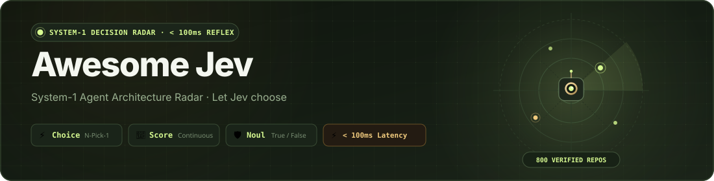

<div align="center">

<a href="https://logicrw.github.io/awesome-jev-projects/en/"></a>

# Awesome Jev — System-1 Agent Architecture Radar

<p align="center">
  <a href="https://awesome.re"></a>
  <a href="https://logicrw.github.io/awesome-jev-projects/en/"></a>
  <a href="#categories"></a>
  <a href="LICENSE"></a>
  <a href="https://github.com/logicrw/awesome-jev-projects/issues/new?template=project.yml"></a>
</p>

<p align="center">
  <b>English</b> &nbsp;•&nbsp; <a href="README.zh-CN.md">简体中文</a> &nbsp;•&nbsp; <a href="README.ja.md">日本語</a> &nbsp;•&nbsp; <a href="README.ko.md">한국어</a>
</p>

<p align="center">
  <a href="https://logicrw.github.io/awesome-jev-projects/en/">🌐 <b>Search and filter ↗</b></a> &nbsp;｜&nbsp; <a href="#install-the-agent-skill">🤖 <b>Install the Agent Skill</b></a> &nbsp;｜&nbsp; <a href="#categories">📂 <b>Categories</b></a> &nbsp;｜&nbsp; <a href="https://github.com/logicrw/awesome-jev-projects/issues/new?template=project.yml">🚀 <b>Submit a project (Issue only)</b></a>
</p>

> [!IMPORTANT]
> **Submissions via Issues Only · No Pull Requests**: Awesome Jev operates as an automated catalog radar where the site frontend and CI pipeline are strictly maintained by the core team. This repository **does not accept Pull Requests of any kind (they will be closed automatically)**. All project submissions and updates are handled **exclusively via [GitHub Issues](https://github.com/logicrw/awesome-jev-projects/issues/new?template=project.yml)**.

</div>

## 💡 **Why Jev & System-1 Decision Architecture?**

When building autonomous agents, routing every small branching decision to a heavy reasoning model (System 2) incurs seconds of latency, runaway token costs, and context drift.

**TypeSafe Jev (System 1)** is purpose-built for fast, typed discrete decisions:
- ⚡ **Sub-100ms Latency**: Delivers decisions in 50–100ms to keep agent loops snappy.
- 🎯 **Native Typed Outputs**: Built-in primitives for `Choice`, `Score`, and `Noul` without fragile JSON regex parsing.
- 🛡️ **Zero Vaporware**: 859+ projects and resources across 17 categories, distinguishing descriptive material from implementation evidence.

### 📊 Architecture Comparison: System 1 (Jev) vs System 2 (Reasoning LLMs)

| Dimension | System 2 (Reasoning LLMs) | TypeSafe Jev (System 1 Radar) |
| :--- | :--- | :--- |
| **Latency** | 1,500ms – 5,000ms+ (Slow) | **50ms – 100ms (Sub-second reflex)** |
| **Output Type** | Unstructured text / fragile JSON regex | **Native typed `Choice`, `Score`, `Noul`** |
| **Token Economy** | High cost ($1.00 – $15.00 / 1M tokens) | **Ultra-lightweight (fraction of a cent)** |
| **Context Drift** | Prone to hallucinations & attention fade | **Deterministic bounded state machine** |
| **Primary Domain** | High-level planning, open-ended generation | **Tool routing, action dispatch, safety gates** |

### 🎮 Key Interactive Features

- 🎰 **Tactile Gacha Dispatcher**: Discover discrete decision points with real-time streak counting and **10-draw fireworks celebrations (💥 BOOM!)**.
- ⚡ **Sticky Search & Floating Popover Filter**: Filter tags and categories anytime while scrolling via the anchored toolbar popover.
- 🔍 **Fixed-Version Material**: Inspect linked source, SQL, documentation, or examples together with each entry’s review basis.

> **[Search and filter ↗](https://logicrw.github.io/awesome-jev-projects/en/)** · **859 curated projects**

A community catalog of Jev integrations, benchmarks, developer tools, research, and learning resources, with per-entry relationships, review basis, and license facts.

The catalog includes integrations, benchmarks, developer tools, research, and learning resources. New entries distinguish their Jev relationship and implementation or descriptive review material. Inclusion does not establish independent runtime or performance verification.

Licenses are recorded as identified, custom, or undeclared. Public access alone does not grant permission to use, modify, or redistribute.

## Sponsorship · Paid placements

Founding partner slots are open. There are no paid sponsors yet.

[Plans and contact](https://github.com/logicrw/awesome-jev-projects/blob/main/SPONSORING.md) · [Sponsors](https://github.com/logicrw/awesome-jev-projects/blob/main/SPONSORS.md)

Sponsorship does not change inclusion review, project descriptions, or organic ranking.

## Install the Agent Skill

Install the skill to query projects by domain and inspect pinned source evidence directly from your terminal or agent.

```bash
npx skills add logicrw/awesome-jev-projects
npx skills add https://logicrw.github.io/awesome-jev-projects/
```

[Agent Skill](https://logicrw.github.io/awesome-jev-projects/skill.md) · [llms.txt](https://logicrw.github.io/awesome-jev-projects/llms.txt) · [llms-full.txt](https://logicrw.github.io/awesome-jev-projects/llms-full.txt)

## Categories

- [Browser & OS Action (55)](https://logicrw.github.io/awesome-jev-projects/en/categories/browser-os-action/)
- [CLI & Pipelines (103)](https://logicrw.github.io/awesome-jev-projects/en/categories/cli-pipelines/)
- [Classification (2)](https://logicrw.github.io/awesome-jev-projects/en/categories/classification-taxonomy/)
- [Code Navigation (16)](https://logicrw.github.io/awesome-jev-projects/en/categories/codebase-graph-pathfinding/)
- [Context GC (43)](https://logicrw.github.io/awesome-jev-projects/en/categories/context-gc-filter/)
- [Creative Tools (26)](https://logicrw.github.io/awesome-jev-projects/en/categories/creative-tools/)
- [Data & Search (52)](https://logicrw.github.io/awesome-jev-projects/en/categories/data-search/)
- [Decision Tools (42)](https://logicrw.github.io/awesome-jev-projects/en/categories/decision-tools/)
- [Domain Tools (97)](https://logicrw.github.io/awesome-jev-projects/en/categories/domain-vertical-tools/)
- [Evaluation & Observability (30)](https://logicrw.github.io/awesome-jev-projects/en/categories/evaluation-observability/)
- [High-Frequency / Games (57)](https://logicrw.github.io/awesome-jev-projects/en/categories/high-frequency-simulation/)
- [MCP & Integrations (56)](https://logicrw.github.io/awesome-jev-projects/en/categories/mcp-integrations/)
- [Model Routing (70)](https://logicrw.github.io/awesome-jev-projects/en/categories/routing-cost-optimization/)
- [SDK & Decision Frameworks (132)](https://logicrw.github.io/awesome-jev-projects/en/categories/sdk-decision-frameworks/)
- [SDK Integrations (6)](https://logicrw.github.io/awesome-jev-projects/en/categories/sdk-integrations/)
- [Security & Guardrails (68)](https://logicrw.github.io/awesome-jev-projects/en/categories/security-guardrails/)
- [Voice & Conversation (4)](https://logicrw.github.io/awesome-jev-projects/en/categories/voice-conversation/)

## Browser & OS Action

- [**cua**](https://github.com/trycua/cua) — Cua’s preview jev-use example pairs Driver observation and execution with bounded Jev browser-action choices.
  - **Jev’s role in this entry**: Reads DOM or supported visual-region descriptions and returns a supplied candidate action ID.
  - **What this project offers**: Provides Python and TypeScript loops with separate offline and live checks.
  - [Entry details and fixed-version material](https://logicrw.github.io/awesome-jev-projects/en/projects/trycua/cua/) · License: MIT

- [**jev-ultrafast**](https://github.com/browser-use/jev-ultrafast) — A browser Agent that uses Jev to choose actions and page controls, calling a text model only when input is needed.
  - **Jev’s role in this entry**: Chooses an action and its matching DOM element in one request; a text model generates input text.
  - **What this project offers**: Separates UI choices, text generation, and browser execution so each step can be inspected.
  - [Entry details and fixed-version material](https://logicrw.github.io/awesome-jev-projects/en/projects/jev-ultrafast/) · License: MIT

- [**jev-desktop**](https://github.com/lahfir/agent-desktop) — An optional Jev skill for agent-desktop that chooses controls and actions from native accessibility data.
  - **Jev’s role in this entry**: Jev selects a target and action and estimates presence and risk; local policy decides whether to execute.
  - **What this project offers**: Keeps the full UI tree out of the main Agent context while exposing the selected action.
  - [Entry details and fixed-version material](https://logicrw.github.io/awesome-jev-projects/en/projects/jev-desktop/) · License: Apache-2.0

- [**typesafe-computer-use**](https://github.com/awlevin/typesafe-computer-use) — Builds candidate actions from OCR and UI state for Jev to control macOS, calling a text model only when writing is needed.
  - **Jev’s role in this entry**: Selects the next step from deterministically extracted controls and actions before desktop execution.
  - **What this project offers**: Separates screen reading, action selection, and text generation.
  - [Entry details and fixed-version material](https://logicrw.github.io/awesome-jev-projects/en/projects/awlevin/typesafe-computer-use/) · License: MIT

- [**jev-browser-use**](https://github.com/wy-coliney/jev-browser-use) — A Skill for Codex browser workflows: Jev chooses navigation, clicks, and scrolling while Codex handles text input and final checks.
  - **Jev’s role in this entry**: Sends page state and permitted candidates to Jev; the existing browser connection executes the actions.
  - **What this project offers**: Separates repetitive page choices into decision steps while reusing the browser connection.
  - [Entry details and fixed-version material](https://logicrw.github.io/awesome-jev-projects/en/projects/wy-coliney/jev-browser-use/) · License: MIT

- [**Jev-cu**](https://github.com/Sac-Y/Jev-cu) — A Codex Computer Use loop sending text candidates to Jev while desktop tools observe and act.
  - **Jev’s role in this entry**: Chooses targets and actions and assesses completion and risk; local policy controls execution or confirmation.
  - **What this project offers**: Uses text candidates and starts with a dry run by default.
  - [Entry details and fixed-version material](https://logicrw.github.io/awesome-jev-projects/en/projects/sac-y/jev-cu/) · License: License not declared

- [**omg.dev**](https://github.com/BennyKok/omg.dev) — An omg.dev mobile testing script can use Jev to read the accessibility tree and choose the next interaction.
  - **Jev’s role in this entry**: Chooses controls and checks completion or blockage before the test runner operates the UI.
  - **What this project offers**: Adds choices grounded in current UI state to mobile testing.
  - [Entry details and fixed-version material](https://logicrw.github.io/awesome-jev-projects/en/projects/bennykok/omg.dev/) · License: MIT

- [**mobile-jev**](https://github.com/droidrun/mobile-jev) — Controls an Android phone through Mobilerun, with a web studio and CLI showing Jev decisions.
  - **Jev’s role in this entry**: Chooses apps, controls and next actions from phone state; Mobilerun executes them.
  - **What this project offers**: Records action traces and request latency for inspection.
  - [Entry details and fixed-version material](https://logicrw.github.io/awesome-jev-projects/en/projects/droidrun/mobile-jev/) · License: MIT

- [**jev-voice-browser**](https://github.com/moritzkremb/jev-voice-browser) — Controls a Playwright browser by sending incremental speech transcripts to Jev.
  - **Jev’s role in this entry**: Chooses intent, elements, URLs or verbatim spans and judges command completeness and sensitive actions.
  - **What this project offers**: Shows probabilities, actions and request timing during voice interaction.
  - [Entry details and fixed-version material](https://logicrw.github.io/awesome-jev-projects/en/projects/moritzkremb/jev-voice-browser/) · License: MIT

- [**jev-browser**](https://github.com/jkudish/jev-browser) — Drives a browser from a task and URL, returning the final page, screenshot and action trace.
  - **Jev’s role in this entry**: Chooses DOM actions and judges goal completion or stalled progress; a separate model can supply typed text.
  - **What this project offers**: Records proposed actions, execution and stop reasons for inspection.
  - [Entry details and fixed-version material](https://logicrw.github.io/awesome-jev-projects/en/projects/jkudish/jev-browser/) · License: MIT

- [**jev-use**](https://github.com/savka777/jev-use) — Voice and typed computer use for macOS. You say what you want. Jev picks the next on-screen action. macOS performs it. No screenshots: the app reads the screen through the Accessibility tree.
  - **Jev’s role in this entry**: Jev returns a structured decision for the local program; consult the source for the exact decision policy.
  - **What this project offers**: Adds structured choices or scores to the workflow; performance and cost benefits have not been independently verified.
  - [Entry details and fixed-version material](https://logicrw.github.io/awesome-jev-projects/en/projects/savka777/jev-use/) · License: MIT

- [**fastbrowse**](https://github.com/agent-labs-dev/fastbrowse) — A fast browser agent: Jev picks each action from DOM elements on the page, an LLM plans, and claims cite verifiable page quotes.
  - **Jev’s role in this entry**: Jev selects the target DOM element and interaction type in a single request based on current page state and goal.
  - **What this project offers**: Decouples element selection from heavy text generation, slashing latency and token usage for each browsing step.
  - [Entry details and fixed-version material](https://logicrw.github.io/awesome-jev-projects/en/projects/agent-labs-dev/fastbrowse/) · License: MIT

- [**jev-voice**](https://github.com/kevinbadi/jev-voice) — Talk to your Mac. Local whisper.cpp + one Jev (TypeSafe) call per command + macOS automation.
  - **Jev’s role in this entry**: Jev returns a structured decision for the local program; consult the source for the exact decision policy.
  - **What this project offers**: Adds structured choices or scores to the workflow; performance and cost benefits have not been independently verified.
  - [Entry details and fixed-version material](https://logicrw.github.io/awesome-jev-projects/en/projects/kevinbadi/jev-voice/) · License: MIT

- [**jev-browser**](https://github.com/Ying-Kai-Liao/jev-browser) — A browser library, CLI and MCP server where the caller supplies goals and text while Jev selects actions.
  - **Jev’s role in this entry**: Chooses elements, actions and values, and assesses completion, errors and irreversible steps.
  - **What this project offers**: Separates browser-action loops from caller planning and returns status and traces.
  - [Entry details and fixed-version material](https://logicrw.github.io/awesome-jev-projects/en/projects/ying-kai-liao/jev-browser/) · License: MIT

- [**typesafe-adblock**](https://github.com/realZachi/typesafe-adblock) — An experimental Chrome extension that asks Jev whether candidate DOM elements are ads, then highlights or removes them.
  - **Jev’s role in this entry**: Batches element text, labels, and link information into Noul questions and applies a threshold.
  - **What this project offers**: Shows how semantic judgments can be connected to concrete page elements.
  - [Entry details and fixed-version material](https://logicrw.github.io/awesome-jev-projects/en/projects/realzachi/typesafe-adblock/) · License: MIT

- [**JevBrowserExt**](https://github.com/chy4pro/JevBrowserExt) — A Manifest V3 Chrome port of jev-ultrafast: Jev picks the operation and DOM element in one request per step; a small chat model fills TYPE\_TEXT.
  - **Jev’s role in this entry**: Chooses CLICK, TYPE\_TEXT, SELECT, SCROLL\_DOWN, SCROLL\_UP, PRESS\_ENTER, WAIT, DONE, or BLOCKED and the matching DOM target in one request; PRESS\_ENTER is a separate key control. Separate yes/no checks cover goal completion and a stuck loop.
  - **What this project offers**: Runs in the user’s own tabs without screenshots, and keeps the action, target, and typed string inspectable.
  - [Entry details and fixed-version material](https://logicrw.github.io/awesome-jev-projects/en/projects/chy4pro/jevbrowserext/) · License: MIT

- [**jev-macos-loop**](https://github.com/jcpsimmons/jev-macos-loop) — A native macOS automation loop using local OCR and accessibility information with Jev action selection.
  - **Jev’s role in this entry**: Jev selects controls or groups from locally observed candidates; coordinates and input execution stay on the Mac.
  - **What this project offers**: Makes candidate controls and execution checks inspectable, including Finder workflows.
  - [Entry details and fixed-version material](https://logicrw.github.io/awesome-jev-projects/en/projects/jcpsimmons/jev-macos-loop/) · License: AGPL-3.0

- [**jevfill**](https://github.com/imohitmayank/jevfill) — Open \`test/sample-form.html\` in the browser, configure the extension, and click \*\*Autofill page\*\*.
  - **Jev’s role in this entry**: Jev returns a structured decision for the local program; consult the source for the exact decision policy.
  - **What this project offers**: Adds structured choices or scores to the workflow; performance and cost benefits have not been independently verified.
  - [Entry details and fixed-version material](https://logicrw.github.io/awesome-jev-projects/en/projects/imohitmayank/jevfill/) · License: MIT

- [**jev-ego**](https://github.com/romaluev/jev-ego) — A browser Agent for ego lite that numbers actionable elements for Jev to choose the next step.
  - **Jev’s role in this entry**: Jev selects an operation and target in one request; a separate helper handles free-form text when needed.
  - **What this project offers**: Offers observation, suggestions and execution, while uploads and dialogs still require other browser tools.
  - [Entry details and fixed-version material](https://logicrw.github.io/awesome-jev-projects/en/projects/romaluev/jev-ego/) · License: License not declared

- [**jev-agent-browser**](https://github.com/forvela/jev-agent-browser) — Fast, bounded browser agents powered by Jev and agent-browser — typed actions, research, classification, and safe orchestration.
  - **Jev’s role in this entry**: Jev returns a structured decision for the local program; consult the source for the exact decision policy.
  - **What this project offers**: Adds structured choices or scores to the workflow; performance and cost benefits have not been independently verified.
  - [Entry details and fixed-version material](https://logicrw.github.io/awesome-jev-projects/en/projects/forvela/jev-agent-browser/) · License: MIT

- [**CUA-JEV**](https://github.com/ZJU-REAL/CUA-JEV) — The \[experimental open-task paths\](docs/OPEN\_TASKS.md) separate model planning from Jev's typed action selection. They discover browser DOM elements or Windows UI Automation controls dynamically and offer grounded structured-tool / physical-GUI alternatives without a site- or app-specific click sequence. A twelve-action browser-to-VS-Code research case now runs end to end with a model and Jev, but \*\*arbitrary-task generalization is not claimed\*\*.
  - **Jev’s role in this entry**: Jev returns a structured decision for the local program; consult the source for the exact decision policy.
  - **What this project offers**: Adds structured choices or scores to the workflow; performance and cost benefits have not been independently verified.
  - [Entry details and fixed-version material](https://logicrw.github.io/awesome-jev-projects/en/projects/zju-real/cua-jev/) · License: License not declared

- [**jev-browser**](https://github.com/tontoko/jev-browser) — Playwright browser automation with Jev decisions through a shared CLI, MCP server and TypeScript SDK.
  - **Jev’s role in this entry**: Jev chooses actions, matches form fields or extracts structured content from page observations; Playwright executes.
  - **What this project offers**: Supports persistent sessions and UI readback, which does not by itself prove database persistence.
  - [Entry details and fixed-version material](https://logicrw.github.io/awesome-jev-projects/en/projects/tontoko/jev-browser/) · License: Apache-2.0

- [**aside-jev**](https://github.com/himomohi/aside-jev) — An MCP server and skill adding Jev decisions to Aside browser Agents.
  - **Jev’s role in this entry**: The Agent supplies action candidates; Jev picks an ID, then the Agent executes and verifies it through Aside.
  - **What this project offers**: Keeps choices within an application-owned action table while requiring separate outcome verification.
  - [Entry details and fixed-version material](https://logicrw.github.io/awesome-jev-projects/en/projects/himomohi/aside-jev/) · License: MIT

- [**AskJev**](https://github.com/ranjan2829/AskJev) — Connects Agents to a browser over MCP, using Jev to choose page actions with confirmation gates for actions such as payment or deletion.
  - **Jev’s role in this entry**: Selects actions from current page controls and assesses risk and irreversibility.
  - **What this project offers**: Combines automated page actions with user confirmation in one workflow.
  - [Entry details and fixed-version material](https://logicrw.github.io/awesome-jev-projects/en/projects/ranjan2829/askjev/) · License: MIT

- [**jev-mobile**](https://github.com/Friedjof/jev-mobile) — \`jev-mobile\` accepts a high-level task, persists it in SQLite, and lets one durable worker execute \*\*observe → normalize → decide → mutate → verify\*\* against a USB-connected Android device. Jev receives concise semantics and technically valid actions; it never generates coordinates, MCP calls, or arbitrary code.
  - **Jev’s role in this entry**: Jev returns a structured decision for the local program; consult the source for the exact decision policy.
  - **What this project offers**: Adds structured choices or scores to the workflow; performance and cost benefits have not been independently verified.
  - [Entry details and fixed-version material](https://logicrw.github.io/awesome-jev-projects/en/projects/friedjof/jev-mobile/) · License: MIT

- [**jev-clerk**](https://github.com/stas4000/jev-clerk) — A macOS desktop clerk that books supplier invoices: Jev picks each click from a closed action list; a deep model only rewrites the playbook.
  - **Jev’s role in this entry**: POSTs https://api.typesafe.ai/v1/systemone as jev-latest with a closed action Choice each step.
  - **What this project offers**: Screen actions follow Jev's closed choices. Author demo numbers were not retested here. GitHub SPDX is empty; the LICENSE file is MIT.
  - [Entry details and fixed-version material](https://logicrw.github.io/awesome-jev-projects/en/projects/stas4000/jev-clerk/) · License: License not declared

- [**jev-yt-time-saver**](https://github.com/jaibhasin/jev-yt-time-saver) — This project integrates Jev to provide structured decisions for its workflow. See the repository for implementation details.
  - **Jev’s role in this entry**: Jev returns a structured decision for the local program; consult the source for the exact decision policy.
  - **What this project offers**: Adds structured choices or scores to the workflow; performance and cost benefits have not been independently verified.
  - [Entry details and fixed-version material](https://logicrw.github.io/awesome-jev-projects/en/projects/jaibhasin/jev-yt-time-saver/) · License: License not declared

- [**computer-use-jev**](https://github.com/paulsmith/computer-use-jev) — A Go-based macOS controller that asks Jev to choose controls and actions from the accessibility tree.
  - **Jev’s role in this entry**: Uses window state to select an action, target, text-input need, and completion status.
  - **What this project offers**: Grounds candidate controls in UI snapshots so choices can be inspected.
  - [Entry details and fixed-version material](https://logicrw.github.io/awesome-jev-projects/en/projects/paulsmith/computer-use-jev/) · License: MIT

- [**jev-playwright**](https://github.com/arthurfiorette/jev-playwright) — Shrinks Playwright suites in CI by letting Jev select tests related to code diffs.
  - **Jev’s role in this entry**: Reporter inspects included changes, asks Jev which tests to run, and skips the rest.
  - **What this project offers**: Speeds up CI runs and saves resources with transparent, typed selection decisions.
  - [Entry details and fixed-version material](https://logicrw.github.io/awesome-jev-projects/en/projects/arthurfiorette/jev-playwright/) · License: MIT

- [**ego-jev**](https://github.com/jiangkoumo/ego-jev) — Drive the ego lite browser with Jev (TypeSafe System One): one indexed element table in, one operation + target out, single process. ~2x faster than a per-step LLM loop in our measurements.
  - **Jev’s role in this entry**: Jev returns a structured decision for the local program; consult the source for the exact decision policy.
  - **What this project offers**: Adds structured choices or scores to the workflow; performance and cost benefits have not been independently verified.
  - [Entry details and fixed-version material](https://logicrw.github.io/awesome-jev-projects/en/projects/jiangkoumo/ego-jev/) · License: MIT

- [**jev-browser**](https://github.com/Mrlyk/jev-browser) — Browser automation CLI for AI agents, powered by the Jev model's millisecond decisions and near-zero inference costs
  - **Jev’s role in this entry**: Jev returns a structured decision for the local program; consult the source for the exact decision policy.
  - **What this project offers**: Adds structured choices or scores to the workflow; performance and cost benefits have not been independently verified.
  - [Entry details and fixed-version material](https://logicrw.github.io/awesome-jev-projects/en/projects/mrlyk/jev-browser/) · License: Apache-2.0

- [**jev-mobile**](https://github.com/xinwang-nwpu/jev-mobile) — One TypeSafe Jev decision per step over the A11Y tree, executed via ADB. No screenshots and ultra fast!
  - **Jev’s role in this entry**: Jev returns a structured decision for the local program; consult the source for the exact decision policy.
  - **What this project offers**: Adds structured choices or scores to the workflow; performance and cost benefits have not been independently verified.
  - [Entry details and fixed-version material](https://logicrw.github.io/awesome-jev-projects/en/projects/xinwang-nwpu/jev-mobile/) · License: MIT

- [**jev-ra**](https://github.com/brnyxx/jev-ra) — Browser use for coding agents, 3-5x faster than browser-use. MCP server + CLI; TypeSafe Jev decides every step in ~300 ms.
  - **Jev’s role in this entry**: Jev returns a structured decision for the local program; consult the source for the exact decision policy.
  - **What this project offers**: Adds structured choices or scores to the workflow; performance and cost benefits have not been independently verified.
  - [Entry details and fixed-version material](https://logicrw.github.io/awesome-jev-projects/en/projects/brnyxx/jev-ra/) · License: MIT

- [**jev-shield**](https://github.com/vmendes90/jev-shield) — A Chrome ad-filtering extension that uses Jev to assess promotional intent in feed elements.
  - **Jev’s role in this entry**: Batches candidate DOM elements for TypeSafe and uses Noul probabilities with thresholds to decide which to collapse.
  - **What this project offers**: Adds text-based semantic judgments alongside local ad rules.
  - [Entry details and fixed-version material](https://logicrw.github.io/awesome-jev-projects/en/projects/vmendes90/jev-shield/) · License: MIT

- [**browser-use-with-jev**](https://github.com/garry-schuette/browser-use-with-jev) — \*\*Keep Browser Use's execution engine. Move bounded decisions to Jev.\*\*
  - **Jev’s role in this entry**: Jev returns a structured decision for the local program; consult the source for the exact decision policy.
  - **What this project offers**: Adds structured choices or scores to the workflow; performance and cost benefits have not been independently verified.
  - [Entry details and fixed-version material](https://logicrw.github.io/awesome-jev-projects/en/projects/garry-schuette/browser-use-with-jev/) · License: MIT

- [**jev-2048-selenium**](https://github.com/AMMIROSOH/jev-2048-selenium) — Selenium 2048 player powered by expectimax search and TypeSafe Jev, with portrait FFmpeg recording.
  - **Jev’s role in this entry**: Jev returns a structured decision for the local program; consult the source for the exact decision policy.
  - **What this project offers**: Adds structured choices or scores to the workflow; performance and cost benefits have not been independently verified.
  - [Entry details and fixed-version material](https://logicrw.github.io/awesome-jev-projects/en/projects/ammirosoh/jev-2048-selenium/) · License: License not declared

- [**jev-browser-local**](https://github.com/rorshopping/jev-browser-local) — Run jev-browser on a fully local JEV-style decision engine (no cloud API). Warm-browser fork, VRAM guard, measured benchmarks, run traces.
  - **Jev’s role in this entry**: Jev returns a structured decision for the local program; consult the source for the exact decision policy.
  - **What this project offers**: Adds structured choices or scores to the workflow; performance and cost benefits have not been independently verified.
  - [Entry details and fixed-version material](https://logicrw.github.io/awesome-jev-projects/en/projects/rorshopping/jev-browser-local/) · License: License not declared

- [**jev-browser-qa**](https://github.com/jonymusky/jev-browser-qa) — Browser QA where Playwright drives and films, and TypeSafe Jev judges. JSON-flow CLI for agents, run dashboard, agent skill.
  - **Jev’s role in this entry**: Jev returns a structured decision for the local program; consult the source for the exact decision policy.
  - **What this project offers**: Adds structured choices or scores to the workflow; performance and cost benefits have not been independently verified.
  - [Entry details and fixed-version material](https://logicrw.github.io/awesome-jev-projects/en/projects/jonymusky/jev-browser-qa/) · License: MIT

- [**sedum**](https://github.com/sedum-dev/sedum) — Plain-English browser e2e tests cheap enough to run on every PR. Built on Jev and Playwright, open source, bring your own key.
  - **Jev’s role in this entry**: Jev returns a structured decision for the local program; consult the source for the exact decision policy.
  - **What this project offers**: Adds structured choices or scores to the workflow; performance and cost benefits have not been independently verified.
  - [Entry details and fixed-version material](https://logicrw.github.io/awesome-jev-projects/en/projects/sedum-dev/sedum/) · License: MIT

- [**ego-jev**](https://github.com/ZHUBoer/ego-jev) — Complete browser tasks with Ego Lite and actively call Jev for semantic target selection, filtering, ranking, classification and text evidence judgments.
  - **Jev’s role in this entry**: Jev returns a structured decision for the local program; consult the source for the exact decision policy.
  - **What this project offers**: Adds structured choices or scores to the workflow; performance and cost benefits have not been independently verified.
  - [Entry details and fixed-version material](https://logicrw.github.io/awesome-jev-projects/en/projects/zhuboer/ego-jev/) · License: MIT

- [**jev-browser-pilot**](https://github.com/aidil2105/jev-browser-pilot) — A bounded decision layer for browser and desktop automation: a decision-only model picks one next step; the code owns perception, content, actuation and verification.
  - **Jev’s role in this entry**: Jev returns a structured decision for the local program; consult the source for the exact decision policy.
  - **What this project offers**: Adds structured choices or scores to the workflow; performance and cost benefits have not been independently verified.
  - [Entry details and fixed-version material](https://logicrw.github.io/awesome-jev-projects/en/projects/aidil2105/jev-browser-pilot/) · License: MIT

- [**jev-browser-skill**](https://github.com/zurfyx/jev-browser-skill) — Let Jev, TypeSafe's ~100ms decision model, drive your browser. A plug-and-play skill for Claude Code and Codex.
  - **Jev’s role in this entry**: Jev returns a structured decision for the local program; consult the source for the exact decision policy.
  - **What this project offers**: Adds structured choices or scores to the workflow; performance and cost benefits have not been independently verified.
  - [Entry details and fixed-version material](https://logicrw.github.io/awesome-jev-projects/en/projects/zurfyx/jev-browser-skill/) · License: MIT

- [**jev-browser-skill**](https://github.com/ChenYCL/jev-browser-skill) — Browser use & computer use for coding agents, powered by TypeSafe Jev: calibrated judgments from a System One model, control loop in code. ego lite / Chrome / Safari · CLI + MCP
  - **Jev’s role in this entry**: Jev returns a structured decision for the local program; consult the source for the exact decision policy.
  - **What this project offers**: Adds structured choices or scores to the workflow; performance and cost benefits have not been independently verified.
  - [Entry details and fixed-version material](https://logicrw.github.io/awesome-jev-projects/en/projects/chenycl/jev-browser-skill/) · License: MIT

- [**jevis**](https://github.com/jaewgwon/jevis) — A Flutter integration\_test package that registers allowed UI actions and lets Jev pick the next action and whether the goal is done.
  - **Jev’s role in this entry**: POSTs to /v1/systemone as jev-latest: a goal Noul and a Choice over registered Flutter actions.
  - **What this project offers**: Turns natural-language tests into choices over a closed action list instead of free-form tapping.
  - [Entry details and fixed-version material](https://logicrw.github.io/awesome-jev-projects/en/projects/jaewgwon/jevis/) · License: Apache-2.0

- [**jevtest**](https://github.com/Just-Betr/jevtest) — Plain-English end-to-end tests for Android and iOS apps, driven by TypeSafe's Jev. Deterministic, strict, CI-ready.
  - **Jev’s role in this entry**: Jev returns a structured decision for the local program; consult the source for the exact decision policy.
  - **What this project offers**: Adds structured choices or scores to the workflow; performance and cost benefits have not been independently verified.
  - [Entry details and fixed-version material](https://logicrw.github.io/awesome-jev-projects/en/projects/just-betr/jevtest/) · License: MIT

- [**playwright-jev**](https://github.com/dingw530/playwright-jev) — This tool provides a Node CLI for goal-driven web E2E testing where Jev chooses the next step from a code-generated action space, playwright-cli observes and executes browser actions, and code controls inputs, deterministic assertions, and the final verdict.
  - **Jev’s role in this entry**: Jev returns a structured decision for the local program; consult the source for the exact decision policy.
  - **What this project offers**: Adds structured choices or scores to the workflow; performance and cost benefits have not been independently verified.
  - [Entry details and fixed-version material](https://logicrw.github.io/awesome-jev-projects/en/projects/dingw530/playwright-jev/) · License: MIT

- [**WindowsJev**](https://github.com/Teylersf/WindowsJev) — Token-efficient Windows automation and durable research MCP server for Codex and Claude Code, powered by TypeSafe Jev.
  - **Jev’s role in this entry**: Jev returns a structured decision for the local program; consult the source for the exact decision policy.
  - **What this project offers**: Adds structured choices or scores to the workflow; performance and cost benefits have not been independently verified.
  - [Entry details and fixed-version material](https://logicrw.github.io/awesome-jev-projects/en/projects/teylersf/windowsjev/) · License: MIT

- [**ego-jev**](https://github.com/phd-peter/ego-jev) — Connects Ego Lite snapshots and browser actions to a bounded Jev decision loop.
  - **Jev’s role in this entry**: Selects only current snapshot candidates and supported actions; another model can supply typed text.
  - **What this project offers**: Executes against current snapshot references and records step state.
  - [Entry details and fixed-version material](https://logicrw.github.io/awesome-jev-projects/en/projects/phd-peter/ego-jev/) · License: MIT

- [**ego-jev**](https://github.com/flazouh/ego-jev) — Drive ego-browser pages with TypeSafe Jev: code builds the allowed actions, Jev picks one, code acts and re-checks.
  - **Jev’s role in this entry**: Jev returns a structured decision for the local program; consult the source for the exact decision policy.
  - **What this project offers**: Adds structured choices or scores to the workflow; performance and cost benefits have not been independently verified.
  - [Entry details and fixed-version material](https://logicrw.github.io/awesome-jev-projects/en/projects/flazouh/ego-jev/) · License: MIT

- [**jev-demo**](https://github.com/PenglongHuang/jev-demo) — A zero-dependency local web demo for TypeSafe's \*\*Jev (System One)\*\* decision model: send a state plus typed questions, get choices, scores and calibrated probabilities back.
  - **Jev’s role in this entry**: Jev returns a structured decision for the local program; consult the source for the exact decision policy.
  - **What this project offers**: Adds structured choices or scores to the workflow; performance and cost benefits have not been independently verified.
  - [Entry details and fixed-version material](https://logicrw.github.io/awesome-jev-projects/en/projects/penglonghuang/jev-demo/) · License: MIT

- [**jev-tweet-radar**](https://github.com/DDnim/jev-tweet-radar) — A Chrome extension that scores each X timeline post with one Jev Noul batch for engagement value and optional tags.
  - **Jev’s role in this entry**: One System One request asks Nouls for worth-engaging plus optional tags such as spam, buzz, and AI-ish.
  - **What this project offers**: Turns timeline filtering into inspectable probabilities instead of generated commentary. Post text is sent to TypeSafe.
  - [Entry details and fixed-version material](https://logicrw.github.io/awesome-jev-projects/en/projects/ddnim/jev-tweet-radar/) · License: MIT

- [**jevaluate**](https://github.com/ElshinQ/jevaluate) — Jevaluate: evaluate before you trust. Field notes, runnable scripts and an agent skill for TypeSafe Jev: gated evals, a browser loop, a product walk with DeepSeek vision, a UI text judge and a first-click tree test. Co-authored with Claude Fable 5.1.
  - **Jev’s role in this entry**: Jev returns a structured decision for the local program; consult the source for the exact decision policy.
  - **What this project offers**: Adds structured choices or scores to the workflow; performance and cost benefits have not been independently verified.
  - [Entry details and fixed-version material](https://logicrw.github.io/awesome-jev-projects/en/projects/elshinq/jevaluate/) · License: MIT

- [**pi-Jev-browser**](https://github.com/laihenyi/pi-Jev-browser) — Browser and macOS desktop agent for pi: Jev (TypeSafe System One) chooses each action from a structured observation in a bounded, surface-agnostic loop. Isolated Playwright tools, an allow-listed accessibility-tree tool, deterministic selectors, four-tier benchmarks.
  - **Jev’s role in this entry**: Jev returns a structured decision for the local program; consult the source for the exact decision policy.
  - **What this project offers**: Adds structured choices or scores to the workflow; performance and cost benefits have not been independently verified.
  - [Entry details and fixed-version material](https://logicrw.github.io/awesome-jev-projects/en/projects/laihenyi/pi-jev-browser/) · License: Apache-2.0

- [**cline-plugin-jev-browser**](https://github.com/abeatrix/cline-plugin-jev-browser) — A Cline plugin using an isolated Playwright browser and Jev decisions through Vercel AI Gateway.
  - **Jev’s role in this entry**: Jev selects operations from a DOM target table; a separate text model supplies typed text when needed.
  - **What this project offers**: Captures before-and-after screenshots and yields on sensitive actions; completion still needs readback verification.
  - [Entry details and fixed-version material](https://logicrw.github.io/awesome-jev-projects/en/projects/abeatrix/cline-plugin-jev-browser/) · License: License not declared

- [**JevFilterForX**](https://github.com/grayrepo-byte/jev_filter_for_x) — A browser extension that scores and filters X posts in real time with Jev, folding low-signal content while keeping it expandable. Without an API key, it defaults to local mock scoring.
  - **Jev’s role in this entry**: Jev classifies posts with Choice, rates signal, actionability and originality with Score, and assigns Noul labels; local thresholds and noise rules decide whether to fold each post.
  - **What this project offers**: Adds scores, labels and adjustable filtering thresholds to the X feed, with reversible folding of posts and their attached media.
  - [Entry details and fixed-version material](https://logicrw.github.io/awesome-jev-projects/en/projects/grayrepo-byte/jev_filter_for_x/) · License: License not declared


## CLI & Pipelines

- [**foreman**](https://github.com/thruwire/foreman) — An independent supervisor loop that reads worker diffs, logs and tests, asks Jev Nouls about stuck / off-track / verify, then applies a Python policy.
  - **Jev’s role in this entry**: AsyncTypeSafeClient.system\_one with default jev-latest sends Noul questions for supervision.
  - **What this project offers**: Supervision does not write the worker's code. Distinct from cataloged Shifty-Eye-Games/foreman-jev.
  - [Entry details and fixed-version material](https://logicrw.github.io/awesome-jev-projects/en/projects/thruwire/foreman/) · License: MIT

- [**JevRev**](https://github.com/Alex314618-create/JevRev) — Your LLM can imagine, write, test, and revise. It should not have to make every cheap routing decision by itself.
  - **Jev’s role in this entry**: Jev returns a structured decision for the local program; consult the source for the exact decision policy.
  - **What this project offers**: Adds structured choices or scores to the workflow; performance and cost benefits have not been independently verified.
  - [Entry details and fixed-version material](https://logicrw.github.io/awesome-jev-projects/en/projects/alex314618-create/jevrev/) · License: MIT

- [**jev-align**](https://github.com/sutro-sh/jev-align) — 1. Evaluates the configured dataset and measures uncertainty. 2. Selects ambiguous rows plus a random audit sample for you to label. 3. Uses your accumulated labels and optional rationales to run GEPA. 4. Shows the score, certainty change, and proposed definition diff. 5. Lets you accept, reject, rewind, or resume later.
  - **Jev’s role in this entry**: Jev returns a structured decision for the local program; consult the source for the exact decision policy.
  - **What this project offers**: Adds structured choices or scores to the workflow; performance and cost benefits have not been independently verified.
  - [Entry details and fixed-version material](https://logicrw.github.io/awesome-jev-projects/en/projects/sutro-sh/jev-align/) · License: Apache-2.0

- [**orchestkit**](https://github.com/yonatangross/orchestkit) — OrchestKit can optionally use Jev to classify coding sessions and set their colors when confidence meets a threshold.
  - **Jev’s role in this entry**: Classifies the first task prompt and branch state by work type; local policy accepts the result or falls back.
  - **What this project offers**: Distinguishes sessions by work type and supports a shadow comparison mode.
  - [Entry details and fixed-version material](https://logicrw.github.io/awesome-jev-projects/en/projects/yonatangross/orchestkit/) · License: MIT

- [**jgrep**](https://github.com/keltokhy/jgrep) — Filters text, structured records, functions, and diff hunks against plain-English descriptions using Jev Noul judgments.
  - **Jev’s role in this entry**: Jev judges whether each input unit matches the user description; local code applies the probability threshold and returns matching source material.
  - **What this project offers**: Adds structured choices or scores to the workflow; performance and cost benefits have not been independently verified.
  - [Entry details and fixed-version material](https://logicrw.github.io/awesome-jev-projects/en/projects/keltokhy/jgrep/) · License: MIT

- [**skillranker**](https://github.com/Dicklesworthstone/skillranker) — A standalone Rust CLI powered by TypeSafe Jev that ranks agent skills for the next step using live session context, with local safeguards and feedback.
  - **Jev’s role in this entry**: Jev evaluates the agent live context against available skills, returning calibrated typed choices and probabilities in a single pass.
  - **What this project offers**: Replaces slow generative skill searches with millisecond Jev decisions, backed by local safety bounds and feedback loops.
  - [Entry details and fixed-version material](https://logicrw.github.io/awesome-jev-projects/en/projects/dicklesworthstone/skillranker/) · License: Custom license

- [**jev-shell-history**](https://github.com/mrnugget/jev-shell-history) — Fish-style Zsh history suggestion tool ranked by Jev, ordering candidate commands from local history based on context.
  - **Jev’s role in this entry**: Packages current command input and historical candidates into a Jev request, ranking the most plausible command for inline suggestion.
  - **What this project offers**: Combines the safety of local shell history with Jev semantic relevance, filtering out stale or risky command candidates.
  - [Entry details and fixed-version material](https://logicrw.github.io/awesome-jev-projects/en/projects/mrnugget/jev-shell-history/) · License: License not declared

- [**jev-pokemon**](https://github.com/christianmat/jev-pokemon) — Jev, an AI decision model, plays Pokémon Red. It beat the game in 37h 40m.
  - **Jev’s role in this entry**: Jev returns a structured decision for the local program; consult the source for the exact decision policy.
  - **What this project offers**: Adds structured choices or scores to the workflow; performance and cost benefits have not been independently verified.
  - [Entry details and fixed-version material](https://logicrw.github.io/awesome-jev-projects/en/projects/christianmat/jev-pokemon/) · License: GPL-2.0

- [**jev-lint**](https://github.com/mizchi/jev-lint) — lint text in code by jev scorerer
  - **Jev’s role in this entry**: Jev returns a structured decision for the local program; consult the source for the exact decision policy.
  - **What this project offers**: Adds structured choices or scores to the workflow; performance and cost benefits have not been independently verified.
  - [Entry details and fixed-version material](https://logicrw.github.io/awesome-jev-projects/en/projects/mizchi/jev-lint/) · License: MIT

- [**OneJev**](https://github.com/OmniJev/OneJev) — 🚀🚀 A multimodal System One decision model that gives calibrated answers to typed questions about screens, photos, video and text in one forward pass.
  - **Jev’s role in this entry**: Jev returns a structured decision for the local program; consult the source for the exact decision policy.
  - **What this project offers**: Adds structured choices or scores to the workflow; performance and cost benefits have not been independently verified.
  - [Entry details and fixed-version material](https://logicrw.github.io/awesome-jev-projects/en/projects/omnijev/onejev/) · License: Apache-2.0

- [**SemDecide**](https://github.com/sharziki/semdecide) — A Python CLI for semantic predicates, routing, scoring and filtering over text or JSONL.
  - **Jev’s role in this entry**: Sends input to Jev and applies local probability thresholds to outputs and exit codes.
  - **What this project offers**: Adds typed decisions to Bash and CI with explicit output and failure states.
  - [Entry details and fixed-version material](https://logicrw.github.io/awesome-jev-projects/en/projects/semdecide/) · License: MIT

- [**jev-rules**](https://github.com/EliaAlberti/jev-rules) — \*\*New in 0.5.0:\*\* \[one line under each prompt\](#in-the-conversation) names the rules Claude was given and Jev's score for each, and the \[rules pane\](#the-rules-pane) switches on with one answer: the first time Jev picks a rule, Claude asks whether you want it.
  - **Jev’s role in this entry**: Jev returns a structured decision for the local program; consult the source for the exact decision policy.
  - **What this project offers**: Adds structured choices or scores to the workflow; performance and cost benefits have not been independently verified.
  - [Entry details and fixed-version material](https://logicrw.github.io/awesome-jev-projects/en/projects/eliaalberti/jev-rules/) · License: MIT

- [**jgrep**](https://github.com/kyu1204/jgrep) — grep for what code does, not what it's called. Semantic code search powered by TypeSafe Jev.
  - **Jev’s role in this entry**: Measured (2026-09-19, jev-1.13.0): a 896-chunk TypeScript \`src/\` tree in 1.8 s for $0.010 (240k input tokens); repeat query 0 s from cache.
  - **What this project offers**: Adds structured choices or scores to the workflow; performance and cost benefits have not been independently verified.
  - [Entry details and fixed-version material](https://logicrw.github.io/awesome-jev-projects/en/projects/kyu1204/jgrep/) · License: MIT

- [**hey-jev**](https://github.com/henryklunaris/hey-jev) — Open, quit, hide, minimise or switch to apps, open a new browser tab or a website ("open youtube.com in Brave"), Mac volume up / down / mute / set, Spotify volume, play / pause / next / previous, dark mode, lock or sleep the Mac. Two things in one sentence work too: "pause Spotify and open Slack".
  - **Jev’s role in this entry**: Jev returns a structured decision for the local program; consult the source for the exact decision policy.
  - **What this project offers**: Adds structured choices or scores to the workflow; performance and cost benefits have not been independently verified.
  - [Entry details and fixed-version material](https://logicrw.github.io/awesome-jev-projects/en/projects/henryklunaris/hey-jev/) · License: License not declared

- [**jev-superpowers**](https://github.com/AkashPriyadarshii/jev-superpowers) — Software development framework for coding agents enhanced with Jev for dependency vetting, completion gates, and debugging decisions.
  - **Jev’s role in this entry**: Invokes Jev at workflow checkpoints to evaluate change validity, test sufficiency, and package safety before advancing agent state.
  - **What this project offers**: Constrains coding agent trajectories using fast discrete judgments, preventing hallucinated dependencies and premature task completion.
  - [Entry details and fixed-version material](https://logicrw.github.io/awesome-jev-projects/en/projects/akashpriyadarshii/jev-superpowers/) · License: MIT

- [**jev-test-filter**](https://github.com/mizchi/jev-test-filter) — Score every test against a git diff with Jev, and emit the filter arguments vitest, node:test, Playwright, cargo test and go test already understand
  - **Jev’s role in this entry**: Jev returns a structured decision for the local program; consult the source for the exact decision policy.
  - **What this project offers**: Adds structured choices or scores to the workflow; performance and cost benefits have not been independently verified.
  - [Entry details and fixed-version material](https://logicrw.github.io/awesome-jev-projects/en/projects/mizchi/jev-test-filter/) · License: MIT

- [**jev-skill-suggester**](https://github.com/win4r/jev-skill-suggester) — A Python CLI and Codex Skill that recommends a suitable installed skill for the current task using TypeSafe Jev Choice and Noul checks without executing candidate skills.
  - **Jev’s role in this entry**: Jev returns a structured decision for the local program; consult the source for the exact decision policy.
  - **What this project offers**: Adds structured choices or scores to the workflow; performance and cost benefits have not been independently verified.
  - [Entry details and fixed-version material](https://logicrw.github.io/awesome-jev-projects/en/projects/win4r/jev-skill-suggester/) · License: MIT

- [**slop-grader**](https://github.com/lukstei/slop-grader) — Rule-based CLI and agent skill that evaluates text and markdown files against custom rulesets for AI slop, grammar, and technical doc quality using Jev scores and line-by-line violation flags, then guides an AI agent to auto-fix violations.
  - **Jev’s role in this entry**: Jev returns a structured decision for the local program; consult the source for the exact decision policy.
  - **What this project offers**: Adds structured choices or scores to the workflow; performance and cost benefits have not been independently verified.
  - [Entry details and fixed-version material](https://logicrw.github.io/awesome-jev-projects/en/projects/lukstei/slop-grader/) · License: MIT

- [**jev-calibrate**](https://github.com/smkrv/jev-calibrate) — Jev is the typed-decision model from TypeSafe: it takes a \`state\` and a set of questions (\`noul\`, \`choice\`, \`score\`) and returns probabilities instead of text. How well a question works depends on its wording, on your data and on the threshold you cut at, and none of the three can be read off a single good-looking answer.
  - **Jev’s role in this entry**: Jev returns a structured decision for the local program; consult the source for the exact decision policy.
  - **What this project offers**: Adds structured choices or scores to the workflow; performance and cost benefits have not been independently verified.
  - [Entry details and fixed-version material](https://logicrw.github.io/awesome-jev-projects/en/projects/smkrv/jev-calibrate/) · License: MIT

- [**jev-axi**](https://github.com/shiftynick/jev-axi) — A CLI for Jev pick, rate, check, rank, triage, and guard tasks, with optional hooks before Agent tool calls.
  - **Jev’s role in this entry**: Converts input state and options into structured questions, returning results or risk scores for local policy.
  - **What this project offers**: Reuses the same decision commands in scripts and Agent workflows.
  - [Entry details and fixed-version material](https://logicrw.github.io/awesome-jev-projects/en/projects/shiftynick/jev-axi/) · License: MIT

- [**jsort**](https://github.com/keltokhy/jsort) — Ranks text along a plain-English criterion using pairwise Jev Noul comparisons and a locally fitted Bradley-Terry scale.
  - **Jev’s role in this entry**: Jev judges whether text A ranks higher than text B on the supplied criterion; local code schedules comparisons and fits a Bradley-Terry scale with standard errors.
  - **What this project offers**: Adds structured choices or scores to the workflow; performance and cost benefits have not been independently verified.
  - [Entry details and fixed-version material](https://logicrw.github.io/awesome-jev-projects/en/projects/keltokhy/jsort/) · License: MIT

- [**jev-yaba-wechat**](https://github.com/wuxie888/jev-yaba-wechat) — This project integrates Jev to provide structured decisions for its workflow. See the repository for implementation details.
  - **Jev’s role in this entry**: Jev returns a structured decision for the local program; consult the source for the exact decision policy.
  - **What this project offers**: Adds structured choices or scores to the workflow; performance and cost benefits have not been independently verified.
  - [Entry details and fixed-version material](https://logicrw.github.io/awesome-jev-projects/en/projects/wuxie888/jev-yaba-wechat/) · License: MIT

- [**jev-cli**](https://github.com/Nasrallah-AL/jev-cli) — The jevctl command-line tool connects verification, classification and scoring questions to text input and scripts.
  - **Jev’s role in this entry**: Sends input and bounded answer options to Jev, then reports judgments and probabilities using local thresholds.
  - **What this project offers**: Provides structured results for pipelines and CI, with request inspection and dry-run support.
  - [Entry details and fixed-version material](https://logicrw.github.io/awesome-jev-projects/en/projects/nasrallah-al/jev-cli/) · License: MIT

- [**jev-blindspot**](https://github.com/jsk4581/jev-blindspot) — A side panel for Claude Code and Codex CLI that shows the blind spots of each prompt you submit: what the request would have needed to consider and shows no sign of. Jev decides, in one call per prompt, whether the prompt is worth a second look; only then does the agent's own headless mode read the project and return the items. Nothing blocks the prompt, nothing is added to the session.
  - **Jev’s role in this entry**: Jev returns a structured decision for the local program; consult the source for the exact decision policy.
  - **What this project offers**: Adds structured choices or scores to the workflow; performance and cost benefits have not been independently verified.
  - [Entry details and fixed-version material](https://logicrw.github.io/awesome-jev-projects/en/projects/jsk4581/jev-blindspot/) · License: MIT

- [**jev-code**](https://github.com/rhighs/jev-code) — An experimental coding CLI where Jev selects AST productions for Python or Bash, with a separate command-line decision mode.
  - **Jev’s role in this entry**: Chooses from bounded syntax and action options; local code constructs programs or invokes tools.
  - **What this project offers**: Shows coding choices and command-line judgments in inspectable traces.
  - [Entry details and fixed-version material](https://logicrw.github.io/awesome-jev-projects/en/projects/rhighs/jev-code/) · License: License not declared

- [**jevyoumean**](https://github.com/syumai/jevyoumean) — Unlike an edit-distance \`Did you mean?\`, \`jym\` matches on \*intent\*: it hands Jev the candidate subcommand names plus their help descriptions. \`remove → rm\`, \`list → ps\`, \`undo → restore\` are close in meaning but far in spelling — that is the gap this experiment targets.
  - **Jev’s role in this entry**: Jev returns a structured decision for the local program; consult the source for the exact decision policy.
  - **What this project offers**: Adds structured choices or scores to the workflow; performance and cost benefits have not been independently verified.
  - [Entry details and fixed-version material](https://logicrw.github.io/awesome-jev-projects/en/projects/syumai/jevyoumean/) · License: MIT

- [**jev-cli**](https://github.com/tumf/jev-cli) — A CLI and stdio MCP server for typed Jev judgments over text or JSON.
  - **Jev’s role in this entry**: Submits noul, choice and score questions and emits JSON or a primary value.
  - **What this project offers**: Accepts files and stdin for use in shell scripts and MCP clients.
  - [Entry details and fixed-version material](https://logicrw.github.io/awesome-jev-projects/en/projects/tumf/jev-cli/) · License: MIT

- [**jevcache**](https://github.com/kushals256/jevcache) — MorrowCache — skip the chat call when the question is the same. OpenAI-compatible proxy. npm: @kushalicious/jevcache
  - **Jev’s role in this entry**: Jev returns a structured decision for the local program; consult the source for the exact decision policy.
  - **What this project offers**: Adds structured choices or scores to the workflow; performance and cost benefits have not been independently verified.
  - [Entry details and fixed-version material](https://logicrw.github.io/awesome-jev-projects/en/projects/kushals256/jevcache/) · License: MIT

- [**rift**](https://github.com/exYze/rift) — An optional TypeSafe decision client in the Rust coding terminal Rift for bounded Jev judgments.
  - **Jev’s role in this entry**: Sends state and typed questions to System One and parses answers for terminal workflows.
  - **What this project offers**: Adds a separate decision interface alongside generative coding models.
  - [Entry details and fixed-version material](https://logicrw.github.io/awesome-jev-projects/en/projects/exyze/rift/) · License: MIT

- [**ego-jev**](https://github.com/ZephyrDeng/ego-jev) — Jev (TypeSafe System One) inner loop for ego-browser — one ~0.4s typed decision per DOM step instead of an LLM turn. Agent skill for ego lite.
  - **Jev’s role in this entry**: Jev returns a structured decision for the local program; consult the source for the exact decision policy.
  - **What this project offers**: Adds structured choices or scores to the workflow; performance and cost benefits have not been independently verified.
  - [Entry details and fixed-version material](https://logicrw.github.io/awesome-jev-projects/en/projects/zephyrdeng/ego-jev/) · License: MIT

- [**pi-jev-model-router**](https://github.com/da-vinci-noob/pi-jev-model-router) — Route pi prompts to task-appropriate model tiers with TypeSafe Jev typed judgments. Budget-aware, with automatic fallback.
  - **Jev’s role in this entry**: Jev returns a structured decision for the local program; consult the source for the exact decision policy.
  - **What this project offers**: Adds structured choices or scores to the workflow; performance and cost benefits have not been independently verified.
  - [Entry details and fixed-version material](https://logicrw.github.io/awesome-jev-projects/en/projects/da-vinci-noob/pi-jev-model-router/) · License: MIT

- [**xscout-jev**](https://github.com/ethan-ab/xscout-jev) — xscout works for fields that are active on X: tech, AI, developer tools, crypto, finance, media, politics. Some markets barely post there; \`validate --online\` tells you early when most of the accounts you care about are missing or quiet.
  - **Jev’s role in this entry**: Jev returns a structured decision for the local program; consult the source for the exact decision policy.
  - **What this project offers**: Adds structured choices or scores to the workflow; performance and cost benefits have not been independently verified.
  - [Entry details and fixed-version material](https://logicrw.github.io/awesome-jev-projects/en/projects/ethan-ab/xscout-jev/) · License: MIT

- [**jev-browse**](https://github.com/danielnc/jev-browse) — Fast, cheap browser sub-tasks for Claude and other agents: TypeSafe Jev decisions on top of browser-harness
  - **Jev’s role in this entry**: Jev returns a structured decision for the local program; consult the source for the exact decision policy.
  - **What this project offers**: Adds structured choices or scores to the workflow; performance and cost benefits have not been independently verified.
  - [Entry details and fixed-version material](https://logicrw.github.io/awesome-jev-projects/en/projects/danielnc/jev-browse/) · License: MIT

- [**jevsearch**](https://github.com/kylemclaren/jevsearch) — Site search that understands the question. Ranked by TypeSafe's Jev model.
  - **Jev’s role in this entry**: Jev returns a structured decision for the local program; consult the source for the exact decision policy.
  - **What this project offers**: Adds structured choices or scores to the workflow; performance and cost benefits have not been independently verified.
  - [Entry details and fixed-version material](https://logicrw.github.io/awesome-jev-projects/en/projects/kylemclaren/jevsearch/) · License: MIT

- [**typesafe-jev-incident-router**](https://github.com/kyle-chalmers/typesafe-jev-incident-router) — Confidence-gated incident routing with TypeSafe Jev
  - **Jev’s role in this entry**: Jev returns a structured decision for the local program; consult the source for the exact decision policy.
  - **What this project offers**: Adds structured choices or scores to the workflow; performance and cost benefits have not been independently verified.
  - [Entry details and fixed-version material](https://logicrw.github.io/awesome-jev-projects/en/projects/kyle-chalmers/typesafe-jev-incident-router/) · License: License not declared

- [**jev-agent-tools**](https://github.com/jkudish/jev-agent-tools) — Jev transport/provider layer: multi-provider transport layer that supports fail-closed validation. Used by jkudish/jev-browser and jkudish/jev-mcp.
  - **Jev’s role in this entry**: Jev returns a structured decision for the local program; consult the source for the exact decision policy.
  - **What this project offers**: Adds structured choices or scores to the workflow; performance and cost benefits have not been independently verified.
  - [Entry details and fixed-version material](https://logicrw.github.io/awesome-jev-projects/en/projects/jkudish/jev-agent-tools/) · License: MIT

- [**prompt2jev**](https://github.com/sumleo/prompt2jev) — Agent skill and CLI that turn natural language, an LLM prompt, or the code that runs one into a TypeSafe Jev decision: typed state, Choice/Score/Noul questions, and a runnable script
  - **Jev’s role in this entry**: Jev returns a structured decision for the local program; consult the source for the exact decision policy.
  - **What this project offers**: Adds structured choices or scores to the workflow; performance and cost benefits have not been independently verified.
  - [Entry details and fixed-version material](https://logicrw.github.io/awesome-jev-projects/en/projects/sumleo/prompt2jev/) · License: MIT

- [**tryjev**](https://github.com/sugarforever/tryjev) — A playground for Jev, TypeSafe AI's fast decision model: preset scenarios on the left, an editable state plus typed questions in the middle, typed answers with probabilities on the right. Bring your own key and pick a provider: OpenRouter (\`typesafe/jev-1.13\`, \`alpha.decisions\`), Vercel AI Gateway (\`typesafe-ai/jev\`, AI SDK \`experimental\_evaluate\`) or TypeSafe's own API (\`jev-latest\`, \`POST /v1/systemone\`).
  - **Jev’s role in this entry**: Jev returns a structured decision for the local program; consult the source for the exact decision policy.
  - **What this project offers**: Adds structured choices or scores to the workflow; performance and cost benefits have not been independently verified.
  - [Entry details and fixed-version material](https://logicrw.github.io/awesome-jev-projects/en/projects/sugarforever/tryjev/) · License: MIT

- [**Jev-Desktop**](https://github.com/jacks3tr/Jev-Desktop) — Jev Desktop lets AI agents use Windows applications through MCP or the command line. Hand off a task and let Jev observe windows, choose controls, type supplied text, and navigate locally. Your agent gets the result or a request for help instead of handling every click.
  - **Jev’s role in this entry**: Jev returns a structured decision for the local program; consult the source for the exact decision policy.
  - **What this project offers**: Adds structured choices or scores to the workflow; performance and cost benefits have not been independently verified.
  - [Entry details and fixed-version material](https://logicrw.github.io/awesome-jev-projects/en/projects/jacks3tr/jev-desktop/) · License: MIT

- [**jev-linkedin-slop-filter**](https://github.com/Arpit-Khandelwal/jev-linkedin-slop-filter) — Judges every LinkedIn post as it scrolls into view and slams a rubber stamp on it — \*\*BAIT\*\*, \*\*CORP\*\*, or \*\*BRAG\*\* — with the confidence score printed on the stamp. The post stays readable underneath.
  - **Jev’s role in this entry**: Jev returns a structured decision for the local program; consult the source for the exact decision policy.
  - **What this project offers**: Adds structured choices or scores to the workflow; performance and cost benefits have not been independently verified.
  - [Entry details and fixed-version material](https://logicrw.github.io/awesome-jev-projects/en/projects/arpit-khandelwal/jev-linkedin-slop-filter/) · License: MIT

- [**jev-oas-sentinel**](https://github.com/ShuhanSun/jev-oas-sentinel) — JEV never writes a review or changes a specification. It returns typed decisions and probabilities; deterministic Python code decides whether to pass, request review, or block.
  - **Jev’s role in this entry**: Jev returns a structured decision for the local program; consult the source for the exact decision policy.
  - **What this project offers**: Adds structured choices or scores to the workflow; performance and cost benefits have not been independently verified.
  - [Entry details and fixed-version material](https://logicrw.github.io/awesome-jev-projects/en/projects/shuhansun/jev-oas-sentinel/) · License: Apache-2.0

- [**jevmetrics**](https://github.com/ishantanu/jevmetrics) — Use it to assess unfamiliar instrumentation, review candidates for reduced retention, and selectively filter metrics before they reach a primary backend. Inference runs asynchronously, and cached assessments let subsequent batches use the same decision without another API call.
  - **Jev’s role in this entry**: Jev returns a structured decision for the local program; consult the source for the exact decision policy.
  - **What this project offers**: Adds structured choices or scores to the workflow; performance and cost benefits have not been independently verified.
  - [Entry details and fixed-version material](https://logicrw.github.io/awesome-jev-projects/en/projects/ishantanu/jevmetrics/) · License: Apache-2.0

- [**Jev\_Onco\_Statistical\_Hierarchy**](https://github.com/SampleBias/Jev_Onco_Statistical_Hierarchy) — New prepares use \`molecular-origin-v6\`. The Choice, the two gated checks, and five boundary checks share the evidence and cannot read each other's answers. Boundary answers are reported with the result. Gates still use the leading score, its margin, sufficiency, and conflict. The parent of the leading class is a local lookup on the taxonomy. A request may use Jev's window: 64k tokens for the call, and 32k for the evidence plus the longest question.
  - **Jev’s role in this entry**: Jev returns a structured decision for the local program; consult the source for the exact decision policy.
  - **What this project offers**: Adds structured choices or scores to the workflow; performance and cost benefits have not been independently verified.
  - [Entry details and fixed-version material](https://logicrw.github.io/awesome-jev-projects/en/projects/samplebias/jev_onco_statistical_hierarchy/) · License: MIT

- [**jev-assist**](https://github.com/glud123/jev-assist) — Don't burn your expensive main model on grep-and-guess grunt work — let jev rank the whole repo, and save the main model for reading the right files and writing the right code.
  - **Jev’s role in this entry**: Jev returns a structured decision for the local program; consult the source for the exact decision policy.
  - **What this project offers**: Adds structured choices or scores to the workflow; performance and cost benefits have not been independently verified.
  - [Entry details and fixed-version material](https://logicrw.github.io/awesome-jev-projects/en/projects/glud123/jev-assist/) · License: MIT

- [**jev-demo**](https://github.com/kiler398/jev-demo) — This project integrates Jev to provide structured decisions for its workflow. See the repository for implementation details.
  - **Jev’s role in this entry**: Jev returns a structured decision for the local program; consult the source for the exact decision policy.
  - **What this project offers**: Adds structured choices or scores to the workflow; performance and cost benefits have not been independently verified.
  - [Entry details and fixed-version material](https://logicrw.github.io/awesome-jev-projects/en/projects/kiler398/jev-demo/) · License: License not declared

- [**jev-mode**](https://github.com/ddfeyes/jev-mode) — I kept watching coding agents burn context on decisions that aren't hard - triage 400 tickets, tag 600 files, route to one of six teams. jev-mode moves those verdicts to a typed-judgment model. I A/B'd it: 78% fewer tokens, 16x less work-attributable input, accuracy 96.1% vs 93.7%. Python, no deps, MIT.
  - **Jev’s role in this entry**: Jev returns a structured decision for the local program; consult the source for the exact decision policy.
  - **What this project offers**: Adds structured choices or scores to the workflow; performance and cost benefits have not been independently verified.
  - [Entry details and fixed-version material](https://logicrw.github.io/awesome-jev-projects/en/projects/ddfeyes/jev-mode/) · License: MIT

- [**jevcut**](https://github.com/VBS2004/jevcut) — Auto-clipper that turns long videos (podcasts, talks, essays, comedy) into short standalone clips for Shorts, Reels and TikTok. Code lists every possible cut; an AI judge picks where each clip starts and ends. Benchmarked on 38 hand-labelled videos.
  - **Jev’s role in this entry**: Jev returns a structured decision for the local program; consult the source for the exact decision policy.
  - **What this project offers**: Adds structured choices or scores to the workflow; performance and cost benefits have not been independently verified.
  - [Entry details and fixed-version material](https://logicrw.github.io/awesome-jev-projects/en/projects/vbs2004/jevcut/) · License: MIT

- [**jevopt**](https://github.com/Ramneet-Singh/jevopt) — Making intelligent compiler optimisation decisions with Jev
  - **Jev’s role in this entry**: Jev returns a structured decision for the local program; consult the source for the exact decision policy.
  - **What this project offers**: Adds structured choices or scores to the workflow; performance and cost benefits have not been independently verified.
  - [Entry details and fixed-version material](https://logicrw.github.io/awesome-jev-projects/en/projects/ramneet-singh/jevopt/) · License: GPL-3.0

- [**TypeSafe AI Playground**](https://github.com/markjaquith/typesafe-ai-playground) — Rust CLI experiments for health-information screening, comment review, tone analysis and business or occupation classification.
  - **Jev’s role in this entry**: Sends text to Jev for separate Noul probabilities, scores or category choices.
  - **What this project offers**: Offers a terminal interface for inspecting structured judgments.
  - [Entry details and fixed-version material](https://logicrw.github.io/awesome-jev-projects/en/projects/typesafe-ai-playground/) · License: MIT

- [**hermes-jev**](https://github.com/DoGMaTiiC/hermes-jev) — Hermes Agent plugin: route each turn to the one skill that fits, via TypeSafe Jev on the Vercel AI Gateway. Fail-open, opt-in, stdlib only.
  - **Jev’s role in this entry**: Jev returns a structured decision for the local program; consult the source for the exact decision policy.
  - **What this project offers**: Adds structured choices or scores to the workflow; performance and cost benefits have not been independently verified.
  - [Entry details and fixed-version material](https://logicrw.github.io/awesome-jev-projects/en/projects/dogmatiic/hermes-jev/) · License: License not declared

- [**jev-cli**](https://github.com/jtsang4/jev-cli) — A CLI for asking Jev classification, yes/no and scoring questions over text or JSON input.
  - **Jev’s role in this entry**: Evaluates typed questions over one input and returns choices and probabilities as JSON.
  - **What this project offers**: Accepts standard input and supports direct TypeSafe calls or a Vercel gateway.
  - [Entry details and fixed-version material](https://logicrw.github.io/awesome-jev-projects/en/projects/jtsang4/jev-cli/) · License: MIT

- [**jev-cli**](https://github.com/joshLong145/jev-cli) — A CLI wrapper written in python for Jev
  - **Jev’s role in this entry**: Jev returns a structured decision for the local program; consult the source for the exact decision policy.
  - **What this project offers**: Adds structured choices or scores to the workflow; performance and cost benefits have not been independently verified.
  - [Entry details and fixed-version material](https://logicrw.github.io/awesome-jev-projects/en/projects/joshlong145/jev-cli/) · License: License not declared

- [**jev-handson**](https://github.com/jkf87/jev-handson) — Jev 특강 실습 코드(1~3강): TypeSafe Jev를 Claude Code·Codex·OpenClaw에 붙이는 스킬·훅·라우터·활용 예제
  - **Jev’s role in this entry**: Jev returns a structured decision for the local program; consult the source for the exact decision policy.
  - **What this project offers**: Adds structured choices or scores to the workflow; performance and cost benefits have not been independently verified.
  - [Entry details and fixed-version material](https://logicrw.github.io/awesome-jev-projects/en/projects/jkf87/jev-handson/) · License: License not declared

- [**jev-kiyafet-bul**](https://github.com/selmakcby/jev-kiyafet-bul) — Kod yerleri: \`lib/filtre.ts\` (Adım 1), \`lib/regex.ts\`, \`lib/daralt.ts\`, \`lib/sirala.ts\` (Adım 2 + sıralama), \`lib/ara.ts\` (hat), \`lib/jev.ts\` (istemci), \`lib/kota.ts\`, \`app/api/ara/route.ts\`, \`components/\` (arayüz).
  - **Jev’s role in this entry**: Jev returns a structured decision for the local program; consult the source for the exact decision policy.
  - **What this project offers**: Adds structured choices or scores to the workflow; performance and cost benefits have not been independently verified.
  - [Entry details and fixed-version material](https://logicrw.github.io/awesome-jev-projects/en/projects/selmakcby/jev-kiyafet-bul/) · License: License not declared

- [**jev-php**](https://github.com/f-lombardo/jev-php) — \`ScoreAnswer::score\` is a probability-weighted numeric score across the provided levels.
  - **Jev’s role in this entry**: Jev returns a structured decision for the local program; consult the source for the exact decision policy.
  - **What this project offers**: Adds structured choices or scores to the workflow; performance and cost benefits have not been independently verified.
  - [Entry details and fixed-version material](https://logicrw.github.io/awesome-jev-projects/en/projects/f-lombardo/jev-php/) · License: LGPL-2.1

- [**jev-qa-demos**](https://github.com/gauravkhuraana/jev-qa-demos) — Demos for the video "Jev explained for testers": TypeSafe AI's System One model, called through \*\*Vercel AI Gateway\*\* with the AI SDK's \`experimental\_evaluate\`.
  - **Jev’s role in this entry**: Jev returns a structured decision for the local program; consult the source for the exact decision policy.
  - **What this project offers**: Adds structured choices or scores to the workflow; performance and cost benefits have not been independently verified.
  - [Entry details and fixed-version material](https://logicrw.github.io/awesome-jev-projects/en/projects/gauravkhuraana/jev-qa-demos/) · License: License not declared

- [**jev-tmmluplus-eval**](https://github.com/lianghsun/jev-tmmluplus-eval) — Jev is not a chat model. You hand it a \`state\` plus a map of typed questions, and it returns one typed answer each — with calibrated probabilities and \*\*no generated text\*\*.
  - **Jev’s role in this entry**: Jev returns a structured decision for the local program; consult the source for the exact decision policy.
  - **What this project offers**: Adds structured choices or scores to the workflow; performance and cost benefits have not been independently verified.
  - [Entry details and fixed-version material](https://logicrw.github.io/awesome-jev-projects/en/projects/lianghsun/jev-tmmluplus-eval/) · License: MIT

- [**jev-tools**](https://github.com/NomenAK/jev-tools) — Six evidence-oriented tools for pi and omp coding agents, compatible with the Jev API format.
  - **Jev’s role in this entry**: Jev returns a structured decision for the local program; consult the source for the exact decision policy.
  - **What this project offers**: Adds structured choices or scores to the workflow; performance and cost benefits have not been independently verified.
  - [Entry details and fixed-version material](https://logicrw.github.io/awesome-jev-projects/en/projects/nomenak/jev-tools/) · License: MIT

- [**jev-triage**](https://github.com/boldbug1/jev-triage) — Message triage CLI in Go, built on the Jev decision model from TypeSafe AI. Categorizes messages, scores urgency, and flags low-confidence ones for human review.
  - **Jev’s role in this entry**: Jev returns a structured decision for the local program; consult the source for the exact decision policy.
  - **What this project offers**: Adds structured choices or scores to the workflow; performance and cost benefits have not been independently verified.
  - [Entry details and fixed-version material](https://logicrw.github.io/awesome-jev-projects/en/projects/boldbug1/jev-triage/) · License: MIT

- [**openjev**](https://github.com/lookski/openjev) — Turn any local LLM into a Jev-style System One decision engine: type-safe answers with raw softmax probabilities. 100% offline, zero API cost.
  - **Jev’s role in this entry**: Jev returns a structured decision for the local program; consult the source for the exact decision policy.
  - **What this project offers**: Adds structured choices or scores to the workflow; performance and cost benefits have not been independently verified.
  - [Entry details and fixed-version material](https://logicrw.github.io/awesome-jev-projects/en/projects/lookski/openjev/) · License: MIT

- [**paper-radar-jev**](https://github.com/LYchoon/paper-radar-jev) — An automated research paper radar that fetches the latest papers from arXiv, evaluates their relevance to a configurable research profile using TypeSafe AI, and ranks them by relevance score. Designed for personalized, daily literature discovery across different research domains.
  - **Jev’s role in this entry**: Jev returns a structured decision for the local program; consult the source for the exact decision policy.
  - **What this project offers**: Adds structured choices or scores to the workflow; performance and cost benefits have not been independently verified.
  - [Entry details and fixed-version material](https://logicrw.github.io/awesome-jev-projects/en/projects/lychoon/paper-radar-jev/) · License: MIT

- [**typesafe-jev-calibrate-for-code-review**](https://github.com/Selmar/typesafe-jev-calibrate-for-code-review) — About calibrating Jev for code reviews
  - **Jev’s role in this entry**: Jev returns a structured decision for the local program; consult the source for the exact decision policy.
  - **What this project offers**: Adds structured choices or scores to the workflow; performance and cost benefits have not been independently verified.
  - [Entry details and fixed-version material](https://logicrw.github.io/awesome-jev-projects/en/projects/selmar/typesafe-jev-calibrate-for-code-review/) · License: License not declared

- [**ask-jev**](https://github.com/logicrw/ask-jev) — Ultra-fast, fail-open advisory decisions and verbatim extractive reading view for AI coding agents and CLI pipelines
  - **Jev’s role in this entry**: Jev returns a structured decision for the local program; consult the source for the exact decision policy.
  - **What this project offers**: Adds structured choices or scores to the workflow; performance and cost benefits have not been independently verified.
  - [Entry details and fixed-version material](https://logicrw.github.io/awesome-jev-projects/en/projects/logicrw/ask-jev/) · License: GPL-3.0

- [**claude-jev-funnel**](https://github.com/Shakibuzzaman3104/claude-jev-funnel) — Claude Code plugin + zero-dependency CLI for TypeSafe's Jev: judge items in bulk with calibrated yes/no, pick-one and rubric answers; handle the confident ends in code, review only the uncertain band.
  - **Jev’s role in this entry**: Jev returns a structured decision for the local program; consult the source for the exact decision policy.
  - **What this project offers**: Adds structured choices or scores to the workflow; performance and cost benefits have not been independently verified.
  - [Entry details and fixed-version material](https://logicrw.github.io/awesome-jev-projects/en/projects/shakibuzzaman3104/claude-jev-funnel/) · License: Apache-2.0

- [**codex-jev-preflight**](https://github.com/wellkilo/codex-jev-preflight) — Fail-open Codex UserPromptSubmit hook that injects TypeSafe Jev pre-task routing metadata.
  - **Jev’s role in this entry**: Jev returns a structured decision for the local program; consult the source for the exact decision policy.
  - **What this project offers**: Adds structured choices or scores to the workflow; performance and cost benefits have not been independently verified.
  - [Entry details and fixed-version material](https://logicrw.github.io/awesome-jev-projects/en/projects/wellkilo/codex-jev-preflight/) · License: MIT

- [**Jev\_steer\_or\_queue**](https://github.com/Larkspur-Wang/Jev_steer_or_queue) — Let TypeSafe Jev decide whether a message you send mid-turn should steer, queue, or interrupt your coding agent. Claude Code plugin; Codex CLI in testing.
  - **Jev’s role in this entry**: Jev returns a structured decision for the local program; consult the source for the exact decision policy.
  - **What this project offers**: Adds structured choices or scores to the workflow; performance and cost benefits have not been independently verified.
  - [Entry details and fixed-version material](https://logicrw.github.io/awesome-jev-projects/en/projects/larkspur-wang/jev_steer_or_queue/) · License: MIT

- [**jev-browser-skill**](https://github.com/wanghai673/jev-browser-skill) — This Codex Skill lets Codex drive Chrome through Jev to complete multi-step browser tasks from a goal description with preset inputs.
  - **Jev’s role in this entry**: Jev returns a structured decision for the local program; consult the source for the exact decision policy.
  - **What this project offers**: Adds structured choices or scores to the workflow; performance and cost benefits have not been independently verified.
  - [Entry details and fixed-version material](https://logicrw.github.io/awesome-jev-projects/en/projects/wanghai673/jev-browser-skill/) · License: MIT

- [**jev-model-router**](https://github.com/gualican/jev-model-router) — Routes prompts to the right Claude tier (Haiku/Sonnet/Opus) using TypeSafe's Jev model
  - **Jev’s role in this entry**: Jev returns a structured decision for the local program; consult the source for the exact decision policy.
  - **What this project offers**: Adds structured choices or scores to the workflow; performance and cost benefits have not been independently verified.
  - [Entry details and fixed-version material](https://logicrw.github.io/awesome-jev-projects/en/projects/gualican/jev-model-router/) · License: MIT

- [**jev-router**](https://github.com/AABBAASS1/jev-router) — Route any task to the right AI agent in under 1 second using Jev (TypeSafe System One). Supports Claude, ChatGPT, Cursor, and Antigravity with auto-launch on macOS, Windows, and Linux.
  - **Jev’s role in this entry**: Jev returns a structured decision for the local program; consult the source for the exact decision policy.
  - **What this project offers**: Adds structured choices or scores to the workflow; performance and cost benefits have not been independently verified.
  - [Entry details and fixed-version material](https://logicrw.github.io/awesome-jev-projects/en/projects/aabbaass1/jev-router/) · License: License not declared

- [**jevault**](https://github.com/taichocop/jevault) — Jevault suggests existing destination folders. You can explicitly select a suggestion and confirm a manual move of the classified note. Jevault never moves notes automatically.
  - **Jev’s role in this entry**: Jev returns a structured decision for the local program; consult the source for the exact decision policy.
  - **What this project offers**: Adds structured choices or scores to the workflow; performance and cost benefits have not been independently verified.
  - [Entry details and fixed-version material](https://logicrw.github.io/awesome-jev-projects/en/projects/taichocop/jevault/) · License: MIT

- [**jevcheck**](https://github.com/sathariels/jevcheck) — Probabilities and model versions move. A raw \`0.94\` is not a release decision. jevcheck records a \*\*production contract\*\* (baseline model + fixtures + expected answers) and evals a candidate against that fixture.
  - **Jev’s role in this entry**: Jev returns a structured decision for the local program; consult the source for the exact decision policy.
  - **What this project offers**: Adds structured choices or scores to the workflow; performance and cost benefits have not been independently verified.
  - [Entry details and fixed-version material](https://logicrw.github.io/awesome-jev-projects/en/projects/sathariels/jevcheck/) · License: MIT

- [**pytest-jev**](https://github.com/allebee/pytest-jev) — Extra state goes in \`context\`, such as a policy or the documents a RAG app retrieved. A claim can name it in backticks:
  - **Jev’s role in this entry**: Jev returns a structured decision for the local program; consult the source for the exact decision policy.
  - **What this project offers**: Adds structured choices or scores to the workflow; performance and cost benefits have not been independently verified.
  - [Entry details and fixed-version material](https://logicrw.github.io/awesome-jev-projects/en/projects/allebee/pytest-jev/) · License: MIT

- [**VideoAdGuard-Jev**](https://github.com/xianggelila177/VideoAdGuard-Jev) — This project integrates Jev to provide structured decisions for its workflow. See the repository for implementation details.
  - **Jev’s role in this entry**: Jev returns a structured decision for the local program; consult the source for the exact decision policy.
  - **What this project offers**: Adds structured choices or scores to the workflow; performance and cost benefits have not been independently verified.
  - [Entry details and fixed-version material](https://logicrw.github.io/awesome-jev-projects/en/projects/xianggelila177/videoadguard-jev/) · License: GPL-2.0

- [**Codex\_ChatGPT\_JEV\_Switch**](https://github.com/FlyPig23/Codex_ChatGPT_JEV_Switch) — This project integrates Jev to provide structured decisions for its workflow. See the repository for implementation details.
  - **Jev’s role in this entry**: Jev returns a structured decision for the local program; consult the source for the exact decision policy.
  - **What this project offers**: Adds structured choices or scores to the workflow; performance and cost benefits have not been independently verified.
  - [Entry details and fixed-version material](https://logicrw.github.io/awesome-jev-projects/en/projects/flypig23/codex_chatgpt_jev_switch/) · License: MIT

- [**Codex-Jev**](https://github.com/PhilippElhaus/Codex-Jev) — VS Code Codex Plugin for Jev-gated tool output integration
  - **Jev’s role in this entry**: Jev returns a structured decision for the local program; consult the source for the exact decision policy.
  - **What this project offers**: Adds structured choices or scores to the workflow; performance and cost benefits have not been independently verified.
  - [Entry details and fixed-version material](https://logicrw.github.io/awesome-jev-projects/en/projects/philippelhaus/codex-jev/) · License: MIT

- [**cursor-clijev-compaction**](https://github.com/kleosr/cursor-clijev-compaction) — TypeSafe Jev-scored context recovery for Cursor CLI (agent). Capture tool I/O, score keep/drop, re-inject after native compact.
  - **Jev’s role in this entry**: Jev returns a structured decision for the local program; consult the source for the exact decision policy.
  - **What this project offers**: Adds structured choices or scores to the workflow; performance and cost benefits have not been independently verified.
  - [Entry details and fixed-version material](https://logicrw.github.io/awesome-jev-projects/en/projects/kleosr/cursor-clijev-compaction/) · License: MIT

- [**fuzzy-jev**](https://github.com/dsaad68/fuzzy-jev) — Ask Jev typed questions about text and get calibrated probabilities back, then turn them into decisions with fuzzy rules (AND, OR, NOT, hedges, Mamdani outputs) and draw the rule base as SVG. A CLI and a Rust library (native and wasm32).
  - **Jev’s role in this entry**: Jev returns a structured decision for the local program; consult the source for the exact decision policy.
  - **What this project offers**: Adds structured choices or scores to the workflow; performance and cost benefits have not been independently verified.
  - [Entry details and fixed-version material](https://logicrw.github.io/awesome-jev-projects/en/projects/dsaad68/fuzzy-jev/) · License: MIT

- [**github-star-classifier-jev**](https://github.com/mrkpatchaa/github-star-classifier-jev) — Classify your GitHub stars into GitHub Lists with TypeSafe Jev, and review stars worth dropping
  - **Jev’s role in this entry**: Jev returns a structured decision for the local program; consult the source for the exact decision policy.
  - **What this project offers**: Adds structured choices or scores to the workflow; performance and cost benefits have not been independently verified.
  - [Entry details and fixed-version material](https://logicrw.github.io/awesome-jev-projects/en/projects/mrkpatchaa/github-star-classifier-jev/) · License: License not declared

- [**here-we-go-jev**](https://github.com/creativoma/here-we-go-jev) — The smoke test and the experiments call real APIs and cost a fraction of a cent per run. The experiments need the server running.
  - **Jev’s role in this entry**: Jev returns a structured decision for the local program; consult the source for the exact decision policy.
  - **What this project offers**: Adds structured choices or scores to the workflow; performance and cost benefits have not been independently verified.
  - [Entry details and fixed-version material](https://logicrw.github.io/awesome-jev-projects/en/projects/creativoma/here-we-go-jev/) · License: MIT

- [**jev-arena**](https://github.com/Eliot5566/jev-arena) — That's the whole bot. No code, no coordinates, no if-statements.
  - **Jev’s role in this entry**: Jev returns a structured decision for the local program; consult the source for the exact decision policy.
  - **What this project offers**: Adds structured choices or scores to the workflow; performance and cost benefits have not been independently verified.
  - [Entry details and fixed-version material](https://logicrw.github.io/awesome-jev-projects/en/projects/eliot5566/jev-arena/) · License: MIT

- [**jev-buzzword-rush**](https://github.com/pochang6/jev-buzzword-rush) — A 25-second IT buzzword game to feel how fast and cheap Jev (TypeSafe System One) is — code + Jev only, no LLM.
  - **Jev’s role in this entry**: Jev returns a structured decision for the local program; consult the source for the exact decision policy.
  - **What this project offers**: Adds structured choices or scores to the workflow; performance and cost benefits have not been independently verified.
  - [Entry details and fixed-version material](https://logicrw.github.io/awesome-jev-projects/en/projects/pochang6/jev-buzzword-rush/) · License: MIT

- [**jev-console**](https://github.com/wenchenxi/jev-console) — Jev does not generate text. You send it a \*\*state\*\* plus a set of \*\*typed questions\*\*, and it answers each one with a typed value and a calibrated probability:
  - **Jev’s role in this entry**: Jev returns a structured decision for the local program; consult the source for the exact decision policy.
  - **What this project offers**: Adds structured choices or scores to the workflow; performance and cost benefits have not been independently verified.
  - [Entry details and fixed-version material](https://logicrw.github.io/awesome-jev-projects/en/projects/wenchenxi/jev-console/) · License: MIT

- [**jev-for-splunk**](https://github.com/sispehar/jev-for-splunk) — Splunk app: the | jev search command asks TypeSafe Jev typed questions about your events and adds calibrated probabilities, choices and scores as fields, cached in the KV store.
  - **Jev’s role in this entry**: Jev returns a structured decision for the local program; consult the source for the exact decision policy.
  - **What this project offers**: Adds structured choices or scores to the workflow; performance and cost benefits have not been independently verified.
  - [Entry details and fixed-version material](https://logicrw.github.io/awesome-jev-projects/en/projects/sispehar/jev-for-splunk/) · License: License not declared

- [**jev-frontier-100**](https://github.com/softpudding/jev-frontier-100) — \*\*Jev scores 77.0%; Qwen3.5 2B with a 2,048-token thinking budget scores 82.0%; Qwen3.5 4B with the same budget scores 96.7%.\*\* This small benchmark makes Jev's observed reasoning limits tangible through nine local-model settings.
  - **Jev’s role in this entry**: Jev returns a structured decision for the local program; consult the source for the exact decision policy.
  - **What this project offers**: Adds structured choices or scores to the workflow; performance and cost benefits have not been independently verified.
  - [Entry details and fixed-version material](https://logicrw.github.io/awesome-jev-projects/en/projects/softpudding/jev-frontier-100/) · License: MIT

- [**jev-gate**](https://github.com/adamwdff/jev-gate) — This project integrates Jev to provide structured decisions for its workflow. See the repository for implementation details.
  - **Jev’s role in this entry**: Jev returns a structured decision for the local program; consult the source for the exact decision policy.
  - **What this project offers**: Adds structured choices or scores to the workflow; performance and cost benefits have not been independently verified.
  - [Entry details and fixed-version material](https://logicrw.github.io/awesome-jev-projects/en/projects/adamwdff/jev-gate/) · License: MIT

- [**jev-local**](https://github.com/tapsin/jev-local) — JEV-Local: System-1 decision engine for local LLMs. Mimics TypefAI JEV: structured choices only, no chatter, calibrated confidence. Works with Ollama, vLLM, llama.cpp, LM Studio.
  - **Jev’s role in this entry**: Jev returns a structured decision for the local program; consult the source for the exact decision policy.
  - **What this project offers**: Adds structured choices or scores to the workflow; performance and cost benefits have not been independently verified.
  - [Entry details and fixed-version material](https://logicrw.github.io/awesome-jev-projects/en/projects/tapsin/jev-local/) · License: License not declared

- [**jev-route**](https://github.com/huzeyfe07/jev-route) — Async, typed intent & tool routing for Python agents: Jev decides, a confidence gate stops weak decisions before they reach a privileged tool.
  - **Jev’s role in this entry**: Jev returns a structured decision for the local program; consult the source for the exact decision policy.
  - **What this project offers**: Adds structured choices or scores to the workflow; performance and cost benefits have not been independently verified.
  - [Entry details and fixed-version material](https://logicrw.github.io/awesome-jev-projects/en/projects/huzeyfe07/jev-route/) · License: MIT

- [**jev-skill**](https://github.com/marcodicesare-dev/jev-skill) — Jev skill for Claude Code and Codex: TypeSafe System One guide, Python CLI, 5 tested recipes, and findings from 19,367 Jev calls.
  - **Jev’s role in this entry**: Jev returns a structured decision for the local program; consult the source for the exact decision policy.
  - **What this project offers**: Adds structured choices or scores to the workflow; performance and cost benefits have not been independently verified.
  - [Entry details and fixed-version material](https://logicrw.github.io/awesome-jev-projects/en/projects/marcodicesare-dev/jev-skill/) · License: MIT

- [**jev-skills**](https://github.com/WanLanglin/jev-skills) — Claude Code & Codex skills powered by Jev, TypeSafe's System One model. 256 calibrated judgements for $0.0005 in 0.72s — 360x cheaper than Claude Opus 5. Includes the first published Jev calibration curve, measured on 4,995 real agent decisions.
  - **Jev’s role in this entry**: Jev returns a structured decision for the local program; consult the source for the exact decision policy.
  - **What this project offers**: Adds structured choices or scores to the workflow; performance and cost benefits have not been independently verified.
  - [Entry details and fixed-version material](https://logicrw.github.io/awesome-jev-projects/en/projects/wanlanglin/jev-skills/) · License: License not declared

- [**jev-switch**](https://github.com/ARCJ137442/jev-switch) — This project integrates Jev to provide structured decisions for its workflow. See the repository for implementation details.
  - **Jev’s role in this entry**: Jev returns a structured decision for the local program; consult the source for the exact decision policy.
  - **What this project offers**: Adds structured choices or scores to the workflow; performance and cost benefits have not been independently verified.
  - [Entry details and fixed-version material](https://logicrw.github.io/awesome-jev-projects/en/projects/arcj137442/jev-switch/) · License: Apache-2.0

- [**jev-toto**](https://github.com/maxlibin/jev-toto) — Counting and comparison happen in Rust, because Jev is documented as unreliable at arithmetic. Jev receives per-number facts plus plain-English labels and answers two questions per number in one request: a yes/no probability for "drawn in the next draw" and a five-level cold-to-hot score with confidence. Module layout and commands are in \`CLAUDE.md\`.
  - **Jev’s role in this entry**: Jev returns a structured decision for the local program; consult the source for the exact decision policy.
  - **What this project offers**: Adds structured choices or scores to the workflow; performance and cost benefits have not been independently verified.
  - [Entry details and fixed-version material](https://logicrw.github.io/awesome-jev-projects/en/projects/maxlibin/jev-toto/) · License: MIT

- [**jev-zork**](https://github.com/Resadan-dev/jev-zork) — Jev (TypeSafe System One) plays Zork I: one Choice per move over Jericho's valid actions, with its confidence on display. French dashboard.
  - **Jev’s role in this entry**: Jev returns a structured decision for the local program; consult the source for the exact decision policy.
  - **What this project offers**: Adds structured choices or scores to the workflow; performance and cost benefits have not been independently verified.
  - [Entry details and fixed-version material](https://logicrw.github.io/awesome-jev-projects/en/projects/resadan-dev/jev-zork/) · License: MIT

- [**jevcode**](https://github.com/miounet11/jevcode) — This repository provides an Astro-based multilingual documentation site explaining Jev's Choice, Score, and Noul decision primitives with architecture patterns and usage examples.
  - **Jev’s role in this entry**: Jev returns a structured decision for the local program; consult the source for the exact decision policy.
  - **What this project offers**: Adds structured choices or scores to the workflow; performance and cost benefits have not been independently verified.
  - [Entry details and fixed-version material](https://logicrw.github.io/awesome-jev-projects/en/projects/miounet11/jevcode/) · License: License not declared

- [**jevgrep**](https://github.com/allebee/jevgrep) — On the bundled sample (\`examples/sample.log\`, 200 lines):
  - **Jev’s role in this entry**: Jev returns a structured decision for the local program; consult the source for the exact decision policy.
  - **What this project offers**: Adds structured choices or scores to the workflow; performance and cost benefits have not been independently verified.
  - [Entry details and fixed-version material](https://logicrw.github.io/awesome-jev-projects/en/projects/allebee/jevgrep/) · License: MIT

- [**jevkit**](https://github.com/MaxIvanyshen/jevkit) — Self-hosted Jev (TypeSafe) tools for coding agents: /ask classification and /review diff triage, with CLIs, agent skills, and a Pi tool
  - **Jev’s role in this entry**: Jev returns a structured decision for the local program; consult the source for the exact decision policy.
  - **What this project offers**: Adds structured choices or scores to the workflow; performance and cost benefits have not been independently verified.
  - [Entry details and fixed-version material](https://logicrw.github.io/awesome-jev-projects/en/projects/maxivanyshen/jevkit/) · License: License not declared

- [**Jevometry**](https://github.com/Kunyanli230/Jevometry) — an Information-Geometric Analysis Toolkit for any System-one (Jev, Jevlike) agent systems
  - **Jev’s role in this entry**: Jev returns a structured decision for the local program; consult the source for the exact decision policy.
  - **What this project offers**: Adds structured choices or scores to the workflow; performance and cost benefits have not been independently verified.
  - [Entry details and fixed-version material](https://logicrw.github.io/awesome-jev-projects/en/projects/kunyanli230/jevometry/) · License: MIT

- [**jevscript**](https://github.com/amberwhitehead/jevscript) — An early language experiment whose current implementation is a Jev request-batching spike.
  - **Jev’s role in this entry**: The script compares separate and batched answers, usage and latency; the full language engine remains a design goal.
  - **What this project offers**: Useful for studying batching, not a completed compiler or interpreter.
  - [Entry details and fixed-version material](https://logicrw.github.io/awesome-jev-projects/en/projects/amberwhitehead/jevscript/) · License: License not declared

- [**pr-sieve**](https://github.com/Thestral12/pr-sieve) — A GitHub Action that compiles \`.jev.yml\` rules into Jev questions and fails, comments, or passes from the numbers.
  - **Jev’s role in this entry**: Rules become at most twelve questions (\`MAX\_JEV\_QUESTIONS\` in src/types.ts). AKIA and private-key armor from src/redact.ts fail locally in src/pipeline.ts with no Jev call.
  - **What this project offers**: Does not write reviews, suggest patches, or approve. Policy is read from the base-ref config.
  - [Entry details and fixed-version material](https://logicrw.github.io/awesome-jev-projects/en/projects/thestral12/pr-sieve/) · License: MIT

- [**r2r-jev**](https://github.com/Thneoly/r2r-jev) — Jev turns unstructured state into typed probabilistic decisions. Evidence Admission decides which observations are eligible to enter governance. R2R turns admitted evidence and events into persistent, replayable relation state.
  - **Jev’s role in this entry**: Jev returns a structured decision for the local program; consult the source for the exact decision policy.
  - **What this project offers**: Adds structured choices or scores to the workflow; performance and cost benefits have not been independently verified.
  - [Entry details and fixed-version material](https://logicrw.github.io/awesome-jev-projects/en/projects/thneoly/r2r-jev/) · License: Apache-2.0

- [**typesafe-jev-plugin**](https://github.com/arnab621/typesafe-jev-plugin) — Jev from Typesafe.ai is a "System One" AI model that returns \*\*typed, calibrated judgments\*\* instead of generating text. You define what to classify (a Choice), score (a Score), or verify (a Noul), and Jev returns a structured answer with a probability distribution — fast, cheap, and directly consumable by code.
  - **Jev’s role in this entry**: Jev returns a structured decision for the local program; consult the source for the exact decision policy.
  - **What this project offers**: Adds structured choices or scores to the workflow; performance and cost benefits have not been independently verified.
  - [Entry details and fixed-version material](https://logicrw.github.io/awesome-jev-projects/en/projects/arnab621/typesafe-jev-plugin/) · License: License not declared

- [**typesafe-jev-tools**](https://github.com/wotai-dev/typesafe-jev-tools) — A Claude Code hook that asks whether the decision you are writing needs a model at all. Includes a measured 149-row comparison of TypeSafe Jev against Claude Haiku 4.5.
  - **Jev’s role in this entry**: Jev returns a structured decision for the local program; consult the source for the exact decision policy.
  - **What this project offers**: Adds structured choices or scores to the workflow; performance and cost benefits have not been independently verified.
  - [Entry details and fixed-version material](https://logicrw.github.io/awesome-jev-projects/en/projects/wotai-dev/typesafe-jev-tools/) · License: MIT

- [**jev-planner**](https://github.com/rxova/jev-planner) — With \*\*N\*\* agents, \`--mode ultra\` makes \*\*2N + 1\*\* agent calls: drafts, reviews, and final synthesis, plus \*\*N\*\* if Jev requests another review. The default \`balanced\` makes as few as \*\*N + 1\*\* and never more than \`ultra\`; \`fast\` makes \*\*N\*\*, or \*\*N + 1\*\* when it merges. Each Jev evaluation is a separate TypeSafe call.
  - **Jev’s role in this entry**: Jev returns a structured decision for the local program; consult the source for the exact decision policy.
  - **What this project offers**: Adds structured choices or scores to the workflow; performance and cost benefits have not been independently verified.
  - [Entry details and fixed-version material](https://logicrw.github.io/awesome-jev-projects/en/projects/rxova/jev-planner/) · License: MIT

- [**slopcheck-jev**](https://github.com/harshpuri84/slopcheck-jev) — A prose linter that catches AI writing tells. Regex settles the 18 a pattern can settle. Jev takes the 15 that need reading, as 15 Nouls in one call, 604 ms median. It ships as a Claude Code \`Stop\` hook that scores Claude's own output after every turn and warns rather than blocks.
  - **Jev’s role in this entry**: \*\*Deleting a feature made it more accurate.\*\* The first build made a second Jev call to pin each tell to a sentence. Removing it took precision from 0.80 to 0.95 and latency from 1,365 ms to 575 ms. Jev returns typed answers rather than text, so a quote has to come from a second round of typed questions about lines, and that round was where every defect lived. The README documents the two intermediate designs that were worse.
  - **What this project offers**: Adds structured choices or scores to the workflow; performance and cost benefits have not been independently verified.
  - [Entry details and fixed-version material](https://logicrw.github.io/awesome-jev-projects/en/projects/harshpuri84/slopcheck-jev/) · License: MIT


## Classification

- [**typesafe-jev-workflow**](https://github.com/GiesN/typesafe-jev-workflow) — An async LangGraph example that classifies mocked emails as invoice-related or general.
  - **Jev’s role in this entry**: Jev returns invoice or general; graph nodes choose the corresponding demo handler.
  - **What this project offers**: Separates model classification from local workflow routing.
  - [Entry details and fixed-version material](https://logicrw.github.io/awesome-jev-projects/en/projects/giesn/typesafe-jev-workflow/) · License: License not declared

- [**jev-tree**](https://github.com/reachjalil/jev-tree) — A hierarchical selector that asks Jev to traverse branches when a catalog has too many options for one question.
  - **Jev’s role in this entry**: Selects one branch at each level and continues until it reaches a final candidate.
  - **What this project offers**: Returns the selected path without silently truncating the tail of a large catalog.
  - [Entry details and fixed-version material](https://logicrw.github.io/awesome-jev-projects/en/projects/reachjalil/jev-tree/) · License: MIT


## Code Navigation

- [**jevgrep**](https://github.com/dzhng/jevgrep) — Find code by asking what it does. A CLI for coding agents that uses Jev to discover relevant files and source context with exact excerpts and line numbers.
  - **Jev’s role in this entry**: Jev evaluates source declarations across directories and files to decide relevance, implementation scope, and referenced symbols for natural-language behavior queries.
  - **What this project offers**: Zero embeddings or index required; returns relevant files, reading leads, and verbatim source excerpts in one stdout response, saving ~30% cost on agent benchmarks.
  - [Entry details and fixed-version material](https://logicrw.github.io/awesome-jev-projects/en/projects/dzhng/jevgrep/) · License: MIT

- [**celesto**](https://github.com/CelestoAI/celesto) — A Celesto PR-review example prepares sandbox checks and compares a general model with Jev on candidate findings.
  - **Jev’s role in this entry**: Judges whether a finding was introduced by the change, is supported and merits a fix.
  - **What this project offers**: Shows execution records and reviewer judgments together.
  - [Entry details and fixed-version material](https://logicrw.github.io/awesome-jev-projects/en/projects/celestoai/celesto/) · License: Apache-2.0

- [**Jev Review**](https://github.com/devagrawal09/jev-review) — Reviews a Git diff or a codebase in stages and displays review leads in a local dashboard.
  - **Jev’s role in this entry**: Judges risk, files, evidence regions, mechanisms and severity before rule-based reviewer routing.
  - **What this project offers**: Connects review leads to concrete code for human inspection.
  - [Entry details and fixed-version material](https://logicrw.github.io/awesome-jev-projects/en/projects/jev-review/) · License: MIT

- [**neo4jev**](https://github.com/jexp/neo4jev) — Navigates a Neo4j graph one hop at a time, asking Jev which relationship to follow next.
  - **Jev’s role in this entry**: Choice scores neighboring relationships and Noul checks goal completion; local beam search retains candidate paths.
  - **What this project offers**: Connects a natural-language goal to inspectable graph paths.
  - [Entry details and fixed-version material](https://logicrw.github.io/awesome-jev-projects/en/projects/neo4jev/) · License: MIT

- [**jev-code**](https://github.com/devagrawal09/jev-code) — Helps coding Agents locate code, check change intent, triage test failures, and organize review findings.
  - **Jev’s role in this entry**: Selects a fixed workflow and makes structured judgments over bounded diffs, code, or log excerpts.
  - **What this project offers**: Returns inspectable leads and states which parts were not checked.
  - [Entry details and fixed-version material](https://logicrw.github.io/awesome-jev-projects/en/projects/devagrawal09/jev-code/) · License: MIT

- [**jevgrep**](https://github.com/nassim-arifette/jevgrep) — Jev-powered semantic code search for coding agents — find behavior across repositories via CLI or MCP, with exact source excerpts and line numbers.
  - **Jev’s role in this entry**: Jev returns a structured decision for the local program; consult the source for the exact decision policy.
  - **What this project offers**: Adds structured choices or scores to the workflow; performance and cost benefits have not been independently verified.
  - [Entry details and fixed-version material](https://logicrw.github.io/awesome-jev-projects/en/projects/nassim-arifette/jevgrep/) · License: MIT

- [**Blink**](https://github.com/ellipsis-dev/blink) — Finds files from a natural-language query using multiple walkers through the directory tree.
  - **Jev’s role in this entry**: Jev scores file and directory names; code distributes walkers using those probabilities.
  - **What this project offers**: Searches without a vector index and reports the share of walkers reaching each path.
  - [Entry details and fixed-version material](https://logicrw.github.io/awesome-jev-projects/en/projects/blink/) · License: License not declared

- [**jev**](https://github.com/BorisLeMeec/jev) — A Go Claude Code plugin using Jev to find files, answer bounded questions across code and handle large reads.
  - **Jev’s role in this entry**: Screens and verifies code relevance before whole files enter the agent context.
  - **What this project offers**: Returns file locations and judgments for focused inspection.
  - [Entry details and fixed-version material](https://logicrw.github.io/awesome-jev-projects/en/projects/borislemeec/jev/) · License: MIT

- [**commit-miner**](https://github.com/devanshbatham/commit-miner) — Classifies Git commit messages and diffs with Jev for bug fixes, security fixes, CWEs, and change types.
  - **Jev’s role in this entry**: Asks fixed-category questions about commits and saves results for filtering and HTML/CSV reports.
  - **What this project offers**: Organizes large commit histories into records for further review.
  - [Entry details and fixed-version material](https://logicrw.github.io/awesome-jev-projects/en/projects/devanshbatham/commit-miner/) · License: License not declared

- [**claude-jev**](https://github.com/buchmark/claude-jev) — Adds Jev checks to Claude Code review findings, debugging hypotheses, design options and search results.
  - **Jev’s role in this entry**: Scores candidate defects, explanations or options against preset questions and local policies.
  - **What this project offers**: Keeps a second judgment and its probabilities available for comparison.
  - [Entry details and fixed-version material](https://logicrw.github.io/awesome-jev-projects/en/projects/buchmark/claude-jev/) · License: MIT

- [**PiJ**](https://github.com/tonyzdev/PiJ) — A Pi-based terminal coding Agent whose main model handles reasoning, edits and tools while Jev provides advice.
  - **Jev’s role in this entry**: Jev suggests skills, reranks actual source candidates and triages failures without automatic retries or permission approval.
  - **What this project offers**: Preserves paths, line numbers, source and errors; the author’s bounded experiments do not establish universal gains.
  - [Entry details and fixed-version material](https://logicrw.github.io/awesome-jev-projects/en/projects/tonyzdev/pij/) · License: MIT

- [**leanest**](https://github.com/baronunread/leanest) — Adds Jev-based selection before an existing test runner using diffs and test source.
  - **Jev’s role in this entry**: Jev judges relevance; local policy runs tests on uncertainty, API failure or changes to the test file itself.
  - **What this project offers**: Supports shadow-mode comparison, but selected subsets cannot guarantee complete regression coverage.
  - [Entry details and fixed-version material](https://logicrw.github.io/awesome-jev-projects/en/projects/baronunread/leanest/) · License: MIT

- [**jev-review-action**](https://github.com/fatwang2/jev-review-action) — A configurable GitHub Action that reviews catalog submissions or classifies PRs and updates a templated comment.
  - **Jev’s role in this entry**: Answers policy questions over pinned repository evidence or PR patches, then applies classification rules.
  - **What this project offers**: Keeps question definitions, thresholds and comment templates inspectable.
  - [Entry details and fixed-version material](https://logicrw.github.io/awesome-jev-projects/en/projects/fatwang2/jev-review-action/) · License: MIT

- [**jev-graphrag**](https://github.com/neo4j-field/jev-graphrag) — Small demos + use-case backlog: TypeSafe AI's Jev as a calibrated decision layer for GraphRAG pipelines on Neo4j.
  - **Jev’s role in this entry**: Jev returns a structured decision for the local program; consult the source for the exact decision policy.
  - **What this project offers**: Adds structured choices or scores to the workflow; performance and cost benefits have not been independently verified.
  - [Entry details and fixed-version material](https://logicrw.github.io/awesome-jev-projects/en/projects/neo4j-field/jev-graphrag/) · License: License not declared

- [**jev-prompt-enhancer**](https://github.com/joacotornello/jev-prompt-enhancer) — Enhance your prompts using Jev by giving your coding agent a clearer task before it writes the first line.
  - **Jev’s role in this entry**: Jev returns a structured decision for the local program; consult the source for the exact decision policy.
  - **What this project offers**: Adds structured choices or scores to the workflow; performance and cost benefits have not been independently verified.
  - [Entry details and fixed-version material](https://logicrw.github.io/awesome-jev-projects/en/projects/joacotornello/jev-prompt-enhancer/) · License: License not declared

- [**jevex**](https://github.com/jimmyhealer/jevex) — One MCP tool that returns the files a coding agent should read.
  - **Jev’s role in this entry**: Jev returns a structured decision for the local program; consult the source for the exact decision policy.
  - **What this project offers**: Adds structured choices or scores to the workflow; performance and cost benefits have not been independently verified.
  - [Entry details and fixed-version material](https://logicrw.github.io/awesome-jev-projects/en/projects/jimmyhealer/jevex/) · License: MIT


## Context GC

- [**fast-jev-compaction**](https://github.com/tamaratran/fast-jev-compaction) — Prunes old tool calls and outputs for Claude Code while retaining surviving text verbatim.
  - **Jev’s role in this entry**: Separately judges whether a tool call and its full output are still needed; code keeps, truncates or drops them.
  - **What this project offers**: Avoids rewriting paths, commands and errors into a new summary.
  - [Entry details and fixed-version material](https://logicrw.github.io/awesome-jev-projects/en/projects/tamaratran/fast-jev-compaction/) · License: MIT

- [**jev-pruner**](https://github.com/tamaratran/jev-pruner) — A Claude Code output-pruning plugin filtering selected Bash output before it reaches the main model.
  - **Jev’s role in this entry**: After length and content checks, Jev judges which chunks to retain while original output is archived.
  - **What this project offers**: Short output, errors and recognized structured or source content pass through unchanged.
  - [Entry details and fixed-version material](https://logicrw.github.io/awesome-jev-projects/en/projects/tamaratran/jev-pruner/) · License: MIT

- [**Jev-Mem**](https://github.com/libingzheren/Jev-Mem) — \*\*Better memory for long-running AI agents—with fast decisions and focused reasoning.\*\*
  - **Jev’s role in this entry**: Jev returns a structured decision for the local program; consult the source for the exact decision policy.
  - **What this project offers**: Adds structured choices or scores to the workflow; performance and cost benefits have not been independently verified.
  - [Entry details and fixed-version material](https://logicrw.github.io/awesome-jev-projects/en/projects/libingzheren/jev-mem/) · License: MIT

- [**jevmem**](https://github.com/Avinash-jetwani/jevmem) — A Claude Code memory manager that uses Jev to filter decisions and rules from chat history into durable, per-repo memory.
  - **Jev’s role in this entry**: Jev evaluates conversation points to classify durable architectural rules, constraints, or discarded approaches.
  - **What this project offers**: Prevents agents from repeating past mistakes across sessions by extracting high-signal context memory without generative overhead.
  - [Entry details and fixed-version material](https://logicrw.github.io/awesome-jev-projects/en/projects/avinash-jetwani/jevmem/) · License: MIT

- [**Winnow**](https://github.com/GhalebDweikat/winnow) — A context filter for Claude Code that hides irrelevant tool-output blocks and keeps the original text available for recall.
  - **Jev’s role in this entry**: Jev scores whether Read, Bash and Grep output blocks are needed; local thresholds keep relevant or uncertain blocks.
  - **What this project offers**: Reduces visible output while retaining a way to retrieve hidden text.
  - [Entry details and fixed-version material](https://logicrw.github.io/awesome-jev-projects/en/projects/winnow/) · License: MIT

- [**bluenoise**](https://github.com/rokcso/bluenoise) — An X/Twitter filtering extension using local rules by default, with optional Jev checks for unmatched replies.
  - **Jev’s role in this entry**: When experimental AI is enabled, Jev evaluates replies missed by rules and local thresholds decide whether to hide them.
  - **What this project offers**: Applies reversible local rules first and adds model judgment only when requested.
  - [Entry details and fixed-version material](https://logicrw.github.io/awesome-jev-projects/en/projects/rokcso/bluenoise/) · License: MIT

- [**jev-use**](https://github.com/shitianfang/jev-use) — Claude Code / Codex / pi plugin that hands agent steps needing no text output to Jev (TypeSafe's judgment model) — measured p50 ~230 ms and ~$0.02 per 1,000 judgments, with typed escalation back to the LLM
  - **Jev’s role in this entry**: Jev returns a structured decision for the local program; consult the source for the exact decision policy.
  - **What this project offers**: Adds structured choices or scores to the workflow; performance and cost benefits have not been independently verified.
  - [Entry details and fixed-version material](https://logicrw.github.io/awesome-jev-projects/en/projects/shitianfang/jev-use/) · License: MIT

- [**jev-recall**](https://github.com/samdotmak/jev-recall) — Retrieve by relevance, not resemblance: filter an AI assistant's memories with TypeSafe's Jev
  - **Jev’s role in this entry**: Jev returns a structured decision for the local program; consult the source for the exact decision policy.
  - **What this project offers**: Adds structured choices or scores to the workflow; performance and cost benefits have not been independently verified.
  - [Entry details and fixed-version material](https://logicrw.github.io/awesome-jev-projects/en/projects/samdotmak/jev-recall/) · License: MIT

- [**yoshi**](https://github.com/compozy/yoshi) — Context-pruning proxy for Claude Code and Codex, employing Jev to prune redundant history while keeping tool protocols intact.
  - **Jev’s role in this entry**: Intercepts request payloads and uses Jev to score historical messages, discarding outdated tool noise before forwarding to upstream LLMs.
  - **What this project offers**: Decreases input token counts and time-to-first-token while preserving protocol compliance with client tool calling standards.
  - [Entry details and fixed-version material](https://logicrw.github.io/awesome-jev-projects/en/projects/compozy/yoshi/) · License: MIT

- [**elons-job**](https://github.com/bugkiwi/elons-job) — Local-first Chrome extension that uses Jev to filter sexual and solicitation content in X replies with reversible hidden placeholders.
  - **Jev’s role in this entry**: Scores X reply text with Jev Noul questions for sexual content, solicitation, and spam, then combines probabilities with local thresholds and structural signals.
  - **What this project offers**: Combines local rules, caching, concurrency and cost controls, and fail-open handling; it requires no X API and keeps hidden comments recoverable.
  - [Entry details and fixed-version material](https://logicrw.github.io/awesome-jev-projects/en/projects/bugkiwi/elons-job/) · License: MIT

- [**jevlogs**](https://github.com/reachjalil/jevlogs) — Adds Jev diagnostic-value, priority and routing signals to OpenTelemetry logs before deeper analysis.
  - **Jev’s role in this entry**: Scores log records and judges whether they merit further model analysis.
  - **What this project offers**: Can annotate records while preserving the existing archive path.
  - [Entry details and fixed-version material](https://logicrw.github.io/awesome-jev-projects/en/projects/reachjalil/jevlogs/) · License: MIT

- [**azdaja**](https://github.com/kubet/azdaja) — Bare, open-source RLM layer for existing coding agents
  - **Jev’s role in this entry**: Jev receives selected source material and explicit questions. It can rank passages, classify records, assess whether evidence supports a claim and judge whether records match for semantic joins. Its returned probabilities let the RLM compare results and decide what to inspect, combine or explore next.
  - **What this project offers**: Adds structured choices or scores to the workflow; performance and cost benefits have not been independently verified.
  - [Entry details and fixed-version material](https://logicrw.github.io/awesome-jev-projects/en/projects/kubet/azdaja/) · License: MIT

- [**jev-chat-for-twitch**](https://github.com/ethanplusai/jev-chat-for-twitch) — Filter any live Twitch chat with Jev: a bring-your-own-key Chrome extension
  - **Jev’s role in this entry**: Jev returns a structured decision for the local program; consult the source for the exact decision policy.
  - **What this project offers**: Adds structured choices or scores to the workflow; performance and cost benefits have not been independently verified.
  - [Entry details and fixed-version material](https://logicrw.github.io/awesome-jev-projects/en/projects/ethanplusai/jev-chat-for-twitch/) · License: MIT

- [**pi-fast-jev-compaction**](https://github.com/joelhooks/pi-fast-jev-compaction) — A Pi extension that prunes stale tool history verbatim and falls back to Pi summary compaction when needed.
  - **Jev’s role in this entry**: Judges whether calls and outputs should survive in the context sent to the model.
  - **What this project offers**: Retains the original session file and records pruning decisions.
  - [Entry details and fixed-version material](https://logicrw.github.io/awesome-jev-projects/en/projects/joelhooks/pi-fast-jev-compaction/) · License: MIT

- [**omp-jev-compaction**](https://github.com/jerryfane/omp-jev-compaction) — An Oh My Pi extension that prunes tool history verbatim and reuses decisions to limit prefix rewrites.
  - **Jev’s role in this entry**: Jev judges tool-call and output utility; the extension truncates selected content with recovery notes.
  - **What this project offers**: Remembers pruning decisions and reapplies them across requests.
  - [Entry details and fixed-version material](https://logicrw.github.io/awesome-jev-projects/en/projects/jerryfane/omp-jev-compaction/) · License: MIT

- [**fast-dev-compaction**](https://github.com/leonaaardob/fast-dev-compaction) — Codex plugin for context compaction, using Jev within session lifecycle hooks to preserve essential history while pruning noise.
  - **Jev’s role in this entry**: Assesses past conversation turns with Jev when context limits approach, selecting critical tool outputs and user requirements for retention.
  - **What this project offers**: Avoids blanket truncation or lossy re-summarization by selectively preserving exact code locations and decision traces.
  - [Entry details and fixed-version material](https://logicrw.github.io/awesome-jev-projects/en/projects/leonaaardob/fast-dev-compaction/) · License: MIT

- [**jev-skill-gate**](https://github.com/ShivamPansuriya/jev-skill-gate) — Ranks Claude Code skills for the current project to reduce the descriptions loaded by default.
  - **Jev’s role in this entry**: Assesses skills against the project stack, directory, and README before adjusting description visibility.
  - **What this project offers**: Keeps relevant descriptions while preserving manual access to other skills.
  - [Entry details and fixed-version material](https://logicrw.github.io/awesome-jev-projects/en/projects/shivampansuriya/jev-skill-gate/) · License: MIT

- [**pi-jev-context**](https://github.com/Nyarlathoteppppp/pi-jev-context) — Model performance first. Token savings second. A Pi extension with freshness-aware read dedupe, Jev log filtering, and searchable verbatim recall. Keeps existing message history intact.
  - **Jev’s role in this entry**: Jev returns a structured decision for the local program; consult the source for the exact decision policy.
  - **What this project offers**: Adds structured choices or scores to the workflow; performance and cost benefits have not been independently verified.
  - [Entry details and fixed-version material](https://logicrw.github.io/awesome-jev-projects/en/projects/nyarlathoteppppp/pi-jev-context/) · License: MIT

- [**jev-skills**](https://github.com/eran-broder/jev-skills) — Skills without the context tax. Claude Code and Codex plugin: TypeSafe's Jev decides on every turn which skills the model sees. Always-on context cost: 0 tokens.
  - **Jev’s role in this entry**: Jev returns a structured decision for the local program; consult the source for the exact decision policy.
  - **What this project offers**: Adds structured choices or scores to the workflow; performance and cost benefits have not been independently verified.
  - [Entry details and fixed-version material](https://logicrw.github.io/awesome-jev-projects/en/projects/eran-broder/jev-skills/) · License: MIT

- [**deepseek-harness-jev-pre-compaction**](https://github.com/wjw66/deepseek-harness-jev-pre-compaction) — A pre-compaction advisor for DeepSeek Harness. Runs before the standard \`compaction-basic\` backend, using TypeSafe JEV to safely prune low-value tool results from model context. Original session events stay in the append-only log; only the model-visible view is replaced with compact markers or archive pointers to reduce context bloat.
  - **Jev’s role in this entry**: Jev returns a structured decision for the local program; consult the source for the exact decision policy.
  - **What this project offers**: Adds structured choices or scores to the workflow; performance and cost benefits have not been independently verified.
  - [Entry details and fixed-version material](https://logicrw.github.io/awesome-jev-projects/en/projects/wjw66/deepseek-harness-jev-pre-compaction/) · License: MIT

- [**jevbrief**](https://github.com/Parthkomalwad/jevbrief) — \[Adapters\](#adapters) &nbsp;·&nbsp; \[Quick start\](#quick-start) &nbsp;·&nbsp; \[Game demo\](#watch-jev-play-a-game) &nbsp;·&nbsp; \[Python\](#use-it-in-python) &nbsp;·&nbsp; \[Viewer\](#see-every-decision) &nbsp;·&nbsp; \[How it works\](#how-it-works) &nbsp;·&nbsp; \[Benchmarks\](#benchmarks) &nbsp;·&nbsp; \[Build an adapter\](#build-your-own-adapter) &nbsp;·&nbsp; \[Contributing\](#contributing)
  - **Jev’s role in this entry**: Jev returns a structured decision for the local program; consult the source for the exact decision policy.
  - **What this project offers**: Adds structured choices or scores to the workflow; performance and cost benefits have not been independently verified.
  - [Entry details and fixed-version material](https://logicrw.github.io/awesome-jev-projects/en/projects/parthkomalwad/jevbrief/) · License: MIT

- [**your-signal**](https://github.com/MithrilMan/your-signal) — A BYOK Chrome extension using Jev to score X posts against personal preferences and adjust their display.
  - **Jev’s role in this entry**: Scores relevance, substance, usefulness, and promotion; local weights and thresholds control highlighting, collapsing, or hiding.
  - **What this project offers**: Makes personal feed rules adjustable and display changes reversible.
  - [Entry details and fixed-version material](https://logicrw.github.io/awesome-jev-projects/en/projects/mithrilman/your-signal/) · License: MIT

- [**alphaoptimizer**](https://github.com/alpha-tales/alphaoptimizer) — AlphaOptimizer is an open-source tool from AlphaTales that helps Codex work with large command and tool outputs. Instead of sending a huge log or search result straight into the context window, AlphaOptimizer keeps the useful parts visible, keeps the original output available for a limited time, and uses Jev to help rank what matters when an API key is configured.
  - **Jev’s role in this entry**: Jev returns a structured decision for the local program; consult the source for the exact decision policy.
  - **What this project offers**: Adds structured choices or scores to the workflow; performance and cost benefits have not been independently verified.
  - [Entry details and fixed-version material](https://logicrw.github.io/awesome-jev-projects/en/projects/alpha-tales/alphaoptimizer/) · License: MIT

- [**codex-jev-compaction**](https://github.com/Wang-auspicious/codex-jev-compaction) — Curates Codex handoff context by using Jev to select old tool records while retaining selected text verbatim.
  - **Jev’s role in this entry**: Judges relevance of eligible read-only tool records; local rules protect required content and assemble a handoff packet.
  - **What this project offers**: Preserves source references, selection reasons, and original text order in the handoff.
  - [Entry details and fixed-version material](https://logicrw.github.io/awesome-jev-projects/en/projects/wang-auspicious/codex-jev-compaction/) · License: MIT

- [**jev-compaction**](https://github.com/Waxmell114514/jev-compaction) — A context compactor that can only score, never write — so an agent's memory can't hold a fact the transcript never contained. Working demo, runs offline.
  - **Jev’s role in this entry**: Jev returns a structured decision for the local program; consult the source for the exact decision policy.
  - **What this project offers**: Adds structured choices or scores to the workflow; performance and cost benefits have not been independently verified.
  - [Entry details and fixed-version material](https://logicrw.github.io/awesome-jev-projects/en/projects/waxmell114514/jev-compaction/) · License: MIT

- [**pi-jev-compaction**](https://github.com/nourhelmi/pi-jev-compaction) — Automatic Jev context clearing for Pi. Keep the conversation, prune stale tool output, retrieve originals without rerunning commands.
  - **Jev’s role in this entry**: Jev returns a structured decision for the local program; consult the source for the exact decision policy.
  - **What this project offers**: Adds structured choices or scores to the workflow; performance and cost benefits have not been independently verified.
  - [Entry details and fixed-version material](https://logicrw.github.io/awesome-jev-projects/en/projects/nourhelmi/pi-jev-compaction/) · License: MIT

- [**fast-compaction-dsh**](https://github.com/kolawong/fast-compaction-dsh) — Verdict-based context compaction for DeepSeek Harness — replaces lossy LLM summaries with fast keep/truncate/drop decisions from jev-latest; everything kept stays verbatim. Port of tamaratran/fast-jev-compaction.
  - **Jev’s role in this entry**: Jev returns a structured decision for the local program; consult the source for the exact decision policy.
  - **What this project offers**: Adds structured choices or scores to the workflow; performance and cost benefits have not been independently verified.
  - [Entry details and fixed-version material](https://logicrw.github.io/awesome-jev-projects/en/projects/kolawong/fast-compaction-dsh/) · License: License not declared

- [**jevskill**](https://github.com/lazniak/jevskill) — Teach your coding agent to stop burning context. Jev (System One) via OpenRouter or TypeSafe: 325ms, 0.000013 USD per decision. A/B tested 99.3% fewer input tokens with accuracy up. Ships a reversible reduce and a ledger that learns when Jev pays off.
  - **Jev’s role in this entry**: Jev returns a structured decision for the local program; consult the source for the exact decision policy.
  - **What this project offers**: Adds structured choices or scores to the workflow; performance and cost benefits have not been independently verified.
  - [Entry details and fixed-version material](https://logicrw.github.io/awesome-jev-projects/en/projects/lazniak/jevskill/) · License: MIT

- [**jev-carryforward**](https://github.com/Dharundp6/jev-carryforward) — What your last session knew, scored against what this one is doing. MCP server: a per-project ledger written as things happen, recalled per task with TypeSafe's Jev evaluation model via Vercel AI Gateway.
  - **Jev’s role in this entry**: Jev returns a structured decision for the local program; consult the source for the exact decision policy.
  - **What this project offers**: Adds structured choices or scores to the workflow; performance and cost benefits have not been independently verified.
  - [Entry details and fixed-version material](https://logicrw.github.io/awesome-jev-projects/en/projects/dharundp6/jev-carryforward/) · License: MIT

- [**jev-skill-selection**](https://github.com/redreamality/jev-skill-selection) — Pre-message hook: use TypeSafe Jev to keep/drop skills and shrink agent context
  - **Jev’s role in this entry**: Jev returns a structured decision for the local program; consult the source for the exact decision policy.
  - **What this project offers**: Adds structured choices or scores to the workflow; performance and cost benefits have not been independently verified.
  - [Entry details and fixed-version material](https://logicrw.github.io/awesome-jev-projects/en/projects/redreamality/jev-skill-selection/) · License: MIT

- [**jeverifier**](https://github.com/silvariasereneblossom/jeverifier) — JeVerifier: cheap Jev (TypeSafe) checks that keep code maintainable and docs consistent, plus context retrieval — modest token savings
  - **Jev’s role in this entry**: Jev returns a structured decision for the local program; consult the source for the exact decision policy.
  - **What this project offers**: Adds structured choices or scores to the workflow; performance and cost benefits have not been independently verified.
  - [Entry details and fixed-version material](https://logicrw.github.io/awesome-jev-projects/en/projects/silvariasereneblossom/jeverifier/) · License: MIT

- [**pi-fast-jev-compaction**](https://github.com/KamilPostrozny/pi-fast-jev-compaction) — Fast JEV compaction extension for pi
  - **Jev’s role in this entry**: Jev returns a structured decision for the local program; consult the source for the exact decision policy.
  - **What this project offers**: Adds structured choices or scores to the workflow; performance and cost benefits have not been independently verified.
  - [Entry details and fixed-version material](https://logicrw.github.io/awesome-jev-projects/en/projects/kamilpostrozny/pi-fast-jev-compaction/) · License: MIT

- [**pi-jev-context**](https://github.com/kevinpita/pi-jev-context) — A reversible Pi context filter using Jev to judge whether older messages remain useful.
  - **Jev’s role in this entry**: Scores historical fragments and hides low-scoring content from future requests while preserving session history.
  - **What this project offers**: Disabling restores full context; enabling sends selected history to TypeSafe.
  - [Entry details and fixed-version material](https://logicrw.github.io/awesome-jev-projects/en/projects/kevinpita/pi-jev-context/) · License: MIT

- [**dsh-jev**](https://github.com/Excalibur9527/dsh-jev) — This DeepSeek Harness plugin sends each round's latest user message to the systemone (Jev) API for emotion and intent classification and injects the result as plugin-sourced runtime context, with API Key and all parameters configured in the GUI settings page.
  - **Jev’s role in this entry**: Jev returns a structured decision for the local program; consult the source for the exact decision policy.
  - **What this project offers**: Adds structured choices or scores to the workflow; performance and cost benefits have not been independently verified.
  - [Entry details and fixed-version material](https://logicrw.github.io/awesome-jev-projects/en/projects/excalibur9527/dsh-jev/) · License: MIT

- [**jev-context**](https://github.com/zbush/jev-context) — A Codex search plugin that filters ripgrep passages through Jev before returning relevant code.
  - **Jev’s role in this entry**: Judges passage relevance and withholds No and Unknown results.
  - **What this project offers**: Records paired payloads for measuring returned text under a named tokenizer.
  - [Entry details and fixed-version material](https://logicrw.github.io/awesome-jev-projects/en/projects/zbush/jev-context/) · License: MIT

- [**jev-inbox-queue**](https://github.com/tusharck/jev-inbox-queue) — Turn an inbox into a short action queue with Jev (TypeSafe System One)
  - **Jev’s role in this entry**: Jev returns a structured decision for the local program; consult the source for the exact decision policy.
  - **What this project offers**: Adds structured choices or scores to the workflow; performance and cost benefits have not been independently verified.
  - [Entry details and fixed-version material](https://logicrw.github.io/awesome-jev-projects/en/projects/tusharck/jev-inbox-queue/) · License: MIT

- [**jev-toolspace**](https://github.com/xuan7zhang/jev-toolspace) — Jev answers yes/no (\`noul\`) questions about a shared state and returns an independent probability for each one. One API call scores every tool in a menu with one question per tool, and a tool's score does not compete with the others.
  - **Jev’s role in this entry**: Jev returns a structured decision for the local program; consult the source for the exact decision policy.
  - **What this project offers**: Adds structured choices or scores to the workflow; performance and cost benefits have not been independently verified.
  - [Entry details and fixed-version material](https://logicrw.github.io/awesome-jev-projects/en/projects/xuan7zhang/jev-toolspace/) · License: License not declared

- [**openclaw-jev-compaction**](https://github.com/SqaaSSL/openclaw-jev-compaction) — Verbatim context compaction for OpenClaw: a context engine powered by TypeSafe's Jev. Drops stale tool calls and results, never summarizes.
  - **Jev’s role in this entry**: Jev returns a structured decision for the local program; consult the source for the exact decision policy.
  - **What this project offers**: Adds structured choices or scores to the workflow; performance and cost benefits have not been independently verified.
  - [Entry details and fixed-version material](https://logicrw.github.io/awesome-jev-projects/en/projects/sqaassl/openclaw-jev-compaction/) · License: MIT

- [**pi-jev-compaction**](https://github.com/Wang-auspicious/pi-jev-compaction) — Extractive context compaction for Pi that keeps selected original tool records instead of generating a summary.
  - **Jev’s role in this entry**: Jev judges complete read-only tool pairs; local code removes those rated unnecessary.
  - **What this project offers**: Preserves original evidence and Pi’s recent-message boundary.
  - [Entry details and fixed-version material](https://logicrw.github.io/awesome-jev-projects/en/projects/wang-auspicious/pi-jev-compaction/) · License: MIT

- [**pi-observational-memory-jev**](https://github.com/willfish/pi-observational-memory-jev) — Jev decides what to keep. Compaction never rewrites the transcript.
  - **Jev’s role in this entry**: Jev returns a structured decision for the local program; consult the source for the exact decision policy.
  - **What this project offers**: Adds structured choices or scores to the workflow; performance and cost benefits have not been independently verified.
  - [Entry details and fixed-version material](https://logicrw.github.io/awesome-jev-projects/en/projects/willfish/pi-observational-memory-jev/) · License: MIT

- [**fast-jev-compaction-pi**](https://github.com/joslynSmall/fast-jev-compaction-pi) — This Pi extension asks Jev whether each completed tool call and its full result should be kept, then locally retains, truncates, or drops verbatim tool evidence in the compaction summary.
  - **Jev’s role in this entry**: Jev returns a structured decision for the local program; consult the source for the exact decision policy.
  - **What this project offers**: Adds structured choices or scores to the workflow; performance and cost benefits have not been independently verified.
  - [Entry details and fixed-version material](https://logicrw.github.io/awesome-jev-projects/en/projects/joslynsmall/fast-jev-compaction-pi/) · License: MIT

- [**jev.tg**](https://github.com/Wing9897/jev.tg) — Local Telegram filter stores channel messages locally and sends them in batches to Jev or a local model to keep only messages matching natural-language conditions.
  - **Jev’s role in this entry**: Jev returns a structured decision for the local program; consult the source for the exact decision policy.
  - **What this project offers**: Adds structured choices or scores to the workflow; performance and cost benefits have not been independently verified.
  - [Entry details and fixed-version material](https://logicrw.github.io/awesome-jev-projects/en/projects/wing9897/jev.tg/) · License: License not declared

- [**pi-jev-compact**](https://github.com/ilkerulusoy/pi-jev-compact) — A Pi context-pruning extension targeting tool history by default, with optional assistant-prose pruning.
  - **Jev’s role in this entry**: Jev judges which candidates remain useful; surviving text is returned verbatim.
  - **What this project offers**: Provides configurable pruning scope and decision records.
  - [Entry details and fixed-version material](https://logicrw.github.io/awesome-jev-projects/en/projects/ilkerulusoy/pi-jev-compact/) · License: License not declared


## Creative Tools

- [**json-render**](https://github.com/vercel-labs/json-render) — A Jev UI-composition experiment inside the json-render website that selects from predefined component and property options.
  - **Jev’s role in this entry**: Evaluates component configurations through Vercel AI Gateway, then composeSpec assembles the UI specification.
  - **What this project offers**: Provides an inspectable composition path alongside token-by-token JSON generation.
  - [Entry details and fixed-version material](https://logicrw.github.io/awesome-jev-projects/en/projects/vercel-labs/json-render/) · License: Apache-2.0

- [**youtube-sponsor-detection**](https://github.com/trungdq88/youtube-sponsor-detection) — YouTube extension detecting sponsored segments from live audio and transcripts using Jev, skipping promotional blocks automatically.
  - **Jev’s role in this entry**: Inspects transcript segments with Jev to identify sponsor reads while browser code handles playback timeline skipping.
  - **What this project offers**: Identifies promotional reads on newly released videos immediately without waiting for crowdsourced segment submissions.
  - [Entry details and fixed-version material](https://logicrw.github.io/awesome-jev-projects/en/projects/trungdq88/youtube-sponsor-detection/) · License: License not declared

- [**jevmeter**](https://github.com/ChetasLua/jevmeter) — Creates edited videos with score meters by asking Jev to rate transcript sentences against selected rubrics.
  - **Jev’s role in this entry**: Scores transcript sentences with preset questions and scales for meters placed on the video timeline.
  - **What this project offers**: Aligns sentence scores with the corresponding video segments for review.
  - [Entry details and fixed-version material](https://logicrw.github.io/awesome-jev-projects/en/projects/chetaslua/jevmeter/) · License: MIT

- [**jev-paint**](https://github.com/achimala/jev-paint) — Requires Python 3.9+ and a modern browser with module workers and OffscreenCanvas (current Chrome, Edge, Firefox, or Safari). No packages, build step, or Node installation needed.
  - **Jev’s role in this entry**: Jev returns a structured decision for the local program; consult the source for the exact decision policy.
  - **What this project offers**: Adds structured choices or scores to the workflow; performance and cost benefits have not been independently verified.
  - [Entry details and fixed-version material](https://logicrw.github.io/awesome-jev-projects/en/projects/achimala/jev-paint/) · License: MIT

- [**vibecheck**](https://github.com/RafalWilinski/vibecheck) — Shows a Jev scorecard before posting on X, assessing draft clarity, tone, and possible offensiveness.
  - **Jev’s role in this entry**: Sends the draft and reply or quote context to Jev for multiple scores and a posting suggestion.
  - **What this project offers**: Collects several perspectives on a draft before it is sent.
  - [Entry details and fixed-version material](https://logicrw.github.io/awesome-jev-projects/en/projects/rafalwilinski/vibecheck/) · License: License not declared

- [**refgarden**](https://github.com/AlbionaHoti/refgarden) — A visual-reference gallery drawing from The Met, NASA and Cosmos, with Jev in local Explore mode.
  - **Jev’s role in this entry**: Jev selects search phrases and highlights references using titles and descriptions, not image pixels.
  - **What this project offers**: Keeps source links; the public search demo does not call Jev and is not evidence of visual clustering.
  - [Entry details and fixed-version material](https://logicrw.github.io/awesome-jev-projects/en/projects/albionahoti/refgarden/) · License: MIT

- [**snifftest**](https://github.com/DanRWilloughby/snifftest) — A Markdown and plain-text prose linter using local rules and optional Jev judgments.
  - **Jev’s role in this entry**: Assesses paragraphs against style rules such as redundant closings, clichés and excessive hedging.
  - **What this project offers**: Reports files, lines and rules while leaving revision to the author.
  - [Entry details and fixed-version material](https://logicrw.github.io/awesome-jev-projects/en/projects/danrwilloughby/snifftest/) · License: MIT

- [**jevthoven**](https://github.com/cocktailpeanut/jevthoven) — Turns a music prompt into editable multitrack MIDI by asking Jev to choose instruments, harmony, and bar patterns.
  - **Jev’s role in this entry**: Selects form, instruments, chords, and rhythm candidates; local code renders the choices as notes.
  - **What this project offers**: Preserves editable tracks and decision receipts with playback and MIDI export.
  - [Entry details and fixed-version material](https://logicrw.github.io/awesome-jev-projects/en/projects/cocktailpeanut/jevthoven/) · License: MIT

- [**slidepilot**](https://github.com/harshil1712/slidepilot) — Voice-driven semantic auto-advance controller for Slidev presentations powered by Cloudflare Agents and TypeSafe Jev.
  - **Jev’s role in this entry**: Analyzes live speech transcripts with Jev to judge whether the current slide's topics are covered, triggering slide transitions.
  - **What this project offers**: Enables hands-free slide navigation by combining semantic completion checks with manual safety overrides.
  - [Entry details and fixed-version material](https://logicrw.github.io/awesome-jev-projects/en/projects/harshil1712/slidepilot/) · License: MIT

- [**ui-generator-instinct-jev**](https://github.com/joevidev/ui-generator-instinct-jev) — Turns UI descriptions into selections from existing shadcn/ui components, fields and styles.
  - **Jev’s role in this entry**: Breaks requests into choice and score questions and maps answers to a bounded component catalog.
  - **What this project offers**: Demonstrates UI composition through decisions; Jev itself does not generate page code or copy.
  - [Entry details and fixed-version material](https://logicrw.github.io/awesome-jev-projects/en/projects/joevidev/ui-generator-instinct-jev/) · License: License not declared

- [**ComfyUI-Jev**](https://github.com/hndrr/ComfyUI-Jev) — Custom nodes for using Jev's text interpretation and judgments in ComfyUI. Use natural-language instructions to select candidates, evaluate conditions, score text, or extract numbers, then pass the results to other nodes. Jev judgments use the TypeSafe API by default.
  - **Jev’s role in this entry**: Jev returns a structured decision for the local program; consult the source for the exact decision policy.
  - **What this project offers**: Adds structured choices or scores to the workflow; performance and cost benefits have not been independently verified.
  - [Entry details and fixed-version material](https://logicrw.github.io/awesome-jev-projects/en/projects/hndrr/comfyui-jev/) · License: MIT

- [**jev-in-blender-experiment**](https://github.com/kolibril13/jev-in-blender-experiment) — Blender exposes ~2,500 operators; a TypeSafe \`Choice\` question holds at most 255 options, so the search is hierarchical (two requests per search):
  - **Jev’s role in this entry**: Jev returns a structured decision for the local program; consult the source for the exact decision policy.
  - **What this project offers**: Adds structured choices or scores to the workflow; performance and cost benefits have not been independently verified.
  - [Entry details and fixed-version material](https://logicrw.github.io/awesome-jev-projects/en/projects/kolibril13/jev-in-blender-experiment/) · License: MIT

- [**jev-windows-agent**](https://github.com/VBS2004/jev-windows-agent) — Windows UI Automation extension of arc-cua: a fast, JEV-powered decision loop for desktop computer-use agents
  - **Jev’s role in this entry**: Jev returns a structured decision for the local program; consult the source for the exact decision policy.
  - **What this project offers**: Adds structured choices or scores to the workflow; performance and cost benefits have not been independently verified.
  - [Entry details and fixed-version material](https://logicrw.github.io/awesome-jev-projects/en/projects/vbs2004/jev-windows-agent/) · License: MIT

- [**emoji-jev**](https://github.com/colinmcdermott/emoji-jev) — The app sends typed text to Jev to get parallel emoji Choice, emotion Choice, Score, and Boolean results displayed as an emoji keyboard.
  - **Jev’s role in this entry**: Jev returns a structured decision for the local program; consult the source for the exact decision policy.
  - **What this project offers**: Adds structured choices or scores to the workflow; performance and cost benefits have not been independently verified.
  - [Entry details and fixed-version material](https://logicrw.github.io/awesome-jev-projects/en/projects/colinmcdermott/emoji-jev/) · License: License not declared

- [**jev-riffs**](https://github.com/hazlema/jev-riffs) — Music pattern ripper: MIDI → interval tokens → code mines candidate motifs → Jev (TypeSafe System One) grades their significance. Web UI with piano roll, click-to-play, WAV export.
  - **Jev’s role in this entry**: Jev returns a structured decision for the local program; consult the source for the exact decision policy.
  - **What this project offers**: Adds structured choices or scores to the workflow; performance and cost benefits have not been independently verified.
  - [Entry details and fixed-version material](https://logicrw.github.io/awesome-jev-projects/en/projects/hazlema/jev-riffs/) · License: MIT

- [**bes-kelime-jev**](https://github.com/mahmut-gundogdu/bes-kelime-jev) — Jev bir sohbet modeli değil, \*\*evaluation\*\* modeli. Serbest metin üretmez; tipli sorulara \`choice\` / \`score\` / \`boolean\` cevapları döner. Bu, "sadece şu 5 kelimeden birini söyle" kısıtını \*prompt'la rica etmek\* yerine \*\*tip sistemiyle garanti altına almayı\*\* mümkün kılıyor: model 5 kelimenin dışına çıkamaz, çünkü API'nin döndürebileceği değerler bunlar.
  - **Jev’s role in this entry**: Jev returns a structured decision for the local program; consult the source for the exact decision policy.
  - **What this project offers**: Adds structured choices or scores to the workflow; performance and cost benefits have not been independently verified.
  - [Entry details and fixed-version material](https://logicrw.github.io/awesome-jev-projects/en/projects/mahmut-gundogdu/bes-kelime-jev/) · License: MIT

- [**jev**](https://github.com/drpaneas/jev) — Constructors build reusable questions locally. \`Ask\` calls Jev; \`Resolve\` applies your confidence threshold locally. Choose thresholds using your own evaluation data.
  - **Jev’s role in this entry**: Jev returns a structured decision for the local program; consult the source for the exact decision policy.
  - **What this project offers**: Adds structured choices or scores to the workflow; performance and cost benefits have not been independently verified.
  - [Entry details and fixed-version material](https://logicrw.github.io/awesome-jev-projects/en/projects/drpaneas/jev/) · License: MIT

- [**jev-got**](https://github.com/phureewat29/jev-got) — A Game of Thrones text-adventure demo where a language model writes the story and Jev labels the scene.
  - **Jev’s role in this entry**: Classifies location, narrative beat, mood, danger and whether text remains in fiction.
  - **What this project offers**: Uses explicit scene state to drive backgrounds, music and the next turn.
  - [Entry details and fixed-version material](https://logicrw.github.io/awesome-jev-projects/en/projects/phureewat29/got-jev/) · License: License not declared

- [**jev-music-theory-1**](https://github.com/adammichaelwood/jev-music-theory-1) — Explores Jev on harmony exercises and music-theory questions, alongside a piano demo driven by chord choices.
  - **Jev’s role in this entry**: Chooses voices, pitches, durations, or chords; code grades exercises or synthesizes playback.
  - **What this project offers**: Puts music-theory tests and an audible composition experiment in one project.
  - [Entry details and fixed-version material](https://logicrw.github.io/awesome-jev-projects/en/projects/adammichaelwood/jev-music-theory-1/) · License: License not declared

- [**jev-paste**](https://github.com/Anson-gzy/jev-paste) — Contextual, inline clipboard decomposition for macOS — Tab-to-paste with full history and time-decay ranking. Powered by TypeSafe JEF.
  - **Jev’s role in this entry**: Jev returns a structured decision for the local program; consult the source for the exact decision policy.
  - **What this project offers**: Adds structured choices or scores to the workflow; performance and cost benefits have not been independently verified.
  - [Entry details and fixed-version material](https://logicrw.github.io/awesome-jev-projects/en/projects/anson-gzy/jev-paste/) · License: MIT

- [**jev-playground**](https://github.com/wustep/jev-playground) — Can a System One model steer music? Jev picks the plan (enums only); code renders sheet, audio and MIDI.
  - **Jev’s role in this entry**: Jev returns a structured decision for the local program; consult the source for the exact decision policy.
  - **What this project offers**: Adds structured choices or scores to the workflow; performance and cost benefits have not been independently verified.
  - [Entry details and fixed-version material](https://logicrw.github.io/awesome-jev-projects/en/projects/wustep/jev-playground/) · License: License not declared

- [**jevspeak**](https://github.com/MM-sheng/jevspeak) — Jev can't generate text. So I made it talk anyway. A conversational interface built from probabilistic decisions and a deterministic language compiler — no generative LLM.
  - **Jev’s role in this entry**: Jev returns a structured decision for the local program; consult the source for the exact decision policy.
  - **What this project offers**: Adds structured choices or scores to the workflow; performance and cost benefits have not been independently verified.
  - [Entry details and fixed-version material](https://logicrw.github.io/awesome-jev-projects/en/projects/mm-sheng/jevspeak/) · License: MIT

- [**let-jev-speak**](https://github.com/suidouble/let-jev-speak) — TypeSafe's \`/v1/systemone\` endpoint classifies text — it returns a \`choice\`, a \`score\`, or a probability. It does not generate prose. This library makes it generate prose anyway: every word of the answer is a separate \`choice\` question over a vocabulary, and the loop feeds its own output back in as the prefix.
  - **Jev’s role in this entry**: Jev returns a structured decision for the local program; consult the source for the exact decision policy.
  - **What this project offers**: Adds structured choices or scores to the workflow; performance and cost benefits have not been independently verified.
  - [Entry details and fixed-version material](https://logicrw.github.io/awesome-jev-projects/en/projects/suidouble/let-jev-speak/) · License: MIT

- [**voicevox-jev-proxy**](https://github.com/nemalabs/voicevox-jev-proxy) — This project integrates Jev to provide structured decisions for its workflow. See the repository for implementation details.
  - **Jev’s role in this entry**: Jev returns a structured decision for the local program; consult the source for the exact decision policy.
  - **What this project offers**: Adds structured choices or scores to the workflow; performance and cost benefits have not been independently verified.
  - [Entry details and fixed-version material](https://logicrw.github.io/awesome-jev-projects/en/projects/nemalabs/voicevox-jev-proxy/) · License: MIT

- [**jev-esketcher**](https://github.com/Faizullah9181/jev-esketcher) — Generative painting canvas where Jev, TypeSafe's calibrated decision model, picks paint materials and colour palettes for 105 procedural sketches. FastAPI + React + TypeScript.
  - **Jev’s role in this entry**: Jev returns a structured decision for the local program; consult the source for the exact decision policy.
  - **What this project offers**: Adds structured choices or scores to the workflow; performance and cost benefits have not been independently verified.
  - [Entry details and fixed-version material](https://logicrw.github.io/awesome-jev-projects/en/projects/faizullah9181/jev-esketcher/) · License: MIT

- [**1-million-emojis**](https://github.com/cwdx/1-million-emojis) — A shared 1000 × 1000 emoji canvas where humans paint and Jev paints alongside them: after each stroke, one Jev request chooses which emoji goes next to it and where, from typed options named against the stroke, and says whether the stroke is an unfinished shape.
  - **Jev’s role in this entry**: Jev returns a structured decision for the local program; consult the source for the exact decision policy.
  - **What this project offers**: Adds structured choices or scores to the workflow; performance and cost benefits have not been independently verified.
  - [Entry details and fixed-version material](https://logicrw.github.io/awesome-jev-projects/en/projects/cwdx/1-million-emojis/) · License: MIT


## Data & Search

- [**deep-searcher**](https://github.com/zilliztech/deep-searcher) — Open Source Deep Research alternative with Jev search-stopping evaluation.
  - **Jev’s role in this entry**: Jev returns a structured decision for the local program; consult the source for the exact decision policy.
  - **What this project offers**: Adds structured choices or scores to the workflow; performance and cost benefits have not been independently verified.
  - [Entry details and fixed-version material](https://logicrw.github.io/awesome-jev-projects/en/projects/zilliztech/deep-searcher/) · License: Apache-2.0

- [**GPTCache**](https://github.com/zilliztech/GPTCache) — Semantic cache with a Jev evaluator that uses Noul judgments to check whether a cached response can serve an incoming request.
  - **Jev’s role in this entry**: Jev returns a structured decision for the local program; consult the source for the exact decision policy.
  - **What this project offers**: Adds structured choices or scores to the workflow; performance and cost benefits have not been independently verified.
  - [Entry details and fixed-version material](https://logicrw.github.io/awesome-jev-projects/en/projects/zilliztech/gptcache/) · License: MIT

- [**memsearch**](https://github.com/zilliztech/memsearch) — A persistent, unified memory layer for all your AI agents (e.g. Claude Code, Codex, DSH), backed by Markdown and Milvus.
  - **Jev’s role in this entry**: Jev returns a structured decision for the local program; consult the source for the exact decision policy.
  - **What this project offers**: Adds structured choices or scores to the workflow; performance and cost benefits have not been independently verified.
  - [Entry details and fixed-version material](https://logicrw.github.io/awesome-jev-projects/en/projects/zilliztech/memsearch/) · License: MIT

- [**bootcamp**](https://github.com/milvus-io/bootcamp) — Runnable search tutorials using Gemini embeddings, Milvus retrieval, and Jev judgments for reranking, filtering, and routing.
  - **Jev’s role in this entry**: Jev returns a structured decision for the local program; consult the source for the exact decision policy.
  - **What this project offers**: Adds structured choices or scores to the workflow; performance and cost benefits have not been independently verified.
  - [Entry details and fixed-version material](https://logicrw.github.io/awesome-jev-projects/en/projects/milvus-io/bootcamp/) · License: Apache-2.0

- [**pg-jev**](https://github.com/realZachi/pg-jev) — Adds natural-language filtering, classification, and ranking of rows to PostgreSQL queries.
  - **Jev’s role in this entry**: Sends row content to Jev for a match decision, category, or score used by SQL conditions and ordering.
  - **What this project offers**: Combines semantic conditions with existing SQL and reuses cached results.
  - [Entry details and fixed-version material](https://logicrw.github.io/awesome-jev-projects/en/projects/realzachi/pg-jev/) · License: License not declared

- [**kody**](https://github.com/kentcdodds/kody) — Optional second-stage search: widen the hybrid pool, then Score-rerank candidates with Workers AI typesafe/jev.
  - **Jev’s role in this entry**: Sends a Score question per candidate, reorders and drops low scores; the model id is typesafe/jev.
  - **What this project offers**: Attaches Jev rerank to existing MCP search instead of replacing retrieval. License is Fair Source FSL-1.1-ALv2, not OSI open source.
  - [Entry details and fixed-version material](https://logicrw.github.io/awesome-jev-projects/en/projects/kentcdodds/kody/) · License: Custom license

- [**jev-search**](https://github.com/superagents-lab/jev-search) — Searches the web with Jev choosing sources and time ranges, then ranking returned links.
  - **Jev’s role in this entry**: Judges search intent, source and time settings, and relevance of individual results.
  - **What this project offers**: Keeps links, snippets, editable filters and source-failure warnings visible.
  - [Entry details and fixed-version material](https://logicrw.github.io/awesome-jev-projects/en/projects/superagents-lab/jev-search/) · License: MIT

- [**vector-graph-rag**](https://github.com/zilliztech/vector-graph-rag) — Milvus-based multi-hop retrieval library with two-stage Jev relation selection and full-passage reranking, achieving 86.07% average Recall@5 on MuSiQue and 2Wiki.
  - **Jev’s role in this entry**: Jev Noul judgments first filter graph relations, then rerank full source passages alongside vector-search candidates to balance multi-hop reasoning with passage-level evidence.
  - **What this project offers**: Reaches 86.07% average Recall@5 (76.78% MuSiQue, 95.35% 2Wiki) on the quality–latency Pareto frontier across compared baselines.
  - [Entry details and fixed-version material](https://logicrw.github.io/awesome-jev-projects/en/projects/zilliztech/vector-graph-rag/) · License: MIT

- [**jev4pg**](https://github.com/Sheltercosmo/jev4pg) — Semantic querying and gate decisions in PostgreSQL powered by Jev Noul predicates.
  - **Jev’s role in this entry**: JevBackend.infer posts state and typed questions to evaluate Noul predicates during SQL query evaluation.
  - **What this project offers**: Pushes semantic decisions down into PostgreSQL query evaluation with full source evidence and audit trails.
  - [Entry details and fixed-version material](https://logicrw.github.io/awesome-jev-projects/en/projects/sheltercosmo/jev4pg/) · License: Apache-2.0

- [**jev-semgrep**](https://github.com/uehaj/jev-semgrep) — A semantic grep that scores each line with Jev against a meaning, including AND/OR/NOT and cross-language queries.
  - **Jev’s role in this entry**: Batches about thirty lines and asks jev-latest a Score or Noul per line for the stated meaning.
  - **What this project offers**: A zero-runtime-dependency semantic grep; query text is sent to TypeSafe.
  - [Entry details and fixed-version material](https://logicrw.github.io/awesome-jev-projects/en/projects/uehaj/jev-semgrep/) · License: License not declared

- [**jev-curate**](https://github.com/AkashPriyadarshii/jev-curate) — A Rust dataset-filtering experiment using Jev scores to keep or reject text records.
  - **Jev’s role in this entry**: Runs local prefilters, calls TypeSafe and applies probability and score thresholds to each record.
  - **What this project offers**: Provides local prefilters and score thresholds for experimenting with per-record data pipelines.
  - [Entry details and fixed-version material](https://logicrw.github.io/awesome-jev-projects/en/projects/akashpriyadarshii/jev-curate/) · License: MIT

- [**pg\_typesafe**](https://github.com/giuliosmall/pg_typesafe) — A pre-alpha PostgreSQL C extension for calling Jev from SQL for classification, yes/no judgments, and scoring.
  - **Jev’s role in this entry**: Converts SQL input into System One requests and returns answers through database functions.
  - **What this project offers**: Adds typed semantic judgments to existing database queries.
  - [Entry details and fixed-version material](https://logicrw.github.io/awesome-jev-projects/en/projects/giuliosmall/pg_typesafe/) · License: MIT

- [**jev-dataops**](https://github.com/RenaGao/jev-dataops) — An open-source JEV-powered workbench for streaming data selection, quality evaluation, automatic LoRA training and held-out model evaluation.
  - **Jev’s role in this entry**: Jev returns a structured decision for the local program; consult the source for the exact decision policy.
  - **What this project offers**: Adds structured choices or scores to the workflow; performance and cost benefits have not been independently verified.
  - [Entry details and fixed-version material](https://logicrw.github.io/awesome-jev-projects/en/projects/renagao/jev-dataops/) · License: MIT

- [**milvus-model**](https://github.com/milvus-io/milvus-model) — A library integrating embedding and reranker models from OpenAI, SentenceTransformers etc for semantic search in vector database.
  - **Jev’s role in this entry**: Jev returns a structured decision for the local program; consult the source for the exact decision policy.
  - **What this project offers**: Adds structured choices or scores to the workflow; performance and cost benefits have not been independently verified.
  - [Entry details and fixed-version material](https://logicrw.github.io/awesome-jev-projects/en/projects/milvus-io/milvus-model/) · License: Apache-2.0

- [**laya-jev-GraphRAG**](https://github.com/bodepudimuneendra-netizen/laya-jev-GraphRAG) — Agentic GraphRAG engine using swappable System One decision models (local Laya / cloud Jev). Features a complete 4-phase pipeline (Ingestion, Pre-Retrieval, Traversal, Post-Retrieval) and evaluation across Neo4j, Memgraph, Apache AGE, and Kùzu driven by a custom A\* traversal algorithm.
  - **Jev’s role in this entry**: Jev returns a structured decision for the local program; consult the source for the exact decision policy.
  - **What this project offers**: Adds structured choices or scores to the workflow; performance and cost benefits have not been independently verified.
  - [Entry details and fixed-version material](https://logicrw.github.io/awesome-jev-projects/en/projects/bodepudimuneendra-netizen/laya-jev-graphrag/) · License: Apache-2.0

- [**polar\_llama**](https://github.com/pnthn-ai/polar_llama) — A Polars library for parallel provider inference that also calls Jev per row as Noul, Choice, and Score questions, or as one typed contract over a document.
  - **Jev’s role in this entry**: One System One request per row: Noul, Choice, or Score answers land as ordinary typed columns with confidences.
  - **What this project offers**: Puts closed-set Jev answers on existing Polars columns instead of another chat-completion pass.
  - [Entry details and fixed-version material](https://logicrw.github.io/awesome-jev-projects/en/projects/pnthn-ai/polar_llama/) · License: MIT

- [**duckdb-jev**](https://github.com/colliber/duckdb-jev) — A DuckDB extension that calls Jev from SQL and returns answers as ENUM, numeric, or STRUCT types.
  - **Jev’s role in this entry**: Asks Choice, Score, and Noul questions about row text and maps answers to SQL types defined by the questions.
  - **What this project offers**: Uses structured judgments while querying tables or Parquet data.
  - [Entry details and fixed-version material](https://logicrw.github.io/awesome-jev-projects/en/projects/colliber/duckdb-jev/) · License: MIT

- [**jevframe**](https://github.com/ktaletsk/jevframe) — Semantic AI for pandas and Polars: classify text, analyze sentiment, and score DataFrame rows with natural-language questions and full probabilities using TypeSafe Jev.
  - **Jev’s role in this entry**: Jev returns a structured decision for the local program; consult the source for the exact decision policy.
  - **What this project offers**: Adds structured choices or scores to the workflow; performance and cost benefits have not been independently verified.
  - [Entry details and fixed-version material](https://logicrw.github.io/awesome-jev-projects/en/projects/ktaletsk/jevframe/) · License: MIT

- [**reranker**](https://github.com/hev/reranker) — A Python reranker that packs a query and up to 30 candidates into one Jev state, with one Noul relevance question per document.
  - **Jev’s role in this entry**: One Noul relevance question per document; long lists are chunked and scored, then filtered by threshold or sorted.
  - **What this project offers**: Uses a probability as a threshold or sort key instead of a generative reranker.
  - [Entry details and fixed-version material](https://logicrw.github.io/awesome-jev-projects/en/projects/hev/reranker/) · License: Apache-2.0

- [**jevql**](https://github.com/kylemclaren/jevql) — Adds Jev semantic filtering, grouping, and ranking around ordinary PostgreSQL without installing a database extension.
  - **Jev’s role in this entry**: The CLI or service layer evaluates jev\_\* calls over row text before completing the query.
  - **What this project offers**: Shares semantic SQL interfaces across a CLI, HTTP, MCP, and SDKs.
  - [Entry details and fixed-version material](https://logicrw.github.io/awesome-jev-projects/en/projects/kylemclaren/jevql/) · License: MIT

- [**jev-search-rerank-eval**](https://github.com/zhuyansen/jev-search-rerank-eval) — Retrieval evaluation system measuring Jev reranking against lexical, embedding, and fusion baselines across 9,831 query-document pairs.
  - **Jev’s role in this entry**: Invokes Jev judges to grade multi-level relevance on bilingual queries, evaluating ranking metrics and judge-circularity effects.
  - **What this project offers**: Provides rigorous empirical evidence comparing discrete judgment rerankers against vector search in multilingual discovery contexts.
  - [Entry details and fixed-version material](https://logicrw.github.io/awesome-jev-projects/en/projects/zhuyansen/jev-search-rerank-eval/) · License: MIT

- [**jev-bigquery-cloudrun**](https://github.com/jeffonelson/jev-bigquery-cloudrun) — Classify support tickets in BigQuery with Jev and Cloud Run
  - **Jev’s role in this entry**: Jev returns a structured decision for the local program; consult the source for the exact decision policy.
  - **What this project offers**: Adds structured choices or scores to the workflow; performance and cost benefits have not been independently verified.
  - [Entry details and fixed-version material](https://logicrw.github.io/awesome-jev-projects/en/projects/jeffonelson/jev-bigquery-cloudrun/) · License: License not declared

- [**duckdb-jev**](https://github.com/prasanthj/duckdb-jev) — High-throughput, robust native DuckDB extension for batched and streaming TypeSafe/Jev classification, scoring, and semantic predicates from SQL.
  - **Jev’s role in this entry**: Jev returns a structured decision for the local program; consult the source for the exact decision policy.
  - **What this project offers**: Adds structured choices or scores to the workflow; performance and cost benefits have not been independently verified.
  - [Entry details and fixed-version material](https://logicrw.github.io/awesome-jev-projects/en/projects/prasanthj/duckdb-jev/) · License: Apache-2.0

- [**jev-rag**](https://github.com/aifabrice/jev-rag) — Local knowledge search with three modes: BM25 + Jev by default, agentic multi-query lexical search + Jev without vectors, and optional BM25 + embeddings/RRF + Jev, with grounded streaming answers.
  - **Jev’s role in this entry**: Jev returns a structured decision for the local program; consult the source for the exact decision policy.
  - **What this project offers**: Adds structured choices or scores to the workflow; performance and cost benefits have not been independently verified.
  - [Entry details and fixed-version material](https://logicrw.github.io/awesome-jev-projects/en/projects/aifabrice/jev-rag/) · License: MIT

- [**llama-index-jev**](https://github.com/WiktorB2004/llama-index-jev) — Provides Jev rerankers and routers for LlamaIndex to score retrieved passages or select query tools.
  - **Jev’s role in this entry**: Uses Score for passage relevance and Choice for selecting query engines or tools.
  - **What this project offers**: Adds Jev judgments to existing retrieval and query workflows.
  - [Entry details and fixed-version material](https://logicrw.github.io/awesome-jev-projects/en/projects/wiktorb2004/llama-index-jev/) · License: MIT

- [**every**](https://github.com/sufianetaouil/every) — Ask a yes/no question of every function in a codebase. Ranked answers in seconds, for cents. Grep whose pattern is a question, powered by TypeSafe Jev.
  - **Jev’s role in this entry**: Converts natural language questions into boolean/probability queries across functions, ranking matches locally by confidence.
  - **What this project offers**: Enables natural language function discovery across codebases at low cost, similar to an intelligent grep.
  - [Entry details and fixed-version material](https://logicrw.github.io/awesome-jev-projects/en/projects/sufianetaouil/every/) · License: MIT

- [**jev-harness**](https://github.com/PromtEngineer/jev-harness) — A Pi agent harness built around TypeSafe's Jev (System One model): router, context picker, gate, verifier. Tested on Neon Postgres branches.
  - **Jev’s role in this entry**: Jev returns a structured decision for the local program; consult the source for the exact decision policy.
  - **What this project offers**: Adds structured choices or scores to the workflow; performance and cost benefits have not been independently verified.
  - [Entry details and fixed-version material](https://logicrw.github.io/awesome-jev-projects/en/projects/promtengineer/jev-harness/) · License: MIT

- [**jev-papers**](https://github.com/stas4000/jev-papers) — 1,000 arXiv AI papers classified with one Jev decision each, checked against an LLM judge. Open rebuild, MIT.
  - **Jev’s role in this entry**: Jev returns a structured decision for the local program; consult the source for the exact decision policy.
  - **What this project offers**: Adds structured choices or scores to the workflow; performance and cost benefits have not been independently verified.
  - [Entry details and fixed-version material](https://logicrw.github.io/awesome-jev-projects/en/projects/stas4000/jev-papers/) · License: MIT

- [**jev-in-codex**](https://github.com/teempai/jev-in-codex) — Jev-powered tool and skill selection, context search, and output triage for Codex via MCP
  - **Jev’s role in this entry**: Jev returns a structured decision for the local program; consult the source for the exact decision policy.
  - **What this project offers**: Adds structured choices or scores to the workflow; performance and cost benefits have not been independently verified.
  - [Entry details and fixed-version material](https://logicrw.github.io/awesome-jev-projects/en/projects/teempai/jev-in-codex/) · License: MIT

- [**jev-search**](https://github.com/larguesa/jev-search) — Experimental semantic line search with TypeSafe Jev via OpenRouter. Python CLI with no runtime dependencies.
  - **Jev’s role in this entry**: Jev returns a structured decision for the local program; consult the source for the exact decision policy.
  - **What this project offers**: Adds structured choices or scores to the workflow; performance and cost benefits have not been independently verified.
  - [Entry details and fixed-version material](https://logicrw.github.io/awesome-jev-projects/en/projects/larguesa/jev-search/) · License: MIT

- [**jlink**](https://github.com/keltokhy/jlink) — The string baselines are best-match Jaro-Winkler and best-match TF-IDF cosine; the table shows the better of the two. Exact matching after normalization scores 0.26, 0.41, 0.00, 0.00 and 0.22.
  - **Jev’s role in this entry**: Jev judges whether two candidate records refer to the same entity under a user-supplied match definition; local code generates candidates and resolves accepted matches.
  - **What this project offers**: Adds structured choices or scores to the workflow; performance and cost benefits have not been independently verified.
  - [Entry details and fixed-version material](https://logicrw.github.io/awesome-jev-projects/en/projects/keltokhy/jlink/) · License: MIT

- [**jev-scout**](https://github.com/AkashPriyadarshii/jev-scout) — A repository and Rust crate search tool that asks Jev to score and select retrieved candidates for a request.
  - **Jev’s role in this entry**: Compares candidate information with the request, scores fit and maintenance signals, and chooses a candidate.
  - **What this project offers**: Keeps recommendations tied to retrieved candidates and source links.
  - [Entry details and fixed-version material](https://logicrw.github.io/awesome-jev-projects/en/projects/akashpriyadarshii/jev-scout/) · License: MIT

- [**jeveryword**](https://github.com/jkrup/jeveryword) — Jev answers multiple-choice questions and does not generate text, so on its own it cannot return a name, an email address or a quote. jeveryword numbers the words of your text, offers those numbers as the answer options, and converts the numbers Jev picks back into the original substring with its character offsets.
  - **Jev’s role in this entry**: Jev returns a structured decision for the local program; consult the source for the exact decision policy.
  - **What this project offers**: Adds structured choices or scores to the workflow; performance and cost benefits have not been independently verified.
  - [Entry details and fixed-version material](https://logicrw.github.io/awesome-jev-projects/en/projects/jkrup/jeveryword/) · License: MIT

- [**JevFind**](https://github.com/Peu77/JevFind) — Fast semantic code search powered by Jev. Find the relevant files, line ranges, and snippets
  - **Jev’s role in this entry**: Jev returns a structured decision for the local program; consult the source for the exact decision policy.
  - **What this project offers**: Adds structured choices or scores to the workflow; performance and cost benefits have not been independently verified.
  - [Entry details and fixed-version material](https://logicrw.github.io/awesome-jev-projects/en/projects/peu77/jevfind/) · License: MIT

- [**jevpdf**](https://github.com/kylemclaren/jevpdf) — \`server/index.ts\` is a small Bun server that serves \`dist/\` and the \`/api/jev\` proxy, which uses the same forwarding code as dev (\`server/jev-upstream.ts\`). Because the live proxy spends real credits, it only accepts same-origin POSTs from the app, pins the model, caps request size, and rate-limits each IP.
  - **Jev’s role in this entry**: Jev returns a structured decision for the local program; consult the source for the exact decision policy.
  - **What this project offers**: Adds structured choices or scores to the workflow; performance and cost benefits have not been independently verified.
  - [Entry details and fixed-version material](https://logicrw.github.io/awesome-jev-projects/en/projects/kylemclaren/jevpdf/) · License: MIT

- [**jevsql**](https://github.com/EugeneBoondock/jevsql) — Adds Jev semantic judgments to SQLite for filtering, ranking, matching and tracking decision evidence.
  - **Jev’s role in this entry**: Sends row data and typed questions to Jev and maps answers into queryable SQL results.
  - **What this project offers**: Provides batching, caching, budgets and decision history.
  - [Entry details and fixed-version material](https://logicrw.github.io/awesome-jev-projects/en/projects/eugeneboondock/jevsql/) · License: MIT

- [**jev-reranker**](https://github.com/shinpr/jev-reranker) — Rerank, filter, and compress JSON search results with TypeSafe AI's Jev.
  - **Jev’s role in this entry**: Jev returns a structured decision for the local program; consult the source for the exact decision policy.
  - **What this project offers**: Adds structured choices or scores to the workflow; performance and cost benefits have not been independently verified.
  - [Entry details and fixed-version material](https://logicrw.github.io/awesome-jev-projects/en/projects/shinpr/jev-reranker/) · License: MIT

- [**jevsql**](https://github.com/sarathi-aiml/jevsql) — Text-to-SQL where the model never writes SQL — typed, calibrated decisions (TypeSafe Jev) + code-assembled queries
  - **Jev’s role in this entry**: Jev returns a structured decision for the local program; consult the source for the exact decision policy.
  - **What this project offers**: Adds structured choices or scores to the workflow; performance and cost benefits have not been independently verified.
  - [Entry details and fixed-version material](https://logicrw.github.io/awesome-jev-projects/en/projects/sarathi-aiml/jevsql/) · License: License not declared

- [**hfjev**](https://github.com/hemanth/hfjev) — Classify Hugging Face datasets across typed semantic dimensions with TypeSafe Jev System One. Auto-adapts evaluation rubrics to dataset domains (reviews, news, LLM tuning, support) and classifies rows in a single parallel System One call with calibrated probabilities.
  - **Jev’s role in this entry**: hfjev classifies dataset rows in parallel across typed Choice, Score, and Noul dimensions against TypeSafe System One.
  - **What this project offers**: Adds structured choices or scores to the workflow; performance and cost benefits have not been independently verified.
  - [Entry details and fixed-version material](https://logicrw.github.io/awesome-jev-projects/en/projects/hemanth/hfjev/) · License: MIT

- [**jev-311-heatmap**](https://github.com/CompleteTech-LLC-AI-Research/jev-311-heatmap) — The live run excluded 205 reports with missing or invalid coordinates, completed \*\*634 API calls without retries\*\*, and reported \*\*539,979 input tokens\*\*. Repeated descriptions share one evaluation.
  - **Jev’s role in this entry**: Jev returns a structured decision for the local program; consult the source for the exact decision policy.
  - **What this project offers**: Adds structured choices or scores to the workflow; performance and cost benefits have not been independently verified.
  - [Entry details and fixed-version material](https://logicrw.github.io/awesome-jev-projects/en/projects/completetech-llc-ai-research/jev-311-heatmap/) · License: License not declared

- [**jev-research-pipeline**](https://github.com/shimo4228/jev-research-pipeline) — \*\*Code owns the loop, Jev judges, Qwen writes: a daily research monitor for standing questions.\*\*
  - **Jev’s role in this entry**: For each (fetched source, open research question) pair, Jev answers Noul gates (on topic, method transferable, evidence compatible) and then Score dimensions through Pydantic AI's native \`typesafe:\` model; deterministic code applies the thresholds and routes each pair to keep / review / drop.
  - **What this project offers**: Adds structured choices or scores to the workflow; performance and cost benefits have not been independently verified.
  - [Entry details and fixed-version material](https://logicrw.github.io/awesome-jev-projects/en/projects/shimo4228/jev-research-pipeline/) · License: MIT

- [**jev-retrieval**](https://github.com/romeromarcelo/jev-retrieval) — Grep-shaped Rust CLI for coding agents that finds files matching a plain-language concept: a local BM25 pass recalls candidates, Jev verifies each file window-by-window with Noul gates, and one listwise Choice per lane reranks the kept files into \`path:line score\` output with calibrated probabilities. (Author-submitted: I am the maintainer.)
  - **Jev’s role in this entry**: Jev returns a structured decision for the local program; consult the source for the exact decision policy.
  - **What this project offers**: Adds structured choices or scores to the workflow; performance and cost benefits have not been independently verified.
  - [Entry details and fixed-version material](https://logicrw.github.io/awesome-jev-projects/en/projects/romeromarcelo/jev-retrieval/) · License: Apache-2.0

- [**jselect**](https://github.com/keltokhy/jselect) — Selects source-linked evidence within a token budget using Jev Noul relevance judgments and local diversity-aware selection.
  - **Jev’s role in this entry**: Jev judges whether each passage is useful evidence for the supplied task; local code selects verbatim passages and citations within the token budget.
  - **What this project offers**: Adds structured choices or scores to the workflow; performance and cost benefits have not been independently verified.
  - [Entry details and fixed-version material](https://logicrw.github.io/awesome-jev-projects/en/projects/keltokhy/jselect/) · License: MIT

- [**jev-information-extraction**](https://github.com/abhishekmamdapure/jev-information-extraction) — Ask questions about a PDF. Use Jev to rank the source text that answers them. Inspect each match, its probability, and its location on the original page.
  - **Jev’s role in this entry**: Jev returns a structured decision for the local program; consult the source for the exact decision policy.
  - **What this project offers**: Adds structured choices or scores to the workflow; performance and cost benefits have not been independently verified.
  - [Entry details and fixed-version material](https://logicrw.github.io/awesome-jev-projects/en/projects/abhishekmamdapure/jev-information-extraction/) · License: License not declared

- [**jev-reviews**](https://github.com/halfspin-qc/jev-reviews) — The flagship experiment in this workspace is \*\*\`jev-reviews\`\*\*: an automated pipeline that ingests Google Maps restaurant reviews from \*\*Apify Storage\*\*, stores and deduplicates them in \*\*Supabase PostgreSQL\*\*, and classifies them using \*\*Jev (TypeSafe System One)\*\* or traditional generative LLMs across 5 operational pillars, extracting dishes, customer highlights, and owner recommendations.
  - **Jev’s role in this entry**: Jev returns a structured decision for the local program; consult the source for the exact decision policy.
  - **What this project offers**: Adds structured choices or scores to the workflow; performance and cost benefits have not been independently verified.
  - [Entry details and fixed-version material](https://logicrw.github.io/awesome-jev-projects/en/projects/halfspin-qc/jev-reviews/) · License: License not declared

- [**jevtok-ts**](https://github.com/aarzhaev/jevtok-ts) — \*\*No Python, network calls, API keys, native extensions, or runtime dependencies.\*\* Vocabulary and lookup tables ship inside the package. Ordinary \`o200k\_base\` tokenization is not interchangeable with Jev: \`evidence\` is three tokens and \`2024\` is four.
  - **Jev’s role in this entry**: Jev returns a structured decision for the local program; consult the source for the exact decision policy.
  - **What this project offers**: Adds structured choices or scores to the workflow; performance and cost benefits have not been independently verified.
  - [Entry details and fixed-version material](https://logicrw.github.io/awesome-jev-projects/en/projects/aarzhaev/jevtok-ts/) · License: MIT

- [**DataJev**](https://github.com/zzz1YAO/DataJev) — ⚡ DataJev LLM → Analyze Jev → Continue / Switch / Verify / Stop System-1 control for System-2 data agents
  - **Jev’s role in this entry**: Jev returns a structured decision for the local program; consult the source for the exact decision policy.
  - **What this project offers**: Adds structured choices or scores to the workflow; performance and cost benefits have not been independently verified.
  - [Entry details and fixed-version material](https://logicrw.github.io/awesome-jev-projects/en/projects/zzz1yao/datajev/) · License: MIT

- [**el-jev**](https://github.com/vijaycinn/el-jev) — High-speed System One decision sidecar & Copilot CLI pre-turn hook powered by Azure AI Foundry Cohere with keyless Entra ID auth.
  - **Jev’s role in this entry**: Jev returns a structured decision for the local program; consult the source for the exact decision policy.
  - **What this project offers**: Adds structured choices or scores to the workflow; performance and cost benefits have not been independently verified.
  - [Entry details and fixed-version material](https://logicrw.github.io/awesome-jev-projects/en/projects/vijaycinn/el-jev/) · License: MIT

- [**jev-bfs**](https://github.com/komikat/jev-bfs) — Wikipedia link race pathfinder guided by Jev: assesses outbound links to navigate between two articles in real time.
  - **Jev’s role in this entry**: Applies Jev semantic heuristic scoring and pruning to outbound links at each BFS exploration step.
  - **What this project offers**: Combines classic graph traversal with probabilistic judgments to prune the Wikipedia multi-hop search space.
  - [Entry details and fixed-version material](https://logicrw.github.io/awesome-jev-projects/en/projects/komikat/jev-bfs/) · License: MIT

- [**JevDeepResearch**](https://github.com/sunyasheng/JevDeepResearch) — GPT directs the research; Jev uses Choice and Noul to locate evidence across document regions concurrently, and code returns original passages for GPT to verify and continue. The released integration pairs Pi-Serini BM25 search with Jev batches of 20, 40, or 60 documents.
  - **Jev’s role in this entry**: Within each supplied source region, Choice selects source-line locations and Noul estimates whether the region addresses each evidence question. Code validates the answers, merges selected ranges, and returns verbatim evidence. Source loading and dependent research steps remain sequential; Jev region requests run concurrently.
  - **What this project offers**: Adds structured choices or scores to the workflow; performance and cost benefits have not been independently verified.
  - [Entry details and fixed-version material](https://logicrw.github.io/awesome-jev-projects/en/projects/sunyasheng/jevdeepresearch/) · License: Apache-2.0

- [**jevsome-projects**](https://github.com/ozers/jevsome-projects) — A Jev project directory and discovery pipeline that stores integration evidence and can use Jev for classification.
  - **Jev’s role in this entry**: When configured with a key, sends project state and candidate categories to Jev; otherwise uses local classification rules.
  - **What this project offers**: Keeps a project index alongside concrete source evidence.
  - [Entry details and fixed-version material](https://logicrw.github.io/awesome-jev-projects/en/projects/ozers/jevsome-projects/) · License: MIT

- [**sieve**](https://github.com/nothans/sieve) — Sieve checks a folder of Markdown notes against itself. Crosscheck compares every note with every other, from both sides, and lists the pairs that contradict each other, the pairs that make the same point twice, and the notes that have gone stale. It also ranks the whole folder by any plain-English question, and lints notes against plain-English rules in CI. No index, no embeddings, no generated text. Node, no dependencies.
  - **Jev’s role in this entry**: Asks one five-way Choice (same, supports, contradicts, topic, unrelated) for every ordered pair of notes, so each pair is judged from both sides; code averages the two probabilities and lists a pair as a contradiction when the average is 50% or more (the default). Ask and lint put one Noul or Score question to each note, and code ranks or gates on the probability.
  - **What this project offers**: Finds the notes in a Markdown folder that contradict each other or make the same point twice, with no index and no embeddings; the cost of a run is estimated before anything is spent, and a run stops when it reaches its budget.
  - [Entry details and fixed-version material](https://logicrw.github.io/awesome-jev-projects/en/projects/nothans/sieve/) · License: MIT


## Decision Tools

- [**killmyidea**](https://github.com/monteduro/killmyidea) — A startup-idea evaluation demo assigning KILL, FIX or SHIP labels from Jev scores.
  - **Jev’s role in this entry**: Jev answers scoring, category and clarity questions; local weights and gates calculate the final label.
  - **What this project offers**: Shows a structured assessment process, not market validation, a success forecast or investment advice.
  - [Entry details and fixed-version material](https://logicrw.github.io/awesome-jev-projects/en/projects/monteduro/killmyidea/) · License: License not declared

- [**jevify**](https://github.com/altryne/jevify) — An Agent Skill for finding suitable Jev decision points and designing questions and comparison experiments.
  - **Jev’s role in this entry**: Designs Noul, Choice, and Score question packs for an application, with a script for API-backed case runs.
  - **What this project offers**: Connects integration ideas, question design, and evaluation methods.
  - [Entry details and fixed-version material](https://logicrw.github.io/awesome-jev-projects/en/projects/altryne/jevify/) · License: MIT

- [**hermes-jev**](https://github.com/keeltrace/hermes-jev) — An asynchronous Jev companion for Hermes Agent covering relevance, completion, recovery and optional admission decisions.
  - **Jev’s role in this entry**: Jev evaluates bounded questions in the background while Hermes retains reasoning and execution responsibilities.
  - **What this project offers**: Records decision provenance and supports configuration that avoids blocking ordinary execution.
  - [Entry details and fixed-version material](https://logicrw.github.io/awesome-jev-projects/en/projects/keeltrace/hermes-jev/) · License: MIT

- [**jev-belay**](https://github.com/valentynkit/jev-belay) — A Claude Code Stop hook that reads the turn transcript locally and calls Jev only when files changed and no check has passed, blocking an unverified “done”.
  - **Jev’s role in this entry**: Four questions: whether the closing message claims done, claims checks passed, whether verification applies, and a complete / partial / blocked / other choice.
  - **What this project offers**: Skips the model when a check already passed; every error path lets the turn end.
  - [Entry details and fixed-version material](https://logicrw.github.io/awesome-jev-projects/en/projects/valentynkit/jev-belay/) · License: MIT

- [**claude-jev**](https://github.com/0x7067/claude-jev) — Claude Code plugin: Jev for rule checks, verbatim compaction, and prompt routing
  - **Jev’s role in this entry**: Jev returns a structured decision for the local program; consult the source for the exact decision policy.
  - **What this project offers**: Adds structured choices or scores to the workflow; performance and cost benefits have not been independently verified.
  - [Entry details and fixed-version material](https://logicrw.github.io/awesome-jev-projects/en/projects/0x7067/claude-jev/) · License: MIT

- [**wechat-jev-assistant**](https://github.com/yushen100/wechat-jev-assistant) — This project integrates Jev to provide structured decisions for its workflow. See the repository for implementation details.
  - **Jev’s role in this entry**: Jev returns a structured decision for the local program; consult the source for the exact decision policy.
  - **What this project offers**: Adds structured choices or scores to the workflow; performance and cost benefits have not been independently verified.
  - [Entry details and fixed-version material](https://logicrw.github.io/awesome-jev-projects/en/projects/yushen100/wechat-jev-assistant/) · License: License not declared

- [**jev-commit**](https://github.com/valentynkit/jev-commit) — A commit-msg hook that scores the message against the staged diff with one Jev request of five Nouls and warns by default. Default blocking is a local regex belt on high-precision added-line hits; the secret\_shaped Noul blocks only with --strict.
  - **Jev’s role in this entry**: Five Noul questions in one request: checkable message, hunk match, debug leftovers, unmentioned work, and credential-shaped added lines. Default blocking is the regex belt; secret\_shaped participates only under --strict.
  - **What this project offers**: Turns commit-message review into thresholded probabilities instead of prose; API failures still allow the commit.
  - [Entry details and fixed-version material](https://logicrw.github.io/awesome-jev-projects/en/projects/valentynkit/jev-commit/) · License: MIT

- [**jev-chat-windows-deepseek-jev**](https://github.com/Aimark-dai/jev-chat-windows-deepseek-jev) — This project integrates Jev to provide structured decisions for its workflow. See the repository for implementation details.
  - **Jev’s role in this entry**: Jev returns a structured decision for the local program; consult the source for the exact decision policy.
  - **What this project offers**: Adds structured choices or scores to the workflow; performance and cost benefits have not been independently verified.
  - [Entry details and fixed-version material](https://logicrw.github.io/awesome-jev-projects/en/projects/aimark-dai/jev-chat-windows-deepseek-jev/) · License: License not declared

- [**jev-apply**](https://github.com/TheAdaply/jev-apply) — In Codex, Claude Code, or another CLI agent:
  - **Jev’s role in this entry**: Jev returns a structured decision for the local program; consult the source for the exact decision policy.
  - **What this project offers**: Adds structured choices or scores to the workflow; performance and cost benefits have not been independently verified.
  - [Entry details and fixed-version material](https://logicrw.github.io/awesome-jev-projects/en/projects/theadaply/jev-apply/) · License: MIT

- [**Jev-chat-assistant**](https://github.com/QCJLchina/Jev-chat-assistant) — This project integrates Jev to provide structured decisions for its workflow. See the repository for implementation details.
  - **Jev’s role in this entry**: Jev returns a structured decision for the local program; consult the source for the exact decision policy.
  - **What this project offers**: Adds structured choices or scores to the workflow; performance and cost benefits have not been independently verified.
  - [Entry details and fixed-version material](https://logicrw.github.io/awesome-jev-projects/en/projects/qcjlchina/jev-chat-assistant/) · License: MIT

- [**jev-plays-pokemon-red**](https://github.com/valentynkit/jev-plays-pokemon-red) — Pokemon Red on PyBoy where Python owns the route and the arithmetic, and Jev chooses only among legal actions at actual branches.
  - **Jev’s role in this entry**: A Choice over legal actions at each branch; battle turns also ask Noul faints\_this\_turn and should\_flee; failures take the code default.
  - **What this project offers**: The model only picks among code-proven legal moves; a failed call never loosens the script.
  - [Entry details and fixed-version material](https://logicrw.github.io/awesome-jev-projects/en/projects/valentynkit/jev-plays-pokemon-red/) · License: MIT

- [**jev.nvim**](https://github.com/valentynkit/jev.nvim) — A Neovim plugin that asks a plain-language question of every function in the buffer and lists every Jev hit in quickfix, ranked by probability.
  - **Jev’s role in this entry**: Scores each Treesitter function against the user question, splitting across requests if the buffer does not fit. Every hit is listed in quickfix; only hits at or above the threshold get buffer marks.
  - **What this project offers**: Finds cross-language shapes that grep misses, and lands the ranked hits in the existing quickfix loop.
  - [Entry details and fixed-version material](https://logicrw.github.io/awesome-jev-projects/en/projects/valentynkit/jev.nvim/) · License: MIT

- [**jev-skill-router**](https://github.com/shimo4228/jev-skill-router) — Claude Code plugin: asks TypeSafe Jev which installed skill fits each prompt and logs the answer (shadow-first). A working reference for the skill-suggestion cookbook on Claude Code — the README records why it is unlikely to help a strong model as a router.
  - **Jev’s role in this entry**: Jev returns a structured decision for the local program; consult the source for the exact decision policy.
  - **What this project offers**: Adds structured choices or scores to the workflow; performance and cost benefits have not been independently verified.
  - [Entry details and fixed-version material](https://logicrw.github.io/awesome-jev-projects/en/projects/shimo4228/jev-skill-router/) · License: MIT

- [**jev-skip**](https://github.com/valentynkit/jev-skip) — A browser extension that classifies YouTube caption segments with Jev, splitting requests when the segment or token budget is exceeded, paints five categories on the seek bar, and auto-skips those painted slices over the threshold.
  - **Jev’s role in this entry**: One Choice per caption segment among content, sponsor, intro, outro, self\_promo, recap, and other. Painted categories sponsor, self\_promo, intro, outro, and recap skip when probability is at or above the threshold; content and other never skip.
  - **What this project offers**: Works on videos nobody has labeled yet; with no captions it does nothing.
  - [Entry details and fixed-version material](https://logicrw.github.io/awesome-jev-projects/en/projects/valentynkit/jev-skip/) · License: MIT

- [**jev-bot**](https://github.com/nssmd/jev-bot) — Self-hosted Jev decision workbench and Feishu bot: automatic choices, probabilities, and experimental word/character writing.
  - **Jev’s role in this entry**: Jev returns a structured decision for the local program; consult the source for the exact decision policy.
  - **What this project offers**: Adds structured choices or scores to the workflow; performance and cost benefits have not been independently verified.
  - [Entry details and fixed-version material](https://logicrw.github.io/awesome-jev-projects/en/projects/nssmd/jev-bot/) · License: MIT

- [**spending-effort-with-jev**](https://github.com/Yaxin9Luo/spending-effort-with-jev) — Jev-powered /effort advisor for Claude Code: tells you when to switch effort, per prompt
  - **Jev’s role in this entry**: Jev returns a structured decision for the local program; consult the source for the exact decision policy.
  - **What this project offers**: Adds structured choices or scores to the workflow; performance and cost benefits have not been independently verified.
  - [Entry details and fixed-version material](https://logicrw.github.io/awesome-jev-projects/en/projects/yaxin9luo/spending-effort-with-jev/) · License: MIT

- [**jev-demos**](https://github.com/DataGobes/jev-demos) — Every demo lives in its own folder with its own README, dependencies and instructions. Most run without an API key in a clearly labelled \`SIMULATED\` mode; put \`TYPESAFE\_API\_KEY=...\` in the demo folder's \`.env\` for live results.
  - **Jev’s role in this entry**: Jev returns a structured decision for the local program; consult the source for the exact decision policy.
  - **What this project offers**: Adds structured choices or scores to the workflow; performance and cost benefits have not been independently verified.
  - [Entry details and fixed-version material](https://logicrw.github.io/awesome-jev-projects/en/projects/datagobes/jev-demos/) · License: MIT

- [**Jev-in-the-Loop**](https://github.com/Tongyun1/Jev-in-the-Loop) — Researching how Jev can accelerate tasks that rely on LLM decision-making.
  - **Jev’s role in this entry**: Jev returns a structured decision for the local program; consult the source for the exact decision policy.
  - **What this project offers**: Adds structured choices or scores to the workflow; performance and cost benefits have not been independently verified.
  - [Entry details and fixed-version material](https://logicrw.github.io/awesome-jev-projects/en/projects/tongyun1/jev-in-the-loop/) · License: MIT

- [**jev-laya-benchmark**](https://github.com/harrymunro/jev-laya-benchmark) — Speed and accuracy benchmark: TypeSafe's Jev API vs the local Laya MLX typed-decision model on synthetic tasks
  - **Jev’s role in this entry**: Jev returns a structured decision for the local program; consult the source for the exact decision policy.
  - **What this project offers**: Adds structured choices or scores to the workflow; performance and cost benefits have not been independently verified.
  - [Entry details and fixed-version material](https://logicrw.github.io/awesome-jev-projects/en/projects/harrymunro/jev-laya-benchmark/) · License: MIT

- [**jev-predict-skill**](https://github.com/DanielKillenberger/jev-predict-skill) — An Agent skill recipe that predicts another skill’s closed-set outcome from its rules and evidence.
  - **Jev’s role in this entry**: Jev first assesses whether a closed decision is possible, then selects among the target skill’s outcomes.
  - **What this project offers**: Includes API-call and response-check examples; it predicts the outcome without executing the target skill.
  - [Entry details and fixed-version material](https://logicrw.github.io/awesome-jev-projects/en/projects/danielkillenberger/jev-predict-skill/) · License: License not declared

- [**astra-jev-harness**](https://github.com/Oranquelui/astra-jev-harness) — The default \`batch\` policy retains an entire batch when any judgment is uncertain. The experimental \`select --policy per-file\` retains uncertain/unjudged files while omitting confidently irrelevant siblings. Dependencies and the global no-match fallback still apply. Compare before changing policy; fewer bytes alone do not establish correctness.
  - **Jev’s role in this entry**: Jev returns a structured decision for the local program; consult the source for the exact decision policy.
  - **What this project offers**: Adds structured choices or scores to the workflow; performance and cost benefits have not been independently verified.
  - [Entry details and fixed-version material](https://logicrw.github.io/awesome-jev-projects/en/projects/oranquelui/astra-jev-harness/) · License: MIT

- [**dsh-jev**](https://github.com/noetion/dsh-jev) — DSH bundle that registers jev\_ask for TypeSafe Jev noul, choice, and score answers.
  - **Jev’s role in this entry**: Jev returns a structured decision for the local program; consult the source for the exact decision policy.
  - **What this project offers**: Adds structured choices or scores to the workflow; performance and cost benefits have not been independently verified.
  - [Entry details and fixed-version material](https://logicrw.github.io/awesome-jev-projects/en/projects/noetion/dsh-jev/) · License: MIT

- [**jev-chat-gate**](https://github.com/pandore/jev-chat-gate) — A framework-independent participation gate for AI agents in group chats, powered by typed Jev decisions.
  - **Jev’s role in this entry**: Jev returns a structured decision for the local program; consult the source for the exact decision policy.
  - **What this project offers**: Adds structured choices or scores to the workflow; performance and cost benefits have not been independently verified.
  - [Entry details and fixed-version material](https://logicrw.github.io/awesome-jev-projects/en/projects/pandore/jev-chat-gate/) · License: MIT

- [**jev-chat-windows-laya**](https://github.com/ZJemYoung/jev-chat-windows-laya) — This project integrates Jev to provide structured decisions for its workflow. See the repository for implementation details.
  - **Jev’s role in this entry**: Jev returns a structured decision for the local program; consult the source for the exact decision policy.
  - **What this project offers**: Adds structured choices or scores to the workflow; performance and cost benefits have not been independently verified.
  - [Entry details and fixed-version material](https://logicrw.github.io/awesome-jev-projects/en/projects/zjemyoung/jev-chat-windows-laya/) · License: MIT

- [**jev-codex-router-skill**](https://github.com/455-dIAO/jev-codex-router-skill) — Portable Codex Skill for Jev model and reasoning-effort routing, with safe installation and Chinese usage guides
  - **Jev’s role in this entry**: Jev returns a structured decision for the local program; consult the source for the exact decision policy.
  - **What this project offers**: Adds structured choices or scores to the workflow; performance and cost benefits have not been independently verified.
  - [Entry details and fixed-version material](https://logicrw.github.io/awesome-jev-projects/en/projects/455-diao/jev-codex-router-skill/) · License: License not declared

- [**jev-nethack**](https://github.com/statico/jev-nethack) — TypeSafe's Jev model plays NetHack 5.0: code lists the legal moves, Jev picks one, no LLM in the loop
  - **Jev’s role in this entry**: Jev returns a structured decision for the local program; consult the source for the exact decision policy.
  - **What this project offers**: Adds structured choices or scores to the workflow; performance and cost benefits have not been independently verified.
  - [Entry details and fixed-version material](https://logicrw.github.io/awesome-jev-projects/en/projects/statico/jev-nethack/) · License: MIT

- [**jev-slop-guard**](https://github.com/davertor/jev-slop-guard) — Jev Slop Guard — a Chrome extension that scores and stamps AI slop on your X and LinkedIn feeds as you scroll
  - **Jev’s role in this entry**: Jev returns a structured decision for the local program; consult the source for the exact decision policy.
  - **What this project offers**: Adds structured choices or scores to the workflow; performance and cost benefits have not been independently verified.
  - [Entry details and fixed-version material](https://logicrw.github.io/awesome-jev-projects/en/projects/davertor/jev-slop-guard/) · License: MIT

- [**JevCode**](https://github.com/coasty-ai/JevCode) — JevCode - Jev can code. We want to dogfood JevCode
  - **Jev’s role in this entry**: Jev returns a structured decision for the local program; consult the source for the exact decision policy.
  - **What this project offers**: Adds structured choices or scores to the workflow; performance and cost benefits have not been independently verified.
  - [Entry details and fixed-version material](https://logicrw.github.io/awesome-jev-projects/en/projects/coasty-ai/jevcode/) · License: MIT

- [**fake-real-jev**](https://github.com/DansiDanutz/fake-real-jev) — See link entry, the live scan timer, JEV's evidence-checking role, a saved REAL example, a saved FAKE example, and the linked sources. The live documentation scan shown ended without a verdict; its credit was returned. The coffee reports are clearly labeled saved examples, with their original analysis times.
  - **Jev’s role in this entry**: Jev returns a structured decision for the local program; consult the source for the exact decision policy.
  - **What this project offers**: Adds structured choices or scores to the workflow; performance and cost benefits have not been independently verified.
  - [Entry details and fixed-version material](https://logicrw.github.io/awesome-jev-projects/en/projects/dansidanutz/fake-real-jev/) · License: MIT

- [**jev\_projects**](https://github.com/X0EF/jev_projects) — This project integrates Jev to provide structured decisions for its workflow. See the repository for implementation details.
  - **Jev’s role in this entry**: Jev returns a structured decision for the local program; consult the source for the exact decision policy.
  - **What this project offers**: Adds structured choices or scores to the workflow; performance and cost benefits have not been independently verified.
  - [Entry details and fixed-version material](https://logicrw.github.io/awesome-jev-projects/en/projects/x0ef/jev_projects/) · License: MIT

- [**jev-crawlers**](https://github.com/russfranky/jev-crawlers) — Jev learns your repo's decision norms, then adversarially judges past decisions against them. Unix-style primitives (seed, expand, judge, verify, report, norms) with per-node typed judgments from typesafe-ai/jev.
  - **Jev’s role in this entry**: Jev returns a structured decision for the local program; consult the source for the exact decision policy.
  - **What this project offers**: Adds structured choices or scores to the workflow; performance and cost benefits have not been independently verified.
  - [Entry details and fixed-version material](https://logicrw.github.io/awesome-jev-projects/en/projects/russfranky/jev-crawlers/) · License: MIT

- [**jev-demo**](https://github.com/harsha89/jev-demo) — Showcase of TypeSafe JEV classifying emails: spam (noul), category (choice) and urgency (score) - Next.js + MUI app and Python script
  - **Jev’s role in this entry**: Jev returns a structured decision for the local program; consult the source for the exact decision policy.
  - **What this project offers**: Adds structured choices or scores to the workflow; performance and cost benefits have not been independently verified.
  - [Entry details and fixed-version material](https://logicrw.github.io/awesome-jev-projects/en/projects/harsha89/jev-demo/) · License: License not declared

- [**jev-linter-action**](https://github.com/sable-inc/jev-linter-action) — \`glob\` accepts one pattern or a newline-separated list. All matched files are reviewed together by default; \`per-file: true\` reviews each file independently. Missing inputs, malformed questions and ambiguous combinations fail before calls.
  - **Jev’s role in this entry**: Jev returns a structured decision for the local program; consult the source for the exact decision policy.
  - **What this project offers**: Adds structured choices or scores to the workflow; performance and cost benefits have not been independently verified.
  - [Entry details and fixed-version material](https://logicrw.github.io/awesome-jev-projects/en/projects/sable-inc/jev-linter-action/) · License: MIT

- [**jev-playground**](https://github.com/Little-Planet-Labs/jev-playground) — A web playground for entering state and decision questions, then inspecting Jev answers and probability distributions.
  - **Jev’s role in this entry**: Submits multiple Noul, Choice, and Score questions in one request.
  - **What this project offers**: Lets users try questions and answer options before writing application code.
  - [Entry details and fixed-version material](https://logicrw.github.io/awesome-jev-projects/en/projects/little-planet-labs/jev-playground/) · License: License not declared

- [**jev-triage**](https://github.com/ccai40359-wq/jev-triage) — Millisecond-class test-failure triage for coding agents: RETRY / FIX\_CODE / FIX\_ENV, powered by TypeSafe Jev.
  - **Jev’s role in this entry**: Jev returns a structured decision for the local program; consult the source for the exact decision policy.
  - **What this project offers**: Adds structured choices or scores to the workflow; performance and cost benefits have not been independently verified.
  - [Entry details and fixed-version material](https://logicrw.github.io/awesome-jev-projects/en/projects/ccai40359-wq/jev-triage/) · License: MIT

- [**Jevatar**](https://github.com/AppChainAI/Jevatar) — This project integrates Jev to provide structured decisions for its workflow. See the repository for implementation details.
  - **Jev’s role in this entry**: Jev returns a structured decision for the local program; consult the source for the exact decision policy.
  - **What this project offers**: Adds structured choices or scores to the workflow; performance and cost benefits have not been independently verified.
  - [Entry details and fixed-version material](https://logicrw.github.io/awesome-jev-projects/en/projects/appchainai/jevatar/) · License: MIT

- [**jevchat**](https://github.com/kt3k/jevchat) — A chat-style Jev demo whose answers are selected from predefined or custom options rather than generated prose.
  - **Jev’s role in this entry**: Maps answer styles to Choice options and selects chat titles from fragments of the question.
  - **What this project offers**: Shows answer options and probabilities in a chat UI with customizable answer sets.
  - [Entry details and fixed-version material](https://logicrw.github.io/awesome-jev-projects/en/projects/kt3k/jevchat/) · License: License not declared

- [**typesafe-jev-ruby**](https://github.com/dtheofr/typesafe-jev-ruby) — Ruby client for Jev, TypeSafe's System One model: typed questions, probabilistic answers. Zero runtime dependencies.
  - **Jev’s role in this entry**: Jev returns a structured decision for the local program; consult the source for the exact decision policy.
  - **What this project offers**: Adds structured choices or scores to the workflow; performance and cost benefits have not been independently verified.
  - [Entry details and fixed-version material](https://logicrw.github.io/awesome-jev-projects/en/projects/dtheofr/typesafe-jev-ruby/) · License: MIT

- [**xjevboost**](https://github.com/sedthh/xjevboost) — Add as much tabular data as you want to Jev models using adaptive ensembles that learn to query only the rows and columns needed.
  - **Jev’s role in this entry**: Jev returns a structured decision for the local program; consult the source for the exact decision policy.
  - **What this project offers**: Adds structured choices or scores to the workflow; performance and cost benefits have not been independently verified.
  - [Entry details and fixed-version material](https://logicrw.github.io/awesome-jev-projects/en/projects/sedthh/xjevboost/) · License: Apache-2.0

- [**jev-book-tags**](https://github.com/iamjonatha/jev-book-tags) — A free calibre plugin that suggests genre and subject tags for individual books, selected books or an entire library, with configurable thresholds and review controls.
  - **Jev’s role in this entry**: I maintain JEV Book Tags, an independent, free GPL-3.0-or-later calibre plugin. It was developed with substantial AI assistance and reviewed and tested during implementation. It is not affiliated with TypeSafe AI or calibre; users bring their own API key and external API charges may apply.
  - **What this project offers**: Adds structured choices or scores to the workflow; performance and cost benefits have not been independently verified.
  - [Entry details and fixed-version material](https://logicrw.github.io/awesome-jev-projects/en/projects/iamjonatha/jev-book-tags/) · License: License not declared

- [**jev-no-enem**](https://github.com/patryckalves/jev-no-enem) — Reproducible benchmark evaluating TypeSafe AI's Jev (System One paradigm) on Brazil's ENEM 2025 standardized exam. Evaluates typed decision-making, domain-specific accuracy, and RLCD uncertainty calibration against open LLM baselines with an interactive GitHub Pages dashboard.
  - **Jev’s role in this entry**: Jev returns a structured decision for the local program; consult the source for the exact decision policy.
  - **What this project offers**: Adds structured choices or scores to the workflow; performance and cost benefits have not been independently verified.
  - [Entry details and fixed-version material](https://logicrw.github.io/awesome-jev-projects/en/projects/patryckalves/jev-no-enem/) · License: License not declared

- [**turing-jail**](https://github.com/bugkiwi/turing-jail) — Interactive three-level AI interrogation game powered by TypeSafe Jev; write responses and pass plea, logic, and paradox verdicts to earn release.
  - **Jev’s role in this entry**: For each level, Jev evaluates release probability plus plea, logic, and paradox signals, then selects a persuasion tactic and scores persuasiveness.
  - **What this project offers**: Turns structured Jev judgments into playable feedback, pass thresholds, and leaderboard results that show how arguments affect release probability.
  - [Entry details and fixed-version material](https://logicrw.github.io/awesome-jev-projects/en/projects/bugkiwi/turing-jail/) · License: License not declared


## Domain Tools

- [**ai-hedge-fund**](https://github.com/virattt/ai-hedge-fund) — An educational AI hedge-fund prototype with an optional Jev adapter for structured judgments in fund decision workflows.
  - **Jev’s role in this entry**: Converts strategy questions to System One requests and normalizes native answers to the project’s result format.
  - **What this project offers**: Allows Jev or other model backends to be used in the same research workflow.
  - [Entry details and fixed-version material](https://logicrw.github.io/awesome-jev-projects/en/projects/virattt/ai-hedge-fund/) · License: MIT

- [**jev-trader**](https://github.com/jarrodwatts/jev-trader) — A market-making experiment on Kuru’s MON-USDC book on Monad, with optional per-block Jev buy/sell decisions.
  - **Jev’s role in this entry**: In Jev mode, order-book judgments feed code that simulates fills or submits configured post-only limit orders.
  - **What this project offers**: Defaults to a mock model and dry-runs without a private key; simulated results do not establish profitability.
  - [Entry details and fixed-version material](https://logicrw.github.io/awesome-jev-projects/en/projects/jarrodwatts/jev-trader/) · License: MIT

- [**jev-chat-windows**](https://github.com/jev-chat/jev-chat-windows) — A Windows companion reply assistant that captures WeChat Windows 4.x windows with local offline OCR, uses Jev to judge intent and generate three candidate replies, and fills the chosen text into the WeChat input box without auto-sending.
  - **Jev’s role in this entry**: Jev returns a structured decision for the local program; consult the source for the exact decision policy.
  - **What this project offers**: Adds structured choices or scores to the workflow; performance and cost benefits have not been independently verified.
  - [Entry details and fixed-version material](https://logicrw.github.io/awesome-jev-projects/en/projects/jev-chat/jev-chat-windows/) · License: License not declared

- [**tax-doc-classifier**](https://github.com/kyotofin/tax-doc-classifier) — A tax-document page classifier that uses Jev to choose from predefined IRS form and page categories.
  - **Jev’s role in this entry**: Extracts PDF page text and sends it to Jev for form type, page type, and confidence.
  - **What this project offers**: Connects a fixed form catalog to per-page classifications for downstream document workflows.
  - [Entry details and fixed-version material](https://logicrw.github.io/awesome-jev-projects/en/projects/kyotofin/tax-doc-classifier/) · License: Apache-2.0

- [**jev-seo**](https://github.com/AgriciDaniel/jev-seo) — \*\*PDF: how the audit was made, the scorecard and the priorities\*\*
  - **Jev’s role in this entry**: Jev returns a structured decision for the local program; consult the source for the exact decision policy.
  - **What this project offers**: Adds structured choices or scores to the workflow; performance and cost benefits have not been independently verified.
  - [Entry details and fixed-version material](https://logicrw.github.io/awesome-jev-projects/en/projects/agricidaniel/jev-seo/) · License: MIT

- [**jev-trade**](https://github.com/aowang-ai/jev-trade) — An experimental Hyperliquid trading bot using Jev to choose long or short and whether to open, close, or hold.
  - **Jev’s role in this entry**: Each asset account sends market state to Jev; execution code places or cancels orders based on the decisions.
  - **What this project offers**: Separately records model decisions, order execution, and dashboard state.
  - [Entry details and fixed-version material](https://logicrw.github.io/awesome-jev-projects/en/projects/aowang-ai/jev-trade/) · License: License not declared

- [**332\_lab-jev-chat**](https://github.com/Liyucheng1997/332_lab-jev-chat) — The Windows app reads visible WeChat chat text via UI Automation or local OCR, uses Jev for structured intent judgment, and optionally uses DeepSeek to generate three copyable reply suggestions.
  - **Jev’s role in this entry**: Jev returns a structured decision for the local program; consult the source for the exact decision policy.
  - **What this project offers**: Adds structured choices or scores to the workflow; performance and cost benefits have not been independently verified.
  - [Entry details and fixed-version material](https://logicrw.github.io/awesome-jev-projects/en/projects/liyucheng1997/332_lab-jev-chat/) · License: MIT

- [**jev-social**](https://github.com/socai-io/jev-social) — Jev-powered Instagram, TikTok, and LinkedIn research: typed routing, real browser evidence, streamed post cards, video capture, and cited socai reports.
  - **Jev’s role in this entry**: Jev returns a structured decision for the local program; consult the source for the exact decision policy.
  - **What this project offers**: Adds structured choices or scores to the workflow; performance and cost benefits have not been independently verified.
  - [Entry details and fixed-version material](https://logicrw.github.io/awesome-jev-projects/en/projects/socai-io/jev-social/) · License: MIT

- [**Prism**](https://github.com/irfndi/prism-liquidity-agent) — A Solana liquidity Agent with Jev shadow judgments compared against rule-based decisions.
  - **Jev’s role in this entry**: Evaluates entry distribution, toxic flow, holding and stress signals for calibration logs.
  - **What this project offers**: Adds comparable advisory signals to deterministic trading rules without claiming returns.
  - [Entry details and fixed-version material](https://logicrw.github.io/awesome-jev-projects/en/projects/prism-liquidity-agent/) · License: MIT

- [**jev-eval-agent**](https://github.com/vinilana/jev-eval-agent) — Agent tool evaluation harness comparing standard LLM tool selection against Jev routing across 100 mocked tools.
  - **Jev’s role in this entry**: Employs Jev for two-stage discrete pruning over tool catalogs, narrowing extensive tool lists down to relevant candidates in milliseconds.
  - **What this project offers**: Mitigates context bloat and hallucinated tool calls in complex agents by isolating candidate selection into fast discrete steps.
  - [Entry details and fixed-version material](https://logicrw.github.io/awesome-jev-projects/en/projects/vinilana/jev-eval-agent/) · License: License not declared

- [**jev-seo**](https://github.com/AkashPriyadarshii/jev-seo) — An experimental Rust SEO/GEO CLI and MCP tool combining page checks, DuckDuckGo queries and optional Jev scoring.
  - **Jev’s role in this entry**: Classifies search intent, direct answers and content gaps, with a custom citation-likelihood rubric.
  - **What this project offers**: Collects local checks, search results and model judgments into reports.
  - [Entry details and fixed-version material](https://logicrw.github.io/awesome-jev-projects/en/projects/akashpriyadarshii/jev-seo/) · License: License not declared

- [**jevlint**](https://github.com/codegirl-007/jevlint) — A linter to codify code taste using Jev
  - **Jev’s role in this entry**: Jev returns a structured decision for the local program; consult the source for the exact decision policy.
  - **What this project offers**: Adds structured choices or scores to the workflow; performance and cost benefits have not been independently verified.
  - [Entry details and fixed-version material](https://logicrw.github.io/awesome-jev-projects/en/projects/codegirl-007/jevlint/) · License: MIT

- [**Working-Memory-Jev**](https://github.com/AustinAWay/Working-Memory-Jev) — Edit \`.env\` locally and replace the placeholder with your own key. Keep this file private; Git ignores it. Do not paste the key into frontend code, a browser field, an issue, or a command that will be saved in shell history.
  - **Jev’s role in this entry**: Jev returns a structured decision for the local program; consult the source for the exact decision policy.
  - **What this project offers**: Adds structured choices or scores to the workflow; performance and cost benefits have not been independently verified.
  - [Entry details and fixed-version material](https://logicrw.github.io/awesome-jev-projects/en/projects/austinaway/working-memory-jev/) · License: License not declared

- [**HA-Jev**](https://github.com/AboveColin/HA-Jev) — Turns Jev judgments into Home Assistant sensors, such as checking whether finished laundry has been left unattended.
  - **Jev’s role in this entry**: Reads selected entity states and returns probabilities, choices, or scores that configured thresholds can use in automations.
  - **What this project offers**: Connects natural-language conditions to existing sensors, notifications, and scenes.
  - [Entry details and fixed-version material](https://logicrw.github.io/awesome-jev-projects/en/projects/abovecolin/ha-jev/) · License: MIT

- [**JevIntent**](https://github.com/Nisaka520/JevIntent) — It is a FkWeChat plugin that analyzes a long-pressed WeChat text message with the Jev model for intent, emotion, urgency and reply posture and shows the result in local Toasts.
  - **Jev’s role in this entry**: Jev returns a structured decision for the local program; consult the source for the exact decision policy.
  - **What this project offers**: Adds structured choices or scores to the workflow; performance and cost benefits have not been independently verified.
  - [Entry details and fixed-version material](https://logicrw.github.io/awesome-jev-projects/en/projects/nisaka520/jevintent/) · License: MIT

- [**Jevstiller**](https://github.com/tomerglick57/Jevstiller) — Distill a repeated Jev classification task into a local model, on the fly — same answers, your hardware.
  - **Jev’s role in this entry**: Jev returns a structured decision for the local program; consult the source for the exact decision policy.
  - **What this project offers**: Adds structured choices or scores to the workflow; performance and cost benefits have not been independently verified.
  - [Entry details and fixed-version material](https://logicrw.github.io/awesome-jev-projects/en/projects/tomerglick57/jevstiller/) · License: Apache-2.0

- [**Jev-Trades**](https://github.com/zadescoxp/Jev-Trades) — A dashboard combining live crypto market data with Jev-guided paper trading; no broker or live-order API is connected.
  - **Jev’s role in this entry**: Jev reviews completed minute candles and indicators; Python applies confidence and position limits to a simulated portfolio.
  - **What this project offers**: Shows market inputs, model judgments and paper positions together.
  - [Entry details and fixed-version material](https://logicrw.github.io/awesome-jev-projects/en/projects/zadescoxp/jev-trades/) · License: Apache-2.0

- [**jev-reviewer**](https://github.com/choxos/jev-reviewer) — A systematic-review tool that selects verbatim evidence from papers and supplements for human checking and export.
  - **Jev’s role in this entry**: Jev selects candidate line IDs; code copies the original text with file and location references.
  - **What this project offers**: Connects quotes, source locations and human verification status.
  - [Entry details and fixed-version material](https://logicrw.github.io/awesome-jev-projects/en/projects/choxos/jev-reviewer/) · License: MIT

- [**JevScout**](https://github.com/hqman/JevScout) — A demo job-search Skill for coding Agents that browses company careers pages in Chrome, uses Jev to screen AI and software-engineering roles, and saves the results.
  - **Jev’s role in this entry**: Jev uses Choice to classify pages and Noul to assess careers links, role relevance, filter controls and candidate fit; local thresholds select navigation, job details and saved results.
  - **What this project offers**: Connects careers navigation, role screening and detail matching in one CLI workflow, with local JSON and Markdown reports.
  - [Entry details and fixed-version material](https://logicrw.github.io/awesome-jev-projects/en/projects/hqman/jevscout/) · License: License not declared

- [**clash-jev**](https://github.com/bytelabs-oss/clash-jev) — A Clash Royale bot with no trained policy: Jev (TypeSafe System One) makes every decision from the live game state
  - **Jev’s role in this entry**: Jev returns a structured decision for the local program; consult the source for the exact decision policy.
  - **What this project offers**: Adds structured choices or scores to the workflow; performance and cost benefits have not been independently verified.
  - [Entry details and fixed-version material](https://logicrw.github.io/awesome-jev-projects/en/projects/bytelabs-oss/clash-jev/) · License: MIT

- [**JEV-Paper-Radar**](https://github.com/Eliot5566/JEV-Paper-Radar) — In GitHub Actions the links point at your own repo automatically (\`GITHUB\_REPOSITORY\`), so a fork needs no configuration. Locally, set \`output.feedback\_repo = "owner/name"\` or run \`paper-radar harvest --repo owner/name\`.
  - **Jev’s role in this entry**: Jev returns a structured decision for the local program; consult the source for the exact decision policy.
  - **What this project offers**: Adds structured choices or scores to the workflow; performance and cost benefits have not been independently verified.
  - [Entry details and fixed-version material](https://logicrw.github.io/awesome-jev-projects/en/projects/eliot5566/jev-paper-radar/) · License: MIT

- [**jev-trip**](https://github.com/liaoyuhua/jev-trip) — Jev Trip is an explainable day-trip planner. The LLM plans ahead; Jev chooses and checks. Deterministic code handles route facts, time calculations, validation, and versioning.
  - **Jev’s role in this entry**: Jev returns a structured decision for the local program; consult the source for the exact decision policy.
  - **What this project offers**: Adds structured choices or scores to the workflow; performance and cost benefits have not been independently verified.
  - [Entry details and fixed-version material](https://logicrw.github.io/awesome-jev-projects/en/projects/liaoyuhua/jev-trip/) · License: MIT

- [**typesafe-ai-playground**](https://github.com/TypeSafeAI/typesafe-playground) — Community playground for TypeSafe AI and Jev featuring 110 real-world scenarios, dilemmas, and interactive experiments.
  - **Jev’s role in this entry**: Submits custom states and questions to Jev via Next.js API routes, displaying discrete probabilities, latency, and confidence scores.
  - **What this project offers**: Offers an intuitive web interface for exploring prompt criteria, testing edge cases, and evaluating discrete decision outputs.
  - [Entry details and fixed-version material](https://logicrw.github.io/awesome-jev-projects/en/projects/bunsdev/typesafe-ai-playground/) · License: MIT

- [**jev-linkmap**](https://github.com/stas4000/jev-linkmap) — Site: www.bles-software.com, 566 pages, 8,460 link decisions (15 candidate targets per page). Run on 19 Sep 2026. Every number below is from the run files in \`out/\` and \`runs/\`.
  - **Jev’s role in this entry**: Jev returns a structured decision for the local program; consult the source for the exact decision policy.
  - **What this project offers**: Adds structured choices or scores to the workflow; performance and cost benefits have not been independently verified.
  - [Entry details and fixed-version material](https://logicrw.github.io/awesome-jev-projects/en/projects/stas4000/jev-linkmap/) · License: License not declared

- [**jev-anything**](https://github.com/grandamenium/jev-anything) — Agent skill for designing, building, testing, and tuning bounded JEV decision layers
  - **Jev’s role in this entry**: Jev returns a structured decision for the local program; consult the source for the exact decision policy.
  - **What this project offers**: Adds structured choices or scores to the workflow; performance and cost benefits have not been independently verified.
  - [Entry details and fixed-version material](https://logicrw.github.io/awesome-jev-projects/en/projects/grandamenium/jev-anything/) · License: MIT

- [**jev-usecases**](https://github.com/kenhuangus/jev-usecases) — Production TypeSafe Jev (System One) use-case harnesses with confidence-gated decision logic
  - **Jev’s role in this entry**: Jev returns a structured decision for the local program; consult the source for the exact decision policy.
  - **What this project offers**: Adds structured choices or scores to the workflow; performance and cost benefits have not been independently verified.
  - [Entry details and fixed-version material](https://logicrw.github.io/awesome-jev-projects/en/projects/kenhuangus/jev-usecases/) · License: MIT

- [**JevBystander**](https://github.com/Nisaka520/JevBystander) — This Android accessibility app reads visible WeChat one-to-one chat text and uses Jev to judge intent, emotion, urgency and reply posture, showing the result as 3 Toasts without generating or sending replies.
  - **Jev’s role in this entry**: Jev returns a structured decision for the local program; consult the source for the exact decision policy.
  - **What this project offers**: Adds structured choices or scores to the workflow; performance and cost benefits have not been independently verified.
  - [Entry details and fixed-version material](https://logicrw.github.io/awesome-jev-projects/en/projects/nisaka520/jevbystander/) · License: MIT

- [**jevlint**](https://github.com/Ice-Hazymoon/jevlint) — Semantic lint rules for the code-review questions a deterministic linter can't express
  - **Jev’s role in this entry**: Jev returns a structured decision for the local program; consult the source for the exact decision policy.
  - **What this project offers**: Adds structured choices or scores to the workflow; performance and cost benefits have not been independently verified.
  - [Entry details and fixed-version material](https://logicrw.github.io/awesome-jev-projects/en/projects/ice-hazymoon/jevlint/) · License: MIT

- [**jevernetes**](https://github.com/sunil-sadasivan/jevernetes) — Live Kubernetes log analysis, contextual investigation, and agent handoff powered by Jev.
  - **Jev’s role in this entry**: Jev returns a structured decision for the local program; consult the source for the exact decision policy.
  - **What this project offers**: Adds structured choices or scores to the workflow; performance and cost benefits have not been independently verified.
  - [Entry details and fixed-version material](https://logicrw.github.io/awesome-jev-projects/en/projects/sunil-sadasivan/jevernetes/) · License: MIT

- [**Jev\_Ontology**](https://github.com/dagfinndybvig/Jev_Ontology) — We built a working MVP that pairs an LLM-authored ontology with Jev's calibrated classification, tested it against the live Jev API on 78 unique tickets across 5 sessions (86 classifications -- Session 4 re-runs Session 2's eight tickets), closed the feedback loop, and ran a 3-iteration convergence experiment. Total cost: $0.0085.
  - **Jev’s role in this entry**: Jev returns a structured decision for the local program; consult the source for the exact decision policy.
  - **What this project offers**: Adds structured choices or scores to the workflow; performance and cost benefits have not been independently verified.
  - [Entry details and fixed-version material](https://logicrw.github.io/awesome-jev-projects/en/projects/dagfinndybvig/jev_ontology/) · License: License not declared

- [**jev-bot**](https://github.com/bl888m/jev-bot) — JEV-powered market decision bot for stocks, crypto and memes. State in, BUY/SELL/HOLD/AVOID out, paper by default
  - **Jev’s role in this entry**: Jev returns a structured decision for the local program; consult the source for the exact decision policy.
  - **What this project offers**: Adds structured choices or scores to the workflow; performance and cost benefits have not been independently verified.
  - [Entry details and fixed-version material](https://logicrw.github.io/awesome-jev-projects/en/projects/bl888m/jev-bot/) · License: License not declared

- [**jevmory**](https://github.com/romiluz13/jevmory) — Coding-agent memory where every fact is a verbatim quote graded by TypeSafe Jev's calibrated confidence. Local-first, SQLite receipts, zero dependencies.
  - **Jev’s role in this entry**: Jev returns a structured decision for the local program; consult the source for the exact decision policy.
  - **What this project offers**: Adds structured choices or scores to the workflow; performance and cost benefits have not been independently verified.
  - [Entry details and fixed-version material](https://logicrw.github.io/awesome-jev-projects/en/projects/romiluz13/jevmory/) · License: MIT

- [**ask-jev**](https://github.com/kuhung/ask-jev) — Ask Jev is a Neo-Brutalism style web app where users enter everyday dilemmas and receive direct decisions from Jev.
  - **Jev’s role in this entry**: Jev returns a structured decision for the local program; consult the source for the exact decision policy.
  - **What this project offers**: Adds structured choices or scores to the workflow; performance and cost benefits have not been independently verified.
  - [Entry details and fixed-version material](https://logicrw.github.io/awesome-jev-projects/en/projects/kuhung/ask-jev/) · License: License not declared

- [**jev\_project\_context**](https://github.com/poiuyjie/jev_project_context) — Evidence-first long-term experiment memory skill for AI coding agents, with optional Jev decision-model layers
  - **Jev’s role in this entry**: Jev returns a structured decision for the local program; consult the source for the exact decision policy.
  - **What this project offers**: Adds structured choices or scores to the workflow; performance and cost benefits have not been independently verified.
  - [Entry details and fixed-version material](https://logicrw.github.io/awesome-jev-projects/en/projects/poiuyjie/jev_project_context/) · License: MIT

- [**kojev**](https://github.com/ItisNoMatter/kojev) — Kotlin Multiplatform client for Jev that returns your own enum/sealed types instead of string keys.
  - **Jev’s role in this entry**: Jev returns a structured decision for the local program; consult the source for the exact decision policy.
  - **What this project offers**: Adds structured choices or scores to the workflow; performance and cost benefits have not been independently verified.
  - [Entry details and fixed-version material](https://logicrw.github.io/awesome-jev-projects/en/projects/itisnomatter/kojev/) · License: MIT

- [**openjev**](https://github.com/darwintechlab/openjev) — OpenJev: An Opencode plugin that replaces text-generation decisions with Jev (TypeSafe System One).
  - **Jev’s role in this entry**: Jev returns a structured decision for the local program; consult the source for the exact decision policy.
  - **What this project offers**: Adds structured choices or scores to the workflow; performance and cost benefits have not been independently verified.
  - [Entry details and fixed-version material](https://logicrw.github.io/awesome-jev-projects/en/projects/darwintechlab/openjev/) · License: MIT

- [**JevFlow**](https://github.com/Parth1811/JevFlow) — A Claude Code plugin that keeps your AI agents honest. Claude plans tasks as phases with checks, and when it tries to stop, Jevflow runs them and asks Jev if the work is really done. Many agents, one plan, with a live viewer to watch it all.
  - **Jev’s role in this entry**: Jev returns a structured decision for the local program; consult the source for the exact decision policy.
  - **What this project offers**: Adds structured choices or scores to the workflow; performance and cost benefits have not been independently verified.
  - [Entry details and fixed-version material](https://logicrw.github.io/awesome-jev-projects/en/projects/parth1811/jevflow/) · License: MIT

- [**jevtest**](https://github.com/joshhu/jevtest) — It provides a web and CLI demo that sends user text to Jev through OpenRouter for Choice, Score, and Noul probability judgments and compares the results side-by-side with a general LLM.
  - **Jev’s role in this entry**: Jev returns a structured decision for the local program; consult the source for the exact decision policy.
  - **What this project offers**: Adds structured choices or scores to the workflow; performance and cost benefits have not been independently verified.
  - [Entry details and fixed-version material](https://logicrw.github.io/awesome-jev-projects/en/projects/joshhu/jevtest/) · License: License not declared

- [**jev-for-engineers**](https://github.com/Foadsf/jev-for-engineers) — Eight mechanical and electrical engineering experiments using Jev for task routing, log checks and component selection.
  - **Jev’s role in this entry**: Jev classifies engineering text and candidates; calculations and final actions stay in Python rules.
  - **What this project offers**: Shows how to connect judgments to engineering workflows using synthetic examples.
  - [Entry details and fixed-version material](https://logicrw.github.io/awesome-jev-projects/en/projects/foadsf/jev-for-engineers/) · License: MIT

- [**jevchess**](https://github.com/choxos/jevchess) — Jev, TypeSafe's System One model, plays chess against any OpenRouter LLM, Stockfish and you. One-page web app with live moves, Jev's move probabilities, saved games and win rates.
  - **Jev’s role in this entry**: Jev returns a structured decision for the local program; consult the source for the exact decision policy.
  - **What this project offers**: Adds structured choices or scores to the workflow; performance and cost benefits have not been independently verified.
  - [Entry details and fixed-version material](https://logicrw.github.io/awesome-jev-projects/en/projects/choxos/jevchess/) · License: MIT

- [**jev-2048**](https://github.com/ARCJ137442/jev-2048) — This project integrates Jev to provide structured decisions for its workflow. See the repository for implementation details.
  - **Jev’s role in this entry**: Jev returns a structured decision for the local program; consult the source for the exact decision policy.
  - **What this project offers**: Adds structured choices or scores to the workflow; performance and cost benefits have not been independently verified.
  - [Entry details and fixed-version material](https://logicrw.github.io/awesome-jev-projects/en/projects/arcj137442/jev-2048/) · License: MIT

- [**jev-music-tag**](https://github.com/xhongc/jev-music-tag) — A minimal FastAPI and React workbench that sends local audio tags to Jev for decisions and writes the returned metadata updates back to the audio files.
  - **Jev’s role in this entry**: Jev returns a structured decision for the local program; consult the source for the exact decision policy.
  - **What this project offers**: Adds structured choices or scores to the workflow; performance and cost benefits have not been independently verified.
  - [Entry details and fixed-version material](https://logicrw.github.io/awesome-jev-projects/en/projects/xhongc/jev-music-tag/) · License: License not declared

- [**jev-span**](https://github.com/lzq-0529/jev-span) — Jev answers typed multiple-choice questions with calibrated probabilities, but it never returns entity spans on its own. \*\*JevSpan turns it into an entity recognizer.\*\* It cuts text at punctuation, offers every candidate window to Jev as an option, verifies what Jev nominates, and then lets Jev settle the exact boundaries and type. Every entity comes back with a probability and a trace of the questions that produced it.
  - **Jev’s role in this entry**: Jev returns a structured decision for the local program; consult the source for the exact decision policy.
  - **What this project offers**: Adds structured choices or scores to the workflow; performance and cost benefits have not been independently verified.
  - [Entry details and fixed-version material](https://logicrw.github.io/awesome-jev-projects/en/projects/lzq-0529/jev-span/) · License: MIT

- [**JevLight**](https://github.com/usail-hkust/JevLight) — Jev-powered traffic signal control on CityFlow with structured phase and green-time decisions.
  - **Jev’s role in this entry**: Jev returns a structured decision for the local program; consult the source for the exact decision policy.
  - **What this project offers**: Adds structured choices or scores to the workflow; performance and cost benefits have not been independently verified.
  - [Entry details and fixed-version material](https://logicrw.github.io/awesome-jev-projects/en/projects/usail-hkust/jevlight/) · License: MIT

- [**cairn-jev-lab**](https://github.com/Cairn-ink/cairn-jev-lab) — Use it to test a memory policy before letting it decide what an agent keeps. The lab includes editable cases, a reusable JavaScript entry point, and reports that retain both successful judgments and mistakes. Node.js 22+, no runtime dependencies.
  - **Jev’s role in this entry**: Jev returns a structured decision for the local program; consult the source for the exact decision policy.
  - **What this project offers**: Adds structured choices or scores to the workflow; performance and cost benefits have not been independently verified.
  - [Entry details and fixed-version material](https://logicrw.github.io/awesome-jev-projects/en/projects/cairn-ink/cairn-jev-lab/) · License: MIT

- [**dsh-jev-prune**](https://github.com/yangyu666/dsh-jev-prune) — Jev-judged context compaction for DeepSeek Harness: semantic tool-result pruning + deterministic receipt compaction
  - **Jev’s role in this entry**: Jev returns a structured decision for the local program; consult the source for the exact decision policy.
  - **What this project offers**: Adds structured choices or scores to the workflow; performance and cost benefits have not been independently verified.
  - [Entry details and fixed-version material](https://logicrw.github.io/awesome-jev-projects/en/projects/yangyu666/dsh-jev-prune/) · License: MIT

- [**heyreach-jev-bot**](https://github.com/matthew004-web/heyreach-jev-bot) — Signal-based LinkedIn outbound scoring for HeyReach, running on Jev (TypeSafe System One).
  - **Jev’s role in this entry**: Jev returns a structured decision for the local program; consult the source for the exact decision policy.
  - **What this project offers**: Adds structured choices or scores to the workflow; performance and cost benefits have not been independently verified.
  - [Entry details and fixed-version material](https://logicrw.github.io/awesome-jev-projects/en/projects/matthew004-web/heyreach-jev-bot/) · License: License not declared

- [**jev-lens**](https://github.com/sahajamit/jev-lens) — No scripted rules, no keyword lists, no cloud account of ours. Your API key, your profile, your browser.
  - **Jev’s role in this entry**: Jev returns a structured decision for the local program; consult the source for the exact decision policy.
  - **What this project offers**: Adds structured choices or scores to the workflow; performance and cost benefits have not been independently verified.
  - [Entry details and fixed-version material](https://logicrw.github.io/awesome-jev-projects/en/projects/sahajamit/jev-lens/) · License: MIT

- [**JevEmon**](https://github.com/daniel4x/JevEmon) — Verified milestones so far: Jev can leave the Player's House, cross Pallet Town, deliver itself through Route 1 (fighting and winning any wild encounters along the way), and reach Viridian City. Further legs of the journey (Oak's Parcel, the first Gym) aren't built yet — the walk currently ends the run once it reaches Viridian City.
  - **Jev’s role in this entry**: Jev returns a structured decision for the local program; consult the source for the exact decision policy.
  - **What this project offers**: Adds structured choices or scores to the workflow; performance and cost benefits have not been independently verified.
  - [Entry details and fixed-version material](https://logicrw.github.io/awesome-jev-projects/en/projects/daniel4x/jevemon/) · License: GPL-3.0

- [**JevTools**](https://github.com/RileyCarney/JevTools) — A toolkit, knowledge base, web cockpit, and reference implementation for building AI applications with \*\*Jev (TypeSafe System One)\*\* via \*\*OpenRouter Alpha Decisions\*\* and \*\*TypeSafe Direct API\*\*.
  - **Jev’s role in this entry**: Jev returns a structured decision for the local program; consult the source for the exact decision policy.
  - **What this project offers**: Adds structured choices or scores to the workflow; performance and cost benefits have not been independently verified.
  - [Entry details and fixed-version material](https://logicrw.github.io/awesome-jev-projects/en/projects/rileycarney/jevtools/) · License: GPL-3.0

- [**robo-harness**](https://github.com/grmkris/robo-harness) — SO-101 robot-arm workbench combining Bun/Effect and Python drivers, using Jev for joint action constraints.
  - **Jev’s role in this entry**: Assesses spatial coordinates and sensor states, using Jev to select safe step actions within bounded budgets.
  - **What this project offers**: Extends TypeSafe Jev low-latency discrete judgments to physical-world robotic arm motion control.
  - [Entry details and fixed-version material](https://logicrw.github.io/awesome-jev-projects/en/projects/grmkris/robo-harness/) · License: License not declared

- [**work-with-jev**](https://github.com/Adkid-Zephyr/work-with-jev) — Work with Jev is a local-first message classifier that uses Jev to sort work messages into urgent, to-do, worth-reading, and skippable groups with cross-chat to-do management and Feishu and WeCom adapters.
  - **Jev’s role in this entry**: Jev returns a structured decision for the local program; consult the source for the exact decision policy.
  - **What this project offers**: Adds structured choices or scores to the workflow; performance and cost benefits have not been independently verified.
  - [Entry details and fixed-version material](https://logicrw.github.io/awesome-jev-projects/en/projects/adkid-zephyr/work-with-jev/) · License: MIT

- [**dbt\_jev**](https://github.com/smithclay/dbt_jev) — Score a candidate pair after ordinary SQL has generated it:
  - **Jev’s role in this entry**: Jev returns a structured decision for the local program; consult the source for the exact decision policy.
  - **What this project offers**: Adds structured choices or scores to the workflow; performance and cost benefits have not been independently verified.
  - [Entry details and fixed-version material](https://logicrw.github.io/awesome-jev-projects/en/projects/smithclay/dbt_jev/) · License: MIT

- [**jev-A-share-trader**](https://github.com/Eric-Zhou-0302/jev-A-share-trader) — A Jev-powered technical analysis workspace for China A-shares, supporting AKShare/Tushare, market scans, and Buy/Hold/Sell assessments with time horizons and traceable evidence.
  - **Jev’s role in this entry**: Jev returns a structured decision for the local program; consult the source for the exact decision policy.
  - **What this project offers**: Adds structured choices or scores to the workflow; performance and cost benefits have not been independently verified.
  - [Entry details and fixed-version material](https://logicrw.github.io/awesome-jev-projects/en/projects/eric-zhou-0302/jev-a-share-trader/) · License: MIT

- [**jev-connector**](https://github.com/juanlentino/jev-connector) — WordPress connector for the TypeSafe System One API (Jev): typed questions, confidence-scored answers, core Connectors API key management
  - **Jev’s role in this entry**: Jev returns a structured decision for the local program; consult the source for the exact decision policy.
  - **What this project offers**: Adds structured choices or scores to the workflow; performance and cost benefits have not been independently verified.
  - [Entry details and fixed-version material](https://logicrw.github.io/awesome-jev-projects/en/projects/juanlentino/jev-connector/) · License: GPL-2.0

- [**jev-oncall**](https://github.com/mingleiw/jev-oncall) — Incident triage on TypeSafe Jev — the model judges, plain code decides. Routing on probability distributions with a human-review middle band and fail-open defaults.
  - **Jev’s role in this entry**: Jev returns a structured decision for the local program; consult the source for the exact decision policy.
  - **What this project offers**: Adds structured choices or scores to the workflow; performance and cost benefits have not been independently verified.
  - [Entry details and fixed-version material](https://logicrw.github.io/awesome-jev-projects/en/projects/mingleiw/jev-oncall/) · License: MIT

- [**jev-storyboard-lab**](https://github.com/jimmyliao/jev-storyboard-lab) — (\`agent\_framework.foundry.FoundryChatClient\` is a different client this repo doesn't use — its \`credential\` parameter only accepts Azure AD token credentials, not an API key. If you only have a key-based Azure OpenAI resource, \`OpenAIChatClient\` is the path that actually works.)
  - **Jev’s role in this entry**: Jev returns a structured decision for the local program; consult the source for the exact decision policy.
  - **What this project offers**: Adds structured choices or scores to the workflow; performance and cost benefits have not been independently verified.
  - [Entry details and fixed-version material](https://logicrw.github.io/awesome-jev-projects/en/projects/jimmyliao/jev-storyboard-lab/) · License: MIT

- [**jev-tab-grouper**](https://github.com/AstonyCat/jev-tab-grouper) — One-click AI tab grouping for Chrome — Jev typed decisions (~1s, whole window) or any OpenAI-compatible LLM that invents its own group names. Featured in awesome-jev.
  - **Jev’s role in this entry**: Jev returns a structured decision for the local program; consult the source for the exact decision policy.
  - **What this project offers**: Adds structured choices or scores to the workflow; performance and cost benefits have not been independently verified.
  - [Entry details and fixed-version material](https://logicrw.github.io/awesome-jev-projects/en/projects/astonycat/jev-tab-grouper/) · License: MIT

- [**jev-trading**](https://github.com/EthanAlgoX/jev-trading) — \*\*Jev Trading is a stock decision service that runs on your computer.\*\* Use the web workbench or call it from your own software over HTTP. It sends market data, indicators, fundamentals, and news collected by AIStock to a model, then returns a structured decision with a record of the evidence.
  - **Jev’s role in this entry**: Jev returns a structured decision for the local program; consult the source for the exact decision policy.
  - **What this project offers**: Adds structured choices or scores to the workflow; performance and cost benefits have not been independently verified.
  - [Entry details and fixed-version material](https://logicrw.github.io/awesome-jev-projects/en/projects/ethanalgox/jev-trading/) · License: License not declared

- [**jev-wrapped**](https://github.com/gaborishka/jev-wrapped) — The browser asks for up to four pages at a time (the plan says how many), which makes up to 24 Jev requests in flight, and shows every answer as it arrives. If a page comes back throttled, it goes to the end of the line and the run drops to three pages at a time, then two. There is no shared queue: every visitor's run is paced by their own browser, and the only shared ceilings are the daily ones below.
  - **Jev’s role in this entry**: Jev returns a structured decision for the local program; consult the source for the exact decision policy.
  - **What this project offers**: Adds structured choices or scores to the workflow; performance and cost benefits have not been independently verified.
  - [Entry details and fixed-version material](https://logicrw.github.io/awesome-jev-projects/en/projects/gaborishka/jev-wrapped/) · License: MIT

- [**jevscan**](https://github.com/jevbook/jevscan) — An EVM Token screening tool with library, CLI and MCP interfaces for market-feature-based risk judgments.
  - **Jev’s role in this entry**: Uses a deterministic local engine by default; a TypeSafe key enables real Jev judgments over features.
  - **What this project offers**: Shows features, decision provenance and scores together for inspection.
  - [Entry details and fixed-version material](https://logicrw.github.io/awesome-jev-projects/en/projects/jevbook/jevscan/) · License: MIT

- [**jevsume**](https://github.com/unownone/jevsume) — A resume-review app that checks general writing and structure or compares a resume with a specific job description.
  - **Jev’s role in this entry**: Jev evaluates extracted resume text against typed questions; a Worker combines the results into review output.
  - **What this project offers**: Records inputs and judgments so individual reviews can be inspected later.
  - [Entry details and fixed-version material](https://logicrw.github.io/awesome-jev-projects/en/projects/unownone/jevsume/) · License: License not declared

- [**sqlite3-jev**](https://github.com/mattn/sqlite3-jev) — SQLite C extension enabling TypeSafe Jev judgments as native SQL functions for semantic scoring and choices.
  - **Jev’s role in this entry**: Registers custom functions like jev\_choice and jev\_score directly inside the SQLite query pipeline.
  - **What this project offers**: Enables row-level semantic classification directly inside relational SQL queries without glue code.
  - [Entry details and fixed-version material](https://logicrw.github.io/awesome-jev-projects/en/projects/mattn/sqlite3-jev/) · License: MIT

- [**claude-jev**](https://github.com/darwintechlab/claude-jev) — Jev System One for Claude Code — typed Choice/Noul/Score via live TypeSafe API (mirror of opencode-openjev, live-only MCP)
  - **Jev’s role in this entry**: Jev returns a structured decision for the local program; consult the source for the exact decision policy.
  - **What this project offers**: Adds structured choices or scores to the workflow; performance and cost benefits have not been independently verified.
  - [Entry details and fixed-version material](https://logicrw.github.io/awesome-jev-projects/en/projects/darwintechlab/claude-jev/) · License: MIT

- [**Hinge-Jev**](https://github.com/satiricalguru/Hinge-Jev) — 🎯 A Jev-powered decision engine and visual studio that prices uncertainty and asks the question that matters.
  - **Jev’s role in this entry**: Jev returns a structured decision for the local program; consult the source for the exact decision policy.
  - **What this project offers**: Adds structured choices or scores to the workflow; performance and cost benefits have not been independently verified.
  - [Entry details and fixed-version material](https://logicrw.github.io/awesome-jev-projects/en/projects/satiricalguru/hinge-jev/) · License: MIT

- [**jev-clean**](https://github.com/Kunyanli230/jev-clean) — decision-first data cleaning system powered by Jev
  - **Jev’s role in this entry**: Jev returns a structured decision for the local program; consult the source for the exact decision policy.
  - **What this project offers**: Adds structured choices or scores to the workflow; performance and cost benefits have not been independently verified.
  - [Entry details and fixed-version material](https://logicrw.github.io/awesome-jev-projects/en/projects/kunyanli230/jev-clean/) · License: MIT

- [**jev-deep-dive**](https://github.com/LouisUltra/jev-deep-dive) — Start with a mismatch everyone has felt: chat models surpassed average humans at conversation years ago. So where is the automation? The launch post opens with exactly this question (M1).
  - **Jev’s role in this entry**: Jev returns a structured decision for the local program; consult the source for the exact decision policy.
  - **What this project offers**: Adds structured choices or scores to the workflow; performance and cost benefits have not been independently verified.
  - [Entry details and fixed-version material](https://logicrw.github.io/awesome-jev-projects/en/projects/louisultra/jev-deep-dive/) · License: CC-BY-4.0

- [**jev-fuse**](https://github.com/0xshikhar/jev-fuse) — A governed execution layer between typed-decision models (TypeSafe Jev) and agent/AI tooling like Claude Code, MCP, and AI SDKs, turning probabilistic decisions into deterministic, policy-controlled, and auditable actions.
  - **Jev’s role in this entry**: Jev returns a structured decision for the local program; consult the source for the exact decision policy.
  - **What this project offers**: Adds structured choices or scores to the workflow; performance and cost benefits have not been independently verified.
  - [Entry details and fixed-version material](https://logicrw.github.io/awesome-jev-projects/en/projects/0xshikhar/jev-fuse/) · License: Apache-2.0

- [**jev-geo-audit**](https://github.com/stas4000/jev-geo-audit) — 300 public pages audited for AI citability with Jev decisions, checked against an LLM judge: agreement, cost and latency, measured
  - **Jev’s role in this entry**: Jev returns a structured decision for the local program; consult the source for the exact decision policy.
  - **What this project offers**: Adds structured choices or scores to the workflow; performance and cost benefits have not been independently verified.
  - [Entry details and fixed-version material](https://logicrw.github.io/awesome-jev-projects/en/projects/stas4000/jev-geo-audit/) · License: MIT

- [**jev-humanizer**](https://github.com/snjrusmn/jev-humanizer) — This project integrates Jev to provide structured decisions for its workflow. See the repository for implementation details.
  - **Jev’s role in this entry**: Jev returns a structured decision for the local program; consult the source for the exact decision policy.
  - **What this project offers**: Adds structured choices or scores to the workflow; performance and cost benefits have not been independently verified.
  - [Entry details and fixed-version material](https://logicrw.github.io/awesome-jev-projects/en/projects/snjrusmn/jev-humanizer/) · License: MIT

- [**jev-py-integration**](https://github.com/EmiRoberti77/jev-py-integration) — Jev System one AI model, very fast decision making engine. Jev AI will use input tokens but no output tokens
  - **Jev’s role in this entry**: Jev returns a structured decision for the local program; consult the source for the exact decision policy.
  - **What this project offers**: Adds structured choices or scores to the workflow; performance and cost benefits have not been independently verified.
  - [Entry details and fixed-version material](https://logicrw.github.io/awesome-jev-projects/en/projects/emiroberti77/jev-py-integration/) · License: License not declared

- [**jev-writer**](https://github.com/Kaos599/jev-writer) — Unlike generative writing assistants that flatter drafts, jev-writer enforces strict statistical safeguards: an observational power gate, date-confound controls, and Benjamini-Hochberg false-discovery corrections. It reports what it finds in plain English and refuses to state findings when sample sizes cannot support them.
  - **Jev’s role in this entry**: Jev returns a structured decision for the local program; consult the source for the exact decision policy.
  - **What this project offers**: Adds structured choices or scores to the workflow; performance and cost benefits have not been independently verified.
  - [Entry details and fixed-version material](https://logicrw.github.io/awesome-jev-projects/en/projects/kaos599/jev-writer/) · License: MIT

- [**jevlint**](https://github.com/Fox-Islam/jevlint) — A linting tool combining static analysis and Jev queries to help improve... Jev queries
  - **Jev’s role in this entry**: Jev returns a structured decision for the local program; consult the source for the exact decision policy.
  - **What this project offers**: Adds structured choices or scores to the workflow; performance and cost benefits have not been independently verified.
  - [Entry details and fixed-version material](https://logicrw.github.io/awesome-jev-projects/en/projects/fox-islam/jevlint/) · License: MIT

- [**tempo-jev-demo**](https://github.com/mychaelangelo/tempo-jev-demo) — I created Tempo with OpenAI's Codex, using Astra and GPT-5.6 Sol, with my direction and guidance. Codex also came up with the name Tempo. I haven't personally reviewed all of the code. This is an experimental demo so don't use it for anything serious. It may contain bugs, unexpected behaviour, and issues I'm not aware of. More details on how to get started below. Have fun!
  - **Jev’s role in this entry**: Jev returns a structured decision for the local program; consult the source for the exact decision policy.
  - **What this project offers**: Adds structured choices or scores to the workflow; performance and cost benefits have not been independently verified.
  - [Entry details and fixed-version material](https://logicrw.github.io/awesome-jev-projects/en/projects/mychaelangelo/tempo-jev-demo/) · License: MIT

- [**BizzJev**](https://github.com/havietkok-sys/BizzJev) — The system detects all of them at once. Several signals may be present simultaneously; there is no winner-takes-all classification.
  - **Jev’s role in this entry**: Jev returns a structured decision for the local program; consult the source for the exact decision policy.
  - **What this project offers**: Adds structured choices or scores to the workflow; performance and cost benefits have not been independently verified.
  - [Entry details and fixed-version material](https://logicrw.github.io/awesome-jev-projects/en/projects/havietkok-sys/bizzjev/) · License: License not declared

- [**jev-drive**](https://github.com/Alpha-Harper-Franklin/jev-drive) — Jev + autonomous driving: structured decisions, multimodal baselines, recovery research, and measured API diagnostics.
  - **Jev’s role in this entry**: Jev returns a structured decision for the local program; consult the source for the exact decision policy.
  - **What this project offers**: Adds structured choices or scores to the workflow; performance and cost benefits have not been independently verified.
  - [Entry details and fixed-version material](https://logicrw.github.io/awesome-jev-projects/en/projects/alpha-harper-franklin/jev-drive/) · License: MIT

- [**jev-intent-classification**](https://github.com/viniciusfinger/jev-intent-classification) — JEV intent classification using Python
  - **Jev’s role in this entry**: Jev returns a structured decision for the local program; consult the source for the exact decision policy.
  - **What this project offers**: Adds structured choices or scores to the workflow; performance and cost benefits have not been independently verified.
  - [Entry details and fixed-version material](https://logicrw.github.io/awesome-jev-projects/en/projects/viniciusfinger/jev-intent-classification/) · License: License not declared

- [**jev-issue-radar**](https://github.com/Patrick-SCH03/jev-issue-radar) — Jev Issue Radar is a read-only dashboard for GitHub duplicate-issue triage. It retrieves likely candidates, asks Jev whether each pair is duplicate, related, distinct, or insufficiently documented, and shows selected passages from both original reports for a maintainer to review.
  - **Jev’s role in this entry**: The app never closes issues, posts comments, or changes labels. Retrieval is currently lexical and bounded to a recent-item scan; this limitation is explicit in the UI and README.
  - **What this project offers**: Adds structured choices or scores to the workflow; performance and cost benefits have not been independently verified.
  - [Entry details and fixed-version material](https://logicrw.github.io/awesome-jev-projects/en/projects/patrick-sch03/jev-issue-radar/) · License: MIT

- [**jev-prompt-optimization**](https://github.com/j341nono/jev-prompt-optimization) — automatically optimizing the instructions and decision criteria of TypeSafe Jev Choice from labeled data
  - **Jev’s role in this entry**: Jev returns a structured decision for the local program; consult the source for the exact decision policy.
  - **What this project offers**: Adds structured choices or scores to the workflow; performance and cost benefits have not been independently verified.
  - [Entry details and fixed-version material](https://logicrw.github.io/awesome-jev-projects/en/projects/j341nono/jev-prompt-optimization/) · License: MIT

- [**jev-resume-screening**](https://github.com/nanami-0713/jev-resume-screening) — This project integrates Jev to provide structured decisions for its workflow. See the repository for implementation details.
  - **Jev’s role in this entry**: Jev returns a structured decision for the local program; consult the source for the exact decision policy.
  - **What this project offers**: Adds structured choices or scores to the workflow; performance and cost benefits have not been independently verified.
  - [Entry details and fixed-version material](https://logicrw.github.io/awesome-jev-projects/en/projects/nanami-0713/jev-resume-screening/) · License: License not declared

- [**jev-stock-decision-maker**](https://github.com/0xZee/jev-stock-decision-maker) — JEV Decision is a live demo that turns market data into structured decisions. It pulls real-time prices, valuation ratios and sector context, then runs a 20-question against TypeSafe Jev model to score buy/sell conviction, financial health and risk
  - **Jev’s role in this entry**: Jev returns a structured decision for the local program; consult the source for the exact decision policy.
  - **What this project offers**: Adds structured choices or scores to the workflow; performance and cost benefits have not been independently verified.
  - [Entry details and fixed-version material](https://logicrw.github.io/awesome-jev-projects/en/projects/0xzee/jev-stock-decision-maker/) · License: License not declared

- [**jev-test**](https://github.com/clduab11/jev-test) — Pre-registered benchmark: can a 2B local model (Gemma 4 E2B) answer web questions without making things up when a decision model (TypeSafe Jev) makes every call? SearXNG for search, MemPalace for verbatim memory, seven arms including open local judges. Spec and thresholds fixed before any run.
  - **Jev’s role in this entry**: Jev returns a structured decision for the local program; consult the source for the exact decision policy.
  - **What this project offers**: Adds structured choices or scores to the workflow; performance and cost benefits have not been independently verified.
  - [Entry details and fixed-version material](https://logicrw.github.io/awesome-jev-projects/en/projects/clduab11/jev-test/) · License: MIT

- [**jev-testbench**](https://github.com/Charlie-Wang-03/jev-testbench) — \`jev-testbench\` is a lightweight Jev testbench built through \*\*Agentic Engineering\*\*.
  - **Jev’s role in this entry**: Jev returns a structured decision for the local program; consult the source for the exact decision policy.
  - **What this project offers**: Adds structured choices or scores to the workflow; performance and cost benefits have not been independently verified.
  - [Entry details and fixed-version material](https://logicrw.github.io/awesome-jev-projects/en/projects/charlie-wang-03/jev-testbench/) · License: MIT

- [**jev-trade**](https://github.com/Waxmell114514/jev-trade) — A simulated crypto trading loop that sends BTC and ETH market features to Jev and models execution costs and latency.
  - **Jev’s role in this entry**: Jev answers bounded direction and risk questions; local policy decides simulated positions.
  - **What this project offers**: Records judgments, delay and trading costs in the same experiment.
  - [Entry details and fixed-version material](https://logicrw.github.io/awesome-jev-projects/en/projects/waxmell114514/jev-trade/) · License: License not declared

- [**jev-triage**](https://github.com/CMaintz/jev-triage) — Near-free GitHub issue triage powered by TypeSafe AI's Jev - typed, confidence-gated labels that escalate only the uncertain cases.
  - **Jev’s role in this entry**: Jev returns a structured decision for the local program; consult the source for the exact decision policy.
  - **What this project offers**: Adds structured choices or scores to the workflow; performance and cost benefits have not been independently verified.
  - [Entry details and fixed-version material](https://logicrw.github.io/awesome-jev-projects/en/projects/cmaintz/jev-triage/) · License: MIT

- [**jev-xiangqi**](https://github.com/Zafer-Liu/jev-xiangqi) — Play Chinese Chess (Xiangqi) against Jev - TypeSafe System One decision model as the AI. Score fan-out over legal moves.
  - **Jev’s role in this entry**: Jev returns a structured decision for the local program; consult the source for the exact decision policy.
  - **What this project offers**: Adds structured choices or scores to the workflow; performance and cost benefits have not been independently verified.
  - [Entry details and fixed-version material](https://logicrw.github.io/awesome-jev-projects/en/projects/zafer-liu/jev-xiangqi/) · License: BSD-2-Clause

- [**jeves-desk**](https://github.com/dabaicai001/jeves-desk) — This repository implements a configurable customer-service platform combining ChatKit UI, Jev decision-making, generative chat, RAG knowledge lookup, plugin Tools, MCP data access, and YAML-driven Agent dispatch.
  - **Jev’s role in this entry**: Jev returns a structured decision for the local program; consult the source for the exact decision policy.
  - **What this project offers**: Adds structured choices or scores to the workflow; performance and cost benefits have not been independently verified.
  - [Entry details and fixed-version material](https://logicrw.github.io/awesome-jev-projects/en/projects/dabaicai001/jeves-desk/) · License: License not declared

- [**jevextract**](https://github.com/gabazureus/jevextract) — Grounded information extraction that cannot hallucinate: code proposes spans, Jev decides. An open-source alternative to LangExtract, with a bilingual benchmark and paper.
  - **Jev’s role in this entry**: Jev returns a structured decision for the local program; consult the source for the exact decision policy.
  - **What this project offers**: Adds structured choices or scores to the workflow; performance and cost benefits have not been independently verified.
  - [Entry details and fixed-version material](https://logicrw.github.io/awesome-jev-projects/en/projects/gabazureus/jevextract/) · License: MIT

- [**JevLang**](https://github.com/TimMikeladze/JevLang) — A policy engine for LLM decisions: declare routes, gates and actions once in TypeScript or Python, and every decision comes validated, explainable, replayable and audited.
  - **Jev’s role in this entry**: Jev returns a structured decision for the local program; consult the source for the exact decision policy.
  - **What this project offers**: Adds structured choices or scores to the workflow; performance and cost benefits have not been independently verified.
  - [Entry details and fixed-version material](https://logicrw.github.io/awesome-jev-projects/en/projects/timmikeladze/jevlang/) · License: MIT

- [**kairos**](https://github.com/kyaulabs/kairos) — An experimental Python trading bot for Kraken and Alpaca combining Jev-assisted strategy decisions with deterministic risk controls.
  - **Jev’s role in this entry**: Jev delivers fast typed decisions on market urgency, directional bias, and risk tolerance based on live orderbook states.
  - **What this project offers**: Replaces heavy generative models with millisecond Jev primitives under hard risk constraints to balance agility and capital safety.
  - [Entry details and fixed-version material](https://logicrw.github.io/awesome-jev-projects/en/projects/kyaulabs/kairos/) · License: AGPL-3.0

- [**leadgenrationaivoiceagent**](https://github.com/sumitrevolt/leadgenrationaivoiceagent) — An experimental TypeSafe module in a marketing and voice platform chooses specialization labels for agent roles.
  - **Jev’s role in this entry**: Sends role data and bounded specialization candidates to Choice, then maps labels to capabilities.
  - **What this project offers**: Provides an example of role classification in a business application.
  - [Entry details and fixed-version material](https://logicrw.github.io/awesome-jev-projects/en/projects/sumitrevolt/leadgenrationaivoiceagent/) · License: MIT

- [**tc39-atlas**](https://github.com/hemanth/tc39-atlas) — Interactive semantic explorer and taxonomy for TC39 proposals. Applies TypeSafe AI System One (Jev) to classify ECMAScript proposals across adoption pathways, cognitive overhead, web-compatibility risk, and foundational intent archetypes.
  - **Jev’s role in this entry**: tc39-atlas enriches ECMAScript proposals using TypeSafe System One (Jev) across multi-dimensional rubrics (domain, complexity score, adoption choice, cognitive overhead score, web-compat risk score, and intent archetypes).
  - **What this project offers**: Adds structured choices or scores to the workflow; performance and cost benefits have not been independently verified.
  - [Entry details and fixed-version material](https://logicrw.github.io/awesome-jev-projects/en/projects/hemanth/tc39-atlas/) · License: License not declared

- [**tictacjev**](https://github.com/darthblanc/tictacjev) — A tic-tac-toe app where one player is Jev, TypeSafe AI's System One Model with live confidence scores and probabilities.
  - **Jev’s role in this entry**: Jev returns a structured decision for the local program; consult the source for the exact decision policy.
  - **What this project offers**: Adds structured choices or scores to the workflow; performance and cost benefits have not been independently verified.
  - [Entry details and fixed-version material](https://logicrw.github.io/awesome-jev-projects/en/projects/darthblanc/tictacjev/) · License: License not declared

- [**typesafe-jev-playground**](https://github.com/saimahmedqazi/typesafe-jev-playground) — A BYOK playground for practicing TypeSafe's Jev — the first System One model — with your own LLM or native Jev API access. Experiment with Noul, Score, Choice, custom state, and structured decisions.
  - **Jev’s role in this entry**: Jev returns a structured decision for the local program; consult the source for the exact decision policy.
  - **What this project offers**: Adds structured choices or scores to the workflow; performance and cost benefits have not been independently verified.
  - [Entry details and fixed-version material](https://logicrw.github.io/awesome-jev-projects/en/projects/saimahmedqazi/typesafe-jev-playground/) · License: License not declared

- [**cube-lab**](https://github.com/ngocvychu38-web/cube-lab) — Cube Lab is an interactive 3D Rubik's Cube app that generates candidate solutions with local planners and uses Jev to select moves across seven solving stages with animations and recorded turning sounds.
  - **Jev’s role in this entry**: Jev returns a structured decision for the local program; consult the source for the exact decision policy.
  - **What this project offers**: Adds structured choices or scores to the workflow; performance and cost benefits have not been independently verified.
  - [Entry details and fixed-version material](https://logicrw.github.io/awesome-jev-projects/en/projects/ngocvychu38-web/cube-lab/) · License: License not declared

- [**jev-calculator**](https://github.com/pc418/jev-calculator) — Vars live in \`wrangler.jsonc\`: \`JEV\_BASE\_URL\` / \`JEV\_MODEL\` (gateway), \`TYPESAFE\_BASE\_URL\` / \`TYPESAFE\_MODEL\` (direct fallback), \`TURNSTILE\_SITEKEY\`, \`TURNSTILE\_HOSTNAMES\`, \`JEV\_DISABLED\` (kill switch). Rate limits are Workers Rate Limiting bindings: \`API\_LIMIT\` per IP and \`FALLBACK\_LIMIT\` for the direct route as a whole.
  - **Jev’s role in this entry**: Do the calculation in a probalistic way. Select digit one at a time.
  - **What this project offers**: Adds structured choices or scores to the workflow; performance and cost benefits have not been independently verified.
  - [Entry details and fixed-version material](https://logicrw.github.io/awesome-jev-projects/en/projects/pc418/jev-calculator/) · License: MIT

- [**JevPulse**](https://github.com/jaygajera17/JevPulse) — Analyze the YouTube comments to gain insights into what the audience is saying from any video link.
  - **Jev’s role in this entry**: Jev analyzes each comment on the dynamic question criteria generated by the LLM : is\_opinion (noul): separating substantive discourse from greetings, spam, and timestamps. comment\_type (choice): Categorical intent (praise, criticism, question, suggestion, agreement, disagreement, correction, experience, other). specificity (score): 3-point ordinal score measuring argument depth and empirical detail. has\_claim (noul): Measuring whether the utterance asserts a verifiable factual claim.
  - **What this project offers**: Adds structured choices or scores to the workflow; performance and cost benefits have not been independently verified.
  - [Entry details and fixed-version material](https://logicrw.github.io/awesome-jev-projects/en/projects/jaygajera17/jevpulse/) · License: License not declared


## Evaluation & Observability

- [**latitude-llm**](https://github.com/latitude-dev/latitude-llm) — Latitude includes an optional Jev preclassifier for conversation checks and their selection records.
  - **Jev’s role in this entry**: Judges which checks apply and can add checks when thresholds and rate limits permit.
  - **What this project offers**: Records models, thresholds, latency and selection reasons alongside the baseline.
  - [Entry details and fixed-version material](https://logicrw.github.io/awesome-jev-projects/en/projects/latitude-dev/latitude-llm/) · License: MIT

- [**reticle**](https://github.com/reticlehq/reticle) — An end-to-end runtime perception and verification framework for coding agents that drives real apps and supports Jev as the harness driver for non-generative assertions.
  - **Jev’s role in this entry**: The harness driver translates UI state evaluation into Jev typed decisions, selecting the next action and verifying expected runtime outcomes.
  - **What this project offers**: Replaces blind assumptions with closed-loop verification in running environments using low-latency Jev judgments.
  - [Entry details and fixed-version material](https://logicrw.github.io/awesome-jev-projects/en/projects/reticlehq/reticle/) · License: Apache-2.0

- [**jev-review**](https://github.com/NiazMorshed2007/jev-review) — A local MCP code-quality reviewer returning structured scores to coding Agents.
  - **Jev’s role in this entry**: Jev scores correctness, complexity, tests and security; code ranks areas to improve.
  - **What this project offers**: Compares scores across checkpoints while leaving code changes to the primary Agent.
  - [Entry details and fixed-version material](https://logicrw.github.io/awesome-jev-projects/en/projects/niazmorshed2007/jev-review/) · License: MIT

- [**supercov**](https://github.com/supercorp-ai/supercov) — A quality and coverage CLI for coding agents: Jev assesses source properties while local coverage highlights testing targets.
  - **Jev’s role in this entry**: Asks Jev about file-quality properties; code composes scores and ordering.
  - **What this project offers**: Breaks scores into named properties and caches results by content.
  - [Entry details and fixed-version material](https://logicrw.github.io/awesome-jev-projects/en/projects/supercorp-ai/supercov/) · License: MIT

- [**taskuary**](https://github.com/ldbumble/taskuary) — An optional Jev judgment module in Taskuary for checking user-defined conditions on task state.
  - **Jev’s role in this entry**: Turns conditions into yes/no probability questions and returns local-threshold verdicts plus probabilities.
  - **What this project offers**: Adds structured checks to task outcomes without making Jev the controller of the whole messaging system.
  - [Entry details and fixed-version material](https://logicrw.github.io/awesome-jev-projects/en/projects/ldbumble/taskuary/) · License: MIT

- [**Canny**](https://github.com/qkal/Canny) — Keeps an execution ledger for Claude Code and Codex CLI to check for passing validation after edits.
  - **Jev’s role in this entry**: Jev can identify completion claims and semantic-rule issues; stop gates depend on ledger facts and local rules.
  - **What this project offers**: Separates execution evidence from model opinion rather than letting Jev alone certify completion.
  - [Entry details and fixed-version material](https://logicrw.github.io/awesome-jev-projects/en/projects/qkal/canny/) · License: MIT

- [**jev-playground**](https://github.com/mizchi/jev-playground) — A MoonBit and TypeScript Jev playground covering games, browsers, command risk and small languages.
  - **Jev’s role in this entry**: Experiments send action candidates or typed questions to Jev, then execute or record the answers.
  - **What this project offers**: Includes source, experiment notes and some offline replays for comparing decision designs.
  - [Entry details and fixed-version material](https://logicrw.github.io/awesome-jev-projects/en/projects/mizchi/jev-playground/) · License: License not declared

- [**goodwatch-monorepo**](https://github.com/alp82/goodwatch-monorepo) — A film-and-TV attribute-scoring experiment inside GoodWatch comparing Jev question designs and batch sizes.
  - **Jev’s role in this entry**: Asks whether predefined traits are present or how strongly they appear, recording scores, latency and Token usage.
  - **What this project offers**: Compares rating scales, input variants and batching over a frozen sample.
  - [Entry details and fixed-version material](https://logicrw.github.io/awesome-jev-projects/en/projects/alp82/goodwatch-monorepo/) · License: MIT

- [**typesafe-ai-benchmark**](https://github.com/iammrduncan/typesafe-ai-benchmark) — Compares Jev with other structured-output models on shared application tasks, recording errors, latency, Tokens, and estimated cost.
  - **Jev’s role in this entry**: Maps the same tasks to Jev Choice/Noul questions and normalizes answers to a shared result format.
  - **What this project offers**: Preserves comparison methods and results for inspecting model differences.
  - [Entry details and fixed-version material](https://logicrw.github.io/awesome-jev-projects/en/projects/iammrduncan/typesafe-ai-benchmark/) · License: MIT

- [**jev-benchmarks**](https://github.com/AbdelStark/jev-benchmarks) — A benchmark comparing Jev and GLiNER on text classification, probability calibration and selective automation.
  - **Jev’s role in this entry**: Runs the same labeled text tasks through both backends and records probabilities, latency and failures.
  - **What this project offers**: Helps examine task-specific accuracy and whether confidence scores support chosen thresholds.
  - [Entry details and fixed-version material](https://logicrw.github.io/awesome-jev-projects/en/projects/abdelstark/jev-benchmarks/) · License: Apache-2.0

- [**typesafe-playground**](https://github.com/kavehmz/typesafe-playground) — Interactive Jev experiments for support-routing previews and 3D driving simulations.
  - **Jev’s role in this entry**: Judges support messages or chooses lanes and target speed from structured simulated sensors.
  - **What this project offers**: Shows inputs, probabilities and resulting behavior together.
  - [Entry details and fixed-version material](https://logicrw.github.io/awesome-jev-projects/en/projects/kavehmz/typesafe-playground/) · License: License not declared

- [**jev-pref**](https://github.com/doeixd/jev-pref) — Turns AGENTS.md preferences into rules checked by Jev against hunks, staged files or PRs.
  - **Jev’s role in this entry**: Jev classifies change evidence against configured rules; code maps answers to review outcomes.
  - **What this project offers**: Feeds semantic-rule findings to coding Agents without replacing type checks, tests or security audits.
  - [Entry details and fixed-version material](https://logicrw.github.io/awesome-jev-projects/en/projects/doeixd/jev-pref/) · License: MIT

- [**jev-rerank-bench**](https://github.com/anessbelbati/jev-rerank-bench) — Compares Jev, dedicated rerankers and chat models on the same retrieved passages.
  - **Jev’s role in this entry**: Ranks candidate passages with Choice, Noul and rubric scores, then computes retrieval metrics.
  - **What this project offers**: Publishes raw responses, scoring code and per-dataset results for inspection.
  - [Entry details and fixed-version material](https://logicrw.github.io/awesome-jev-projects/en/projects/anessbelbati/jev-rerank-bench/) · License: MIT

- [**jevcal**](https://github.com/abhixhek/jevcal) — A toolkit for evaluating Jev probabilities on labeled data, selecting confidence thresholds and checking model drift.
  - **Jev’s role in this entry**: Runs fixed questions and measures accuracy, calibration, coverage and escalation rates.
  - **What this project offers**: Connects threshold selection and model-change checks to reports and CI.
  - [Entry details and fixed-version material](https://logicrw.github.io/awesome-jev-projects/en/projects/abhixhek/jevcal/) · License: MIT

- [**jev-benchmark**](https://github.com/wondertwins/jev-benchmark) — Benchmarks Jev on chess moves and identifying which game NPC a player addresses.
  - **Jev’s role in this entry**: Selects legal chess moves or judges whether an utterance addresses each NPC.
  - **What this project offers**: Publishes labeled data, raw requests and responses, and evaluation code.
  - [Entry details and fixed-version material](https://logicrw.github.io/awesome-jev-projects/en/projects/wondertwins/jev-benchmark/) · License: MIT

- [**jev-lm**](https://github.com/y0usaf/jev-lm) — A word-level generation experiment that asks Jev to select words or verify locally drafted continuations.
  - **Jev’s role in this entry**: Choice selects the next word; Noul evaluates candidate chunks and stopping conditions.
  - **What this project offers**: Exposes the limitations of using a decision model as a text generator.
  - [Entry details and fixed-version material](https://logicrw.github.io/awesome-jev-projects/en/projects/y0usaf/jev-lm/) · License: MIT

- [**jev-frontend-qa**](https://github.com/Nainish-Rai/jev-frontend-qa) — Frontend QA that uses Jev to choose browser actions and checks contracts through DOM, HTTP and database evidence.
  - **Jev’s role in this entry**: Jev selects observed controls and operations; test code owns expected values and pass criteria.
  - **What this project offers**: Records exploratory behavior separately from contract acceptance.
  - [Entry details and fixed-version material](https://logicrw.github.io/awesome-jev-projects/en/projects/nainish-rai/jev-frontend-qa/) · License: License not declared

- [**jev-chat**](https://github.com/adhyaay-karnwal/jev-chat) — A research chat decoder that repeatedly asks Jev to choose words or phrases and assembles them in code.
  - **Jev’s role in this entry**: Compares stepwise Choice decoding with selection from complete candidate replies.
  - **What this project offers**: Provides decoder methods, experiment traces and documented failure cases.
  - [Entry details and fixed-version material](https://logicrw.github.io/awesome-jev-projects/en/projects/adhyaay-karnwal/jev-chat/) · License: MIT

- [**jev-agent-failure-benchmark**](https://github.com/TokenTrim/jev-agent-failure-benchmark) — A benchmark using Jev to attribute multi-Agent failures to an Agent, step and error type.
  - **Jev’s role in this entry**: Builds candidate sets from traces and submits three choice questions.
  - **What this project offers**: Provides evaluation scripts and author results; some baselines generate answers while Jev selects candidates.
  - [Entry details and fixed-version material](https://logicrw.github.io/awesome-jev-projects/en/projects/tokentrim/jev-agent-failure-benchmark/) · License: Apache-2.0

- [**jev-behavior-study**](https://github.com/RINNECODER/jev-behavior-study) — An independent Jev 1.13.0 behavior study recording successes and failures across question framing, input conditions and games.
  - **Jev’s role in this entry**: Sends controlled variants of fixed tasks and records choices, probabilities and raw request-response evidence.
  - **What this project offers**: Lets readers inspect individual cases rather than infer broad capability from simple-task success.
  - [Entry details and fixed-version material](https://logicrw.github.io/awesome-jev-projects/en/projects/rinnecoder/jev-behavior-study/) · License: MIT

- [**jev-exploration**](https://github.com/SamuelSacco/jev-exploration) — A research repository tracking Jev claims and limitations, with calibration experiments and runnable examples.
  - **Jev’s role in this entry**: Calls Jev on defined questions and labeled cases, then analyzes errors, calibration, and difficulty effects.
  - **What this project offers**: Links research claims to experiment code, data, and an evidence ledger.
  - [Entry details and fixed-version material](https://logicrw.github.io/awesome-jev-projects/en/projects/samuelsacco/jev-exploration/) · License: License not declared

- [**jev-gomoku**](https://github.com/XieChengYuan/jev-gomoku) — A nine-board, 15×15 Gomoku workbench comparing how two Jev players respond to different input representations.
  - **Jev’s role in this entry**: Jev chooses from locally generated move candidates while the experiment varies board and tactical information.
  - **What this project offers**: Supports labeled replays and bring-your-own-key live games with per-move records.
  - [Entry details and fixed-version material](https://logicrw.github.io/awesome-jev-projects/en/projects/xiechengyuan/jev-gomoku/) · License: License not declared

- [**hermes-jev-north-star**](https://github.com/poponline63/hermes-jev-north-star) — A Hermes goal-checking skill that saves requirements, creates a run prompt and checks completion evidence.
  - **Jev’s role in this entry**: Local checks handle machine-verifiable requirements; Jev assesses the remaining semantic conditions.
  - **What this project offers**: Connects goals with checkable criteria without replacing actual acceptance evidence with model opinions.
  - [Entry details and fixed-version material](https://logicrw.github.io/awesome-jev-projects/en/projects/poponline63/hermes-jev-north-star/) · License: MIT

- [**jev-synergy-screening**](https://github.com/PistachioAIHQ/jev-synergy-screening) — A Jev title-and-abstract screening experiment compared with Cohen Abstract Triage labels for an ADHD review.
  - **Jev’s role in this entry**: Asks Choice and Noul questions about eligibility, then combines them into include or exclude decisions.
  - **What this project offers**: Records metrics for specific dataset slices and question designs to examine screening errors.
  - [Entry details and fixed-version material](https://logicrw.github.io/awesome-jev-projects/en/projects/pistachioaihq/jev-synergy-screening/) · License: License not declared

- [**ask-jev**](https://github.com/omni-/ask-jev) — A Windows PowerShell tool for auditing recorded Codex execution evidence with :jev.
  - **Jev’s role in this entry**: Sends selected records to Jev for judgments about execution claims and evidence sufficiency.
  - **What this project offers**: Only reads and sends records on explicit invocation; judgments do not replace real tests.
  - [Entry details and fixed-version material](https://logicrw.github.io/awesome-jev-projects/en/projects/omni-/ask-jev/) · License: MIT

- [**foreman-jev**](https://github.com/Shifty-Eye-Games/foreman-jev) — An experimental Jev supervisor for Codex workers with programmer-selected acceptance commands.
  - **Jev’s role in this entry**: Jev assesses progress and completion signals; deterministic acceptance checks still decide whether the work passes.
  - **What this project offers**: Separates a model’s assessment from executable completion checks.
  - [Entry details and fixed-version material](https://logicrw.github.io/awesome-jev-projects/en/projects/shifty-eye-games/foreman-jev/) · License: MIT

- [**jev-eval**](https://github.com/4esv/jev-eval) — Compares Jev and OpenRouter models on labeled tasks for accuracy, calibration, latency and cost.
  - **Jev’s role in this entry**: Collects judgments on matched tasks and computes confidence intervals and repeat-input stability.
  - **What this project offers**: Publishes data processing, runner and statistics code with model-specific results.
  - [Entry details and fixed-version material](https://logicrw.github.io/awesome-jev-projects/en/projects/4esv/jev-eval/) · License: License not declared

- [**jev-flash-review**](https://github.com/TheBous/jev-flash-review) — An MCP review engine that evaluates Agent-supplied diffs against explicit rules.
  - **Jev’s role in this entry**: Jev checks the diff, selects evidence from actual hunks and adjudicates candidate findings.
  - **What this project offers**: The caller supplies diffs and task boundaries; the engine does not scan the repository itself.
  - [Entry details and fixed-version material](https://logicrw.github.io/awesome-jev-projects/en/projects/thebous/jev-flash-review/) · License: License not declared

- [**jev-calibration-audit**](https://github.com/jujumilk3/jev-calibration-audit) — Audits Jev calibration, option-wording effects and Korean judgments through public APIs and datasets.
  - **Jev’s role in this entry**: Collects Noul and Choice outputs and compares them with labels for error, accuracy and stability.
  - **What this project offers**: Keeps per-call records and experiment notes to qualify conclusions.
  - [Entry details and fixed-version material](https://logicrw.github.io/awesome-jev-projects/en/projects/jujumilk3/jev-calibration-audit/) · License: MIT

- [**jev-demos**](https://github.com/Bud-ro/jev-demos) — Maze experiments comparing Jev single-step choices with multi-step lookahead.
  - **Jev’s role in this entry**: Chooses moves from direction candidates, then checks collisions, paths and completion.
  - **What this project offers**: Keeps experiment settings and failures visible for studying limitations.
  - [Entry details and fixed-version material](https://logicrw.github.io/awesome-jev-projects/en/projects/bud-ro/jev-demos/) · License: License not declared


## High-Frequency / Games

- [**kev**](https://github.com/jaredpalmer/kev) — Tiny Jev-like decision head built atop Qwen2.5-0.5B that can be trained and run locally on Apple Silicon MacBooks.
  - **Jev’s role in this entry**: Attaches a parallel decision head to an open 0.5B model to answer discrete questions directly from token activations.
  - **What this project offers**: Runs entirely offline on edge hardware with minimal memory footprint, offering an accessible base for custom judgment modeling.
  - [Entry details and fixed-version material](https://logicrw.github.io/awesome-jev-projects/en/projects/jaredpalmer/kev/) · License: Apache-2.0

- [**NanoJev**](https://github.com/TianyuCodings/NanoJev) — Nano replica of Jev featuring parallel decisions, dynamic candidate sets, and an end-to-end training and evaluation pipeline.
  - **Jev’s role in this entry**: Evaluates multiple questions and dynamic candidate spaces concurrently in a single forward pass, logging navigation choices.
  - **What this project offers**: Provides open-source training infrastructure and game environment benchmarks for investigating non-generative discrete decisions.
  - [Entry details and fixed-version material](https://logicrw.github.io/awesome-jev-projects/en/projects/tianyucodings/nanojev/) · License: MIT

- [**typesafe-mario**](https://github.com/fhshaik/typesafe-mario) — An experimental NES Mario controller that gives Jev structured emulator RAM and telemetry instead of screenshots.
  - **Jev’s role in this entry**: Reads motion, enemies, terrain and recent controls, then selects a predefined legal action.
  - **What this project offers**: Records model state and actions without screenshot input.
  - [Entry details and fixed-version material](https://logicrw.github.io/awesome-jev-projects/en/projects/fhshaik/typesafe-mario/) · License: License not declared

- [**jev-drone**](https://github.com/RomanSlack/jev-drone) — A MuJoCo drone experiment deriving scene features from camera buffers for Jev tactical advice.
  - **Jev’s role in this entry**: Uses range sectors, obstacle heights and target state to choose maneuvers and assess risk or target loss.
  - **What this project offers**: Separates tactical judgments from local guidance, reflexes and flight control.
  - [Entry details and fixed-version material](https://logicrw.github.io/awesome-jev-projects/en/projects/RomanSlack/jev-drone/) · License: MIT

- [**jevpilot**](https://github.com/standardagents/jevpilot) — A browser driving simulator where Jev chooses among locally generated paths and speeds.
  - **Jev’s role in this entry**: Jev reads road and traffic state and selects motion; geometry, collision prediction and braking remain local.
  - **What this project offers**: Makes candidate trajectories and decision probabilities visible during a simulation.
  - [Entry details and fixed-version material](https://logicrw.github.io/awesome-jev-projects/en/projects/standardagents/jevpilot/) · License: License not declared

- [**jevk5**](https://github.com/allebee/jevk5) — An open model that answers the same typed questions Jev answers — yes/no, choice, score — in one forward pass with zero generated tokens (~13 ms on an H100), plus a head-to-head harness that puts Jev and the open model on the identical board and question so the two can be compared directly. It serves TypeSafe's \`/v1/systemone\` wire format, so a Jev client can point at it unchanged.
  - **Jev’s role in this entry**: Disclosure, so the listing is accurate: this project is primarily an \*\*open alternative\*\* to Jev (it is ranked second of 76 on JevBench v1.4, behind Jev itself), not an application built on top of Jev. Its Jev integration is the comparison harness above and the shared wire format. If the directory is only for projects that consume Jev, please close this — no hard feelings.
  - **What this project offers**: Adds structured choices or scores to the workflow; performance and cost benefits have not been independently verified.
  - [Entry details and fixed-version material](https://logicrw.github.io/awesome-jev-projects/en/projects/allebee/jevk5/) · License: Apache-2.0

- [**laya-vs-jev**](https://github.com/virajbhartiya/laya-vs-jev) — Laya vs Jev: local MLX and hosted AI decisions playing T-Rex side by side, with live metrics and replay recording
  - **Jev’s role in this entry**: Jev returns a structured decision for the local program; consult the source for the exact decision policy.
  - **What this project offers**: Adds structured choices or scores to the workflow; performance and cost benefits have not been independently verified.
  - [Entry details and fixed-version material](https://logicrw.github.io/awesome-jev-projects/en/projects/virajbhartiya/laya-vs-jev/) · License: Apache-2.0

- [**jev-libero**](https://github.com/Dimweaker/jev-libero) — Two LIBERO tasks, one control engine. Each demo loads its own JSON task definition. Videos follow simulation time, with decision and physics-preview waiting omitted.
  - **Jev’s role in this entry**: Jev returns a structured decision for the local program; consult the source for the exact decision policy.
  - **What this project offers**: Adds structured choices or scores to the workflow; performance and cost benefits have not been independently verified.
  - [Entry details and fixed-version material](https://logicrw.github.io/awesome-jev-projects/en/projects/dimweaker/jev-libero/) · License: MIT

- [**RoboJEV**](https://github.com/lykycy123/RoboJEV) — RoboJEV is a small, inspectable robotics laboratory. JEV receives \*\*structured simulator state, not images\*\*, selects an immediate intent, then selects X/Y/Z directions and a gripper command. A Cartesian controller executes the action using real MuJoCo contacts. Each task has independent physical success checks; model answers cannot declare success.
  - **Jev’s role in this entry**: Jev returns a structured decision for the local program; consult the source for the exact decision policy.
  - **What this project offers**: Adds structured choices or scores to the workflow; performance and cost benefits have not been independently verified.
  - [Entry details and fixed-version material](https://logicrw.github.io/awesome-jev-projects/en/projects/lykycy123/robojev/) · License: Apache-2.0

- [**litjev**](https://github.com/zhengxuyu/litjev) — Open reproduction of Jev decision layer on open-weights models, serving the System One schema by inspecting option logits directly.
  - **Jev’s role in this entry**: Implements the /v1/systemone endpoint (Choice, Score, Noul) by calculating candidate token log-probabilities without text generation.
  - **What this project offers**: Enables private and local hosting of Jev-compatible decision services on GPUs without relying on proprietary cloud APIs.
  - [Entry details and fixed-version material](https://logicrw.github.io/awesome-jev-projects/en/projects/zhengxuyu/litjev/) · License: Apache-2.0

- [**OneVOneJev**](https://github.com/emrickgarrett/OneVOneJev) — A browser-based 1v1 shooter where Jev reads structured match state and chooses movement, aim, and firing.
  - **Jev’s role in this entry**: Each decision tick asks about movement, view, aiming, firing, and jumping, with a heuristic fallback on API failure.
  - **What this project offers**: Makes structured decisions visible in an interactive game loop.
  - [Entry details and fixed-version material](https://logicrw.github.io/awesome-jev-projects/en/projects/one-v-one-jev/) · License: License not declared

- [**jev-doom-agent**](https://github.com/lukaske/jev-doom-agent) — A browser Doom experiment comparing Jev-controlled players from the same initial state.
  - **Jev’s role in this entry**: Jev reads structured health, ammunition and targets and selects tactical controls executed by a local controller.
  - **What this project offers**: Exposes model decisions alongside explicitly labeled offline and fallback policies.
  - [Entry details and fixed-version material](https://logicrw.github.io/awesome-jev-projects/en/projects/lukaske/jev-doom-agent/) · License: License not declared

- [**laya-vs-jev-arena**](https://github.com/PromptEngineer48/laya-vs-jev-arena) — Laya (open source, local) vs TypeSafe Jev (API): two AI models race in Snake and fight in a Mortal-Kombat-style arena. Every move is a real model decision.
  - **Jev’s role in this entry**: Jev returns a structured decision for the local program; consult the source for the exact decision policy.
  - **What this project offers**: Adds structured choices or scores to the workflow; performance and cost benefits have not been independently verified.
  - [Entry details and fixed-version material](https://logicrw.github.io/awesome-jev-projects/en/projects/promptengineer48/laya-vs-jev-arena/) · License: MIT

- [**tsai-sc**](https://github.com/phyous/tsai-sc) — A Jev harness for StarCraft shareware’s Strongarm mission, pausing the game during state reads and inference.
  - **Jev’s role in this entry**: Selects commands from structured game state and executes them with mouse and keyboard input.
  - **What this project offers**: The author provides a victory recording and verification report; this is a bounded mission experiment, not a real-time competitive benchmark.
  - [Entry details and fixed-version material](https://logicrw.github.io/awesome-jev-projects/en/projects/phyous/tsai-sc/) · License: MIT

- [**jev-reflex-autonomy-lab**](https://github.com/khordoo/jev-reflex-autonomy-lab) — Multi-drone autonomy lab demonstrating TypeSafe Jev reflex decisions with optional System 2 strategy guidance.
  - **Jev’s role in this entry**: Jev returns a structured decision for the local program; consult the source for the exact decision policy.
  - **What this project offers**: Adds structured choices or scores to the workflow; performance and cost benefits have not been independently verified.
  - [Entry details and fixed-version material](https://logicrw.github.io/awesome-jev-projects/en/projects/khordoo/jev-reflex-autonomy-lab/) · License: MIT

- [**typesafe-snake**](https://github.com/sorrycc/typesafe-snake) — Snake autoplayer driven by TypeSafe Jev, executing one discrete System One decision per tick with code-enforced legal moves.
  - **Jev’s role in this entry**: Supplies board state, fruit location, and legal direction choices to Jev, selecting the optimal move direction each tick.
  - **What this project offers**: Demonstrates fast discrete choice in constrained environments while deterministic logic prevents illegal collisions.
  - [Entry details and fixed-version material](https://logicrw.github.io/awesome-jev-projects/en/projects/sorrycc/typesafe-snake/) · License: License not declared

- [**live-jev**](https://github.com/vinilana/live-jev) — A browser-based top-down driving simulator using Jev for lane and speed choices, with an optional chat-model comparison.
  - **Jev’s role in this entry**: Jev answers lane, speed, hazard and pedestrian-yield questions; local rules apply the actions.
  - **What this project offers**: Runs controllers on the same seeded course, with separate local emergency-braking logic.
  - [Entry details and fixed-version material](https://logicrw.github.io/awesome-jev-projects/en/projects/vinilana/live-jev/) · License: License not declared

- [**jevtown**](https://github.com/gaborishka/jevtown) — A check costs from half a cent (a text that dies in the first wave) to ten cents (one that reaches all 10,000), and takes from 3 seconds to a minute. The interface comes in Ukrainian and English, and so do the personas: a text is read by the crowd that speaks its language, 10,000 Ukrainians or 10,000 English speakers, so there is nothing to choose.
  - **Jev’s role in this entry**: Jev returns a structured decision for the local program; consult the source for the exact decision policy.
  - **What this project offers**: Adds structured choices or scores to the workflow; performance and cost benefits have not been independently verified.
  - [Entry details and fixed-version material](https://logicrw.github.io/awesome-jev-projects/en/projects/gaborishka/jevtown/) · License: MIT

- [**jev-askable-arm**](https://github.com/TarunTomar122/jev-askable-arm) — Uses Jev to chain predefined skills for English-language goals in a ManiSkill robot-arm simulation.
  - **Jev’s role in this entry**: Chooses a skill and target from privileged object and gripper state and about thirty primitives.
  - **What this project offers**: Separates skill selection from Python motor control.
  - [Entry details and fixed-version material](https://logicrw.github.io/awesome-jev-projects/en/projects/taruntomar122/jev-askable-arm/) · License: MIT

- [**jevscape**](https://github.com/Skyvern-AI/jevscape) — A RuneBench extension using Jev and a bounded rs-sdk action catalog for RuneScape tasks.
  - **Jev’s role in this entry**: Chooses goal actions, tick interventions and the next polling interval from game state.
  - **What this project offers**: Provides action-distribution views, run logs and burst or tick control modes.
  - [Entry details and fixed-version material](https://logicrw.github.io/awesome-jev-projects/en/projects/skyvern-ai/jevscape/) · License: License not declared

- [**soupbase**](https://github.com/spoonnotfound/soupbase) — Soupbase is a bilingual Chinese-English Turtle Soup game where Jev judges player questions and reconstructions, and the app checks structured Choice results and confidence to decide clearance.
  - **Jev’s role in this entry**: Jev returns a structured decision for the local program; consult the source for the exact decision policy.
  - **What this project offers**: Adds structured choices or scores to the workflow; performance and cost benefits have not been independently verified.
  - [Entry details and fixed-version material](https://logicrw.github.io/awesome-jev-projects/en/projects/spoonnotfound/soupbase/) · License: MIT

- [**doom-jev**](https://github.com/AmoghCreator/doom-jev) — A ViZDoom Agent that uses Jev to choose movement, targets and firing from structured game state.
  - **Jev’s role in this entry**: Jev selects tactical goals and actions while local geometry handles fine aiming.
  - **What this project offers**: Separates game ticks from network inference so the engine need not wait on every frame.
  - [Entry details and fixed-version material](https://logicrw.github.io/awesome-jev-projects/en/projects/amoghcreator/doom-jev/) · License: License not declared

- [**heist-one**](https://github.com/AbdelStark/heist-one) — Observable browser stealth game where Jev makes typed guard judgments while deterministic code owns the physics world.
  - **Jev’s role in this entry**: Queries Jev during gameplay ticks or events to determine guard alert states, feeding discrete decisions back into the game loop.
  - **What this project offers**: Demonstrates using Jev for game AI behavior trees, achieving dynamic situational awareness within deterministic constraints.
  - [Entry details and fixed-version material](https://logicrw.github.io/awesome-jev-projects/en/projects/abdelstark/heist-one/) · License: MIT

- [**jev\_deep\_rl**](https://github.com/taodav/jev_deep_rl) — This project evaluates a fixed model. It records rewards and decisions without training or updating model weights. A seeded random policy provides a local baseline.
  - **Jev’s role in this entry**: Jev returns a structured decision for the local program; consult the source for the exact decision policy.
  - **What this project offers**: Adds structured choices or scores to the workflow; performance and cost benefits have not been independently verified.
  - [Entry details and fixed-version material](https://logicrw.github.io/awesome-jev-projects/en/projects/taodav/jev_deep_rl/) · License: License not declared

- [**JevBird**](https://github.com/leftspace89/JevBird) — A Python Flappy Bird game where code simulates candidate routes and Jev picks one.
  - **Jev’s role in this entry**: For each new pipe, Jev selects a route and the game executes its scheduled flaps.
  - **What this project offers**: Visualizes candidate trajectories, probabilities and the selected path.
  - [Entry details and fixed-version material](https://logicrw.github.io/awesome-jev-projects/en/projects/leftspace89/jevbird/) · License: MIT

- [**jev-gamepilot**](https://github.com/newuser7171/jev-gamepilot) — \*\*Jev-GamePilot\*\* is a universal autonomous AI gaming agent powered by \*\*Laya (local sub-30ms System One inference)\*\* and \*\*TypeSafe's Jev System One\*\* (\`Choice\`, \`Score\`, \`Noul\`). It captures real-time gameplay at 60+ FPS, fuses instant local reflexes with high-level strategic reasoning, and executes physical hardware inputs across Windows PC games and connected Android phones.
  - **Jev’s role in this entry**: Jev returns a structured decision for the local program; consult the source for the exact decision policy.
  - **What this project offers**: Adds structured choices or scores to the workflow; performance and cost benefits have not been independently verified.
  - [Entry details and fixed-version material](https://logicrw.github.io/awesome-jev-projects/en/projects/newuser7171/jev-gamepilot/) · License: License not declared

- [**jev-little-airways**](https://github.com/lbotinelly/jev-little-airways) — An island-airport simulator using Jev for routes, yielding, emergency broadcasts and landing order.
  - **Jev’s role in this entry**: Turns aircraft and nearby traffic state into questions whose answers drive simulated actions.
  - **What this project offers**: Shows requests, answers and simulation state, with a separate mock path available.
  - [Entry details and fixed-version material](https://logicrw.github.io/awesome-jev-projects/en/projects/lbotinelly/jev-little-airways/) · License: MIT

- [**jev\_vampire\_survivors**](https://github.com/oldmoldycake/jev_vampire_survivors) — TypeSafe's Jev model plays Vampire Survivors on Steam: BepInEx plugin + Python brain + live decision dashboard. Native Linux only.
  - **Jev’s role in this entry**: Jev returns a structured decision for the local program; consult the source for the exact decision policy.
  - **What this project offers**: Adds structured choices or scores to the workflow; performance and cost benefits have not been independently verified.
  - [Entry details and fixed-version material](https://logicrw.github.io/awesome-jev-projects/en/projects/oldmoldycake/jev_vampire_survivors/) · License: MIT

- [**jev-robotics-demo**](https://github.com/FazalAAli/jev-robotics-demo) — A MuJoCo arm demo where local code proposes candidate moves and Jev chooses the target, grasp or release, and completion.
  - **Jev’s role in this entry**: Chooses among candidate targets, grasp or release, and a done Noul.
  - **What this project offers**: Candidate motions are generated in a local physics copy; Jev only chooses. Author-reported timings were not retested here.
  - [Entry details and fixed-version material](https://logicrw.github.io/awesome-jev-projects/en/projects/fazalaali/jev-robotics-demo/) · License: MIT

- [**jev\_fsd**](https://github.com/BrendanH18/jev_fsd) — \*\*An AI model drives a car through a real city, and you can watch every decision it makes.\*\*
  - **Jev’s role in this entry**: Jev returns a structured decision for the local program; consult the source for the exact decision policy.
  - **What this project offers**: Adds structured choices or scores to the workflow; performance and cost benefits have not been independently verified.
  - [Entry details and fixed-version material](https://logicrw.github.io/awesome-jev-projects/en/projects/brendanh18/jev_fsd/) · License: MIT

- [**jev-arena-nanojev**](https://github.com/liao96312/jev-arena-nanojev) — Jev Arena is a fully local grid tactical game arena where NanoJev, rule agents and search algorithms make per-step move, attack, shoot, heal, dash and environment-interaction decisions across multiple levels with a Chinese Pygame interface.
  - **Jev’s role in this entry**: Jev returns a structured decision for the local program; consult the source for the exact decision policy.
  - **What this project offers**: Adds structured choices or scores to the workflow; performance and cost benefits have not been independently verified.
  - [Entry details and fixed-version material](https://logicrw.github.io/awesome-jev-projects/en/projects/liao96312/jev-arena-nanojev/) · License: License not declared

- [**jev-flappy-bird**](https://github.com/hosseintoussi/jev-flappy-bird) — A live demo of TypeSafe's Jev model playing Flappy Bird, one flap-or-wait decision at a time.
  - **Jev’s role in this entry**: Jev returns a structured decision for the local program; consult the source for the exact decision policy.
  - **What this project offers**: Adds structured choices or scores to the workflow; performance and cost benefits have not been independently verified.
  - [Entry details and fixed-version material](https://logicrw.github.io/awesome-jev-projects/en/projects/hosseintoussi/jev-flappy-bird/) · License: MIT

- [**jev-gpt**](https://github.com/florian-hoenicke/jev-gpt) — Cascaded Choice questions that make Jev pick the next word from a word tree instead of generating text.
  - **Jev’s role in this entry**: POSTs /v1/systemone as jev-latest with one type:choice question per tree level.
  - **What this project offers**: Shows how Jev can assemble short text without generating prose. No LICENSE file is present.
  - [Entry details and fixed-version material](https://logicrw.github.io/awesome-jev-projects/en/projects/florian-hoenicke/jev-gpt/) · License: License not declared

- [**jev-market-reflex**](https://github.com/zzsong1023/jev-market-reflex) — Fast typed AI decisions on live crypto markets using TypeSafe AI Jev.
  - **Jev’s role in this entry**: Jev returns a structured decision for the local program; consult the source for the exact decision policy.
  - **What this project offers**: Adds structured choices or scores to the workflow; performance and cost benefits have not been independently verified.
  - [Entry details and fixed-version material](https://logicrw.github.io/awesome-jev-projects/en/projects/zzsong1023/jev-market-reflex/) · License: MIT

- [**jev-rl**](https://github.com/Bring-AI/jev-rl) — JEV Reinforcement Learning: four classic games trained with JEV-powered rewards, reproducible experiments and checkpoint replays.
  - **Jev’s role in this entry**: Jev returns a structured decision for the local program; consult the source for the exact decision policy.
  - **What this project offers**: Adds structured choices or scores to the workflow; performance and cost benefits have not been independently verified.
  - [Entry details and fixed-version material](https://logicrw.github.io/awesome-jev-projects/en/projects/bring-ai/jev-rl/) · License: MIT

- [**jev-broadcast-lab**](https://github.com/4anti/jev-broadcast-lab) — A Jev experiment workbench centered on chess, with additional classification and matching exercises.
  - **Jev’s role in this entry**: Chooses from locally generated legal chess moves; Stockfish scores are shown to the operator rather than Jev.
  - **What this project offers**: Lets users compare model move choices with a separate local chess evaluation.
  - [Entry details and fixed-version material](https://logicrw.github.io/awesome-jev-projects/en/projects/4anti/jev-broadcast-lab/) · License: License not declared

- [**jev-chess**](https://github.com/hemanth/jev-chess) — Chess moves, evaluations, persona opponents, and game classification using TypeSafe AI System One models. Resolves natural language move intents into legal moves, evaluates positional sharpness and king risk in parallel, and powers historical persona opponents (Tal, Capablanca, Petrosian).
  - **Jev’s role in this entry**: jev-chess invokes Jev primitives via \`@typesafe-ai/sdk\` for natural-language move resolution, multi-dimensional position evaluations, and persona style scoring.
  - **What this project offers**: Adds structured choices or scores to the workflow; performance and cost benefits have not been independently verified.
  - [Entry details and fixed-version material](https://logicrw.github.io/awesome-jev-projects/en/projects/hemanth/jev-chess/) · License: License not declared

- [**jev-experiments**](https://github.com/mittal-parth/jev-experiments) — Uses Jev to play Chrome Dino and a local shooter arena while Python executes structured decisions.
  - **Jev’s role in this entry**: Chooses jumping, ducking, movement, aim, or firing from game state, with local execution rules.
  - **What this project offers**: An inspector lets users compare state, model answers, and executed actions.
  - [Entry details and fixed-version material](https://logicrw.github.io/awesome-jev-projects/en/projects/mittal-parth/jev-experiments/) · License: License not declared

- [**jev-factorio-agent**](https://github.com/CompleteDotTech/jev-factorio-agent) — Jev picks what, code owns how - a System One Factorio agent driven by TypeSafe's Jev on FLE
  - **Jev’s role in this entry**: Jev returns a structured decision for the local program; consult the source for the exact decision policy.
  - **What this project offers**: Adds structured choices or scores to the workflow; performance and cost benefits have not been independently verified.
  - [Entry details and fixed-version material](https://logicrw.github.io/awesome-jev-projects/en/projects/completedottech/jev-factorio-agent/) · License: MIT

- [**jev-flappy-bird**](https://github.com/jaibhasin/jev-flappy-bird) — Jev learns to play flappy-bird game with physics based context and without it
  - **Jev’s role in this entry**: Jev returns a structured decision for the local program; consult the source for the exact decision policy.
  - **What this project offers**: Adds structured choices or scores to the workflow; performance and cost benefits have not been independently verified.
  - [Entry details and fixed-version material](https://logicrw.github.io/awesome-jev-projects/en/projects/jaibhasin/jev-flappy-bird/) · License: License not declared

- [**jev-play-ping-pong**](https://github.com/Icohen007/jev-play-ping-pong) — Uses Jev to choose serve direction, return angle and pace in a browser table-tennis game.
  - **Jev’s role in this entry**: Reads structured telemetry and selects contact and pace through Choice before code executes inputs.
  - **What this project offers**: Keeps action, latency and match records for reviewing a run.
  - [Entry details and fixed-version material](https://logicrw.github.io/awesome-jev-projects/en/projects/icohen007/jev-play-ping-pong/) · License: MIT

- [**jev-synthetic-survey**](https://github.com/jjd-lab/jev-synthetic-survey) — New to synthetic survey respondents? \[Start here\](#new-to-this-start-here). For the raw runs, the scored reports and the code, see \[where to go\](#where-to-go).
  - **Jev’s role in this entry**: Jev returns a structured decision for the local program; consult the source for the exact decision policy.
  - **What this project offers**: Adds structured choices or scores to the workflow; performance and cost benefits have not been independently verified.
  - [Entry details and fixed-version material](https://logicrw.github.io/awesome-jev-projects/en/projects/jjd-lab/jev-synthetic-survey/) · License: MIT

- [**jevarena**](https://github.com/raihankhan-rk/jevarena) — Two Jev Agents play Snake in side-by-side browser panes with visible per-step choices.
  - **Jev’s role in this entry**: Selects a direction-button target from allowed controls using structured board state.
  - **What this project offers**: Displays candidate controls, action probabilities and game progress together.
  - [Entry details and fixed-version material](https://logicrw.github.io/awesome-jev-projects/en/projects/raihankhan-rk/jevarena/) · License: MIT

- [**jevTrader**](https://github.com/Nachom3/jevTrader) — A High Frecuncy Trader made in Rust using Jev as a decision maker.
  - **Jev’s role in this entry**: Jev returns a structured decision for the local program; consult the source for the exact decision policy.
  - **What this project offers**: Adds structured choices or scores to the workflow; performance and cost benefits have not been independently verified.
  - [Entry details and fixed-version material](https://logicrw.github.io/awesome-jev-projects/en/projects/nachom3/jevtrader/) · License: License not declared

- [**mk-jev-fly-brain**](https://github.com/lavallee/mk-jev-fly-brain) — Compares a fly-connectome spiking simulation, Jev and rule policies in the mk.js fighting game.
  - **Jev’s role in this entry**: Jev reads game state and chooses among the same seven moves offered to other controllers.
  - **What this project offers**: Uses control variants, match records and experiment notes to compare contributions.
  - [Entry details and fixed-version material](https://logicrw.github.io/awesome-jev-projects/en/projects/lavallee/mk-jev-fly-brain/) · License: MIT

- [**snake-jev**](https://github.com/siroccomask/snake-jev) — Real-time Snake game driven by parallel Jev assessments, deciding optimal turns in a single API call per tick.
  - **Jev’s role in this entry**: Scans obstacles and food locations per tick, querying Jev in parallel for survival and approach probabilities.
  - **What this project offers**: Demonstrates Jev high-frequency, deterministic low-latency performance in real-time game ticks.
  - [Entry details and fixed-version material](https://logicrw.github.io/awesome-jev-projects/en/projects/siroccomask/snake-jev/) · License: MIT

- [**can-jev-bayes**](https://github.com/TomRichner/can-jev-bayes) — How well can Jev make sequential decisions under uncertainty, and how can Bayesian methods help it learn and act more effectively?
  - **Jev’s role in this entry**: Jev returns a structured decision for the local program; consult the source for the exact decision policy.
  - **What this project offers**: Adds structured choices or scores to the workflow; performance and cost benefits have not been independently verified.
  - [Entry details and fixed-version material](https://logicrw.github.io/awesome-jev-projects/en/projects/tomrichner/can-jev-bayes/) · License: Apache-2.0

- [**FlightBench**](https://github.com/AlperKartkaya/FlightBench) — Fixed-wing aircraft landing simulator and benchmark where Jev Choice outputs actuator commands.
  - **Jev’s role in this entry**: Jev receives aircraft states and solves four Choice questions, returning actuator probability distributions to JSBSim.
  - **What this project offers**: Benchmarks Jev against LLMs and classical controllers in a high-fidelity flight dynamics simulation.
  - [Entry details and fixed-version material](https://logicrw.github.io/awesome-jev-projects/en/projects/alperkartkaya/flightbench/) · License: MIT

- [**jev-charactor**](https://github.com/YichenBC/jev-charactor) — Jev-Character: a TypeScript core for role-playing agents, autonomous game NPCs and AI towns. Agent memory, natural-language behavior authoring and programmatic dialogue, with a playable 2D multi-agent simulation.
  - **Jev’s role in this entry**: Jev returns a structured decision for the local program; consult the source for the exact decision policy.
  - **What this project offers**: Adds structured choices or scores to the workflow; performance and cost benefits have not been independently verified.
  - [Entry details and fixed-version material](https://logicrw.github.io/awesome-jev-projects/en/projects/yichenbc/jev-charactor/) · License: License not declared

- [**jev-claim-vs-measured**](https://github.com/Siim/jev-claim-vs-measured) — A post with ~400k views says TypeSafe's \*\*Jev\*\* is the fastest AI model ever built for trading, makes calibrated buy/sell decisions in under 100 ms, and shows how to build an HFT system on it. The article behind it contains no backtest, no P&L and no hit rate. So I ran the tests: on the raw tape at one decision per second, and at 15–60 minute horizons. It cost \*\*$0.97\*\* of API credit. Everything needed to check me is in this repository.
  - **Jev’s role in this entry**: Jev returns a structured decision for the local program; consult the source for the exact decision policy.
  - **What this project offers**: Adds structured choices or scores to the workflow; performance and cost benefits have not been independently verified.
  - [Entry details and fixed-version material](https://logicrw.github.io/awesome-jev-projects/en/projects/siim/jev-claim-vs-measured/) · License: License not declared

- [**jev-clash-royale-test**](https://github.com/JanDalhuysen/jev-clash-royale-test) — A Clash Royale-style sandbox whose Jev bot decides play-or-hold, card, lane, and depth in one System One call.
  - **Jev’s role in this entry**: One systemOne call with a should\_play Noul plus card, lane, and depth Choices.
  - **What this project offers**: Makes play choices inspectable probabilities. package.json says ISC; there is no LICENSE file.
  - [Entry details and fixed-version material](https://logicrw.github.io/awesome-jev-projects/en/projects/jandalhuysen/jev-clash-royale-test/) · License: License not declared

- [**jev-practice-speed**](https://github.com/tubone24/jev-practice-speed) — A WebGL demo where you play the card game Speed against a CPU whose brain is TypeSafe AI's Jev. The whole point of the app is to measure and show Jev's decision speed and decision accuracy in real time.
  - **Jev’s role in this entry**: Jev returns a structured decision for the local program; consult the source for the exact decision policy.
  - **What this project offers**: Adds structured choices or scores to the workflow; performance and cost benefits have not been independently verified.
  - [Entry details and fixed-version material](https://logicrw.github.io/awesome-jev-projects/en/projects/tubone24/jev-practice-speed/) · License: License not declared

- [**jev-table-tennis**](https://github.com/LiuHao-1443/jev-table-tennis) — Table tennis vs. TypeSafe's Jev (System One). Every paddle move on the right is a live model decision — no local prediction, just a lookup table and a servo.
  - **Jev’s role in this entry**: Jev returns a structured decision for the local program; consult the source for the exact decision policy.
  - **What this project offers**: Adds structured choices or scores to the workflow; performance and cost benefits have not been independently verified.
  - [Entry details and fixed-version material](https://logicrw.github.io/awesome-jev-projects/en/projects/liuhao-1443/jev-table-tennis/) · License: MIT

- [**jev-tetris**](https://github.com/pinebit/jev-tetris) — Tetris that plays itself: TypeSafe's Jev model picks every placement with one typed Choice call, with live probabilities, latency, and cost.
  - **Jev’s role in this entry**: Jev returns a structured decision for the local program; consult the source for the exact decision policy.
  - **What this project offers**: Adds structured choices or scores to the workflow; performance and cost benefits have not been independently verified.
  - [Entry details and fixed-version material](https://logicrw.github.io/awesome-jev-projects/en/projects/pinebit/jev-tetris/) · License: MIT

- [**tsai-civ2**](https://github.com/phyous/tsai-civ2) — An experimental harness where TypeSafe Jev plays classic Civilization II in a browser, computing live action probability distributions.
  - **Jev’s role in this entry**: Evaluates city builds, tech research, diplomatic postures, and unit moves per turn from game state.
  - **What this project offers**: Demonstrates Jev real-time probability distributions applied to complex strategic planning and game loops.
  - [Entry details and fixed-version material](https://logicrw.github.io/awesome-jev-projects/en/projects/phyous/tsai-civ2/) · License: License not declared

- [**typesafe-jev-decision-studio**](https://github.com/Romain-Jochum/typesafe-jev-decision-studio) — Fast, calibrated System One decision platform powered by TypeSafe Jev via OpenRouter. Sub-second logprob scoring, transfer curves, zero hallucinations.
  - **Jev’s role in this entry**: Jev returns a structured decision for the local program; consult the source for the exact decision policy.
  - **What this project offers**: Adds structured choices or scores to the workflow; performance and cost benefits have not been independently verified.
  - [Entry details and fixed-version material](https://logicrw.github.io/awesome-jev-projects/en/projects/romain-jochum/typesafe-jev-decision-studio/) · License: License not declared

- [**typesafe-jev-traffic-demo**](https://github.com/trycatchkamal/typesafe-jev-traffic-demo) — This is a \*\*simulation\*\*. It is not connected to, and cannot control, any real traffic signal — Hong Kong's Transport Department publishes no write API for that, only a read-only feed of sensor data. Everything downstream of that feed (the phase timing, the amber/all-red clearance, the safety limits) runs entirely in this process's own memory.
  - **Jev’s role in this entry**: Jev returns a structured decision for the local program; consult the source for the exact decision policy.
  - **What this project offers**: Adds structured choices or scores to the workflow; performance and cost benefits have not been independently verified.
  - [Entry details and fixed-version material](https://logicrw.github.io/awesome-jev-projects/en/projects/trycatchkamal/typesafe-jev-traffic-demo/) · License: License not declared


## MCP & Integrations

- [**vellum-assistant**](https://github.com/vellum-ai/vellum-assistant) — An optional Jev provider in Vellum Assistant sends conversation state and explicit questions to TypeSafe.
  - **Jev’s role in this entry**: Submits state and question bundles to System One and returns structured answers to the Assistant.
  - **What this project offers**: Adds choices, probabilities, and scoring to an existing assistant.
  - [Entry details and fixed-version material](https://logicrw.github.io/awesome-jev-projects/en/projects/vellum-ai/vellum-assistant/) · License: MIT

- [**jev-mcp**](https://github.com/jkudish/jev-mcp) — Eight MCP tools for evidence checks, content screening, search, reranking, classification, comparison and extraction.
  - **Jev’s role in this entry**: Uses typed questions to assess evidence support, content risk and candidate relevance.
  - **What this project offers**: Returns judgments and probabilities; the caller owns thresholds and enforcement.
  - [Entry details and fixed-version material](https://logicrw.github.io/awesome-jev-projects/en/projects/jev-mcp/) · License: MIT

- [**typesafe-mcp**](https://github.com/itsmostafa/typesafe-mcp) — An MCP server that lets Claude Code, Claude Desktop, Codex and Pi ask Jev typed questions.
  - **Jev’s role in this entry**: Submits state and Choice, Score or Noul questions and returns structured answers with probabilities.
  - **What this project offers**: Provides decisions that calling code can inspect and branch on.
  - [Entry details and fixed-version material](https://logicrw.github.io/awesome-jev-projects/en/projects/typesafe-mcp/) · License: MIT

- [**jev-judge-mcp**](https://github.com/PyModel/jev-judge-mcp) — Typed judgment tools for MCP agents. TypeSafe's Jev model as verify, screen, find, classify, rerank, decide, compare, extract, review, gate, and score: the model judges, policy decides auto, review, or escalate.
  - **Jev’s role in this entry**: Jev returns a structured decision for the local program; consult the source for the exact decision policy.
  - **What this project offers**: Adds structured choices or scores to the workflow; performance and cost benefits have not been independently verified.
  - [Entry details and fixed-version material](https://logicrw.github.io/awesome-jev-projects/en/projects/pymodel/jev-judge-mcp/) · License: MIT

- [**pi-jev**](https://github.com/TheoOliveira/pi-jev) — Helps Pi Agents find tools and skills for a task, with structured evaluation and optional history filtering.
  - **Jev’s role in this entry**: Judges how candidate tools, skills, and history relate to the task so local rules can load or retain them.
  - **What this project offers**: Lets capabilities enter an Agent workflow on demand.
  - [Entry details and fixed-version material](https://logicrw.github.io/awesome-jev-projects/en/projects/theooliveira/pi-jev/) · License: MIT

- [**Jevbridge**](https://github.com/gamesonrblx/Jevbridge) — Exposes a shared structured-decision interface for Jev and other models through ACP, MCP and a CLI.
  - **Jev’s role in this entry**: Sends state and bounded questions to the chosen backend, with an offline rule backend also available.
  - **What this project offers**: Lets agents compare or replace decision backends through one interface.
  - [Entry details and fixed-version material](https://logicrw.github.io/awesome-jev-projects/en/projects/gamesonrblx/jevbridge/) · License: MIT

- [**pi-typesafe**](https://github.com/DevMortimer/pi-typesafe) — A Pi Jev extension providing a decision tool, terminal playground commands and an API for other extensions.
  - **Jev’s role in this entry**: A shared client batches typed questions, validates responses and records usage and availability.
  - **What this project offers**: Centralizes key and client handling so other extensions can reuse the decision interface.
  - [Entry details and fixed-version material](https://logicrw.github.io/awesome-jev-projects/en/projects/devmortimer/pi-typesafe/) · License: MIT

- [**synkora-ai**](https://github.com/getsynkora/synkora-ai) — Synkora includes optional TypeSafe client tools for classification, scoring and yes/no judgments.
  - **Jev’s role in this entry**: Sends workflow state and named questions to Jev and returns structured answers to agents.
  - **What this project offers**: Makes these judgments available within existing platform workflows.
  - [Entry details and fixed-version material](https://logicrw.github.io/awesome-jev-projects/en/projects/getsynkora/synkora-ai/) · License: MIT

- [**plasmallm**](https://github.com/joshuaeroman/plasmallm) — A Jev Decisions adapter in a KDE Plasma assistant widget for displaying structured judgments.
  - **Jev’s role in this entry**: Converts the current message into decision questions and receives answers from TypeSafe or a compatible Decisions endpoint.
  - **What this project offers**: Makes decision models available in an existing desktop assistant UI.
  - [Entry details and fixed-version material](https://logicrw.github.io/awesome-jev-projects/en/projects/joshuaeroman/plasmallm/) · License: GPL-2.0

- [**jev-mcp**](https://github.com/blakestone-x/jev-mcp) — Wraps Jev classification, scoring, yes/no judgments and candidate matching as MCP tools.
  - **Jev’s role in this entry**: The MCP server calls the TypeSafe SDK and returns choices, probabilities and scores.
  - **What this project offers**: Provides a shared decision interface for MCP-compatible clients.
  - [Entry details and fixed-version material](https://logicrw.github.io/awesome-jev-projects/en/projects/blakestone-x/jev-mcp/) · License: MIT

- [**jevwire**](https://github.com/Brainwires/jevwire) — Provides Jev MCP tools, an embeddable library and Claude Code hooks for Agents.
  - **Jev’s role in this entry**: Uses Jev for ranking, verification, action checks and next-step selection, with code applying policy.
  - **What this project offers**: Reuses the decision layer through MCP or host code; hook behavior depends on configuration.
  - [Entry details and fixed-version material](https://logicrw.github.io/awesome-jev-projects/en/projects/brainwires/jevwire/) · License: MIT

- [**harness-router**](https://github.com/Protocol-Lattice/harness-router) — Fast decision routing for agent harnesses — native MCP with Jev for tool selection and MCTS for multi-step decisions.
  - **Jev’s role in this entry**: Jev evaluates the assembled tool descriptors against agent state using OpenRouter decisions API, returning high-confidence tool selection or fallback.
  - **What this project offers**: Separates tool routing from problem solving, eliminating wasted LLM tokens and latency across large, overlapping MCP tool registries.
  - [Entry details and fixed-version material](https://logicrw.github.io/awesome-jev-projects/en/projects/protocol-lattice/harness-router/) · License: MIT

- [**jev-codex-plugin**](https://github.com/integrate-your-mind/jev-codex-plugin) — Open-source Codex plugin for TypeSafe Jev decision consultation, failure diagnosis, and evidence-based completion review
  - **Jev’s role in this entry**: Jev returns a structured decision for the local program; consult the source for the exact decision policy.
  - **What this project offers**: Adds structured choices or scores to the workflow; performance and cost benefits have not been independently verified.
  - [Entry details and fixed-version material](https://logicrw.github.io/awesome-jev-projects/en/projects/integrate-your-mind/jev-codex-plugin/) · License: MIT

- [**jev-mcp**](https://github.com/rashedInt32/jev-mcp) — An MCP server and Claude Code plugin for Jev classification, scoring, checks and batched questions.
  - **Jev’s role in this entry**: Calls TypeSafe with Choice, Score and Noul questions and returns structured answers.
  - **What this project offers**: Makes the typed decision primitives available to MCP clients.
  - [Entry details and fixed-version material](https://logicrw.github.io/awesome-jev-projects/en/projects/rashedint32/jev-mcp/) · License: MIT

- [**jev-as-quant**](https://github.com/jiayylu/jev-as-quant) — Typed System-1 decisions (Laya/Jev) as the judgment layer of a quant research stack, with Claude as System 2. Requirements → design → code → experiments.
  - **Jev’s role in this entry**: Jev returns a structured decision for the local program; consult the source for the exact decision policy.
  - **What this project offers**: Adds structured choices or scores to the workflow; performance and cost benefits have not been independently verified.
  - [Entry details and fixed-version material](https://logicrw.github.io/awesome-jev-projects/en/projects/jiayylu/jev-as-quant/) · License: Apache-2.0

- [**jev-classifier**](https://github.com/felpsdev/jev-classifier) — A local Jev tool-routing gateway for coding Agents, with an MCP suggestion interface.
  - **Jev’s role in this entry**: Jev selects among available tools; adapters may record suggestions or influence actual tool selection.
  - **What this project offers**: Keeps decision logs while some clients remain observation-only or choose whether to follow suggestions.
  - [Entry details and fixed-version material](https://logicrw.github.io/awesome-jev-projects/en/projects/felpsdev/jev-classifier/) · License: MIT

- [**tenbin**](https://github.com/simota/tenbin) — Documentation, an MCP server and a Skill for designing Jev judgments with question linting, batch evaluation and calibration.
  - **Jev’s role in this entry**: Runs Choice, Score and Noul over samples and uses measured results to design local thresholds.
  - **What this project offers**: Connects question design, sample evaluation and runtime rules.
  - [Entry details and fixed-version material](https://logicrw.github.io/awesome-jev-projects/en/projects/simota/tenbin/) · License: MIT

- [**Jev-AI-Skill**](https://github.com/King4s/Jev-AI-Skill) — One AI skill + MCP server for Claude Code, Codex and Hermes: Jev (TypeSafe) gates large-model turns (event triage, review verdicts, owner questions, tool choice), runs build-and-repair loops with independent review, routes models and skills, and guards Git steps. Script-only watch mode and a shared HTTP server.
  - **Jev’s role in this entry**: Jev returns a structured decision for the local program; consult the source for the exact decision policy.
  - **What this project offers**: Adds structured choices or scores to the workflow; performance and cost benefits have not been independently verified.
  - [Entry details and fixed-version material](https://logicrw.github.io/awesome-jev-projects/en/projects/king4s/jev-ai-skill/) · License: MIT

- [**jev-mcp**](https://github.com/BYK/jev-mcp) — An evaluation-focused Jev MCP server for individual questions, batch processing and question or threshold comparisons.
  - **Jev’s role in this entry**: Runs typed questions and uses labeled samples to measure accuracy and calibration.
  - **What this project offers**: Makes question design and threshold choices inspectable through sample results.
  - [Entry details and fixed-version material](https://logicrw.github.io/awesome-jev-projects/en/projects/byk/jev-mcp/) · License: MIT

- [**jev-mcp-server**](https://github.com/wangkuangkuang/jev-mcp-server) — MCP server for Jev (TypeSafe System One): the three official question types — choice, score, noul — plus batch classify. Calibrated probabilities, ~0.5s, \<$0.001/call.
  - **Jev’s role in this entry**: Jev returns a structured decision for the local program; consult the source for the exact decision policy.
  - **What this project offers**: Adds structured choices or scores to the workflow; performance and cost benefits have not been independently verified.
  - [Entry details and fixed-version material](https://logicrw.github.io/awesome-jev-projects/en/projects/wangkuangkuang/jev-mcp-server/) · License: MIT

- [**jev-skill-router**](https://github.com/himomohi/jev-skill-router) — Keep skill catalogs outside the main LLM context. Jev selects relevant skills through one read-only MCP tool.
  - **Jev’s role in this entry**: Jev returns a structured decision for the local program; consult the source for the exact decision policy.
  - **What this project offers**: Adds structured choices or scores to the workflow; performance and cost benefits have not been independently verified.
  - [Entry details and fixed-version material](https://logicrw.github.io/awesome-jev-projects/en/projects/himomohi/jev-skill-router/) · License: MIT

- [**JevTrace**](https://github.com/123wwwa/JevTrace) — An MCP server that cuts coding-agent token usage by retrieving only the relevant JS/TS code using the TypeScript compiler and Jev.
  - **Jev’s role in this entry**: Jev returns a structured decision for the local program; consult the source for the exact decision policy.
  - **What this project offers**: Adds structured choices or scores to the workflow; performance and cost benefits have not been independently verified.
  - [Entry details and fixed-version material](https://logicrw.github.io/awesome-jev-projects/en/projects/123wwwa/jevtrace/) · License: MIT

- [**openrouter-jev-mcp**](https://github.com/ctmx/openrouter-jev-mcp) — A Python decision gateway and Model Context Protocol (MCP) server exposing TypeSafe's Jev model through OpenRouter's decisions endpoint to Claude Code, Codex, and Cursor agents.
  - **Jev’s role in this entry**: The server exposes Jev Choice (\`jev\_classify\`), Score (\`jev\_score\`), and Noul (\`jev\_check\`) decisions over standard stdio MCP to AI coding agents, executing requests against OpenRouter's decisions endpoint:
  - **What this project offers**: Adds structured choices or scores to the workflow; performance and cost benefits have not been independently verified.
  - [Entry details and fixed-version material](https://logicrw.github.io/awesome-jev-projects/en/projects/ctmx/openrouter-jev-mcp/) · License: MIT

- [**toolJev**](https://github.com/VishiATChoudhary/toolJev) — Code Mode for MCP, where the sub-model is a calibrated decision model (Jev), not an LLM. Benchmarked on MCPToolBench++, LiveMCPBench, When2Call and live Claude agents.
  - **Jev’s role in this entry**: Jev returns a structured decision for the local program; consult the source for the exact decision policy.
  - **What this project offers**: Adds structured choices or scores to the workflow; performance and cost benefits have not been independently verified.
  - [Entry details and fixed-version material](https://logicrw.github.io/awesome-jev-projects/en/projects/vishiatchoudhary/tooljev/) · License: MIT

- [**typesafe-jev-mcp**](https://github.com/anasbekheit/typesafe-jev-mcp) — This repository is an MCP server for TypeSafe Jev that provides a single evaluate tool taking state plus typed questions and returning noul, choice, or score answers with probabilities.
  - **Jev’s role in this entry**: Jev returns a structured decision for the local program; consult the source for the exact decision policy.
  - **What this project offers**: Adds structured choices or scores to the workflow; performance and cost benefits have not been independently verified.
  - [Entry details and fixed-version material](https://logicrw.github.io/awesome-jev-projects/en/projects/anasbekheit/typesafe-jev-mcp/) · License: MIT

- [**jev-agent-kit**](https://github.com/walidboulanouar/jev-agent-kit) — jevkit: fast typed decisions for agents. CLI and MCP tools (route, triage, guard, grep, rank, compact, judge) on TypeSafe Jev. Zero dependencies.
  - **Jev’s role in this entry**: Jev returns a structured decision for the local program; consult the source for the exact decision policy.
  - **What this project offers**: Adds structured choices or scores to the workflow; performance and cost benefits have not been independently verified.
  - [Entry details and fixed-version material](https://logicrw.github.io/awesome-jev-projects/en/projects/walidboulanouar/jev-agent-kit/) · License: MIT

- [**jev-agent-toolkit**](https://github.com/reiswaffel78/jev-agent-toolkit) — Jev-first portable Agent Skill and optional MCP bridge for Claude Code, Codex, Cursor and compatible agents.
  - **Jev’s role in this entry**: Jev returns a structured decision for the local program; consult the source for the exact decision policy.
  - **What this project offers**: Adds structured choices or scores to the workflow; performance and cost benefits have not been independently verified.
  - [Entry details and fixed-version material](https://logicrw.github.io/awesome-jev-projects/en/projects/reiswaffel78/jev-agent-toolkit/) · License: MIT

- [**jev-mcp**](https://github.com/rajasekharponakala/jev-mcp) — MCP server wrapping TypeSafe's Jev System One models — typed noul/choice/score judgments for AI agents
  - **Jev’s role in this entry**: Jev returns a structured decision for the local program; consult the source for the exact decision policy.
  - **What this project offers**: Adds structured choices or scores to the workflow; performance and cost benefits have not been independently verified.
  - [Entry details and fixed-version material](https://logicrw.github.io/awesome-jev-projects/en/projects/rajasekharponakala/jev-mcp/) · License: AGPL-3.0

- [**jev-mcp**](https://github.com/Songokou1983/jev-mcp) — Local MCP server exposing TypeSafe Jev (System One decision model) as native Claude Code / Codex tools
  - **Jev’s role in this entry**: Jev returns a structured decision for the local program; consult the source for the exact decision policy.
  - **What this project offers**: Adds structured choices or scores to the workflow; performance and cost benefits have not been independently verified.
  - [Entry details and fixed-version material](https://logicrw.github.io/awesome-jev-projects/en/projects/songokou1983/jev-mcp/) · License: License not declared

- [**jev-mcp**](https://github.com/codaaiteam/jev-mcp) — MCP server for Jev (TypeSafe AI's System One model) — give any agent typed, calibrated decisions: classify, score, check, gate risky tool calls. Try free: jevtypesafeai.com
  - **Jev’s role in this entry**: Jev returns a structured decision for the local program; consult the source for the exact decision policy.
  - **What this project offers**: Adds structured choices or scores to the workflow; performance and cost benefits have not been independently verified.
  - [Entry details and fixed-version material](https://logicrw.github.io/awesome-jev-projects/en/projects/codaaiteam/jev-mcp/) · License: MIT

- [**jev-mcp**](https://github.com/legostin/jev-mcp) — MCP server that lets Claude Code, Codex & AI agents drive a real Chrome browser with JEV (TypeSafe System One): ~100 ms typed decisions, calibrated confidence, human-in-the-loop questions, safety gates and a debug trace.
  - **Jev’s role in this entry**: Jev returns a structured decision for the local program; consult the source for the exact decision policy.
  - **What this project offers**: Adds structured choices or scores to the workflow; performance and cost benefits have not been independently verified.
  - [Entry details and fixed-version material](https://logicrw.github.io/awesome-jev-projects/en/projects/legostin/jev-mcp/) · License: MIT

- [**jev-mcp-spring**](https://github.com/Ashfaqbs/jev-mcp-spring) — On success each tool returns its typed result directly. On failure the tool call fails at the MCP protocol level (\`isError: true\`) with a short, safe message — no response body or stack trace is ever echoed back.
  - **Jev’s role in this entry**: Jev returns a structured decision for the local program; consult the source for the exact decision policy.
  - **What this project offers**: Adds structured choices or scores to the workflow; performance and cost benefits have not been independently verified.
  - [Entry details and fixed-version material](https://logicrw.github.io/awesome-jev-projects/en/projects/ashfaqbs/jev-mcp-spring/) · License: Apache-2.0

- [**jev-rust-review**](https://github.com/kindintelligence/jev-rust-review) — Rust-aware code review for Claude Code and coding agents, powered by TypeSafe Jev
  - **Jev’s role in this entry**: Jev returns a structured decision for the local program; consult the source for the exact decision policy.
  - **What this project offers**: Adds structured choices or scores to the workflow; performance and cost benefits have not been independently verified.
  - [Entry details and fixed-version material](https://logicrw.github.io/awesome-jev-projects/en/projects/kindintelligence/jev-rust-review/) · License: MIT

- [**jev-workbench**](https://github.com/molis-ai/jev-workbench) — Defines, tests, and publishes Jev decision functions in a local UI so backends and Agents can call fixed versions.
  - **Jev’s role in this entry**: Encodes classification or evidence checks as Noul, Choice, or Score questions sent to TypeSafe.
  - **What this project offers**: Lets multiple callers reuse the same versioned decision function.
  - [Entry details and fixed-version material](https://logicrw.github.io/awesome-jev-projects/en/projects/molis-ai/jev-workbench/) · License: MIT

- [**JevScout**](https://github.com/yctimlin/JevScout) — Jev decides what reaches your coding agent: verbatim, recoverable context for Claude Code and reviewed operations for Codex. npm i -g jevscout
  - **Jev’s role in this entry**: Jev returns a structured decision for the local program; consult the source for the exact decision policy.
  - **What this project offers**: Adds structured choices or scores to the workflow; performance and cost benefits have not been independently verified.
  - [Entry details and fixed-version material](https://logicrw.github.io/awesome-jev-projects/en/projects/yctimlin/jevscout/) · License: MIT

- [**n8n-nodes-jev**](https://github.com/rahulthakore16/n8n-nodes-jev) — Jev by TypeSafe AI for n8n: typed decisions, probabilities, and confidence-aware workflows
  - **Jev’s role in this entry**: Jev returns a structured decision for the local program; consult the source for the exact decision policy.
  - **What this project offers**: Adds structured choices or scores to the workflow; performance and cost benefits have not been independently verified.
  - [Entry details and fixed-version material](https://logicrw.github.io/awesome-jev-projects/en/projects/rahulthakore16/n8n-nodes-jev/) · License: MIT

- [**n8n-nodes-typesafe-jev**](https://github.com/n3ndor/n8n-nodes-typesafe-jev) — An n8n community node for submitting typed questions to TypeSafe Jev.
  - **Jev’s role in this entry**: Builds state and questions from input items, calls Jev and appends or separately outputs answers.
  - **What this project offers**: Supports form or JSON question configuration and use as an Agent tool.
  - [Entry details and fixed-version material](https://logicrw.github.io/awesome-jev-projects/en/projects/n3ndor/n8n-nodes-typesafe-jev/) · License: MIT

- [**typesafe-jev-opencode**](https://github.com/moisesfilho/typesafe-jev-opencode) — Jev is not a conversational replacement for Gemini, Claude, or GPT. It evaluates application state against typed questions and returns structured answers and probabilities that an agent can use to route or gate work.
  - **Jev’s role in this entry**: Jev returns a structured decision for the local program; consult the source for the exact decision policy.
  - **What this project offers**: Adds structured choices or scores to the workflow; performance and cost benefits have not been independently verified.
  - [Entry details and fixed-version material](https://logicrw.github.io/awesome-jev-projects/en/projects/moisesfilho/typesafe-jev-opencode/) · License: MIT

- [**android-jev**](https://github.com/FZ2000/android-jev) — Whichever way it reaches the server, the key never appears in a state, a log, a run folder or a transcript.
  - **Jev’s role in this entry**: Jev returns a structured decision for the local program; consult the source for the exact decision policy.
  - **What this project offers**: Adds structured choices or scores to the workflow; performance and cost benefits have not been independently verified.
  - [Entry details and fixed-version material](https://logicrw.github.io/awesome-jev-projects/en/projects/fz2000/android-jev/) · License: MIT

- [**jev\_ampcode**](https://github.com/thesammykins/jev_ampcode) — An Amp plugin for comparing supplied alternatives against supplied evidence and priorities.
  - **Jev’s role in this entry**: Uses Jev Choice to compare bounded options and return probabilities for further review.
  - **What this project offers**: Keeps alternatives and decision inputs explicit.
  - [Entry details and fixed-version material](https://logicrw.github.io/awesome-jev-projects/en/projects/thesammykins/jev_ampcode/) · License: License not declared

- [**jev-eyes**](https://github.com/LeddoEngano/jev-eyes) — Also in the state: \`image\` (size, source), \`blocks\` (\`\[x, y, w, h\]\` boxes with OCR confidence) and, if installed, \`labels\`. \`see(img, compact=True)\` keeps only \`image\`, \`text\` and top label names when tokens matter more than positions.
  - **Jev’s role in this entry**: Jev returns a structured decision for the local program; consult the source for the exact decision policy.
  - **What this project offers**: Adds structured choices or scores to the workflow; performance and cost benefits have not been independently verified.
  - [Entry details and fixed-version material](https://logicrw.github.io/awesome-jev-projects/en/projects/leddoengano/jev-eyes/) · License: MIT

- [**jev-in-mcp**](https://github.com/chy4pro/jev-in-mcp) — MCP relay that adds use\_jev to every server: Jev picks the tool calls, the calling model writes the values Jev cannot choose, the relay executes. Built on jev-dev-kit.
  - **Jev’s role in this entry**: Jev returns a structured decision for the local program; consult the source for the exact decision policy.
  - **What this project offers**: Adds structured choices or scores to the workflow; performance and cost benefits have not been independently verified.
  - [Entry details and fixed-version material](https://logicrw.github.io/awesome-jev-projects/en/projects/chy4pro/jev-in-mcp/) · License: MIT

- [**jev-mcp**](https://github.com/CodeIA-Academy/jev-mcp) — MCP local que expone Jev (TypeSafe) como herramienta para Claude Code, Codex, Hermes y cualquier agente: ask\_jev y list\_jev\_models, sin dependencias
  - **Jev’s role in this entry**: Jev returns a structured decision for the local program; consult the source for the exact decision policy.
  - **What this project offers**: Adds structured choices or scores to the workflow; performance and cost benefits have not been independently verified.
  - [Entry details and fixed-version material](https://logicrw.github.io/awesome-jev-projects/en/projects/codeia-academy/jev-mcp/) · License: MIT

- [**jev-mcp**](https://github.com/ieee0824/jev-mcp) — A Rust MCP server for TypeSafe AI Jev structured decisions
  - **Jev’s role in this entry**: Jev returns a structured decision for the local program; consult the source for the exact decision policy.
  - **What this project offers**: Adds structured choices or scores to the workflow; performance and cost benefits have not been independently verified.
  - [Entry details and fixed-version material](https://logicrw.github.io/awesome-jev-projects/en/projects/ieee0824/jev-mcp/) · License: MIT

- [**jev-mcp**](https://github.com/Afloat16/jev-mcp) — \`jev-mcp\` exposes TypeSafe AI's Jev decision model as four conservative, read-only MCP tools for \*\*bounded probabilistic decisions\*\*.
  - **Jev’s role in this entry**: Jev returns a structured decision for the local program; consult the source for the exact decision policy.
  - **What this project offers**: Adds structured choices or scores to the workflow; performance and cost benefits have not been independently verified.
  - [Entry details and fixed-version material](https://logicrw.github.io/awesome-jev-projects/en/projects/afloat16/jev-mcp/) · License: MIT

- [**jev-mcp-open-source**](https://github.com/baize7815/jev-mcp-open-source) — Self-hosted Jev MCP on Cloudflare Workers with intent routing, retrieval reranking and batch judgments
  - **Jev’s role in this entry**: Jev returns a structured decision for the local program; consult the source for the exact decision policy.
  - **What this project offers**: Adds structured choices or scores to the workflow; performance and cost benefits have not been independently verified.
  - [Entry details and fixed-version material](https://logicrw.github.io/awesome-jev-projects/en/projects/baize7815/jev-mcp-open-source/) · License: MIT

- [**jev-netlify-mcp**](https://github.com/demircigoksu/jev-netlify-mcp) — Free, key-locked TypeSafe Jev via Netlify AI Gateway, plus an MCP server for Claude Code, Codex and Claude Desktop
  - **Jev’s role in this entry**: Jev returns a structured decision for the local program; consult the source for the exact decision policy.
  - **What this project offers**: Adds structured choices or scores to the workflow; performance and cost benefits have not been independently verified.
  - [Entry details and fixed-version material](https://logicrw.github.io/awesome-jev-projects/en/projects/demircigoksu/jev-netlify-mcp/) · License: MIT

- [**jev-playwright-mcp**](https://github.com/krw82/jev-playwright-mcp) — Jev-augmented Playwright MCP proxy — page-state triage, prompt-injection shielding, goal-based snapshot pruning, risky-action gating. Drop-in wrapper around @playwright/mcp for any coding agent.
  - **Jev’s role in this entry**: Jev returns a structured decision for the local program; consult the source for the exact decision policy.
  - **What this project offers**: Adds structured choices or scores to the workflow; performance and cost benefits have not been independently verified.
  - [Entry details and fixed-version material](https://logicrw.github.io/awesome-jev-projects/en/projects/krw82/jev-playwright-mcp/) · License: MIT

- [**jev-review-mcp**](https://github.com/jiawei686/jev-review-mcp) — Single-purpose MCP server (one tool, one job): a code-review gate powered by TypeSafe Jev (System One decision model).
  - **Jev’s role in this entry**: Jev returns a structured decision for the local program; consult the source for the exact decision policy.
  - **What this project offers**: Adds structured choices or scores to the workflow; performance and cost benefits have not been independently verified.
  - [Entry details and fixed-version material](https://logicrw.github.io/awesome-jev-projects/en/projects/jiawei686/jev-review-mcp/) · License: MIT

- [**jev-screen-mcp**](https://github.com/jiawei686/jev-screen-mcp) — Single-purpose MCP server (one tool, one job): a content-moderation gate powered by TypeSafe Jev (System One decision model).
  - **Jev’s role in this entry**: Jev returns a structured decision for the local program; consult the source for the exact decision policy.
  - **What this project offers**: Adds structured choices or scores to the workflow; performance and cost benefits have not been independently verified.
  - [Entry details and fixed-version material](https://logicrw.github.io/awesome-jev-projects/en/projects/jiawei686/jev-screen-mcp/) · License: MIT

- [**jev-tool-search**](https://github.com/kachar/jev-tool-search) — Tool search for LLM agents: BM25 vs embeddings vs rerankers vs Jev on 525 real MCP tools, plus an experimental Jev search engine
  - **Jev’s role in this entry**: Jev returns a structured decision for the local program; consult the source for the exact decision policy.
  - **What this project offers**: Adds structured choices or scores to the workflow; performance and cost benefits have not been independently verified.
  - [Entry details and fixed-version material](https://logicrw.github.io/awesome-jev-projects/en/projects/kachar/jev-tool-search/) · License: MIT

- [**jev-toolkit**](https://github.com/jbt95/jev-toolkit) — MCP-first toolkit for TypeSafe/Jev — the System One decision model. One stdio server (jev mcp) serves any MCP-capable harness, backed by one local event log and Prometheus impact metrics you can scrape into your own Grafana.
  - **Jev’s role in this entry**: Jev returns a structured decision for the local program; consult the source for the exact decision policy.
  - **What this project offers**: Adds structured choices or scores to the workflow; performance and cost benefits have not been independently verified.
  - [Entry details and fixed-version material](https://logicrw.github.io/awesome-jev-projects/en/projects/jbt95/jev-toolkit/) · License: MIT

- [**jevmod**](https://github.com/ohernandezdev/jevmod) — Moderation for communities and apps: every message gets a probability for \*\*spam, scam, harassment, nsfw, off-topic, self-harm, doxxing, sexual content involving minors\*\*, and for \*\*rules you write in plain English\*\*. You set the thresholds and the actions. Every decision is logged with its numbers.
  - **Jev’s role in this entry**: Jev returns a structured decision for the local program; consult the source for the exact decision policy.
  - **What this project offers**: Adds structured choices or scores to the workflow; performance and cost benefits have not been independently verified.
  - [Entry details and fixed-version material](https://logicrw.github.io/awesome-jev-projects/en/projects/ohernandezdev/jevmod/) · License: MIT

- [**mcp-server-jev**](https://github.com/MattiooFR/mcp-server-jev) — Typed AI decisions for Codex, Claude and any MCP client, powered by TypeSafe Jev. Classify, score and evaluate with one generic tool.
  - **Jev’s role in this entry**: Jev returns a structured decision for the local program; consult the source for the exact decision policy.
  - **What this project offers**: Adds structured choices or scores to the workflow; performance and cost benefits have not been independently verified.
  - [Entry details and fixed-version material](https://logicrw.github.io/awesome-jev-projects/en/projects/mattioofr/mcp-server-jev/) · License: MIT

- [**mcp-router**](https://github.com/Amantux/mcp-router) — An open-source, Jev-based MCP router that catalogs, deduplicates, and dynamically filters tools using single-pass System One decisions.
  - **Jev’s role in this entry**: Uses Jev Choice, Score, and Noul typed questions to select the relevant tool subset in a single forward pass without generating text.
  - **What this project offers**: Prevents flooding context windows with full tool catalogs, cutting token usage and preventing hallucinated tool calls.
  - [Entry details and fixed-version material](https://logicrw.github.io/awesome-jev-projects/en/projects/amantux/mcp-router/) · License: Apache-2.0

- [**openclaw-typesafe-ai**](https://github.com/Olli0103/openclaw-typesafe-ai) — An independent OpenClaw plugin registering one explicitly invoked typesafe\_decide tool.
  - **Jev’s role in this entry**: Sends caller-provided state and questions to TypeSafe and returns typed Jev decisions.
  - **What this project offers**: Adds no chat provider, automatic hooks or background service; it is not a scraping or CAPTCHA plugin.
  - [Entry details and fixed-version material](https://logicrw.github.io/awesome-jev-projects/en/projects/olli0103/openclaw-typesafe-ai/) · License: MIT


## Model Routing

- [**litellm**](https://github.com/BerriAI/litellm) — LiteLLM can use Jev to classify requests for its complexity-based model router.
  - **Jev’s role in this entry**: Maps requests to configured complexity classes that drive backend routing.
  - **What this project offers**: Makes the complexity judgment behind routing inspectable.
  - [Entry details and fixed-version material](https://logicrw.github.io/awesome-jev-projects/en/projects/berriai/litellm/) · License: License not declared

- [**oh-my-pi**](https://github.com/can1357/oh-my-pi) — Oh My Pi includes an optional TypeSafe judgment provider for bounded decisions in coding-agent workflows.
  - **Jev’s role in this entry**: Sends agent state and typed questions to Jev and parses structured answers.
  - **What this project offers**: Adds a replaceable judgment provider to existing agent workflows.
  - [Entry details and fixed-version material](https://logicrw.github.io/awesome-jev-projects/en/projects/can1357/oh-my-pi/) · License: MIT

- [**jev-model-router**](https://github.com/davila7/claude-code-templates) — A community Claude Code Templates mod that uses Jev to suggest subagent models and reasoning levels.
  - **Jev’s role in this entry**: Evaluates task tier, reasoning needs and production risk; local policy maps results to invocation settings.
  - **What this project offers**: Makes routing rules and per-request choices explicit and configurable.
  - [Entry details and fixed-version material](https://logicrw.github.io/awesome-jev-projects/en/projects/davila7/claude-code-templates/) · License: MIT

- [**openchamber**](https://github.com/openchamber/openchamber) — OpenChamber’s optional automatic model router uses Jev to classify a message before selecting a configured model and reasoning level.
  - **Jev’s role in this entry**: Jev selects a task category; local category mappings determine the model configuration.
  - **What this project offers**: Keeps routing categories and their model assignments explicit.
  - [Entry details and fixed-version material](https://logicrw.github.io/awesome-jev-projects/en/projects/openchamber/openchamber/) · License: MIT

- [**firstmate**](https://github.com/kunchenguid/firstmate) — Firstmate can optionally use Jev to match task briefs to dispatch rules before local policy chooses an Agent configuration.
  - **Jev’s role in this entry**: Sends the task brief and candidate rules to Jev, then resolves execution profiles with confidence and local conditions.
  - **What this project offers**: Separates semantic matching from the final dispatch policy.
  - [Entry details and fixed-version material](https://logicrw.github.io/awesome-jev-projects/en/projects/kunchenguid/firstmate/) · License: MIT

- [**hermes-jev-skills**](https://github.com/kerpopule/hermes-jev-skills) — Jev-powered decision toolkit for Hermes, Claude Code, and Codex providing model routing, memory compaction, and dynamic skill selection.
  - **Jev’s role in this entry**: Uses Jev Choice, Score, and Noul questions to execute non-generative typed routing and pruning for agent tasks.
  - **What this project offers**: Replaces flaky prompt-based routing with bounded Jev decisions, supporting TypeSafe, OpenRouter, and Venice backends.
  - [Entry details and fixed-version material](https://logicrw.github.io/awesome-jev-projects/en/projects/kerpopule/hermes-jev-skills/) · License: MIT

- [**atomic**](https://github.com/bastani-inc/atomic) — An optional Jev decision backend in the Atomic coding Agent for bounded structured choices such as routing.
  - **Jev’s role in this entry**: Sends predefined questions to Jev and decodes answers for callers; regular models still generate code.
  - **What this project offers**: Separates structured decisions from text-generation interfaces.
  - [Entry details and fixed-version material](https://logicrw.github.io/awesome-jev-projects/en/projects/bastani-inc/atomic/) · License: Custom license

- [**jev-router**](https://github.com/gargpratyush/jev-router) — A Claude Code and CLI proxy that asks Jev to score task complexity and pick a model from the account’s available set.
  - **Jev’s role in this entry**: Scores task, reasoning, and tool complexity, then chooses among the exact models the account can run; failures keep the current model.
  - **What this project offers**: Makes model choice an inspectable closed-set decision, and never blocks a prompt when Jev is down.
  - [Entry details and fixed-version material](https://logicrw.github.io/awesome-jev-projects/en/projects/gargpratyush/jev-router/) · License: MIT

- [**JevRouter**](https://github.com/BillionsBobby/JevRouter) — Routes among models, subagents, skills, MCP tools and CLIs using a shared candidate set.
  - **Jev’s role in this entry**: Jev makes a Choice; the router separately checks availability, permissions, risk and confirmation policy.
  - **What this project offers**: Records model choices separately from execution policy.
  - [Entry details and fixed-version material](https://logicrw.github.io/awesome-jev-projects/en/projects/billionsbobby/jevrouter/) · License: MIT

- [**mu**](https://github.com/qybaihe/mu) — A coding agent built on pi and AionUi whose routine calls at 38 decision points are made by Jev.
  - **Jev’s role in this entry**: Uses Choice, Score, and Noul at 38 decision points including input preflight, tool injection defense, and context GC.
  - **What this project offers**: Offloads high-frequency routine decisions to lightweight Jev primitives, reducing token cost and latency.
  - [Entry details and fixed-version material](https://logicrw.github.io/awesome-jev-projects/en/projects/qybaihe/mu/) · License: MIT

- [**vexjoy-agent**](https://github.com/notque/vexjoy-agent) — An optional Jev routing path that matches VexJoy requests to specialist Agents, skills and workflows.
  - **Jev’s role in this entry**: After deterministic routing guards, Jev judges the remaining candidates and required workflow components.
  - **What this project offers**: Keeps repeatable routing rules and model-selected candidates in separate stages.
  - [Entry details and fixed-version material](https://logicrw.github.io/awesome-jev-projects/en/projects/notque/vexjoy-agent/) · License: MIT

- [**WrongStack**](https://github.com/WrongStack/WrongStack) — An optional Jev dispatch classifier for choosing among WrongStack specialist Agents.
  - **Jev’s role in this entry**: Jev evaluates the task against eligible specialists; local dispatch rules use the result.
  - **What this project offers**: Makes specialist selection a configurable step in an existing coding Agent.
  - [Entry details and fixed-version material](https://logicrw.github.io/awesome-jev-projects/en/projects/wrongstack/wrongstack/) · License: MIT

- [**jev-codex-router**](https://github.com/0xNatoshi/jev-codex-router) — Uses Jev to classify each Codex turn, then applies local rules to choose the model, reasoning effort, and speed mode.
  - **Jev’s role in this entry**: Classifies task difficulty and reasoning needs before local policy selects a model configuration.
  - **What this project offers**: Keeps routing policy and decision logs local for inspection and tuning.
  - [Entry details and fixed-version material](https://logicrw.github.io/awesome-jev-projects/en/projects/jev-codex-router/) · License: MIT

- [**skillbox**](https://github.com/kitze/skillbox) — A self-hosted, versioned Agent skills library with optional Jev recommendations.
  - **Jev’s role in this entry**: Jev scores task relevance among skills the client is allowed to access.
  - **What this project offers**: Suggests relevant skills while retaining the library’s client access scope.
  - [Entry details and fixed-version material](https://logicrw.github.io/awesome-jev-projects/en/projects/kitze/skillbox/) · License: MIT

- [**grok-bot-jev**](https://github.com/Bodila51/grok-bot-jev) — Connect TypeSafe Jev to Grok Bot as a cheap decision layer - usage gates, skill template, examples
  - **Jev’s role in this entry**: Jev returns a structured decision for the local program; consult the source for the exact decision policy.
  - **What this project offers**: Adds structured choices or scores to the workflow; performance and cost benefits have not been independently verified.
  - [Entry details and fixed-version material](https://logicrw.github.io/awesome-jev-projects/en/projects/bodila51/grok-bot-jev/) · License: MIT

- [**stuntd**](https://github.com/bladedevoff/stuntd) — Local proxy that learns your app's typed LLM decisions and answers them with a Laya head. Jev and OpenAI compatible.
  - **Jev’s role in this entry**: Jev returns a structured decision for the local program; consult the source for the exact decision policy.
  - **What this project offers**: Adds structured choices or scores to the workflow; performance and cost benefits have not been independently verified.
  - [Entry details and fixed-version material](https://logicrw.github.io/awesome-jev-projects/en/projects/bladedevoff/stuntd/) · License: Apache-2.0

- [**hono-jev-router**](https://github.com/yusukebe/hono-jev-router) — An experimental semantic HTTP router for Hono using natural-language route descriptions.
  - **Jev’s role in this entry**: Jev scores request-to-description matches; code selects the first route above its threshold.
  - **What this project offers**: Explores semantic routing; the author explicitly warns against using it for authentication or authorization.
  - [Entry details and fixed-version material](https://logicrw.github.io/awesome-jev-projects/en/projects/yusukebe/hono-jev-router/) · License: MIT

- [**loki**](https://github.com/wundercorp/loki) — Loki optionally adds Jev typed-judgment tools and routes a new session to a model within the selected gateway.
  - **Jev’s role in this entry**: Assesses the first task’s capability needs; local policy chooses a same-gateway model and keeps the route sticky.
  - **What this project offers**: Makes model routing explicit while retaining the selected route for the session.
  - [Entry details and fixed-version material](https://logicrw.github.io/awesome-jev-projects/en/projects/wundercorp/loki/) · License: MIT

- [**muse-jev-playbook**](https://github.com/Bodila51/muse-jev-playbook) — Jev decision layer for Muse: a fast, cheap TypeSafe AI gate before expensive agent work — confidence policy, recipes, reference router, honest measurement.
  - **Jev’s role in this entry**: Jev returns a structured decision for the local program; consult the source for the exact decision policy.
  - **What this project offers**: Adds structured choices or scores to the workflow; performance and cost benefits have not been independently verified.
  - [Entry details and fixed-version material](https://logicrw.github.io/awesome-jev-projects/en/projects/bodila51/muse-jev-playbook/) · License: MIT

- [**JevLoop**](https://github.com/zjunlp/JevLoop) — The agent loop where decisions don't cost a large language model call. Zero deps, runs offline, no API key needed.
  - **Jev’s role in this entry**: Jev returns a structured decision for the local program; consult the source for the exact decision policy.
  - **What this project offers**: Adds structured choices or scores to the workflow; performance and cost benefits have not been independently verified.
  - [Entry details and fixed-version material](https://logicrw.github.io/awesome-jev-projects/en/projects/zjunlp/jevloop/) · License: Apache-2.0

- [**pi-jev-router**](https://github.com/mejiasd3v/pi-jev-router) — Automatic model router for Pi coding assistant: integrates Jev via Vercel AI Gateway to dispatch tasks efficiently.
  - **Jev’s role in this entry**: Quickly estimates task complexity from code context and user query, routing between SLMs and frontier models.
  - **What this project offers**: Brings out-of-the-box intelligent cost-saving routing directly into the Pi terminal workflow.
  - [Entry details and fixed-version material](https://logicrw.github.io/awesome-jev-projects/en/projects/mejiasd3v/pi-jev-router/) · License: MIT

- [**switchboard**](https://github.com/ruban-24/switchboard) — Switchboard is a local Claude Code and Codex router. It assesses a new conversation's task with Jev, applies deterministic confidence rules to select the model and reasoning effort, and pins that route through follow-ups, tool calls, and resume to avoid unnecessary prompt-cache disruption.
  - **Jev’s role in this entry**: Jev classifies the task's capability tier, whether context is sufficient, and the lowest adequate reasoning effort for the candidate model. Application code applies confidence floors, maps the result to a model and effort, and persists that pair for later turns and tool continuations.
  - **What this project offers**: Adds structured choices or scores to the workflow; performance and cost benefits have not been independently verified.
  - [Entry details and fixed-version material](https://logicrw.github.io/awesome-jev-projects/en/projects/ruban-24/switchboard/) · License: Apache-2.0

- [**sabi**](https://github.com/vizuh/sabi) — Adaptive inference scheduling for AI agents — per-round model, effort and provider routing for coding harnesses: a Command Code mod or a local OpenAI-compatible proxy.
  - **Jev’s role in this entry**: Jev returns a structured decision for the local program; consult the source for the exact decision policy.
  - **What this project offers**: Adds structured choices or scores to the workflow; performance and cost benefits have not been independently verified.
  - [Entry details and fixed-version material](https://logicrw.github.io/awesome-jev-projects/en/projects/vizuh/sabi/) · License: MIT

- [**jev-router**](https://github.com/prismhq/jev-router) — An open-source LLM router built on LiteLLM and Jev: dynamically routes requests based on task complexity and context.
  - **Jev’s role in this entry**: Evaluates reasoning requirements of input prompts via single forward pass, delegating dispatch to LiteLLM.
  - **What this project offers**: Achieves high-throughput prompt triage and cost optimization without brittle heuristic regexes.
  - [Entry details and fixed-version material](https://logicrw.github.io/awesome-jev-projects/en/projects/prismhq/jev-router/) · License: MIT

- [**typesafe-skill-router**](https://github.com/DECRUX9812/typesafe-skill-router) — An opt-in Hermes Agent plugin that asks Jev to suggest one relevant skill before a model call.
  - **Jev’s role in this entry**: Compares the request with the skill roster; inserts a suggestion only when suitable and abstains on failure.
  - **What this project offers**: Adds a targeted skill hint that the Agent can still ignore.
  - [Entry details and fixed-version material](https://logicrw.github.io/awesome-jev-projects/en/projects/decrux9812/typesafe-skill-router/) · License: MIT

- [**dejevu**](https://github.com/idovmamane/dejevu) — Jev? Déjà vu. Browser agents that run on instinct, no Jev needed. One look at the page, one call to any open model, one action. Faster than the Jev demo on Google Flights.
  - **Jev’s role in this entry**: Jev returns a structured decision for the local program; consult the source for the exact decision policy.
  - **What this project offers**: Adds structured choices or scores to the workflow; performance and cost benefits have not been independently verified.
  - [Entry details and fixed-version material](https://logicrw.github.io/awesome-jev-projects/en/projects/idovmamane/dejevu/) · License: MIT

- [**jev-for-all**](https://github.com/emirbartu/jev-for-all) — Jev for every agentic development workflow — the System One decision model wired into whatever harness an agent codes in: OpenCode today, Claude Code and Hermes adapters next.
  - **Jev’s role in this entry**: Jev returns a structured decision for the local program; consult the source for the exact decision policy.
  - **What this project offers**: Adds structured choices or scores to the workflow; performance and cost benefits have not been independently verified.
  - [Entry details and fixed-version material](https://logicrw.github.io/awesome-jev-projects/en/projects/emirbartu/jev-for-all/) · License: MIT

- [**laya-jev-lab**](https://github.com/yibie/laya-jev-lab) — Independent measurements of typed-decision models: Jev (TypeSafe API) vs Laya (open weights), and a local-first cascade that matches Jev's accuracy at 1.8x the speed
  - **Jev’s role in this entry**: Jev returns a structured decision for the local program; consult the source for the exact decision policy.
  - **What this project offers**: Adds structured choices or scores to the workflow; performance and cost benefits have not been independently verified.
  - [Entry details and fixed-version material](https://logicrw.github.io/awesome-jev-projects/en/projects/yibie/laya-jev-lab/) · License: MIT

- [**jev-router**](https://github.com/rajdhakad9826/jev-router) — Cost-aware LLM router that picks the cheapest model capable of handling a query, using TypeSafe's Jev for fast classification instead of an LLM call.
  - **Jev’s role in this entry**: Jev returns a structured decision for the local program; consult the source for the exact decision policy.
  - **What this project offers**: Adds structured choices or scores to the workflow; performance and cost benefits have not been independently verified.
  - [Entry details and fixed-version material](https://logicrw.github.io/awesome-jev-projects/en/projects/rajdhakad9826/jev-router/) · License: MIT

- [**jevia**](https://github.com/assistant-ui/jevia) — outcome-aware & adaptive model routing for coding agents with deterministic cache powered by Jev
  - **Jev’s role in this entry**: Jev returns a structured decision for the local program; consult the source for the exact decision policy.
  - **What this project offers**: Adds structured choices or scores to the workflow; performance and cost benefits have not been independently verified.
  - [Entry details and fixed-version material](https://logicrw.github.io/awesome-jev-projects/en/projects/assistant-ui/jevia/) · License: MIT

- [**opencode-jev-router**](https://github.com/robertn702/opencode-jev-router) — Adaptive reasoning effort for OpenCode via Jev, with an in-process plugin and Responses API proxy
  - **Jev’s role in this entry**: Jev returns a structured decision for the local program; consult the source for the exact decision policy.
  - **What this project offers**: Adds structured choices or scores to the workflow; performance and cost benefits have not been independently verified.
  - [Entry details and fixed-version material](https://logicrw.github.io/awesome-jev-projects/en/projects/robertn702/opencode-jev-router/) · License: MIT

- [**Jev-Auto-Router**](https://github.com/miniLV/Jev-Auto-Router) — Jev Auto Router (Jev Router): experimental per-call GPT model routing for Codex via TypeSafe Jev and a local Responses proxy, with independent task verification.
  - **Jev’s role in this entry**: Jev returns a structured decision for the local program; consult the source for the exact decision policy.
  - **What this project offers**: Adds structured choices or scores to the workflow; performance and cost benefits have not been independently verified.
  - [Entry details and fixed-version material](https://logicrw.github.io/awesome-jev-projects/en/projects/minilv/jev-auto-router/) · License: Apache-2.0

- [**Jev-Model-Router-Claude-Code**](https://github.com/AlexPEClub/Jev-Model-Router-Claude-Code) — Begleitmaterial zum Video „Jev + Claude Code: 3 Use Cases".
  - **Jev’s role in this entry**: Jev returns a structured decision for the local program; consult the source for the exact decision policy.
  - **What this project offers**: Adds structured choices or scores to the workflow; performance and cost benefits have not been independently verified.
  - [Entry details and fixed-version material](https://logicrw.github.io/awesome-jev-projects/en/projects/alexpeclub/jev-model-router-claude-code/) · License: License not declared

- [**jev-router**](https://github.com/dirien/jev-router) — Pass-through model router for Claude Code and Codex CLI that picks a model tier per human turn with Jev, TypeSafe AI's decision model
  - **Jev’s role in this entry**: Jev returns a structured decision for the local program; consult the source for the exact decision policy.
  - **What this project offers**: Adds structured choices or scores to the workflow; performance and cost benefits have not been independently verified.
  - [Entry details and fixed-version material](https://logicrw.github.io/awesome-jev-projects/en/projects/dirien/jev-router/) · License: Apache-2.0

- [**opencode-jev-orchestrator**](https://github.com/aaronshaf/opencode-jev-orchestrator) — An OpenCode orchestrator that keeps a cheap sticky parent model and, when Jev flags a hard turn, escalates through a child subagent.
  - **Jev’s role in this entry**: Scores task, reasoning, and tool complexity, then chooses fast / balanced / strong / long; local policy stays, escalates, or fans out.
  - **What this project offers**: Keeps a cheap sticky parent model and opens a stronger child only when Jev flags a hard turn.
  - [Entry details and fixed-version material](https://logicrw.github.io/awesome-jev-projects/en/projects/aaronshaf/opencode-jev-orchestrator/) · License: MIT

- [**tool-prune**](https://github.com/hemanth/tool-prune) — Calibrated tool selection and schema pruning for AI agents. Dual-engine: zero-dependency offline TurboQuant or TypeSafe System One (Jev). Prunes candidate MCP tools and schemas down to the relevant set before calling LLMs to eliminate hallucinations and save tokens.
  - **Jev’s role in this entry**: Jev makes atomic decisions on tool selection (\`choice\`) and whether user intent requires open-ended creative generation (\`noul\`), with calibrated probability distributions.
  - **What this project offers**: Adds structured choices or scores to the workflow; performance and cost benefits have not been independently verified.
  - [Entry details and fixed-version material](https://logicrw.github.io/awesome-jev-projects/en/projects/hemanth/tool-prune/) · License: MIT

- [**jev-pilot**](https://github.com/Akramovic1/jev-pilot) — Let Jev steer Claude Code: the right reasoning effort, subagent model and skill for every prompt. A Claude Code plugin powered by TypeSafe's Jev (OpenRouter / TypeSafe).
  - **Jev’s role in this entry**: Jev returns a structured decision for the local program; consult the source for the exact decision policy.
  - **What this project offers**: Adds structured choices or scores to the workflow; performance and cost benefits have not been independently verified.
  - [Entry details and fixed-version material](https://logicrw.github.io/awesome-jev-projects/en/projects/akramovic1/jev-pilot/) · License: License not declared

- [**jev-opus**](https://github.com/WXK-AI/jev-opus) — Claude Opus 5.5 with the effort level re-decided every step by the TypeSafe Jev reflex — without breaking the prompt cache. CLI + Claude Code plugin.
  - **Jev’s role in this entry**: Jev chooses the reasoning effort level (low/medium/high) when a prompt arrives and after every tool batch, raising effort on failures and dropping back on pass.
  - **What this project offers**: Re-decides effort level at every step via per-message effort statements to keep prompt cache intact while controlling cost.
  - [Entry details and fixed-version material](https://logicrw.github.io/awesome-jev-projects/en/projects/wxk-ai/jev-opus/) · License: MIT

- [**codex-jev-router**](https://github.com/suenot/codex-jev-router) — Portable JevRouter setup for cost-aware Codex subagent model selection, with English and Russian instructions
  - **Jev’s role in this entry**: Uses Choice to select a subagent tier and Noul to flag exceptionally difficult tasks; routes at subagent creation while keeping thresholds and fallback behavior in local code.
  - **What this project offers**: Adds structured choices or scores to the workflow; performance and cost benefits have not been independently verified.
  - [Entry details and fixed-version material](https://logicrw.github.io/awesome-jev-projects/en/projects/suenot/codex-jev-router/) · License: MIT

- [**jev-claw**](https://github.com/trietphan/jev-claw) — Typed model routing for OpenClaw agents, powered by TypeSafe Jev
  - **Jev’s role in this entry**: Jev returns a structured decision for the local program; consult the source for the exact decision policy.
  - **What this project offers**: Adds structured choices or scores to the workflow; performance and cost benefits have not been independently verified.
  - [Entry details and fixed-version material](https://logicrw.github.io/awesome-jev-projects/en/projects/trietphan/jev-claw/) · License: MIT

- [**jev-codex-pilot**](https://github.com/Charlyhno-eng/jev-codex-pilot) — A Codex overlay incorporating JEV to make the best decisions regarding model selection and depth of reasoning. All while automating the process via an automated Kanban system.
  - **Jev’s role in this entry**: Jev returns a structured decision for the local program; consult the source for the exact decision policy.
  - **What this project offers**: Adds structured choices or scores to the workflow; performance and cost benefits have not been independently verified.
  - [Entry details and fixed-version material](https://logicrw.github.io/awesome-jev-projects/en/projects/charlyhno-eng/jev-codex-pilot/) · License: MIT

- [**jev-model-router**](https://github.com/satviksinha/jev-model-router) — Model router for Claude Code using Jev
  - **Jev’s role in this entry**: Jev returns a structured decision for the local program; consult the source for the exact decision policy.
  - **What this project offers**: Adds structured choices or scores to the workflow; performance and cost benefits have not been independently verified.
  - [Entry details and fixed-version material](https://logicrw.github.io/awesome-jev-projects/en/projects/satviksinha/jev-model-router/) · License: MIT

- [**jev-smart-router**](https://github.com/rmosleydb/jev-smart-router) — JEV Smart Router — a Databricks App that uses TypeSafe JEV to pick which model answers each message, then runs inference on the chosen Databricks Foundation Model API endpoint.
  - **Jev’s role in this entry**: Jev returns a structured decision for the local program; consult the source for the exact decision policy.
  - **What this project offers**: Adds structured choices or scores to the workflow; performance and cost benefits have not been independently verified.
  - [Entry details and fixed-version material](https://logicrw.github.io/awesome-jev-projects/en/projects/rmosleydb/jev-smart-router/) · License: MIT

- [**jev-codex-model-and-effort-router**](https://github.com/gholtzap/jev-codex-model-and-effort-router) — Copy and paste this into your coding agent:
  - **Jev’s role in this entry**: Jev returns a structured decision for the local program; consult the source for the exact decision policy.
  - **What this project offers**: Adds structured choices or scores to the workflow; performance and cost benefits have not been independently verified.
  - [Entry details and fixed-version material](https://logicrw.github.io/awesome-jev-projects/en/projects/gholtzap/jev-codex-model-and-effort-router/) · License: License not declared

- [**jev-route**](https://github.com/mcftira/jev-route) — \*\*Run it. Log it. Distill it. Own it.\*\*
  - **Jev’s role in this entry**: Jev returns a structured decision for the local program; consult the source for the exact decision policy.
  - **What this project offers**: Adds structured choices or scores to the workflow; performance and cost benefits have not been independently verified.
  - [Entry details and fixed-version material](https://logicrw.github.io/awesome-jev-projects/en/projects/mcftira/jev-route/) · License: Apache-2.0

- [**tiershift**](https://github.com/iamvatsalpatel/tiershift) — Policy-driven model routing framework routing every LLM call to the cheapest capable tier in ~180 ms via TypeSafe Jev.
  - **Jev’s role in this entry**: Uses declarative YAML policies evaluated by Jev discrete classification without requiring pre-collected training data.
  - **What this project offers**: Provides unified TypeScript and Python interfaces to minimize inference spend with minimal routing overhead.
  - [Entry details and fixed-version material](https://logicrw.github.io/awesome-jev-projects/en/projects/iamvatsalpatel/tiershift/) · License: MIT

- [**todo-jev**](https://github.com/maker-KK/todo-jev) — A task-routing experiment combining skill conditions and environment checks to suggest rules, skills or a large model.
  - **Jev’s role in this entry**: Jev classifies requests and matches skills, with heuristic fallback when unavailable.
  - **What this project offers**: Classification and recommendations are implemented; execution handlers still return examples and need real integrations.
  - [Entry details and fixed-version material](https://logicrw.github.io/awesome-jev-projects/en/projects/maker-kk/todo-jev/) · License: MIT

- [**chat2jev**](https://github.com/Chandler-Sun/chat2jev) — Convert OpenAI-compatible Chat Completions requests into TypeSafe System One (Jev) \*\*State / Questions\*\*, compare generated text with structured judgments, and publish reusable question sets as proxy routes.
  - **Jev’s role in this entry**: Jev returns a structured decision for the local program; consult the source for the exact decision policy.
  - **What this project offers**: Adds structured choices or scores to the workflow; performance and cost benefits have not been independently verified.
  - [Entry details and fixed-version material](https://logicrw.github.io/awesome-jev-projects/en/projects/chandler-sun/chat2jev/) · License: MIT

- [**codex-jev-native-router**](https://github.com/itscloud0/codex-jev-native-router) — Experimental native Codex Desktop and CLI model routing with Jev and a configurable allowlist
  - **Jev’s role in this entry**: Jev returns a structured decision for the local program; consult the source for the exact decision policy.
  - **What this project offers**: Adds structured choices or scores to the workflow; performance and cost benefits have not been independently verified.
  - [Entry details and fixed-version material](https://logicrw.github.io/awesome-jev-projects/en/projects/itscloud0/codex-jev-native-router/) · License: MIT

- [**hermes-jev**](https://github.com/ourines/hermes-jev) — Jev decision sidekick for Hermes Agent — TypeSafe and Cloudflare, explicit tools and official skill
  - **Jev’s role in this entry**: Jev returns a structured decision for the local program; consult the source for the exact decision policy.
  - **What this project offers**: Adds structured choices or scores to the workflow; performance and cost benefits have not been independently verified.
  - [Entry details and fixed-version material](https://logicrw.github.io/awesome-jev-projects/en/projects/ourines/hermes-jev/) · License: MIT

- [**Janus**](https://github.com/FirasSX914/Janus) — Framework for measuring when to employ Jev versus generative LLMs on proprietary datasets, routing queries based on measured benchmarks.
  - **Jev’s role in this entry**: Benchmarks Jev response accuracy and latency via a TypeSafe provider integration, deriving empirical routing policies.
  - **What this project offers**: Replaces intuition with empirical data when adopting discrete decision models, optimizing overall cost while preserving task success.
  - [Entry details and fixed-version material](https://logicrw.github.io/awesome-jev-projects/en/projects/firassx914/janus/) · License: MIT

- [**jev-agent-hooks**](https://github.com/onlyjq04/jev-agent-hooks) — TypeSafe Jev hooks for Claude Code, Codex and pi: per-turn skill suggestion and subagent model routing
  - **Jev’s role in this entry**: Jev returns a structured decision for the local program; consult the source for the exact decision policy.
  - **What this project offers**: Adds structured choices or scores to the workflow; performance and cost benefits have not been independently verified.
  - [Entry details and fixed-version material](https://logicrw.github.io/awesome-jev-projects/en/projects/onlyjq04/jev-agent-hooks/) · License: MIT

- [**jev-cc-codex-router**](https://github.com/peterwanghot/jev-cc-codex-router) — Per-turn model routing proxy for Codex: asks Jev which tier each task needs, rewrites the model, retries flaky upstream errors.
  - **Jev’s role in this entry**: Jev returns a structured decision for the local program; consult the source for the exact decision policy.
  - **What this project offers**: Adds structured choices or scores to the workflow; performance and cost benefits have not been independently verified.
  - [Entry details and fixed-version material](https://logicrw.github.io/awesome-jev-projects/en/projects/peterwanghot/jev-cc-codex-router/) · License: MIT

- [**jev-claude-router**](https://github.com/Flam1ngFir3ball/jev-claude-router) — Model router for Claude Code using Jev
  - **Jev’s role in this entry**: Jev returns a structured decision for the local program; consult the source for the exact decision policy.
  - **What this project offers**: Adds structured choices or scores to the workflow; performance and cost benefits have not been independently verified.
  - [Entry details and fixed-version material](https://logicrw.github.io/awesome-jev-projects/en/projects/flam1ngfir3ball/jev-claude-router/) · License: MIT

- [**jev-model-router**](https://github.com/lucianfialho/jev-model-router) — Cost-optimized OpenRouter model router using TypeSafe's Jev, with a live full-catalog scorer instead of a hardcoded model list
  - **Jev’s role in this entry**: Jev returns a structured decision for the local program; consult the source for the exact decision policy.
  - **What this project offers**: Adds structured choices or scores to the workflow; performance and cost benefits have not been independently verified.
  - [Entry details and fixed-version material](https://logicrw.github.io/awesome-jev-projects/en/projects/lucianfialho/jev-model-router/) · License: MIT

- [**jev-research**](https://github.com/sherajdev/jev-research) — A Jev and Herdr integration guide with a prototype for routing tasks to different Agents.
  - **Jev’s role in this entry**: Uses task and repository state to choose an executor and assess risk and dispatch readiness.
  - **What this project offers**: Provides a readable, editable example of multi-Agent task routing.
  - [Entry details and fixed-version material](https://logicrw.github.io/awesome-jev-projects/en/projects/sherajdev/jev-research/) · License: MIT

- [**jev-router-playground**](https://github.com/hugo-alves/jev-router-playground) — A model-routing playground where Jev picks a candidate and users compare the resulting answers.
  - **Jev’s role in this entry**: Selects a model from the task and candidate profiles and records probabilities and runs.
  - **What this project offers**: Exports observations for checking routing choices against user preferences.
  - [Entry details and fixed-version material](https://logicrw.github.io/awesome-jev-projects/en/projects/hugo-alves/jev-router-playground/) · License: MIT

- [**jev-routing-experiment**](https://github.com/TokenTrim/jev-routing-experiment) — Benchmarking TypeSafe's Jev decision model as a cost-efficient LLM router on RouterArena
  - **Jev’s role in this entry**: Jev returns a structured decision for the local program; consult the source for the exact decision policy.
  - **What this project offers**: Adds structured choices or scores to the workflow; performance and cost benefits have not been independently verified.
  - [Entry details and fixed-version material](https://logicrw.github.io/awesome-jev-projects/en/projects/tokentrim/jev-routing-experiment/) · License: Apache-2.0

- [**jevbus**](https://github.com/zkjoie/jevbus) — A streaming event bus whose routing, subscription and consumption are decided by a probabilistic judge. The reference judge is TypeSafe AI's Jev (System One) model: send it a payload and a set of typed questions, get back calibrated probabilities instead of prose.
  - **Jev’s role in this entry**: Jev returns a structured decision for the local program; consult the source for the exact decision policy.
  - **What this project offers**: Adds structured choices or scores to the workflow; performance and cost benefits have not been independently verified.
  - [Entry details and fixed-version material](https://logicrw.github.io/awesome-jev-projects/en/projects/zkjoie/jevbus/) · License: Apache-2.0

- [**openclaw-jev-plugin**](https://github.com/herval/openclaw-jev-plugin) — A silenced message never reaches the language model, so it costs one Jev call and no model tokens. Direct messages always get an answer unless you choose to gate them too.
  - **Jev’s role in this entry**: Jev returns a structured decision for the local program; consult the source for the exact decision policy.
  - **What this project offers**: Adds structured choices or scores to the workflow; performance and cost benefits have not been independently verified.
  - [Entry details and fixed-version material](https://logicrw.github.io/awesome-jev-projects/en/projects/herval/openclaw-jev-plugin/) · License: License not declared

- [**cribrix**](https://github.com/david96182/cribrix) — Self-hosted RAG service that uses Jev to decide which retrieved context reaches the generator and whether the generated answer is released.
  - **Jev’s role in this entry**: All calls go through the official typesafe-sdk (AsyncTypeSafeClient.system\_one):
  - **What this project offers**: Adds structured choices or scores to the workflow; performance and cost benefits have not been independently verified.
  - [Entry details and fixed-version material](https://logicrw.github.io/awesome-jev-projects/en/projects/david96182/cribrix/) · License: MIT

- [**hermes-jev-router**](https://github.com/punkcanyang/hermes-jev-router) — Hermes Agent plugin: TypeSafe Jev model routing + trim-then-compress
  - **Jev’s role in this entry**: Jev returns a structured decision for the local program; consult the source for the exact decision policy.
  - **What this project offers**: Adds structured choices or scores to the workflow; performance and cost benefits have not been independently verified.
  - [Entry details and fixed-version material](https://logicrw.github.io/awesome-jev-projects/en/projects/punkcanyang/hermes-jev-router/) · License: MIT

- [**jev-codex-factory**](https://github.com/VyetGokyra/jev-codex-factory) — Route smarter. Code in parallel. Resume what breaks. A Jev-powered multi-agent factory for Codex.
  - **Jev’s role in this entry**: Jev returns a structured decision for the local program; consult the source for the exact decision policy.
  - **What this project offers**: Adds structured choices or scores to the workflow; performance and cost benefits have not been independently verified.
  - [Entry details and fixed-version material](https://logicrw.github.io/awesome-jev-projects/en/projects/vyetgokyra/jev-codex-factory/) · License: Apache-2.0

- [**jev-lab**](https://github.com/Pasblinn/jev-lab) — Open lab: Jev (TypeSafe System One) routing in front of Claude Code - measured bugs, patch, and a hard fallback with alerts
  - **Jev’s role in this entry**: Jev returns a structured decision for the local program; consult the source for the exact decision policy.
  - **What this project offers**: Adds structured choices or scores to the workflow; performance and cost benefits have not been independently verified.
  - [Entry details and fixed-version material](https://logicrw.github.io/awesome-jev-projects/en/projects/pasblinn/jev-lab/) · License: MIT

- [**JudgeJev**](https://github.com/shyamsridhar123/JudgeJev) — The public site replays \*\*17 real, recorded Jev evaluations\*\* of fictional support cases. It starts with a false shipping guarantee that scored \*\*15.1%\*\*, alongside a correct control that scored \*\*95.5%\*\*. You can inspect raw requests and responses, adjust decision rules, and see why a five-pair candidate fails a release gate.
  - **Jev’s role in this entry**: Jev returns a structured decision for the local program; consult the source for the exact decision policy.
  - **What this project offers**: Adds structured choices or scores to the workflow; performance and cost benefits have not been independently verified.
  - [Entry details and fixed-version material](https://logicrw.github.io/awesome-jev-projects/en/projects/shyamsridhar123/judgejev/) · License: MIT

- [**omp-plugin-jev-router**](https://github.com/atulify/omp-plugin-jev-router) — Route Oh My Pi prompts between simple and advanced models with TypeSafe AI's Jev classifier.
  - **Jev’s role in this entry**: Jev returns a structured decision for the local program; consult the source for the exact decision policy.
  - **What this project offers**: Adds structured choices or scores to the workflow; performance and cost benefits have not been independently verified.
  - [Entry details and fixed-version material](https://logicrw.github.io/awesome-jev-projects/en/projects/atulify/omp-plugin-jev-router/) · License: License not declared

- [**stuntdouble**](https://github.com/ReallyArtificial/stuntdouble) — Drop-in /v1/systemone proxy that shadows Jev with local decision models (Kev, Laya) and reports whether you can swap
  - **Jev’s role in this entry**: Jev returns a structured decision for the local program; consult the source for the exact decision policy.
  - **What this project offers**: Adds structured choices or scores to the workflow; performance and cost benefits have not been independently verified.
  - [Entry details and fixed-version material](https://logicrw.github.io/awesome-jev-projects/en/projects/reallyartificial/stuntdouble/) · License: MIT

- [**jev-decision-gateway**](https://github.com/kuldeepsinh19/jev-decision-gateway) — A gateway that asks Jev continue / tool / verify questions and invokes a generative LLM only when policy says generation is needed.
  - **Jev’s role in this entry**: TypeSafeClient.systemOne answers policy questions; the adapter then decides whether a generative model runs.
  - **What this project offers**: Places expensive generation behind a Jev gate. Author-reported call savings were not retested here.
  - [Entry details and fixed-version material](https://logicrw.github.io/awesome-jev-projects/en/projects/kuldeepsinh19/jev-decision-gateway/) · License: MIT

- [**jev-demo**](https://github.com/minghanminghan/jev-demo) — A customer-service routing demo that batches Jev questions before following the resulting route.
  - **Jev’s role in this entry**: Assesses classification levels, human-handoff intent and frustration, with low-confidence escalation.
  - **What this project offers**: Combines routing and human handoff while leaving response generation to the application.
  - [Entry details and fixed-version material](https://logicrw.github.io/awesome-jev-projects/en/projects/minghanminghan/jev-demo/) · License: License not declared

- [**jev-gateway**](https://github.com/TexasOct/jev-gateway) — Session-aware OpenAI-compatible model-routing gateway powered by JEV
  - **Jev’s role in this entry**: Jev returns a structured decision for the local program; consult the source for the exact decision policy.
  - **What this project offers**: Adds structured choices or scores to the workflow; performance and cost benefits have not been independently verified.
  - [Entry details and fixed-version material](https://logicrw.github.io/awesome-jev-projects/en/projects/texasoct/jev-gateway/) · License: AGPL-3.0


## SDK & Decision Frameworks

- [**composio**](https://github.com/ComposioHQ/composio) — An optional TypeSafe provider for Composio that uses Jev to choose among tools and bounded argument options.
  - **Jev’s role in this entry**: Turns tool or action conditions into structured questions and passes Jev answers to local invocation logic.
  - **What this project offers**: Adds structured judgments to existing tool interfaces.
  - [Entry details and fixed-version material](https://logicrw.github.io/awesome-jev-projects/en/projects/composiohq/composio/) · License: MIT

- [**ai**](https://github.com/vercel/ai) — The TypeSafe provider in AI SDK lets TypeScript applications call Jev through the shared evaluate interface.
  - **Jev’s role in this entry**: Maps choice, score, and yes/no questions to TypeSafe System One requests and parses typed results.
  - **What this project offers**: Reuses a common evaluation interface within AI SDK applications.
  - [Entry details and fixed-version material](https://logicrw.github.io/awesome-jev-projects/en/projects/vercel/ai/) · License: License not declared

- [**eliza**](https://github.com/elizaOS/eliza) — An optional TypeSafe HTTP adapter in Eliza’s source, not registered with the Agent runtime by default.
  - **Jev’s role in this entry**: Only an explicit systemOne call sends state and questions, returning validated typed answers.
  - **What this project offers**: Provides a reusable server-side module; its presence is not evidence of deployed Jev adoption.
  - [Entry details and fixed-version material](https://logicrw.github.io/awesome-jev-projects/en/projects/elizaos/eliza/) · License: MIT

- [**langchainjs**](https://github.com/langchain-ai/langchainjs) — An optional LangChain.js TypeSafeClassifier integration for sending state and predefined questions to Jev.
  - **Jev’s role in this entry**: Uses invoke to call TypeSafe and parse choice, noul, score and probability fields.
  - **What this project offers**: Adds typed decisions to LangChain workflows without treating Jev as a chat generator.
  - [Entry details and fixed-version material](https://logicrw.github.io/awesome-jev-projects/en/projects/langchain-ai/langchainjs/) · License: MIT

- [**rig-typesafeai**](https://github.com/0xPlaygrounds/rig) — An experimental TypeSafe crate in Rig for expressing Jev questions and answers with Rust types.
  - **Jev’s role in this entry**: Sends application state and questions to Jev and parses Choice, Score or Noul answers.
  - **What this project offers**: Reuses field layouts between questions and answers and validates answers against questions.
  - [Entry details and fixed-version material](https://logicrw.github.io/awesome-jev-projects/en/projects/0xplaygrounds/rig/) · License: MIT

- [**jev**](https://github.com/feder-cr/jev) — jevos is an open-source, Jev-compatible alternative to TypeSafe's Jev for yes/no decisions that runs entirely on a laptop CPU. Send text plus a yes/no question over HTTP and get back P(yes) from a single forward pass of a 1B model — no text generation, no GPU required.
  - **Jev’s role in this entry**: Jev returns a structured decision for the local program; consult the source for the exact decision policy.
  - **What this project offers**: Adds structured choices or scores to the workflow; performance and cost benefits have not been independently verified.
  - [Entry details and fixed-version material](https://logicrw.github.io/awesome-jev-projects/en/projects/feder-cr/jev/) · License: MIT

- [**openjev**](https://github.com/razorback16/openjev) — An independent System One decision server compatible with Jev’s API, running an open DiffusionGemma model.
  - **Jev’s role in this entry**: Accepts Jev-style state and Noul, Choice, and Score questions, producing probabilities with a local model.
  - **What this project offers**: Lets existing TypeSafe SDKs connect to a self-hosted compatible service.
  - [Entry details and fixed-version material](https://logicrw.github.io/awesome-jev-projects/en/projects/razorback16/openjev/) · License: Apache-2.0

- [**simple-jev**](https://github.com/featherless-ai/simple-jev) — Adapter turning open LLM endpoints into Jev-compatible classification services without training a separate classifier head.
  - **Jev’s role in this entry**: Extracts log-probabilities of candidate tokens from model vocabulary logits, formatting them into standard Jev responses.
  - **What this project offers**: Enables rapid prototyping of Jev-like decision workflows against standard inference servers such as vLLM or Hugging Face.
  - [Entry details and fixed-version material](https://logicrw.github.io/awesome-jev-projects/en/projects/featherless-ai/simple-jev/) · License: License not declared

- [**req\_llm**](https://github.com/agentjido/req_llm) — A TypeSafe provider for calling Jev through ReqLLM’s evaluate interface in Elixir.
  - **Jev’s role in this entry**: Sends state and questions, normalizes answers and retains the raw provider response.
  - **What this project offers**: Keeps decision evaluation separate from chat generation in Elixir applications.
  - [Entry details and fixed-version material](https://logicrw.github.io/awesome-jev-projects/en/projects/agentjido/req_llm/) · License: Apache-2.0

- [**jev-skill**](https://github.com/wuyoscar/jev-skill) — This project is a collection of Jev use cases, workflows, and agent skills with a stdlib-only Python decision wrapper.
  - **Jev’s role in this entry**: Jev returns a structured decision for the local program; consult the source for the exact decision policy.
  - **What this project offers**: Adds structured choices or scores to the workflow; performance and cost benefits have not been independently verified.
  - [Entry details and fixed-version material](https://logicrw.github.io/awesome-jev-projects/en/projects/wuyoscar/jev-skill/) · License: MIT

- [**instructor-php**](https://github.com/cognesy/instructor-php) — A TypeSafe Decision driver within Instructor PHP’s Polyglot module.
  - **Jev’s role in this entry**: Converts application state and typed questions into Jev requests and maps responses to PHP decision objects.
  - **What this project offers**: Lets PHP applications use Jev through a shared Decision interface.
  - [Entry details and fixed-version material](https://logicrw.github.io/awesome-jev-projects/en/projects/cognesy/instructor-php/) · License: MIT

- [**jev-visual**](https://github.com/hr98w/jev-visual) — Local Jev-like visual inference experiment on Apple Silicon Mac. Scores and classifies single images across multiple questions with 3 playable game demos.
  - **Jev’s role in this entry**: Reuses multimodal visual context to score candidate answers directly from logits without autoregressive generation.
  - **What this project offers**: Brings Jev-style single-pass multi-question scoring to local edge vision on Apple Silicon.
  - [Entry details and fixed-version material](https://logicrw.github.io/awesome-jev-projects/en/projects/hr98w/jev-visual/) · License: MIT

- [**pi-fabric**](https://github.com/monotykamary/pi-fabric) — Pi’s programmable runtime includes an optional Jev loop for observing state, making decisions and running bounded actions.
  - **Jev’s role in this entry**: Programmed questions feed Jev judgments into local action logic under runtime budgets.
  - **What this project offers**: Keeps observation, judgment and execution steps in a reusable program.
  - [Entry details and fixed-version material](https://logicrw.github.io/awesome-jev-projects/en/projects/monotykamary/pi-fabric/) · License: MIT

- [**typesafe-sdk-python**](https://github.com/typesafe-ai/typesafe-sdk-python) — Official TypeSafe Python SDK with synchronous and asynchronous clients for Jev System One, plus question and answer types.
  - **Jev’s role in this entry**: system\_one sends context and choice, score or yes/no questions to the API, then parses answers by question name.
  - **What this project offers**: Reuses request handling, typed answers and connection management in Python, with support for with and async with.
  - [Entry details and fixed-version material](https://logicrw.github.io/awesome-jev-projects/en/projects/typesafe-ai/typesafe-sdk-python/) · License: MIT

- [**typesafe-sdk-js**](https://github.com/typesafe-ai/typesafe-sdk-js) — The JavaScript and TypeScript SDK published by TypeSafe, with typed Jev requests and answers.
  - **Jev’s role in this entry**: systemOne submits state and named questions and infers answer types from the questions.
  - **What this project offers**: Includes ESM, CommonJS and TypeScript declarations for application integration.
  - [Entry details and fixed-version material](https://logicrw.github.io/awesome-jev-projects/en/projects/typesafe-ai/typesafe-sdk-js/) · License: MIT

- [**openai-scala-client**](https://github.com/cequence-io/openai-scala-client) — A dedicated TypeSafe module in a Scala client that supports multiple AI providers.
  - **Jev’s role in this entry**: Sends shared state and typed questions to Jev and parses structured answers.
  - **What this project offers**: Lets Scala applications reuse provider transport and error-handling conventions.
  - [Entry details and fixed-version material](https://logicrw.github.io/awesome-jev-projects/en/projects/cequence-io/openai-scala-client/) · License: MIT

- [**jev-dsh-decision**](https://github.com/Devin-AXIS/jev-dsh-decision) — Provides Jev structured decision support for Agent Harness to recommend tools, Skills and Agents and return judgments with probabilities, with a native DeepSeek Harness plugin and an iPolloWork entry serving OpenCode, DeepSeek Harness and Codex Harness.
  - **Jev’s role in this entry**: Jev returns a structured decision for the local program; consult the source for the exact decision policy.
  - **What this project offers**: Adds structured choices or scores to the workflow; performance and cost benefits have not been independently verified.
  - [Entry details and fixed-version material](https://logicrw.github.io/awesome-jev-projects/en/projects/devin-axis/jev-dsh-decision/) · License: License not declared

- [**jevbench**](https://github.com/fstandhartinger/jevbench) — JevBench v1 - a benchmark for Jev-class typed decision models: smart, cheap, fast, reliable, open.
  - **Jev’s role in this entry**: Jev returns a structured decision for the local program; consult the source for the exact decision policy.
  - **What this project offers**: Adds structured choices or scores to the workflow; performance and cost benefits have not been independently verified.
  - [Entry details and fixed-version material](https://logicrw.github.io/awesome-jev-projects/en/projects/fstandhartinger/jevbench/) · License: MIT

- [**runline**](https://github.com/Michaelliv/runline) — A TypeSafe plugin exposing Jev decisions as callable actions in Runline Agent JavaScript.
  - **Jev’s role in this entry**: evaluate, choice, score and noul actions submit questions and retain answers and usage.
  - **What this project offers**: Composes decisions with Runline plugins; it does not automatically inspect every shell command for safety.
  - [Entry details and fixed-version material](https://logicrw.github.io/awesome-jev-projects/en/projects/michaelliv/runline/) · License: License not declared

- [**effect-agent**](https://github.com/danieljvdm/effect-agent) — An Effect Agent TypeSafe decision provider for typed question sets and optional model selection.
  - **Jev’s role in this entry**: Jev answers probability, choice and score questions for application transitions or model selection.
  - **What this project offers**: Integrates decisions into Effect dependencies and errors; applications configure retries and deadlines.
  - [Entry details and fixed-version material](https://logicrw.github.io/awesome-jev-projects/en/projects/danieljvdm/effect-agent/) · License: MIT

- [**ai**](https://github.com/hackclub/ai) — A Jev forwarding endpoint in the Hack Club AI proxy, using its authentication, limits and usage logging.
  - **Jev’s role in this entry**: Forwards authorized structured requests to TypeSafe and returns answers with usage accounting.
  - **What this project offers**: Adds a decision API to the existing proxy rather than an MCP tool server.
  - [Entry details and fixed-version material](https://logicrw.github.io/awesome-jev-projects/en/projects/hackclub/ai/) · License: License not declared

- [**Jev**](https://github.com/cobusgreyling/Jev) — Unofficial TypeSafe Jev showcase — System One decisions, not chat.
  - **Jev’s role in this entry**: Jev returns a structured decision for the local program; consult the source for the exact decision policy.
  - **What this project offers**: Adds structured choices or scores to the workflow; performance and cost benefits have not been independently verified.
  - [Entry details and fixed-version material](https://logicrw.github.io/awesome-jev-projects/en/projects/cobusgreyling/jev/) · License: MIT

- [**advocaat**](https://github.com/pithings/advocaat) — A small TypeScript client for asking Jev multiple typed questions about the same data.
  - **Jev’s role in this entry**: Combines yes/no, Choice and Score questions and maps responses to typed values.
  - **What this project offers**: Reuses one interface for probabilities, choices and scores.
  - [Entry details and fixed-version material](https://logicrw.github.io/awesome-jev-projects/en/projects/pithings/advocaat/) · License: MIT

- [**jeview**](https://github.com/andududu/jeview) — An unofficial local visualizer for Jev (TypeSafe): a live view of every call your code makes. Not affiliated with TypeSafe AI.
  - **Jev’s role in this entry**: Jev returns a structured decision for the local program; consult the source for the exact decision policy.
  - **What this project offers**: Adds structured choices or scores to the workflow; performance and cost benefits have not been independently verified.
  - [Entry details and fixed-version material](https://logicrw.github.io/awesome-jev-projects/en/projects/andududu/jeview/) · License: MIT

- [**ruby\_decision\_model**](https://github.com/obie/ruby_decision_model) — A Ruby decision-model client for Jev through TypeSafe’s native API or OpenRouter.
  - **Jev’s role in this entry**: A shared Client sends state and typed questions and parses choices, probabilities, scores and usage.
  - **What this project offers**: Uses only the Ruby standard library and supports provider selection behind one interface.
  - [Entry details and fixed-version material](https://logicrw.github.io/awesome-jev-projects/en/projects/obie/ruby_decision_model/) · License: MIT

- [**solar-mini4-jev**](https://github.com/hunkim/solar-mini4-jev) — A drop-in wrapper that exposes Upstage \*\*Solar Mini4\*\* through the TypeSafe Jev System One API shape.
  - **Jev’s role in this entry**: Jev returns a structured decision for the local program; consult the source for the exact decision policy.
  - **What this project offers**: Adds structured choices or scores to the workflow; performance and cost benefits have not been independently verified.
  - [Entry details and fixed-version material](https://logicrw.github.io/awesome-jev-projects/en/projects/hunkim/solar-mini4-jev/) · License: License not declared

- [**ask-jev-skill**](https://github.com/shantanugoel/ask-jev-skill) — A skill for Hermes and other agents to query TypeSafe Jev for bounded option judgments and confidence escalations.
  - **Jev’s role in this entry**: Evaluates candidate intents for agent workflows; escalates uncertain choices to human review or higher-tier models.
  - **What this project offers**: Equips autonomous agents with deterministic narrow judgments, mitigating infinite-loop hallucinations.
  - [Entry details and fixed-version material](https://logicrw.github.io/awesome-jev-projects/en/projects/shantanugoel/ask-jev-skill/) · License: MIT

- [**go-jev**](https://github.com/mattn/go-jev) — Go SDK and CLI for TypeSafe Jev: typed decisions (yes/no, choice, score) from a model
  - **Jev’s role in this entry**: Jev returns a structured decision for the local program; consult the source for the exact decision policy.
  - **What this project offers**: Adds structured choices or scores to the workflow; performance and cost benefits have not been independently verified.
  - [Entry details and fixed-version material](https://logicrw.github.io/awesome-jev-projects/en/projects/mattn/go-jev/) · License: MIT

- [**jev**](https://github.com/dannote/jev) — Integrates Jev as an asynchronous Elixir/OTP process whose replies are handled with GenServer pattern matching.
  - **Jev’s role in this entry**: Sends state and typed questions to TypeSafe, then delivers answers as messages.
  - **What this project offers**: Fits decision calls into existing message-handling and supervision patterns.
  - [Entry details and fixed-version material](https://logicrw.github.io/awesome-jev-projects/en/projects/dannote/jev/) · License: MIT

- [**pijev**](https://github.com/TypeLLM/pijev) — pijev turns Jev's option-order variations into a single averaged prediction, with Brier score and log loss guaranteed no worse than the average across the included orderings. All permutations run in one \`system\_one\` request. Keep the same calls and official response types; pijev handles the rest.
  - **Jev’s role in this entry**: Jev returns a structured decision for the local program; consult the source for the exact decision policy.
  - **What this project offers**: Adds structured choices or scores to the workflow; performance and cost benefits have not been independently verified.
  - [Entry details and fixed-version material](https://logicrw.github.io/awesome-jev-projects/en/projects/typellm/pijev/) · License: Apache-2.0

- [**jev-capability-atlas**](https://github.com/Zaious/jev-capability-atlas) — This repository collects real Jev API-call receipts, test suites, and bilingual guides to map which narrow-decision tasks suit Jev and how Agents should evaluate and report fit.
  - **Jev’s role in this entry**: Jev returns a structured decision for the local program; consult the source for the exact decision policy.
  - **What this project offers**: Adds structured choices or scores to the workflow; performance and cost benefits have not been independently verified.
  - [Entry details and fixed-version material](https://logicrw.github.io/awesome-jev-projects/en/projects/zaious/jev-capability-atlas/) · License: MIT

- [**minojev**](https://github.com/zeredy879/minojev) — Decisions, not tokens: minojev reads calibrated, typed probability distributions straight from hidden states in one forward pass — zero output tokens, fully reproducible on a laptop CPU.
  - **Jev’s role in this entry**: Jev returns a structured decision for the local program; consult the source for the exact decision policy.
  - **What this project offers**: Adds structured choices or scores to the workflow; performance and cost benefits have not been independently verified.
  - [Entry details and fixed-version material](https://logicrw.github.io/awesome-jev-projects/en/projects/zeredy879/minojev/) · License: MIT

- [**jev-agent-design-with-topk-logits-choices**](https://github.com/6Mikao9/jev-agent-design-with-topk-logits-choices) — Research design for a Jev-native agent system: tool integration, speculative parameter proposals, external helper logits Top-k proposals with Jev-controlled fallback ,decision-aware hierarchical memory, and dependency-aware replanning.Feature:Jev naturallanguage conversation prototype using external helper logits and dynamic Top-k token selection.
  - **Jev’s role in this entry**: Jev returns a structured decision for the local program; consult the source for the exact decision policy.
  - **What this project offers**: Adds structured choices or scores to the workflow; performance and cost benefits have not been independently verified.
  - [Entry details and fixed-version material](https://logicrw.github.io/awesome-jev-projects/en/projects/6mikao9/jev-agent-design-with-topk-logits-choices/) · License: License not declared

- [**jev-to-answer**](https://github.com/csskrtao/jev-to-answer) — This project integrates Jev to provide structured decisions for its workflow. See the repository for implementation details.
  - **Jev’s role in this entry**: Jev returns a structured decision for the local program; consult the source for the exact decision policy.
  - **What this project offers**: Adds structured choices or scores to the workflow; performance and cost benefits have not been independently verified.
  - [Entry details and fixed-version material](https://logicrw.github.io/awesome-jev-projects/en/projects/csskrtao/jev-to-answer/) · License: License not declared

- [**jevalyn**](https://github.com/Ray-Hughes/jevalyn) — The decision layer for your Rails app. A Rails-native wrapper around TypeSafe's Jev System One API: typed, calibrated decisions in your control flow.
  - **Jev’s role in this entry**: Jev returns a structured decision for the local program; consult the source for the exact decision policy.
  - **What this project offers**: Adds structured choices or scores to the workflow; performance and cost benefits have not been independently verified.
  - [Entry details and fixed-version material](https://logicrw.github.io/awesome-jev-projects/en/projects/ray-hughes/jevalyn/) · License: MIT

- [**jev-rs**](https://github.com/yijunyu/jev-rs) — System One judgments (noul/choice/score) from any LLM in one prefill — a Rust, Jev-compatible /v1/systemone engine
  - **Jev’s role in this entry**: Jev returns a structured decision for the local program; consult the source for the exact decision policy.
  - **What this project offers**: Adds structured choices or scores to the workflow; performance and cost benefits have not been independently verified.
  - [Entry details and fixed-version material](https://logicrw.github.io/awesome-jev-projects/en/projects/yijunyu/jev-rs/) · License: Apache-2.0

- [**swift-jev**](https://github.com/d-date/swift-jev) — A Swift client for TypeSafe AI's Jev — typed judgements, not text
  - **Jev’s role in this entry**: Jev returns a structured decision for the local program; consult the source for the exact decision policy.
  - **What this project offers**: Adds structured choices or scores to the workflow; performance and cost benefits have not been independently verified.
  - [Entry details and fixed-version material](https://logicrw.github.io/awesome-jev-projects/en/projects/d-date/swift-jev/) · License: MIT

- [**swift-typesafe**](https://github.com/ainame/swift-typesafe) — A community Swift TypeSafe client with typed questions, dynamic questions and response parsing.
  - **Jev’s role in this entry**: Sends Jev questions through systemOne and exposes answers as Swift types or dynamic maps.
  - **What this project offers**: Supports integration on its documented platforms; Swift and OS requirements are version-specific.
  - [Entry details and fixed-version material](https://logicrw.github.io/awesome-jev-projects/en/projects/ainame/swift-typesafe/) · License: MIT

- [**discern**](https://github.com/doeixd/discern) — A semantic control-flow library for Effect: Jev's \`Choice\` / \`Noul\` / \`Score\` answers become typed branches. Thresholds are caller-supplied, and an answer below them takes an explicit \`Uncertain\` branch the compiler forces you to handle rather than being rounded up to the top label. Procedure routing filters candidates with deterministic predicates first and skips the model call entirely when one candidate survives.
  - **Jev’s role in this entry**: Jev returns a structured decision for the local program; consult the source for the exact decision policy.
  - **What this project offers**: Adds structured choices or scores to the workflow; performance and cost benefits have not been independently verified.
  - [Entry details and fixed-version material](https://logicrw.github.io/awesome-jev-projects/en/projects/doeixd/discern/) · License: MIT

- [**super-jev**](https://github.com/Kevthetech143/super-jev) — A TypeScript decision-to-action harness connecting evidence, Jev judgments, permitted actions, and outcome records.
  - **Jev’s role in this entry**: Submits typed questions, validates answers, and lets domain rules choose registered tools with permission and argument checks.
  - **What this project offers**: Keeps local traces of judgments, tool calls, and outcomes.
  - [Entry details and fixed-version material](https://logicrw.github.io/awesome-jev-projects/en/projects/kevthetech143/super-jev/) · License: MIT

- [**typesafe-ai**](https://github.com/Twister915/typesafe-ai) — A Rust TypeSafe client with asynchronous reqwest or blocking ureq backends and observable retries.
  - **Jev’s role in this entry**: Sends multiple Jev questions over shared state and parses typed answers, probabilities and usage.
  - **What this project offers**: Offers synchronous or asynchronous integration with inspectable errors.
  - [Entry details and fixed-version material](https://logicrw.github.io/awesome-jev-projects/en/projects/twister915/typesafe-ai/) · License: Apache-2.0

- [**typesafeai-dotnet-sdk**](https://github.com/saibimajdi/typesafeai-dotnet-sdk) — Community .NET SDK for TypeSafe AI and Jev, providing asynchronous typed evaluation for Choice, Score, and Noul primitives.
  - **Jev’s role in this entry**: Wraps System One API endpoints in TypeSafeClient to issue parallel question evaluations and parse responses into immutable C# records.
  - **What this project offers**: Brings native Jev decision primitives to the .NET ecosystem with dependency injection integration and configurable retry policies.
  - [Entry details and fixed-version material](https://logicrw.github.io/awesome-jev-projects/en/projects/saibimajdi/typesafeai-dotnet-sdk/) · License: MIT

- [**SpecPi**](https://github.com/TannerMidd/SpecPi) — A Pi configuration and extension bundle with an optional Jev advisor for capabilities and workflow checks.
  - **Jev’s role in this entry**: Jev evaluates candidate capabilities, outputs and task state; per-feature switches control applying or recording advice.
  - **What this project offers**: Advisor failures return to the original path rather than guaranteeing better parameters or lower costs.
  - [Entry details and fixed-version material](https://logicrw.github.io/awesome-jev-projects/en/projects/tannermidd/specpi/) · License: MIT

- [**usejev**](https://github.com/ali-master/usejev) — Run Laya locally with Bun: native ONNX inference, a TypeSafe-compatible API, and a bilingual decision playground.
  - **Jev’s role in this entry**: Jev returns a structured decision for the local program; consult the source for the exact decision policy.
  - **What this project offers**: Adds structured choices or scores to the workflow; performance and cost benefits have not been independently verified.
  - [Entry details and fixed-version material](https://logicrw.github.io/awesome-jev-projects/en/projects/ali-master/usejev/) · License: License not declared

- [**typesafe-sdk-java**](https://github.com/Premo-Cloud/typesafe-sdk-java) — A community Java TypeSafe client with a Spring Boot Starter for configuring Jev calls.
  - **Jev’s role in this entry**: Sends Java state and Noul, Choice, and Score questions to System One and parses typed results.
  - **What this project offers**: Reuses request, configuration, and error-handling code in Java and Spring Boot projects.
  - [Entry details and fixed-version material](https://logicrw.github.io/awesome-jev-projects/en/projects/premo-cloud/typesafe-sdk-java/) · License: MIT

- [**jev-ai-sdk-form-router**](https://github.com/vercel-labs/jev-ai-sdk-form-router) — Route form submissions to the right people with Jev and AI SDK.
  - **Jev’s role in this entry**: Jev returns a structured decision for the local program; consult the source for the exact decision policy.
  - **What this project offers**: Adds structured choices or scores to the workflow; performance and cost benefits have not been independently verified.
  - [Entry details and fixed-version material](https://logicrw.github.io/awesome-jev-projects/en/projects/vercel-labs/jev-ai-sdk-form-router/) · License: MIT

- [**jev-dspy-lab**](https://github.com/jmanhype/jev-dspy-lab) — Reproducible calibration and selective-risk benchmarks for Jev/TypeSafe decisions in DSPy workflows
  - **Jev’s role in this entry**: Jev returns a structured decision for the local program; consult the source for the exact decision policy.
  - **What this project offers**: Adds structured choices or scores to the workflow; performance and cost benefits have not been independently verified.
  - [Entry details and fixed-version material](https://logicrw.github.io/awesome-jev-projects/en/projects/jmanhype/jev-dspy-lab/) · License: MIT

- [**typesafe-sdk-go**](https://github.com/Tangerg/typesafe-sdk-go) — A Go TypeSafe SDK for defining typed questions and reading Jev choices, scores, and probabilities.
  - **Jev’s role in this entry**: Validates requests, calls System One, and decodes typed answers.
  - **What this project offers**: Packages authentication, requests, and error handling in a reusable Go client.
  - [Entry details and fixed-version material](https://logicrw.github.io/awesome-jev-projects/en/projects/tangerg/typesafe-sdk-go/) · License: MIT

- [**hermes-jev-plugin**](https://github.com/ajensenwaud/hermes-jev-plugin) — TypeSafe Jev (System One) decision tools for Hermes Agent: jev\_check / jev\_route / jev\_score / jev\_evaluate
  - **Jev’s role in this entry**: Jev returns a structured decision for the local program; consult the source for the exact decision policy.
  - **What this project offers**: Adds structured choices or scores to the workflow; performance and cost benefits have not been independently verified.
  - [Entry details and fixed-version material](https://logicrw.github.io/awesome-jev-projects/en/projects/ajensenwaud/hermes-jev-plugin/) · License: MIT

- [**jevgo**](https://github.com/devbackend/jevgo) — Unofficial Go client for the TypeSafe AI System One API (Jev) — typed questions in, calibrated answers out.
  - **Jev’s role in this entry**: Jev returns a structured decision for the local program; consult the source for the exact decision policy.
  - **What this project offers**: Adds structured choices or scores to the workflow; performance and cost benefits have not been independently verified.
  - [Entry details and fixed-version material](https://logicrw.github.io/awesome-jev-projects/en/projects/devbackend/jevgo/) · License: MIT

- [**JevOps**](https://github.com/endomorphosis/JevOps) — Jev is a \*\*gate\*\*, not a generator. This package does \*\*not\*\* write Lean. Lake (or another oracle) lives in the implementation that \*uses\* the kernel.
  - **Jev’s role in this entry**: Jev returns a structured decision for the local program; consult the source for the exact decision policy.
  - **What this project offers**: Adds structured choices or scores to the workflow; performance and cost benefits have not been independently verified.
  - [Entry details and fixed-version material](https://logicrw.github.io/awesome-jev-projects/en/projects/endomorphosis/jevops/) · License: AGPL-3.0

- [**zod-jev**](https://github.com/jomatsu/zod-jev) — Adds semantic rules to Zod validation, such as checking whether text matches a description or contains personal information.
  - **Jev’s role in this entry**: Combines semantic conditions from one parse into Jev Noul questions and maps probabilities to validation results.
  - **What this project offers**: Uses Zod’s error structure to attach semantic validation issues to fields.
  - [Entry details and fixed-version material](https://logicrw.github.io/awesome-jev-projects/en/projects/jomatsu/zod-jev/) · License: MIT

- [**jev\_jsonschema**](https://github.com/Kiln-AI/jev_jsonschema) — \`probabilities\` is keyed by your schema's values, not Jev's internal labels, so a score of \`1\`–\`5\` reads as \`"1"\`–\`"5"\` and not \`"0"\`–\`"4"\`. Noul questions carry no confidence of their own, so \`confidence\` is \`None\` for booleans and numbers.
  - **Jev’s role in this entry**: Jev returns a structured decision for the local program; consult the source for the exact decision policy.
  - **What this project offers**: Adds structured choices or scores to the workflow; performance and cost benefits have not been independently verified.
  - [Entry details and fixed-version material](https://logicrw.github.io/awesome-jev-projects/en/projects/kiln-ai/jev_jsonschema/) · License: MIT

- [**jev-android**](https://github.com/dougsong/jev-android) — A Kotlin Android SDK for UI automation powered by TypeSafe Jev, with an accessibility runtime and sample app.
  - **Jev’s role in this entry**: Jev returns a structured decision for the local program; consult the source for the exact decision policy.
  - **What this project offers**: Adds structured choices or scores to the workflow; performance and cost benefits have not been independently verified.
  - [Entry details and fixed-version material](https://logicrw.github.io/awesome-jev-projects/en/projects/dougsong/jev-android/) · License: MIT

- [**jev-dsl**](https://github.com/inanna-malick/jev-dsl) — An early Haskell DSL that describes labeled Jev questions, renders requests and decodes matching answers.
  - **Jev’s role in this entry**: Uses inferred types and labeled handlers to connect Choice answers to predefined program branches.
  - **What this project offers**: Keeps questions, result types and branch handling in one inspectable definition.
  - [Entry details and fixed-version material](https://logicrw.github.io/awesome-jev-projects/en/projects/inanna-malick/jev-dsl/) · License: MIT

- [**open-bonsai-jev**](https://github.com/NicolaiLassen/open-bonsai-jev) — openjev's mechanism, Bonsai's weights: typed decisions read straight from one forward pass of a 1.75-bit 27B model. Credit to TheoLeeCJ (SemIf/OpenJev) and PrismML.
  - **Jev’s role in this entry**: Jev returns a structured decision for the local program; consult the source for the exact decision policy.
  - **What this project offers**: Adds structured choices or scores to the workflow; performance and cost benefits have not been independently verified.
  - [Entry details and fixed-version material](https://logicrw.github.io/awesome-jev-projects/en/projects/nicolailassen/open-bonsai-jev/) · License: MIT

- [**typesafe-ai-rs**](https://github.com/gilljon/typesafe-ai-rs) — An independently maintained Rust SDK with async and blocking clients, retries and response metadata.
  - **Jev’s role in this entry**: Sends application state and questions to Jev and parses Choice, Score or Noul answers.
  - **What this project offers**: Packages requests and response parsing for typed decisions in applications.
  - [Entry details and fixed-version material](https://logicrw.github.io/awesome-jev-projects/en/projects/gilljon/typesafe-ai-rs/) · License: MIT

- [**typesafe-sdk**](https://github.com/joshmn/typesafe-sdk) — A community Ruby client for TypeSafe System One, defaulting to jev-latest.
  - **Jev’s role in this entry**: Builds Choice, Score and Noul questions and exposes parsed answers by type.
  - **What this project offers**: Lets Ruby programs read choices, scores and probabilities directly.
  - [Entry details and fixed-version material](https://logicrw.github.io/awesome-jev-projects/en/projects/joshmn/typesafe-sdk/) · License: MIT

- [**daf-jev**](https://github.com/docxology/daf-jev) — A Python toolkit for Jev requests, batch evaluation, calibration and MCP access.
  - **Jev’s role in this entry**: Builds Noul, Choice and Score questions, then combines returned probabilities through local functions.
  - **What this project offers**: Reuses request, failure-recording and evaluation interfaces across experiments.
  - [Entry details and fixed-version material](https://logicrw.github.io/awesome-jev-projects/en/projects/docxology/daf-jev/) · License: MIT

- [**jev-go**](https://github.com/Stumble/jev-go) — A community Go SDK and CLI supporting TypeSafe directly and Vercel AI Gateway.
  - **Jev’s role in this entry**: Sends application state and questions to Jev and parses Choice, Score or Noul answers.
  - **What this project offers**: Packages requests and response parsing for typed decisions in applications.
  - [Entry details and fixed-version material](https://logicrw.github.io/awesome-jev-projects/en/projects/stumble/jev-go/) · License: MIT

- [**jev-ood-calibration**](https://github.com/scienthoon/jev-ood-calibration) — Independent calibration test of TypeSafe's Jev on a task it cannot have seen: 900 rule-generated support tickets (choice / score / boolean) plus 3 public benchmarks via Vercel AI Gateway. Raw responses, ECE with noise floor, temperature refit, per-type sign of miscalibration. Reproducible for ~$0.06.
  - **Jev’s role in this entry**: Jev returns a structured decision for the local program; consult the source for the exact decision policy.
  - **What this project offers**: Adds structured choices or scores to the workflow; performance and cost benefits have not been independently verified.
  - [Entry details and fixed-version material](https://logicrw.github.io/awesome-jev-projects/en/projects/scienthoon/jev-ood-calibration/) · License: MIT

- [**jev-pilot**](https://github.com/h0j5bz0adh0-stack/jev-pilot) — Fast System-1 Decision, Arbitration & Safety Engine for Autonomous AI Agents (Powered by TypeSafe Jev)
  - **Jev’s role in this entry**: Jev returns a structured decision for the local program; consult the source for the exact decision policy.
  - **What this project offers**: Adds structured choices or scores to the workflow; performance and cost benefits have not been independently verified.
  - [Entry details and fixed-version material](https://logicrw.github.io/awesome-jev-projects/en/projects/h0j5bz0adh0-stack/jev-pilot/) · License: MIT

- [**jevriel**](https://github.com/thehan-co/jevriel) — \*\*Codex · Claude Code · Portable skill\*\* | \[Apache-2.0 code and docs\](LICENSE) | Early release
  - **Jev’s role in this entry**: Jev returns a structured decision for the local program; consult the source for the exact decision policy.
  - **What this project offers**: Adds structured choices or scores to the workflow; performance and cost benefits have not been independently verified.
  - [Entry details and fixed-version material](https://logicrw.github.io/awesome-jev-projects/en/projects/thehan-co/jevriel/) · License: Apache-2.0

- [**limpet**](https://github.com/noplan-inc/limpet) — A Stop hook guardrail for coding agents: prevents premature completion by judging plain-language rules via Jev.
  - **Jev’s role in this entry**: Intercepts agent termination signals, using Jev to verify if context meets natural language acceptance criteria.
  - **What this project offers**: Prevents coding agents from cutting corners or faking completion, boosting autonomous task completion rates.
  - [Entry details and fixed-version material](https://logicrw.github.io/awesome-jev-projects/en/projects/noplan-inc/limpet/) · License: MIT

- [**goodall**](https://github.com/bensyverson/goodall) — An optional TypeSafe package in a Go Agent library, using Jev as a tool or routing judge alongside chat models.
  - **Jev’s role in this entry**: Submits typed questions through a separate client for tools, turn routing and a mail-triage example.
  - **What this project offers**: Keeps typed judgments separate from the generative Agent loop.
  - [Entry details and fixed-version material](https://logicrw.github.io/awesome-jev-projects/en/projects/bensyverson/goodall/) · License: MIT

- [**jev**](https://github.com/virolea/jev) — Ruby client for the typesafe AI Jev model
  - **Jev’s role in this entry**: Jev returns a structured decision for the local program; consult the source for the exact decision policy.
  - **What this project offers**: Adds structured choices or scores to the workflow; performance and cost benefits have not been independently verified.
  - [Entry details and fixed-version material](https://logicrw.github.io/awesome-jev-projects/en/projects/virolea/jev/) · License: MIT

- [**jev**](https://github.com/kataras/jev) — A Go client for the TypeSafe AI's System One API and its model, Jev.
  - **Jev’s role in this entry**: Jev returns a structured decision for the local program; consult the source for the exact decision policy.
  - **What this project offers**: Adds structured choices or scores to the workflow; performance and cost benefits have not been independently verified.
  - [Entry details and fixed-version material](https://logicrw.github.io/awesome-jev-projects/en/projects/kataras/jev/) · License: MIT

- [**jev-go**](https://github.com/Gaurav-Gosain/jev-go) — A Go TypeSafe System One client with typed questions, answers and batching helpers.
  - **Jev’s role in this entry**: Sends application state and questions to Jev and parses Choice, Score or Noul answers.
  - **What this project offers**: Packages requests and response parsing for typed decisions in applications.
  - [Entry details and fixed-version material](https://logicrw.github.io/awesome-jev-projects/en/projects/gaurav-gosain/jev-go/) · License: MIT

- [**jev-java**](https://github.com/gudcks0305/jev-java) — Unofficial Java SDK for TypeSafe Jev and Vercel AI Gateway, with Spring Boot and WebClient support
  - **Jev’s role in this entry**: Jev returns a structured decision for the local program; consult the source for the exact decision policy.
  - **What this project offers**: Adds structured choices or scores to the workflow; performance and cost benefits have not been independently verified.
  - [Entry details and fixed-version material](https://logicrw.github.io/awesome-jev-projects/en/projects/gudcks0305/jev-java/) · License: MIT

- [**jev-numeric**](https://github.com/Bring-AI/jev-numeric) — \*\*Both are multiway decision trees; decimal-digit decoding is a ten-way instance.\*\* On an aligned decimal grid, they can have identical branches and leaves, expressed through different prompts. The digit is a \*\*Choice option\*\*, not a vocabulary token; Jev returns the option probabilities directly.
  - **Jev’s role in this entry**: Jev returns a structured decision for the local program; consult the source for the exact decision policy.
  - **What this project offers**: Adds structured choices or scores to the workflow; performance and cost benefits have not been independently verified.
  - [Entry details and fixed-version material](https://logicrw.github.io/awesome-jev-projects/en/projects/bring-ai/jev-numeric/) · License: License not declared

- [**jev-sdk-java**](https://github.com/luigivis/jev-sdk-java) — Type-safe Java 21 client for the TypeSafe AI Jev (System One) decision API
  - **Jev’s role in this entry**: Jev returns a structured decision for the local program; consult the source for the exact decision policy.
  - **What this project offers**: Adds structured choices or scores to the workflow; performance and cost benefits have not been independently verified.
  - [Entry details and fixed-version material](https://logicrw.github.io/awesome-jev-projects/en/projects/luigivis/jev-sdk-java/) · License: MIT

- [**jev-web-analyzer**](https://github.com/replynodes/jev-web-analyzer) — See what Jev thinks about your SaaS website — powered by ReplyNodes web context and Vercel AI Gateway.
  - **Jev’s role in this entry**: Jev returns a structured decision for the local program; consult the source for the exact decision policy.
  - **What this project offers**: Adds structured choices or scores to the workflow; performance and cost benefits have not been independently verified.
  - [Entry details and fixed-version material](https://logicrw.github.io/awesome-jev-projects/en/projects/replynodes/jev-web-analyzer/) · License: Apache-2.0

- [**jevlang**](https://github.com/sumanmichael/jevlang) — The simplest way to write decision workflows in Python. Python with a smart if.
  - **Jev’s role in this entry**: Jev returns a structured decision for the local program; consult the source for the exact decision policy.
  - **What this project offers**: Adds structured choices or scores to the workflow; performance and cost benefits have not been independently verified.
  - [Entry details and fixed-version material](https://logicrw.github.io/awesome-jev-projects/en/projects/sumanmichael/jevlang/) · License: MIT

- [**questions**](https://github.com/nitoba/questions) — A TypeScript decision library that asks typed questions via Zod or native batches, defaulting to TypeSafe Jev, with optional Vercel or generative adapters.
  - **Jev’s role in this entry**: Posts state plus Choice, Score, or Noul questions to \`/v1/systemone\`, defaulting to jev-latest.
  - **What this project offers**: The same question definitions can target TypeSafe, Vercel, or a generative backend without rewriting callers.
  - [Entry details and fixed-version material](https://logicrw.github.io/awesome-jev-projects/en/projects/nitoba/questions/) · License: MIT

- [**typesafe\_sdk**](https://github.com/nshkrdotcom/typesafe_sdk) — An Elixir TypeSafe SDK that brings Jev’s typed questions and probabilistic answers into Elixir applications.
  - **Jev’s role in this entry**: Builds state and Noul, Choice, and Score requests and parses System One responses.
  - **What this project offers**: Reuses Elixir data structures and client wrappers for decision APIs.
  - [Entry details and fixed-version material](https://logicrw.github.io/awesome-jev-projects/en/projects/nshkrdotcom/typesafe_sdk/) · License: MIT

- [**zio-typesafe-ai**](https://github.com/jamesward/zio-typesafe-ai) — A Scala 3 / ZIO client that asks typed Noul, Choice, and Score questions in one round-trip and returns a NamedTuple of answers.
  - **Jev’s role in this entry**: Encodes state and typed questions as a System One request and decodes Probability, Choice distributions, and Score values.
  - **What this project offers**: Keeps Jev questions and answers as compile-time field names in ZIO, without raw JSON key lookups.
  - [Entry details and fixed-version material](https://logicrw.github.io/awesome-jev-projects/en/projects/jamesward/zio-typesafe-ai/) · License: Apache-2.0

- [**ask-jev-ai**](https://github.com/waynesutton/ask-jev-ai) — Most AI demos generate text. Jev does not. It reads a sentence and returns typed answers with probabilities: a choice, a yes or no, a score. That makes it usable as a primitive inside ordinary code rather than a chatbot bolted onto a page.
  - **Jev’s role in this entry**: Jev returns a structured decision for the local program; consult the source for the exact decision policy.
  - **What this project offers**: Adds structured choices or scores to the workflow; performance and cost benefits have not been independently verified.
  - [Entry details and fixed-version material](https://logicrw.github.io/awesome-jev-projects/en/projects/waynesutton/ask-jev-ai/) · License: License not declared

- [**jev-layer**](https://github.com/typakon4/jev-layer) — Portable System-1 decision layer for agent harnesses with host-owned routing, receipts, replay, and fail-open integrations.
  - **Jev’s role in this entry**: Jev returns a structured decision for the local program; consult the source for the exact decision policy.
  - **What this project offers**: Adds structured choices or scores to the workflow; performance and cost benefits have not been independently verified.
  - [Entry details and fixed-version material](https://logicrw.github.io/awesome-jev-projects/en/projects/typakon4/jev-layer/) · License: MIT

- [**jev-phone**](https://github.com/Rajmeet/jev-phone) — Drive a phone with a model that never writes a word. TypeSafe's Jev picks each action, phone-use runs it on iOS and Android.
  - **Jev’s role in this entry**: Jev returns a structured decision for the local program; consult the source for the exact decision policy.
  - **What this project offers**: Adds structured choices or scores to the workflow; performance and cost benefits have not been independently verified.
  - [Entry details and fixed-version material](https://logicrw.github.io/awesome-jev-projects/en/projects/rajmeet/jev-phone/) · License: MIT

- [**Jev-PhoneControl**](https://github.com/ZTRRTUO/Jev-PhoneControl) — Visual Android automation powered by three agents: vision, a text-only supervisor, and TypeSafe JEV. Executes actions through ADB with a local web console.
  - **Jev’s role in this entry**: Jev returns a structured decision for the local program; consult the source for the exact decision policy.
  - **What this project offers**: Adds structured choices or scores to the workflow; performance and cost benefits have not been independently verified.
  - [Entry details and fixed-version material](https://logicrw.github.io/awesome-jev-projects/en/projects/ztrrtuo/jev-phonecontrol/) · License: License not declared

- [**jevrag**](https://github.com/ajanm007/jevrag) — Replaces hardcoded RAG thresholds with explicit calibrated decision points. Five primitives (retrieval stopping, chunk splitting, context selection, answer abstention, cache trust) behind one swappable state → Decision → confidence → action interface, each evaluated on real datasets with a calibration harness that reports honestly.
  - **Jev’s role in this entry**: jevrag/decision.py — the \`ask(state, questions) -\> DecisionResult\` method calls \`api.typesafe.ai/v1/systemone\` via the Jev backend. All five primitives in \`jevrag/primitives/\` route through this method.
  - **What this project offers**: Adds structured choices or scores to the workflow; performance and cost benefits have not been independently verified.
  - [Entry details and fixed-version material](https://logicrw.github.io/awesome-jev-projects/en/projects/ajanm007/jevrag/) · License: MIT

- [**dsh-jev-decide**](https://github.com/nanami-0713/dsh-jev-decide) — This DSH plugin registers TypeSafe Jev as an Agent tool that returns calibrated probabilities for noul, choice, and score judgments without generating text.
  - **Jev’s role in this entry**: Jev returns a structured decision for the local program; consult the source for the exact decision policy.
  - **What this project offers**: Adds structured choices or scores to the workflow; performance and cost benefits have not been independently verified.
  - [Entry details and fixed-version material](https://logicrw.github.io/awesome-jev-projects/en/projects/nanami-0713/dsh-jev-decide/) · License: MIT

- [**everything-about-jev**](https://github.com/qingshungLI/everything-about-jev) — tell you everything about jev,TypeSafe AI's System One model for typed decisions.
  - **Jev’s role in this entry**: Jev returns a structured decision for the local program; consult the source for the exact decision policy.
  - **What this project offers**: Adds structured choices or scores to the workflow; performance and cost benefits have not been independently verified.
  - [Entry details and fixed-version material](https://logicrw.github.io/awesome-jev-projects/en/projects/qingshungli/everything-about-jev/) · License: MIT

- [**jebadiah**](https://github.com/getainode/jebadiah) — Jebadiah, an open System One decision model: trainer, data builders, evals and every run record
  - **Jev’s role in this entry**: Jev returns a structured decision for the local program; consult the source for the exact decision policy.
  - **What this project offers**: Adds structured choices or scores to the workflow; performance and cost benefits have not been independently verified.
  - [Entry details and fixed-version material](https://logicrw.github.io/awesome-jev-projects/en/projects/getainode/jebadiah/) · License: Apache-2.0

- [**jev-benchmark**](https://github.com/YidiDev/jev-benchmark) — Rubric-Based Zero-Shot Classification Benchmark: Jev vs Claude Haiku 4.5 vs Claude Sonnet 5 vs OpenJev on rubric-conditioned classification, chained decision execution, and exam grading -- with full price tracking.
  - **Jev’s role in this entry**: Jev returns a structured decision for the local program; consult the source for the exact decision policy.
  - **What this project offers**: Adds structured choices or scores to the workflow; performance and cost benefits have not been independently verified.
  - [Entry details and fixed-version material](https://logicrw.github.io/awesome-jev-projects/en/projects/yididev/jev-benchmark/) · License: MIT

- [**jev-builder**](https://github.com/collapseindex/jev-builder) — A browser form for building requests to TypeSafe's Jev: pick a template, fill in the blanks, copy the request. No JSON, no install, runs locally.
  - **Jev’s role in this entry**: Jev returns a structured decision for the local program; consult the source for the exact decision policy.
  - **What this project offers**: Adds structured choices or scores to the workflow; performance and cost benefits have not been independently verified.
  - [Entry details and fixed-version material](https://logicrw.github.io/awesome-jev-projects/en/projects/collapseindex/jev-builder/) · License: License not declared

- [**jev-does-not-play-dice**](https://github.com/KantaHayashiAI/jev-does-not-play-dice) — Code, recorded outputs, and analysis scripts for probability-output experiments with Jev: fair random draws, Noul (Yes/No) questions, and forecast documents.
  - **Jev’s role in this entry**: The live evaluator calls hosted Jev through the Vercel AI SDK \`experimental\_evaluate\` path:
  - **What this project offers**: Adds structured choices or scores to the workflow; performance and cost benefits have not been independently verified.
  - [Entry details and fixed-version material](https://logicrw.github.io/awesome-jev-projects/en/projects/kantahayashiai/jev-does-not-play-dice/) · License: MIT

- [**Jev-Persian-Benchmark**](https://github.com/ArmanJR/Jev-Persian-Benchmark) — Benchmarks for \*\*Jev\*\* on \*\*480 authored general Persian questions\*\* and a \*\*24-excerpt classical Persian poetry pilot\*\* (48 main questions plus 48 controls). Related general questions are batched; poetry questions run individually. Raw responses are saved and answers are scored locally, without a runtime model judge. The general benchmark's historical Laya comparison is retained below.
  - **Jev’s role in this entry**: Jev returns a structured decision for the local program; consult the source for the exact decision policy.
  - **What this project offers**: Adds structured choices or scores to the workflow; performance and cost benefits have not been independently verified.
  - [Entry details and fixed-version material](https://logicrw.github.io/awesome-jev-projects/en/projects/armanjr/jev-persian-benchmark/) · License: License not declared

- [**jev-skills**](https://github.com/laguagu/jev-skills) — Practical agent skills and examples for building with Jev. API setup, routing, ranking, and evidence checks.
  - **Jev’s role in this entry**: Jev returns a structured decision for the local program; consult the source for the exact decision policy.
  - **What this project offers**: Adds structured choices or scores to the workflow; performance and cost benefits have not been independently verified.
  - [Entry details and fixed-version material](https://logicrw.github.io/awesome-jev-projects/en/projects/laguagu/jev-skills/) · License: MIT

- [**Jev4Mellea**](https://github.com/SoundBlaster/Jev4Mellea) — This is an unofficial, synchronous adapter. Jev evaluates text; it does not generate or repair it.
  - **Jev’s role in this entry**: Jev returns a structured decision for the local program; consult the source for the exact decision policy.
  - **What this project offers**: Adds structured choices or scores to the workflow; performance and cost benefits have not been independently verified.
  - [Entry details and fixed-version material](https://logicrw.github.io/awesome-jev-projects/en/projects/soundblaster/jev4mellea/) · License: Apache-2.0

- [**jevex**](https://github.com/jvsteiner/jevex) — An Agent experiment where Jev directs a tool loop, a chat model fills arguments and prose, and MCP tools execute.
  - **Jev’s role in this entry**: Jev selects the next action and approves the concrete call; tool results feed the next state.
  - **What this project offers**: Separates decisions, content generation and execution, with author-run comparisons.
  - [Entry details and fixed-version material](https://logicrw.github.io/awesome-jev-projects/en/projects/jvsteiner/jevex/) · License: MIT

- [**pi-typesafe-jev**](https://github.com/legacybridge-tech/pi-typesafe-jev) — A Pi extension exposing TypeSafe judgments as five narrow tools, keeping threshold and action control in host code.
  - **Jev’s role in this entry**: Packages choice, score, and boolean judgments into five Pi tools for structured agent decisions.
  - **What this project offers**: Strictly decouples semantic evaluation from execution, keeping automated scripts safely constrained.
  - [Entry details and fixed-version material](https://logicrw.github.io/awesome-jev-projects/en/projects/legacybridge-tech/pi-typesafe-jev/) · License: License not declared

- [**RSI-Jev-Slay-the-Spire-2**](https://github.com/yzxoi/RSI-Jev-Slay-the-Spire-2) — This project integrates Jev to provide structured decisions for its workflow. See the repository for implementation details.
  - **Jev’s role in this entry**: Jev returns a structured decision for the local program; consult the source for the exact decision policy.
  - **What this project offers**: Adds structured choices or scores to the workflow; performance and cost benefits have not been independently verified.
  - [Entry details and fixed-version material](https://logicrw.github.io/awesome-jev-projects/en/projects/yzxoi/rsi-jev-slay-the-spire-2/) · License: License not declared

- [**typesafe-ai-rails**](https://github.com/GenieRobot/typesafe-ai-rails) — Ruby on Rails integration gem for TypeSafe AI and Jev, providing model-level classification and decision policy patterns.
  - **Jev’s role in this entry**: Dispatches state and criteria from ActiveRecord models or services to Jev System One endpoints, logging structured outcomes.
  - **What this project offers**: Simplifies adding Jev discrete judgments to Rails web apps with standard Railtie configuration and policy wrappers.
  - [Entry details and fixed-version material](https://logicrw.github.io/awesome-jev-projects/en/projects/genierobot/typesafe-ai-rails/) · License: MIT

- [**typesafe-go**](https://github.com/zhirschtritt/typesafe-go) — An unofficial Go client without third-party dependencies for System One calls and model discovery.
  - **Jev’s role in this entry**: Sends application state and questions to Jev and parses Choice, Score or Noul answers.
  - **What this project offers**: Packages requests and response parsing for typed decisions in applications.
  - [Entry details and fixed-version material](https://logicrw.github.io/awesome-jev-projects/en/projects/zhirschtritt/typesafe-go/) · License: MIT

- [**typesafe-sdk-rust**](https://github.com/codeitlikemiley/typesafe-sdk-rust) — A Rust client for TypeSafe with asynchronous and optional blocking calls plus typed question and answer wrappers.
  - **Jev’s role in this entry**: Builds Jev requests and handles authentication, transport and structured response parsing.
  - **What this project offers**: Reuses API models and transport logic in Rust applications.
  - [Entry details and fixed-version material](https://logicrw.github.io/awesome-jev-projects/en/projects/codeitlikemiley/typesafe-sdk-rust/) · License: MIT

- [**jev\_dart**](https://github.com/Solido/jev_dart) — Jev Dart SDK to build cli, server and Flutter apps.
  - **Jev’s role in this entry**: Jev returns a structured decision for the local program; consult the source for the exact decision policy.
  - **What this project offers**: Adds structured choices or scores to the workflow; performance and cost benefits have not been independently verified.
  - [Entry details and fixed-version material](https://logicrw.github.io/awesome-jev-projects/en/projects/solido/jev_dart/) · License: MIT

- [**jev-architecture-research**](https://github.com/g0runmezadam/jev-architecture-research) — Black-box reverse engineering research archive for the Jev decision model
  - **Jev’s role in this entry**: Jev returns a structured decision for the local program; consult the source for the exact decision policy.
  - **What this project offers**: Adds structured choices or scores to the workflow; performance and cost benefits have not been independently verified.
  - [Entry details and fixed-version material](https://logicrw.github.io/awesome-jev-projects/en/projects/g0runmezadam/jev-architecture-research/) · License: MIT

- [**jev-by-example**](https://github.com/ReallyArtificial/jev-by-example) — Ten runnable Jev examples for agent decisions: memory conflicts, tool-result checks, recovery, context selection, and handoffs. JavaScript, zero dependencies.
  - **Jev’s role in this entry**: Jev returns a structured decision for the local program; consult the source for the exact decision policy.
  - **What this project offers**: Adds structured choices or scores to the workflow; performance and cost benefits have not been independently verified.
  - [Entry details and fixed-version material](https://logicrw.github.io/awesome-jev-projects/en/projects/reallyartificial/jev-by-example/) · License: MIT

- [**jev-doom**](https://github.com/olivier-motium/jev-doom) — Watch Jev play Freedoom in a local dashboard. TypeSafe direct and Vercel AI Gateway, inspectable decisions, and bounded spending.
  - **Jev’s role in this entry**: Jev returns a structured decision for the local program; consult the source for the exact decision policy.
  - **What this project offers**: Adds structured choices or scores to the workflow; performance and cost benefits have not been independently verified.
  - [Entry details and fixed-version material](https://logicrw.github.io/awesome-jev-projects/en/projects/olivier-motium/jev-doom/) · License: MIT

- [**jev-starter**](https://github.com/hamakyo/jev-starter) — TypeScript patterns for thresholds, fallbacks, human review and evaluation on top of the TypeSafe SDK.
  - **Jev’s role in this entry**: Jev returns judgments; application policies choose automatic handling, fallback or human review.
  - **What this project offers**: Separates model calls, execution policy and evaluation.
  - [Entry details and fixed-version material](https://logicrw.github.io/awesome-jev-projects/en/projects/hamakyo/jev-starter/) · License: MIT

- [**jevclient**](https://github.com/AboveColin/jevclient) — An asynchronous Python Jev client that batches typed questions in one request.
  - **Jev’s role in this entry**: Calls TypeSafe through aiohttp and parses choices, scores and probabilities into objects.
  - **What this project offers**: Fits existing async applications without parsing generated prose.
  - [Entry details and fixed-version material](https://logicrw.github.io/awesome-jev-projects/en/projects/abovecolin/jevclient/) · License: MIT

- [**jevgo**](https://github.com/fgn/jevgo) — A community Go client with a standard-library core and optional Langfuse tracing.
  - **Jev’s role in this entry**: Sends application state and questions to Jev and parses Choice, Score or Noul answers.
  - **What this project offers**: Packages requests and response parsing for typed decisions in applications.
  - [Entry details and fixed-version material](https://logicrw.github.io/awesome-jev-projects/en/projects/fgn/jevgo/) · License: MIT

- [**qualm**](https://github.com/qddegtya/qualm) — A TypeScript wrapper for Jev decisions with an explicit unsure branch.
  - **Jev’s role in this entry**: Preserves probabilities and option types and routes uncertainty to a caller-supplied fallback.
  - **What this project offers**: Uses types to require uncertainty handling without guaranteeing model correctness.
  - [Entry details and fixed-version material](https://logicrw.github.io/awesome-jev-projects/en/projects/qddegtya/qualm/) · License: MIT

- [**typesafe-ai-jev-example**](https://github.com/ItBayMax/typesafe-ai-jev-example) — This repository provides six runnable Python demos and four notes covering TypeSafe Jev primitives and composition patterns, with offline mock mode and committed live samples from jev-1.13.0.
  - **Jev’s role in this entry**: Jev returns a structured decision for the local program; consult the source for the exact decision policy.
  - **What this project offers**: Adds structured choices or scores to the workflow; performance and cost benefits have not been independently verified.
  - [Entry details and fixed-version material](https://logicrw.github.io/awesome-jev-projects/en/projects/itbaymax/typesafe-ai-jev-example/) · License: MIT

- [**typesafe-go**](https://github.com/2389-research/typesafe-go) — A TypeSafe System One client that uses only the Go standard library to send Jev questions and read structured answers.
  - **Jev’s role in this entry**: Builds requests from state and Noul, Choice or Score questions, then validates and parses responses.
  - **What this project offers**: Reuses transport, typed mappings and error handling in Go applications.
  - [Entry details and fixed-version material](https://logicrw.github.io/awesome-jev-projects/en/projects/2389-research/typesafe-go/) · License: MIT

- [**typesafe-jev-examples**](https://github.com/rajivkuriakose/typesafe-jev-examples) — Worked examples for TypeSafe's Jev System One decision model, runnable today through OpenRouter
  - **Jev’s role in this entry**: Jev returns a structured decision for the local program; consult the source for the exact decision policy.
  - **What this project offers**: Adds structured choices or scores to the workflow; performance and cost benefits have not been independently verified.
  - [Entry details and fixed-version material](https://logicrw.github.io/awesome-jev-projects/en/projects/rajivkuriakose/typesafe-jev-examples/) · License: MIT

- [**typesafe-sdk-php**](https://github.com/Butochnikov/typesafe-sdk-php) — A community TypeSafe SDK for PHP 8.2+, with synchronous calls and Guzzle-based async requests.
  - **Jev’s role in this entry**: Sends application state and questions to Jev and parses Choice, Score or Noul answers.
  - **What this project offers**: Packages requests and response parsing for typed decisions in applications.
  - [Entry details and fixed-version material](https://logicrw.github.io/awesome-jev-projects/en/projects/butochnikov/typesafe-sdk-php/) · License: MIT

- [**WaterSheep**](https://github.com/SamratDuttaOfficial/WaterSheep) — Open-weight Jev alternative that serves /v1/systemone locally, with calibrated Noul, Choice, Score and multi-label answers.
  - **Jev’s role in this entry**: Serves /v1/systemone locally to evaluate Noul, Choice, Score and multi-label structured questions with calibrated probabilities.
  - **What this project offers**: Runs a high-performance decision server locally compatible with Jev APIs, without relying on proprietary cloud APIs.
  - [Entry details and fixed-version material](https://logicrw.github.io/awesome-jev-projects/en/projects/samratduttaofficial/watersheep/) · License: Apache-2.0

- [**claude-jev-mod**](https://github.com/chrishan17/claude-jev-mod) — Typed decisions in Claude Code: adds $.jev over TypeSafe's Jev, through OpenRouter, Vercel AI Gateway, Cloudflare Workers AI, LiteLLM or the TypeSafe API.
  - **Jev’s role in this entry**: Jev returns a structured decision for the local program; consult the source for the exact decision policy.
  - **What this project offers**: Adds structured choices or scores to the workflow; performance and cost benefits have not been independently verified.
  - [Entry details and fixed-version material](https://logicrw.github.io/awesome-jev-projects/en/projects/chrishan17/claude-jev-mod/) · License: MIT

- [**jev**](https://github.com/anilsenay/jev) — Unofficial Go client for TypeSafe's System One API and its model, Jev.
  - **Jev’s role in this entry**: Jev returns a structured decision for the local program; consult the source for the exact decision policy.
  - **What this project offers**: Adds structured choices or scores to the workflow; performance and cost benefits have not been independently verified.
  - [Entry details and fixed-version material](https://logicrw.github.io/awesome-jev-projects/en/projects/anilsenay/jev/) · License: MIT

- [**jev\_playground**](https://github.com/JYeswak/jev_playground) — Jev answers typed questions about a state with calibrated numbers. This repo is where we find out which of those numbers deserve to drive code, and where a regex or a constant does the job better.
  - **Jev’s role in this entry**: Jev returns a structured decision for the local program; consult the source for the exact decision policy.
  - **What this project offers**: Adds structured choices or scores to the workflow; performance and cost benefits have not been independently verified.
  - [Entry details and fixed-version material](https://logicrw.github.io/awesome-jev-projects/en/projects/jyeswak/jev_playground/) · License: MIT

- [**jev-go**](https://github.com/guillemus/jev-go) — A small unofficial Go SDK for Jev calls and model listing.
  - **Jev’s role in this entry**: Sends application state and questions to Jev and parses Choice, Score or Noul answers.
  - **What this project offers**: Packages requests and response parsing for typed decisions in applications.
  - [Entry details and fixed-version material](https://logicrw.github.io/awesome-jev-projects/en/projects/guillemus/jev-go/) · License: License not declared

- [**jev-go-sdk**](https://github.com/ajayk/jev-go-sdk) — Dependency-free Go client for TypeSafe AI's System One API and the Jev model
  - **Jev’s role in this entry**: Jev returns a structured decision for the local program; consult the source for the exact decision policy.
  - **What this project offers**: Adds structured choices or scores to the workflow; performance and cost benefits have not been independently verified.
  - [Entry details and fixed-version material](https://logicrw.github.io/awesome-jev-projects/en/projects/ajayk/jev-go-sdk/) · License: Apache-2.0

- [**jev-is-not-odd**](https://github.com/ItzSupra13/jev-is-not-odd) — A probabilistic, AI-powered utility to determine if a number is not odd (or not even) using TypeSafe's Jev model and the Vercel AI SDK.
  - **Jev’s role in this entry**: Jev returns a structured decision for the local program; consult the source for the exact decision policy.
  - **What this project offers**: Adds structured choices or scores to the workflow; performance and cost benefits have not been independently verified.
  - [Entry details and fixed-version material](https://logicrw.github.io/awesome-jev-projects/en/projects/itzsupra13/jev-is-not-odd/) · License: License not declared

- [**jev-lab**](https://github.com/q93304989-bit/jev-lab) — This repository provides a single-page classifier demo that sends text with choice questions to Jev and displays the request JSON, probability distribution, confidence, latency, and token usage.
  - **Jev’s role in this entry**: Jev returns a structured decision for the local program; consult the source for the exact decision policy.
  - **What this project offers**: Adds structured choices or scores to the workflow; performance and cost benefits have not been independently verified.
  - [Entry details and fixed-version material](https://logicrw.github.io/awesome-jev-projects/en/projects/q93304989-bit/jev-lab/) · License: MIT

- [**jev-lab**](https://github.com/llt22/jev-lab) — Hands-on research lab for TypeSafe's Jev (System One model): reproducible benchmarks of Noul/Choice/Score primitives, confidence gating, fan-out latency, agent control — plus a living audit of the Jev ecosystem.
  - **Jev’s role in this entry**: Jev returns a structured decision for the local program; consult the source for the exact decision policy.
  - **What this project offers**: Adds structured choices or scores to the workflow; performance and cost benefits have not been independently verified.
  - [Entry details and fixed-version material](https://logicrw.github.io/awesome-jev-projects/en/projects/llt22/jev-lab/) · License: License not declared

- [**jev-labs**](https://github.com/copyleftdev/jev-labs) — Never confidently wrong: a TLA+-verified consensus kernel around TypeSafe's Jev, run through 1,680 chaos-tested pharmacy decisions with zero wrong verdicts. Film, code, and every captured call.
  - **Jev’s role in this entry**: Jev returns a structured decision for the local program; consult the source for the exact decision policy.
  - **What this project offers**: Adds structured choices or scores to the workflow; performance and cost benefits have not been independently verified.
  - [Entry details and fixed-version material](https://logicrw.github.io/awesome-jev-projects/en/projects/copyleftdev/jev-labs/) · License: MIT

- [**jev-msw**](https://github.com/royalpinto007/jev-msw) — Mock Jev API decisions with MSW for deterministic tests without real API calls or credits.
  - **Jev’s role in this entry**: Jev returns a structured decision for the local program; consult the source for the exact decision policy.
  - **What this project offers**: Adds structured choices or scores to the workflow; performance and cost benefits have not been independently verified.
  - [Entry details and fixed-version material](https://logicrw.github.io/awesome-jev-projects/en/projects/royalpinto007/jev-msw/) · License: MIT

- [**jev-swap**](https://github.com/0xjba/jev-swap) — Find the LLM calls in your codebase that are really decisions, see what they'd save on TypeSafe Jev, and prove it on live traffic before you swap. TypeScript, JavaScript, Python.
  - **Jev’s role in this entry**: Jev returns a structured decision for the local program; consult the source for the exact decision policy.
  - **What this project offers**: Adds structured choices or scores to the workflow; performance and cost benefits have not been independently verified.
  - [Entry details and fixed-version material](https://logicrw.github.io/awesome-jev-projects/en/projects/0xjba/jev-swap/) · License: MIT

- [**jev-tab-order**](https://github.com/proshunsuke/jev-tab-order) — \*\*Organize the entire window with a single Jev API request.\*\* Grouping and ordering decisions are evaluated together, regardless of the number of tabs.
  - **Jev’s role in this entry**: Jev returns a structured decision for the local program; consult the source for the exact decision policy.
  - **What this project offers**: Adds structured choices or scores to the workflow; performance and cost benefits have not been independently verified.
  - [Entry details and fixed-version material](https://logicrw.github.io/awesome-jev-projects/en/projects/proshunsuke/jev-tab-order/) · License: MIT

- [**jev-triage**](https://github.com/ashafizullah/jev-triage) — Automated issue & PR triage for open-source maintainers, powered by Jev (TypeSafe AI).
  - **Jev’s role in this entry**: Jev returns a structured decision for the local program; consult the source for the exact decision policy.
  - **What this project offers**: Adds structured choices or scores to the workflow; performance and cost benefits have not been independently verified.
  - [Entry details and fixed-version material](https://logicrw.github.io/awesome-jev-projects/en/projects/ashafizullah/jev-triage/) · License: MIT

- [**jevcore**](https://github.com/litshing/jevcore) — A judgement primitive for TypeSafe \*\*System One / Jev\*\* — ask N things × K typed questions in bounded, cheap, fail-open requests — plus the \*\*JEV harness\*\*, the closed boundary in code that makes a Jev answer safe to consume. Standard library only.
  - **Jev’s role in this entry**: Jev returns a structured decision for the local program; consult the source for the exact decision policy.
  - **What this project offers**: Adds structured choices or scores to the workflow; performance and cost benefits have not been independently verified.
  - [Entry details and fixed-version material](https://logicrw.github.io/awesome-jev-projects/en/projects/litshing/jevcore/) · License: License not declared

- [**jevinf**](https://github.com/zerodegress/jevinf) — An inference engine for decision models of the Jev kind: each candidate path runs as segmented forwards with prefix reuse, and the Jev wire contract is served on top. NanoJev is the backend wired up today.
  - **Jev’s role in this entry**: Jev returns a structured decision for the local program; consult the source for the exact decision policy.
  - **What this project offers**: Adds structured choices or scores to the workflow; performance and cost benefits have not been independently verified.
  - [Entry details and fixed-version material](https://logicrw.github.io/awesome-jev-projects/en/projects/zerodegress/jevinf/) · License: MIT

- [**jevish**](https://github.com/hemanth/jevish) — Every mode auto-curries when called with only the patterns:
  - **Jev’s role in this entry**: Jev returns a structured decision for the local program; consult the source for the exact decision policy.
  - **What this project offers**: Adds structured choices or scores to the workflow; performance and cost benefits have not been independently verified.
  - [Entry details and fixed-version material](https://logicrw.github.io/awesome-jev-projects/en/projects/hemanth/jevish/) · License: MIT

- [**jevpolicy**](https://github.com/Sanoy24/jevpolicy) — JevPolicy is an open-source TypeScript decision runtime that turns probabilistic judgments from Jev, accessed through Vercel AI Gateway, into versioned, deterministic, replayable, observable application decisions.
  - **Jev’s role in this entry**: Jev returns a structured decision for the local program; consult the source for the exact decision policy.
  - **What this project offers**: Adds structured choices or scores to the workflow; performance and cost benefits have not been independently verified.
  - [Entry details and fixed-version material](https://logicrw.github.io/awesome-jev-projects/en/projects/sanoy24/jevpolicy/) · License: Apache-2.0

- [**Jevs-Garage**](https://github.com/JGalego/Jevs-Garage) — System One turns unstructured or structured state into fast probabilistic judgments. Instead of asking for free-form prose, these demos ask \`Choice\`, \`Score\`, and \`Noul\` questions and receive typed values with uncertainty that application code can reason about.
  - **Jev’s role in this entry**: Jev returns a structured decision for the local program; consult the source for the exact decision policy.
  - **What this project offers**: Adds structured choices or scores to the workflow; performance and cost benefits have not been independently verified.
  - [Entry details and fixed-version material](https://logicrw.github.io/awesome-jev-projects/en/projects/jgalego/jevs-garage/) · License: License not declared

- [**typesafe-ai-ruby**](https://github.com/hnegishi/typesafe-ai-ruby) — A stdlib-only Ruby client that sends Choice, Score, or Noul questions to TypeSafe System One.
  - **Jev’s role in this entry**: system\_one POSTs to /v1/systemone, defaulting to https://api.typesafe.ai and jev-latest.
  - **What this project offers**: Gives Ruby programs a stdlib path to ask Jev without wrapping a generative SDK.
  - [Entry details and fixed-version material](https://logicrw.github.io/awesome-jev-projects/en/projects/hnegishi/typesafe-ai-ruby/) · License: MIT

- [**typesafe-go**](https://github.com/cole-gillespie/typesafe-go) — An unofficial Go SDK with typed answers, retries and context cancellation.
  - **Jev’s role in this entry**: Sends application state and questions to Jev and parses Choice, Score or Noul answers.
  - **What this project offers**: Packages requests and response parsing for typed decisions in applications.
  - [Entry details and fixed-version material](https://logicrw.github.io/awesome-jev-projects/en/projects/cole-gillespie/typesafe-go/) · License: MIT

- [**typesafe-rs**](https://github.com/AbdelStark/typesafe-rs) — A community Rust Jev client with async requests, an optional blocking interface and local mock testing.
  - **Jev’s role in this entry**: Sends state and named questions to TypeSafe and parses choice, score and noul answers.
  - **What this project offers**: Provides client configuration, retries and error types for async or blocking Rust applications.
  - [Entry details and fixed-version material](https://logicrw.github.io/awesome-jev-projects/en/projects/abdelstark/typesafe-rs/) · License: MIT

- [**typesafe-sdk-swift**](https://github.com/marandaneto/typesafe-sdk-swift) — An experimental Swift SDK for TypeSafe using Swift Package Manager, Swift concurrency, and URLSession.
  - **Jev’s role in this entry**: Sends state and typed questions to System One and receives structured answers through async/await.
  - **What this project offers**: Lets Swift applications reuse Jev request and response handling.
  - [Entry details and fixed-version material](https://logicrw.github.io/awesome-jev-projects/en/projects/marandaneto/typesafe-sdk-swift/) · License: MIT

- [**TypeSafeSDK**](https://github.com/DotNetVibeCoderz/Vibe_SDK) — An unofficial .NET client that POSTs state and typed questions to TypeSafe /v1/systemone. The parent repo also contains unrelated SDK dumps.
  - **Jev’s role in this entry**: TypeSafeClient.SystemOneAsync POSTs {Endpoint}/v1/systemone, defaulting to https://api.typesafe.ai and jev-latest.
  - **What this project offers**: Gives .NET an HTTP path to ask Jev. Other SDKs in the parent dump are not Jev integrations. Distinct from cataloged saibimajdi/typesafeai-dotnet-sdk.
  - [Entry details and fixed-version material](https://logicrw.github.io/awesome-jev-projects/en/projects/dotnetvibecoderz/vibe_sdk/) · License: MIT


## SDK Integrations

- [**langchain**](https://github.com/langchain-ai/langchain) — An optional Jev classifier integration for Python LangChain workflows.
  - **Jev’s role in this entry**: Submits binary, categorical and ordered-score questions and returns typed answers with probabilities.
  - **What this project offers**: Adds a classification step that can participate in existing LangChain pipelines.
  - [Entry details and fixed-version material](https://logicrw.github.io/awesome-jev-projects/en/projects/langchain-ai/langchain/) · License: MIT

- [**pydantic-ai**](https://github.com/pydantic/pydantic-ai) — An optional TypeSafe provider and Jev model integration for Pydantic AI.
  - **Jev’s role in this entry**: Converts supported structured output fields into typed Jev questions and maps answers back to the output model.
  - **What this project offers**: Lets supported classification outputs use the existing Pydantic AI interface.
  - [Entry details and fixed-version material](https://logicrw.github.io/awesome-jev-projects/en/projects/pydantic/pydantic-ai/) · License: MIT

- [**ax**](https://github.com/ax-llm/ax) — Ax provides a TypeSafe integration for boolean or finite-class signatures and native Jev answers.
  - **Jev’s role in this entry**: Maps supported signatures to Jev questions or sends native System One requests.
  - **What this project offers**: Reuses structured signatures and Jev probabilities within Ax workflows.
  - [Entry details and fixed-version material](https://logicrw.github.io/awesome-jev-projects/en/projects/ax-llm/ax/) · License: Apache-2.0

- [**ruby\_llm-typesafe**](https://github.com/kieranklaassen/ruby_llm-typesafe) — A TypeSafe provider for RubyLLM 2 that exposes Jev’s three judgment types through structured output.
  - **Jev’s role in this entry**: Builds Noul, Choice and Score questions with Schema and returns answers to the RubyLLM application.
  - **What this project offers**: Reuses the structured-output interface in existing RubyLLM programs.
  - [Entry details and fixed-version material](https://logicrw.github.io/awesome-jev-projects/en/projects/kieranklaassen/ruby_llm-typesafe/) · License: MIT

- [**laravel-typesafe-jev**](https://github.com/Butochnikov/laravel-typesafe-jev) — A Laravel adapter for Jev with configuration, dependency injection, a Facade and a request-recording test fake.
  - **Jev’s role in this entry**: Wraps a community PHP SDK for typed judgments and preserves promises and exceptions.
  - **What this project offers**: Fits Jev calls into Laravel services, queues and existing tests.
  - [Entry details and fixed-version material](https://logicrw.github.io/awesome-jev-projects/en/projects/butochnikov/laravel-typesafe-jev/) · License: MIT

- [**jev-resilience**](https://github.com/Vicente-MD/jev-resilience) — A Spring WebFlux integration that detects error messages hidden in HTTP 200 response bodies.
  - **Jev’s role in this entry**: Jev checks for hidden errors or maintenance notices; a local threshold raises a business exception.
  - **What this project offers**: Lets existing error-handling code see failures concealed by the HTTP status.
  - [Entry details and fixed-version material](https://logicrw.github.io/awesome-jev-projects/en/projects/vicente-md/jev-resilience/) · License: License not declared


## Security & Guardrails

- [**agentgateway**](https://github.com/agentgateway/agentgateway) — A Jev guardrail example in Agentgateway using a webhook to inspect model requests and responses.
  - **Jev’s role in this entry**: Jev scores jailbreaks, harmful content and secret disclosure; thresholds or evaluation errors reject requests.
  - **What this project offers**: Demonstrates gateway integration, not guaranteed prevention of all attacks.
  - [Entry details and fixed-version material](https://logicrw.github.io/awesome-jev-projects/en/projects/agentgateway/agentgateway/) · License: Apache-2.0

- [**Agent**](https://github.com/AgentiLoop/Agent) — An optional Jev command-risk advisor inside a native macOS Agent, with a TypeSafeKit client.
  - **Jev’s role in this entry**: Adds a destructive-risk judgment after local shell checks and refuses commands above the configured threshold.
  - **What this project offers**: API failures generally allow the command with a warning, so it is not complete system protection.
  - [Entry details and fixed-version material](https://logicrw.github.io/awesome-jev-projects/en/projects/agentiloop/agent/) · License: License not declared

- [**jev-experiments**](https://github.com/dabit3/jev-experiments) — A collection of Jev developer-tool experiments, including Commit Sentry for semantic checks on staged diff hunks.
  - **Jev’s role in this entry**: Judges risks such as exposed credentials or destructive changes; local rules warn or block a commit.
  - **What this project offers**: Presents risk labels with the corresponding diff before commit.
  - [Entry details and fixed-version material](https://logicrw.github.io/awesome-jev-projects/en/projects/dabit3/jev-experiments/) · License: License not declared

- [**unclutter**](https://github.com/kitze/unclutter) — A browser extension using Jev to identify ads, promotions, and subscription popups and save reusable hiding rules.
  - **Jev’s role in this entry**: Evaluates candidate page elements before the extension applies local hiding rules.
  - **What this project offers**: Turns page judgments into reusable rules.
  - [Entry details and fixed-version material](https://logicrw.github.io/awesome-jev-projects/en/projects/kitze/unclutter/) · License: MIT

- [**interlinked-cli**](https://github.com/QuentinCody/interlinked-cli) — Interlinked adds optional Jev judgments and evidence checks to local coding-agent checks.
  - **Jev’s role in this entry**: Assesses inputs such as test names, documentation claims and supporting evidence.
  - **What this project offers**: Keeps model advice distinct from deterministic rules and records checks.
  - [Entry details and fixed-version material](https://logicrw.github.io/awesome-jev-projects/en/projects/quentincody/interlinked-cli/) · License: MIT

- [**pi-warden**](https://github.com/DevMortimer/pi-warden) — Adds checks for project rules, out-of-scope actions, repeated failures, and completion claims to Pi Agents.
  - **Jev’s role in this entry**: Uses Jev to judge rule violations, irreversible actions, and task drift, feeding results back to the Agent.
  - **What this project offers**: Brings rule findings and actions needing confirmation into the active workflow.
  - [Entry details and fixed-version material](https://logicrw.github.io/awesome-jev-projects/en/projects/devmortimer/pi-warden/) · License: MIT

- [**pi-jev**](https://github.com/y0usaf/pi-jev) — A Pi extension that flags tool risks before execution and checks output for secrets and failure types.
  - **Jev’s role in this entry**: Jev scores destructive actions, scope and output risks; configuration chooses warnings or confirmation.
  - **What this project offers**: Defaults to shadow mode and fails open on API errors; it is not a standalone security boundary.
  - [Entry details and fixed-version material](https://logicrw.github.io/awesome-jev-projects/en/projects/y0usaf/pi-jev/) · License: MIT

- [**building-with-typesafe-jev**](https://github.com/aaddrick/building-with-typesafe-jev) — Unofficial skill that teaches coding agents to build with TypeSafe AI's Jev: typed decisions, calibrated confidence, and prior art from 150+ community projects.
  - **Jev’s role in this entry**: Jev returns a structured decision for the local program; consult the source for the exact decision policy.
  - **What this project offers**: Adds structured choices or scores to the workflow; performance and cost benefits have not been independently verified.
  - [Entry details and fixed-version material](https://logicrw.github.io/awesome-jev-projects/en/projects/aaddrick/building-with-typesafe-jev/) · License: MIT

- [**jevals**](https://github.com/openlayer-ai/jevals) — Agent evals and guardrails as Jev decisions: one request per trace, a fraction of a cent, fast enough for the agent loop. Runs locally with Kev or Laya.
  - **Jev’s role in this entry**: Jev returns a structured decision for the local program; consult the source for the exact decision policy.
  - **What this project offers**: Adds structured choices or scores to the workflow; performance and cost benefits have not been independently verified.
  - [Entry details and fixed-version material](https://logicrw.github.io/awesome-jev-projects/en/projects/openlayer-ai/jevals/) · License: MIT

- [**captaincore**](https://github.com/CaptainCore/captaincore) — Jev commands in the WordPress toolkit CaptainCore answer structured questions and prioritize malware scanner findings for review.
  - **Jev’s role in this entry**: Sends scan rules, matched snippets, and file context to Jev to assess likely true positives and suggested handling.
  - **What this project offers**: Organizes rule-based scan findings into a queue for human review.
  - [Entry details and fixed-version material](https://logicrw.github.io/awesome-jev-projects/en/projects/captaincore/captaincore/) · License: MIT

- [**jev-guard**](https://github.com/leepokai/jev-guard) — Tool-call checks for coding Agents that assess operation risk, user intent and prompt-injection signals.
  - **Jev’s role in this entry**: Jev evaluates tool inputs or outputs in session context; local rules allow, warn or block.
  - **What this project offers**: Adds review points around Agent tools, with behavior depending on the host client.
  - [Entry details and fixed-version material](https://logicrw.github.io/awesome-jev-projects/en/projects/leepokai/jev-guard/) · License: MIT

- [**jev-kit**](https://github.com/jonathanavis96/jev-kit) — Everything you need to run TypeSafe's Jev with Claude Code: a tool-call guard, tier guard, file search, browser agent, review, belay, compaction and installers.
  - **Jev’s role in this entry**: Jev returns a structured decision for the local program; consult the source for the exact decision policy.
  - **What this project offers**: Adds structured choices or scores to the workflow; performance and cost benefits have not been independently verified.
  - [Entry details and fixed-version material](https://logicrw.github.io/awesome-jev-projects/en/projects/jonathanavis96/jev-kit/) · License: MIT

- [**Jev-Moderation-Bot**](https://github.com/brainstormity/Jev-Moderation-Bot) — A Discord moderation bot using Jev to check spam and scam links, with local warning and timeout rules.
  - **Jev’s role in this entry**: Assesses messages or recent member history; the bot applies deletion, warnings or timeouts.
  - **What this project offers**: Connects judgments, moderation logs and manual correction controls.
  - [Entry details and fixed-version material](https://logicrw.github.io/awesome-jev-projects/en/projects/brainstormity/jev-moderation-bot/) · License: License not declared

- [**jev-edge**](https://github.com/kiwi0719/jev-edge) — Typed-judgment admission control at the traffic edge: three-layer prompt-injection and abuse filter for nginx/OpenResty, powered by TypeSafe Jev. Fail-open, cached, hot-reloadable.
  - **Jev’s role in this entry**: Jev returns a structured decision for the local program; consult the source for the exact decision policy.
  - **What this project offers**: Adds structured choices or scores to the workflow; performance and cost benefits have not been independently verified.
  - [Entry details and fixed-version material](https://logicrw.github.io/awesome-jev-projects/en/projects/kiwi0719/jev-edge/) · License: Apache-2.0

- [**is-malicious**](https://github.com/luantak/is-malicious) — CLI security scanner using Jev to inspect source files, build scripts, and CI configs for suspicious patterns before execution.
  - **Jev’s role in this entry**: Feeds file contents and security criteria into Jev to assess risks such as data exfiltration, obfuscated loaders, and credential leakage.
  - **What this project offers**: Provides rapid pre-execution safety screening across multiple file formats without needing a heavy static analysis toolchain.
  - [Entry details and fixed-version material](https://logicrw.github.io/awesome-jev-projects/en/projects/luantak/is-malicious/) · License: MIT

- [**pi-jev-auto-mode**](https://github.com/jomatsu/pi-jev-auto-mode) — Adds rule checks to Pi commands and file operations, then uses Jev to assess cases that need further judgment.
  - **Jev’s role in this entry**: Local rules handle explicit denies and allows before Jev assesses authorization and risk for bash, write, and edit.
  - **What this project offers**: Keeps policy and decision records available for adjusting operation gates.
  - [Entry details and fixed-version material](https://logicrw.github.io/awesome-jev-projects/en/projects/jomatsu/pi-jev-auto-mode/) · License: MIT

- [**jevvy**](https://github.com/PanAchy/jevvy) — Jev-powered plugins for coding agents
  - **Jev’s role in this entry**: Jev returns a structured decision for the local program; consult the source for the exact decision policy.
  - **What this project offers**: Adds structured choices or scores to the workflow; performance and cost benefits have not been independently verified.
  - [Entry details and fixed-version material](https://logicrw.github.io/awesome-jev-projects/en/projects/panachy/jevvy/) · License: MIT

- [**hermes-jev-approvals**](https://github.com/anpicasso/hermes-jev-approvals) — An experimental Hermes command-approval provider for the auxiliary.approval task only.
  - **Jev’s role in this entry**: Jev returns APPROVE, DENY or ESCALATE, with local thresholds and policy determining handling.
  - **What this project offers**: Demonstrates an approval integration; the author labels it a proof of concept, not production assurance.
  - [Entry details and fixed-version material](https://logicrw.github.io/awesome-jev-projects/en/projects/anpicasso/hermes-jev-approvals/) · License: MIT

- [**jev-safety-gateway**](https://github.com/dark-hxx/jev-safety-gateway) — This project integrates Jev to provide structured decisions for its workflow. See the repository for implementation details.
  - **Jev’s role in this entry**: Jev returns a structured decision for the local program; consult the source for the exact decision policy.
  - **What this project offers**: Adds structured choices or scores to the workflow; performance and cost benefits have not been independently verified.
  - [Entry details and fixed-version material](https://logicrw.github.io/awesome-jev-projects/en/projects/dark-hxx/jev-safety-gateway/) · License: AGPL-3.0

- [**jev-security-scan**](https://github.com/win4r/jev-security-scan) — Reviews Agent Skills and MCP configurations and source code with local static checks and TypeSafe Jev before installation or execution, reporting file and line evidence, risk categories, model probabilities, and coverage gaps.
  - **Jev’s role in this entry**: Jev returns a structured decision for the local program; consult the source for the exact decision policy.
  - **What this project offers**: Adds structured choices or scores to the workflow; performance and cost benefits have not been independently verified.
  - [Entry details and fixed-version material](https://logicrw.github.io/awesome-jev-projects/en/projects/win4r/jev-security-scan/) · License: MIT

- [**pi-jev-sentinel**](https://github.com/harshwasan/pi-jev-sentinel) — Open-source Pi coding-agent extension that uses Jev to check tool calls before they run, scan files for prompt injection, flag risky replies, and keep secrets out of what it sends.
  - **Jev’s role in this entry**: Before each tool call, Jev receives the user's request (or pinned task), the proposed command, the agent's explanation, and recent conversation. It answers a Choice for intent (on task / off task / injected / needs more context) and a Score for risk (safe / needs approval / harmful). Local code turns these into run, ask the user, or warn. If Jev says more context would help, the extension adds it and asks again.
  - **What this project offers**: Adds structured choices or scores to the workflow; performance and cost benefits have not been independently verified.
  - [Entry details and fixed-version material](https://logicrw.github.io/awesome-jev-projects/en/projects/harshwasan/pi-jev-sentinel/) · License: MIT

- [**jev-engineering**](https://github.com/codejunkie99/jev-engineering) — Jev Engineering: Typed Decision Systems for Reliable Agent Workflows. Paper, diagrams, and companion examples by Av1dlive.
  - **Jev’s role in this entry**: Jev returns a structured decision for the local program; consult the source for the exact decision policy.
  - **What this project offers**: Adds structured choices or scores to the workflow; performance and cost benefits have not been independently verified.
  - [Entry details and fixed-version material](https://logicrw.github.io/awesome-jev-projects/en/projects/codejunkie99/jev-engineering/) · License: License not declared

- [**JevPR**](https://github.com/HexyeDEV/JevPR) — PR Risk review, automated by Jev
  - **Jev’s role in this entry**: Jev returns a structured decision for the local program; consult the source for the exact decision policy.
  - **What this project offers**: Adds structured choices or scores to the workflow; performance and cost benefits have not been independently verified.
  - [Entry details and fixed-version material](https://logicrw.github.io/awesome-jev-projects/en/projects/hexyedev/jevpr/) · License: Apache-2.0

- [**dsh-jev**](https://github.com/zhangxaochen/dsh-jev) — Jev (System One decision model) plugin suite for DeepSeek Harness (dsh)
  - **Jev’s role in this entry**: Jev returns a structured decision for the local program; consult the source for the exact decision policy.
  - **What this project offers**: Adds structured choices or scores to the workflow; performance and cost benefits have not been independently verified.
  - [Entry details and fixed-version material](https://logicrw.github.io/awesome-jev-projects/en/projects/zhangxaochen/dsh-jev/) · License: MIT

- [**jev-auto-approve**](https://github.com/metalbear-co/jev-auto-approve) — Jev is a decision model: it answers a typed question with a calibrated probability rather than prose. This action asks it one yes/no question per thing worth being sure about — answered in parallel in a single call — and approves only when every one of them clears your threshold:
  - **Jev’s role in this entry**: Jev returns a structured decision for the local program; consult the source for the exact decision policy.
  - **What this project offers**: Adds structured choices or scores to the workflow; performance and cost benefits have not been independently verified.
  - [Entry details and fixed-version material](https://logicrw.github.io/awesome-jev-projects/en/projects/metalbear-co/jev-auto-approve/) · License: MIT

- [**jev-enforce**](https://github.com/erkamyaman/jev-enforce) — 📏 Claude Code plugin that makes Claude follow your CLAUDE.md: every reply and edit checked by TypeSafe Jev ✅
  - **Jev’s role in this entry**: Jev returns a structured decision for the local program; consult the source for the exact decision policy.
  - **What this project offers**: Adds structured choices or scores to the workflow; performance and cost benefits have not been independently verified.
  - [Entry details and fixed-version material](https://logicrw.github.io/awesome-jev-projects/en/projects/erkamyaman/jev-enforce/) · License: MIT

- [**jev-risk-check-provider**](https://github.com/caiovicentino/jev-risk-check-provider) — x402check — LIVE payer-intent risk checks for x402 agent commerce: typed decisions (TypeSafe Jev), ES256-signed attestations, mainnet USDC settlement. did:web:x402check.xyz
  - **Jev’s role in this entry**: Jev returns a structured decision for the local program; consult the source for the exact decision policy.
  - **What this project offers**: Adds structured choices or scores to the workflow; performance and cost benefits have not been independently verified.
  - [Entry details and fixed-version material](https://logicrw.github.io/awesome-jev-projects/en/projects/caiovicentino/jev-risk-check-provider/) · License: MIT

- [**medula**](https://github.com/JoaquinRuiz/medula) — Suggesting Médula for the coding-agents domain. I'm the author.
  - **Jev’s role in this entry**: Jev returns a structured decision for the local program; consult the source for the exact decision policy.
  - **What this project offers**: Adds structured choices or scores to the workflow; performance and cost benefits have not been independently verified.
  - [Entry details and fixed-version material](https://logicrw.github.io/awesome-jev-projects/en/projects/joaquinruiz/medula/) · License: MIT

- [**jev-block-android-ad**](https://github.com/ufec/jev-block-android-ad) — An Android notification and SMS filter that applies local OTP rules before asking Jev whether a message is advertising noise.
  - **Jev’s role in this entry**: Classifies text that passes local gates; local mapping decides whether to allow or suppress it.
  - **What this project offers**: Makes OTP handling and fail-open behavior explicit in code.
  - [Entry details and fixed-version material](https://logicrw.github.io/awesome-jev-projects/en/projects/ufec/jev-block-android-ad/) · License: MIT

- [**jev-guard**](https://github.com/muratcakmak/jev-guard) — Probability-scored guardrails for Claude Code: deny rule-breaking edits and unasked-for deploys, route your docs into each prompt, and check the final answer against the turn's own evidence.
  - **Jev’s role in this entry**: Jev returns a structured decision for the local program; consult the source for the exact decision policy.
  - **What this project offers**: Adds structured choices or scores to the workflow; performance and cost benefits have not been independently verified.
  - [Entry details and fixed-version material](https://logicrw.github.io/awesome-jev-projects/en/projects/muratcakmak/jev-guard/) · License: MIT

- [**jev-phishing-bench**](https://github.com/anisselbd/jev-phishing-bench) — The signal result above was challenged on three points: no non-AI baseline, selection and evaluation on the same emails, and no equivalent decomposition for the LLM. Three controls were added (\`bench/heuristics.py\`, \`bench/protocol.py\`, \`run\_llm\_signals.py\`); nothing above was changed. Full tables in \`results/report.md\`, chart in \`results/controls.png\`.
  - **Jev’s role in this entry**: Jev returns a structured decision for the local program; consult the source for the exact decision policy.
  - **What this project offers**: Adds structured choices or scores to the workflow; performance and cost benefits have not been independently verified.
  - [Entry details and fixed-version material](https://logicrw.github.io/awesome-jev-projects/en/projects/anisselbd/jev-phishing-bench/) · License: License not declared

- [**jev-judgment**](https://github.com/HyunjunJeon/jev-judgment) — Adds judgment checks for authorization, operation risk, and failure causes to coding Agents.
  - **Jev’s role in this entry**: Uses conversation and command results to assess whether to ask the user, whether an action exceeds scope, and whether to retry.
  - **What this project offers**: Makes checkpoints that may require user confirmation explicit.
  - [Entry details and fixed-version material](https://logicrw.github.io/awesome-jev-projects/en/projects/hyunjunjeon/jev-judgment/) · License: MIT

- [**jev-baselines-eval**](https://github.com/ickma2311/jev-baselines-eval) — Every latency number here is \*\*wall-clock duration of one API call\*\* measured in the client: a timestamp before the request, another after the full response body is read (\[\`code/run\_b1.py:32\`\](code/run\_b1.py), \[\`code/common.py:50\`\](code/common.py)). Non-streaming on both sides, so these are completion times, not time-to-first-token.
  - **Jev’s role in this entry**: Jev returns a structured decision for the local program; consult the source for the exact decision policy.
  - **What this project offers**: Adds structured choices or scores to the workflow; performance and cost benefits have not been independently verified.
  - [Entry details and fixed-version material](https://logicrw.github.io/awesome-jev-projects/en/projects/ickma2311/jev-baselines-eval/) · License: MIT

- [**jev-engineering**](https://github.com/eugeniughelbur/jev-engineering) — A Claude Code tool-call gate. Clearly safe commands run with no permission prompt, clearly dangerous ones are blocked with the reason, and unclear ones get the normal prompt. Also ships review-router, a GitHub Action that routes AI code review to a full or quick read. Disclosure: I built and maintain it.
  - **Jev’s role in this entry**: Jev returns a structured decision for the local program; consult the source for the exact decision policy.
  - **What this project offers**: Adds structured choices or scores to the workflow; performance and cost benefits have not been independently verified.
  - [Entry details and fixed-version material](https://logicrw.github.io/awesome-jev-projects/en/projects/eugeniughelbur/jev-engineering/) · License: MIT

- [**jev-tool-permissions**](https://github.com/NicolasMontone/jev-tool-permissions) — Adds tool-call approval and tool-list pruning to the Vercel AI SDK.
  - **Jev’s role in this entry**: Deterministic rules run first; Jev assesses remaining call risks and tool relevance for threshold-based handling.
  - **What this project offers**: Approval-call failures request human review; model judgments cannot guarantee detection of every risk.
  - [Entry details and fixed-version material](https://logicrw.github.io/awesome-jev-projects/en/projects/nicolasmontone/jev-tool-permissions/) · License: License not declared

- [**pi-jev-guard**](https://github.com/Reindeer-AI/pi-jev-guard) — Check Pi code edits against repository Markdown rules with TypeSafe Jev
  - **Jev’s role in this entry**: Jev returns a structured decision for the local program; consult the source for the exact decision policy.
  - **What this project offers**: Adds structured choices or scores to the workflow; performance and cost benefits have not been independently verified.
  - [Entry details and fixed-version material](https://logicrw.github.io/awesome-jev-projects/en/projects/reindeer-ai/pi-jev-guard/) · License: License not declared

- [**reflex**](https://github.com/kaustav1996/reflex) — A coding agent and personal assistant built on the Pi coding agent. Jev checks every tool call, turn and voice transcript, and code decides what happens next: allow, ask or block an action, which model tier to use, and whether a "done" was actually verified.
  - **Jev’s role in this entry**: Jev returns a structured decision for the local program; consult the source for the exact decision policy.
  - **What this project offers**: Adds structured choices or scores to the workflow; performance and cost benefits have not been independently verified.
  - [Entry details and fixed-version material](https://logicrw.github.io/awesome-jev-projects/en/projects/kaustav1996/reflex/) · License: MIT

- [**safer-with-jev**](https://github.com/andrelandgraf/safer-with-jev) — An HTTP inspection gateway that checks request content with Jev before optionally forwarding it to an HTTPS destination.
  - **Jev’s role in this entry**: Jev judges prompt injection or unsafe content; local rules forward, flag or block the request.
  - **What this project offers**: Adds an inspectable content check ahead of an existing HTTP service.
  - [Entry details and fixed-version material](https://logicrw.github.io/awesome-jev-projects/en/projects/typesafe-on-neon/) · License: License not declared

- [**agi-jev-containment**](https://github.com/carlosedm10/agi-jev-containment) — \*\*Open-source AI agent monitoring, malicious-agent detection, and escalate-only containment\*\* for sandboxed LLM agents. Local HackSpain 2026 stack (AngryRobot dashboard): FastAPI, React/Vite, Neo4j. Classifies a \*chain of actions\*, not a single tool call. A model never pulls the plug.
  - **Jev’s role in this entry**: Jev returns a structured decision for the local program; consult the source for the exact decision policy.
  - **What this project offers**: Adds structured choices or scores to the workflow; performance and cost benefits have not been independently verified.
  - [Entry details and fixed-version material](https://logicrw.github.io/awesome-jev-projects/en/projects/carlosedm10/agi-jev-containment/) · License: License not declared

- [**jev-model-tokengate**](https://github.com/Thanh-Mathieu95/jev-model-tokengate) — An OpenAI-compatible proxy that sits between your LLM and your users. It evaluates each sliding window of tokens \*\*while the response is still streaming\*\* and cuts the stream \*\*before\*\* a violating token can reach the screen.
  - **Jev’s role in this entry**: Jev returns a structured decision for the local program; consult the source for the exact decision policy.
  - **What this project offers**: Adds structured choices or scores to the workflow; performance and cost benefits have not been independently verified.
  - [Entry details and fixed-version material](https://logicrw.github.io/awesome-jev-projects/en/projects/thanh-mathieu95/jev-model-tokengate/) · License: MIT

- [**jevshield**](https://github.com/lgy1027/jevshield) — Sub-100ms security gate for AI agent tool calls, powered by TypeSafe's Jev (System-1) decision model. Single-request Choice/Noul/Score evaluation, dual-factor blocking matrix, calibrated-confidence routing, fail-closed parsing, zero-config local fallback. LangChain-ready.
  - **Jev’s role in this entry**: Jev returns a structured decision for the local program; consult the source for the exact decision policy.
  - **What this project offers**: Adds structured choices or scores to the workflow; performance and cost benefits have not been independently verified.
  - [Entry details and fixed-version material](https://logicrw.github.io/awesome-jev-projects/en/projects/lgy1027/jevshield/) · License: Apache-2.0

- [**ego-jev-ultrafast**](https://github.com/shikaizhong-design/ego-jev-ultrafast) — Jev drives your Ego Lite browser: one typed-choice request per step. Single-file, zero-dependency port of browser-use/jev-ultrafast with multi-model benchmarks and extra guardrails. Unofficial.
  - **Jev’s role in this entry**: Jev returns a structured decision for the local program; consult the source for the exact decision policy.
  - **What this project offers**: Adds structured choices or scores to the workflow; performance and cost benefits have not been independently verified.
  - [Entry details and fixed-version material](https://logicrw.github.io/awesome-jev-projects/en/projects/shikaizhong-design/ego-jev-ultrafast/) · License: License not declared

- [**jev-decisions**](https://github.com/bojansandhaus/jev-decisions) — Jev Decisions Plugin for Hermes (and other AI Agents): tool risk reviews, human approval recommendations, evidence checks, and a local decision journal.
  - **Jev’s role in this entry**: Jev returns a structured decision for the local program; consult the source for the exact decision policy.
  - **What this project offers**: Adds structured choices or scores to the workflow; performance and cost benefits have not been independently verified.
  - [Entry details and fixed-version material](https://logicrw.github.io/awesome-jev-projects/en/projects/bojansandhaus/jev-decisions/) · License: MIT

- [**jev-guard**](https://github.com/ClemensSchartmueller/jev-guard) — High-speed, cross-agent safety gate plugin for \*\*Claude Code\*\*, \*\*Codex CLI\*\*, and \*\*Antigravity\*\*.
  - **Jev’s role in this entry**: Jev returns a structured decision for the local program; consult the source for the exact decision policy.
  - **What this project offers**: Adds structured choices or scores to the workflow; performance and cost benefits have not been independently verified.
  - [Entry details and fixed-version material](https://logicrw.github.io/awesome-jev-projects/en/projects/clemensschartmueller/jev-guard/) · License: MIT

- [**jev-pii-checker**](https://github.com/coo-quack/jev-pii-checker) — A CLI that sends text to TypeSafe Jev for PII category Nouls and a sensitivity Score, then locates spans with regex and segmentation.
  - **Jev’s role in this entry**: For each text chunk, asks twelve PII-category Nouls and a three-level sensitivity Score.
  - **What this project offers**: Judgment runs on TypeSafe servers; local code only locates spans, so this is not an offline privacy scanner.
  - [Entry details and fixed-version material](https://logicrw.github.io/awesome-jev-projects/en/projects/coo-quack/jev-pii-checker/) · License: MIT

- [**jev-preflight**](https://github.com/muse0509/jev-preflight) — A bounded Jev risk check for Claude Code: eight risk axes, one request, one optional reinspection.
  - **Jev’s role in this entry**: Jev returns a structured decision for the local program; consult the source for the exact decision policy.
  - **What this project offers**: Adds structured choices or scores to the workflow; performance and cost benefits have not been independently verified.
  - [Entry details and fixed-version material](https://logicrw.github.io/awesome-jev-projects/en/projects/muse0509/jev-preflight/) · License: MIT

- [**oc-plugins**](https://github.com/OpeOginni/oc-plugins) — The oc-auto-perms plugin in an OpenCode plugin collection uses Jev to check tool intent against natural-language rules.
  - **Jev’s role in this entry**: Sends proposed actions and permission rules to Jev, then uses local logic to allow, deny, or ask the user.
  - **What this project offers**: Connects permission policies to judgments about individual tool actions.
  - [Entry details and fixed-version material](https://logicrw.github.io/awesome-jev-projects/en/projects/OpeOginni/oc-plugins/) · License: License not declared

- [**open-jev-approvals**](https://github.com/alexj11324/open-jev-approvals) — Binary approval gate for Codex and Claude Code — every intercepted tool call is reviewed by TypeSafe JEV and composed through a versioned local policy, with scoped authorization.
  - **Jev’s role in this entry**: Jev returns a structured decision for the local program; consult the source for the exact decision policy.
  - **What this project offers**: Adds structured choices or scores to the workflow; performance and cost benefits have not been independently verified.
  - [Entry details and fixed-version material](https://logicrw.github.io/awesome-jev-projects/en/projects/alexj11324/open-jev-approvals/) · License: MIT

- [**actiongate-jev**](https://github.com/omkarghugarkar007/actiongate-jev) — Open-source Jev tool-calling authorization gateway for AI agents: deterministic policy, exact-action single-use permits, MCP and HTTP enforcement.
  - **Jev’s role in this entry**: Jev returns a structured decision for the local program; consult the source for the exact decision policy.
  - **What this project offers**: Adds structured choices or scores to the workflow; performance and cost benefits have not been independently verified.
  - [Entry details and fixed-version material](https://logicrw.github.io/awesome-jev-projects/en/projects/omkarghugarkar007/actiongate-jev/) · License: Apache-2.0

- [**antivirus**](https://github.com/newuser7171/antivirus) — A file scanner that sends extracted features to Jev for a verdict, a 0–4 severity score, and Noul indicators, then applies local quarantine or review rules.
  - **Jev’s role in this entry**: Choice clean / suspicious\_pua / malicious, Score 0–4, and Noul questions for packing, C2, persistence, and injection; local policy maps the answers.
  - **What this project offers**: Turns heuristic file features into thresholded structured answers rather than a prose verdict; this site has not run or validated protection.
  - [Entry details and fixed-version material](https://logicrw.github.io/awesome-jev-projects/en/projects/newuser7171/antivirus/) · License: License not declared

- [**claude-jev-plugin**](https://github.com/dr-dimitru/claude-jev-plugin) — TypeSafe Jev semantic guardrails for Claude Code
  - **Jev’s role in this entry**: Jev returns a structured decision for the local program; consult the source for the exact decision policy.
  - **What this project offers**: Adds structured choices or scores to the workflow; performance and cost benefits have not been independently verified.
  - [Entry details and fixed-version material](https://logicrw.github.io/awesome-jev-projects/en/projects/dr-dimitru/claude-jev-plugin/) · License: BSD-3-Clause

- [**grok-jev-guard**](https://github.com/0xwhrari/grok-jev-guard) — \`grok-jev-guard\` sits immediately before a meaningful Grok Bot tool sequence. It receives a compact description of the pending operation and returns one explicit action:
  - **Jev’s role in this entry**: Jev returns a structured decision for the local program; consult the source for the exact decision policy.
  - **What this project offers**: Adds structured choices or scores to the workflow; performance and cost benefits have not been independently verified.
  - [Entry details and fixed-version material](https://logicrw.github.io/awesome-jev-projects/en/projects/0xwhrari/grok-jev-guard/) · License: MIT

- [**jev-cvss**](https://github.com/Red5d/jev-cvss) — Scripts that use Jev to select CVSS metrics from vulnerability descriptions, then compute v3.0, v3.1 or v4.0 scores in Python.
  - **Jev’s role in this entry**: Maps attack conditions and impacts to discrete metrics; local CVSS formulas calculate the numeric score.
  - **What this project offers**: Exposes the selected metrics and vector alongside the final score.
  - [Entry details and fixed-version material](https://logicrw.github.io/awesome-jev-projects/en/projects/red5d/jev-cvss/) · License: MIT

- [**jev-secret-detection**](https://github.com/teyhouse/jev-secret-detection) — Benchmark and tool evaluating how well TypeSafe Jev identifies real secret credentials in file snippets.
  - **Jev’s role in this entry**: Submits code snippets to Jev to evaluate hardcoded credential risk, returning boolean and confidence scores.
  - **What this project offers**: Evaluates the feasibility and precision of low-latency non-generative models in pre-commit security gates.
  - [Entry details and fixed-version material](https://logicrw.github.io/awesome-jev-projects/en/projects/teyhouse/jev-secret-detection/) · License: License not declared

- [**opencode-jev-guard**](https://github.com/CogFlux/opencode-jev-guard) — When FarHand is active, the agent's commands run on a remote host through the \`farhand\_remote\_shell\` MCP tool instead of \`shell\`. OpenCode's permission request for an MCP tool carries no arguments, so the plugin takes the command (and its \`cwd\`) from the \`execute.before\` hook, which OpenCode runs first.
  - **Jev’s role in this entry**: Jev returns a structured decision for the local program; consult the source for the exact decision policy.
  - **What this project offers**: Adds structured choices or scores to the workflow; performance and cost benefits have not been independently verified.
  - [Entry details and fixed-version material](https://logicrw.github.io/awesome-jev-projects/en/projects/cogflux/opencode-jev-guard/) · License: MIT

- [**claude-jev-warden**](https://github.com/connectedGraph/claude-jev-warden) — Real-time quality gate and Art Director Warden for Claude Code powered by TypeSafe Jev 1.13 non-autoregressive decision model
  - **Jev’s role in this entry**: Jev returns a structured decision for the local program; consult the source for the exact decision policy.
  - **What this project offers**: Adds structured choices or scores to the workflow; performance and cost benefits have not been independently verified.
  - [Entry details and fixed-version material](https://logicrw.github.io/awesome-jev-projects/en/projects/connectedgraph/claude-jev-warden/) · License: MIT

- [**dsh-jev-verify**](https://github.com/xienda/dsh-jev-verify) — Jev (TypeSafe System One) decision tools + live verification benchmark for DeepSeek Harness: jev\_decision (choice/score/noul) and jev\_verify, honest by design.
  - **Jev’s role in this entry**: Jev returns a structured decision for the local program; consult the source for the exact decision policy.
  - **What this project offers**: Adds structured choices or scores to the workflow; performance and cost benefits have not been independently verified.
  - [Entry details and fixed-version material](https://logicrw.github.io/awesome-jev-projects/en/projects/xienda/dsh-jev-verify/) · License: MIT

- [**guardrail-chatbot-jev**](https://github.com/taman-spirit/guardrail-chatbot-jev) — It is a library, not a service. You call it, you get a verdict, and your code decides what to do. It runs in \*\*Python and TypeScript\*\*, both reading the same policy file, so the two sides of your stack cannot drift apart. Neither package has a third-party dependency.
  - **Jev’s role in this entry**: Jev returns a structured decision for the local program; consult the source for the exact decision policy.
  - **What this project offers**: Adds structured choices or scores to the workflow; performance and cost benefits have not been independently verified.
  - [Entry details and fixed-version material](https://logicrw.github.io/awesome-jev-projects/en/projects/taman-spirit/guardrail-chatbot-jev/) · License: License not declared

- [**jev-chrome-extension**](https://github.com/gavansmyth-arch/jev-chrome-extension) — 1. Open any website. 2. Click the Jev icon. The side panel opens on \*\*Drive\*\*. 3. Type a goal, e.g. \*Search Wikipedia for "espresso" and open the article\*, and press \*\*Run\*\*.
  - **Jev’s role in this entry**: Jev returns a structured decision for the local program; consult the source for the exact decision policy.
  - **What this project offers**: Adds structured choices or scores to the workflow; performance and cost benefits have not been independently verified.
  - [Entry details and fixed-version material](https://logicrw.github.io/awesome-jev-projects/en/projects/gavansmyth-arch/jev-chrome-extension/) · License: License not declared

- [**jev-home-assistant-sentinel**](https://github.com/bojansandhaus/jev-home-assistant-sentinel) — A safety boundary for AI-assisted Home Assistant decisions, pairing explicit policy checks with chained Jev decision adapters.
  - **Jev’s role in this entry**: Evaluates device states, command risks, and policy conformance with Jev Noul decisions and scores before executing sensitive actions.
  - **What this project offers**: Provides a low-latency, tamper-resistant safety boundary for smart home actions that could cause physical real-world hazards.
  - [Entry details and fixed-version material](https://logicrw.github.io/awesome-jev-projects/en/projects/bojansandhaus/jev-home-assistant-sentinel/) · License: MIT

- [**jev-reasoning-navigator**](https://github.com/AndreuVM/jev-reasoning-navigator) — En lugar de depender de heurísticas matemáticas frágiles o distancias vectoriales locales de coseno, \`JEV-Reasoning-Navigator\` utiliza \*\*TypeSafe AI (\`typesafe-sdk\`)\*\* como motor único y autoritativo de decisión cognitiva:
  - **Jev’s role in this entry**: Jev returns a structured decision for the local program; consult the source for the exact decision policy.
  - **What this project offers**: Adds structured choices or scores to the workflow; performance and cost benefits have not been independently verified.
  - [Entry details and fixed-version material](https://logicrw.github.io/awesome-jev-projects/en/projects/andreuvm/jev-reasoning-navigator/) · License: License not declared

- [**jev-test**](https://github.com/cgbarlow/jev-test) — Prototype: AI-assisted NZQA marking from rubric criteria alone, using TypeSafe Jev for guardrails, criterion scores and confidence-based triage. NOT ENDORSED BY NZQA - CONCEPT ONLY
  - **Jev’s role in this entry**: Jev returns a structured decision for the local program; consult the source for the exact decision policy.
  - **What this project offers**: Adds structured choices or scores to the workflow; performance and cost benefits have not been independently verified.
  - [Entry details and fixed-version material](https://logicrw.github.io/awesome-jev-projects/en/projects/cgbarlow/jev-test/) · License: License not declared

- [**momus-review**](https://github.com/brianluby/momus-review) — Code review on rust and javascript (+languages soon) applications. Following lenses correctness, security, reliability, compatibility and testGap.
  - **Jev’s role in this entry**: Jev returns a structured decision for the local program; consult the source for the exact decision policy.
  - **What this project offers**: Adds structured choices or scores to the workflow; performance and cost benefits have not been independently verified.
  - [Entry details and fixed-version material](https://logicrw.github.io/awesome-jev-projects/en/projects/brianluby/momus-review/) · License: MIT

- [**pi-jev-eye**](https://github.com/bismawy/pi-jev-eye) — Ultra-lean supervisor for Pi: zero-token regex guardrails, test verification tracking, and TypeSafe Jev semantic slop gate.
  - **Jev’s role in this entry**: Jev returns a structured decision for the local program; consult the source for the exact decision policy.
  - **What this project offers**: Adds structured choices or scores to the workflow; performance and cost benefits have not been independently verified.
  - [Entry details and fixed-version material](https://logicrw.github.io/awesome-jev-projects/en/projects/bismawy/pi-jev-eye/) · License: MIT

- [**profanity-checker**](https://github.com/4rays/profanity-checker) — Deploy this Worker once, then call it from your other Workers.
  - **Jev’s role in this entry**: Jev returns a structured decision for the local program; consult the source for the exact decision policy.
  - **What this project offers**: Adds structured choices or scores to the workflow; performance and cost benefits have not been independently verified.
  - [Entry details and fixed-version material](https://logicrw.github.io/awesome-jev-projects/en/projects/4rays/profanity-checker/) · License: MIT

- [**traffic-guard**](https://github.com/hemanth/traffic-guard) — High-throughput traffic and attack defense gate for incoming HTTP traffic with zero required dependencies, wire-order header validation, and TypeSafe System One acceleration for bot mitigation, exploit detection, and risk scoring.
  - **Jev’s role in this entry**: traffic-guard progressively evaluates requests against TypeSafe System One using Noul (\`is\_bot\`, \`is\_attack\`, \`is\_spoofed\`), Choice (\`traffic\_type\`), and Score (\`risk\_level\`).
  - **What this project offers**: Adds structured choices or scores to the workflow; performance and cost benefits have not been independently verified.
  - [Entry details and fixed-version material](https://logicrw.github.io/awesome-jev-projects/en/projects/hemanth/traffic-guard/) · License: License not declared

- [**laya-browser-guard**](https://github.com/pateti-hub/laya-browser-guard) — A passive, privacy-first Chrome security copilot that combines deterministic browser-visible checks with local Laya and official Jev typed decisions. It evaluates redacted evidence from scripts, resources, forms, headers, and DOM signals, then explains investigation priority without attacking the target.
  - **Jev’s role in this entry**: The Railway FastAPI gateway submits one structured, redacted observation state to the official TypeSafe System One endpoint. Jev uses two Noul decisions for meaningful concern and manual review, two Choice decisions for primary category and evidence quality, and one Score decision for investigation priority. Deterministic code retains control of evidence collection, severity rules, side effects, reporting, and fail-open behavior.
  - **What this project offers**: Adds structured choices or scores to the workflow; performance and cost benefits have not been independently verified.
  - [Entry details and fixed-version material](https://logicrw.github.io/awesome-jev-projects/en/projects/pateti-hub/laya-browser-guard/) · License: Apache-2.0

- [**pkg-gate**](https://github.com/hemanth/pkg-gate) — Pre-install security gate for npm lifecycle scripts using TypeSafe System One. Evaluates preinstall, install, and postinstall hooks across intent, threat severity, secret access, and remote execution to intercept supply-chain attacks before execution.
  - **Jev’s role in this entry**: pkg-gate uses \`@typesafe-ai/sdk\` to evaluate lifecycle scripts in parallel across intent (Choice), threat severity (Score), secret exfiltration (Noul), and remote execution (Noul).
  - **What this project offers**: Adds structured choices or scores to the workflow; performance and cost benefits have not been independently verified.
  - [Entry details and fixed-version material](https://logicrw.github.io/awesome-jev-projects/en/projects/hemanth/pkg-gate/) · License: MIT


## Voice & Conversation

- [**aiavatarkit**](https://github.com/uezo/aiavatarkit) — An optional AIAvatarKit component uses Jev to judge turn endings from speech transcripts.
  - **Jev’s role in this entry**: Assesses utterance completeness and whether the user is likely to continue speaking.
  - **What this project offers**: Adds a semantic signal to silence-based turn detection.
  - [Entry details and fixed-version material](https://logicrw.github.io/awesome-jev-projects/en/projects/uezo/aiavatarkit/) · License: Apache-2.0

- [**OpenWhisper**](https://github.com/Knuckles92/OpenWhisper) — A dictation and meeting-notes app with optional Jev checks for topic changes, note-taker instructions and sensitive text.
  - **Jev’s role in this entry**: Makes bounded transcript judgments for checkpoints, note-taking actions or screening before remote text cleanup.
  - **What this project offers**: Keeps model probabilities separate from local thresholds, switches and failure fallbacks.
  - [Entry details and fixed-version material](https://logicrw.github.io/awesome-jev-projects/en/projects/knuckles92/openwhisper/) · License: MIT

- [**jev-system-one**](https://github.com/haseeb-heaven/jev-system-one) — A terminal Q&A app where OpenAI writes answers and Jev sets response policy and reviews drafts.
  - **Jev’s role in this entry**: Judges response mode, depth, uncertainty and draft quality inside a LangGraph workflow.
  - **What this project offers**: Displays the answer alongside a structured decision report.
  - [Entry details and fixed-version material](https://logicrw.github.io/awesome-jev-projects/en/projects/haseeb-heaven/jev-system-one/) · License: MIT

- [**ha-conversation-jev**](https://github.com/luxus/ha-conversation-jev) — A Home Assistant conversation integration routing simple lighting commands to services and other requests to Grok.
  - **Jev’s role in this entry**: Jev classifies the utterance and exposed devices; code chooses a lighting service or conversation path.
  - **What this project offers**: Provides a bounded lighting fast path rather than support for every smart-home command.
  - [Entry details and fixed-version material](https://logicrw.github.io/awesome-jev-projects/en/projects/luxus/ha-conversation-jev/) · License: License not declared

## Local development

Node.js 22+

```bash
npm ci --ignore-scripts
npm run dev
npm test
npm run build
npm run build:readme
```

## Automation and security boundaries

The static website presents public repository material and collects no visitor credentials. Actions separate permissions by task and do not execute submitted repository code.

## Privacy and analytics

We use lightweight, cookie-free Cloudflare Web Analytics for aggregate performance and visit metrics, respecting DNT/GPC.

## Submit a project

Projects and learning resources are welcome. Provide the repository URL, use case, and relevant documentation, source, SQL, or example material.

[Submit a project](https://github.com/logicrw/awesome-jev-projects/issues/new?template=project.yml)

## Editorial and security notes

- [Catalog audit record](docs/catalog-review-2026-09-19.md)
- [Security](SECURITY.md)

Never paste tokens, private keys or other credentials into public security reports.

MIT © [logicrw](https://github.com/logicrw) · [X @0xLogicrw](https://x.com/0xLogicrw) — directory code only; project licenses are separate.
